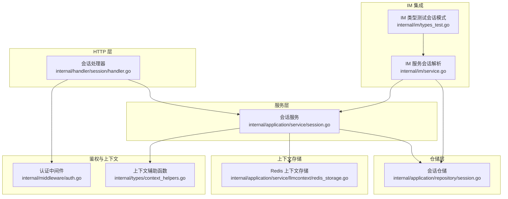
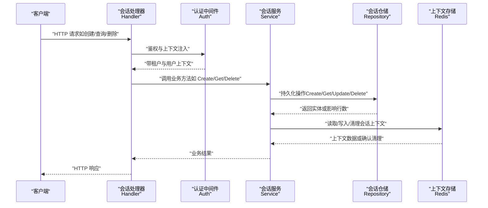
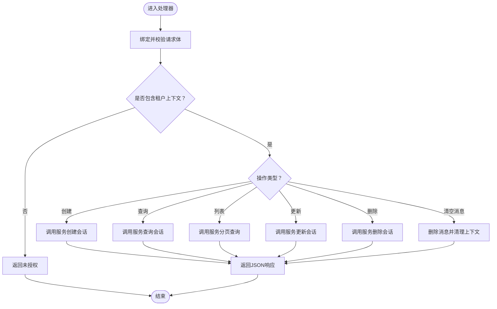
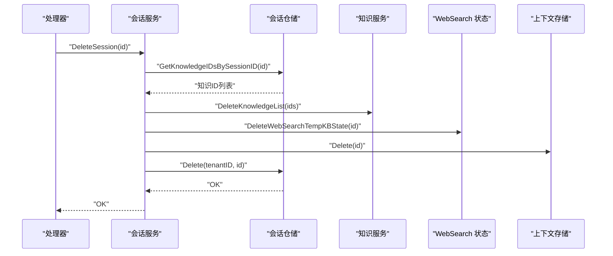
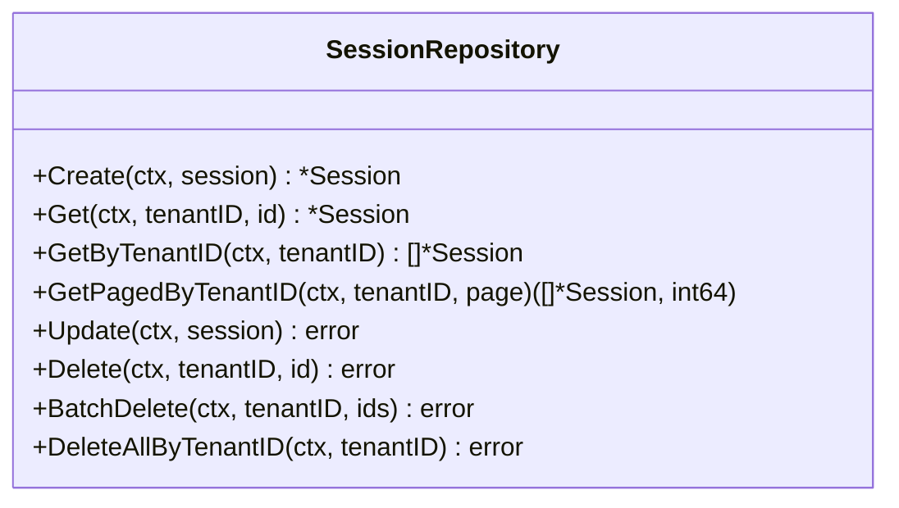
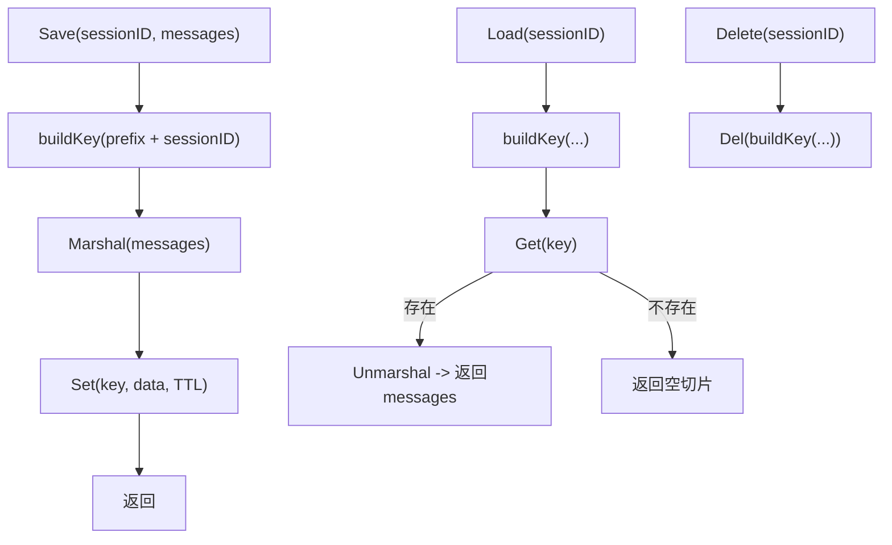
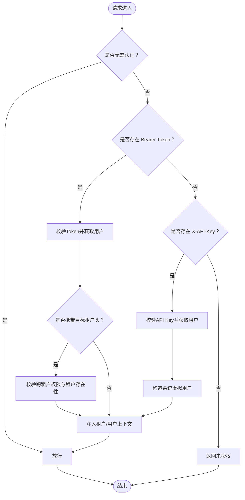
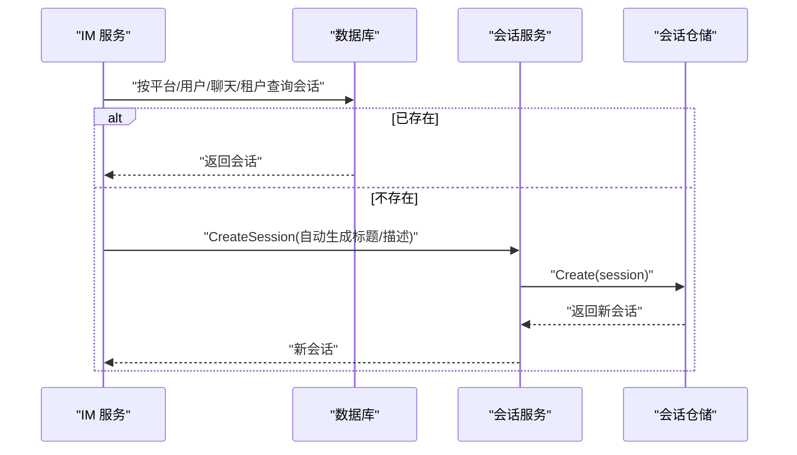
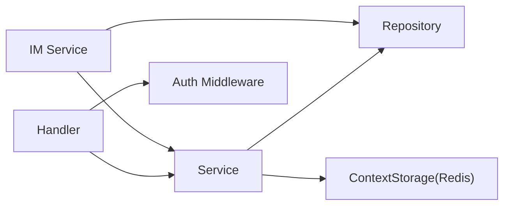

# 会话管理

<cite>
**本文引用的文件**
- [internal/handler/session/handler.go](file://internal/handler/session/handler.go)
- [internal/application/service/session.go](file://internal/application/service/session.go)
- [internal/application/repository/session.go](file://internal/application/repository/session.go)
- [internal/timeseries/types/session.go](file://internal/timeseries/types/session.go)
- [internal/middleware/auth.go](file://internal/middleware/auth.go)
- [internal/application/service/llmcontext/redis_storage.go](file://internal/application/service/llmcontext/redis_storage.go)
- [internal/types/context_helpers.go](file://internal/types/context_helpers.go)
- [internal/im/service.go](file://internal/im/service.go)
- [internal/im/types_test.go](file://internal/im/types_test.go)
- [internal/common/db_retry.go](file://internal/common/db_retry.go)
- [client/session.go](file://client/session.go)
- [frontend/src/App.vue](file://frontend/src/App.vue)
</cite>

## 目录
1. [简介](#简介)
2. [项目结构](#项目结构)
3. [核心组件](#核心组件)
4. [架构总览](#架构总览)
5. [详细组件分析](#详细组件分析)
6. [依赖分析](#依赖分析)
7. [性能考虑](#性能考虑)
8. [故障排查指南](#故障排查指南)
9. [结论](#结论)
10. [附录](#附录)

## 简介
本文件为 WeKnora 会话管理系统的技术文档，聚焦于用户会话的创建、维护与销毁机制，覆盖会话状态跟踪、上下文存储、并发控制策略、安全与防护措施，并提供最佳实践、性能优化建议与监控指标。文档同时给出 GetCurrentUser 接口的实现原理与会话数据存储方式说明，以及会话操作示例、状态检查方法与异常处理策略，帮助开发者快速实现并安全地集成会话管理能力。

## 项目结构
WeKnora 的会话管理采用典型的分层架构：HTTP 层负责路由与鉴权，服务层编排业务逻辑，仓储层负责持久化，上下文存储层负责会话级 LLM 上下文缓存。IM 通道与会话解析存在耦合，用于自动创建会话并绑定用户/线程场景。

**图表来源**
- [internal/handler/session/handler.go:1-444](file://internal/handler/session/handler.go#L1-L444)
- [internal/application/service/session.go:1-527](file://internal/application/service/session.go#L1-L527)
- [internal/application/repository/session.go:1-109](file://internal/application/repository/session.go#L1-L109)
- [internal/application/service/llmcontext/redis_storage.go:1-112](file://internal/application/service/llmcontext/redis_storage.go#L1-L112)
- [internal/middleware/auth.go:1-238](file://internal/middleware/auth.go#L1-L238)
- [internal/types/context_helpers.go:1-113](file://internal/types/context_helpers.go#L1-L113)
- [internal/im/service.go:1190-1227](file://internal/im/service.go#L1190-L1227)
- [internal/im/types_test.go:99-153](file://internal/im/types_test.go#L99-L153)

**章节来源**
- [internal/handler/session/handler.go:1-444](file://internal/handler/session/handler.go#L1-L444)
- [internal/application/service/session.go:1-527](file://internal/application/service/session.go#L1-L527)
- [internal/application/repository/session.go:1-109](file://internal/application/repository/session.go#L1-L109)
- [internal/application/service/llmcontext/redis_storage.go:1-112](file://internal/application/service/llmcontext/redis_storage.go#L1-L112)
- [internal/middleware/auth.go:1-238](file://internal/middleware/auth.go#L1-L238)
- [internal/types/context_helpers.go:1-113](file://internal/types/context_helpers.go#L1-L113)
- [internal/im/service.go:1190-1227](file://internal/im/service.go#L1190-L1227)
- [internal/im/types_test.go:99-153](file://internal/im/types_test.go#L99-L153)

## 核心组件
- 会话处理器（Handler）
  - 提供会话的创建、查询、列表、更新、删除、批量删除、清空消息等 HTTP 接口，统一进行参数校验、鉴权与错误处理。
- 会话服务（Service）
  - 实现会话生命周期管理：创建、查询、分页查询、更新、删除、批量删除、标题生成、上下文清理等；在删除时异步清理关联资源（知识条目、临时 KB、Redis 上下文）。
- 会话仓储（Repository）
  - 负责会话的增删改查与分页查询，按租户维度隔离数据。
- 上下文存储（Redis）
  - 以会话 ID 为键，存储 LLM 对话上下文消息，支持保存、加载、删除，具备 TTL 控制。
- 认证中间件（Auth）
  - 统一处理 Bearer Token 与 X-API-Key 两种认证方式，注入租户与用户上下文，支持跨租户访问控制。
- IM 会话解析
  - 在 IM 场景下根据平台、用户、聊天与线程维度解析或创建会话，确保消息与会话正确关联。

**章节来源**
- [internal/handler/session/handler.go:66-127](file://internal/handler/session/handler.go#L66-L127)
- [internal/application/service/session.go:82-334](file://internal/application/service/session.go#L82-L334)
- [internal/application/repository/session.go:22-109](file://internal/application/repository/session.go#L22-L109)
- [internal/application/service/llmcontext/redis_storage.go:49-112](file://internal/application/service/llmcontext/redis_storage.go#L49-L112)
- [internal/middleware/auth.go:66-228](file://internal/middleware/auth.go#L66-L228)
- [internal/im/service.go:1190-1227](file://internal/im/service.go#L1190-L1227)

## 架构总览
下图展示从 HTTP 请求到服务层、仓储层与上下文存储的整体交互流程，以及 IM 自动创建会话的路径。

**图表来源**
- [internal/handler/session/handler.go:78-127](file://internal/handler/session/handler.go#L78-L127)
- [internal/application/service/session.go:82-334](file://internal/application/service/session.go#L82-L334)
- [internal/application/repository/session.go:22-109](file://internal/application/repository/session.go#L22-L109)
- [internal/application/service/llmcontext/redis_storage.go:49-112](file://internal/application/service/llmcontext/redis_storage.go#L49-L112)
- [internal/middleware/auth.go:66-228](file://internal/middleware/auth.go#L66-L228)

## 详细组件分析

### 会话处理器（Handler）
- 职责
  - 接收并校验请求参数，注入租户上下文，调用服务层执行业务，返回标准化响应。
- 关键点
  - 创建会话：接收标题与描述，填充租户 ID，调用服务创建并返回新会话。
  - 查询会话：按 ID 查询，结合租户上下文进行权限校验。
  - 列表与分页：支持分页参数，返回总数与数据。
  - 更新会话：校验租户上下文，更新标题/描述等字段。
  - 删除会话：单个与批量删除，支持“删除全部”。
  - 清空消息：删除会话内消息并清理 LLM 上下文。
- 安全与输入清洗
  - 对路径与查询参数进行日志清洗，避免敏感信息泄露。

**图表来源**
- [internal/handler/session/handler.go:78-127](file://internal/handler/session/handler.go#L78-L127)
- [internal/handler/session/handler.go:141-174](file://internal/handler/session/handler.go#L141-L174)
- [internal/handler/session/handler.go:189-216](file://internal/handler/session/handler.go#L189-L216)
- [internal/handler/session/handler.go:231-287](file://internal/handler/session/handler.go#L231-L287)
- [internal/handler/session/handler.go:301-329](file://internal/handler/session/handler.go#L301-L329)
- [internal/handler/session/handler.go:344-371](file://internal/handler/session/handler.go#L344-L371)
- [internal/handler/session/handler.go:391-443](file://internal/handler/session/handler.go#L391-L443)

**章节来源**
- [internal/handler/session/handler.go:66-127](file://internal/handler/session/handler.go#L66-L127)
- [internal/handler/session/handler.go:129-174](file://internal/handler/session/handler.go#L129-L174)
- [internal/handler/session/handler.go:176-216](file://internal/handler/session/handler.go#L176-L216)
- [internal/handler/session/handler.go:218-287](file://internal/handler/session/handler.go#L218-L287)
- [internal/handler/session/handler.go:289-371](file://internal/handler/session/handler.go#L289-L371)
- [internal/handler/session/handler.go:379-443](file://internal/handler/session/handler.go#L379-L443)

### 会话服务（Service）
- 职责
  - 会话生命周期管理：创建、查询、分页、更新、删除、批量删除、标题生成、上下文清理。
- 关键点
  - 创建：校验租户 ID，调用仓储创建。
  - 查询：校验 ID，结合租户上下文查询。
  - 分页：基于仓储分页查询。
  - 更新：校验 ID，更新标题/描述并记录更新时间。
  - 删除：删除前异步清理关联知识条目、临时 KB、Redis 上下文，再删除会话。
  - 批量删除：遍历 ID 列表，逐个清理并批量删除。
  - 删除全部：先拉取全部会话，逐个清理后全量删除。
  - 标题生成：从用户消息提取首条用户消息，调用模型生成标题并回写。
  - 异步标题生成：克隆上下文关键键值，后台生成并发出事件。
  - 上下文清理：调用 Redis 存储删除对应键。
- 并发与异步
  - 删除与批量删除使用后台上下文异步清理资源，避免阻塞请求。

**图表来源**
- [internal/application/service/session.go:194-242](file://internal/application/service/session.go#L194-L242)
- [internal/application/service/session.go:244-289](file://internal/application/service/session.go#L244-L289)
- [internal/application/service/session.go:291-334](file://internal/application/service/session.go#L291-L334)

**章节来源**
- [internal/application/service/session.go:82-101](file://internal/application/service/session.go#L82-L101)
- [internal/application/service/session.go:103-129](file://internal/application/service/session.go#L103-L129)
- [internal/application/service/session.go:131-150](file://internal/application/service/session.go#L131-L150)
- [internal/application/service/session.go:152-170](file://internal/application/service/session.go#L152-L170)
- [internal/application/service/session.go:172-192](file://internal/application/service/session.go#L172-L192)
- [internal/application/service/session.go:194-242](file://internal/application/service/session.go#L194-L242)
- [internal/application/service/session.go:244-289](file://internal/application/service/session.go#L244-L289)
- [internal/application/service/session.go:291-334](file://internal/application/service/session.go#L291-L334)
- [internal/application/service/session.go:336-443](file://internal/application/service/session.go#L336-L443)
- [internal/application/service/session.go:445-527](file://internal/application/service/session.go#L445-L527)

### 会话仓储（Repository）
- 职责
  - 提供会话的创建、查询、分页、更新、删除、批量删除、全量删除。
- 关键点
  - 查询按租户过滤，保证多租户隔离。
  - 更新时仅更新标题、描述与更新时间戳。
  - 删除支持单个、批量与全量。

**图表来源**
- [internal/application/repository/session.go:22-109](file://internal/application/repository/session.go#L22-L109)

**章节来源**
- [internal/application/repository/session.go:22-109](file://internal/application/repository/session.go#L22-L109)

### 上下文存储（Redis）
- 职责
  - 以会话 ID 为键，存储 LLM 上下文消息，支持保存、加载、删除，具备 TTL。
- 关键点
  - 键构建：前缀 + 会话 ID。
  - 保存：序列化消息后写入 Redis，设置 TTL。
  - 加载：若键不存在返回空切片。
  - 删除：按键删除。

**图表来源**
- [internal/application/service/llmcontext/redis_storage.go:44-112](file://internal/application/service/llmcontext/redis_storage.go#L44-L112)

**章节来源**
- [internal/application/service/llmcontext/redis_storage.go:49-112](file://internal/application/service/llmcontext/redis_storage.go#L49-L112)

### 认证中间件（Auth）
- 职责
  - 统一处理 Bearer Token 与 X-API-Key 认证，注入租户与用户上下文；支持跨租户访问控制。
- 关键点
  - 放行无需认证的 API 列表。
  - JWT 成功后解析目标租户头，校验目标租户存在性与权限。
  - API Key 模式下构造系统虚拟用户，确保下游依赖 UserContextKey 的逻辑正常运行。

**图表来源**
- [internal/middleware/auth.go:66-228](file://internal/middleware/auth.go#L66-L228)

**章节来源**
- [internal/middleware/auth.go:20-45](file://internal/middleware/auth.go#L20-L45)
- [internal/middleware/auth.go:66-228](file://internal/middleware/auth.go#L66-L228)

### IM 会话解析与自动创建
- 职责
  - 在 IM 场景下，依据平台、用户、聊天与线程维度解析或创建会话，确保消息与会话正确关联。
- 关键点
  - 支持用户模式与线程模式两种会话模式。
  - 若未找到现有会话则自动创建，标题包含平台标识，描述说明来源。

**图表来源**
- [internal/im/service.go:1190-1227](file://internal/im/service.go#L1190-L1227)
- [internal/im/types_test.go:124-131](file://internal/im/types_test.go#L124-L131)
- [internal/im/types_test.go:133-153](file://internal/im/types_test.go#L133-L153)

**章节来源**
- [internal/im/service.go:1190-1227](file://internal/im/service.go#L1190-L1227)
- [internal/im/types_test.go:99-153](file://internal/im/types_test.go#L99-L153)

## 依赖分析
- 组件耦合
  - Handler 依赖 Service；Service 依赖 Repository 与 Context Storage；Auth 注入上下文；IM 依赖 Service 与 Repository。
- 外部依赖
  - Redis 用于上下文存储；GORM 用于数据库访问；Gin 用于 HTTP 路由与中间件。
- 循环依赖
  - 当前结构清晰，未发现循环依赖。

**图表来源**
- [internal/handler/session/handler.go:17-64](file://internal/handler/session/handler.go#L17-L64)
- [internal/application/service/session.go:26-79](file://internal/application/service/session.go#L26-L79)
- [internal/application/repository/session.go:12-21](file://internal/application/repository/session.go#L12-L21)
- [internal/application/service/llmcontext/redis_storage.go:14-42](file://internal/application/service/llmcontext/redis_storage.go#L14-L42)
- [internal/middleware/auth.go:66-228](file://internal/middleware/auth.go#L66-L228)
- [internal/im/service.go:1190-1227](file://internal/im/service.go#L1190-L1227)

**章节来源**
- [internal/handler/session/handler.go:17-64](file://internal/handler/session/handler.go#L17-L64)
- [internal/application/service/session.go:26-79](file://internal/application/service/session.go#L26-L79)
- [internal/application/repository/session.go:12-21](file://internal/application/repository/session.go#L12-L21)
- [internal/application/service/llmcontext/redis_storage.go:14-42](file://internal/application/service/llmcontext/redis_storage.go#L14-L42)
- [internal/middleware/auth.go:66-228](file://internal/middleware/auth.go#L66-L228)
- [internal/im/service.go:1190-1227](file://internal/im/service.go#L1190-L1227)

## 性能考虑
- 并发与异步清理
  - 删除与批量删除使用后台上下文清理关联资源，避免阻塞主请求。
- 数据库死锁重试
  - 提供通用的死锁重试机制，对 MySQL Error 1213 进行指数退避重试，提升高并发下的稳定性。
- Redis 上下文 TTL
  - 默认 24 小时 TTL，避免无限增长；可根据业务调整。
- IM 并发限制
  - IM 队列支持全局并发门控与 per-user 限流，防止过载。

**章节来源**
- [internal/application/service/session.go:205-219](file://internal/application/service/session.go#L205-L219)
- [internal/common/db_retry.go:13-45](file://internal/common/db_retry.go#L13-L45)
- [internal/application/service/llmcontext/redis_storage.go:29-42](file://internal/application/service/llmcontext/redis_storage.go#L29-L42)
- [internal/im/qaqueue.go:290-333](file://internal/im/qaqueue.go#L290-L333)

## 故障排查指南
- 常见错误与定位
  - 会话不存在：查询返回“会话不存在”，检查会话 ID 与租户上下文。
  - 参数非法：请求体绑定失败或 ID 为空，检查前端传参与清洗逻辑。
  - 未授权：缺少认证或 API Key 不合法，检查 Authorization 或 X-API-Key。
  - 死锁：数据库出现 Error 1213，系统已内置重试；若频繁发生，需优化热点写入。
- 日志与追踪
  - 处理器与服务层均输出结构化日志，包含会话 ID、租户 ID、请求 ID 等关键字段，便于定位问题。
- 客户端与前端
  - 客户端提供会话 CRUD 与批量删除接口；前端通过 getCurrentUser 同步用户与租户上下文，确保后续请求携带正确租户信息。

**章节来源**
- [internal/handler/session/handler.go:157-166](file://internal/handler/session/handler.go#L157-L166)
- [internal/handler/session/handler.go:262-271](file://internal/handler/session/handler.go#L262-L271)
- [internal/handler/session/handler.go:313-322](file://internal/handler/session/handler.go#L313-L322)
- [internal/common/db_retry.go:37-45](file://internal/common/db_retry.go#L37-L45)
- [client/session.go:119-168](file://client/session.go#L119-L168)
- [frontend/src/App.vue:43-69](file://frontend/src/App.vue#L43-L69)

## 结论
WeKnora 的会话管理以清晰的分层设计实现了会话的创建、维护与销毁，结合 Redis 上下文存储与严格的鉴权机制，满足多租户隔离与高并发场景需求。通过异步清理与死锁重试等机制，系统在可用性与稳定性方面具备良好表现。建议在生产环境中合理设置 Redis TTL、IM 并发门限与数据库连接池，并持续监控会话相关指标以保障性能与可靠性。

## 附录

### GetCurrentUser 接口与会话数据存储
- GetCurrentUser 实现原理
  - 前端通过 getCurrentUser 获取当前用户与租户信息，随后将用户与租户上下文写入本地状态，确保后续请求携带正确的租户 ID。
- 会话数据存储方式
  - 会话元数据存储于数据库（按租户隔离），会话级 LLM 上下文存储于 Redis，键为会话 ID，具备 TTL 控制。

**章节来源**
- [frontend/src/App.vue:43-69](file://frontend/src/App.vue#L43-L69)
- [internal/application/service/llmcontext/redis_storage.go:44-112](file://internal/application/service/llmcontext/redis_storage.go#L44-L112)

### 会话安全机制与防护
- 认证与授权
  - 支持 Bearer Token 与 API Key 双重认证；API Key 模式下构造系统虚拟用户，保证下游逻辑一致性。
  - 支持跨租户访问控制，严格校验目标租户存在性与权限。
- 输入清洗
  - 处理器对路径与查询参数进行日志清洗，降低敏感信息泄露风险。
- IM 会话模式
  - 明确区分用户模式与线程模式，避免混淆导致的会话错配。

**章节来源**
- [internal/middleware/auth.go:66-228](file://internal/middleware/auth.go#L66-L228)
- [internal/handler/session/handler.go:147-152](file://internal/handler/session/handler.go#L147-L152)
- [internal/im/types_test.go:124-131](file://internal/im/types_test.go#L124-L131)
- [internal/im/types_test.go:133-153](file://internal/im/types_test.go#L133-L153)

### 会话操作示例与状态检查
- 创建会话
  - 调用创建接口，传入标题与描述，返回新会话 ID。
- 查询会话
  - 通过会话 ID 查询详情，确认租户归属。
- 更新会话
  - 修改标题或描述，刷新更新时间。
- 删除会话
  - 单个删除或批量删除；支持“删除全部”。
- 清空消息
  - 删除会话内消息并清理 LLM 上下文。
- 状态检查
  - 通过列表接口与分页参数检查会话数量与更新时间排序。

**章节来源**
- [internal/handler/session/handler.go:78-127](file://internal/handler/session/handler.go#L78-L127)
- [internal/handler/session/handler.go:141-174](file://internal/handler/session/handler.go#L141-L174)
- [internal/handler/session/handler.go:189-216](file://internal/handler/session/handler.go#L189-L216)
- [internal/handler/session/handler.go:231-287](file://internal/handler/session/handler.go#L231-L287)
- [internal/handler/session/handler.go:289-329](file://internal/handler/session/handler.go#L289-L329)
- [internal/handler/session/handler.go:331-371](file://internal/handler/session/handler.go#L331-L371)
- [internal/handler/session/handler.go:379-443](file://internal/handler/session/handler.go#L379-L443)

### 最佳实践与性能优化建议
- 最佳实践
  - 严格按租户维度隔离数据，避免跨租户误操作。
  - 使用分页接口获取会话列表，避免一次性加载过多数据。
  - 删除会话时依赖服务层的异步清理，确保请求快速返回。
- 性能优化
  - 合理设置 Redis TTL，避免上下文无限增长。
  - IM 并发队列开启全局门控与 per-user 限流，防止过载。
  - 对热点写入场景启用数据库死锁重试，减少抖动。

**章节来源**
- [internal/application/service/session.go:205-219](file://internal/application/service/session.go#L205-L219)
- [internal/application/service/llmcontext/redis_storage.go:29-42](file://internal/application/service/llmcontext/redis_storage.go#L29-L42)
- [internal/im/qaqueue.go:290-333](file://internal/im/qaqueue.go#L290-L333)
- [internal/common/db_retry.go:13-45](file://internal/common/db_retry.go#L13-L45)