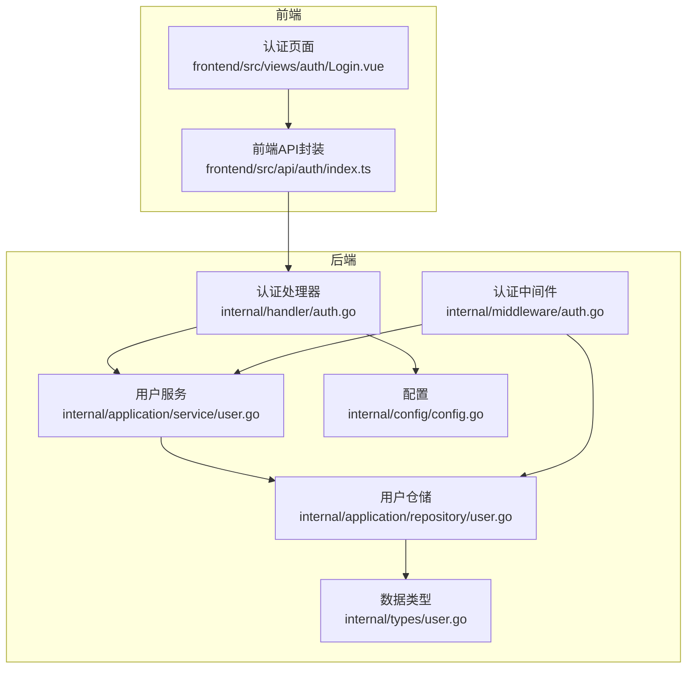
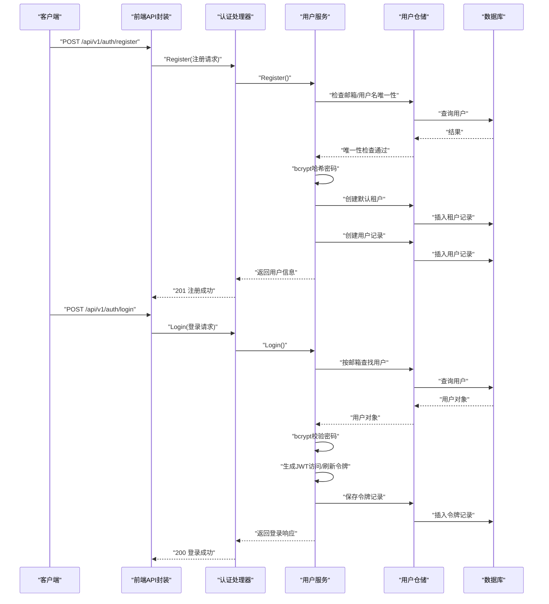
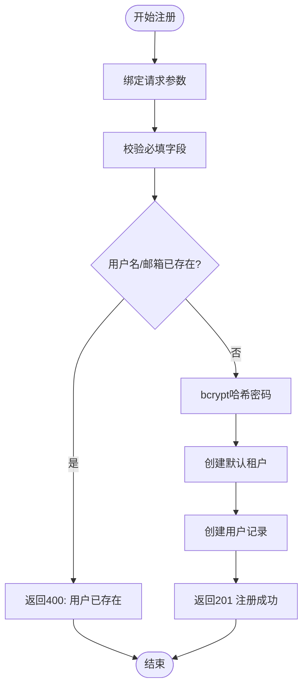
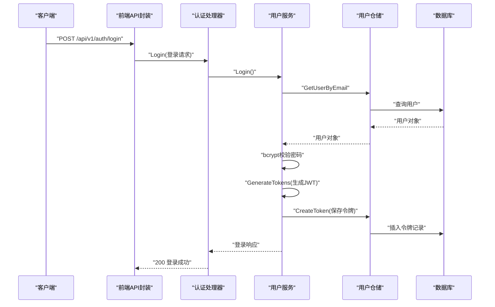
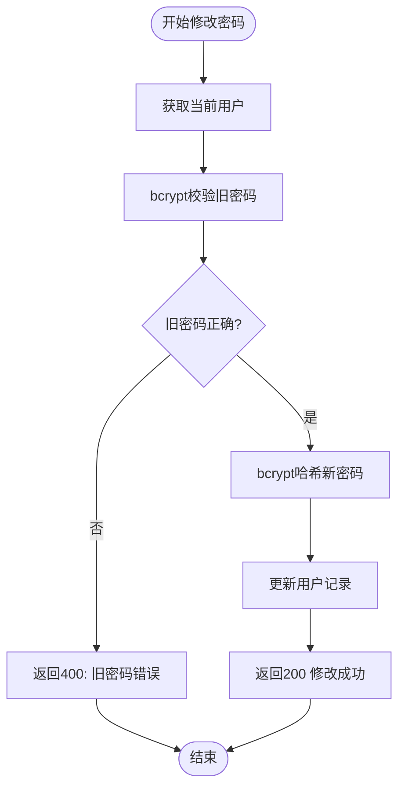
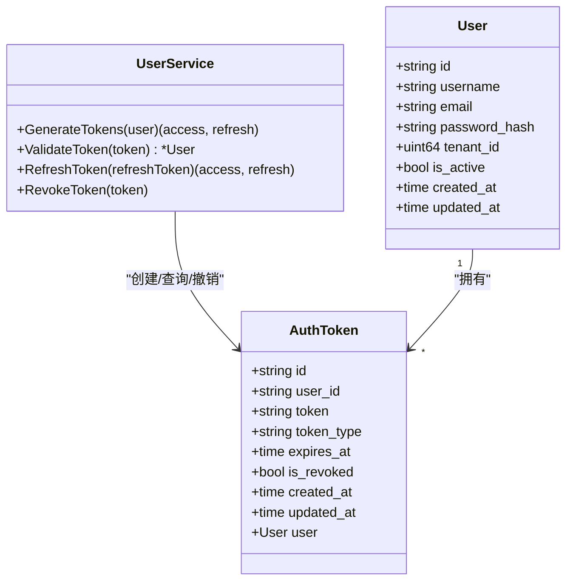
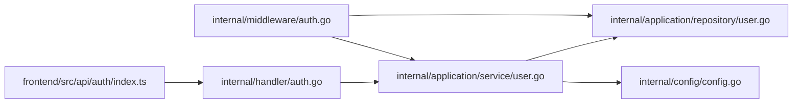

# 基础认证

<cite>
**本文档引用的文件**
- [internal/handler/auth.go](file://internal/handler/auth.go)
- [internal/middleware/auth.go](file://internal/middleware/auth.go)
- [internal/application/service/user.go](file://internal/application/service/user.go)
- [internal/application/repository/user.go](file://internal/application/repository/user.go)
- [internal/types/user.go](file://internal/types/user.go)
- [internal/config/config.go](file://internal/config/config.go)
- [frontend/src/api/auth/index.ts](file://frontend/src/api/auth/index.ts)
- [frontend/src/views/auth/Login.vue](file://frontend/src/views/auth/Login.vue)
</cite>

## 目录
1. [简介](#简介)
2. [项目结构](#项目结构)
3. [核心组件](#核心组件)
4. [架构总览](#架构总览)
5. [详细组件分析](#详细组件分析)
6. [依赖关系分析](#依赖关系分析)
7. [性能考虑](#性能考虑)
8. [故障排除指南](#故障排除指南)
9. [结论](#结论)

## 简介
本文件为 WeKnora 基础认证功能的详细技术文档，聚焦用户名密码认证的完整流程，涵盖用户注册、登录验证与密码修改的实现细节。文档将详细说明 Register 与 Login 接口的请求参数、响应格式与错误处理机制，阐述用户数据验证规则、密码加密存储策略与会话管理机制，并提供 API 调用示例、错误码说明与安全最佳实践，帮助开发者快速集成与安全使用。

## 项目结构
WeKnora 的认证模块采用典型的分层架构：
- Handler 层：负责 HTTP 请求接收、参数校验与响应封装
- Service 层：实现业务逻辑，包括用户注册、登录、密码修改、令牌生成与校验
- Repository 层：数据持久化抽象，提供用户与令牌的 CRUD 操作
- Types 层：定义数据模型与请求/响应结构
- Middleware 层：统一鉴权中间件，支持 Bearer Token 与 API Key 两种认证方式
- Frontend 层：提供前端认证页面与 API 调用封装

**图表来源**
- [internal/handler/auth.go:1-633](file://internal/handler/auth.go#L1-L633)
- [internal/middleware/auth.go:1-238](file://internal/middleware/auth.go#L1-L238)
- [internal/application/service/user.go:1-852](file://internal/application/service/user.go#L1-L852)
- [internal/application/repository/user.go:1-187](file://internal/application/repository/user.go#L1-L187)
- [internal/types/user.go:1-149](file://internal/types/user.go#L1-L149)
- [internal/config/config.go:17-758](file://internal/config/config.go#L17-L758)
- [frontend/src/api/auth/index.ts:1-305](file://frontend/src/api/auth/index.ts#L1-L305)
- [frontend/src/views/auth/Login.vue:235-664](file://frontend/src/views/auth/Login.vue#L235-L664)

**章节来源**
- [internal/handler/auth.go:1-633](file://internal/handler/auth.go#L1-L633)
- [internal/middleware/auth.go:1-238](file://internal/middleware/auth.go#L1-L238)
- [internal/application/service/user.go:1-852](file://internal/application/service/user.go#L1-L852)
- [internal/application/repository/user.go:1-187](file://internal/application/repository/user.go#L1-L187)
- [internal/types/user.go:1-149](file://internal/types/user.go#L1-L149)
- [internal/config/config.go:17-758](file://internal/config/config.go#L17-L758)
- [frontend/src/api/auth/index.ts:1-305](file://frontend/src/api/auth/index.ts#L1-L305)
- [frontend/src/views/auth/Login.vue:235-664](file://frontend/src/views/auth/Login.vue#L235-L664)

## 核心组件
- 认证处理器（AuthHandler）
  - 提供 Register、Login、Logout、RefreshToken、ChangePassword、GetCurrentUser、ValidateToken 等接口
  - 统一参数绑定与错误处理，调用 UserService 执行业务逻辑
- 认证中间件（AuthMiddleware）
  - 支持 Bearer Token 与 X-API-Key 两种认证方式
  - 自动注入用户上下文与租户信息，处理跨租户访问控制
- 用户服务（UserService）
  - 实现注册、登录、密码修改、令牌生成与校验、OIDC 登录等核心业务
  - 使用 bcrypt 进行密码哈希，JWT 生成访问与刷新令牌
- 用户仓储（UserRepository）
  - 提供用户与令牌的数据库操作接口
- 数据类型（Types）
  - 定义用户、令牌、登录/注册请求与响应等结构体
- 配置（Config）
  - OIDC 配置、租户配置等全局设置

**章节来源**
- [internal/handler/auth.go:22-108](file://internal/handler/auth.go#L22-L108)
- [internal/middleware/auth.go:65-228](file://internal/middleware/auth.go#L65-L228)
- [internal/application/service/user.go:58-142](file://internal/application/service/user.go#L58-L142)
- [internal/application/repository/user.go:18-187](file://internal/application/repository/user.go#L18-L187)
- [internal/types/user.go:9-149](file://internal/types/user.go#L9-L149)
- [internal/config/config.go:180-192](file://internal/config/config.go#L180-L192)

## 架构总览
下图展示了基础认证的端到端调用链路，从前端发起请求到后端处理与数据库交互：

**图表来源**
- [internal/handler/auth.go:57-108](file://internal/handler/auth.go#L57-L108)
- [internal/handler/auth.go:120-162](file://internal/handler/auth.go#L120-L162)
- [internal/application/service/user.go:82-142](file://internal/application/service/user.go#L82-L142)
- [internal/application/service/user.go:144-213](file://internal/application/service/user.go#L144-L213)
- [internal/application/repository/user.go:28-89](file://internal/application/repository/user.go#L28-L89)

## 详细组件分析

### 注册接口 Register
- 请求参数
  - username: 必填，长度 2-50，仅字母数字与下划线
  - email: 必填，合法邮箱格式
  - password: 必填，最小长度 6
- 响应结构
  - success: 布尔值
  - message: 成功或失败消息
  - user: 新创建的用户信息（含 id、username、email 等）
  - tenant: 默认租户信息
- 处理流程
  - 参数校验与清洗
  - 检查邮箱与用户名唯一性
  - bcrypt 哈希密码
  - 创建默认租户并关联用户
  - 持久化用户与租户
  - 返回注册成功响应
- 错误处理
  - 缺少必填参数：400 参数错误
  - 用户名/邮箱已存在：400 参数冲突
  - 注册被禁用：403 禁止访问
  - 其他异常：500 服务器内部错误

**图表来源**
- [internal/handler/auth.go:57-108](file://internal/handler/auth.go#L57-L108)
- [internal/application/service/user.go:82-142](file://internal/application/service/user.go#L82-L142)
- [internal/application/repository/user.go:45-89](file://internal/application/repository/user.go#L45-L89)

**章节来源**
- [internal/handler/auth.go:46-108](file://internal/handler/auth.go#L46-L108)
- [internal/types/user.go:97-120](file://internal/types/user.go#L97-L120)
- [internal/application/service/user.go:82-142](file://internal/application/service/user.go#L82-L142)
- [internal/application/repository/user.go:28-89](file://internal/application/repository/user.go#L28-L89)

### 登录接口 Login
- 请求参数
  - email: 必填，合法邮箱格式
  - password: 必填，最小长度 6
- 响应结构
  - success: 布尔值
  - message: 成功或失败消息
  - user: 用户信息
  - tenant: 用户所属租户信息
  - token: 访问令牌（JWT）
  - refresh_token: 刷新令牌（JWT）
- 处理流程
  - 参数校验
  - 按邮箱查找用户并校验账户状态
  - bcrypt 校验密码
  - 生成访问与刷新令牌（有效期：访问 24 小时，刷新 7 天）
  - 保存令牌记录至数据库
  - 返回登录响应
- 错误处理
  - 缺少必填参数：400 参数错误
  - 邮箱或密码错误：401 未授权
  - 账户被禁用：401 未授权
  - 其他异常：500 服务器内部错误

**图表来源**
- [internal/handler/auth.go:120-162](file://internal/handler/auth.go#L120-L162)
- [internal/application/service/user.go:144-213](file://internal/application/service/user.go#L144-L213)
- [internal/application/service/user.go:384-444](file://internal/application/service/user.go#L384-L444)
- [internal/application/repository/user.go:142-187](file://internal/application/repository/user.go#L142-L187)

**章节来源**
- [internal/handler/auth.go:110-162](file://internal/handler/auth.go#L110-L162)
- [internal/types/user.go:61-112](file://internal/types/user.go#L61-L112)
- [internal/application/service/user.go:144-213](file://internal/application/service/user.go#L144-L213)
- [internal/application/service/user.go:384-444](file://internal/application/service/user.go#L384-L444)

### 密码修改接口 ChangePassword
- 请求参数
  - old_password: 必填
  - new_password: 必填，最小长度 6
- 处理流程
  - 从上下文获取当前用户
  - 校验旧密码正确性（bcrypt）
  - 新密码进行 bcrypt 哈希并更新用户记录
- 错误处理
  - 缺少必填参数：400 参数错误
  - 非法旧密码：400 参数错误
  - 未授权：401 未授权
  - 其他异常：500 服务器内部错误

**图表来源**
- [internal/handler/auth.go:456-507](file://internal/handler/auth.go#L456-L507)
- [internal/application/service/user.go:349-372](file://internal/application/service/user.go#L349-L372)

**章节来源**
- [internal/handler/auth.go:456-507](file://internal/handler/auth.go#L456-L507)
- [internal/application/service/user.go:349-372](file://internal/application/service/user.go#L349-L372)

### 会话管理与令牌机制
- 令牌类型
  - 访问令牌（Access Token）：有效期 24 小时，HS256 签名
  - 刷新令牌（Refresh Token）：有效期 7 天，HS256 签名
- 令牌存储
  - 令牌记录保存在数据库中，包含 token、类型、过期时间、撤销标记等
- 令牌校验
  - 中间件从 Authorization 头解析 Bearer Token
  - 校验 JWT 签名与有效期
  - 查询数据库确认未被撤销
- 刷新令牌
  - 使用刷新令牌换取新的访问与刷新令牌
  - 旧刷新令牌会被撤销

**图表来源**
- [internal/types/user.go:9-59](file://internal/types/user.go#L9-L59)
- [internal/application/service/user.go:384-540](file://internal/application/service/user.go#L384-L540)
- [internal/application/repository/user.go:132-187](file://internal/application/repository/user.go#L132-L187)

**章节来源**
- [internal/application/service/user.go:384-540](file://internal/application/service/user.go#L384-L540)
- [internal/application/repository/user.go:132-187](file://internal/application/repository/user.go#L132-L187)

### OIDC 集成（补充说明）
- OIDC 授权地址获取
  - 前端调用后端 /auth/oidc/url，后端根据配置生成授权 URL 并返回 state
- OIDC 回调处理
  - 后端接收 code 与 state，交换令牌并获取用户信息
  - 若用户不存在则自动创建本地用户
  - 生成本地访问与刷新令牌并返回给前端
- OIDC 配置
  - 支持 discovery_url 或显式 endpoints
  - 支持自定义用户信息映射字段

**章节来源**
- [internal/handler/auth.go:164-217](file://internal/handler/auth.go#L164-L217)
- [internal/handler/auth.go:219-276](file://internal/handler/auth.go#L219-L276)
- [internal/application/service/user.go:215-316](file://internal/application/service/user.go#L215-L316)
- [internal/config/config.go:180-192](file://internal/config/config.go#L180-L192)

## 依赖关系分析
- Handler 依赖 Service 与 Config
- Service 依赖 UserRepository、AuthTokenRepository 与 Config
- Middleware 依赖 UserService 与 TenantService
- Frontend API 封装依赖后端接口定义

**图表来源**
- [frontend/src/api/auth/index.ts:1-305](file://frontend/src/api/auth/index.ts#L1-L305)
- [internal/handler/auth.go:1-633](file://internal/handler/auth.go#L1-L633)
- [internal/middleware/auth.go:1-238](file://internal/middleware/auth.go#L1-L238)
- [internal/application/service/user.go:1-852](file://internal/application/service/user.go#L1-L852)
- [internal/application/repository/user.go:1-187](file://internal/application/repository/user.go#L1-L187)
- [internal/config/config.go:17-758](file://internal/config/config.go#L17-L758)

**章节来源**
- [frontend/src/api/auth/index.ts:1-305](file://frontend/src/api/auth/index.ts#L1-L305)
- [internal/handler/auth.go:1-633](file://internal/handler/auth.go#L1-L633)
- [internal/middleware/auth.go:1-238](file://internal/middleware/auth.go#L1-L238)
- [internal/application/service/user.go:1-852](file://internal/application/service/user.go#L1-L852)
- [internal/application/repository/user.go:1-187](file://internal/application/repository/user.go#L1-L187)
- [internal/config/config.go:17-758](file://internal/config/config.go#L17-L758)

## 性能考虑
- 密码哈希成本：bcrypt 默认成本已足够安全，避免过度提升导致登录延迟
- 令牌存储：令牌记录写入数据库，建议开启索引（token、user_id、expires_at）
- 中间件鉴权：优先使用 Bearer Token，减少不必要的 API Key 校验
- OIDC 令牌交换：异步调用外部 OIDC 提供商，注意超时与重试策略

## 故障排除指南
- 常见错误码
  - 400 参数错误：请求参数缺失或格式不合法
  - 401 未授权：登录失败、令牌无效或账户被禁用
  - 403 禁止访问：注册被禁用或 OIDC 未启用
  - 500 服务器内部错误：服务异常或数据库操作失败
- 常见问题定位
  - 注册失败：检查用户名/邮箱唯一性、密码强度、注册开关
  - 登录失败：确认邮箱/密码正确、账户状态正常、JWT 密钥配置
  - 令牌无效：检查令牌是否过期或已被撤销、签名算法与密钥一致
  - OIDC 登录失败：核对 discovery_url 或 endpoints、client_id/secret、回调地址

**章节来源**
- [internal/handler/auth.go:57-108](file://internal/handler/auth.go#L57-L108)
- [internal/handler/auth.go:120-162](file://internal/handler/auth.go#L120-L162)
- [internal/application/service/user.go:384-540](file://internal/application/service/user.go#L384-L540)

## 结论
WeKnora 的基础认证模块提供了完善的用户名密码认证能力，具备严格的参数校验、安全的密码存储与令牌管理机制。通过清晰的分层设计与中间件统一鉴权，开发者可以快速集成并安全地使用认证接口。建议在生产环境中：
- 强制启用 HTTPS 与安全传输
- 定期轮换 JWT 密钥与 OIDC 密钥
- 启用令牌撤销与定期清理过期令牌
- 对敏感日志输出进行脱敏处理