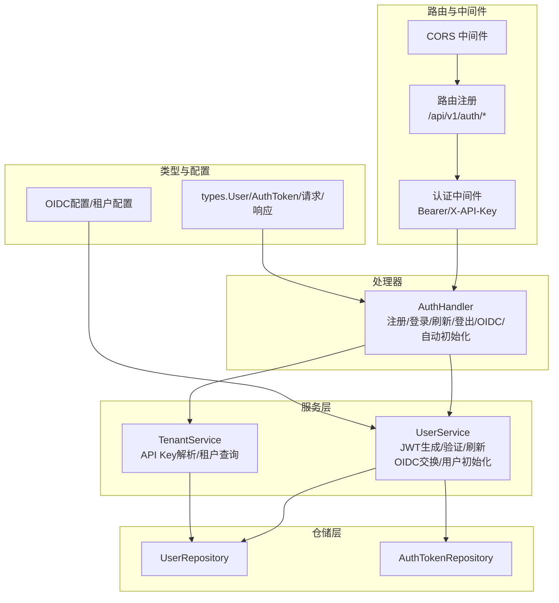
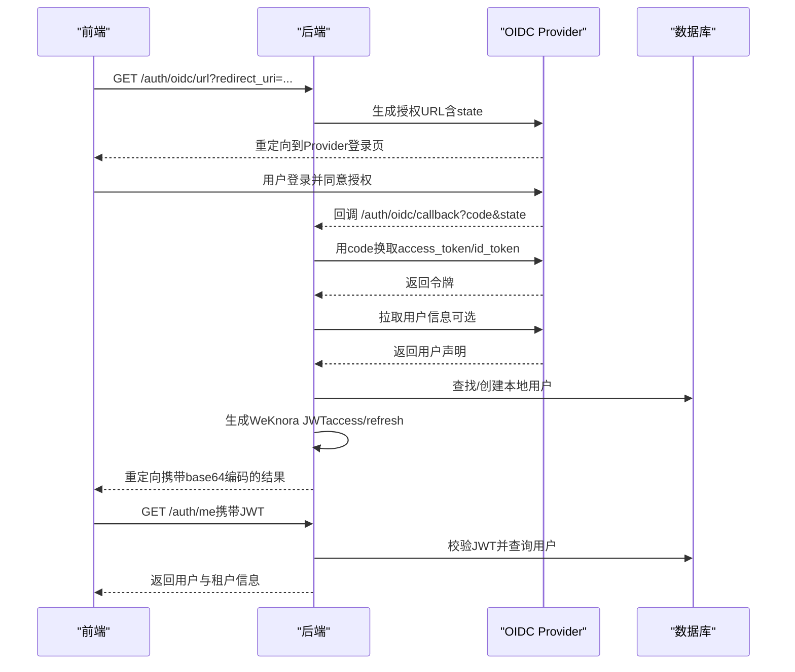
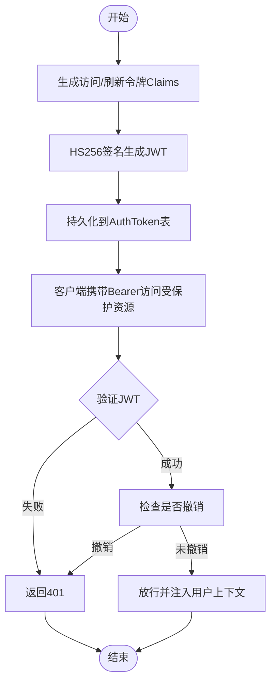
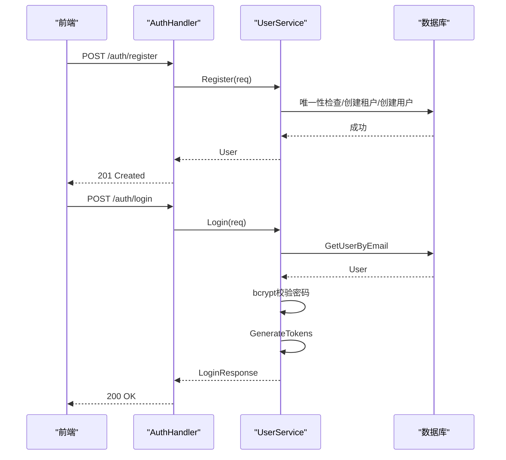
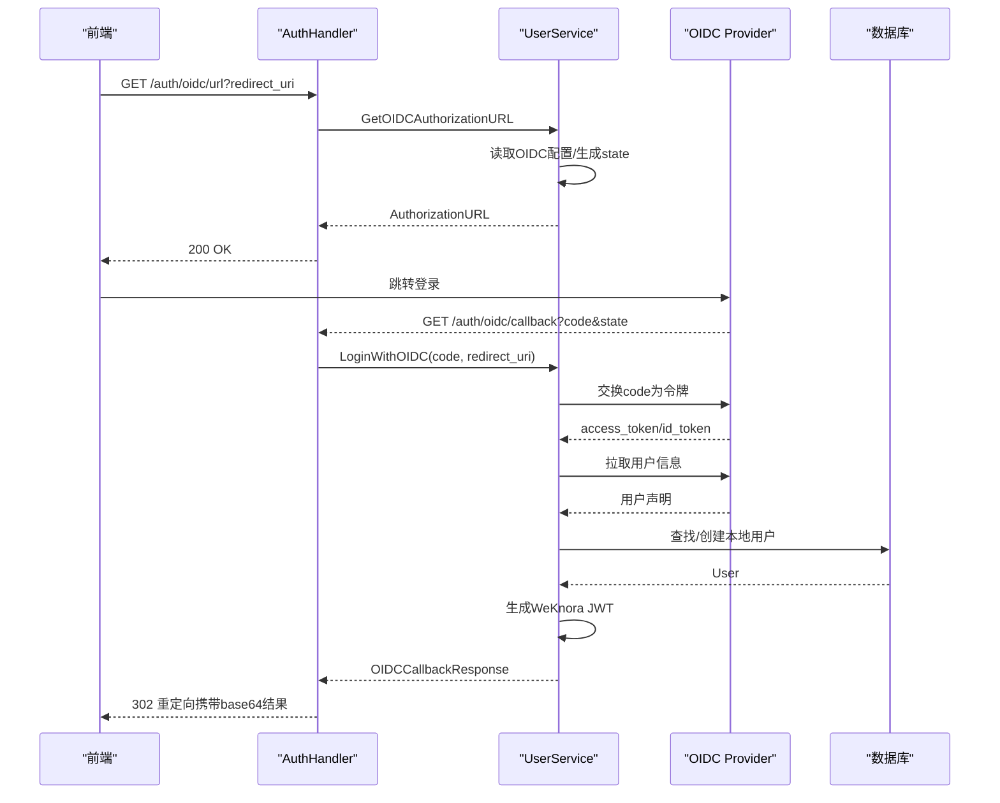
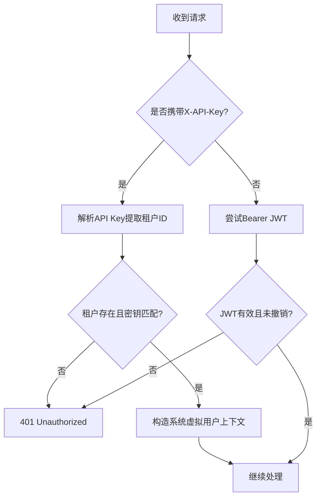
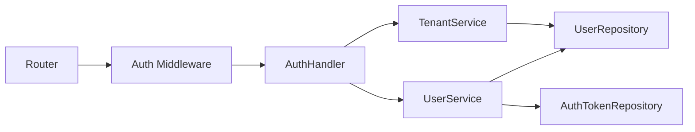

# 认证机制

<cite>
**本文引用的文件**
- [internal/handler/auth.go](file://internal/handler/auth.go)
- [internal/middleware/auth.go](file://internal/middleware/auth.go)
- [internal/application/service/user.go](file://internal/application/service/user.go)
- [internal/application/repository/user.go](file://internal/application/repository/user.go)
- [internal/router/router.go](file://internal/router/router.go)
- [internal/config/config.go](file://internal/config/config.go)
- [internal/types/user.go](file://internal/types/user.go)
- [internal/types/interfaces/user.go](file://internal/types/interfaces/user.go)
- [internal/types/interfaces/tenant.go](file://internal/types/interfaces/tenant.go)
- [internal/application/service/tenant.go](file://internal/application/service/tenant.go)
- [docs/OIDC认证调用流程.md](file://docs/OIDC认证调用流程.md)
</cite>

## 目录
1. [简介](#简介)
2. [项目结构](#项目结构)
3. [核心组件](#核心组件)
4. [架构总览](#架构总览)
5. [详细组件分析](#详细组件分析)
6. [依赖分析](#依赖分析)
7. [性能考虑](#性能考虑)
8. [故障排除指南](#故障排除指南)
9. [结论](#结论)
10. [附录](#附录)

## 简介
本文件为 WeKnora 认证机制的完整技术文档，覆盖以下主题：
- JWT 令牌管理：生成、验证与刷新
- 用户注册与登录流程：用户名/密码认证
- OIDC 第三方认证集成：授权地址生成、回调处理、用户自动初始化
- API 密钥认证机制与令牌撤销策略
- 认证中间件工作原理、安全头设置与会话管理策略
- 配置项说明与最佳实践建议
- 故障排除方法

WeKnora 采用“后端签发本地 JWT”的双层认证模型：前端通过 OIDC Provider 获取用户身份，后端将其映射为本地用户并签发 WeKnora 自有的 JWT 令牌，从而实现业务访问凭证与第三方身份解耦。

## 项目结构
认证相关代码主要分布在如下模块：
- 路由与中间件：路由注册、认证中间件、CORS
- 处理器：认证相关 HTTP 接口（注册、登录、刷新、登出、OIDC、自动初始化等）
- 服务层：用户服务（JWT 生成/验证/刷新、OIDC 交换、用户自动初始化）、租户服务（API Key 解析）
- 仓储层：用户与令牌持久化
- 类型与接口：用户、令牌、请求/响应结构与服务接口
- 配置：OIDC 配置、租户配置等

图表来源
- [internal/router/router.go:407-420](file://internal/router/router.go#L407-L420)
- [internal/middleware/auth.go:65-228](file://internal/middleware/auth.go#L65-L228)
- [internal/handler/auth.go:22-44](file://internal/handler/auth.go#L22-L44)
- [internal/application/service/user.go:58-79](file://internal/application/service/user.go#L58-L79)
- [internal/application/repository/user.go:18-26](file://internal/application/repository/user.go#L18-L26)
- [internal/config/config.go:175-192](file://internal/config/config.go#L175-L192)

章节来源
- [internal/router/router.go:407-420](file://internal/router/router.go#L407-L420)
- [internal/middleware/auth.go:65-228](file://internal/middleware/auth.go#L65-L228)
- [internal/handler/auth.go:22-44](file://internal/handler/auth.go#L22-L44)
- [internal/application/service/user.go:58-79](file://internal/application/service/user.go#L58-L79)
- [internal/application/repository/user.go:18-26](file://internal/application/repository/user.go#L18-L26)
- [internal/config/config.go:175-192](file://internal/config/config.go#L175-L192)

## 核心组件
- 认证处理器（AuthHandler）：提供注册、登录、刷新、登出、OIDC、自动初始化、校验令牌、获取当前用户等接口。
- 认证中间件（Auth Middleware）：统一拦截请求，支持 Bearer JWT 与 X-API-Key 两种认证方式，并处理跨租户访问。
- 用户服务（UserService）：实现 JWT 生成/验证/刷新、OIDC 代码交换、用户信息拉取与自动初始化、令牌撤销。
- 租户服务（TenantService）：提供 API Key 解析（提取租户ID）、租户查询与权限校验。
- 仓储层：用户与令牌的持久化操作。
- 配置：OIDC 配置（发现地址、端点、作用域、用户信息映射）与租户配置。

章节来源
- [internal/handler/auth.go:46-108](file://internal/handler/auth.go#L46-L108)
- [internal/middleware/auth.go:65-228](file://internal/middleware/auth.go#L65-L228)
- [internal/application/service/user.go:58-79](file://internal/application/service/user.go#L58-L79)
- [internal/application/service/tenant.go:280-313](file://internal/application/service/tenant.go#L280-L313)
- [internal/application/repository/user.go:132-186](file://internal/application/repository/user.go#L132-L186)
- [internal/config/config.go:175-192](file://internal/config/config.go#L175-L192)

## 架构总览
WeKnora 的认证体系遵循“前端只负责跳转、后端负责令牌交换”的原则：
- OIDC：前端发起跳转至 Provider，后端接收回调，用授权码换取 Provider 的访问令牌与用户信息，映射为本地用户并签发 WeKnora 的 JWT。
- 用户名/密码：后端直接验证凭据，成功后签发 JWT。
- 刷新：使用刷新令牌换取新的访问令牌。
- 登出：撤销当前访问令牌。
- API Key：兼容模式，通过加密的 API Key 提取租户ID，构造系统虚拟用户上下文。

图表来源
- [internal/handler/auth.go:164-217](file://internal/handler/auth.go#L164-L217)
- [internal/handler/auth.go:219-276](file://internal/handler/auth.go#L219-L276)
- [internal/application/service/user.go:260-316](file://internal/application/service/user.go#L260-L316)
- [docs/OIDC认证调用流程.md:28-64](file://docs/OIDC认证调用流程.md#L28-L64)

章节来源
- [internal/handler/auth.go:164-276](file://internal/handler/auth.go#L164-L276)
- [internal/application/service/user.go:260-316](file://internal/application/service/user.go#L260-L316)
- [docs/OIDC认证调用流程.md:28-64](file://docs/OIDC认证调用流程.md#L28-L64)

## 详细组件分析

### JWT 令牌管理
- 令牌类型与有效期
  - 访问令牌（access_token）：默认 24 小时
  - 刷新令牌（refresh_token）：默认 7 天
- 令牌生成
  - Claims 包含 user_id、email、tenant_id、iat、exp、type
  - 使用 HS256 签名，密钥来自环境变量 JWT_SECRET，若未设置则随机生成
- 令牌验证
  - 校验签名算法与密钥
  - 校验 claims 结构与 user_id
  - 查询数据库确认未被撤销
- 刷新流程
  - 使用刷新令牌换取新的访问令牌
  - 旧刷新令牌标记为撤销，防止重复使用
- 令牌撤销
  - 支持按值撤销单个令牌
  - 支持按用户撤销所有令牌

图表来源
- [internal/application/service/user.go:384-444](file://internal/application/service/user.go#L384-L444)
- [internal/application/service/user.go:446-476](file://internal/application/service/user.go#L446-L476)
- [internal/application/service/user.go:478-527](file://internal/application/service/user.go#L478-L527)
- [internal/application/repository/user.go:142-186](file://internal/application/repository/user.go#L142-L186)

章节来源
- [internal/application/service/user.go:384-527](file://internal/application/service/user.go#L384-L527)
- [internal/application/repository/user.go:142-186](file://internal/application/repository/user.go#L142-L186)

### 用户注册与登录（用户名/密码）
- 注册
  - 校验输入参数与邮箱/用户名唯一性
  - 为用户创建默认租户
  - 密码使用 bcrypt 哈希
- 登录
  - 根据邮箱查找用户
  - 校验账户状态与密码
  - 生成访问/刷新令牌并返回

图表来源
- [internal/handler/auth.go:46-108](file://internal/handler/auth.go#L46-L108)
- [internal/application/service/user.go:81-142](file://internal/application/service/user.go#L81-L142)
- [internal/application/service/user.go:144-213](file://internal/application/service/user.go#L144-L213)

章节来源
- [internal/handler/auth.go:46-108](file://internal/handler/auth.go#L46-L108)
- [internal/application/service/user.go:81-213](file://internal/application/service/user.go#L81-L213)

### OIDC 第三方认证集成
- 授权地址生成
  - 读取 OIDC 配置（发现地址或显式端点）
  - 生成 state 并编码，拼接授权 URL
- 回调处理
  - 校验错误参数与 state
  - 用授权码交换 Provider 令牌
  - 拉取用户信息（优先 id_token 声明，其次 userinfo 端点）
  - 自动创建本地用户（若不存在）
  - 生成 WeKnora JWT 并返回给前端
- 配置与映射
  - 支持 discovery_url 或显式 authorization_endpoint/token_endpoint/userinfo_endpoint
  - 用户信息字段映射（用户名/邮箱）

图表来源
- [internal/handler/auth.go:164-276](file://internal/handler/auth.go#L164-L276)
- [internal/application/service/user.go:215-316](file://internal/application/service/user.go#L215-L316)
- [docs/OIDC认证调用流程.md:28-64](file://docs/OIDC认证调用流程.md#L28-L64)

章节来源
- [internal/handler/auth.go:164-276](file://internal/handler/auth.go#L164-L276)
- [internal/application/service/user.go:215-316](file://internal/application/service/user.go#L215-L316)
- [docs/OIDC认证调用流程.md:28-64](file://docs/OIDC认证调用流程.md#L28-L64)

### API 密钥认证与令牌撤销策略
- API Key 认证（兼容模式）
  - 从 Header X-API-Key 读取
  - 解析 API Key 提取租户ID（AES-GCM 加密）
  - 校验租户存在与密钥一致
  - 构造系统虚拟用户上下文（便于下游处理）
- 令牌撤销
  - 支持按值撤销单个令牌
  - 支持按用户撤销所有令牌
  - 验证阶段检查 IsRevoked 标记

图表来源
- [internal/middleware/auth.go:158-222](file://internal/middleware/auth.go#L158-L222)
- [internal/application/service/tenant.go:280-313](file://internal/application/service/tenant.go#L280-L313)
- [internal/application/service/user.go:529-540](file://internal/application/service/user.go#L529-L540)
- [internal/application/repository/user.go:178-186](file://internal/application/repository/user.go#L178-L186)

章节来源
- [internal/middleware/auth.go:158-222](file://internal/middleware/auth.go#L158-L222)
- [internal/application/service/tenant.go:280-313](file://internal/application/service/tenant.go#L280-L313)
- [internal/application/service/user.go:529-540](file://internal/application/service/user.go#L529-L540)
- [internal/application/repository/user.go:178-186](file://internal/application/repository/user.go#L178-L186)

### 认证中间件与会话管理
- 中间件职责
  - 忽略预检请求（OPTIONS）
  - 白名单放行（健康检查、注册、登录、自动初始化、OIDC配置/URL/回调、刷新）
  - Bearer JWT 认证：校验签名、claims、撤销状态，注入用户与租户上下文
  - X-API-Key 认证：解析租户ID，构造系统虚拟用户上下文
  - 跨租户访问：支持通过 X-Tenant-ID 切换目标租户（需权限）
- 会话管理
  - 通过上下文传递用户、租户、用户ID
  - 令牌撤销即刻生效，避免会话复用

章节来源
- [internal/middleware/auth.go:20-228](file://internal/middleware/auth.go#L20-L228)
- [internal/router/router.go:117-129](file://internal/router/router.go#L117-L129)

### 安全头与 CORS
- CORS
  - 允许来源：*
  - 允许方法：GET, POST, PUT, PATCH, DELETE, OPTIONS
  - 允许头部：Origin, Content-Type, Accept, Authorization, X-API-Key, X-Request-ID
  - 暴露头部：Content-Length, Access-Control-Allow-Origin
  - 凭据允许：true
  - 最大缓存：12 小时
- Swagger 文档
  - 非 release 模式下启用，支持持久化认证信息

章节来源
- [internal/router/router.go:76-84](file://internal/router/router.go#L76-L84)
- [internal/router/router.go:98-107](file://internal/router/router.go#L98-L107)

## 依赖分析
- 组件耦合
  - AuthHandler 依赖 UserService、TenantService 与配置
  - UserService 依赖 UserRepository、AuthTokenRepository、TenantService 与配置
  - 认证中间件依赖 UserService、TenantService 与配置
- 关键依赖链
  - 路由 -> 认证中间件 -> 处理器 -> 服务 -> 仓储
- 无循环依赖迹象

图表来源
- [internal/router/router.go:117-129](file://internal/router/router.go#L117-L129)
- [internal/middleware/auth.go:65-70](file://internal/middleware/auth.go#L65-L70)
- [internal/handler/auth.go:25-44](file://internal/handler/auth.go#L25-L44)
- [internal/application/service/user.go:58-79](file://internal/application/service/user.go#L58-L79)

章节来源
- [internal/router/router.go:117-129](file://internal/router/router.go#L117-L129)
- [internal/middleware/auth.go:65-70](file://internal/middleware/auth.go#L65-L70)
- [internal/handler/auth.go:25-44](file://internal/handler/auth.go#L25-L44)
- [internal/application/service/user.go:58-79](file://internal/application/service/user.go#L58-L79)

## 性能考虑
- JWT 生成/验证为内存计算，成本低
- 令牌撤销检查为数据库单条查询，建议为 token 字段建立索引（代码中已有 index）
- OIDC 交换与用户信息拉取涉及外部 HTTP 请求，建议：
  - 合理设置超时
  - 缓存常用用户信息（谨慎处理一致性）
  - 限制并发与重试次数
- API Key 解析为对称加解密，成本较低

## 故障排除指南
- OIDC 相关
  - “OIDC 未启用”：检查配置 OIDCAuth.Enable 与必要端点
  - “缺少授权码/状态无效”：确认回调参数与 state 编解码
  - “用户信息缺失”：确认 Provider 返回 email，或正确配置 UserInfoMapping
- JWT 相关
  - “令牌无效/过期”：检查签名密钥与有效期；使用刷新接口
  - “令牌已撤销”：确认是否被撤销或用户被禁用
- API Key 相关
  - “API Key 格式无效/被篡改”：检查编码与完整性
  - “租户不存在”：确认租户ID是否正确
- 通用
  - “跨租户访问被拒绝”：确认用户具备跨租户权限且目标租户存在
  - “注册被禁用”：检查环境变量 DISABLE_REGISTRATION

章节来源
- [internal/handler/auth.go:164-276](file://internal/handler/auth.go#L164-L276)
- [internal/application/service/user.go:215-316](file://internal/application/service/user.go#L215-L316)
- [internal/application/service/user.go:446-527](file://internal/application/service/user.go#L446-L527)
- [internal/application/service/tenant.go:280-313](file://internal/application/service/tenant.go#L280-L313)
- [internal/middleware/auth.go:47-63](file://internal/middleware/auth.go#L47-L63)

## 结论
WeKnora 的认证体系以“本地 JWT 为核心、OIDC 身份为入口、API Key 为兼容”的设计，既满足多租户与跨租户访问需求，又提供了完善的令牌生命周期管理与安全控制。通过明确的接口与中间件拦截，系统实现了高内聚、低耦合的认证架构。

## 附录

### 配置选项
- OIDC 配置（OIDCAuth）
  - enable：是否启用 OIDC
  - issuer_url/discovery_url：发现地址或 Issuer URL
  - authorization_endpoint/token_endpoint/userinfo_endpoint：显式端点
  - client_id/client_secret：客户端凭据
  - scopes：授权范围
  - user_info_mapping.username/email：用户信息字段映射
- 租户配置（Tenant）
  - enable_cross_tenant_access：是否启用跨租户访问

章节来源
- [internal/config/config.go:175-192](file://internal/config/config.go#L175-L192)
- [internal/config/config.go:166-173](file://internal/config/config.go#L166-L173)

### API 接口清单
- 注册：POST /api/v1/auth/register
- 登录：POST /api/v1/auth/login
- OIDC 配置：GET /api/v1/auth/oidc/config
- OIDC 授权 URL：GET /api/v1/auth/oidc/url
- OIDC 回调：GET /api/v1/auth/oidc/callback
- 刷新：POST /api/v1/auth/refresh
- 校验：GET /api/v1/auth/validate
- 登出：POST /api/v1/auth/logout
- 当前用户：GET /api/v1/auth/me
- 修改密码：POST /api/v1/auth/change-password
- 自动初始化（Lite）：POST /api/v1/auth/auto-setup

章节来源
- [internal/router/router.go:407-420](file://internal/router/router.go#L407-L420)
- [internal/handler/auth.go:46-108](file://internal/handler/auth.go#L46-L108)
- [internal/handler/auth.go:164-276](file://internal/handler/auth.go#L164-L276)
- [internal/handler/auth.go:370-412](file://internal/handler/auth.go#L370-L412)
- [internal/handler/auth.go:582-632](file://internal/handler/auth.go#L582-L632)
- [internal/handler/auth.go:414-507](file://internal/handler/auth.go#L414-L507)
- [internal/handler/auth.go:509-580](file://internal/handler/auth.go#L509-L580)