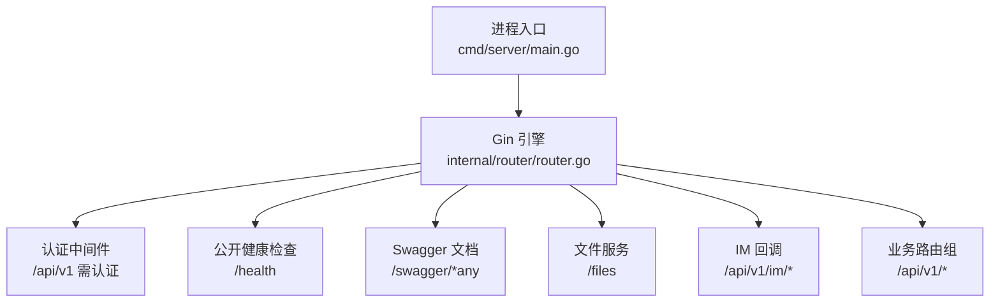
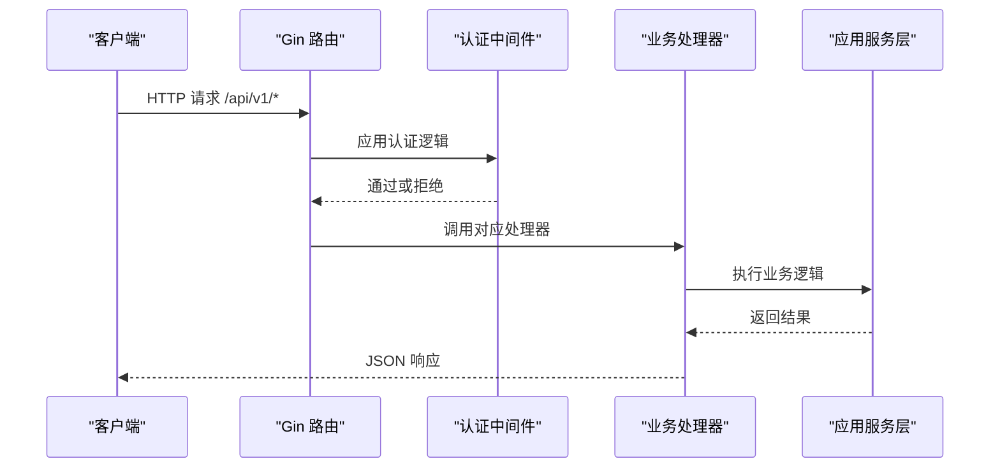
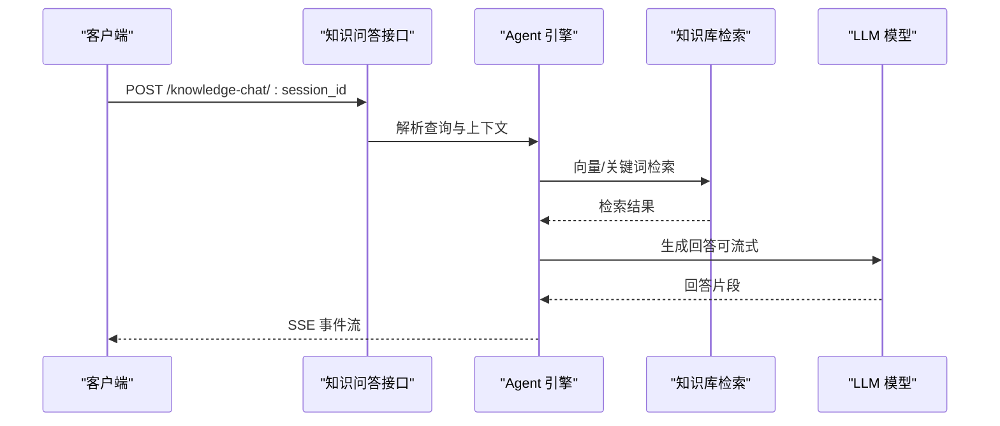
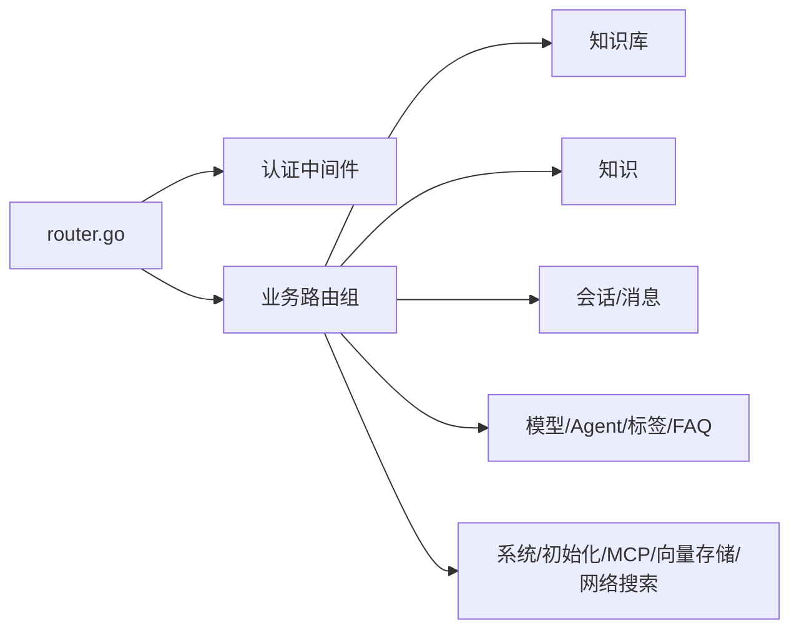

# API参考文档

<cite>
**本文档引用的文件**
- [main.go](file://cmd/server/main.go)
- [router.go](file://internal/router/router.go)
- [swagger.yaml](file://docs/swagger.yaml)
- [swagger.json](file://docs/swagger.json)
- [README.md](file://docs/api/README.md)
- [chat.md](file://docs/api/chat.md)
- [knowledge.md](file://docs/api/knowledge.md)
- [session.md](file://docs/api/session.md)
- [model.md](file://docs/api/model.md)
- [agent.md](file://docs/api/agent.md)
- [knowledge-base.md](file://docs/api/knowledge-base.md)
- [tag.md](file://docs/api/tag.md)
- [faq.md](file://docs/api/faq.md)
- [message.md](file://docs/api/message.md)
</cite>

## 目录
1. [简介](#简介)
2. [项目结构](#项目结构)
3. [核心组件](#核心组件)
4. [架构总览](#架构总览)
5. [详细组件分析](#详细组件分析)
6. [依赖分析](#依赖分析)
7. [性能考虑](#性能考虑)
8. [故障排查指南](#故障排查指南)
9. [结论](#结论)
10. [附录](#附录)

## 简介
WeKnora 提供一套完整的知识库管理与智能问答 API，支持知识入库、RAG 检索、Agent 智能体问答、会话管理、模型管理、标签与 FAQ 管理等功能。本文档面向开发者与集成方，系统梳理 RESTful API 的 HTTP 方法、URL 模式、请求参数、响应格式与错误处理，并补充认证机制、版本管理、速率限制与安全建议。

## 项目结构
WeKnora 采用 Go Gin 框架构建后端服务，路由在运行时注册，Swagger 文档在非生产环境自动暴露。核心入口负责启动 HTTP 服务器与优雅关闭，路由层统一挂载认证中间件与各类资源路由组。



**图表来源**
- [main.go:43-123](file://cmd/server/main.go#L43-L123)
- [router.go:71-161](file://internal/router/router.go#L71-L161)

**章节来源**
- [main.go:43-123](file://cmd/server/main.go#L43-L123)
- [router.go:71-161](file://internal/router/router.go#L71-L161)

## 核心组件
- 基础路径：/api/v1
- 认证方式：
  - Bearer Token（JWT）
  - X-API-Key（租户级 API Key）
- 响应格式：JSON
- 错误格式：统一错误对象，包含 code、message、details
- 版本管理：当前版本 1.0，基础路径 /api/v1
- 速率限制：代码中未发现显式全局限流实现，建议在网关或反向代理层配置
- 安全建议：
  - 使用 HTTPS
  - 严格管理 X-API-Key
  - 限制 Swagger 在生产环境暴露
  - 为每个请求设置唯一 X-Request-ID 便于追踪

**章节来源**
- [main.go:4-23](file://cmd/server/main.go#L4-L23)
- [router.go:94-107](file://internal/router/router.go#L94-L107)

## 架构总览
WeKnora 的 API 架构围绕 Gin 路由与中间件体系组织，认证中间件在 Swagger 之后、IM 回调之前注册，确保 IM 平台回调使用各自签名验证而不受统一 Bearer 认证影响。



**图表来源**
- [router.go:117-158](file://internal/router/router.go#L117-L158)

**章节来源**
- [router.go:117-158](file://internal/router/router.go#L117-L158)

## 详细组件分析

### 认证与授权
- Bearer 认证：Authorization: Bearer {token}
- 租户 API Key：X-API-Key: sk-...
- 请求追踪：X-Request-ID: unique_request_id
- OIDC 支持：提供 OIDC 配置、授权 URL 与回调接口

**章节来源**
- [main.go:14-22](file://cmd/server/main.go#L14-L22)
- [router.go:117-118](file://internal/router/router.go#L117-L118)
- [swagger.yaml:1-100](file://docs/swagger.yaml#L1-L100)

### 聊天与问答
- 知识库问答：POST /knowledge-chat/:session_id
- Agent 问答：POST /agent-chat/:session_id
- 知识检索：POST /knowledge-search
- 流式响应：SSE（text/event-stream）



**图表来源**
- [chat.md:11-57](file://docs/api/chat.md#L11-L57)

**章节来源**
- [chat.md:5-153](file://docs/api/chat.md#L5-L153)

### 知识库管理
- 创建：POST /knowledge-bases
- 列表：GET /knowledge-bases
- 详情：GET /knowledge-bases/:id
- 更新：PUT /knowledge-bases/:id
- 删除：DELETE /knowledge-bases/:id
- 拷贝：POST /knowledge-bases/copy
- 混合搜索：GET /knowledge-bases/:id/hybrid-search
- 置顶：PUT /knowledge-bases/:id/pin
- 目标迁移：GET /knowledge-bases/:id/move-targets

**章节来源**
- [knowledge-base.md:12-729](file://docs/api/knowledge-base.md#L12-L729)

### 知识管理
- 从文件创建：POST /knowledge-bases/:id/knowledge/file
- 从 URL 创建：POST /knowledge-bases/:id/knowledge/url
- 手工创建：POST /knowledge-bases/:id/knowledge/manual
- 批量获取：GET /knowledge/batch
- 更新：PUT /knowledge/:id
- 更新手工：PUT /knowledge/manual/:id
- 更新图像分块：PUT /knowledge/image/:id/:chunk_id
- 标签批量更新：PUT /knowledge/tags
- 重新解析：POST /knowledge/:id/reparse
- 搜索：GET /knowledge/search
- 迁移：POST /knowledge/move
- 预览：GET /knowledge/:id/preview
- 下载：GET /knowledge/:id/download

**章节来源**
- [knowledge.md:5-683](file://docs/api/knowledge.md#L5-L683)

### 会话管理
- 创建：POST /sessions
- 列表：GET /sessions
- 详情：GET /sessions/:id
- 更新：PUT /sessions/:id
- 删除：DELETE /sessions/:id
- 清空消息：DELETE /sessions/:id/messages
- 批量删除：DELETE /sessions/batch
- 生成标题：POST /sessions/:session_id/generate_title
- 停止生成：POST /sessions/:session_id/stop
- 继续流：GET /sessions/continue-stream/:session_id

**章节来源**
- [session.md:5-373](file://docs/api/session.md#L5-L373)

### 模型管理
- 服务商列表：GET /models/providers
- 创建模型：POST /models
- 列表：GET /models
- 详情：GET /models/:id
- 更新：PUT /models/:id
- 删除：DELETE /models/:id

**章节来源**
- [model.md:5-502](file://docs/api/model.md#L5-L502)

### 智能体管理
- 列表：GET /agents
- 创建：POST /agents
- 详情：GET /agents/:id
- 更新：PUT /agents/:id
- 删除：DELETE /agents/:id
- 复制：POST /agents/:id/copy
- 占位符：GET /agents/placeholders

**章节来源**
- [agent.md:26-534](file://docs/api/agent.md#L26-L534)

### 标签管理
- 列表：GET /knowledge-bases/:id/tags
- 创建：POST /knowledge-bases/:id/tags
- 更新：PUT /knowledge-bases/:id/tags/:tag_id
- 删除：DELETE /knowledge-bases/:id/tags/:tag_id

**章节来源**
- [tag.md:5-151](file://docs/api/tag.md#L5-L151)

### FAQ 管理
- 列表：GET /knowledge-bases/:id/faq/entries
- 批量导入：POST /knowledge-bases/:id/faq/entries
- 创建：POST /knowledge-bases/:id/faq/entry
- 详情：GET /knowledge-bases/:id/faq/entries/:entry_id
- 更新：PUT /knowledge-bases/:id/faq/entries/:entry_id
- 添加相似问题：POST /knowledge-bases/:id/faq/entries/:entry_id/similar-questions
- 批量更新字段：PUT /knowledge-bases/:id/faq/entries/fields
- 批量更新标签：PUT /knowledge-bases/:id/faq/entries/tags
- 批量删除：DELETE /knowledge-bases/:id/faq/entries
- 搜索：POST /knowledge-bases/:id/faq/search
- 导出：GET /knowledge-bases/:id/faq/entries/export
- 导入进度：GET /faq/import/progress/:task_id
- 更新导入结果显示状态：PUT /knowledge-bases/:id/faq/import/last-result/display

**章节来源**
- [faq.md:5-503](file://docs/api/faq.md#L5-L503)

### 消息管理
- 加载消息：GET /messages/:session_id/load
- 删除消息：DELETE /messages/:session_id/:id
- 搜索历史：POST /messages/search
- 聊天历史统计：GET /messages/chat-history-stats

**章节来源**
- [message.md:5-267](file://docs/api/message.md#L5-L267)

### WebSocket 与实时交互
- SSE 流式响应：text/event-stream
- 继续流：GET /sessions/continue-stream/:session_id
- 适用场景：Agent 推理步骤、工具调用、引用列表、最终答案等分段推送

**章节来源**
- [chat.md:43-57](file://docs/api/chat.md#L43-L57)
- [session.md:352-373](file://docs/api/session.md#L352-L373)

## 依赖分析
- 路由注册集中在 internal/router/router.go，按功能域分组注册
- Swagger 文档由 docs/swagger.yaml/swagger.json 提供，包含统一错误定义与模型
- 认证中间件在路由组 /api/v1 之前注册，IM 回调路由在认证前注册以适配平台签名



**图表来源**
- [router.go:131-158](file://internal/router/router.go#L131-L158)

**章节来源**
- [router.go:131-158](file://internal/router/router.go#L131-L158)

## 性能考虑
- 流式响应：SSE 降低首字节延迟，提升用户体验
- 检索策略：向量与关键词混合检索，可调阈值与 TopK
- 批量操作：批量导入/更新/删除减少往返
- 缓存：静态文件服务设置缓存头，减少重复传输
- 建议：在网关层实施速率限制与连接数限制，结合服务端点的并发控制

[本节为通用指导，不涉及具体文件分析]

## 故障排查指南
- 统一错误格式：包含 code、message、details
- 常见错误码：参见 swagger.yaml 中的 errors.ErrorCode 枚举
- 健康检查：GET /health
- 日志与追踪：设置 X-Request-ID，结合服务端日志定位问题
- Swagger 文档：非生产环境可访问 /swagger/*any 查看接口定义与示例

**章节来源**
- [swagger.yaml:25-84](file://docs/swagger.yaml#L25-L84)
- [router.go:94-96](file://internal/router/router.go#L94-L96)

## 结论
WeKnora API 以清晰的 RESTful 设计覆盖知识库全生命周期与智能问答场景，结合 SSE 实现实时流式响应。通过统一认证与错误处理，开发者可快速集成并稳定运行。建议在生产环境中强化安全与限流策略，并充分利用 Swagger 文档与 SDK 示例进行对接。

[本节为总结性内容，不涉及具体文件分析]

## 附录

### API 分类概览
- 认证管理：/auth/*
- 租户管理：/tenants/*
- 知识库管理：/knowledge-bases/*
- 知识管理：/knowledge/*
- 分块管理：/chunks/*
- 标签管理：/knowledge-bases/:id/tags/*
- FAQ 管理：/knowledge-bases/:id/faq/*
- 智能体管理：/agents/*
- 会话管理：/sessions/*
- 聊天功能：/knowledge-chat /agent-chat /knowledge-search
- 消息管理：/messages/*
- 评估功能：/evaluation/*
- 初始化管理：/initialization/*
- 系统管理：/system/*
- MCP 服务：/mcp-services/*
- 组织管理：/organizations/* 与共享
- Skills：/skills/*
- 网络搜索：/web-search/*
- 向量存储：/vector-stores/*
- 数据源：/datasource/*

**章节来源**
- [README.md:56-83](file://docs/api/README.md#L56-L83)

### curl 命令示例
- 获取知识库列表
  ```bash
  curl -X GET "http://localhost:8080/api/v1/knowledge-bases" \
    -H "X-API-Key: sk-xxxxx"
  ```
- 创建知识库
  ```bash
  curl -X POST "http://localhost:8080/api/v1/knowledge-bases" \
    -H "X-API-Key: sk-xxxxx" \
    -H "Content-Type: application/json" \
    -d '{"name":"测试知识库","type":"document"}'
  ```

**章节来源**
- [knowledge-base.md:161-241](file://docs/api/knowledge-base.md#L161-L241)

### SDK 使用指南
- 建议：基于 Swagger 文档生成 SDK，或使用官方提供的 Go 客户端
- 注意：正确设置认证头（Authorization 或 X-API-Key），并处理统一错误响应
- 流式处理：SSE 场景需逐行解析 event 与 data 字段

[本节为通用指导，不涉及具体文件分析]