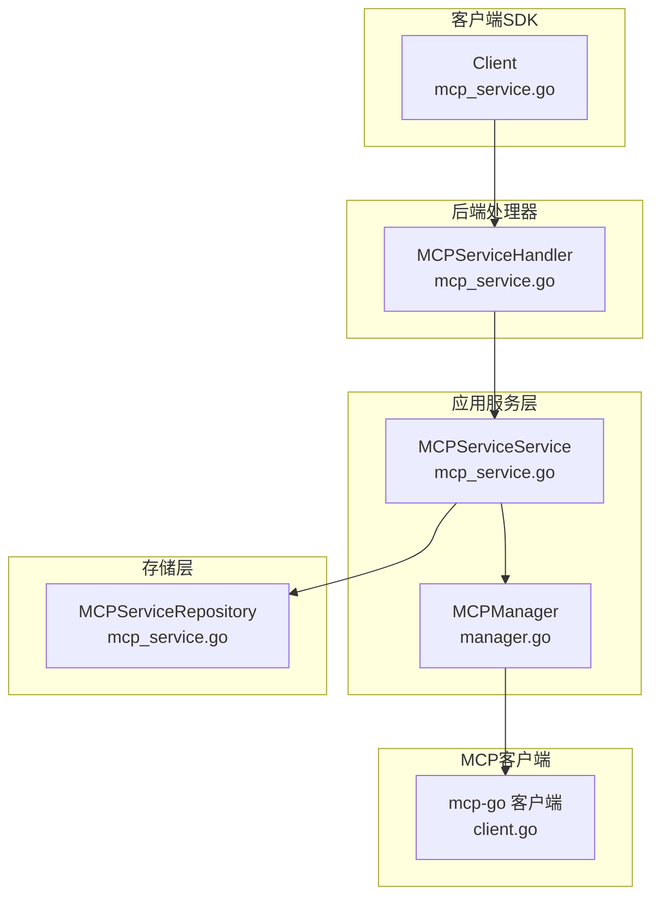
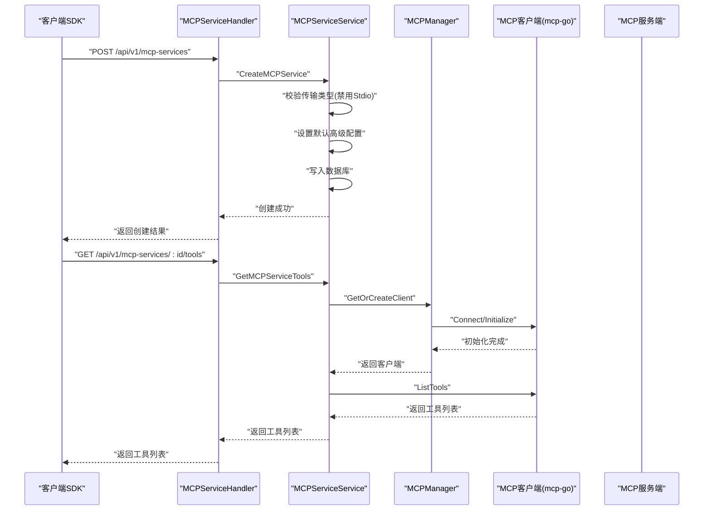
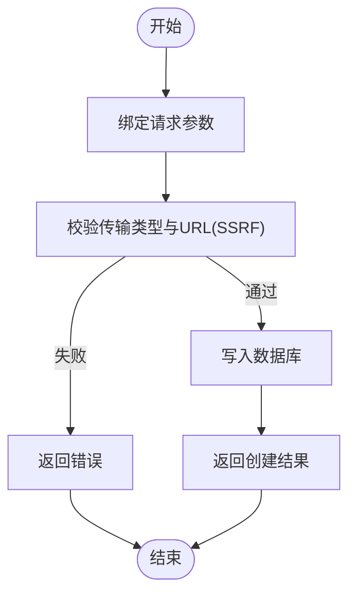
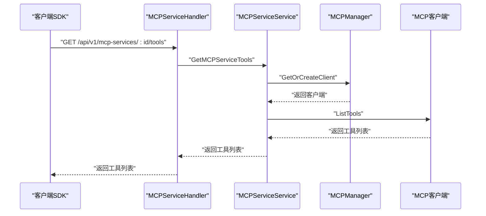
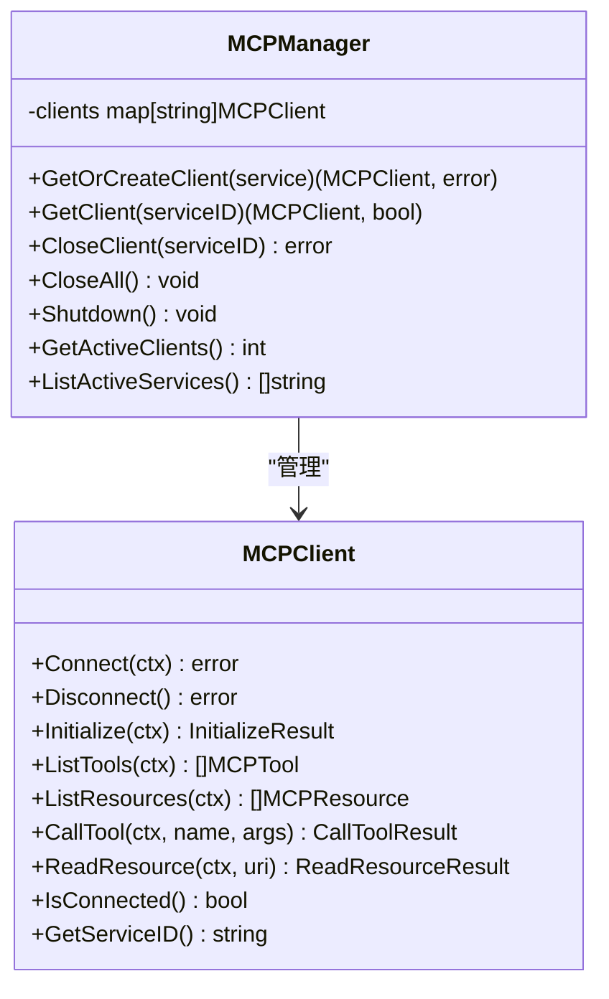
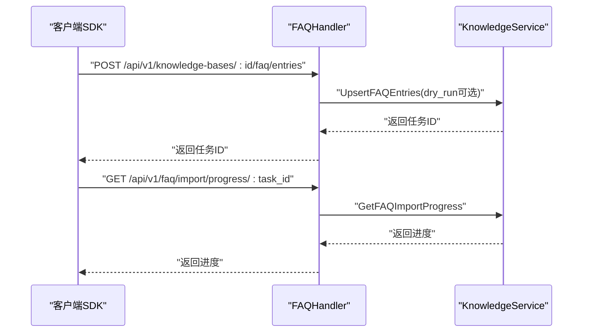
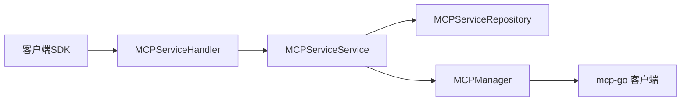

# MCP服务API

<cite>
**本文档引用的文件**
- [mcp_service.go](file://client/mcp_service.go)
- [mcp_service.go](file://internal/handler/mcp_service.go)
- [mcp_service.go](file://internal/application/service/mcp_service.go)
- [mcp_service.go](file://internal/application/repository/mcp_service.go)
- [types.go](file://internal/mcp/types.go)
- [client.go](file://internal/mcp/client.go)
- [manager.go](file://internal/mcp/manager.go)
- [mcp-service.md](file://docs/api/mcp-service.md)
- [faq.go](file://client/faq.go)
- [faq.go](file://internal/handler/faq.go)
- [faq.md](file://docs/api/faq.md)
- [vectorstore_healthcheck.go](file://internal/application/service/vectorstore_healthcheck.go)
</cite>

## 目录
1. [简介](#简介)
2. [项目结构](#项目结构)
3. [核心组件](#核心组件)
4. [架构总览](#架构总览)
5. [详细组件分析](#详细组件分析)
6. [依赖关系分析](#依赖关系分析)
7. [性能考虑](#性能考虑)
8. [故障排查指南](#故障排查指南)
9. [结论](#结论)
10. [附录](#附录)

## 简介
本文件为 WeKnora MCP 服务 API 的完整技术文档，覆盖 MCP 服务的注册、发现、管理与调用全流程，包含工具定义、参数验证、执行结果处理、MCP 协议兼容性与扩展机制、FAQ 系统与知识问答 API、以及服务健康检查与连接管理。文档同时提供开发与调试指南，帮助开发者快速集成与维护 MCP 服务。

## 项目结构
WeKnora 的 MCP 功能由客户端 SDK、后端处理器、应用服务层、存储层与 MCP 客户端管理器共同组成，形成清晰的分层架构：

- 客户端 SDK：封装 HTTP 请求与响应解析，暴露 MCP 服务 CRUD、测试、工具与资源查询等方法
- 处理器层：基于 Gin 框架实现 REST API，负责鉴权、参数绑定、业务校验与错误处理
- 应用服务层：实现业务逻辑，包括 MCP 服务生命周期管理、连接测试、工具与资源发现
- 存储层：基于 GORM 实现 MCP 服务的持久化，支持多租户与内置服务可见性
- MCP 客户端管理器：统一管理 SSE/HTTP Streamable 连接，提供连接复用、初始化与断开能力

**图表来源**
- [mcp_service.go:82-208](file://client/mcp_service.go#L82-L208)
- [mcp_service.go:39-448](file://internal/handler/mcp_service.go#L39-L448)
- [mcp_service.go:32-394](file://internal/application/service/mcp_service.go#L32-L394)
- [manager.go:40-96](file://internal/mcp/manager.go#L40-L96)
- [client.go:63-135](file://internal/mcp/client.go#L63-L135)

**章节来源**
- [mcp_service.go:1-208](file://client/mcp_service.go#L1-L208)
- [mcp_service.go:1-448](file://internal/handler/mcp_service.go#L1-L448)
- [mcp_service.go:1-408](file://internal/application/service/mcp_service.go#L1-L408)
- [mcp_service.go:1-147](file://internal/application/repository/mcp_service.go#L1-L147)
- [manager.go:1-226](file://internal/mcp/manager.go#L1-L226)
- [client.go:1-379](file://internal/mcp/client.go#L1-L379)

## 核心组件
- MCP 服务模型与配置
  - 传输类型：SSE、HTTP Streamable、Stdio（禁用）
  - 认证配置：API Key、Token、自定义头部
  - 高级配置：超时、重试次数、重试间隔
  - 环境变量与 stdio 配置（仅 Stdio）
- MCP 客户端接口与管理器
  - 支持连接建立、初始化握手、工具与资源列举、工具调用与资源读取
  - 连接缓存与清理、会话失效检测与自动断开
- 处理器与服务层
  - 提供完整的 CRUD、测试连接、工具与资源查询接口
  - 安全校验（SSRF）、敏感信息遮罩、内置服务可见性控制

**章节来源**
- [mcp-service.md:1-397](file://docs/api/mcp-service.md#L1-L397)
- [types.go:21-88](file://internal/types/mcp.go#L21-L88)
- [client.go:19-47](file://internal/mcp/client.go#L19-L47)
- [manager.go:13-35](file://internal/mcp/manager.go#L13-L35)

## 架构总览
下图展示了从客户端到后端处理器、应用服务与 MCP 客户端的整体交互流程，以及连接管理器对 SSE/HTTP Streamable 的统一管理。

**图表来源**
- [mcp_service.go:39-110](file://internal/handler/mcp_service.go#L39-L110)
- [mcp_service.go:32-112](file://internal/application/service/mcp_service.go#L32-L112)
- [manager.go:40-96](file://internal/mcp/manager.go#L40-L96)
- [client.go:164-258](file://internal/mcp/client.go#L164-L258)

## 详细组件分析

### MCP 服务注册与管理 API
- 创建 MCP 服务
  - 支持 SSE 与 HTTP Streamable 两种传输类型；Stdio 已禁用
  - URL 必填于 SSE/HTTP Streamable 场景；认证配置可选
  - 高级配置包含超时、重试次数与重试间隔
- 列表与详情
  - 支持按租户过滤与内置服务可见性控制
  - 内置服务在列表与详情中对敏感信息进行遮罩
- 更新与删除
  - 不允许更新/删除内置服务
  - 更新时对关键配置变更进行连接关闭与重建判断
- 测试连接
  - 临时创建客户端，执行连接与初始化握手
  - 成功时返回工具与资源清单

**图表来源**
- [mcp_service.go:39-76](file://internal/handler/mcp_service.go#L39-L76)
- [mcp_service.go:32-54](file://internal/application/service/mcp_service.go#L32-L54)

**章节来源**
- [mcp-service.md:16-104](file://docs/api/mcp-service.md#L16-L104)
- [mcp_service.go:39-110](file://internal/handler/mcp_service.go#L39-L110)
- [mcp_service.go:32-93](file://internal/application/service/mcp_service.go#L32-L93)

### MCP 工具与资源接口
- 工具列表
  - 通过已建立的客户端执行工具列举，转换为内部工具模型
- 资源列表
  - 通过已建立的客户端执行资源列举，转换为内部资源模型
- 工具调用与资源读取
  - 工具调用返回内容项（文本/图片），资源读取返回文本或二进制内容

**图表来源**
- [mcp_service.go:389-411](file://internal/handler/mcp_service.go#L389-L411)
- [mcp_service.go:336-364](file://internal/application/service/mcp_service.go#L336-L364)
- [manager.go:40-96](file://internal/mcp/manager.go#L40-L96)
- [client.go:234-258](file://internal/mcp/client.go#L234-L258)

**章节来源**
- [mcp-service.md:314-396](file://docs/api/mcp-service.md#L314-L396)
- [mcp_service.go:389-447](file://internal/handler/mcp_service.go#L389-L447)
- [mcp_service.go:336-394](file://internal/application/service/mcp_service.go#L336-L394)

### MCP 客户端与连接管理
- 客户端接口
  - Connect/Disconnect：建立与断开连接
  - Initialize：执行初始化握手
  - ListTools/ListResources：列举工具与资源
  - CallTool/ReadResource：调用工具与读取资源
  - IsConnected/GetServiceID：连接状态与服务标识
- 连接管理器
  - 缓存与复用 SSE/HTTP Streamable 客户端
  - 初始化超时控制与会话失效检测（Invalid session ID/No active connection）
  - 周期性清理断开连接

**图表来源**
- [client.go:19-47](file://internal/mcp/client.go#L19-L47)
- [manager.go:13-35](file://internal/mcp/manager.go#L13-L35)

**章节来源**
- [client.go:1-379](file://internal/mcp/client.go#L1-L379)
- [manager.go:1-226](file://internal/mcp/manager.go#L1-L226)

### MCP 协议兼容性与扩展机制
- 协议版本与能力
  - 初始化握手使用最新协议版本
  - 服务器能力包括工具、资源、提示词与日志等
- 结果模型
  - 工具调用结果包含内容项（文本/图片）
  - 资源读取结果包含文本或二进制内容
- 扩展能力
  - 通过 ServerCapabilities 的 experimental 字段预留扩展点
  - 支持资源订阅与列表变更通知

**章节来源**
- [types.go:1-67](file://internal/mcp/types.go#L1-L67)

### FAQ 系统与知识问答 API
- FAQ 管理
  - 列表分页与筛选（标签、关键词、字段范围、排序）
  - 批量导入（异步任务，支持 dry-run）
  - 单条创建、更新、删除
  - 相似问题追加、字段批量更新、标签批量更新
  - 导出为 CSV
- 搜索
  - 混合搜索，支持两级优先级标签召回
- 导入进度与结果显示状态
  - 通过任务 ID 查询进度
  - 控制导入结果卡片显示状态

**图表来源**
- [faq.go:157-186](file://internal/handler/faq.go#L157-L186)
- [faq.go:547-562](file://internal/handler/faq.go#L547-L562)

**章节来源**
- [faq.md:1-503](file://docs/api/faq.md#L1-L503)
- [faq.go:198-469](file://client/faq.go#L198-L469)
- [faq.go:82-659](file://internal/handler/faq.go#L82-L659)

## 依赖关系分析
- 客户端 SDK 依赖后端处理器提供的 REST 接口
- 处理器依赖应用服务层实现业务逻辑
- 应用服务层依赖存储层进行数据持久化，并通过 MCP 管理器与外部 MCP 服务通信
- MCP 客户端基于第三方 mcp-go 库实现协议交互

**图表来源**
- [mcp_service.go:82-208](file://client/mcp_service.go#L82-L208)
- [mcp_service.go:39-448](file://internal/handler/mcp_service.go#L39-L448)
- [mcp_service.go:32-394](file://internal/application/service/mcp_service.go#L32-L394)
- [manager.go:40-96](file://internal/mcp/manager.go#L40-L96)

**章节来源**
- [mcp_service.go:1-208](file://client/mcp_service.go#L1-L208)
- [mcp_service.go:1-448](file://internal/handler/mcp_service.go#L1-L448)
- [mcp_service.go:1-408](file://internal/application/service/mcp_service.go#L1-L408)
- [mcp_service.go:1-147](file://internal/application/repository/mcp_service.go#L1-L147)
- [manager.go:1-226](file://internal/mcp/manager.go#L1-L226)

## 性能考虑
- 连接复用
  - SSE/HTTP Streamable 客户端在管理器中缓存并复用，减少握手与初始化开销
- 初始化超时
  - 初始化阶段设置上限超时，避免阻塞
- 清理策略
  - 周期性清理断开连接，释放资源
- 并发安全
  - 管理器使用读写锁保护客户端映射，确保并发安全

**章节来源**
- [manager.go:172-197](file://internal/mcp/manager.go#L172-L197)
- [manager.go:98-120](file://internal/mcp/manager.go#L98-L120)

## 故障排查指南
- 连接失败
  - 检查传输类型与 URL 配置，确认服务可达
  - 查看初始化握手是否超时
- 会话失效
  - 当出现 "Invalid session ID" 或 "No active connection" 错误时，客户端会自动断开并触发重新连接
- 测试失败
  - 使用测试接口查看工具与资源清单，定位 MCP 服务端能力
- FAQ 导入异常
  - 通过任务 ID 查询进度，查看失败原因与条目索引
  - 使用 dry-run 模式预检数据质量

**章节来源**
- [client.go:143-161](file://internal/mcp/client.go#L143-L161)
- [mcp_service.go:261-334](file://internal/application/service/mcp_service.go#L261-L334)
- [faq.go:438-452](file://client/faq.go#L438-L452)

## 结论
WeKnora 的 MCP 服务 API 提供了从注册、管理到调用的完整能力，结合连接管理器实现了高效稳定的外部服务集成。配合 FAQ 系统与知识问答 API，可满足企业级智能问答与工具编排需求。通过严格的参数校验、安全策略与健康检查机制，保障系统在复杂环境中的可靠性与可维护性。

## 附录
- 常用健康检查
  - 向量数据库健康检查示例（Elasticsearch、PostgreSQL、Qdrant、Milvus、Weaviate）
- 开发与调试建议
  - 使用测试接口验证 MCP 服务连通性与能力
  - 对高频调用场景启用连接复用与合理的超时配置
  - 对内置服务进行敏感信息遮罩与可见性控制

**章节来源**
- [vectorstore_healthcheck.go:25-50](file://internal/application/service/vectorstore_healthcheck.go#L25-L50)