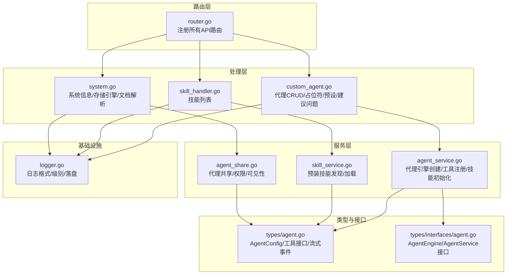
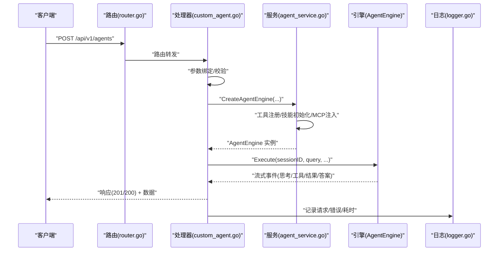
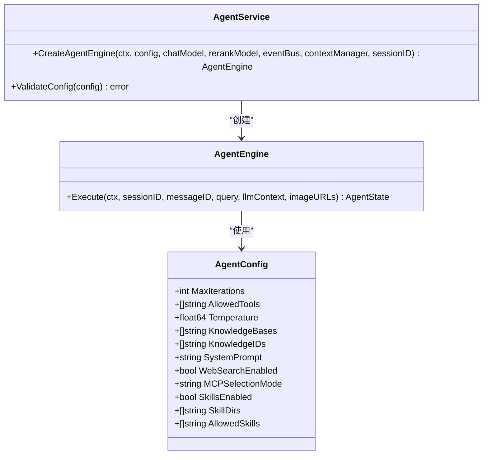
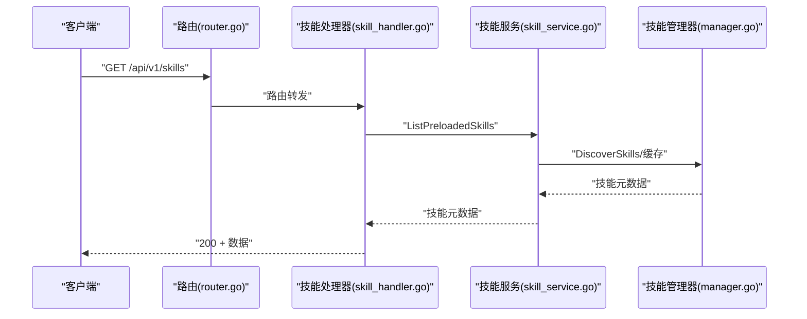
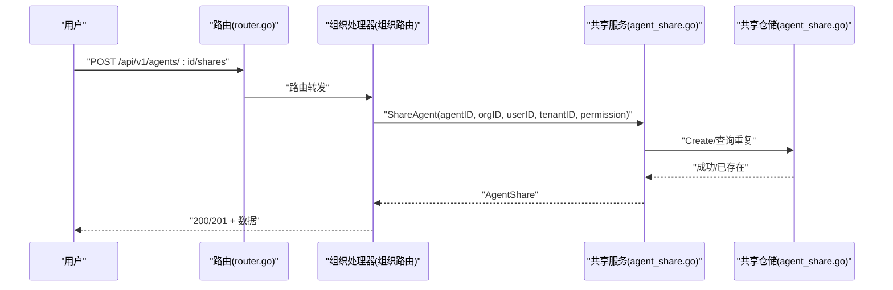
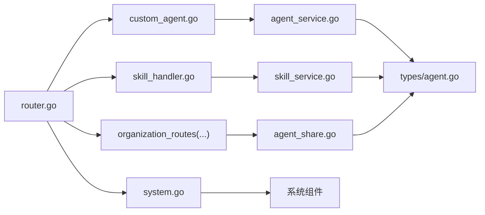

# 代理API

<cite>
**本文引用的文件**
- [internal/handler/custom_agent.go](file://internal/handler/custom_agent.go)
- [internal/router/router.go](file://internal/router/router.go)
- [internal/application/service/agent_service.go](file://internal/application/service/agent_service.go)
- [internal/agent/skills/manager.go](file://internal/agent/skills/manager.go)
- [internal/handler/skill_handler.go](file://internal/handler/skill_handler.go)
- [internal/application/service/skill_service.go](file://internal/application/service/skill_service.go)
- [internal/application/service/agent_share.go](file://internal/application/service/agent_share.go)
- [internal/application/repository/agent_share.go](file://internal/application/repository/agent_share.go)
- [internal/handler/system.go](file://internal/handler/system.go)
- [internal/logger/logger.go](file://internal/logger/logger.go)
- [internal/types/agent.go](file://internal/types/agent.go)
- [internal/types/interfaces/agent.go](file://internal/types/interfaces/agent.go)
</cite>

## 目录
1. [简介](#简介)
2. [项目结构](#项目结构)
3. [核心组件](#核心组件)
4. [架构总览](#架构总览)
5. [详细组件分析](#详细组件分析)
6. [依赖分析](#依赖分析)
7. [性能考虑](#性能考虑)
8. [故障排查指南](#故障排查指南)
9. [结论](#结论)
10. [附录](#附录)

## 简介
本文件为 WeKnora 代理API的全面接口文档，覆盖代理创建、配置与执行的完整能力，包括：
- 自定义代理定义、代理模板与预设配置管理
- 代理技能系统：技能加载、执行与调试接口
- 代理共享与协作：组织级共享、权限控制与可见性管理
- 代理监控、性能统计与日志查询
- 代理生命周期管理与故障恢复示例

文档以“接口规范 + 架构说明 + 流程图 + 故障排查”为主线，既面向开发者也便于非技术读者理解。

## 项目结构
WeKnora 的代理API采用分层架构：
- 路由层：集中注册所有API路由，统一鉴权与中间件
- 处理层：HTTP Handler 将请求转换为领域模型并调用服务层
- 服务层：封装业务逻辑，协调工具、模型、知识库与技能系统
- 类型与接口：定义代理配置、工具接口、流式事件等核心契约
- 日志与监控：统一日志格式与可观测性接入

图表来源
- [internal/router/router.go:532-564](file://internal/router/router.go#L532-L564)
- [internal/handler/custom_agent.go:31-495](file://internal/handler/custom_agent.go#L31-L495)
- [internal/handler/skill_handler.go:13-73](file://internal/handler/skill_handler.go#L13-L73)
- [internal/handler/system.go:71-121](file://internal/handler/system.go#L71-L121)
- [internal/application/service/agent_service.go:45-173](file://internal/application/service/agent_service.go#L45-L173)
- [internal/application/service/skill_service.go:18-136](file://internal/application/service/skill_service.go#L18-L136)
- [internal/application/service/agent_share.go:52-152](file://internal/application/service/agent_share.go#L52-L152)
- [internal/logger/logger.go:20-184](file://internal/logger/logger.go#L20-L184)
- [internal/types/agent.go:13-65](file://internal/types/agent.go#L13-L65)
- [internal/types/interfaces/agent.go:21-48](file://internal/types/interfaces/agent.go#L21-L48)

章节来源
- [internal/router/router.go:532-564](file://internal/router/router.go#L532-L564)

## 核心组件
- 代理配置与执行
  - AgentConfig：统一承载代理的工具白名单、知识库范围、系统提示词、Web搜索、MCP选择策略、思维模式、技能开关等
  - AgentEngine 接口：对外暴露 Execute 方法，支持流式事件推送
- 技能系统
  - Manager：负责技能发现、缓存、脚本执行沙箱对接
  - SkillService：预装技能目录发现与加载
- 共享与协作
  - AgentShareService：组织内代理共享、权限校验、可见性控制
- 日志与系统
  - Logger：统一日志格式、级别、落盘与上下文字段
  - SystemHandler：系统信息、存储引擎状态、文档解析引擎

章节来源
- [internal/types/agent.go:13-65](file://internal/types/agent.go#L13-L65)
- [internal/types/interfaces/agent.go:21-48](file://internal/types/interfaces/agent.go#L21-L48)
- [internal/agent/skills/manager.go:11-54](file://internal/agent/skills/manager.go#L11-L54)
- [internal/application/service/skill_service.go:18-136](file://internal/application/service/skill_service.go#L18-L136)
- [internal/application/service/agent_share.go:52-152](file://internal/application/service/agent_share.go#L52-L152)
- [internal/logger/logger.go:20-184](file://internal/logger/logger.go#L20-L184)

## 架构总览
代理API的调用链路如下：
- 路由层根据路径注册代理、技能、共享与系统相关路由
- Handler 将请求参数绑定到结构体，进行参数校验与上下文注入
- Service 层完成业务编排：工具注册、MCP工具注入、技能管理、引擎创建
- Engine 执行代理，按迭代产生流式事件
- 日志与可观测性中间件贯穿请求生命周期

图表来源
- [internal/router/router.go:532-555](file://internal/router/router.go#L532-L555)
- [internal/handler/custom_agent.go:59-101](file://internal/handler/custom_agent.go#L59-L101)
- [internal/application/service/agent_service.go:98-173](file://internal/application/service/agent_service.go#L98-L173)
- [internal/types/interfaces/agent.go:22-31](file://internal/types/interfaces/agent.go#L22-L31)
- [internal/logger/logger.go:326-385](file://internal/logger/logger.go#L326-L385)

## 详细组件分析

### 代理管理API
- 路由注册
  - 代理CRUD：/api/v1/agents
  - 占位符定义：/api/v1/agents/placeholders
  - 代理类型预设：/api/v1/agents/type-presets
  - 建议问题：/api/v1/agents/:id/suggested-questions
- 请求与响应要点
  - 创建/更新/删除/复制均需鉴权
  - 建议问题支持按知识库ID、知识ID过滤与限制数量
- 关键实现位置
  - 路由注册：RegisterCustomAgentRoutes
  - 处理器：CustomAgentHandler 的 CreateAgent/UpdateAgent/DeleteAgent/CopyAgent/GetAgent/ListAgents/GetPlaceholders/GetAgentTypePresets/GetSuggestedQuestions

章节来源
- [internal/router/router.go:532-555](file://internal/router/router.go#L532-L555)
- [internal/handler/custom_agent.go:31-495](file://internal/handler/custom_agent.go#L31-L495)

### 代理配置与执行
- 配置模型
  - AgentConfig：包含最大迭代次数、工具白名单、知识库范围、系统提示词、Web搜索、MCP选择模式、思维模式、技能开关、上下文窗口、工具输出长度、LLM超时等
- 引擎创建
  - 服务层根据配置校验、注册工具、注入MCP工具、解析知识库与文档元信息、构建AgentEngine，并可设置VLM图像描述器与技能管理器
- 执行流程
  - AgentEngine.Execute 返回 AgentState，期间通过流式事件推送思考、工具调用、工具结果、最终答案与引用

图表来源
- [internal/types/agent.go:13-65](file://internal/types/agent.go#L13-L65)
- [internal/types/interfaces/agent.go:22-48](file://internal/types/interfaces/agent.go#L22-L48)
- [internal/application/service/agent_service.go:98-173](file://internal/application/service/agent_service.go#L98-L173)

章节来源
- [internal/types/agent.go:13-65](file://internal/types/agent.go#L13-L65)
- [internal/types/interfaces/agent.go:21-48](file://internal/types/interfaces/agent.go#L21-L48)
- [internal/application/service/agent_service.go:45-173](file://internal/application/service/agent_service.go#L45-L173)

### 技能系统API
- 预装技能发现
  - 路由：/api/v1/skills
  - 功能：列出预装技能元数据；根据沙箱模式动态控制前端可用性
- 技能管理器
  - 发现与缓存：Initialize/Reload
  - 元数据：GetAllMetadata
  - 加载：LoadSkill/ReadSkillFile/ListSkillFiles
  - 执行：ExecuteScript（需沙箱）
- 关键实现位置
  - 路由注册：RegisterSkillRoutes
  - 处理器：SkillHandler.ListSkills
  - 服务：SkillService.ListPreloadedSkills/GetSkillByName
  - 管理器：Manager.Initialize/LoadSkill/ReadSkillFile/ListSkillFiles/ExecuteScript/Reload

图表来源
- [internal/router/router.go:557-564](file://internal/router/router.go#L557-L564)
- [internal/handler/skill_handler.go:31-73](file://internal/handler/skill_handler.go#L31-L73)
- [internal/application/service/skill_service.go:94-130](file://internal/application/service/skill_service.go#L94-L130)
- [internal/agent/skills/manager.go:56-78](file://internal/agent/skills/manager.go#L56-L78)

章节来源
- [internal/router/router.go:557-564](file://internal/router/router.go#L557-L564)
- [internal/handler/skill_handler.go:13-73](file://internal/handler/skill_handler.go#L13-L73)
- [internal/application/service/skill_service.go:18-136](file://internal/application/service/skill_service.go#L18-L136)
- [internal/agent/skills/manager.go:11-284](file://internal/agent/skills/manager.go#L11-L284)

### 代理共享与协作API
- 路由注册
  - 代理共享：/api/v1/agents/:id/shares
  - 组织共享列表：/api/v1/organizations/:id/agent-shares
  - 共享代理列表：/api/v1/shared-agents
  - 设置“我已屏蔽”：/api/v1/shared-agents/disabled
- 权限与规则
  - 仅拥有者可分享；仅编辑/管理员可对组织进行代理分享
  - 分享为只读权限；需满足代理配置完整性（模型/重排序模型）
- 关键实现位置
  - 路由注册：RegisterOrganizationRoutes
  - 服务：AgentShareService.ShareAgent/RemoveShare/ListSharesByAgent/ListSharesByOrganization/ListSharedAgents/ListSharedAgentsInOrganization/SetSharedAgentDisabledByMe/GetSharedAgentForUser
  - 仓储：AgentShareRepository.Create/GetByID/Update/Delete/CountByOrganizations 等

图表来源
- [internal/router/router.go:634-647](file://internal/router/router.go#L634-L647)
- [internal/application/service/agent_share.go:78-152](file://internal/application/service/agent_share.go#L78-L152)
- [internal/application/repository/agent_share.go:27-38](file://internal/application/repository/agent_share.go#L27-L38)

章节来源
- [internal/router/router.go:634-647](file://internal/router/router.go#L634-L647)
- [internal/application/service/agent_share.go:52-494](file://internal/application/service/agent_share.go#L52-L494)
- [internal/application/repository/agent_share.go:17-206](file://internal/application/repository/agent_share.go#L17-L206)

### 监控、性能统计与日志查询
- 系统信息
  - 路由：/api/v1/system/info
  - 返回版本、构建信息、索引/向量/图数据库引擎、MinIO状态、数据库迁移版本等
- 存储引擎状态与连通性
  - 路由：/api/v1/system/storage-engine-status
  - 路由：/api/v1/system/storage-engine-check
  - 支持 MinIO/COS/TOS/S3/OSS 的连通性测试与自动创建桶
- 文档解析引擎
  - 路由：/api/v1/system/parser-engines
  - 路由：/api/v1/system/parser-engines/check
  - 路由：/api/v1/system/docreader/reconnect
- 日志
  - 统一格式、级别、多路输出（stdout + 文件轮转）、上下文字段携带（请求ID、租户、用户等）

章节来源
- [internal/handler/system.go:71-121](file://internal/handler/system.go#L71-L121)
- [internal/handler/system.go:457-482](file://internal/handler/system.go#L457-L482)
- [internal/handler/system.go:593-625](file://internal/handler/system.go#L593-L625)
- [internal/handler/system.go:133-256](file://internal/handler/system.go#L133-L256)
- [internal/logger/logger.go:20-184](file://internal/logger/logger.go#L20-L184)

## 依赖分析
- 路由到处理器
  - 代理：RegisterCustomAgentRoutes -> CustomAgentHandler
  - 技能：RegisterSkillRoutes -> SkillHandler
  - 共享：RegisterOrganizationRoutes -> OrganizationHandler（内部调用 AgentShareService）
  - 系统：RegisterSystemRoutes -> SystemHandler
- 处理器到服务
  - CustomAgentHandler -> AgentService（创建引擎、注册工具、MCP、技能）
  - SkillHandler -> SkillService（预装技能发现）
  - OrganizationHandler -> AgentShareService（代理共享）
  - SystemHandler -> 各种基础设施（Neo4j、文档解析、存储引擎）
- 服务到类型
  - AgentService 使用 AgentConfig/Tool/AgentEngine 接口
  - SkillService/Manager 使用技能元数据与脚本执行接口
  - AgentShareService 使用共享实体与仓储接口

图表来源
- [internal/router/router.go:532-564](file://internal/router/router.go#L532-L564)
- [internal/handler/custom_agent.go:17-30](file://internal/handler/custom_agent.go#L17-L30)
- [internal/handler/skill_handler.go:13-23](file://internal/handler/skill_handler.go#L13-L23)
- [internal/application/service/agent_service.go:45-96](file://internal/application/service/agent_service.go#L45-L96)
- [internal/application/service/skill_service.go:18-35](file://internal/application/service/skill_service.go#L18-L35)
- [internal/application/service/agent_share.go:52-76](file://internal/application/service/agent_share.go#L52-L76)
- [internal/types/agent.go:13-65](file://internal/types/agent.go#L13-L65)

## 性能考虑
- 工具与检索
  - AllowedTools 与 SearchTargets 控制工具集与检索范围，避免不必要的调用
  - WebSearchEnabled 与 WebSearchMaxResults 限制外部调用成本
- 上下文与迭代
  - MaxContextTokens 与 MaxIterations 控制上下文压缩与迭代上限，防止长对话膨胀
- 并行工具调用
  - ParallelToolCalls 可并发执行多个工具调用，提升吞吐但需注意资源竞争
- 技能执行
  - 沙箱模式（docker/local/disabled）影响脚本执行性能与安全性
- 日志与追踪
  - 统一日志格式与上下文字段，便于定位热点与慢调用

## 故障排查指南
- 常见错误与定位
  - 代理不存在/不可修改/不可删除：检查服务层返回的错误码与日志字段
  - 分享权限不足：确认用户在组织内的角色与代理所有权
  - 技能不可用：检查 WEKNORA_SANDBOX_MODE 与技能目录
  - 存储引擎连通性失败：查看 sanitizeStorageCheckError 的安全提示
- 日志与审计
  - 使用 WithRequestID/WithField 注入请求ID与上下文字段
  - 日志级别与输出路径可通过环境变量配置
- 健康检查
  - /health 快速判断服务可用性
  - /swagger（非生产模式）查看接口文档与示例

章节来源
- [internal/handler/custom_agent.go:284-321](file://internal/handler/custom_agent.go#L284-L321)
- [internal/application/service/agent_share.go:78-152](file://internal/application/service/agent_share.go#L78-L152)
- [internal/handler/system.go:593-625](file://internal/handler/system.go#L593-L625)
- [internal/logger/logger.go:310-385](file://internal/logger/logger.go#L310-L385)

## 结论
WeKnora 代理API提供了从代理创建、配置、执行到共享协作与可观测性的完整能力。通过清晰的分层设计与严格的参数校验、权限控制与日志追踪，既能满足复杂场景的定制需求，又保证了运行时的稳定性与可维护性。建议在生产环境中结合日志与系统监控接口，持续优化工具集、上下文窗口与迭代次数等关键参数。

## 附录
- 术语
  - 代理：基于工具与模型的智能体，支持ReAct循环与流式输出
  - 技能：可插拔的脚本化能力，通过沙箱安全执行
  - 共享：组织维度的代理只读共享，支持权限与可见性控制
- 环境变量参考
  - LOG_LEVEL、LOG_PATH：日志级别与落盘路径
  - WEKNORA_SANDBOX_MODE/WEKNORA_SANDBOX_TIMEOUT/WEKNORA_SANDBOX_DOCKER_IMAGE：技能沙箱配置
  - WEKNORA_SKILLS_DIR：预装技能目录
  - 其他：RETRIEVE_DRIVER、MINIO_*、LANGFUSE_* 等