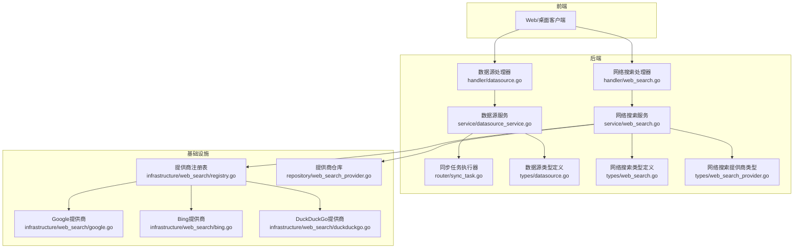
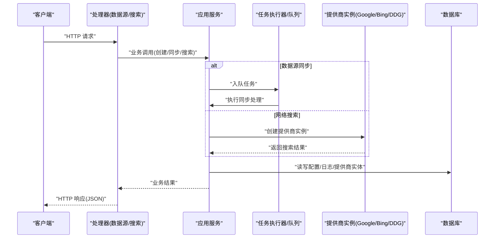
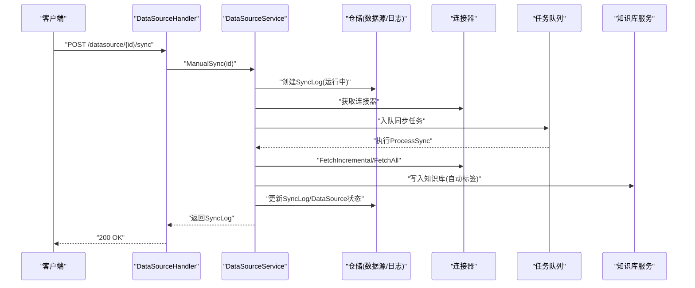
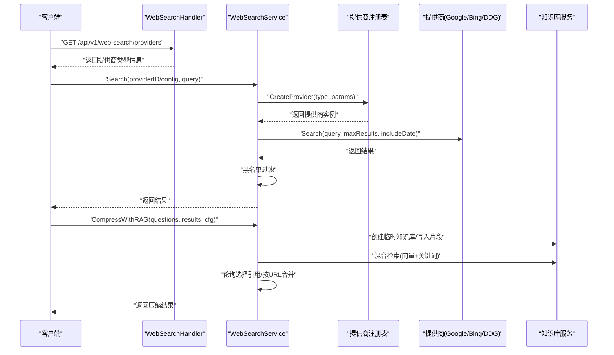
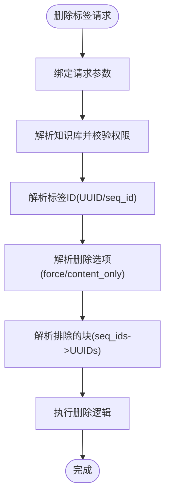
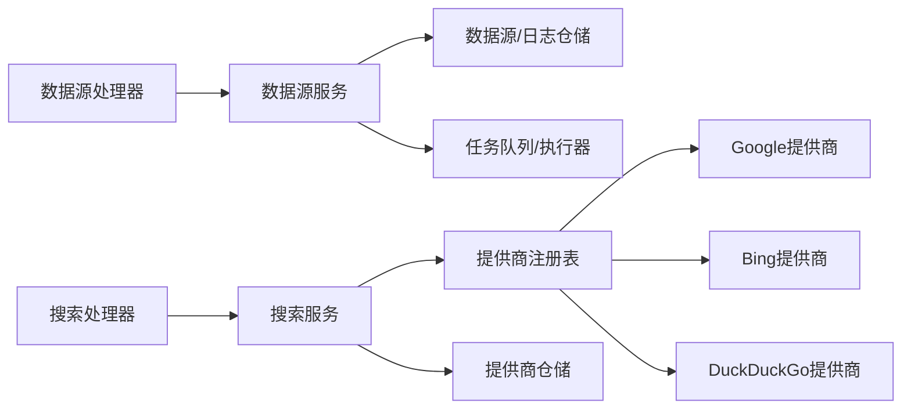

# 数据源与网络搜索API

<cite>
**本文档引用的文件**
- [client/web_search.go](file://client/web_search.go)
- [internal/handler/web_search.go](file://internal/handler/web_search.go)
- [internal/application/service/web_search.go](file://internal/application/service/web_search.go)
- [internal/infrastructure/web_search/registry.go](file://internal/infrastructure/web_search/registry.go)
- [internal/timeseries/types/web_search.go](file://internal/timeseries/types/web_search.go)
- [internal/timeseries/types/web_search_provider.go](file://internal/timeseries/types/web_search_provider.go)
- [internal/application/repository/web_search_provider.go](file://internal/application/repository/web_search_provider.go)
- [internal/handler/datasource.go](file://internal/handler/datasource.go)
- [internal/application/service/datasource_service.go](file://internal/application/service/datasource_service.go)
- [internal/router/sync_task.go](file://internal/router/sync_task.go)
- [internal/timeseries/types/datasource.go](file://internal/timeseries/types/datasource.go)
- [internal/infrastructure/web_search/google.go](file://internal/infrastructure/web_search/google.go)
- [internal/infrastructure/web_search/bing.go](file://internal/infrastructure/web_search/bing.go)
- [internal/infrastructure/web_search/duckduckgo.go](file://internal/infrastructure/web_search/duckduckgo.go)
- [internal/handler/tag.go](file://internal/handler/tag.go)
</cite>

## 目录
1. [简介](#简介)
2. [项目结构](#项目结构)
3. [核心组件](#核心组件)
4. [架构总览](#架构总览)
5. [详细组件分析](#详细组件分析)
6. [依赖关系分析](#依赖关系分析)
7. [性能考虑](#性能考虑)
8. [故障排查指南](#故障排查指南)
9. [结论](#结论)
10. [附录](#附录)

## 简介
本文件面向WeKnora平台的数据源与网络搜索API，提供从客户端到后端服务、再到基础设施层的完整接口规范与实现说明。重点覆盖以下方面：
- 数据源连接器配置与生命周期管理（创建、查询、更新、删除、连接性验证）
- 同步任务管理与增量更新机制（手动触发、计划调度、状态追踪、错误恢复）
- 网络搜索引擎集成（多提供商注册与实例化、搜索执行、结果过滤与压缩）
- 搜索结果处理与排序优化（黑名单过滤、RAG压缩、引用合并）
- 标签系统与分类管理（标签CRUD、自动标签注入、共享知识库权限）
- 元数据提取与索引策略（外部ID映射、来源渠道标记、内容去重）
- 健康检查、错误恢复与重试机制（服务级超时、异步队列、日志与追踪）
- 第三方服务集成与API限流（代理支持、超时控制、SSRF防护）

## 项目结构
WeKnora采用分层架构，前端通过HTTP接口调用后端；后端由处理器层、应用服务层、基础设施层组成；数据源与网络搜索分别在独立模块中实现。

**图表来源**
- [internal/handler/datasource.go:1-557](file://internal/handler/datasource.go#L1-L557)
- [internal/handler/web_search.go:1-25](file://internal/handler/web_search.go#L1-L25)
- [internal/application/service/datasource_service.go:1-755](file://internal/application/service/datasource_service.go#L1-L755)
- [internal/application/service/web_search.go:1-424](file://internal/application/service/web_search.go#L1-L424)
- [internal/router/sync_task.go:1-107](file://internal/router/sync_task.go#L1-L107)
- [internal/timeseries/types/datasource.go:1-418](file://internal/timeseries/types/datasource.go#L1-L418)
- [internal/timeseries/types/web_search.go:1-64](file://internal/timeseries/types/web_search.go#L1-L64)
- [internal/timeseries/types/web_search_provider.go:1-183](file://internal/timeseries/types/web_search_provider.go#L1-L183)
- [internal/infrastructure/web_search/registry.go:1-46](file://internal/infrastructure/web_search/registry.go#L1-L46)
- [internal/infrastructure/web_search/google.go:1-95](file://internal/infrastructure/web_search/google.go#L1-L95)
- [internal/infrastructure/web_search/bing.go:1-200](file://internal/infrastructure/web_search/bing.go#L1-L200)
- [internal/infrastructure/web_search/duckduckgo.go:1-255](file://internal/infrastructure/web_search/duckduckgo.go#L1-L255)
- [internal/application/repository/web_search_provider.go:1-90](file://internal/application/repository/web_search_provider.go#L1-L90)

**章节来源**
- [internal/handler/datasource.go:1-557](file://internal/handler/datasource.go#L1-L557)
- [internal/application/service/datasource_service.go:1-755](file://internal/application/service/datasource_service.go#L1-L755)
- [internal/application/service/web_search.go:1-424](file://internal/application/service/web_search.go#L1-L424)
- [internal/infrastructure/web_search/registry.go:1-46](file://internal/infrastructure/web_search/registry.go#L1-L46)

## 核心组件
- 数据源管理模块
  - 处理器：负责HTTP路由与鉴权校验，封装业务调用
  - 服务：实现数据源生命周期、连接性验证、资源枚举、手动同步、暂停/恢复、日志查询
  - 类型：定义数据源、同步日志、游标、结果等结构体
  - 异步：基于Asynq的任务队列与Lite模式下的同步执行器
- 网络搜索模块
  - 服务：统一搜索入口，解析提供商实体，创建实例，执行搜索，黑名单过滤，RAG压缩
  - 注册表：按提供商类型工厂化创建实例
  - 基础设施：各提供商实现（Google、Bing、DuckDuckGo等）
  - 类型：搜索配置、结果、提供商实体与参数、提供商类型信息
- 标签与分类
  - 处理器：标签CRUD、列表、删除（支持排除特定块）
  - 自动标签：数据源同步时自动为条目打上来源标签，便于检索与治理

**章节来源**
- [internal/handler/datasource.go:1-557](file://internal/handler/datasource.go#L1-L557)
- [internal/application/service/datasource_service.go:1-755](file://internal/application/service/datasource_service.go#L1-L755)
- [internal/timeseries/types/datasource.go:1-418](file://internal/timeseries/types/datasource.go#L1-L418)
- [internal/application/service/web_search.go:1-424](file://internal/application/service/web_search.go#L1-L424)
- [internal/infrastructure/web_search/registry.go:1-46](file://internal/infrastructure/web_search/registry.go#L1-L46)
- [internal/timeseries/types/web_search.go:1-64](file://internal/timeseries/types/web_search.go#L1-L64)
- [internal/timeseries/types/web_search_provider.go:1-183](file://internal/timeseries/types/web_search_provider.go#L1-L183)
- [internal/handler/tag.go:1-336](file://internal/handler/tag.go#L1-L336)

## 架构总览
WeKnora的API遵循“控制器-服务-仓储-基础设施”的分层设计。数据源与网络搜索均通过HTTP接口暴露，内部通过服务层编排，基础设施层负责具体实现细节（如提供商SDK、HTTP客户端、加密存储）。

**图表来源**
- [internal/handler/datasource.go:1-557](file://internal/handler/datasource.go#L1-L557)
- [internal/application/service/datasource_service.go:1-755](file://internal/application/service/datasource_service.go#L1-L755)
- [internal/application/service/web_search.go:1-424](file://internal/application/service/web_search.go#L1-L424)
- [internal/router/sync_task.go:1-107](file://internal/router/sync_task.go#L1-L107)
- [internal/infrastructure/web_search/google.go:1-95](file://internal/infrastructure/web_search/google.go#L1-L95)
- [internal/infrastructure/web_search/bing.go:1-200](file://internal/infrastructure/web_search/bing.go#L1-L200)
- [internal/infrastructure/web_search/duckduckgo.go:1-255](file://internal/infrastructure/web_search/duckduckgo.go#L1-L255)

## 详细组件分析

### 数据源管理API
- 接口清单
  - 创建数据源：POST /api/v1/datasource
  - 查询单个数据源：GET /api/v1/datasource/{id}
  - 列表数据源：GET /api/v1/datasource?kb_id=...
  - 更新数据源：PUT /api/v1/datasource/{id}
  - 删除数据源：DELETE /api/v1/datasource/{id}
  - 连接性测试：POST /api/v1/datasource/{id}/validate
  - 凭证连通性测试（不持久化）：POST /api/v1/datasource/validate-credentials
  - 列出可用资源：GET /api/v1/datasource/{id}/resources
  - 手动触发同步：POST /api/v1/datasource/{id}/sync
  - 暂停数据源：POST /api/v1/datasource/{id}/pause
  - 恢复数据源：POST /api/v1/datasource/{id}/resume
  - 查询同步日志：GET /api/v1/datasource/{id}/logs
  - 查询指定日志：GET /api/v1/datasource/logs/{log_id}
  - 可用连接器类型：GET /api/v1/datasource/types

- 关键行为
  - 租户隔离：所有操作均从上下文提取租户ID进行校验
  - 资源枚举：调用连接器的ListResources获取可同步资源
  - 手动同步：创建同步日志并入队异步任务，失败时回写错误状态
  - 增量/全量同步：根据配置选择FetchIncremental或FetchAll
  - 自动标签：为每个数据源创建同名标签，注入到同步条目元数据
  - 错误恢复：暂停状态下保持暂停状态，异常时置为错误并记录消息

**图表来源**
- [internal/handler/datasource.go:366-396](file://internal/handler/datasource.go#L366-L396)
- [internal/application/service/datasource_service.go:269-324](file://internal/application/service/datasource_service.go#L269-L324)
- [internal/application/service/datasource_service.go:387-599](file://internal/application/service/datasource_service.go#L387-L599)
- [internal/router/sync_task.go:86-106](file://internal/router/sync_task.go#L86-L106)

**章节来源**
- [internal/handler/datasource.go:77-557](file://internal/handler/datasource.go#L77-L557)
- [internal/application/service/datasource_service.go:59-755](file://internal/application/service/datasource_service.go#L59-L755)
- [internal/timeseries/types/datasource.go:49-418](file://internal/timeseries/types/datasource.go#L49-L418)
- [internal/router/sync_task.go:17-107](file://internal/router/sync_task.go#L17-L107)

### 网络搜索API
- 接口清单
  - 获取提供商类型：GET /api/v1/datasource/types 或 /api/v1/web-search/providers（兼容旧接口）
  - 执行搜索：POST /api/v1/web-search/search（需提供提供商ID或配置）
  - RAG压缩：POST /api/v1/web-search/compress（基于临时知识库抽取片段）

- 关键行为
  - 提供商解析：优先使用WebSearchProviderEntity（新路径），否则回退到旧配置字段
  - 实例创建：通过注册表按类型创建实例，合并调用时代理参数
  - 搜索执行：设置全局超时，调用提供商Search
  - 黑名单过滤：支持通配符与正则两种规则
  - RAG压缩：构建临时知识库，抽取片段，按来源URL轮询选择，合并引用

**图表来源**
- [internal/handler/web_search.go:18-24](file://internal/handler/web_search.go#L18-L24)
- [internal/application/service/web_search.go:46-130](file://internal/application/service/web_search.go#L46-L130)
- [internal/application/service/web_search.go:142-247](file://internal/application/service/web_search.go#L142-L247)
- [internal/infrastructure/web_search/registry.go:36-45](file://internal/infrastructure/web_search/registry.go#L36-L45)
- [internal/infrastructure/web_search/google.go:57-94](file://internal/infrastructure/web_search/google.go#L57-L94)
- [internal/infrastructure/web_search/bing.go:73-129](file://internal/infrastructure/web_search/bing.go#L73-L129)
- [internal/infrastructure/web_search/duckduckgo.go:40-132](file://internal/infrastructure/web_search/duckduckgo.go#L40-L132)

**章节来源**
- [internal/handler/web_search.go:10-25](file://internal/handler/web_search.go#L10-L25)
- [internal/application/service/web_search.go:18-424](file://internal/application/service/web_search.go#L18-L424)
- [internal/infrastructure/web_search/registry.go:14-46](file://internal/infrastructure/web_search/registry.go#L14-L46)
- [internal/timeseries/types/web_search.go:9-64](file://internal/timeseries/types/web_search.go#L9-L64)
- [internal/timeseries/types/web_search_provider.go:25-183](file://internal/timeseries/types/web_search_provider.go#L25-L183)
- [internal/application/repository/web_search_provider.go:22-90](file://internal/application/repository/web_search_provider.go#L22-L90)

### 标签系统与分类管理
- 接口清单
  - 列表标签：GET /api/v1/knowledge-bases/{id}/tags
  - 创建标签：POST /api/v1/knowledge-bases/{id}/tags
  - 更新标签：PUT /api/v1/knowledge-bases/{id}/tags/{tag_id}
  - 删除标签：DELETE /api/v1/knowledge-bases/{id}/tags/{tag_id}?force=...&content_only=...

- 关键行为
  - 权限校验：支持租户拥有者与共享访问，动态切换有效租户ID
  - 标签解析：支持UUID与seq_id两种标识
  - 删除策略：支持强制删除与仅删除内容（可排除特定块）
  - 自动标签：数据源同步时为条目注入来源标签，便于后续检索

**图表来源**
- [internal/handler/tag.go:285-332](file://internal/handler/tag.go#L285-L332)

**章节来源**
- [internal/handler/tag.go:112-336](file://internal/handler/tag.go#L112-L336)

### 元数据提取与索引策略
- 外部ID映射：同步条目以external_id作为去重与更新依据
- 来源渠道标记：将数据源类型作为channel写入条目元数据
- 自动标签：为每个数据源创建同名标签，注入到同步条目
- 内容去重：重复URL/文件视为跳过，避免重复索引
- 游标与增量：增量同步基于上次游标，支持schema哈希检测

**章节来源**
- [internal/application/service/datasource_service.go:636-710](file://internal/application/service/datasource_service.go#L636-L710)
- [internal/timeseries/types/datasource.go:242-286](file://internal/timeseries/types/datasource.go#L242-L286)

### 健康检查、错误恢复与重试机制
- 健康检查
  - 数据源连接性：ValidateConnection对连接器进行连通性测试
  - 搜索提供商：通过注册表创建实例并执行简单探测
- 错误恢复
  - 手动同步失败：写入失败日志，更新数据源状态为错误
  - 增量同步异常：记录错误并保持暂停状态不变
- 重试机制
  - 异步任务：依赖Asynq队列与后台进程；Lite模式下同步执行器模拟队列行为
  - 超时控制：搜索全局超时，HTTP客户端超时，连接器各自超时策略

**章节来源**
- [internal/application/service/datasource_service.go:202-238](file://internal/application/service/datasource_service.go#L202-L238)
- [internal/application/service/web_search.go:64-83](file://internal/application/service/web_search.go#L64-L83)
- [internal/router/sync_task.go:17-69](file://internal/router/sync_task.go#L17-L69)

### 第三方服务集成与API限流
- 第三方集成
  - Google Custom Search：需要API Key与Engine ID
  - Bing Search：需要Azure订阅Key
  - DuckDuckGo：免费，可选代理
  - 其他：Tavily、Ollama、Baidu
- 限流与安全
  - 代理支持：可配置HTTP/HTTPS代理，仅用于隧道官方API端点
  - SSRF防护：提供商端点硬编码，禁止用户自定义BaseURL
  - 超时控制：搜索默认超时，HTTP客户端超时可配置
  - 加密存储：提供商API Key在数据库侧加密存储

**章节来源**
- [internal/infrastructure/web_search/google.go:23-50](file://internal/infrastructure/web_search/google.go#L23-L50)
- [internal/infrastructure/web_search/bing.go:52-66](file://internal/infrastructure/web_search/bing.go#L52-L66)
- [internal/infrastructure/web_search/duckduckgo.go:25-33](file://internal/infrastructure/web_search/duckduckgo.go#L25-L33)
- [internal/timeseries/types/web_search_provider.go:64-110](file://internal/timeseries/types/web_search_provider.go#L64-L110)

## 依赖关系分析
- 组件耦合
  - 处理器仅依赖服务接口，保证低耦合高内聚
  - 服务层依赖仓储接口与基础设施（注册表/连接器）
  - 注册表集中管理提供商工厂，避免在服务层分散创建逻辑
- 外部依赖
  - Asynq：异步任务队列
  - Google Custom Search SDK：Google提供商
  - HTTP客户端：Bing/DDG提供商
  - 数据库：GORM ORM

**图表来源**
- [internal/handler/datasource.go:14-29](file://internal/handler/datasource.go#L14-L29)
- [internal/handler/web_search.go:10-16](file://internal/handler/web_search.go#L10-L16)
- [internal/application/service/datasource_service.go:21-56](file://internal/application/service/datasource_service.go#L21-L56)
- [internal/application/service/web_search.go:18-44](file://internal/application/service/web_search.go#L18-L44)
- [internal/infrastructure/web_search/registry.go:14-46](file://internal/infrastructure/web_search/registry.go#L14-L46)

**章节来源**
- [internal/handler/datasource.go:14-29](file://internal/handler/datasource.go#L14-L29)
- [internal/handler/web_search.go:10-16](file://internal/handler/web_search.go#L10-L16)
- [internal/application/service/datasource_service.go:21-56](file://internal/application/service/datasource_service.go#L21-L56)
- [internal/application/service/web_search.go:18-44](file://internal/application/service/web_search.go#L18-L44)

## 性能考虑
- 异步处理：数据源同步通过队列异步执行，避免阻塞请求线程
- 结果压缩：RAG压缩减少冗余内容，提升检索效率
- 黑名单过滤：在返回前过滤无效/敏感URL，降低下游处理成本
- 超时控制：全局超时与连接器超时结合，防止长时间阻塞
- 增量同步：仅拉取变更，显著降低带宽与处理开销

## 故障排查指南
- 数据源同步失败
  - 检查连接器凭据是否正确
  - 查看SyncLog错误详情与状态
  - 确认租户ID与知识库归属一致
- 搜索无结果或报错
  - 确认提供商类型与参数（API Key/Engine ID/代理）
  - 检查黑名单规则是否误判
  - 观察日志中的超时与HTTP状态码
- 标签删除异常
  - 使用force或content_only选项确认策略
  - 排除特定块ID以避免误删

**章节来源**
- [internal/application/service/datasource_service.go:387-599](file://internal/application/service/datasource_service.go#L387-L599)
- [internal/application/service/web_search.go:363-415](file://internal/application/service/web_search.go#L363-L415)
- [internal/handler/tag.go:285-332](file://internal/handler/tag.go#L285-L332)

## 结论
WeKnora的数据源与网络搜索API通过清晰的分层设计与严格的租户隔离，提供了稳定、可扩展的集成能力。数据源模块支持多种连接器与增量同步，网络搜索模块具备多提供商适配与RAG压缩能力，标签系统完善了知识治理。配合异步任务与超时控制，整体具备良好的可靠性与性能表现。

## 附录
- 客户端示例（Go）
  - 获取网络搜索提供商列表：[client/web_search.go:17-32](file://client/web_search.go#L17-L32)

**章节来源**
- [client/web_search.go:17-32](file://client/web_search.go#L17-L32)