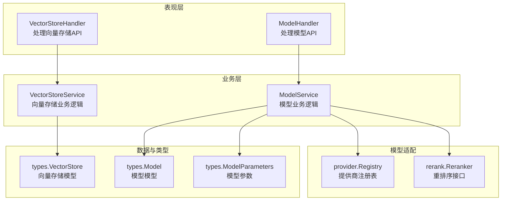
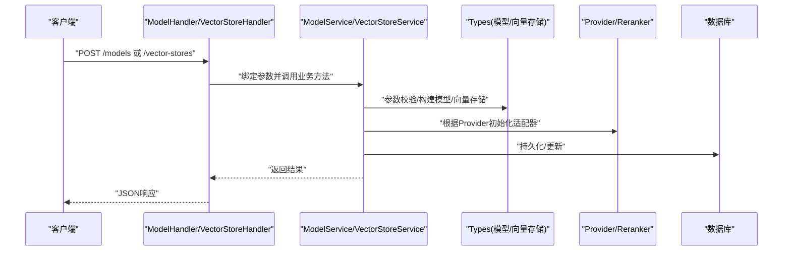
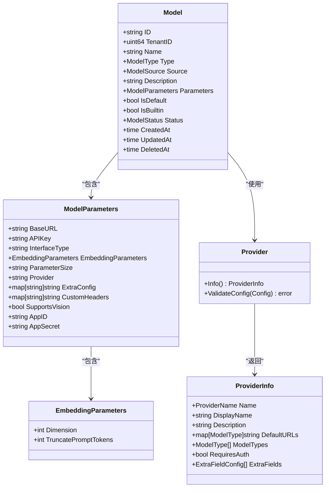
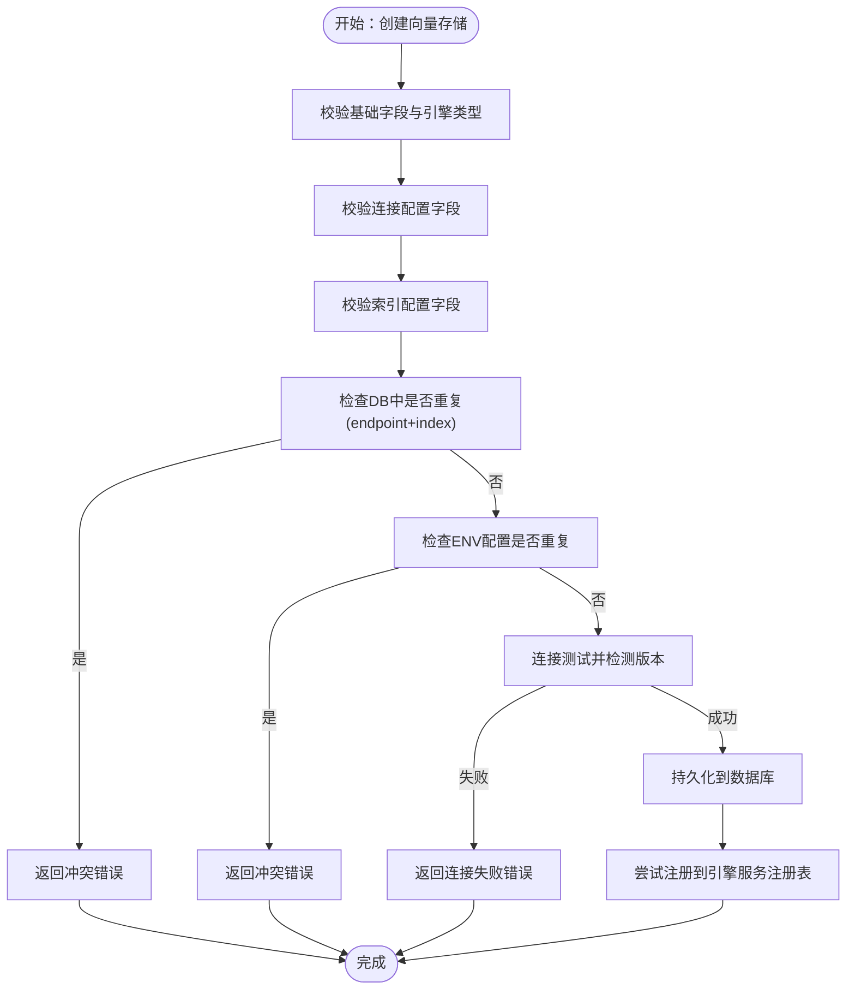
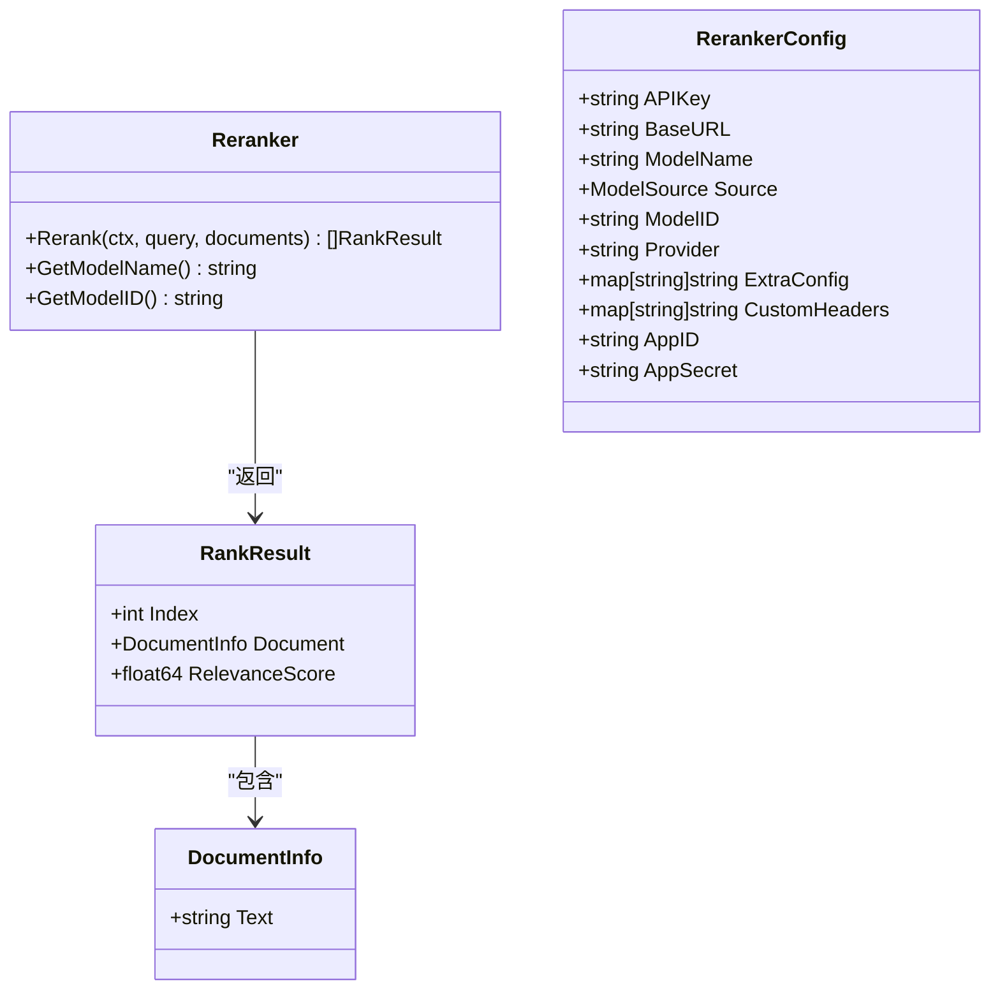
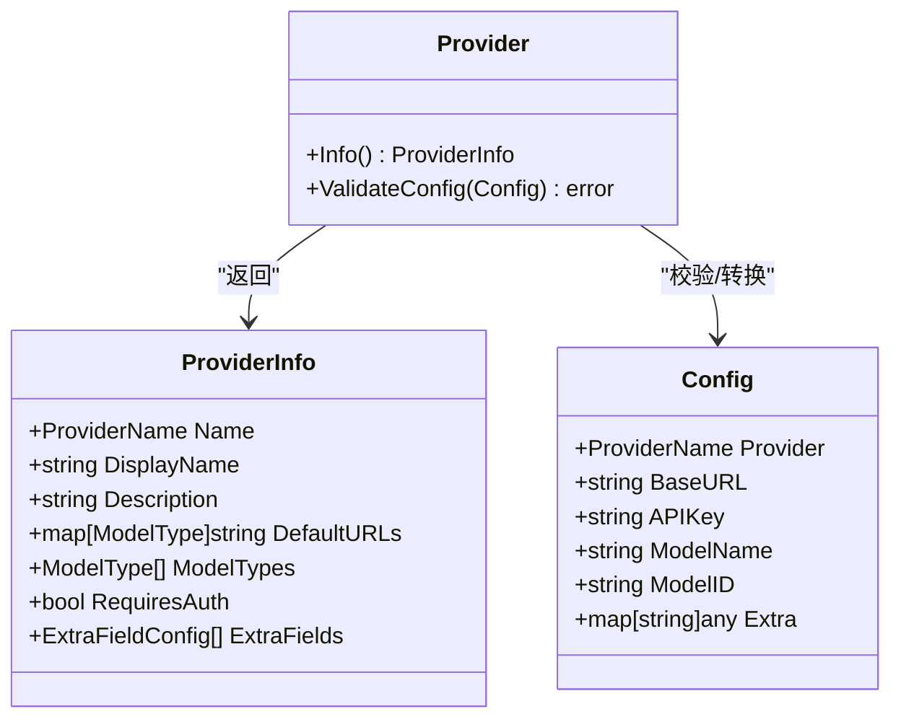
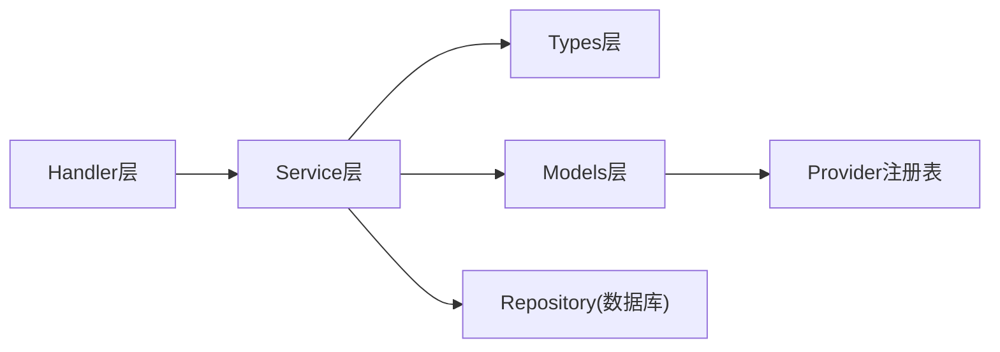

# 模型与向量API

<cite>
**本文引用的文件**
- [docs/api/vector-store.md](file://docs/api/vector-store.md)
- [docs/api/model.md](file://docs/api/model.md)
- [internal/handler/vectorstore.go](file://internal/handler/vectorstore.go)
- [internal/handler/model.go](file://internal/handler/model.go)
- [internal/application/service/vectorstore.go](file://internal/application/service/vectorstore.go)
- [internal/application/service/vectorstore_healthcheck.go](file://internal/application/service/vectorstore_healthcheck.go)
- [internal/application/service/model.go](file://internal/application/service/model.go)
- [internal/types/vectorstore.go](file://internal/types/vectorstore.go)
- [internal/types/model.go](file://internal/types/model.go)
- [internal/models/provider/provider.go](file://internal/models/provider/provider.go)
- [internal/models/rerank/reranker.go](file://internal/models/rerank/reranker.go)
- [internal/tokens/estimator.go](file://internal/agent/token/estimator.go)
- [internal/agent/tools/data_analysis.go](file://internal/application/service/chat_pipeline/data_analysis.go)
- [internal/application/service/vectorstore_test.go](file://internal/application/service/vectorstore_test.go)
</cite>

## 目录
1. [简介](#简介)
2. [项目结构](#项目结构)
3. [核心组件](#核心组件)
4. [架构总览](#架构总览)
5. [详细组件分析](#详细组件分析)
6. [依赖关系分析](#依赖关系分析)
7. [性能考虑](#性能考虑)
8. [故障排查指南](#故障排查指南)
9. [结论](#结论)
10. [附录](#附录)

## 简介
本文件面向WeKnora的模型与向量API，系统性梳理以下能力：
- LLM模型管理：对话模型（KnowledgeQA）、嵌入模型（Embedding）、重排序模型（Rerank）、视觉语言模型（VLLM）、语音识别模型（ASR）的创建、查询、更新与删除。
- 嵌入模型配置：参数校验、加密存储、跨租户一致性保障。
- 重排序模型：统一接口抽象、多厂商适配、调试与链路追踪包装。
- 向量存储配置：支持Elasticsearch、PostgreSQL、Qdrant、Milvus、Weaviate、SQLite六类引擎；提供类型枚举、连接与索引配置Schema、环境变量配置、连接测试与版本检测。
- 索引管理与查询优化：索引命名规则、分片副本参数、默认值策略、批量索引与删除接口。
- 模型提供商集成：统一Provider注册表、URL推断、默认BaseURL与支持类型。
- API密钥与费用控制：敏感字段加密存储、SSRF防护、自定义HTTP头透传、WeKnoraCloud凭证解析。
- 健康检查与性能监控：连接测试、版本检测、超时控制、日志记录。
- 模型版本管理、A/B测试与灰度发布：模型状态机、默认模型选择策略、跨租户共享与兼容性。

## 项目结构
WeKnora采用典型的分层架构：
- Handler层：接收HTTP请求，进行参数绑定与鉴权上下文提取，调用Service层业务逻辑。
- Service层：封装业务规则，执行模型与向量存储的创建、更新、删除、查询、连接测试等操作。
- Types层：定义数据模型、参数结构、校验规则与序列化/反序列化（含敏感字段加密）。
- Models层：模型适配器（聊天、嵌入、重排序、视觉语言、语音识别）与提供商注册表。
- 文档与测试：Swagger/API文档与单元测试覆盖关键流程。

图表来源
- [internal/handler/vectorstore.go:15-456](file://internal/handler/vectorstore.go#L15-L456)
- [internal/handler/model.go:17-489](file://internal/handler/model.go#L17-L489)
- [internal/application/service/vectorstore.go:16-190](file://internal/application/service/vectorstore.go#L16-L190)
- [internal/application/service/model.go:23-507](file://internal/application/service/model.go#L23-L507)
- [internal/types/vectorstore.go:30-677](file://internal/types/vectorstore.go#L30-L677)
- [internal/types/model.go:81-168](file://internal/types/model.go#L81-L168)
- [internal/models/provider/provider.go:12-296](file://internal/models/provider/provider.go#L12-L296)
- [internal/models/rerank/reranker.go:13-166](file://internal/models/rerank/reranker.go#L13-L166)

章节来源
- [docs/api/vector-store.md:1-362](file://docs/api/vector-store.md#L1-L362)
- [docs/api/model.md:1-502](file://docs/api/model.md#L1-L502)

## 核心组件
- 模型管理API
  - 支持模型类型：KnowledgeQA（对话）、Embedding（嵌入）、Rerank（重排序）、VLLM（视觉语言）、ASR（语音识别）。
  - 支持模型来源：local（本地Ollama）、remote（远程API）。
  - 提供商集成：统一Provider注册表，按模型类型筛选，支持URL自动识别与默认BaseURL。
  - 敏感信息保护：API Key与App Secret加密存储，内置模型返回时隐藏敏感字段。
- 向量存储API
  - 支持引擎类型：Elasticsearch、PostgreSQL、Qdrant、Milvus、Weaviate、SQLite。
  - 提供类型Schema：连接字段与索引字段定义，用于前端表单生成。
  - 环境变量配置：RETRIEVE_DRIVER支持多引擎组合，以虚拟条目形式展示，只读不可修改/删除。
  - 连接测试：对已保存与原始凭据进行连通性测试，自动检测版本并持久化（除SQLite）。
- 重排序模型
  - 统一接口Reranker，支持多厂商适配（Aliyun、Zhipu、Jina、Nvidia、WeKnoraCloud等）。
  - 结果兼容：RelevanceScore优先，回退Score字段；DocumentInfo支持字符串或对象两种格式。
- 模型提供商
  - Provider注册表：集中管理各厂商特性、默认URL、支持模型类型、额外配置字段。
  - URL检测：基于BaseURL子串匹配自动识别Provider，支持Azure OpenAI、Moonshot、ModelScope等。
- 健康检查与性能监控
  - 连接测试：针对不同引擎的连通性探测与版本检测，统一超时控制。
  - 日志记录：关键操作与错误均记录日志，便于排障与审计。

章节来源
- [docs/api/model.md:1-502](file://docs/api/model.md#L1-L502)
- [docs/api/vector-store.md:1-362](file://docs/api/vector-store.md#L1-L362)
- [internal/handler/model.go:17-489](file://internal/handler/model.go#L17-L489)
- [internal/handler/vectorstore.go:15-456](file://internal/handler/vectorstore.go#L15-L456)
- [internal/application/service/model.go:23-507](file://internal/application/service/model.go#L23-L507)
- [internal/application/service/vectorstore.go:16-190](file://internal/application/service/vectorstore.go#L16-L190)
- [internal/application/service/vectorstore_healthcheck.go:25-229](file://internal/application/service/vectorstore_healthcheck.go#L25-L229)
- [internal/models/provider/provider.go:12-296](file://internal/models/provider/provider.go#L12-L296)
- [internal/models/rerank/reranker.go:13-166](file://internal/models/rerank/reranker.go#L13-L166)

## 架构总览
下图展示了模型与向量API的关键交互流程：Handler接收请求，Service执行业务规则与外部调用，Types负责数据结构与安全（加密/脱敏），Models层完成具体适配。

图表来源
- [internal/handler/model.go:85-144](file://internal/handler/model.go#L85-L144)
- [internal/handler/vectorstore.go:94-128](file://internal/handler/vectorstore.go#L94-L128)
- [internal/application/service/model.go:87-147](file://internal/application/service/model.go#L87-L147)
- [internal/application/service/vectorstore.go:36-99](file://internal/application/service/vectorstore.go#L36-L99)
- [internal/models/provider/provider.go:278-296](file://internal/models/provider/provider.go#L278-L296)
- [internal/models/rerank/reranker.go:116-166](file://internal/models/rerank/reranker.go#L116-L166)

## 详细组件分析

### 模型管理API
- 支持的模型类型与来源
  - 类型：KnowledgeQA（对话）、Embedding（嵌入）、Rerank（重排序）、VLLM（视觉语言）、ASR（语音识别）。
  - 来源：local（本地Ollama）、remote（远程API）。
- 创建模型
  - 远程模型直接激活；本地模型进入下载状态并在后台完成拉取后更新状态。
  - BaseURL进行SSRF安全校验；敏感参数加密存储。
- 查询与列表
  - 列表与详情接口对内置模型隐藏敏感字段；非内置模型返回完整参数。
- 更新与删除
  - 内置模型不可更新/删除；本地模型状态限制（下载中/失败）影响可用性。
- 供应商集成
  - Provider注册表支持按模型类型过滤；默认URL与额外字段配置；自动URL检测。

图表来源
- [internal/types/model.go:81-168](file://internal/types/model.go#L81-L168)
- [internal/models/provider/provider.go:94-147](file://internal/models/provider/provider.go#L94-L147)

章节来源
- [docs/api/model.md:96-466](file://docs/api/model.md#L96-L466)
- [internal/handler/model.go:85-489](file://internal/handler/model.go#L85-L489)
- [internal/application/service/model.go:87-507](file://internal/application/service/model.go#L87-L507)
- [internal/types/model.go:81-168](file://internal/types/model.go#L81-L168)
- [internal/models/provider/provider.go:12-296](file://internal/models/provider/provider.go#L12-L296)

### 向量存储API
- 引擎类型与Schema
  - 支持：Elasticsearch、PostgreSQL、Qdrant、Milvus、Weaviate、SQLite。
  - Schema：连接字段（如addr、host、username、password、api_key、use_tls等）与索引字段（如index_name、shard_number、replication_factor等）。
- 环境变量配置
  - RETRIEVE_DRIVER支持多引擎组合，生成虚拟env store，source="env"且readonly=true。
- 连接测试与版本检测
  - 支持原始凭据测试与已保存存储测试；ES/PG/Qdrant/Weaviate返回版本号；Milvus仅连通性检测；SQLite无远端连接。
- 重复检测
  - 同一endpoint+index组合不可重复注册（包括env store）；不同index允许。
- 注册与自愈
  - 成功持久化后尝试注册到引擎服务注册表；注册失败不影响DB持久化，应用重启后自愈。

图表来源
- [internal/application/service/vectorstore.go:36-99](file://internal/application/service/vectorstore.go#L36-L99)
- [internal/application/service/vectorstore_healthcheck.go:25-229](file://internal/application/service/vectorstore_healthcheck.go#L25-L229)
- [internal/types/vectorstore.go:393-434](file://internal/types/vectorstore.go#L393-L434)

章节来源
- [docs/api/vector-store.md:20-362](file://docs/api/vector-store.md#L20-L362)
- [internal/handler/vectorstore.go:94-455](file://internal/handler/vectorstore.go#L94-L455)
- [internal/application/service/vectorstore.go:36-190](file://internal/application/service/vectorstore.go#L36-L190)
- [internal/application/service/vectorstore_healthcheck.go:25-229](file://internal/application/service/vectorstore_healthcheck.go#L25-L229)
- [internal/types/vectorstore.go:30-677](file://internal/types/vectorstore.go#L30-L677)

### 重排序模型
- 接口抽象
  - Reranker接口：Rerank(query, documents)返回排序结果；GetModelName/GetModelID。
- 配置与工厂
  - ConfigFromModel：从types.Model构造RerankerConfig；支持Provider标识与自定义头部。
  - NewReranker：根据Provider自动选择实现（Aliyun、Zhipu、Jina、Nvidia、WeKnoraCloud等）。
- 结果兼容
  - RankResult支持RelevanceScore优先，回退Score；DocumentInfo支持字符串或对象格式。
- 调试与追踪
  - 在LLM调试开启时包装为debugReranker；可接入Langfuse追踪。

图表来源
- [internal/models/rerank/reranker.go:13-166](file://internal/models/rerank/reranker.go#L13-L166)

章节来源
- [internal/models/rerank/reranker.go:81-166](file://internal/models/rerank/reranker.go#L81-L166)
- [internal/application/service/model.go:362-389](file://internal/application/service/model.go#L362-L389)

### 模型提供商集成
- Provider注册表
  - AllProviders：列出全部Provider名称；List/ListByModelType：按注册顺序返回ProviderInfo。
  - DetectProvider：通过BaseURL子串匹配自动识别Provider。
- ProviderInfo
  - 包含显示名、描述、默认BaseURL映射、支持模型类型、是否需要鉴权、额外配置字段等。
- 配置转换
  - NewConfigFromModel：从Model构造Config，自动推断Provider。

图表来源
- [internal/models/provider/provider.go:141-296](file://internal/models/provider/provider.go#L141-L296)

章节来源
- [internal/models/provider/provider.go:64-296](file://internal/models/provider/provider.go#L64-L296)
- [internal/handler/model.go:423-488](file://internal/handler/model.go#L423-L488)

### API密钥管理与费用控制
- 敏感字段加密
  - ModelParameters.Value/Scan：APIKey与AppSecret在入库前AES-GCM加密，出库时解密。
- SSRF防护
  - 模型BaseURL在创建/更新时进行SSRF校验，拒绝不安全URL。
- 自定义HTTP头透传
  - ModelParameters.CustomHeaders：允许附加自定义请求头（如企业网关鉴权、追踪ID等），避免覆盖关键头部。
- WeKnoraCloud凭证解析
  - resolveWeKnoraCloudCredentials：当模型未配置AppID/AppSecret时，自动从租户配置中补齐。

章节来源
- [internal/types/model.go:111-155](file://internal/types/model.go#L111-L155)
- [internal/handler/model.go:106-113](file://internal/handler/model.go#L106-L113)
- [internal/application/service/model.go:58-85](file://internal/application/service/model.go#L58-L85)

### 健康检查与性能监控
- 连接测试
  - TestConnection：按引擎类型分别探测，统一超时控制（10秒）。
  - Elasticsearch：HTTP根请求，解析版本号；PostgreSQL：SHOW server_version；Qdrant/Weaviate：SDK健康检查；Milvus：TCP拨号；SQLite：无远端连接。
- 版本检测
  - 成功连通后返回版本号，Postgres/ES/Qdrant/Weaviate可检测，Milvus/SQLite不可检测。
- 性能与稳定性
  - 注册引擎服务时设置短超时（10秒），避免阻塞；失败仅记录日志，不影响DB持久化，具备自愈能力。

章节来源
- [internal/application/service/vectorstore_healthcheck.go:25-229](file://internal/application/service/vectorstore_healthcheck.go#L25-L229)
- [internal/application/service/vectorstore.go:140-160](file://internal/application/service/vectorstore.go#L140-L160)

### 模型版本管理、A/B测试与灰度发布
- 版本管理
  - 模型状态机：active（激活）、downloading（下载中）、download_failed（下载失败）。
  - 本地模型通过后台任务完成下载并更新状态；远程模型直接激活。
- A/B测试与灰度
  - 代码层面未显式实现A/B分流；可通过多模型并存与默认模型策略配合实现灰度发布。
  - 跨租户知识库共享：GetEmbeddingModelForTenant确保使用源租户的嵌入模型，保证向量空间一致。

章节来源
- [internal/application/service/model.go:87-147](file://internal/application/service/model.go#L87-L147)
- [internal/application/service/model.go:314-360](file://internal/application/service/model.go#L314-L360)

## 依赖关系分析
- Handler依赖Service：HTTP入口仅做参数绑定与上下文传递，业务逻辑集中在Service。
- Service依赖Types与Models：Service通过Types进行参数校验与数据结构转换，通过Models完成具体适配器初始化。
- Provider注册表：集中管理多厂商适配器，按模型类型与URL自动选择实现。
- 向量存储注册表：Service在持久化后尝试注册引擎服务，失败不影响DB持久化，具备自愈能力。

图表来源
- [internal/handler/model.go:17-489](file://internal/handler/model.go#L17-L489)
- [internal/handler/vectorstore.go:15-456](file://internal/handler/vectorstore.go#L15-L456)
- [internal/application/service/model.go:23-507](file://internal/application/service/model.go#L23-L507)
- [internal/application/service/vectorstore.go:16-190](file://internal/application/service/vectorstore.go#L16-L190)
- [internal/models/provider/provider.go:149-193](file://internal/models/provider/provider.go#L149-L193)

章节来源
- [internal/handler/model.go:17-489](file://internal/handler/model.go#L17-L489)
- [internal/handler/vectorstore.go:15-456](file://internal/handler/vectorstore.go#L15-L456)
- [internal/application/service/model.go:23-507](file://internal/application/service/model.go#L23-L507)
- [internal/application/service/vectorstore.go:16-190](file://internal/application/service/vectorstore.go#L16-L190)

## 性能考虑
- 连接测试超时：统一10秒超时，避免阻塞；Milvus使用TCP拨号，仅做连通性验证。
- 注册自愈：引擎服务注册失败不会回滚DB，应用重启后自动恢复。
- 索引配置边界：对分片/副本参数设置上限，防止异常配置导致资源浪费。
- 本地模型异步下载：避免阻塞请求线程，完成后更新状态。

## 故障排查指南
- 模型创建失败
  - 检查BaseURL是否通过SSRF校验；确认Provider与URL匹配；查看日志定位具体错误。
- 向量存储连接失败
  - 使用“测试连接”接口验证凭据；关注引擎类型对应的必填字段；检查版本兼容性（如ES v7/v8）。
- 重复注册冲突
  - 同一endpoint+index组合不可重复；若需多实例，请使用不同index或引擎类型。
- 内置模型更新/删除
  - 内置模型不可更新/删除；请创建自定义模型替代。
- 注册失败自愈
  - 引擎服务注册失败不影响DB持久化；重启应用后自动恢复。

章节来源
- [internal/handler/model.go:106-113](file://internal/handler/model.go#L106-L113)
- [internal/handler/vectorstore.go:432-455](file://internal/handler/vectorstore.go#L432-L455)
- [internal/application/service/vectorstore.go:53-74](file://internal/application/service/vectorstore.go#L53-L74)
- [internal/application/service/vectorstore_test.go:291-361](file://internal/application/service/vectorstore_test.go#L291-L361)

## 结论
WeKnora的模型与向量API通过清晰的分层设计与完善的类型/安全机制，提供了稳定、可扩展的多模型与多引擎向量检索能力。结合Provider注册表、连接测试与自愈机制，能够满足生产环境对可靠性与可观测性的要求。建议在生产中：
- 使用环境变量配置向量存储（env stores）作为默认方案，必要时再添加DB stores；
- 对远程模型启用SSRF校验与敏感字段加密；
- 通过连接测试与版本检测确保引擎兼容性；
- 利用索引配置边界与批量索引接口优化查询性能。

## 附录
- API参考
  - 模型管理：[模型管理API文档:1-502](file://docs/api/model.md#L1-L502)
  - 向量存储：[向量存储API文档:1-362](file://docs/api/vector-store.md#L1-L362)
- 单元测试
  - 向量存储服务测试：[vectorstore_test.go:155-758](file://internal/application/service/vectorstore_test.go#L155-L758)