# 知识管理API

<cite>
**本文引用的文件**
- [知识管理 API](file://docs/api/knowledge.md)
- [知识搜索 API](file://docs/api/knowledge-search.md)
- [向量存储 API](file://docs/api/vector-store.md)
- [标签管理 API](file://docs/api/tag.md)
- [FAQ管理 API](file://docs/api/faq.md)
- [知识库管理 API](file://docs/api/knowledge-base.md)
- [分块管理 API](file://docs/api/chunk.md)
- [API 概览](file://docs/api/README.md)
- [知识图谱](file://docs/KnowledgeGraph.md)
- [知识库管理（客户端）](file://client/knowledgebase.go)
- [知识管理（客户端）](file://client/knowledge.go)
- [FAQ管理（客户端）](file://client/faq.go)
- [标签管理（客户端）](file://client/tag.go)
</cite>

## 目录
1. [简介](#简介)
2. [项目结构](#项目结构)
3. [核心组件](#核心组件)
4. [架构总览](#架构总览)
5. [详细组件分析](#详细组件分析)
6. [依赖分析](#依赖分析)
7. [性能考虑](#性能考虑)
8. [故障排查指南](#故障排查指南)
9. [结论](#结论)
10. [附录](#附录)

## 简介
本文件为 WeKnora 知识管理系统的详细接口文档，覆盖知识库生命周期管理、知识内容的创建/更新/删除/查询、文档上传/解析/索引、检索策略与共享设置、知识图谱与实体抽取、FAQ 管理、标签系统、元数据管理，以及批量操作与异步任务处理的完整规范。文档同时提供面向开发者的架构视图与面向使用者的操作指引。

## 项目结构
WeKnora 的 API 文档采用按功能模块划分的组织方式，主要模块包括：
- 认证与基础信息
- 知识库管理
- 知识管理
- 知识搜索
- 向量存储
- 标签管理
- FAQ 管理
- 分块管理
- 知识图谱与实体抽取
- 批量与异步任务

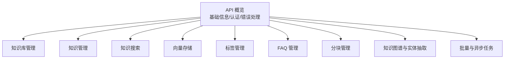

**图表来源**
- [API 概览:1-83](file://docs/api/README.md#L1-L83)

**章节来源**
- [API 概览:1-83](file://docs/api/README.md#L1-L83)

## 核心组件
- 知识库（KnowledgeBase）：承载知识内容与检索配置，支持文档型与 FAQ 型两类。
- 知识（Knowledge）：具体的知识条目，支持文件、URL、手动 Markdown 三种来源。
- 分块（Chunk）：知识内容切分后的最小检索单元，支持内容与元信息更新。
- 标签（Tag）：知识条目的分类标签，支持统计与批量更新。
- FAQ 条目（FAQEntry）：FAQ 知识对，支持相似问题、反例问题、批量导入与混合检索。
- 向量存储（VectorStore）：多种引擎类型的向量数据库连接配置与测试。
- 知识图谱（Graph）：基于实体与关系抽取构建，支持 Neo4j 存储与查询。

**章节来源**
- [知识库管理 API:1-729](file://docs/api/knowledge-base.md#L1-L729)
- [知识管理 API:1-683](file://docs/api/knowledge.md#L1-L683)
- [分块管理 API:1-225](file://docs/api/chunk.md#L1-L225)
- [标签管理 API:1-151](file://docs/api/tag.md#L1-L151)
- [FAQ管理 API:1-503](file://docs/api/faq.md#L1-L503)
- [向量存储 API:1-362](file://docs/api/vector-store.md#L1-L362)
- [知识图谱:1-29](file://docs/KnowledgeGraph.md#L1-L29)

## 架构总览
WeKnora 的 API 采用 RESTful 设计，统一使用 X-API-Key 进行认证，响应统一为 JSON。核心流程包括：
- 知识库配置与检索策略（向量/关键词/FAQ）
- 文档上传/URL抓取/手动 Markdown 创建
- 解析与索引（分块、嵌入、向量入库）
- 检索（混合检索、FAQ 混合检索）
- 异步任务（复制知识库、迁移知识、FAQ 导入进度）

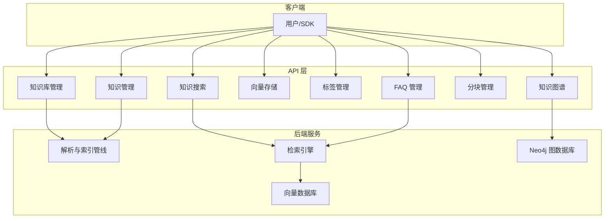

**图表来源**
- [知识库管理 API:1-729](file://docs/api/knowledge-base.md#L1-L729)
- [知识管理 API:1-683](file://docs/api/knowledge.md#L1-L683)
- [知识搜索 API:1-75](file://docs/api/knowledge-search.md#L1-L75)
- [向量存储 API:1-362](file://docs/api/vector-store.md#L1-L362)
- [标签管理 API:1-151](file://docs/api/tag.md#L1-L151)
- [FAQ管理 API:1-503](file://docs/api/faq.md#L1-L503)
- [分块管理 API:1-225](file://docs/api/chunk.md#L1-L225)
- [知识图谱:1-29](file://docs/KnowledgeGraph.md#L1-L29)

## 详细组件分析

### 知识库管理 API
- 功能要点
  - 创建/查询/更新/删除知识库
  - 拷贝知识库（异步任务）
  - 混合搜索（向量+关键词）
  - 置顶/取消置顶
  - 获取可迁移目标知识库列表
- 关键配置
  - 分块策略（大小、重叠、分隔符、父子块）
  - 多模态与图像处理配置
  - 嵌入模型、摘要模型、VLM/ASR 配置
  - 存储提供者与兼容的 cos_config/storage_config
  - 实体抽取与 FAQ 配置
- 异步任务
  - 拷贝进度查询（copy/progress/:task_id）

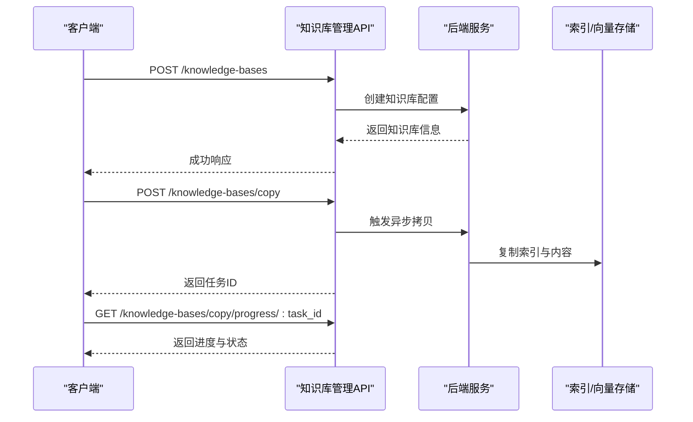

**图表来源**
- [知识库管理 API:465-525](file://docs/api/knowledge-base.md#L465-L525)

**章节来源**
- [知识库管理 API:1-729](file://docs/api/knowledge-base.md#L1-L729)

### 知识管理 API
- 功能要点
  - 从文件/URL/手动 Markdown 创建知识
  - 查询/批量查询/删除/下载/预览
  - 更新知识元数据、标签、图像分块信息
  - 重新解析（异步）
  - 搜索/过滤（关键词、文件类型、Agent）
  - 迁移知识到其他知识库（异步）
- 关键状态
  - parse_status：pending/processing/failed/completed
  - enable_status：enabled/disabled
- 异步任务
  - 迁移进度查询（move/progress/:task_id）

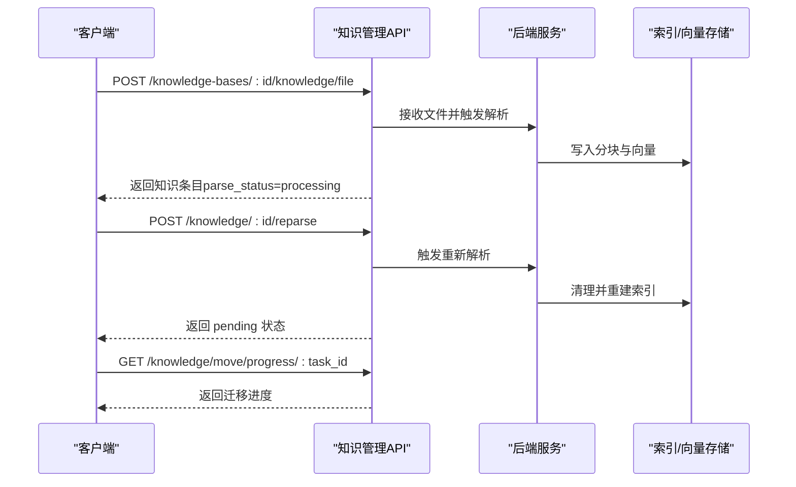

**图表来源**
- [知识管理 API:513-662](file://docs/api/knowledge.md#L513-L662)

**章节来源**
- [知识管理 API:1-683](file://docs/api/knowledge.md#L1-L683)

### 知识搜索 API
- 功能要点
  - 在知识库中进行向量检索（不使用 LLM 总结）
  - 支持单知识库或多知识库搜索
  - 支持指定知识ID列表检索
- 返回结构
  - chunk_id/content/knowledge_id/score/metadata 等

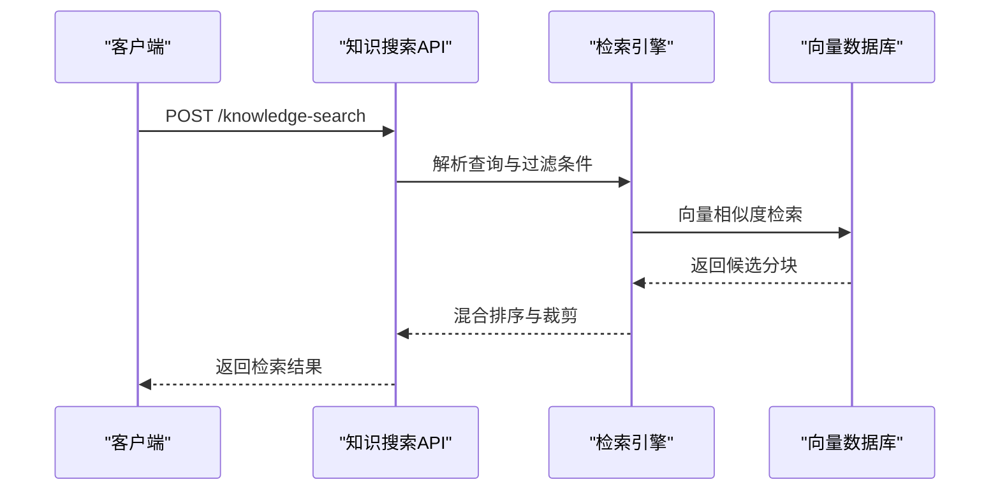

**图表来源**
- [知识搜索 API:9-74](file://docs/api/knowledge-search.md#L9-L74)

**章节来源**
- [知识搜索 API:1-75](file://docs/api/knowledge-search.md#L1-L75)

### 向量存储 API
- 功能要点
  - 获取支持的引擎类型与配置字段
  - 使用原始凭据测试连接（不保存）
  - 创建/查询/更新/删除向量存储
  - 测试已保存的连接（自动回写版本）
- 支持引擎
  - Elasticsearch、PostgreSQL、Qdrant、Milvus、Weaviate、SQLite
- 环境变量存储
  - 以只读虚拟条目形式出现，不可修改/删除，但可测试

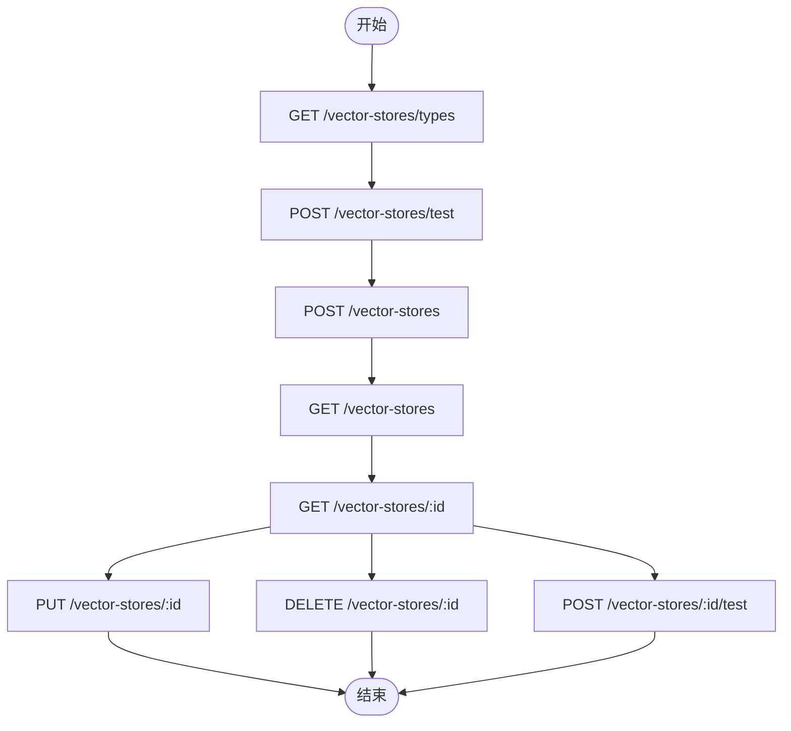

**图表来源**
- [向量存储 API:20-362](file://docs/api/vector-store.md#L20-L362)

**章节来源**
- [向量存储 API:1-362](file://docs/api/vector-store.md#L1-L362)

### 标签管理 API
- 功能要点
  - 获取知识库标签列表（分页、关键词过滤）
  - 创建/更新/删除标签
  - 批量更新知识标签
- 注意事项
  - 删除标签支持强制删除与排除某些内容

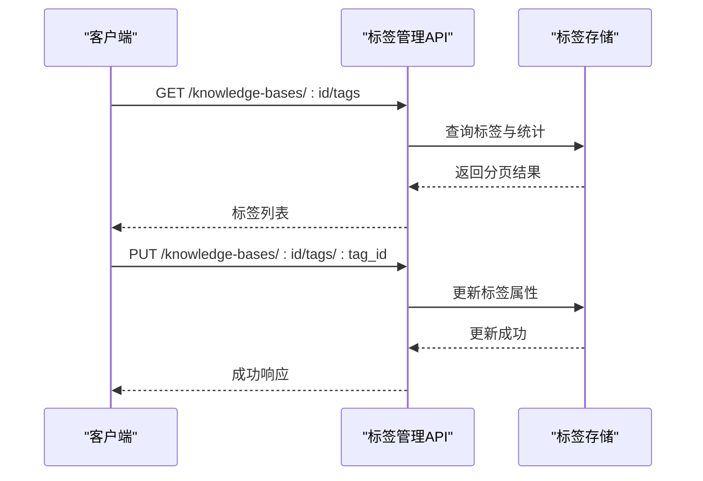

**图表来源**
- [标签管理 API:12-151](file://docs/api/tag.md#L12-L151)

**章节来源**
- [标签管理 API:1-151](file://docs/api/tag.md#L1-L151)

### FAQ 管理 API
- 功能要点
  - 列表查询（分页、关键词、字段过滤、排序）
  - 批量导入（append/replace，异步）
  - 单条创建/更新/删除
  - 添加相似问题
  - 批量更新字段（启用/推荐/标签）
  - 批量更新标签
  - 混合检索（FAQ）
  - 导出为 CSV
  - 导入进度查询与显示状态更新
- 异步任务
  - 导入进度查询（faq/import/progress/:task_id）

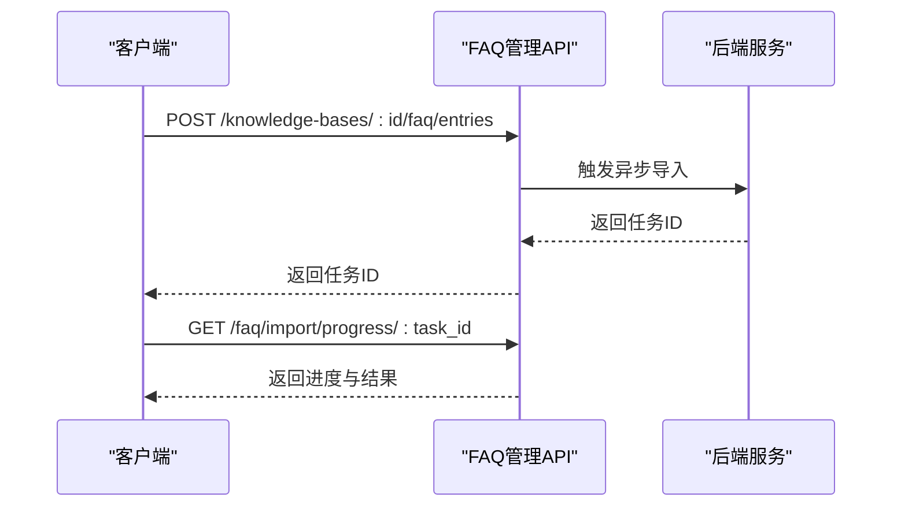

**图表来源**
- [FAQ管理 API:87-128](file://docs/api/faq.md#L87-L128)

**章节来源**
- [FAQ管理 API:1-503](file://docs/api/faq.md#L1-L503)

### 分块管理 API
- 功能要点
  - 获取知识的分块列表（分页）
  - 更新/删除指定分块
  - 删除知识下所有分块
  - 根据分块ID直接获取
  - 删除分块的生成问题

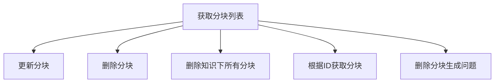

**图表来源**
- [分块管理 API:14-225](file://docs/api/chunk.md#L14-L225)

**章节来源**
- [分块管理 API:1-225](file://docs/api/chunk.md#L1-L225)

### 知识图谱与实体抽取
- 快速开始
  - 配置 Neo4j 环境变量并启动
  - 在知识库设置中启用实体与关系提取
- 生成与查看
  - 上传文档后自动提取实体与关系
  - 登录 Neo4j 控制台查看图谱
- 对话集成
  - 系统在对话时自动查询知识图谱并获取相关知识

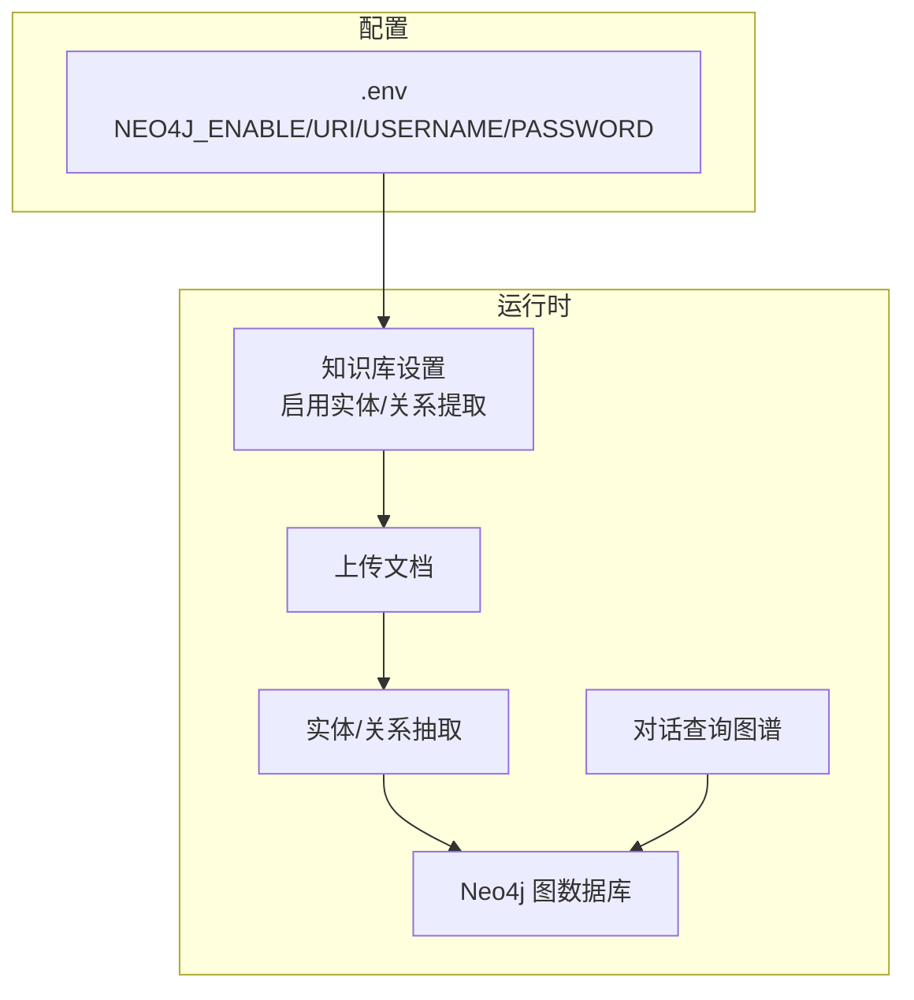

**图表来源**
- [知识图谱:1-29](file://docs/KnowledgeGraph.md#L1-L29)

**章节来源**
- [知识图谱:1-29](file://docs/KnowledgeGraph.md#L1-L29)

## 依赖分析
- 客户端 SDK 与后端 API 的映射
  - 知识库管理：client/knowledgebase.go
  - 知识管理：client/knowledge.go
  - FAQ 管理：client/faq.go
  - 标签管理：client/tag.go
- 异步任务
  - 知识库复制、知识迁移、FAQ 导入均采用任务ID与进度查询
- 向量存储
  - 支持多引擎，提供连接测试与版本自动检测

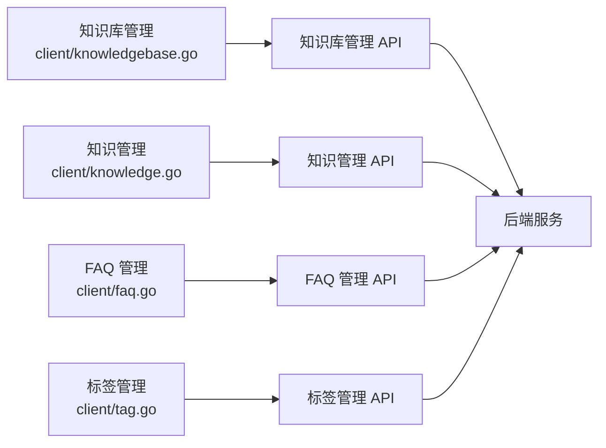

**图表来源**
- [知识库管理（客户端）:198-422](file://client/knowledgebase.go#L198-L422)
- [知识管理（客户端）:85-619](file://client/knowledge.go#L85-L619)
- [FAQ管理（客户端）:155-468](file://client/faq.go#L155-L468)
- [标签管理（客户端）:76-187](file://client/tag.go#L76-L187)

**章节来源**
- [知识库管理（客户端）:1-423](file://client/knowledgebase.go#L1-L423)
- [知识管理（客户端）:1-620](file://client/knowledge.go#L1-L620)
- [FAQ管理（客户端）:1-469](file://client/faq.go#L1-L469)
- [标签管理（客户端）:1-188](file://client/tag.go#L1-L188)

## 性能考虑
- 检索性能
  - 合理设置向量阈值与关键词阈值，平衡召回与速度
  - 控制 match_count，避免返回过多结果
- 索引与存储
  - 选择合适的向量存储引擎与索引配置
  - 定期维护与版本检测，确保连接稳定
- 异步任务
  - 批量导入/迁移采用异步，及时查询进度
- 图谱查询
  - 在对话中启用图谱查询时，注意查询负载与 Neo4j 性能

## 故障排查指南
- 常见错误与处理
  - 401 未认证：检查 X-API-Key 是否正确
  - 404 不存在：确认资源ID是否存在
  - 409 同一 endpoint + index 组合已存在：调整连接配置
  - 500 内部错误：查看后端日志并重试
- 异步任务状态
  - pending/processing/completed/failed：通过任务ID轮询进度
- 向量存储连接
  - 使用 /vector-stores/test 或 /:id/test 进行连通性测试
- 知识解析
  - parse_status=failed 时，可通过 reparse 重新解析

**章节来源**
- [向量存储 API:353-362](file://docs/api/vector-store.md#L353-L362)
- [知识管理 API:513-545](file://docs/api/knowledge.md#L513-L545)

## 结论
WeKnora 的知识管理 API 提供了从知识库配置、知识内容管理、检索策略、标签与 FAQ 管理到向量存储与知识图谱的完整能力。通过异步任务与统一的错误处理机制，开发者可以高效地构建企业级知识应用。建议在生产环境中结合性能调优与监控体系，确保检索与索引的稳定性与可扩展性。

## 附录
- 认证与基础信息
  - 基础 URL：/api/v1
  - 认证方式：X-API-Key
  - 错误响应格式：统一的 success/error/code/message/details
- API 概览导航
  - 按功能模块快速跳转至对应文档

**章节来源**
- [API 概览:1-83](file://docs/api/README.md#L1-L83)