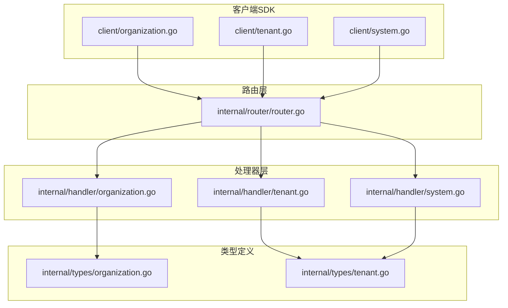
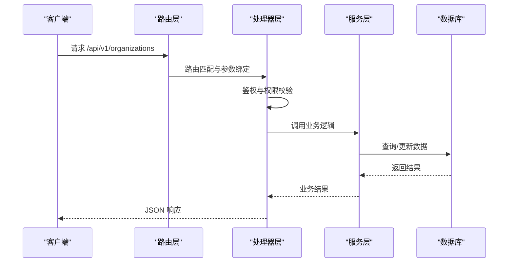
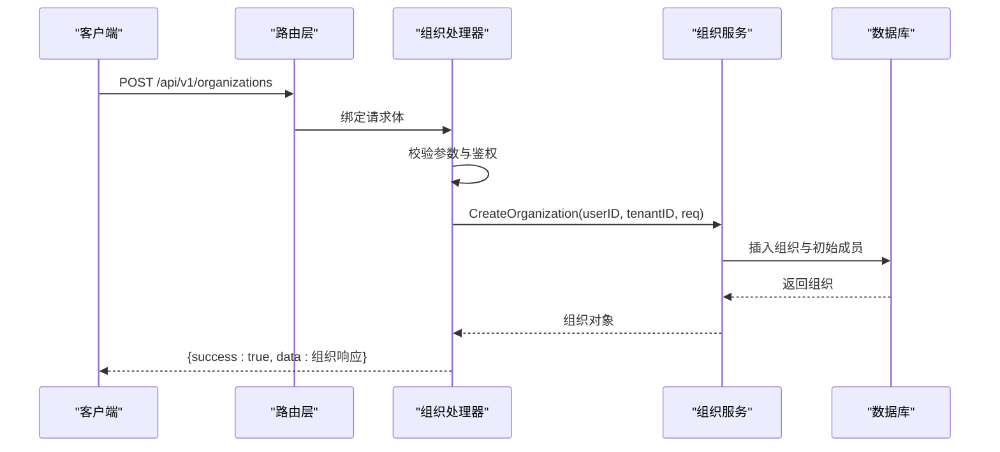
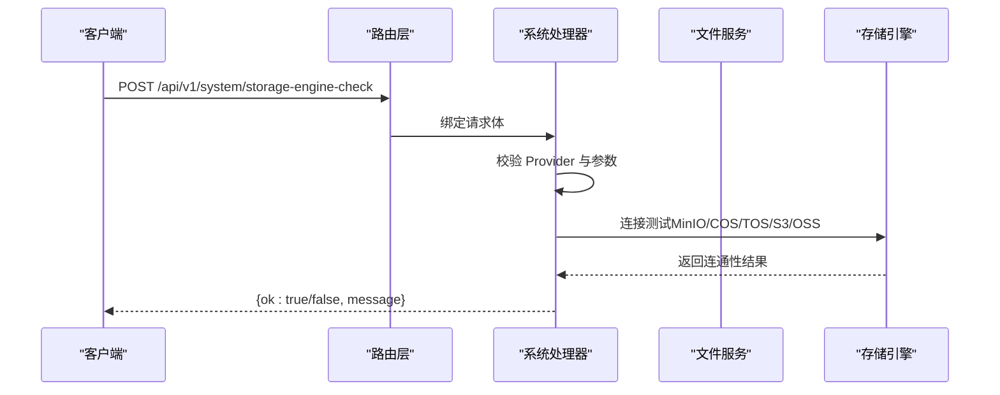
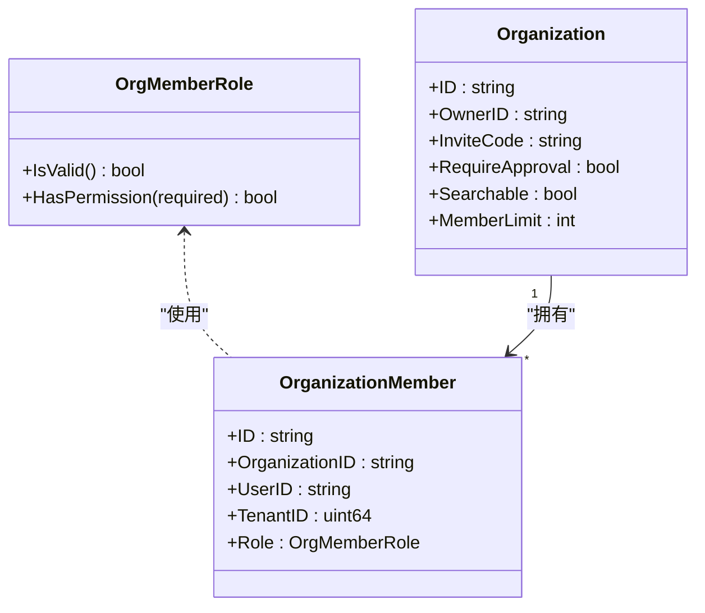
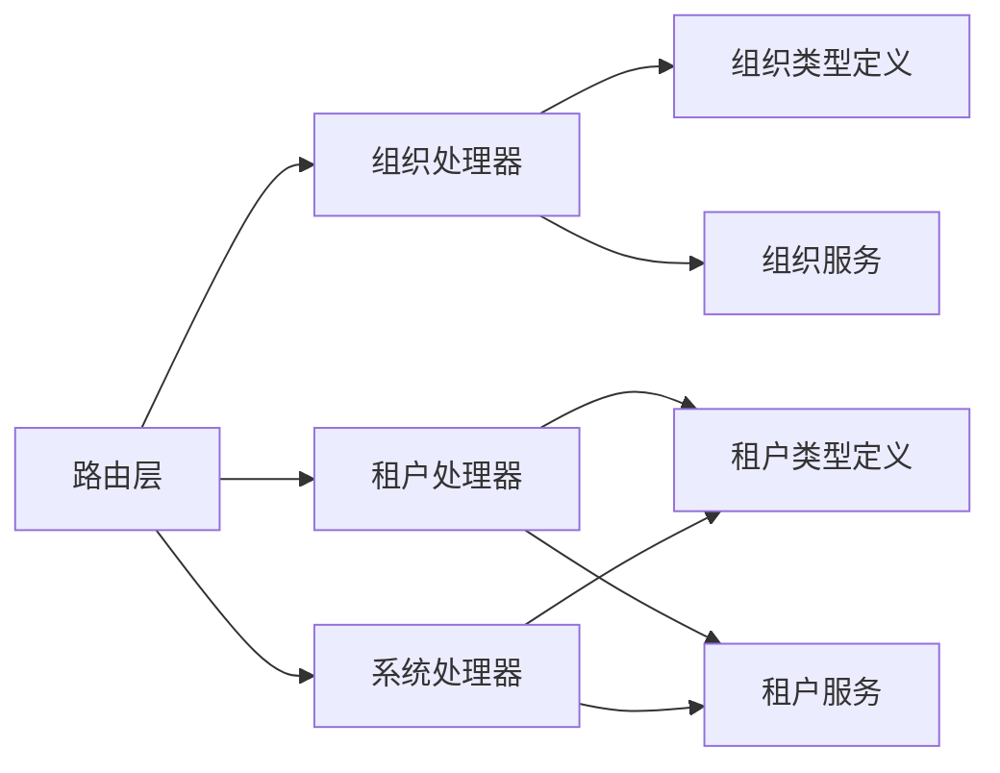

# 系统与组织API

<cite>
**本文档引用的文件**
- [organization.go](file://client/organization.go)
- [tenant.go](file://client/tenant.go)
- [system.go](file://client/system.go)
- [organization.go](file://internal/handler/organization.go)
- [tenant.go](file://internal/handler/tenant.go)
- [system.go](file://internal/handler/system.go)
- [router.go](file://internal/router/router.go)
- [organization.go](file://internal/types/organization.go)
- [tenant.go](file://internal/types/tenant.go)
- [main.go](file://cmd/server/main.go)
</cite>

## 目录
1. [简介](#简介)
2. [项目结构](#项目结构)
3. [核心组件](#核心组件)
4. [架构总览](#架构总览)
5. [详细组件分析](#详细组件分析)
6. [依赖关系分析](#依赖关系分析)
7. [性能考虑](#性能考虑)
8. [故障排除指南](#故障排除指南)
9. [结论](#结论)

## 简介
本文件为 WeKnora 系统与组织 API 的完整接口文档，覆盖组织管理、多租户隔离、用户权限、系统配置、监控指标与日志管理等能力。文档基于代码仓库中的客户端 SDK、后端处理器与路由定义进行梳理，确保接口规范与实现一致。

## 项目结构
WeKnora 采用分层架构：
- 客户端 SDK：封装了组织、租户、系统相关 API 的请求与响应模型
- 路由层：定义 /api/v1 下的 REST 接口路径与分组
- 处理器层：实现具体业务逻辑，负责鉴权、参数校验、调用服务层
- 类型定义：统一的数据结构与枚举，保证前后端一致性



**图表来源**
- [router.go:566-647](file://internal/router/router.go#L566-L647)
- [organization.go:19-52](file://internal/handler/organization.go#L19-L52)
- [tenant.go:19-27](file://internal/handler/tenant.go#L19-L27)
- [system.go:26-46](file://internal/handler/system.go#L26-L46)

**章节来源**
- [router.go:566-647](file://internal/router/router.go#L566-L647)
- [organization.go:19-52](file://internal/handler/organization.go#L19-L52)
- [tenant.go:19-27](file://internal/handler/tenant.go#L19-L27)
- [system.go:26-46](file://internal/handler/system.go#L26-L46)

## 核心组件
- 组织管理：组织 CRUD、成员管理、邀请与加入、角色升级、知识库与智能体共享
- 租户管理：租户 CRUD、跨租户访问控制、租户级 KV 配置（Agent、WebSearch、Parser、Storage、ChatHistory、Retrieval 等）
- 系统管理：系统信息、解析引擎、存储引擎状态与连通性检测、文档转换器重连

**章节来源**
- [organization.go:162-644](file://client/organization.go#L162-L644)
- [tenant.go:67-231](file://client/tenant.go#L67-L231)
- [system.go:60-150](file://client/system.go#L60-L150)

## 架构总览
系统通过 Gin 路由注册各类 API，认证中间件在路由组上生效，文件服务统一代理本地/MinIO/COS/TOS 存储后端。健康检查接口无需认证，Swagger 文档在非生产模式下可用。



**图表来源**
- [router.go:131-158](file://internal/router/router.go#L131-L158)
- [organization.go:54-94](file://internal/handler/organization.go#L54-L94)

**章节来源**
- [router.go:93-107](file://internal/router/router.go#L93-L107)
- [router.go:117-129](file://internal/router/router.go#L117-L129)
- [router.go:131-158](file://internal/router/router.go#L131-L158)

## 详细组件分析

### 组织管理 API
- 组织 CRUD
  - POST /api/v1/organizations：创建组织（创建者为管理员）
  - GET /api/v1/organizations：列出当前用户所属组织
  - GET /api/v1/organizations/{id}：获取组织详情
  - PUT /api/v1/organizations/{id}：更新组织（需管理员）
  - DELETE /api/v1/organizations/{id}：删除组织（仅创建者）
- 成员管理
  - GET /api/v1/organizations/{id}/members：列出成员
  - PUT /api/v1/organizations/{id}/members/{user_id}：更新成员角色（需管理员）
  - DELETE /api/v1/organizations/{id}/members/{user_id}：移除成员（需管理员）
  - POST /api/v1/organizations/{id}/invite-code：生成邀请码（需管理员）
  - GET /api/v1/organizations/preview/{code}：预览组织信息（无需加入）
  - POST /api/v1/organizations/join：通过邀请码加入组织
  - POST /api/v1/organizations/join-request：提交加入申请（需审核）
  - POST /api/v1/organizations/join-by-id：通过组织 ID 加入（无需邀请码）
  - POST /api/v1/organizations/{id}/leave：离开组织
  - POST /api/v1/organizations/{id}/request-upgrade：申请权限升级
  - GET /api/v1/organizations/{id}/search-users：搜索可邀请用户（管理员）
  - POST /api/v1/organizations/{id}/invite：直接邀请成员（管理员）
  - GET /api/v1/organizations/{id}/join-requests：列出待审加入请求（管理员）
  - PUT /api/v1/organizations/{id}/join-requests/{request_id}/review：审核加入请求（管理员）
- 资源共享
  - POST /api/v1/knowledge-bases/{id}/shares：分享知识库到组织
  - GET /api/v1/knowledge-bases/{id}/shares：列出知识库分享
  - PUT /api/v1/knowledge-bases/{id}/shares/{share_id}：更新分享权限
  - DELETE /api/v1/knowledge-bases/{id}/shares/{share_id}：移除知识库分享
  - POST /api/v1/agents/{id}/shares：分享智能体到组织
  - GET /api/v1/agents/{id}/shares：列出智能体分享
  - DELETE /api/v1/agents/{id}/shares/{share_id}：移除智能体分享
  - GET /api/v1/organizations/{id}/shares：列出组织收到的知识库分享
  - GET /api/v1/organizations/{id}/agent-shares：列出组织收到的智能体分享
  - GET /api/v1/shared-knowledge-bases：列出当前用户可访问的共享知识库
  - GET /api/v1/shared-agents：列出当前用户可访问的共享智能体
  - POST /api/v1/shared-agents/disabled：隐藏共享智能体（租户偏好）



**图表来源**
- [router.go:566-619](file://internal/router/router.go#L566-L619)
- [organization.go:54-94](file://internal/handler/organization.go#L54-L94)

**章节来源**
- [organization.go:162-644](file://client/organization.go#L162-L644)
- [organization.go:54-94](file://internal/handler/organization.go#L54-L94)
- [organization.go:566-619](file://internal/router/router.go#L566-L619)

### 租户管理 API
- 租户 CRUD
  - POST /api/v1/tenants：创建租户
  - GET /api/v1/tenants/{id}：获取租户详情（需目标租户权限或跨租户访问）
  - PUT /api/v1/tenants/{id}：更新租户
  - DELETE /api/v1/tenants/{id}：删除租户
  - GET /api/v1/tenants：获取当前用户可访问的租户列表
  - GET /api/v1/tenants/all：获取所有租户（需跨租户访问权限）
  - GET /api/v1/tenants/search：搜索租户（需跨租户访问权限）
- 租户级 KV 配置
  - GET /api/v1/tenants/kv/{key}：获取租户 KV 配置（支持 agent-config、web-search-config、conversation-config、prompt-templates、parser-engine-config、storage-engine-config、chat-history-config、retrieval-config）
  - PUT /api/v1/tenants/kv/{key}：更新租户 KV 配置

```mermaid
flowchart TD
Start(["请求进入 /api/v1/tenants"]) --> CheckAuth["鉴权与跨租户权限校验"]
CheckAuth --> Path{"路径类型"}
Path --> |GET /tenants/{id}| GetTenant["GetTenant"]
Path --> |PUT /tenants/{id}| UpdateTenant["UpdateTenant"]
Path --> |KV 配置| KVHandler["KV 配置处理器"]
GetTenant --> End(["返回租户详情"])
UpdateTenant --> End
KVHandler --> End
```

**图表来源**
- [tenant.go:357-377](file://internal/router/router.go#L357-L377)
- [tenant.go:29-52](file://internal/handler/tenant.go#L29-L52)
- [tenant.go:598-690](file://internal/handler/tenant.go#L598-L690)

**章节来源**
- [tenant.go:67-231](file://client/tenant.go#L67-L231)
- [tenant.go:357-377](file://internal/router/router.go#L357-L377)
- [tenant.go:29-52](file://internal/handler/tenant.go#L29-L52)
- [tenant.go:598-690](file://internal/handler/tenant.go#L598-L690)

### 系统管理 API
- 系统信息
  - GET /api/v1/system/info：获取系统版本、构建信息与引擎配置
- 解析引擎
  - GET /api/v1/system/parser-engines：列出可用解析引擎（含远程 DocReader 引擎）
  - POST /api/v1/system/parser-engines/check：使用当前表单参数检测引擎可用性
  - POST /api/v1/system/docreader/reconnect：重连文档转换器
- 存储引擎
  - GET /api/v1/system/storage-engine-status：获取存储引擎可用状态（local/minio/cos/tos/oss）
  - POST /api/v1/system/storage-engine-check：检测单个存储引擎连通性（MinIO/COS/TOS/S3/OSS）



**图表来源**
- [router.go:448-459](file://internal/router/router.go#L448-L459)
- [system.go:593-625](file://internal/handler/system.go#L593-L625)

**章节来源**
- [system.go:60-150](file://client/system.go#L60-L150)
- [system.go:448-459](file://internal/router/router.go#L448-L459)
- [system.go:593-625](file://internal/handler/system.go#L593-L625)

### 权限与租户隔离
- 跨租户访问控制
  - 通过配置项与用户属性控制是否允许跨租户访问
  - 租户 ID 不匹配时，若无跨租户权限则拒绝访问
- 组织内权限模型
  - 角色：admin/editor/viewer，具备层级权限判断
  - 共享资源权限：取“组织授予权限”与“用户在组织内角色”的最小值



**图表来源**
- [organization.go:9-39](file://internal/types/organization.go#L9-L39)
- [organization.go:41-108](file://internal/types/organization.go#L41-L108)

**章节来源**
- [tenant.go:29-52](file://internal/handler/tenant.go#L29-L52)
- [organization.go:9-39](file://internal/types/organization.go#L9-L39)

## 依赖关系分析
- 路由到处理器：路由层通过分组注册组织、租户、系统等模块的处理器
- 处理器到服务：处理器负责鉴权与参数校验，调用对应服务层执行业务
- 类型到数据库：类型定义映射到数据库表，支持软删除与关联查询
- 客户端到服务：客户端 SDK 封装请求与响应，便于应用集成



**图表来源**
- [router.go:566-647](file://internal/router/router.go#L566-L647)
- [organization.go:19-52](file://internal/handler/organization.go#L19-L52)
- [tenant.go:19-27](file://internal/handler/tenant.go#L19-L27)
- [system.go:26-46](file://internal/handler/system.go#L26-L46)

**章节来源**
- [router.go:566-647](file://internal/router/router.go#L566-L647)

## 性能考虑
- 批量资源计数：组织列表接口一次性拉取多个维度的资源计数，减少多次往返
- 存储引擎检测：连通性检测支持自动创建缺失的桶，避免重复配置成本
- 跨租户访问：仅在必要时开启跨租户访问，降低鉴权与数据过滤复杂度

[本节为通用指导，不涉及具体文件分析]

## 故障排除指南
- 健康检查
  - GET /health：服务健康状态，无需认证
- 常见错误
  - 401 未授权：缺少或无效的 Bearer Token 或 X-API-Key
  - 403 权限不足：跨租户访问未启用或角色权限不足
  - 404 资源不存在：组织/租户/知识库/智能体 ID 错误
  - 400 参数错误：请求体格式或字段校验失败
- 日志与追踪
  - 中间件记录请求 ID、语言、错误与恢复
  - 可选 Langfuse 观测中间件（当环境变量配置时启用）

**章节来源**
- [router.go:93-96](file://internal/router/router.go#L93-L96)
- [router.go:86-91](file://internal/router/router.go#L86-L91)
- [router.go:126-128](file://internal/router/router.go#L126-L128)

## 结论
本文档基于 WeKnora 代码库梳理了系统与组织 API 的完整接口规范，涵盖组织管理、多租户隔离、权限控制、系统配置与监控等方面。建议在生产环境中：
- 明确跨租户访问策略与权限边界
- 使用租户级 KV 配置精细化控制功能开关与资源配额
- 定期检查存储引擎连通性与系统健康状态
- 通过 Swagger 文档与客户端 SDK 快速集成与验证接口行为