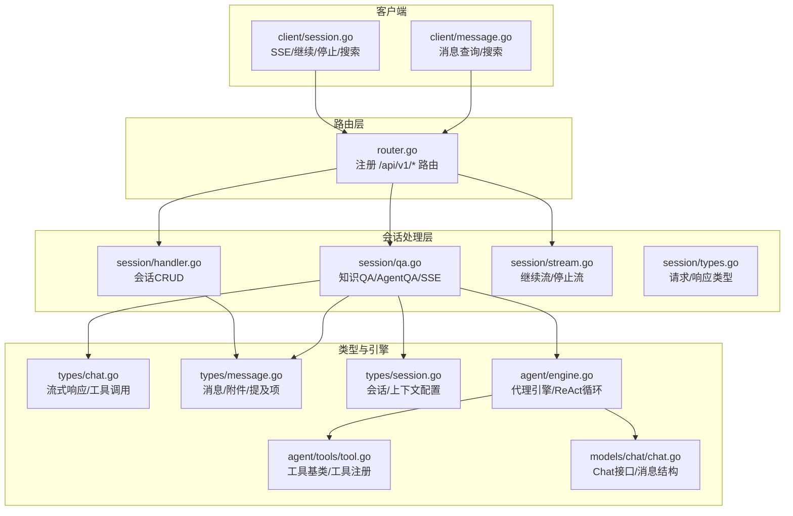
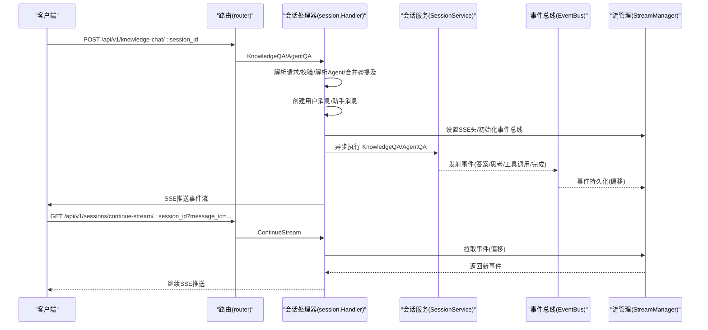
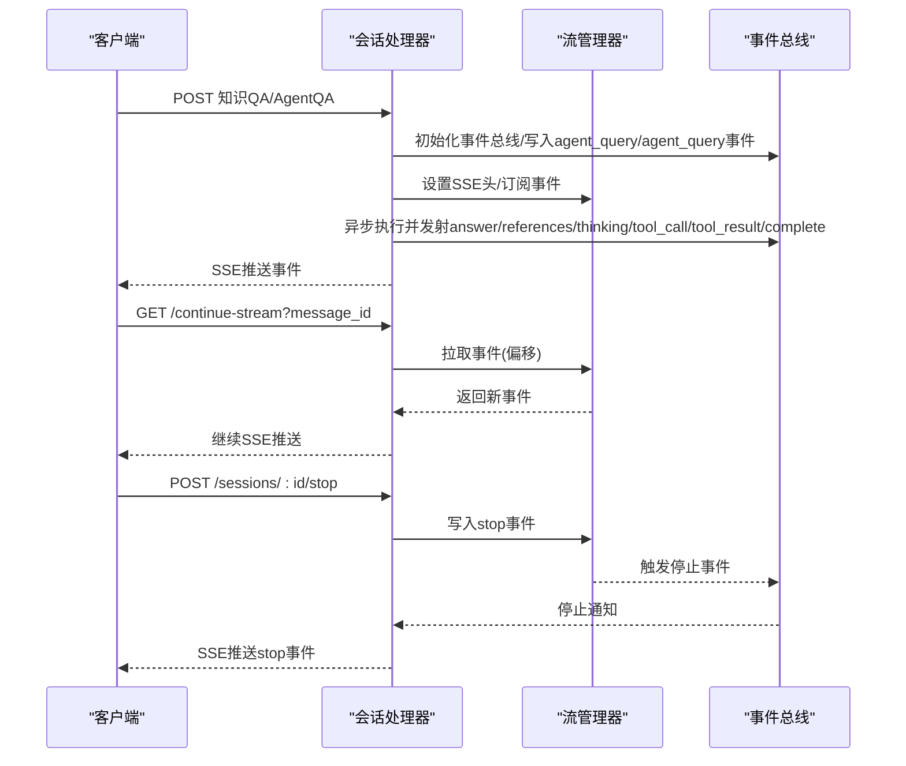
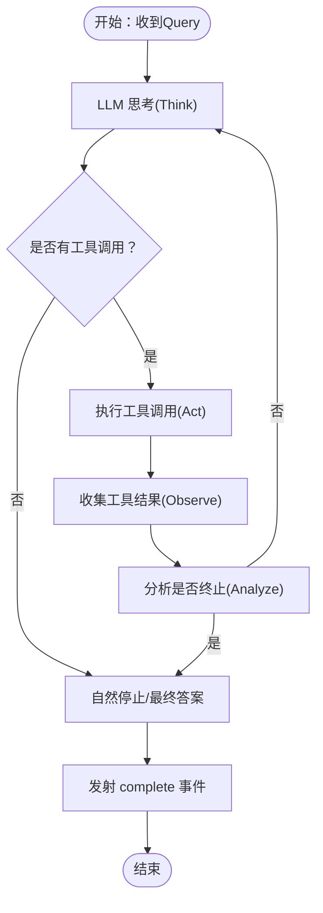
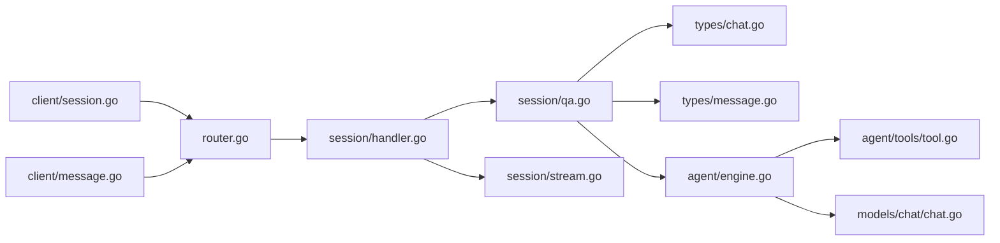

# 聊天API

<cite>
**本文引用的文件**
- [internal/handler/session/qa.go](file://internal/handler/session/qa.go)
- [internal/handler/session/stream.go](file://internal/handler/session/stream.go)
- [internal/handler/session/handler.go](file://internal/handler/session/handler.go)
- [internal/handler/session/types.go](file://internal/handler/session/types.go)
- [internal/router/router.go](file://internal/router/router.go)
- [internal/types/chat.go](file://internal/types/chat.go)
- [internal/types/message.go](file://internal/types/message.go)
- [internal/types/session.go](file://internal/types/session.go)
- [internal/agent/engine.go](file://internal/agent/engine.go)
- [internal/agent/tools/tool.go](file://internal/agent/tools/tool.go)
- [internal/models/chat/chat.go](file://internal/models/chat/chat.go)
- [client/session.go](file://client/session.go)
- [client/message.go](file://client/message.go)
</cite>

## 目录
1. [简介](#简介)
2. [项目结构](#项目结构)
3. [核心组件](#核心组件)
4. [架构总览](#架构总览)
5. [详细组件分析](#详细组件分析)
6. [依赖关系分析](#依赖关系分析)
7. [性能考量](#性能考量)
8. [故障排查指南](#故障排查指南)
9. [结论](#结论)
10. [附录](#附录)

## 简介
本文件为 WeKnora 聊天 API 的完整接口文档，覆盖以下能力：
- Quick Q&A 与智能推理（Agent）两种模式的问答接口
- 消息发送、会话管理、历史记录查询
- 流式响应（SSE）的建立与继续机制
- 聊天上下文管理、附件上传与多媒体消息处理
- 工具调用与代理执行（Agent ReAct 循环）
- 请求参数、响应格式与错误处理示例

WeKnora 将“会话”抽象为轻量容器，配置（如知识库、模型、Agent 行为）在每次请求时由 Custom Agent 决定；后端通过事件总线与流管理器实现 SSE 流式输出，并支持断连重连与主动停止。

## 项目结构
围绕聊天 API 的关键模块如下：
- 路由层：定义 /api/v1 下的会话、消息、聊天等 REST 接口
- 会话处理器：实现会话生命周期、消息流式输出、停止与继续
- 类型定义：消息、会话、流式响应、Agent 配置等数据结构
- 代理引擎：实现 ReAct 循环、工具调用、上下文压缩与事件发射
- 客户端封装：提供 Go 客户端对 SSE 的读取与回调处理

图表来源
- [internal/router/router.go:337-355](file://internal/router/router.go#L337-L355)
- [internal/handler/session/handler.go:16-29](file://internal/handler/session/handler.go#L16-L29)
- [internal/handler/session/qa.go:21-62](file://internal/handler/session/qa.go#L21-L62)
- [internal/handler/session/stream.go:18-30](file://internal/handler/session/stream.go#L18-L30)
- [internal/types/chat.go:28-75](file://internal/types/chat.go#L28-L75)
- [internal/types/message.go:176-224](file://internal/types/message.go#L176-L224)
- [internal/types/session.go:74-108](file://internal/types/session.go#L74-L108)
- [internal/agent/engine.go:28-46](file://internal/agent/engine.go#L28-L46)
- [internal/agent/tools/tool.go:10-15](file://internal/agent/tools/tool.go#L10-L15)
- [internal/models/chat/chat.go:81-94](file://internal/models/chat/chat.go#L81-L94)
- [client/session.go:265-343](file://client/session.go#L265-L343)
- [client/message.go:63-90](file://client/message.go#L63-L90)

章节来源
- [internal/router/router.go:337-355](file://internal/router/router.go#L337-L355)
- [internal/handler/session/handler.go:16-29](file://internal/handler/session/handler.go#L16-L29)
- [internal/handler/session/qa.go:21-62](file://internal/handler/session/qa.go#L21-L62)
- [internal/handler/session/stream.go:18-30](file://internal/handler/session/stream.go#L18-L30)
- [internal/types/chat.go:28-75](file://internal/types/chat.go#L28-L75)
- [internal/types/message.go:176-224](file://internal/types/message.go#L176-L224)
- [internal/types/session.go:74-108](file://internal/types/session.go#L74-L108)
- [internal/agent/engine.go:28-46](file://internal/agent/engine.go#L28-L46)
- [internal/agent/tools/tool.go:10-15](file://internal/agent/tools/tool.go#L10-L15)
- [internal/models/chat/chat.go:81-94](file://internal/models/chat/chat.go#L81-L94)
- [client/session.go:265-343](file://client/session.go#L265-L343)
- [client/message.go:63-90](file://client/message.go#L63-L90)

## 核心组件
- 会话处理器 Handler：提供会话创建、查询、更新、删除、清空消息、批量删除等接口
- 知识问答处理器：支持 Quick Q&A（RAG/纯聊天）与 Agent 智能问答，统一通过 SSE 输出
- 流管理器：基于事件偏移的拉取式 SSE，支持断连重连与停止事件
- 类型系统：消息、附件、提及项、流式响应、Agent 步骤与工具调用等
- 代理引擎：实现 ReAct 循环、工具注册与执行、上下文窗口管理、事件发射
- 客户端封装：SSE 读取、回调处理、继续流、停止流、知识检索

章节来源
- [internal/handler/session/handler.go:66-127](file://internal/handler/session/handler.go#L66-L127)
- [internal/handler/session/qa.go:450-512](file://internal/handler/session/qa.go#L450-L512)
- [internal/handler/session/stream.go:18-30](file://internal/handler/session/stream.go#L18-L30)
- [internal/types/message.go:69-144](file://internal/types/message.go#L69-L144)
- [internal/agent/engine.go:158-298](file://internal/agent/engine.go#L158-L298)
- [client/session.go:265-343](file://client/session.go#L265-L343)

## 架构总览
WeKnora 的聊天 API 采用“路由 -> 处理器 -> 服务/引擎 -> 事件总线 -> SSE”的链路。请求进入后，处理器解析参数、创建用户/助手消息、启动异步执行（知识 QA 或 Agent），并通过事件总线推送事件，最终由 SSE 推送至客户端。

图表来源
- [internal/router/router.go:337-355](file://internal/router/router.go#L337-L355)
- [internal/handler/session/qa.go:522-658](file://internal/handler/session/qa.go#L522-L658)
- [internal/handler/session/stream.go:31-176](file://internal/handler/session/stream.go#L31-L176)

章节来源
- [internal/router/router.go:337-355](file://internal/router/router.go#L337-L355)
- [internal/handler/session/qa.go:522-658](file://internal/handler/session/qa.go#L522-L658)
- [internal/handler/session/stream.go:31-176](file://internal/handler/session/stream.go#L31-L176)

## 详细组件分析

### 会话管理接口
- 创建会话
  - 方法：POST /api/v1/sessions
  - 请求体：CreateSessionRequest（title, description）
  - 响应：Session
- 获取会话详情
  - 方法：GET /api/v1/sessions/:id
  - 响应：Session
- 获取会话列表（分页）
  - 方法：GET /api/v1/sessions?page&page_size
  - 响应：SessionListResponse
- 更新会话
  - 方法：PUT /api/v1/sessions/:id
  - 请求体：CreateSessionRequest
  - 响应：Session
- 删除会话
  - 方法：DELETE /api/v1/sessions/:id
  - 响应：操作结果
- 清空会话消息
  - 方法：DELETE /api/v1/sessions/:id/messages
  - 响应：操作结果
- 批量删除会话
  - 方法：DELETE /api/v1/sessions/batch
  - 请求体：{ ids: string[], delete_all: boolean }

章节来源
- [internal/handler/session/handler.go:66-127](file://internal/handler/session/handler.go#L66-L127)
- [internal/handler/session/handler.go:176-216](file://internal/handler/session/handler.go#L176-L216)
- [internal/handler/session/handler.go:218-287](file://internal/handler/session/handler.go#L218-L287)
- [internal/handler/session/handler.go:289-329](file://internal/handler/session/handler.go#L289-L329)
- [internal/handler/session/handler.go:331-371](file://internal/handler/session/handler.go#L331-L371)
- [internal/handler/session/handler.go:379-443](file://internal/handler/session/handler.go#L379-L443)

### 消息与历史记录接口
- 加载会话消息（上滑加载）
  - 方法：GET /api/v1/messages/:session_id/load?limit&before_time
  - 响应：MessageListResponse
- 搜索历史消息
  - 方法：POST /api/v1/messages/search
  - 请求体：SearchMessagesRequest（query, mode, limit, session_ids）
  - 响应：MessageSearchResult
- 获取聊天历史知识库统计
  - 方法：GET /api/v1/messages/chat-history-stats
  - 响应：ChatHistoryKBStats
- 删除消息
  - 方法：DELETE /api/v1/messages/:session_id/:id
  - 响应：操作结果

章节来源
- [client/message.go:63-90](file://client/message.go#L63-L90)
- [client/message.go:144-158](file://client/message.go#L144-L158)
- [client/message.go:160-175](file://client/message.go#L160-L175)
- [client/message.go:177-192](file://client/message.go#L177-L192)
- [internal/router/router.go:303-317](file://internal/router/router.go#L303-L317)

### Quick Q&A（知识问答）接口
- 知识问答（SSE）
  - 方法：POST /api/v1/knowledge-chat/:session_id
  - 请求体：KnowledgeQARequest（query, knowledge_base_ids, knowledge_ids, agent_enabled, agent_id, web_search_enabled, summary_model_id, disable_title, images, channel, attachment_uploads）
  - 响应：text/event-stream（StreamResponse）
- 知识检索（不使用 LLM 总结）
  - 方法：POST /api/v1/knowledge-search
  - 请求体：SearchKnowledgeRequest（query, knowledge_base_id, knowledge_base_ids, knowledge_ids）
  - 响应：SearchKnowledgeResponse

章节来源
- [internal/router/router.go:337-355](file://internal/router/router.go#L337-L355)
- [internal/handler/session/qa.go:450-473](file://internal/handler/session/qa.go#L450-L473)
- [internal/handler/session/qa.go:374-448](file://internal/handler/session/qa.go#L374-L448)
- [internal/handler/session/types.go:39-54](file://internal/handler/session/types.go#L39-L54)
- [internal/handler/session/types.go:63-69](file://internal/handler/session/types.go#L63-L69)

### 智能推理（Agent）问答接口
- Agent 问答（SSE）
  - 方法：POST /api/v1/agent-chat/:session_id
  - 请求体：CreateKnowledgeQARequest（同上）
  - 响应：text/event-stream（StreamResponse，包含 thinking/tool_call/tool_result/session_title/agent_query 等事件）

章节来源
- [internal/router/router.go:337-355](file://internal/router/router.go#L337-L355)
- [internal/handler/session/qa.go:475-512](file://internal/handler/session/qa.go#L475-L512)
- [internal/agent/engine.go:158-298](file://internal/agent/engine.go#L158-L298)

### 流式响应（SSE）与断连重连
- 建立流
  - 知识问答/Agent 问答在处理器中设置 SSE 头并初始化事件总线，随后异步执行并在事件总线上发射事件
- 继续流
  - 方法：GET /api/v1/sessions/continue-stream/:session_id?message_id
  - 作用：从指定消息的事件偏移开始拉取并继续推送
- 停止流
  - 方法：POST /api/v1/sessions/:session_id/stop
  - 请求体：StopSessionRequest（message_id）
  - 作用：向流管理器写入停止事件，触发上下文取消并回推 stop 事件

图表来源
- [internal/handler/session/qa.go:522-658](file://internal/handler/session/qa.go#L522-L658)
- [internal/handler/session/stream.go:31-176](file://internal/handler/session/stream.go#L31-L176)

章节来源
- [internal/handler/session/stream.go:18-30](file://internal/handler/session/stream.go#L18-L30)
- [internal/handler/session/stream.go:31-176](file://internal/handler/session/stream.go#L31-L176)
- [internal/handler/session/stream.go:178-294](file://internal/handler/session/stream.go#L178-L294)

### 聊天上下文管理
- 会话结构
  - Session：包含租户 ID、标题、描述、时间戳等
  - 支持上下文配置（最大 token、压缩策略、最近消息数、摘要阈值等）
- 消息结构
  - Message：包含角色、内容、知识引用、Agent 步骤、提及项、图片、附件、完成状态、通道等
  - MessageAttachments：文件附件（含元数据与提取内容）
  - MessageImages：图片附件（URL/Caption）
- 上下文压缩
  - 支持滑动窗口与智能压缩（基于 LLM 摘要）
- Token 估算与使用
  - 代理引擎内置 Token 估算器，结合上次调用用量增量估算当前上下文

章节来源
- [internal/types/session.go:74-108](file://internal/types/session.go#L74-L108)
- [internal/types/message.go:176-224](file://internal/types/message.go#L176-L224)
- [internal/types/message.go:69-144](file://internal/types/message.go#L69-L144)
- [internal/agent/engine.go:146-156](file://internal/agent/engine.go#L146-L156)

### 附件上传与多媒体消息
- 图片上传
  - 请求体中 images 字段支持 base64 data URI；后端保存并进行 VLM 分析，填充 URL/Caption
  - 当 Agent 模式开启且存在 VLM 模型时，会先发射 tool_call/tool_result 事件展示分析进度
- 文件上传
  - attachment_uploads 字段支持多文件并发处理，按大小限制校验，提取文本内容并写入 MessageAttachments
- ASR 语音转写
  - 当 Agent 配置启用音频上传且提供 ASR 模型 ID 时，自动对音频进行转写

章节来源
- [internal/handler/session/qa.go:120-200](file://internal/handler/session/qa.go#L120-L200)
- [internal/handler/session/qa.go:660-727](file://internal/handler/session/qa.go#L660-L727)
- [internal/handler/session/types.go:56-61](file://internal/handler/session/types.go#L56-L61)
- [internal/types/message.go:69-117](file://internal/types/message.go#L69-L117)

### 工具调用与代理执行
- Agent 配置
  - AgentConfig：最大迭代次数、允许工具列表、Web 搜索开关、多轮对话、上下文窗口、并行工具调用等
- ReAct 循环
  - Think（LLM 思考）-> Act（工具调用）-> Observe（工具结果）-> Analyze（终止条件/自然停止）
- 工具注册与执行
  - 工具实现 Tool 接口，支持清理资源（Cleanable）
  - 支持并行工具调用（可配置）
- 事件发射
  - 代理引擎在每个阶段发射事件（thinking/tool_call/tool_result/complete/error 等），供 SSE 推送

图表来源
- [internal/agent/engine.go:341-405](file://internal/agent/engine.go#L341-L405)
- [internal/agent/engine.go:429-603](file://internal/agent/engine.go#L429-L603)
- [internal/types/agent.go:146-185](file://internal/types/agent.go#L146-L185)

章节来源
- [internal/agent/engine.go:158-298](file://internal/agent/engine.go#L158-L298)
- [internal/agent/engine.go:341-405](file://internal/agent/engine.go#L341-L405)
- [internal/agent/engine.go:429-603](file://internal/agent/engine.go#L429-L603)
- [internal/agent/tools/tool.go:10-15](file://internal/agent/tools/tool.go#L10-L15)
- [internal/types/agent.go:146-185](file://internal/types/agent.go#L146-L185)

### 请求参数与响应格式

- 会话相关
  - CreateSessionRequest：title, description
  - Session：id, tenant_id, title, description, created_at, updated_at
  - SessionListResponse：data[], total, page, page_size

- 消息相关
  - Message：id, session_id, request_id, content, role, knowledge_references, agent_steps, mentioned_items, images, attachments, is_completed, is_fallback, agent_duration_ms, rendered_content, channel, knowledge_id, created_at, updated_at
  - MessageListResponse：data[]
  - MessageSearchResult：items[], total

- 聊天相关
  - KnowledgeQARequest：query, knowledge_base_ids, knowledge_ids, agent_enabled, agent_id, web_search_enabled, summary_model_id, disable_title, images, channel, attachment_uploads
  - StreamResponse：id, response_type, content, done, knowledge_references, session_id, assistant_message_id, tool_calls, data, usage, finish_reason

- 搜索相关
  - SearchKnowledgeRequest：query, knowledge_base_id, knowledge_base_ids, knowledge_ids
  - SearchKnowledgeResponse：data[]

章节来源
- [internal/handler/session/types.go:10-15](file://internal/handler/session/types.go#L10-L15)
- [internal/types/session.go:74-108](file://internal/types/session.go#L74-L108)
- [internal/types/message.go:176-224](file://internal/types/message.go#L176-L224)
- [client/message.go:57-61](file://client/message.go#L57-L61)
- [client/message.go:127-131](file://client/message.go#L127-L131)
- [internal/handler/session/types.go#L39-L54)
- [internal/types/chat.go:62-75](file://internal/types/chat.go#L62-L75)
- [internal/handler/session/types.go:63-69](file://internal/handler/session/types.go#L63-L69)
- [client/session.go:436-448](file://client/session.go#L436-L448)

### 错误处理示例
- 请求参数错误：400，返回 errors.AppError
- 未授权：401，返回 Unauthorized
- 会话不存在：404，返回 Session not found
- 内部错误：500，返回 InternalServerError
- 停止生成：写入 stop 事件后返回 success

章节来源
- [internal/handler/session/handler.go:78-127](file://internal/handler/session/handler.go#L78-L127)
- [internal/handler/session/stream.go:191-294](file://internal/handler/session/stream.go#L191-L294)
- [internal/handler/session/qa.go:463-473](file://internal/handler/session/qa.go#L463-L473)

## 依赖关系分析
- 路由层依赖处理器层，处理器层依赖服务层与事件总线
- 代理引擎依赖工具注册表、上下文管理器、聊天模型与事件总线
- 客户端依赖路由层提供的 SSE 接口

图表来源
- [internal/router/router.go:337-355](file://internal/router/router.go#L337-L355)
- [internal/handler/session/handler.go:16-29](file://internal/handler/session/handler.go#L16-L29)
- [internal/handler/session/qa.go:21-62](file://internal/handler/session/qa.go#L21-L62)
- [internal/handler/session/stream.go:18-30](file://internal/handler/session/stream.go#L18-L30)
- [internal/types/chat.go:28-75](file://internal/types/chat.go#L28-L75)
- [internal/types/message.go:176-224](file://internal/types/message.go#L176-L224)
- [internal/agent/engine.go:28-46](file://internal/agent/engine.go#L28-L46)
- [internal/agent/tools/tool.go:10-15](file://internal/agent/tools/tool.go#L10-L15)
- [internal/models/chat/chat.go:81-94](file://internal/models/chat/chat.go#L81-L94)
- [client/session.go:265-343](file://client/session.go#L265-L343)
- [client/message.go:63-90](file://client/message.go#L63-L90)

章节来源
- [internal/router/router.go:337-355](file://internal/router/router.go#L337-L355)
- [internal/handler/session/handler.go:16-29](file://internal/handler/session/handler.go#L16-L29)
- [internal/handler/session/qa.go:21-62](file://internal/handler/session/qa.go#L21-L62)
- [internal/handler/session/stream.go:18-30](file://internal/handler/session/stream.go#L18-L30)
- [internal/types/chat.go:28-75](file://internal/types/chat.go#L28-L75)
- [internal/types/message.go:176-224](file://internal/types/message.go#L176-L224)
- [internal/agent/engine.go:28-46](file://internal/agent/engine.go#L28-L46)
- [internal/agent/tools/tool.go:10-15](file://internal/agent/tools/tool.go#L10-L15)
- [internal/models/chat/chat.go:81-94](file://internal/models/chat/chat.go#L81-L94)
- [client/session.go:265-343](file://client/session.go#L265-L343)
- [client/message.go:63-90](file://client/message.go#L63-L90)

## 性能考量
- 并发处理：文件附件上传采用并发处理，提升吞吐
- 上下文压缩：支持滑动窗口与智能摘要，控制 LLM 上下文长度
- 事件驱动：通过事件总线与流管理器解耦，便于扩展与监控
- SSE 偏移拉取：支持断连重连，减少重复推送

## 故障排查指南
- SSE 连接断开
  - 使用继续流接口 /api/v1/sessions/continue-stream/:session_id?message_id
  - 确认 message_id 对应的事件偏移仍有效
- 主动停止生成
  - 调用 /api/v1/sessions/:session_id/stop，确保 message_id 正确
- 图片/VLM 分析异常
  - 检查 Agent 配置中 VLM 模型 ID 是否可用
  - 确保图片上传字段未被客户端篡改（后端会清理 URL/Caption）
- 文件大小超限
  - 服务端按配置限制单文件大小，超出将返回 400

章节来源
- [internal/handler/session/stream.go:31-176](file://internal/handler/session/stream.go#L31-L176)
- [internal/handler/session/stream.go:178-294](file://internal/handler/session/stream.go#L178-L294)
- [internal/handler/session/qa.go:120-200](file://internal/handler/session/qa.go#L120-L200)

## 结论
WeKnora 聊天 API 提供了从基础问答到智能代理的完整能力，通过 SSE 实现低延迟、可恢复的流式交互；借助 Agent 引擎与工具体系，可灵活扩展外部能力。会话与消息的类型设计清晰，便于前端渲染与历史检索；上下文管理与事件驱动架构为后续扩展提供了良好基础。

## 附录

### WebSocket 说明
- WeKnora 使用 Server-Sent Events（SSE）而非 WebSocket 进行流式通信
- 客户端通过 HTTP GET /api/v1/sessions/continue-stream/:session_id?message_id 实现断连重连
- SSE 事件格式参见 StreamResponse

章节来源
- [internal/handler/session/stream.go:31-176](file://internal/handler/session/stream.go#L31-L176)
- [internal/types/chat.go:62-75](file://internal/types/chat.go#L62-L75)