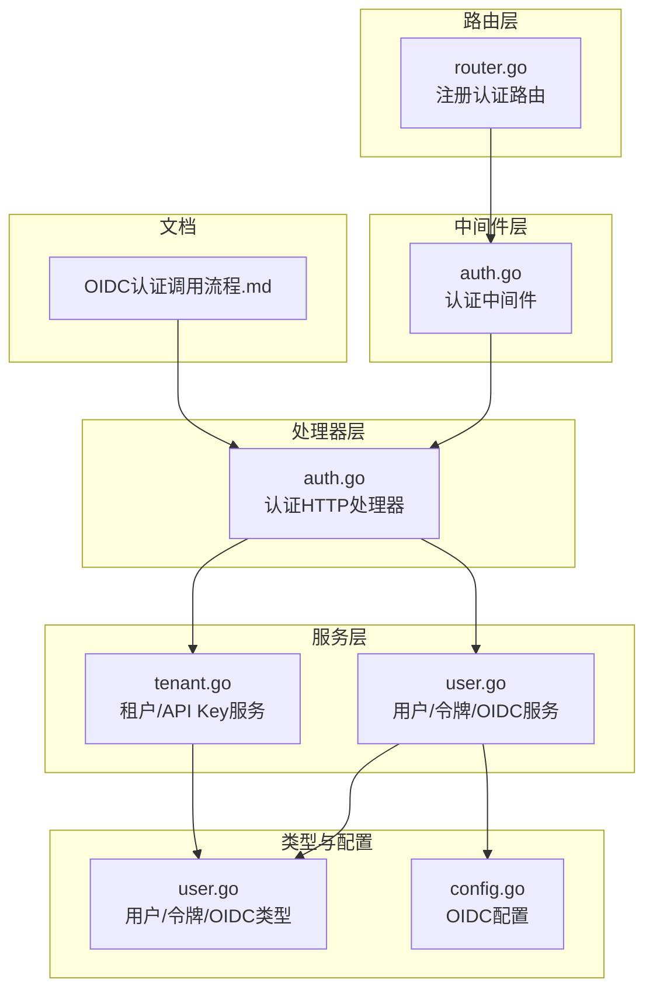
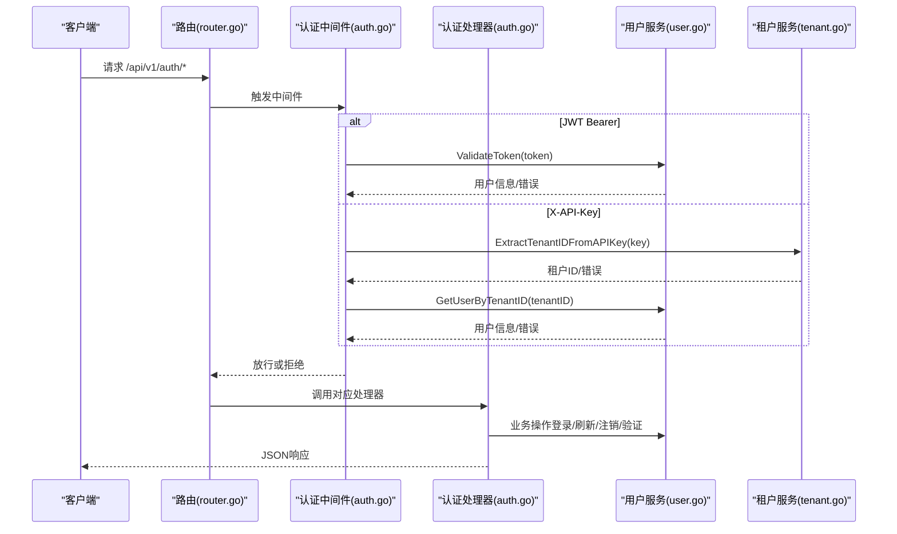
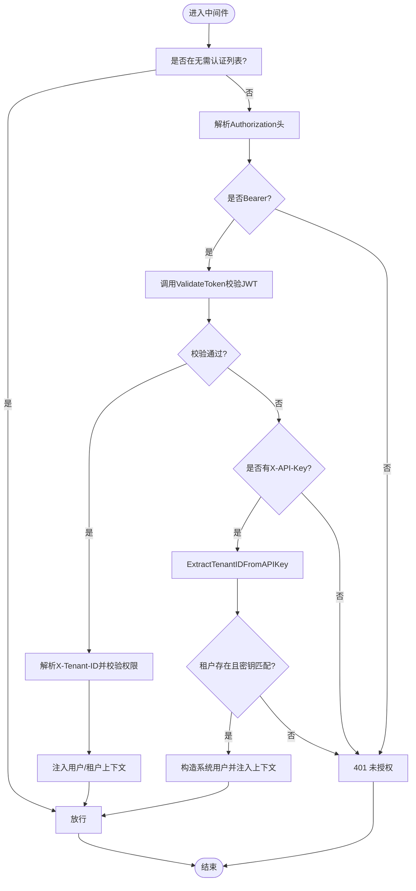
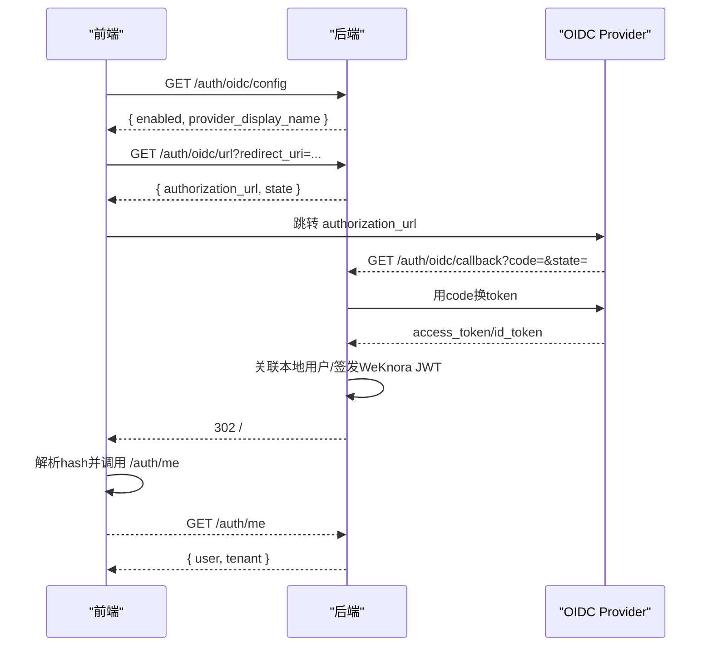
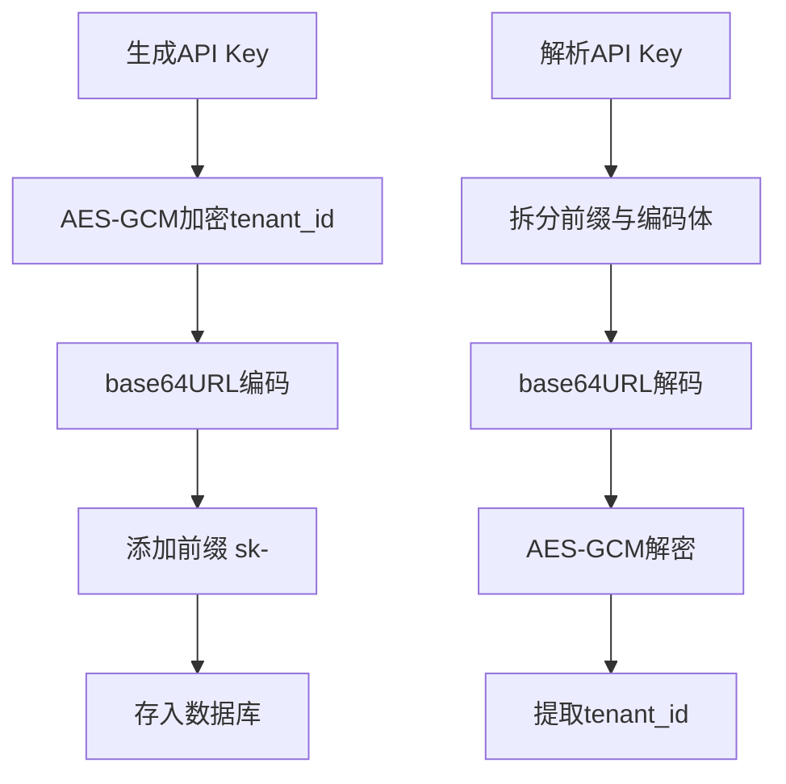
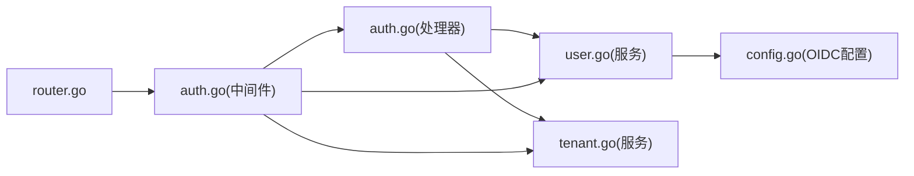

# 认证API

<cite>
**本文引用的文件**
- [internal/middleware/auth.go](file://internal/middleware/auth.go)
- [internal/handler/auth.go](file://internal/handler/auth.go)
- [internal/router/router.go](file://internal/router/router.go)
- [internal/types/user.go](file://internal/types/user.go)
- [internal/application/service/user.go](file://internal/application/service/user.go)
- [internal/application/service/tenant.go](file://internal/application/service/tenant.go)
- [internal/config/config.go](file://internal/config/config.go)
- [docs/OIDC认证调用流程.md](file://docs/OIDC认证调用流程.md)
- [internal/errors/errors.go](file://internal/errors/errors.go)
- [migrations/versioned/000018_extend_tenant_api_key.up.sql](file://migrations/versioned/000018_extend_tenant_api_key.up.sql)
</cite>

## 目录
1. [简介](#简介)
2. [项目结构](#项目结构)
3. [核心组件](#核心组件)
4. [架构总览](#架构总览)
5. [详细组件分析](#详细组件分析)
6. [依赖分析](#依赖分析)
7. [性能考虑](#性能考虑)
8. [故障排查指南](#故障排查指南)
9. [结论](#结论)
10. [附录](#附录)

## 简介
本文件为 WeKnora 认证API的权威技术文档，覆盖JWT令牌获取、刷新与验证的完整流程，包含登录、注销、用户信息查询、OIDC集成与API密钥管理接口。文档同时解释认证中间件的工作原理、权限验证机制、错误码体系与处理建议，并提供关键接口的请求/响应示例与curl命令。

## 项目结构
WeKnora 的认证相关代码主要分布在以下模块：
- 路由层：注册认证相关路由，统一挂载认证中间件
- 中间件层：实现JWT与API Key双通道认证、跨租户访问控制
- 处理器层：提供登录、刷新、注销、验证、用户信息等HTTP接口
- 服务层：实现业务逻辑（含OIDC登录、JWT签发、API Key生成）
- 类型与配置：定义用户、令牌、OIDC配置等数据结构
- 文档：OIDC调用流程与前后端协作说明



图表来源
- [internal/router/router.go:407-420](file://internal/router/router.go#L407-L420)
- [internal/middleware/auth.go:65-228](file://internal/middleware/auth.go#L65-L228)
- [internal/handler/auth.go:22-633](file://internal/handler/auth.go#L22-L633)
- [internal/application/service/user.go:58-200](file://internal/application/service/user.go#L58-L200)
- [internal/application/service/tenant.go:203-332](file://internal/application/service/tenant.go#L203-L332)
- [internal/types/user.go:9-149](file://internal/types/user.go#L9-L149)
- [internal/config/config.go:180-192](file://internal/config/config.go#L180-L192)
- [docs/OIDC认证调用流程.md:45-62](file://docs/OIDC认证调用流程.md#L45-L62)

章节来源
- [internal/router/router.go:407-420](file://internal/router/router.go#L407-L420)
- [internal/middleware/auth.go:65-228](file://internal/middleware/auth.go#L65-L228)
- [internal/handler/auth.go:22-633](file://internal/handler/auth.go#L22-L633)

## 核心组件
- 认证中间件：统一拦截请求，优先尝试JWT Bearer认证，其次尝试X-API-Key认证，支持跨租户访问控制与上下文注入
- 认证处理器：提供登录、刷新、注销、验证、获取当前用户等REST接口
- 用户服务：实现JWT签发、令牌校验、OIDC登录、密码校验等
- 租户服务：实现API Key生成与解析、租户信息查询
- OIDC配置：支持Discovery或显式端点配置，提供前端展示开关与回调处理
- 错误体系：标准化错误码与HTTP状态码映射

章节来源
- [internal/middleware/auth.go:65-228](file://internal/middleware/auth.go#L65-L228)
- [internal/handler/auth.go:110-633](file://internal/handler/auth.go#L110-L633)
- [internal/application/service/user.go:58-200](file://internal/application/service/user.go#L58-L200)
- [internal/application/service/tenant.go:203-332](file://internal/application/service/tenant.go#L203-L332)
- [internal/config/config.go:180-192](file://internal/config/config.go#L180-L192)
- [internal/errors/errors.go:12-40](file://internal/errors/errors.go#L12-L40)

## 架构总览
认证API遵循“路由-中间件-处理器-服务-仓储”的分层架构。认证中间件在路由组之上统一生效，对需鉴权的API进行拦截与校验；处理器负责参数绑定、调用服务并返回结果；服务层封装业务规则（JWT签发、OIDC交换、API Key加解密）；类型与配置定义数据结构与OIDC参数。



图表来源
- [internal/router/router.go:117-158](file://internal/router/router.go#L117-L158)
- [internal/middleware/auth.go:65-228](file://internal/middleware/auth.go#L65-L228)
- [internal/handler/auth.go:110-633](file://internal/handler/auth.go#L110-L633)
- [internal/application/service/user.go:58-200](file://internal/application/service/user.go#L58-L200)
- [internal/application/service/tenant.go:273-313](file://internal/application/service/tenant.go#L273-L313)

## 详细组件分析

### 认证中间件（JWT与API Key）
- 无需认证的API白名单：健康检查、注册、登录、自动初始化、OIDC配置/URL/回调、刷新等
- JWT Bearer认证：从Authorization头解析Bearer token，调用服务校验，成功后注入用户、租户上下文
- API Key认证：从X-API-Key解析租户ID，校验密钥有效性，构造系统用户上下文
- 跨租户访问：支持通过X-Tenant-ID切换目标租户，结合配置与权限校验
- 未认证：返回401 Unauthorized



图表来源
- [internal/middleware/auth.go:20-45](file://internal/middleware/auth.go#L20-L45)
- [internal/middleware/auth.go:65-228](file://internal/middleware/auth.go#L65-L228)
- [internal/application/service/tenant.go:273-313](file://internal/application/service/tenant.go#L273-L313)

章节来源
- [internal/middleware/auth.go:20-45](file://internal/middleware/auth.go#L20-L45)
- [internal/middleware/auth.go:65-228](file://internal/middleware/auth.go#L65-L228)

### 登录接口（账号密码）
- 方法与路径：POST /api/v1/auth/login
- 请求体：邮箱、密码
- 成功响应：包含用户、租户、token、refresh_token
- 失败响应：401 未授权（参数错误、凭据无效、账户禁用）

章节来源
- [internal/handler/auth.go:110-162](file://internal/handler/auth.go#L110-L162)
- [internal/application/service/user.go:144-200](file://internal/application/service/user.go#L144-L200)

### 刷新接口（刷新令牌）
- 方法与路径：POST /api/v1/auth/refresh
- 请求体：refreshToken
- 成功响应：access_token、refresh_token
- 失败响应：401 未授权（令牌无效）

章节来源
- [internal/handler/auth.go:370-412](file://internal/handler/auth.go#L370-L412)
- [internal/application/service/user.go:58-200](file://internal/application/service/user.go#L58-L200)

### 注销接口（撤销令牌）
- 方法与路径：POST /api/v1/auth/logout
- 请求头：Authorization: Bearer <token>
- 成功响应：成功/消息
- 失败响应：400/500（缺少头、格式错误、撤销失败）

章节来源
- [internal/handler/auth.go:319-368](file://internal/handler/auth.go#L319-L368)
- [internal/application/service/user.go:58-200](file://internal/application/service/user.go#L58-L200)

### 验证接口（令牌有效性）
- 方法与路径：GET /api/v1/auth/validate
- 请求头：Authorization: Bearer <token>
- 成功响应：success、message、user
- 失败响应：401 未授权（令牌无效）

章节来源
- [internal/handler/auth.go:582-632](file://internal/handler/auth.go#L582-L632)
- [internal/application/service/user.go:58-200](file://internal/application/service/user.go#L58-L200)

### 获取当前用户信息
- 方法与路径：GET /api/v1/auth/me
- 请求头：Authorization: Bearer <token>
- 成功响应：user、tenant（可选）
- 失败响应：401 未授权

章节来源
- [internal/handler/auth.go:414-454](file://internal/handler/auth.go#L414-L454)
- [internal/application/service/user.go:58-200](file://internal/application/service/user.go#L58-L200)

### OIDC集成
- OIDC配置接口：GET /api/v1/auth/oidc/config（返回enabled/provider_display_name）
- 生成授权URL：GET /api/v1/auth/oidc/url?redirect_uri=...（返回authorization_url与state）
- 回调处理：GET /api/v1/auth/oidc/callback（后端完成code换token、关联本地用户、签发WeKnora JWT，302回前端hash）
- 前端流程：前端解析hash中的oidc_result或oidc_error，再调用/me补全用户信息



图表来源
- [docs/OIDC认证调用流程.md:67-127](file://docs/OIDC认证调用流程.md#L67-L127)
- [internal/handler/auth.go:164-276](file://internal/handler/auth.go#L164-L276)
- [internal/application/service/user.go:58-200](file://internal/application/service/user.go#L58-L200)

章节来源
- [docs/OIDC认证调用流程.md:45-62](file://docs/OIDC认证调用流程.md#L45-L62)
- [internal/handler/auth.go:164-276](file://internal/handler/auth.go#L164-L276)
- [internal/config/config.go:180-192](file://internal/config/config.go#L180-L192)

### API密钥管理
- API Key生成：租户服务生成加密API Key（sk-前缀，AES-GCM加密tenant_id，base64URL编码）
- API Key解析：从API Key中解密出tenant_id，校验租户存在与密钥匹配
- API Key长度扩展：迁移脚本将tenant.api_key列从varchar(64)扩展至varchar(256)



图表来源
- [internal/application/service/tenant.go:203-313](file://internal/application/service/tenant.go#L203-L313)
- [migrations/versioned/000018_extend_tenant_api_key.up.sql:1-2](file://migrations/versioned/000018_extend_tenant_api_key.up.sql#L1-L2)

章节来源
- [internal/application/service/tenant.go:203-313](file://internal/application/service/tenant.go#L203-L313)
- [migrations/versioned/000018_extend_tenant_api_key.up.sql:1-2](file://migrations/versioned/000018_extend_tenant_api_key.up.sql#L1-L2)

## 依赖分析
- 路由注册：认证路由在v1组下统一注册，认证中间件在v1组前挂载
- 中间件依赖：依赖租户服务（API Key解析、租户查询）、用户服务（JWT校验、用户查询）、配置（跨租户开关）
- 处理器依赖：依赖用户服务（登录/刷新/注销/验证）、租户服务（用户信息补全）、配置（OIDC开关）
- 服务依赖：用户服务依赖仓储（用户/令牌）、租户服务、配置；租户服务依赖仓储与对称密钥



图表来源
- [internal/router/router.go:117-158](file://internal/router/router.go#L117-L158)
- [internal/middleware/auth.go:65-228](file://internal/middleware/auth.go#L65-L228)
- [internal/handler/auth.go:22-633](file://internal/handler/auth.go#L22-L633)
- [internal/application/service/user.go:58-200](file://internal/application/service/user.go#L58-L200)
- [internal/application/service/tenant.go:203-332](file://internal/application/service/tenant.go#L203-L332)
- [internal/config/config.go:180-192](file://internal/config/config.go#L180-L192)

章节来源
- [internal/router/router.go:117-158](file://internal/router/router.go#L117-L158)
- [internal/middleware/auth.go:65-228](file://internal/middleware/auth.go#L65-L228)
- [internal/handler/auth.go:22-633](file://internal/handler/auth.go#L22-L633)

## 性能考虑
- JWT校验：使用内存缓存与短生命周期（默认24小时）减少频繁签发/校验成本
- API Key校验：采用常量时间比较避免时序攻击，解密与校验在中间件层完成
- 跨租户切换：仅在需要时解析目标租户ID并校验，避免不必要的数据库查询
- OIDC回调：后端集中完成code换token与用户关联，前端仅接收hash结果，降低重试与重复传输风险

## 故障排查指南
- 401 未授权
  - 缺少Authorization头或格式错误
  - Bearer token无效或过期
  - API Key格式错误、解密失败或租户不存在
- 400 请求参数错误
  - 登录/刷新/注销缺少必要字段
  - OIDC回调缺少code或state非法
- 403 禁止访问
  - OIDC未启用或配置不完整
  - 账户被禁用
- 404 未找到
  - 用户不存在或租户不存在
- 500 服务器内部错误
  - 密钥生成失败、数据库异常、OIDC交换失败

章节来源
- [internal/handler/auth.go:110-162](file://internal/handler/auth.go#L110-L162)
- [internal/handler/auth.go:319-368](file://internal/handler/auth.go#L319-L368)
- [internal/handler/auth.go:582-632](file://internal/handler/auth.go#L582-L632)
- [internal/application/service/tenant.go:273-313](file://internal/application/service/tenant.go#L273-L313)
- [internal/errors/errors.go:12-40](file://internal/errors/errors.go#L12-L40)

## 结论
WeKnora 的认证体系以中间件为核心，提供JWT与API Key双通道认证，结合OIDC后端交换与本地JWT签发，既满足传统账号密码登录，又支持企业级OIDC集成与自动化API密钥管理。通过清晰的路由分层与标准化错误码，系统具备良好的可维护性与扩展性。

## 附录

### 接口一览与示例

- 登录
  - 方法：POST
  - 路径：/api/v1/auth/login
  - 请求体：{"email":"<邮箱>","password":"<密码>"}
  - 成功响应：包含token与refresh_token
  - curl示例：
    ```bash
    curl -X POST http://localhost:8080/api/v1/auth/login \
      -H "Content-Type: application/json" \
      -d '{"email":"user@example.com","password":"Passw0rd!"}'
    ```

- 刷新
  - 方法：POST
  - 路径：/api/v1/auth/refresh
  - 请求体：{"refreshToken":"<刷新令牌>"}
  - 成功响应：返回新的access_token与refresh_token
  - curl示例：
    ```bash
    curl -X POST http://localhost:8080/api/v1/auth/refresh \
      -H "Content-Type: application/json" \
      -d '{"refreshToken":"<REFRESH_TOKEN>"}'
    ```

- 注销
  - 方法：POST
  - 路径：/api/v1/auth/logout
  - 请求头：Authorization: Bearer <token>
  - curl示例：
    ```bash
    curl -X POST http://localhost:8080/api/v1/auth/logout \
      -H "Authorization: Bearer <TOKEN>"
    ```

- 验证
  - 方法：GET
  - 路径：/api/v1/auth/validate
  - 请求头：Authorization: Bearer <token>
  - curl示例：
    ```bash
    curl -X GET http://localhost:8080/api/v1/auth/validate \
      -H "Authorization: Bearer <TOKEN>"
    ```

- 获取当前用户
  - 方法：GET
  - 路径：/api/v1/auth/me
  - 请求头：Authorization: Bearer <token>
  - curl示例：
    ```bash
    curl -X GET http://localhost:8080/api/v1/auth/me \
      -H "Authorization: Bearer <TOKEN>"
    ```

- OIDC配置
  - 方法：GET
  - 路径：/api/v1/auth/oidc/config
  - curl示例：
    ```bash
    curl -X GET http://localhost:8080/api/v1/auth/oidc/config
    ```

- OIDC授权URL
  - 方法：GET
  - 路径：/api/v1/auth/oidc/url?redirect_uri=...
  - curl示例：
    ```bash
    curl -X GET "http://localhost:8080/api/v1/auth/oidc/url?redirect_uri=http%3A%2F%2Flocalhost%3A5173%2Fapi%2Fv1%2Fauth%2Foidc%2Fcallback"
    ```

- OIDC回调
  - 方法：GET
  - 路径：/api/v1/auth/oidc/callback?code=...&state=...
  - curl示例：
    ```bash
    curl -X GET "http://localhost:8080/api/v1/auth/oidc/callback?code=<AUTH_CODE>&state=<STATE>"
    ```

- API密钥生成
  - 方法：服务层调用（内部）
  - 生成格式：sk-<base64URL编码的加密tenant_id>

章节来源
- [internal/handler/auth.go:110-162](file://internal/handler/auth.go#L110-L162)
- [internal/handler/auth.go:370-412](file://internal/handler/auth.go#L370-L412)
- [internal/handler/auth.go:319-368](file://internal/handler/auth.go#L319-L368)
- [internal/handler/auth.go:582-632](file://internal/handler/auth.go#L582-L632)
- [internal/handler/auth.go:414-454](file://internal/handler/auth.go#L414-L454)
- [internal/handler/auth.go:164-276](file://internal/handler/auth.go#L164-L276)
- [internal/application/service/tenant.go:203-313](file://internal/application/service/tenant.go#L203-L313)