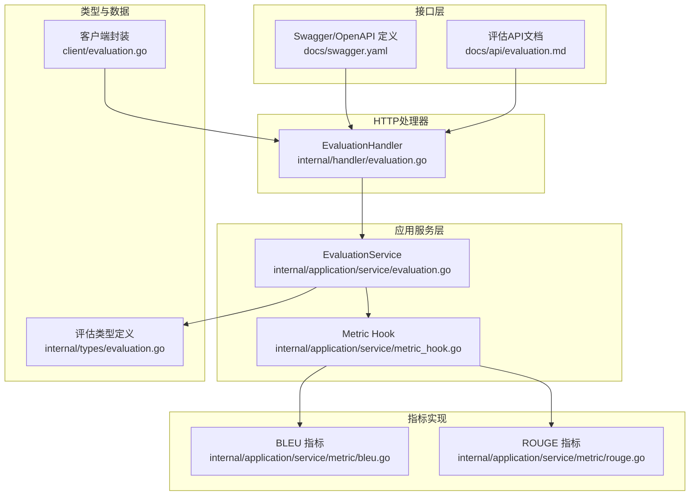
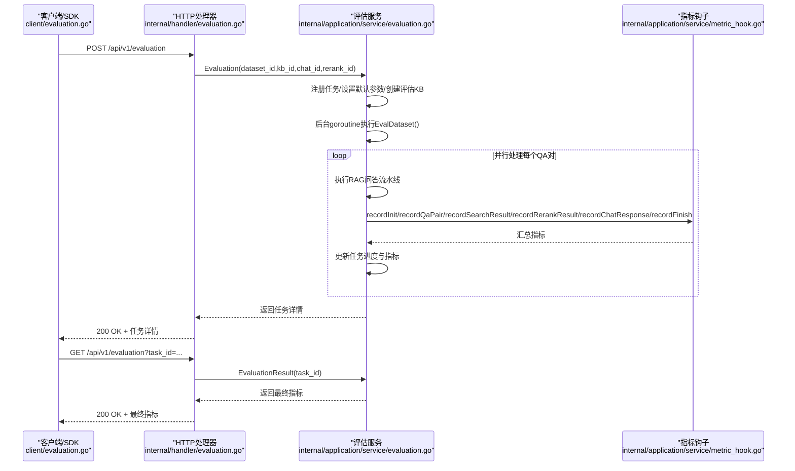
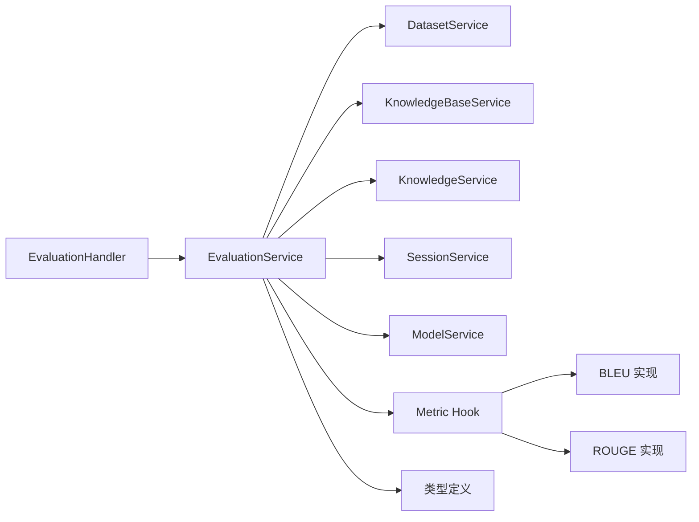
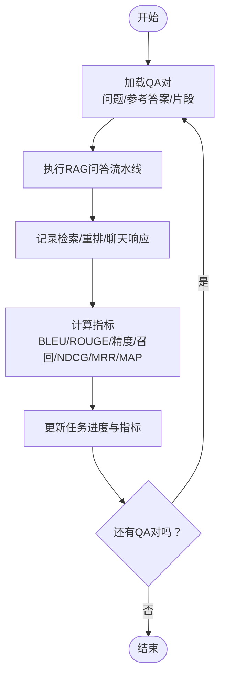

# 评估与指标API

<cite>
**本文引用的文件**
- [evaluation.md](file://docs/api/evaluation.md)
- [evaluation.go（处理器）](file://internal/handler/evaluation.go)
- [evaluation.go（服务）](file://internal/application/service/evaluation.go)
- [evaluation.go（类型定义）](file://internal/types/evaluation.go)
- [evaluation.go（指标钩子）](file://internal/application/service/metric_hook.go)
- [bleu.go（指标实现）](file://internal/application/service/metric/bleu.go)
- [rouge.go（指标实现）](file://internal/application/service/metric/rouge.go)
- [evaluation.go（客户端）](file://client/evaluation.go)
- [swagger.yaml（接口定义）](file://docs/swagger.yaml)
</cite>

## 目录
1. [简介](#简介)
2. [项目结构](#项目结构)
3. [核心组件](#核心组件)
4. [架构总览](#架构总览)
5. [详细组件分析](#详细组件分析)
6. [依赖分析](#依赖分析)
7. [性能考虑](#性能考虑)
8. [故障排查指南](#故障排查指南)
9. [结论](#结论)
10. [附录](#附录)

## 简介
本文件面向WeKnora的“评估与指标API”，系统性梳理问答质量评估、模型性能测试与指标计算的接口规范，覆盖检索与生成两类指标：BLEU、ROUGE、精度、召回率、NDCG、MRR、MAP等。文档同时说明评估数据集管理、基准测试与A/B测试的API规范，并提供评估报告生成、可视化展示与趋势分析的接口说明，以及自动化评估流水线与持续集成的接口示例。

## 项目结构
WeKnora的评估与指标能力由后端服务层、HTTP处理器层、类型定义与指标实现共同组成，接口通过Swagger/OpenAPI进行统一描述，前端与SDK通过REST调用完成任务创建与结果查询。

图表来源
- [evaluation.go（处理器）:14-131](file://internal/handler/evaluation.go#L14-L131)
- [evaluation.go（服务）:27-57](file://internal/application/service/evaluation.go#L27-L57)
- [evaluation.go（指标钩子）:30-69](file://internal/application/service/metric_hook.go#L30-L69)
- [bleu.go（指标实现）:27-83](file://internal/application/service/metric/bleu.go#L27-L83)
- [rouge.go（指标实现）:27-72](file://internal/application/service/metric/rouge.go#L27-L72)
- [evaluation.go（类型定义）:23-100](file://internal/types/evaluation.go#L23-L100)
- [evaluation.go（客户端）:76-113](file://client/evaluation.go#L76-L113)
- [swagger.yaml（接口定义）:1-200](file://docs/swagger.yaml#L1-L200)

章节来源
- [evaluation.go（处理器）:14-131](file://internal/handler/evaluation.go#L14-L131)
- [evaluation.go（服务）:27-57](file://internal/application/service/evaluation.go#L27-L57)
- [evaluation.go（指标钩子）:30-69](file://internal/application/service/metric_hook.go#L30-L69)
- [bleu.go（指标实现）:27-83](file://internal/application/service/metric/bleu.go#L27-L83)
- [rouge.go（指标实现）:27-72](file://internal/application/service/metric/rouge.go#L27-L72)
- [evaluation.go（类型定义）:23-100](file://internal/types/evaluation.go#L23-L100)
- [evaluation.go（客户端）:76-113](file://client/evaluation.go#L76-L113)
- [swagger.yaml（接口定义）:1-200](file://docs/swagger.yaml#L1-L200)

## 核心组件
- 评估任务生命周期：创建任务（异步后台执行）、轮询进度与结果、清理临时资源。
- 指标体系：检索指标（精度、召回、NDCG@3/10、MRR、MAP），生成指标（BLEU-1/2/4、ROUGE-1/2/L）。
- 数据集与知识库：支持指定数据集ID与知识库ID；若未提供则自动创建评估专用KB。
- 并行评估：基于errgroup并发处理每个QA对，实时更新进度与指标。

章节来源
- [evaluation.go（服务）:128-329](file://internal/application/service/evaluation.go#L128-L329)
- [evaluation.go（服务）:331-456](file://internal/application/service/evaluation.go#L331-L456)
- [evaluation.go（类型定义）:59-85](file://internal/types/evaluation.go#L59-L85)
- [evaluation.go（指标钩子）:30-69](file://internal/application/service/metric_hook.go#L30-L69)

## 架构总览
评估API采用分层设计：HTTP入口负责鉴权与参数校验，服务层负责任务编排与指标计算，指标实现模块提供具体算法，类型定义贯穿各层的数据契约。

图表来源
- [evaluation.go（客户端）:76-113](file://client/evaluation.go#L76-L113)
- [evaluation.go（处理器）:44-88](file://internal/handler/evaluation.go#L44-L88)
- [evaluation.go（处理器）:107-131](file://internal/handler/evaluation.go#L107-L131)
- [evaluation.go（服务）:128-329](file://internal/application/service/evaluation.go#L128-L329)
- [evaluation.go（服务）:331-456](file://internal/application/service/evaluation.go#L331-L456)
- [evaluation.go（指标钩子）:52-62](file://internal/application/service/metric_hook.go#L52-L62)

## 详细组件分析

### 1) 评估任务创建与查询接口
- 接口路径与方法
  - POST /api/v1/evaluation
  - GET /api/v1/evaluation
- 请求参数
  - POST：dataset_id、knowledge_base_id、chat_id、rerank_id
  - GET：task_id
- 认证方式
  - 支持Bearer Token与X-API-Key
- 响应内容
  - 任务ID、租户ID、数据集ID、状态、开始时间、总数、已完成数
  - 参数快照（向量阈值、关键词阈值、Embedding TopK、重排模型、聊天模型等）
  - 指标结果（检索与生成指标）

章节来源
- [evaluation.md:1-155](file://docs/api/evaluation.md#L1-L155)
- [evaluation.go（处理器）:24-88](file://internal/handler/evaluation.go#L24-L88)
- [evaluation.go（处理器）:90-131](file://internal/handler/evaluation.go#L90-L131)
- [swagger.yaml（接口定义）:158-173](file://docs/swagger.yaml#L158-L173)

### 2) 评估服务编排（EvaluationService）
- 功能职责
  - 任务注册与状态管理（Pending/Running/Success/Failed）
  - 默认参数解析与知识库创建
  - 数据集加载与并行评估
  - 指标汇总与进度更新
- 关键流程
  - 生成任务ID → 注册任务 → 后台运行EvalDataset → 并行处理QA对 → 实时更新指标 → 清理临时资源

章节来源
- [evaluation.go（服务）:128-329](file://internal/application/service/evaluation.go#L128-L329)
- [evaluation.go（服务）:331-456](file://internal/application/service/evaluation.go#L331-L456)

### 3) 指标钩子与计算（Metric Hook）
- 指标清单
  - 检索：精度、召回、NDCG@3、NDCG@10、MRR、MAP
  - 生成：BLEU-1、BLEU-2、BLEU-4、ROUGE-1、ROUGE-2、ROUGE-L
- 计算时机
  - 在每个QA对处理完成后，记录检索结果、重排结果、聊天响应，并计算指标
- 结果聚合
  - 支持Avg()计算平均指标

章节来源
- [evaluation.go（指标钩子）:30-69](file://internal/application/service/metric_hook.go#L30-L69)
- [evaluation.go（类型定义）:59-85](file://internal/types/evaluation.go#L59-L85)

### 4) BLEU与ROUGE指标实现
- BLEU
  - 支持平滑与多gram权重（1/2/4）
  - 计算修改后的精确率与简短惩罚
- ROUGE
  - 支持rouge-1/2/l，统计F值、精确率、召回率

章节来源
- [bleu.go（指标实现）:27-83](file://internal/application/service/metric/bleu.go#L27-L83)
- [bleu.go（指标实现）:111-165](file://internal/application/service/metric/bleu.go#L111-L165)
- [rouge.go（指标实现）:27-72](file://internal/application/service/metric/rouge.go#L27-L72)

### 5) 类型与数据契约
- 评估任务与详情
  - EvaluationTask：任务ID、租户ID、数据集ID、状态、开始时间、总数、已完成数
  - EvaluationDetail：包含任务、参数快照与指标
- 指标输入与输出
  - MetricInput：检索Ground Truth与检索ID、生成文本与参考文本
  - MetricResult：包含检索与生成指标对象

章节来源
- [evaluation.go（类型定义）:23-42](file://internal/types/evaluation.go#L23-L42)
- [evaluation.go（类型定义）:50-85](file://internal/types/evaluation.go#L50-L85)

### 6) 客户端封装
- 提供创建评估任务与查询结果的SDK方法
- 自动序列化/反序列化与错误处理

章节来源
- [evaluation.go（客户端）:76-113](file://client/evaluation.go#L76-L113)

## 依赖分析
- 处理器依赖服务接口（EvaluationService），服务内部依赖数据集、知识库、会话与模型服务
- 指标钩子依赖具体指标实现（BLEU、ROUGE）
- 类型定义贯穿所有层，确保数据一致性

图表来源
- [evaluation.go（处理器）:14-22](file://internal/handler/evaluation.go#L14-L22)
- [evaluation.go（服务）:27-57](file://internal/application/service/evaluation.go#L27-L57)
- [evaluation.go（指标钩子）:30-69](file://internal/application/service/metric_hook.go#L30-L69)
- [bleu.go（指标实现）:27-83](file://internal/application/service/metric/bleu.go#L27-L83)
- [rouge.go（指标实现）:27-72](file://internal/application/service/metric/rouge.go#L27-L72)
- [evaluation.go（类型定义）:23-42](file://internal/types/evaluation.go#L23-L42)

章节来源
- [evaluation.go（处理器）:14-22](file://internal/handler/evaluation.go#L14-L22)
- [evaluation.go（服务）:27-57](file://internal/application/service/evaluation.go#L27-L57)
- [evaluation.go（指标钩子）:30-69](file://internal/application/service/metric_hook.go#L30-L69)
- [bleu.go（指标实现）:27-83](file://internal/application/service/metric/bleu.go#L27-L83)
- [rouge.go（指标实现）:27-72](file://internal/application/service/metric/rouge.go#L27-L72)
- [evaluation.go（类型定义）:23-42](file://internal/types/evaluation.go#L23-L42)

## 性能考虑
- 并行度：根据CPU核数限制并发worker数量，避免过度竞争
- 资源清理：评估完成后删除临时知识与知识库，降低内存与存储压力
- 指标计算：在每个QA对完成后增量更新，减少最终一次性聚合的开销
- I/O优化：向量化检索与重排尽量复用默认配置，减少不必要的模型调用

## 故障排查指南
- 常见错误
  - 任务不存在：GET /evaluation返回任务未找到
  - 租户不匹配：跨租户访问被拒绝
  - 参数错误：POST请求参数缺失或格式不正确
  - 服务内部错误：后台评估异常导致失败状态
- 排查步骤
  - 确认task_id是否正确
  - 检查租户上下文与API Key
  - 查看任务状态与错误信息字段
  - 重新发起评估任务并观察日志

章节来源
- [evaluation.go（服务）:102-126](file://internal/application/service/evaluation.go#L102-L126)
- [evaluation.go（处理器）:50-81](file://internal/handler/evaluation.go#L50-L81)
- [evaluation.go（处理器）:112-124](file://internal/handler/evaluation.go#L112-L124)

## 结论
WeKnora的评估与指标API提供了完整的问答质量评估能力，涵盖检索与生成指标，支持并行评估与实时进度更新。通过清晰的接口规范与类型契约，可方便地接入自动化评估流水线与持续集成场景，支撑基准测试与A/B测试的落地实践。

## 附录

### A. 评估API规范摘要
- POST /api/v1/evaluation
  - 请求体字段：dataset_id、knowledge_base_id、chat_id、rerank_id
  - 成功响应：包含任务ID、参数快照与初始指标
- GET /api/v1/evaluation?task_id=...
  - 查询参数：task_id
  - 成功响应：包含最终指标与任务状态

章节来源
- [evaluation.md:89-155](file://docs/api/evaluation.md#L89-L155)
- [swagger.yaml（接口定义）:158-173](file://docs/swagger.yaml#L158-L173)

### B. 指标计算流程（以单个QA对为例）

图表来源
- [evaluation.go（服务）:390-438](file://internal/application/service/evaluation.go#L390-L438)
- [evaluation.go（指标钩子）:52-62](file://internal/application/service/metric_hook.go#L52-L62)