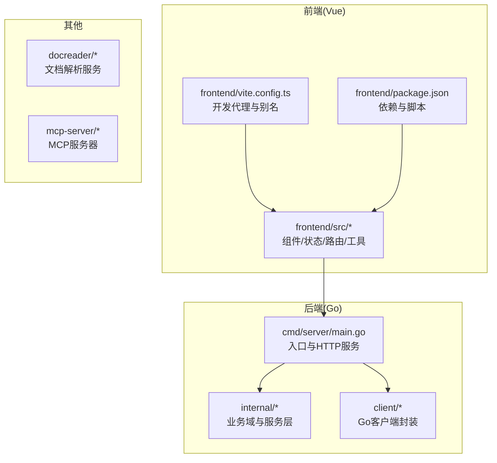
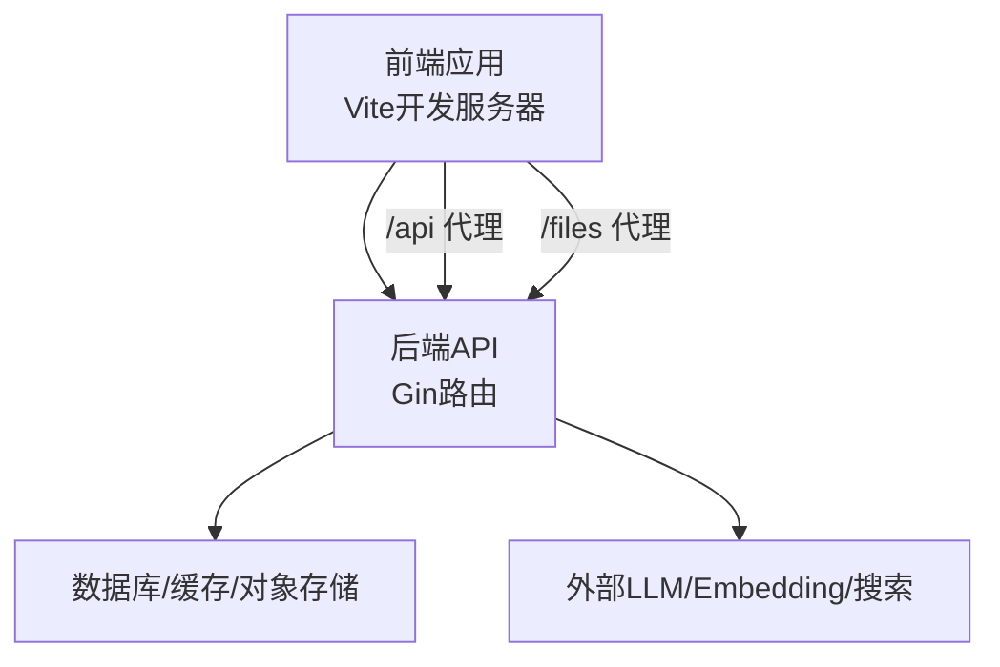
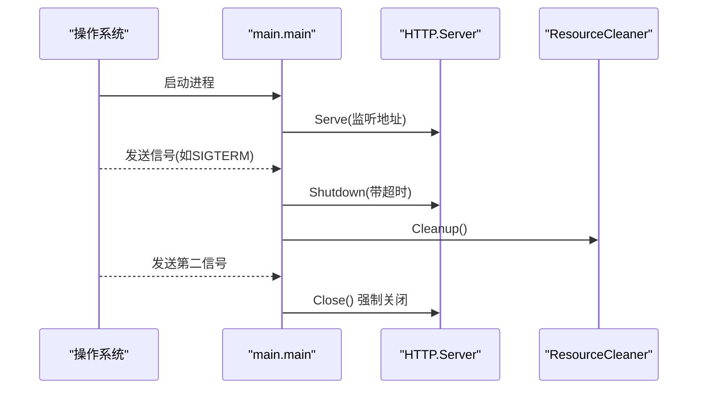
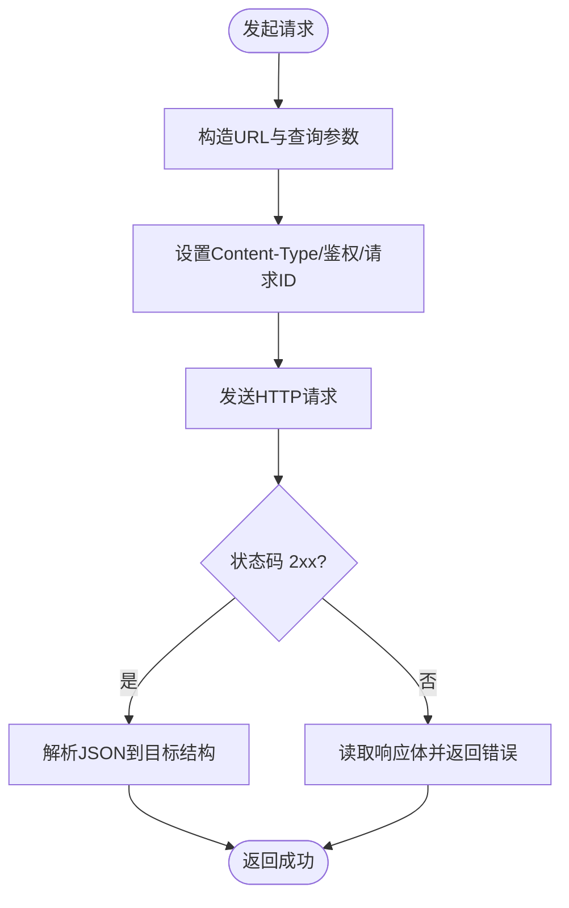
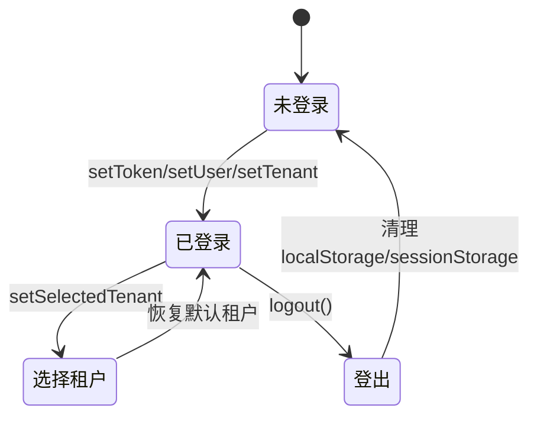
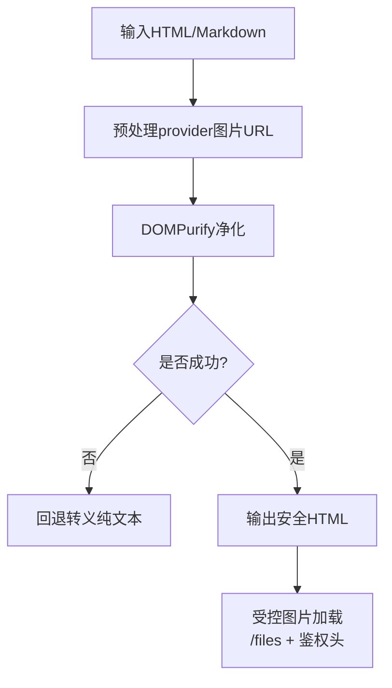
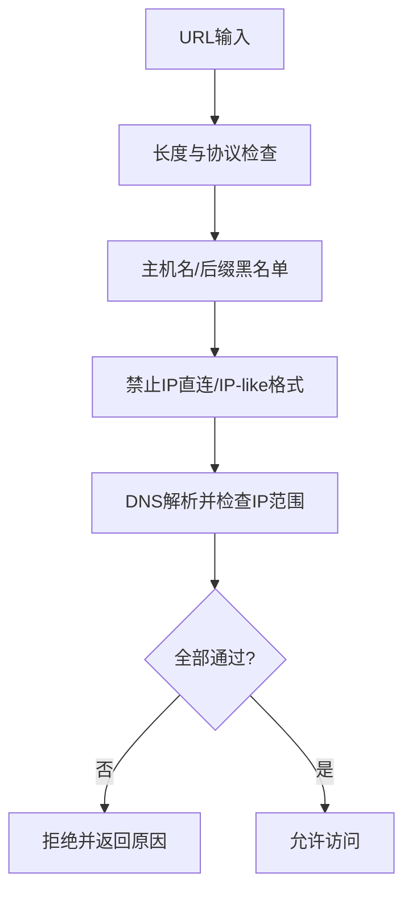
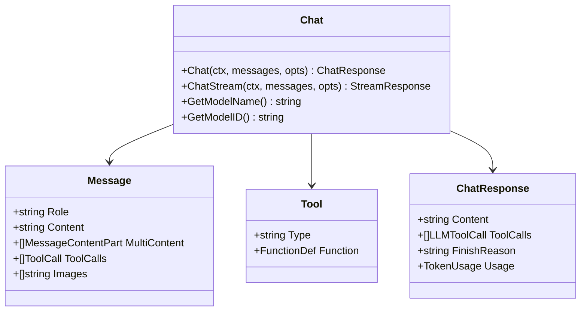
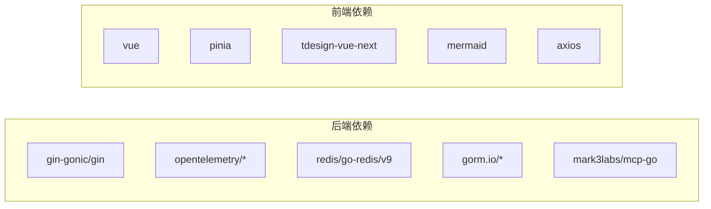

# 代码规范与最佳实践

<cite>
**本文引用的文件**
- [README.md](file://README.md)
- [go.mod](file://go.mod)
- [frontend/package.json](file://frontend/package.json)
- [frontend/vite.config.ts](file://frontend/vite.config.ts)
- [cmd/server/main.go](file://cmd/server/main.go)
- [client/client.go](file://client/client.go)
- [docs/开发指南.md](file://docs/开发指南.md)
- [.github/pull_request_template.md](file://.github/pull_request_template.md)
- [frontend/src/utils/security.ts](file://frontend/src/utils/security.ts)
- [internal/utils/security.go](file://internal/utils/security.go)
- [frontend/src/stores/auth.ts](file://frontend/src/stores/auth.ts)
- [frontend/src/components/AgentAvatar.vue](file://frontend/src/components/AgentAvatar.vue)
- [internal/models/chat/chat.go](file://internal/models/chat/chat.go)
- [internal/types/chat.go](file://internal/types/chat.go)
</cite>

## 目录
1. [引言](#引言)
2. [项目结构](#项目结构)
3. [核心组件](#核心组件)
4. [架构总览](#架构总览)
5. [详细组件分析](#详细组件分析)
6. [依赖关系分析](#依赖关系分析)
7. [性能考虑](#性能考虑)
8. [故障排查指南](#故障排查指南)
9. [结论](#结论)
10. [附录](#附录)

## 引言
本指南面向WeKnora项目的贡献者与维护者，旨在统一前后端代码风格、测试与质量标准、Git工作流与分支策略、以及安全与可维护性原则。文档基于仓库现有实现与约定提炼形成，覆盖Go后端、TypeScript/Vue.js前端、Git与CI/CD、测试与质量保障等维度。

## 项目结构
WeKnora采用多模块混合架构：Go后端提供API与业务逻辑，前端Vue应用提供Web UI，另有独立的文档解析服务与MCP服务器。开发与部署通过Docker Compose与Makefile协调。

图表来源
- [cmd/server/main.go:1-124](file://cmd/server/main.go#L1-L124)
- [frontend/vite.config.ts:1-56](file://frontend/vite.config.ts#L1-L56)
- [frontend/package.json:1-64](file://frontend/package.json#L1-L64)

章节来源
- [README.md:333-348](file://README.md#L333-L348)
- [docs/开发指南.md:1-286](file://docs/开发指南.md#L1-L286)

## 核心组件
- 后端入口与HTTP服务：负责监听端口、优雅关闭、信号处理与资源清理。
- Go客户端：统一的HTTP请求封装，支持超时、鉴权头、请求ID透传。
- 前端状态与安全：Pinia状态管理、XSS/SSRF防护与URL校验、受控图片加载。
- 类型与模型：统一的消息、工具、响应类型定义，便于跨层契约一致。

章节来源
- [cmd/server/main.go:43-123](file://cmd/server/main.go#L43-L123)
- [client/client.go:16-105](file://client/client.go#L16-L105)
- [frontend/src/stores/auth.ts:1-252](file://frontend/src/stores/auth.ts#L1-L252)
- [frontend/src/utils/security.ts:1-365](file://frontend/src/utils/security.ts#L1-L365)
- [internal/utils/security.go:1-800](file://internal/utils/security.go#L1-L800)
- [internal/models/chat/chat.go:1-177](file://internal/models/chat/chat.go#L1-L177)
- [internal/types/chat.go:1-96](file://internal/types/chat.go#L1-L96)

## 架构总览
后端通过Gin框架构建HTTP服务，依赖注入容器装配路由与中间件；前端通过Vite开发服务器与后端API代理联调；安全策略贯穿输入校验、URL白名单、SSRF防护与受控文件访问。

图表来源
- [frontend/vite.config.ts:42-53](file://frontend/vite.config.ts#L42-L53)
- [cmd/server/main.go:62-68](file://cmd/server/main.go#L62-L68)

## 详细组件分析

### 后端入口与优雅关闭
- 设置Gin运行模式，构建依赖注入容器，启动HTTP服务。
- 监听系统信号，支持二次信号强制退出；优雅关闭期间执行资源清理。
- 监听端口支持重试与超时配置，确保服务可用性。

图表来源
- [cmd/server/main.go:62-119](file://cmd/server/main.go#L62-L119)

章节来源
- [cmd/server/main.go:43-123](file://cmd/server/main.go#L43-L123)

### Go客户端封装
- 统一的doRequest封装，支持JSON序列化、查询参数拼接、鉴权头与请求ID透传。
- parseResponse统一处理HTTP状态码与响应体解析，便于上层调用。

图表来源
- [client/client.go:57-104](file://client/client.go#L57-L104)

章节来源
- [client/client.go:16-105](file://client/client.go#L16-L105)

### 前端状态与鉴权
- Pinia状态管理：用户、租户、令牌、知识库、当前KB、多租户选择、Lite模式等。
- 登出时清理localStorage/sessionStorage，确保敏感信息不残留。
- 本地持久化与初始化恢复，提升用户体验。

图表来源
- [frontend/src/stores/auth.ts:115-143](file://frontend/src/stores/auth.ts#L115-L143)

章节来源
- [frontend/src/stores/auth.ts:1-252](file://frontend/src/stores/auth.ts#L1-L252)

### 前端安全与受控文件
- DOMPurify配置：白名单标签/属性、URI正则、移除事件处理器、强制外链noopener noreferrer。
- URL校验：允许http/https与特定provider协议，限制长度与危险模式。
- 受控图片：/files代理+鉴权头拉取，避免在URL中暴露令牌；支持占位与缓存。

图表来源
- [frontend/src/utils/security.ts:103-116](file://frontend/src/utils/security.ts#L103-L116)
- [frontend/src/utils/security.ts:301-364](file://frontend/src/utils/security.ts#L301-L364)

章节来源
- [frontend/src/utils/security.ts:1-365](file://frontend/src/utils/security.ts#L1-L365)

### 后端安全与SSRF防护
- 输入校验：长度、UTF-8、控制字符、XSS模式匹配。
- URL校验：协议白名单、主机名/后缀黑名单、IP直连限制、DNS解析安全检查。
- HTTP客户端：重定向拦截、SSRF白名单感知、DialContext限制。

图表来源
- [internal/utils/security.go:381-480](file://internal/utils/security.go#L381-L480)

章节来源
- [internal/utils/security.go:1-800](file://internal/utils/security.go#L1-L800)

### 类型与模型契约
- 统一的消息、工具、响应类型，支持多模态内容与流式响应。
- Chat接口抽象，支持本地Ollama与远程API两种实现，便于扩展与测试。

图表来源
- [internal/models/chat/chat.go:15-94](file://internal/models/chat/chat.go#L15-L94)
- [internal/types/chat.go:28-75](file://internal/types/chat.go#L28-L75)

章节来源
- [internal/models/chat/chat.go:1-177](file://internal/models/chat/chat.go#L1-L177)
- [internal/types/chat.go:1-96](file://internal/types/chat.go#L1-L96)

### 组件设计示例：头像组件
- 基于名称稳定哈希选择渐变色，支持大小尺寸与装饰效果。
- 通过Less作用域样式实现响应式布局与主题变量。

章节来源
- [frontend/src/components/AgentAvatar.vue:1-161](file://frontend/src/components/AgentAvatar.vue#L1-L161)

## 依赖关系分析
- 后端依赖：Gin、OpenTelemetry、Redis、PostgreSQL、MCP、LLM提供商SDK等。
- 前端依赖：Vue3、Pinia、Vue Router、TD Design、Mermaid、Axios等。
- 开发工具：Vite、TypeScript、ESBuild、Less等。

图表来源
- [go.mod:5-81](file://go.mod#L5-L81)
- [frontend/package.json:14-39](file://frontend/package.json#L14-L39)

章节来源
- [go.mod:1-325](file://go.mod#L1-L325)
- [frontend/package.json:1-64](file://frontend/package.json#L1-L64)

## 性能考虑
- 后端：合理设置优雅关闭超时，避免长连接阻塞；对上游调用设置超时与重试；利用中间件与链路追踪定位瓶颈。
- 前端：Vite热重载与按需打包；图片懒加载与受控文件缓存；组件样式作用域减少全局冲突。
- 安全与性能平衡：SSRF防护与DNS解析成本的权衡；URL白名单与代理转发的开销。

## 故障排查指南
- 启动后端：确认依赖容器已启动，端口占用与权限；查看日志与链路追踪。
- 前端联调：检查Vite代理配置与CORS；确认/文件代理与鉴权头传递。
- 安全问题：XSS净化失败回退、URL校验失败、SSRF拦截原因；受控图片加载失败时检查鉴权头与缓存。

章节来源
- [docs/开发指南.md:261-286](file://docs/开发指南.md#L261-L286)
- [frontend/vite.config.ts:42-53](file://frontend/vite.config.ts#L42-L53)
- [frontend/src/utils/security.ts:103-116](file://frontend/src/utils/security.ts#L103-L116)
- [internal/utils/security.go:381-480](file://internal/utils/security.go#L381-L480)

## 结论
本指南总结了WeKnora在代码风格、组件设计、安全与性能方面的实践建议，并结合现有实现给出可操作的规范与流程。建议在后续迭代中持续完善测试覆盖、自动化质量门禁与文档同步更新。

## 附录

### Git工作流程与分支策略
- 分支命名：feature/xxx、fix/xxx、docs/xxx、chore/xxx。
- 提交信息：遵循约定式提交（feat、fix、docs、test、refactor等）。
- 合并与审查：通过Pull Request模板填写变更类型、影响范围、测试步骤与检查清单。

章节来源
- [README.md:354-357](file://README.md#L354-L357)
- [.github/pull_request_template.md:1-73](file://.github/pull_request_template.md#L1-L73)

### 单元测试与集成测试
- 后端：使用测试框架进行单元测试与集成测试，覆盖关键路径与边界条件。
- 前端：组件测试与状态管理测试，结合Mock与真实API进行端到端验证。
- 覆盖率：建议关键模块达到较高覆盖率，结合CI进行质量门禁。

章节来源
- [internal/utils/security.go:1-800](file://internal/utils/security.go#L1-L800)
- [frontend/src/stores/auth.ts:1-252](file://frontend/src/stores/auth.ts#L1-L252)

### 代码审查与质量检查
- 代码风格：后端遵循gofmt；前端遵循TypeScript与Less规范。
- 安全检查：输入校验、URL白名单、SSRF防护、XSS净化。
- 可维护性：模块化设计、清晰的错误处理、完善的日志与监控。

章节来源
- [README.md:354-357](file://README.md#L354-L357)
- [frontend/src/utils/security.ts:1-365](file://frontend/src/utils/security.ts#L1-L365)
- [internal/utils/security.go:1-800](file://internal/utils/security.go#L1-L800)