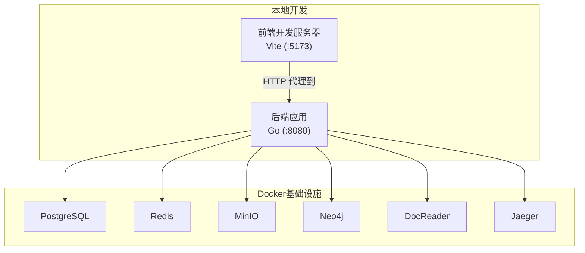
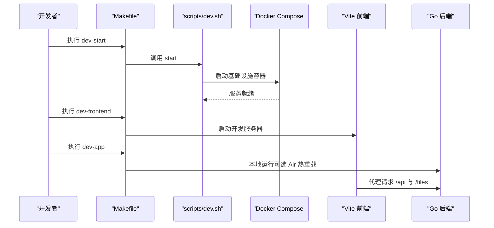
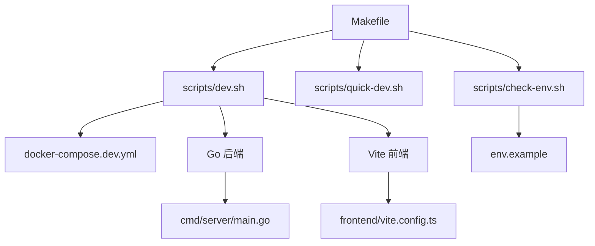

# 开发环境搭建

<cite>
**本文引用的文件**
- [Makefile](file://Makefile)
- [README.md](file://README.md)
- [scripts/dev.sh](file://scripts/dev.sh)
- [scripts/quick-dev.sh](file://scripts/quick-dev.sh)
- [docker-compose.dev.yml](file://docker-compose.dev.yml)
- [frontend/package.json](file://frontend/package.json)
- [frontend/vite.config.ts](file://frontend/vite.config.ts)
- [go.mod](file://go.mod)
- [scripts/check-env.sh](file://scripts/check-env.sh)
- [.env.example](file://.env.example)
- [docs/开发指南.md](file://docs/开发指南.md)
- [cmd/server/main.go](file://cmd/server/main.go)
</cite>

## 目录
1. [简介](#简介)
2. [项目结构](#项目结构)
3. [核心组件](#核心组件)
4. [架构总览](#架构总览)
5. [详细组件分析](#详细组件分析)
6. [依赖关系分析](#依赖关系分析)
7. [性能考量](#性能考量)
8. [故障排查指南](#故障排查指南)
9. [结论](#结论)
10. [附录](#附录)

## 简介
本文件面向WeKnora项目的开发者，提供一套完整的开发环境搭建与高效开发工作流指南。内容涵盖必备工具安装（Go、Node.js、Docker等）、Makefile提供的开发命令与脚本使用方法、快速开发模式的原理与优势、IDE调试配置（VS Code与GoLand）、Air热重载工具与前端Vite开发服务器的使用，以及常见环境问题的排查与解决方案。

## 项目结构
WeKnora采用多模块混合架构：Go后端（cmd/server）、前端（frontend）、基础设施（docker-compose.dev.yml）、脚本与工具（scripts/）、文档（docs/）等。开发时推荐使用“本地运行后端+本地运行前端+Docker托管基础设施”的快速开发模式，以获得最佳迭代效率。

图表来源
- [docker-compose.dev.yml](file://docker-compose.dev.yml)
- [frontend/vite.config.ts](file://frontend/vite.config.ts)

章节来源
- [README.md](file://README.md)
- [docs/开发指南.md](file://docs/开发指南.md)

## 核心组件
- Makefile：集中管理构建、运行、测试、Docker镜像构建与开发模式命令，提供统一入口。
- 开发脚本：scripts/dev.sh负责启动/停止/查看日志/状态，以及本地启动后端与前端。
- 快速启动脚本：scripts/quick-dev.sh一键启动基础设施，并可选择在当前终端启动后端或前端。
- 前端工程：基于Vite，提供热重载与代理到后端API的能力。
- 后端工程：Go应用，使用Gin框架，支持优雅关闭与信号处理。
- 环境检查脚本：scripts/check-env.sh校验必要工具与环境变量。
- 环境配置模板：.env.example提供数据库、存储、向量库、MinIO、Neo4j、DocReader、Jaeger等配置项。

章节来源
- [Makefile](file://Makefile)
- [scripts/dev.sh](file://scripts/dev.sh)
- [scripts/quick-dev.sh](file://scripts/quick-dev.sh)
- [frontend/package.json](file://frontend/package.json)
- [frontend/vite.config.ts](file://frontend/vite.config.ts)
- [go.mod](file://go.mod)
- [scripts/check-env.sh](file://scripts/check-env.sh)
- [.env.example](file://.env.example)
- [cmd/server/main.go](file://cmd/server/main.go)

## 架构总览
快速开发模式的核心思想是：后端与前端在本地直接运行，基础设施通过Docker Compose托管，从而实现“后端秒级重启、前端实时热重载”的高效开发体验。

图表来源
- [Makefile](file://Makefile)
- [scripts/dev.sh](file://scripts/dev.sh)
- [docker-compose.dev.yml](file://docker-compose.dev.yml)
- [frontend/vite.config.ts](file://frontend/vite.config.ts)

## 详细组件分析

### Makefile 开发命令与脚本使用
- 基础命令：build、run、test、clean等，用于Go应用的构建与测试。
- Docker命令：构建与运行应用、文档读取器、前端镜像，以及镜像清理与拉取。
- 服务管理：start-all、stop-all、start-ollama等，便于快速启动/停止服务。
- 数据库迁移：migrate-up、migrate-down、migrate-version、migrate-create、migrate-force、migrate-goto。
- 开发工具：fmt、lint、deps、docs、install-swagger。
- 环境检查：check-env、list-containers、pull-images、show-platform。
- 快速开发模式：dev-start、dev-stop、dev-restart、dev-logs、dev-status、dev-app、dev-frontend。
- Lite模式：build-lite、run-lite、package-lite、package-mac-app。

章节来源
- [Makefile](file://Makefile)

### scripts/dev.sh：开发环境脚本
- 功能：启动/停止/重启基础设施、查看日志与状态；本地启动后端（支持Air热重载）与前端（Vite）。
- 支持的Profile：minio、qdrant、neo4j、jaeger、dex、full，便于按需启用额外服务。
- 环境变量覆盖：将DB_HOST、DOCREADER_ADDR、MINIO_ENDPOINT、REDIS_ADDR、MILVUS_ADDRESS、OTEL_EXPORTER_OTLP_ENDPOINT、NEO4J_URI、QDRANT_HOST等指向localhost，确保本地运行的后端能正确连接Docker内的服务。
- Air检测：若检测到Air，自动使用热重载模式启动后端；否则提示安装Air以获得更快的后端重启体验。

章节来源
- [scripts/dev.sh](file://scripts/dev.sh)

### scripts/quick-dev.sh：一键启动脚本
- 自动启动基础设施，随后询问是否在当前终端启动后端或前端，并记录PID以便后续停止。
- 输出访问地址与常用管理命令，便于快速进入开发状态。

章节来源
- [scripts/quick-dev.sh](file://scripts/quick-dev.sh)

### docker-compose.dev.yml：开发环境Compose
- 启动服务：PostgreSQL、Redis、MinIO、Qdrant、Milvus、Neo4j、DocReader、Jaeger、Langfuse（可选）。
- 端口映射与健康检查，便于本地联调。
- Profile机制：通过--profile参数启用不同服务组合，如full、minio、qdrant、neo4j、jaeger、dex、langfuse等。

章节来源
- [docker-compose.dev.yml](file://docker-compose.dev.yml)

### 前端工程：Vite 开发服务器
- 包管理与脚本：frontend/package.json提供dev、build、preview、type-check等脚本。
- 开发服务器：frontend/vite.config.ts配置端口5173、host为true，并设置对/api与/files的代理，转发至本地后端8080端口。
- 依赖与技术栈：Vue 3、TypeScript、Less、Mermaid、Swiper等。

章节来源
- [frontend/package.json](file://frontend/package.json)
- [frontend/vite.config.ts](file://frontend/vite.config.ts)

### 后端工程：Go 应用
- 入口：cmd/server/main.go，使用Gin框架，支持Gin模式切换、优雅关闭、信号处理。
- 容器化：使用依赖注入容器初始化路由与中间件，支持Tracing与资源清理。
- 环境变量：scripts/dev.sh在本地启动后端时会设置DB_HOST、DOCREADER_ADDR等，确保连接Docker内服务。

章节来源
- [cmd/server/main.go](file://cmd/server/main.go)

### 环境检查与配置
- 环境检查脚本：scripts/check-env.sh检查.env是否存在、必要环境变量是否设置、Go/Air/npm/Docker/Docker Compose版本与状态。
- 环境配置模板：.env.example包含数据库、向量库、存储、MinIO、Neo4j、DocReader、Jaeger、Agent Sandbox、OIDC等大量配置项，需按需填写。

章节来源
- [scripts/check-env.sh](file://scripts/check-env.sh)
- [.env.example](file://.env.example)

### 快速开发模式工作原理与优势
- 传统方式：每次修改代码后需重新构建镜像并重启容器，耗时2-5分钟。
- 快速开发模式：首次启动基础设施（1-2分钟），后续后端修改5-10秒重启，前端实时热重载，显著提升迭代效率。
- Air热重载：检测到Air时自动使用热重载模式，进一步缩短后端重启时间。

章节来源
- [docs/开发指南.md](file://docs/开发指南.md)
- [scripts/dev.sh](file://scripts/dev.sh)

### IDE 配置指南（VS Code 与 GoLand）
- VS Code：配置Go调试任务，连接本地运行的后端，设置环境变量（DB_HOST、DOCREADER_ADDR、MINIO_ENDPOINT、REDIS_ADDR、OTEL_EXPORTER_OTLP_ENDPOINT、NEO4J_URI等）。
- GoLand：同样可在Run/Debug配置中设置环境变量与程序入口，便于断点调试。

章节来源
- [docs/开发指南.md](file://docs/开发指南.md)

### Air 热重载工具安装与配置
- 安装：go install github.com/air-verse/air@latest。
- 使用：在项目根目录执行air或通过scripts/dev.sh自动检测并使用Air启动后端。
- 可选配置：创建.air.toml以定制构建规则、排除目录与文件、颜色与日志输出等。

章节来源
- [docs/开发指南.md](file://docs/开发指南.md)
- [scripts/dev.sh](file://scripts/dev.sh)

### 前端 Vite 开发服务器使用
- 启动：在frontend目录执行npm run dev，或通过Makefile的dev-frontend命令。
- 代理：vite.config.ts将/api与/files代理到本地后端8080端口，便于前后端联调。
- 热重载：修改代码后浏览器自动刷新，无需重启。

章节来源
- [frontend/package.json](file://frontend/package.json)
- [frontend/vite.config.ts](file://frontend/vite.config.ts)
- [Makefile](file://Makefile)

## 依赖关系分析

图表来源
- [Makefile](file://Makefile)
- [scripts/dev.sh](file://scripts/dev.sh)
- [scripts/quick-dev.sh](file://scripts/quick-dev.sh)
- [docker-compose.dev.yml](file://docker-compose.dev.yml)
- [frontend/vite.config.ts](file://frontend/vite.config.ts)
- [cmd/server/main.go](file://cmd/server/main.go)
- [scripts/check-env.sh](file://scripts/check-env.sh)
- [.env.example](file://.env.example)

章节来源
- [Makefile](file://Makefile)
- [scripts/dev.sh](file://scripts/dev.sh)
- [docker-compose.dev.yml](file://docker-compose.dev.yml)
- [frontend/vite.config.ts](file://frontend/vite.config.ts)
- [cmd/server/main.go](file://cmd/server/main.go)
- [scripts/check-env.sh](file://scripts/check-env.sh)
- [.env.example](file://.env.example)

## 性能考量
- 快速开发模式显著降低迭代成本：后端热重载与前端热重载配合，使开发反馈周期从2-5分钟降至秒级。
- Docker Compose的Profile机制允许按需启用服务，减少不必要的资源占用。
- Air热重载可进一步缩短后端重启时间，适合频繁修改后端代码的场景。

## 故障排查指南
- 启动基础设施失败：确认Docker与Docker Compose已安装且服务运行正常；检查.env配置是否正确。
- 连接数据库失败：确保先执行dev-start并等待服务健康；检查DB_HOST、DB_PORT、DB_USER、DB_PASSWORD等变量。
- 前端CORS错误：检查frontend/vite.config.ts中的代理配置，确保/api与/files代理到本地后端8080端口。
- DocReader服务需要重新构建：使用scripts/build_images.sh -d构建文档读取器镜像，并重启开发环境。
- Air未检测到：安装air后再次执行dev-app，或在项目根目录执行air以启用热重载。
- 环境检查失败：运行scripts/check-env.sh，根据提示修复缺失的环境变量或工具。

章节来源
- [scripts/check-env.sh](file://scripts/check-env.sh)
- [scripts/dev.sh](file://scripts/dev.sh)
- [frontend/vite.config.ts](file://frontend/vite.config.ts)
- [docs/开发指南.md](file://docs/开发指南.md)

## 结论
通过Makefile与脚本化的开发命令、Docker托管的基础设施、以及Air与Vite带来的热重载能力，WeKnora提供了高效的本地开发体验。建议开发者优先采用快速开发模式进行日常迭代，并在需要验证完整环境时使用scripts/start_all.sh进行集成测试。

## 附录
- 常用命令速查
  - 启动基础设施：make dev-start 或 ./scripts/dev.sh start
  - 启动后端：make dev-app 或 ./scripts/dev.sh app
  - 启动前端：make dev-frontend 或 ./scripts/dev.sh frontend
  - 查看状态：make dev-status
  - 查看日志：make dev-logs
  - 停止服务：make dev-stop
  - 环境检查：make check-env 或 ./scripts/check-env.sh
- 访问地址
  - 前端开发服务器：http://localhost:5173
  - 后端API：http://localhost:8080
  - MinIO控制台：http://localhost:9001
  - Neo4j浏览器：http://localhost:7474
  - Jaeger UI：http://localhost:16686