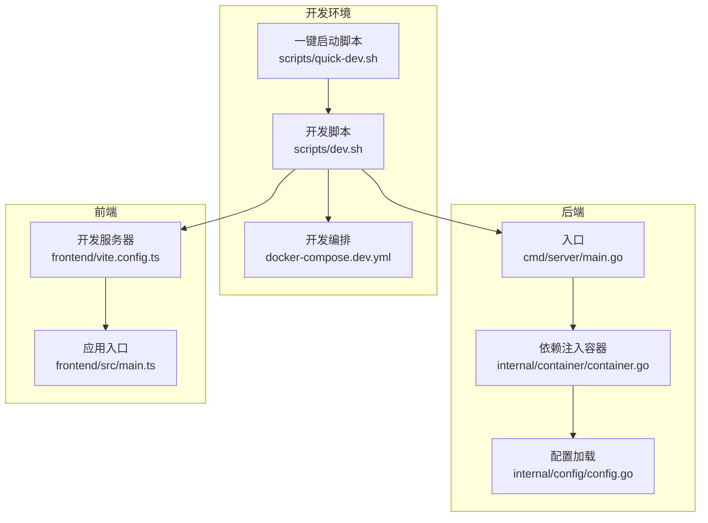
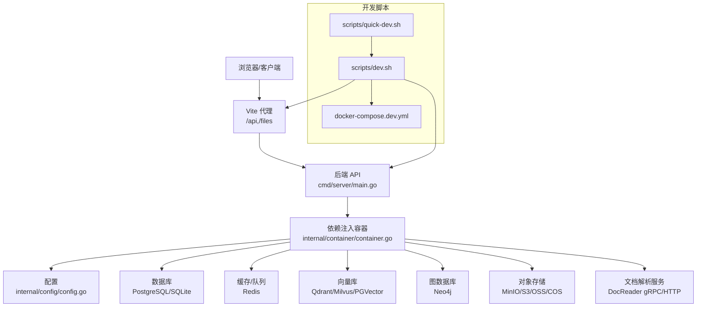
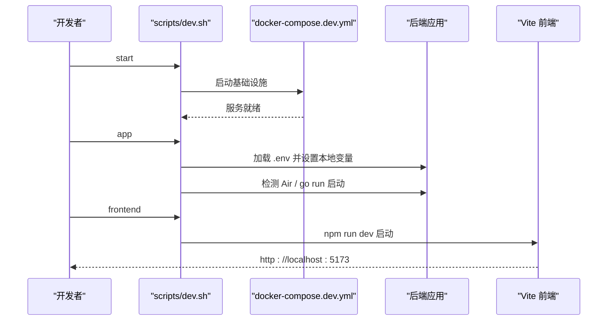
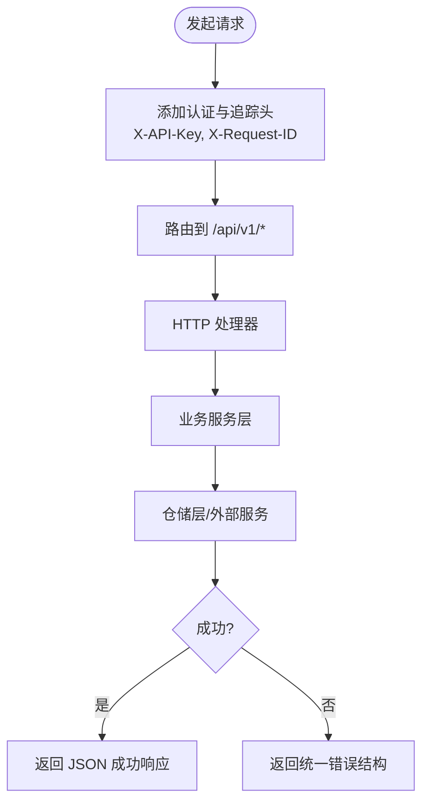
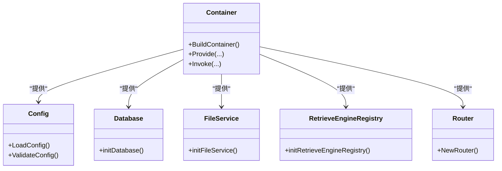
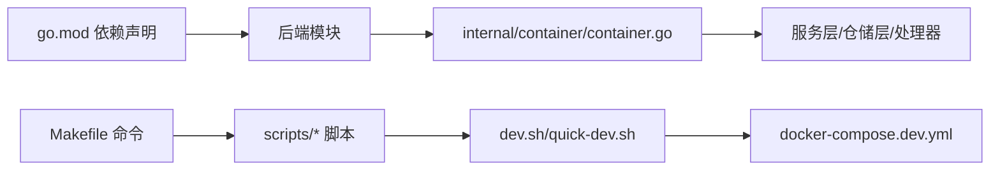

# 开发者指南

<cite>
**本文档引用的文件**
- [README.md](file://README.md)
- [docs/开发指南.md](file://docs/开发指南.md)
- [go.mod](file://go.mod)
- [Makefile](file://Makefile)
- [scripts/dev.sh](file://scripts/dev.sh)
- [scripts/quick-dev.sh](file://scripts/quick-dev.sh)
- [docker-compose.dev.yml](file://docker-compose.dev.yml)
- [frontend/vite.config.ts](file://frontend/vite.config.ts)
- [frontend/src/main.ts](file://frontend/src/main.ts)
- [cmd/server/main.go](file://cmd/server/main.go)
- [internal/config/config.go](file://internal/config/config.go)
- [internal/container/container.go](file://internal/container/container.go)
- [docs/api/README.md](file://docs/api/README.md)
</cite>

## 目录
1. [简介](#简介)
2. [项目结构](#项目结构)
3. [核心组件](#核心组件)
4. [架构总览](#架构总览)
5. [详细组件分析](#详细组件分析)
6. [依赖关系分析](#依赖关系分析)
7. [性能考虑](#性能考虑)
8. [故障排查指南](#故障排查指南)
9. [结论](#结论)
10. [附录](#附录)

## 简介
本指南面向 WeKnora 贡献者与维护者，提供从开发环境搭建、快速开发模式、IDE 配置与调试、热重载机制，到 API 参考、代码贡献流程、测试策略与持续集成配置的完整技术文档。文档强调可操作性与可追溯性，所有分析均基于仓库内实际文件。

## 项目结构
WeKnora 采用多模块混合架构：Go 后端、Vue 前端、Python 文档解析服务、MCP 工具服务、容器化部署与 Helm Chart。开发工作流围绕“基础设施容器 + 本地应用/前端进程”的快速开发模式展开。

**图表来源**
- [scripts/dev.sh:1-362](file://scripts/dev.sh#L1-L362)
- [scripts/quick-dev.sh:1-125](file://scripts/quick-dev.sh#L1-L125)
- [docker-compose.dev.yml:1-420](file://docker-compose.dev.yml#L1-L420)
- [cmd/server/main.go:1-124](file://cmd/server/main.go#L1-L124)
- [internal/container/container.go:1-800](file://internal/container/container.go#L1-L800)
- [internal/config/config.go:1-758](file://internal/config/config.go#L1-L758)
- [frontend/vite.config.ts:1-56](file://frontend/vite.config.ts#L1-L56)
- [frontend/src/main.ts:1-31](file://frontend/src/main.ts#L1-L31)

**章节来源**
- [README.md:333-349](file://README.md#L333-L349)
- [docs/开发指南.md:1-286](file://docs/开发指南.md#L1-L286)

## 核心组件
- 开发脚本与编排
  - scripts/dev.sh：启动/停止基础设施、启动后端/前端、查看状态与日志，支持多 profile（minio/qdrant/neo4j/jaeger/dex/langfuse）。
  - scripts/quick-dev.sh：一键启动后端与前端，简化首次开发体验。
  - docker-compose.dev.yml：定义开发态所需的基础设施服务（PostgreSQL、Redis、MinIO、Neo4j、Qdrant、Milvus、DocReader、Jaeger、Dex、Langfuse 等）。
- 后端
  - cmd/server/main.go：Gin 服务入口，优雅关闭、信号处理、监听地址与端口。
  - internal/container/container.go：依赖注入容器，注册配置、数据库、存储、检索、聊天管线、HTTP 处理器与任务队列。
  - internal/config/config.go：配置结构体与加载逻辑，支持环境变量覆盖、模板回填与校验。
- 前端
  - frontend/vite.config.ts：开发服务器端口、代理（/api、/files）、别名与插件。
  - frontend/src/main.ts：应用初始化、主题、国际化、路由就绪挂载。
- 构建与发布
  - Makefile：构建、测试、Docker 镜像、迁移、开发模式命令、Swagger 文档生成、Lite 版本打包等。

**章节来源**
- [scripts/dev.sh:1-362](file://scripts/dev.sh#L1-L362)
- [scripts/quick-dev.sh:1-125](file://scripts/quick-dev.sh#L1-L125)
- [docker-compose.dev.yml:1-420](file://docker-compose.dev.yml#L1-L420)
- [cmd/server/main.go:1-124](file://cmd/server/main.go#L1-L124)
- [internal/container/container.go:1-800](file://internal/container/container.go#L1-L800)
- [internal/config/config.go:1-758](file://internal/config/config.go#L1-L758)
- [frontend/vite.config.ts:1-56](file://frontend/vite.config.ts#L1-L56)
- [frontend/src/main.ts:1-31](file://frontend/src/main.ts#L1-L31)
- [Makefile:1-328](file://Makefile#L1-L328)

## 架构总览
WeKnora 的开发与运行架构以“容器化基础设施 + 本地进程”为核心，后端通过依赖注入容器装配服务层与仓储层，前端通过 Vite 提供热重载与代理能力，DocReader 作为独立 gRPC/HTTP 服务参与文档解析。

**图表来源**
- [cmd/server/main.go:1-124](file://cmd/server/main.go#L1-L124)
- [internal/container/container.go:1-800](file://internal/container/container.go#L1-L800)
- [internal/config/config.go:1-758](file://internal/config/config.go#L1-L758)
- [docker-compose.dev.yml:1-420](file://docker-compose.dev.yml#L1-L420)
- [frontend/vite.config.ts:1-56](file://frontend/vite.config.ts#L1-L56)
- [scripts/dev.sh:1-362](file://scripts/dev.sh#L1-L362)
- [scripts/quick-dev.sh:1-125](file://scripts/quick-dev.sh#L1-L125)

## 详细组件分析

### 开发环境与快速开发模式
- 基础设施启动
  - 使用 scripts/dev.sh start 启动 PostgreSQL、Redis、MinIO、Neo4j、DocReader、Jaeger、Qdrant、Milvus、Dex、Langfuse 等服务，支持 --minio/--qdrant/--neo4j/--jaeger/--dex/--full 等 profile 组合。
  - docker-compose.dev.yml 定义各服务端口、健康检查、卷与网络，便于本地联调。
- 后端与前端本地运行
  - scripts/dev.sh app：加载 .env，设置本地开发环境变量（DB_HOST、MINIO_ENDPOINT、REDIS_ADDR、NEO4J_URI、QDRANT_HOST 等），优先检测 Air 热重载，否则 go run 启动。
  - scripts/dev.sh frontend：进入 frontend 目录，安装依赖并启动 Vite 开发服务器（默认 5173）。
- 一键启动
  - scripts/quick-dev.sh：交互式启动后端与前端，自动记录 PID 并输出访问地址与管理命令。
- 开发优势
  - 前端热重载、后端快速重启、无需重建镜像、支持 IDE 断点调试。

**图表来源**
- [scripts/dev.sh:105-325](file://scripts/dev.sh#L105-L325)
- [docker-compose.dev.yml:1-420](file://docker-compose.dev.yml#L1-L420)

**章节来源**
- [docs/开发指南.md:1-286](file://docs/开发指南.md#L1-L286)
- [scripts/dev.sh:1-362](file://scripts/dev.sh#L1-L362)
- [scripts/quick-dev.sh:1-125](file://scripts/quick-dev.sh#L1-L125)
- [docker-compose.dev.yml:1-420](file://docker-compose.dev.yml#L1-L420)

### IDE 配置与调试技巧
- 后端调试
  - VS Code/GoLand：配置 Launch Server，设置 program 为 cmd/server，注入本地开发环境变量（DB_HOST、MINIO_ENDPOINT、REDIS_ADDR、NEO4J_URI、OTEL_EXPORTER_OTLP_ENDPOINT 等），断点调试。
- 前端调试
  - Vite 提供 source map，浏览器开发者工具可直接调试。
- 热重载
  - Air：安装后自动监听 Go 源码变更并重启；Vite 默认热重载。
- Makefile 开发命令
  - make dev-start/dev-app/dev-frontend/dev-status/dev-logs/dev-stop 提供统一入口。

**章节来源**
- [docs/开发指南.md:207-242](file://docs/开发指南.md#L207-L242)
- [Makefile:305-327](file://Makefile#L305-L327)

### API 参考与使用示例
- 基础信息
  - 基础 URL：/api/v1；响应格式：JSON；认证方式：X-API-Key。
- 认证与追踪
  - X-API-Key：租户级 API Key；建议添加 X-Request-ID 便于问题定位。
- 错误处理
  - 统一错误响应结构：success=false，error.code/message/details。
- API 分类概览
  - 认证管理、租户管理、知识库管理、知识管理、模型管理、分块管理、标签管理、FAQ 管理、智能体管理、会话管理、知识搜索、聊天功能、消息管理、评估功能、初始化管理、系统管理、MCP 服务、组织管理、Skills、网络搜索、向量存储等。

**图表来源**
- [docs/api/README.md:1-83](file://docs/api/README.md#L1-L83)

**章节来源**
- [docs/api/README.md:1-83](file://docs/api/README.md#L1-L83)

### 代码贡献流程与测试策略
- 提交规范
  - 使用 conventional commits：feat:/fix:/docs:/test:/refactor:/chore: 等类型。
  - gofmt 格式化，golangci-lint 代码检查。
- 测试
  - go test ./... 运行全部测试；针对特定模块可使用 go test ./internal/... 等。
- 文档
  - Swagger 文档生成：swag init -g cmd/server/main.go -o ./docs；访问 http://localhost:8080/swagger/index.html。
- CI/CD
  - GitHub Actions 工作流位于 .github/workflows（未在本节分析具体文件，建议遵循仓库内现有工作流命名与职责）。

**章节来源**
- [README.md:350-357](file://README.md#L350-L357)
- [Makefile:215-221](file://Makefile#L215-L221)
- [Makefile:204-210](file://Makefile#L204-L210)

### 持续集成配置
- 建议遵循
  - 代码风格与静态检查：golangci-lint、gofmt。
  - 单元测试与集成测试：按模块划分，覆盖关键路径。
  - API 文档：swag 自动生成并随构建产物发布。
  - 容器镜像：Dockerfile 与 Makefile 中的构建目标配合使用。
- 仓库现状
  - .github/workflows 目录存在，具体工作流文件未在本节分析，建议参照现有文件命名与职责进行补充或调整。

**章节来源**
- [Makefile:215-221](file://Makefile#L215-L221)
- [Makefile:204-210](file://Makefile#L204-L210)

### 性能分析与可观测性
- 链路追踪
  - Jaeger UI：http://localhost:16686；OTLP 导出端口本地 4317。
- 分布式追踪
  - OpenTelemetry Tracer 初始化与清理在容器层注册，确保优雅退出时资源回收。
- 日志与健康检查
  - 各基础设施服务均配置健康检查与日志输出，便于快速定位问题。

**章节来源**
- [docker-compose.dev.yml:164-187](file://docker-compose.dev.yml#L164-L187)
- [internal/container/container.go:323-342](file://internal/container/container.go#L323-L342)

### 依赖注入与服务装配
- 关键装配点
  - 配置加载：config.LoadConfig 支持环境变量覆盖与模板回填。
  - 数据库：根据 DB_DRIVER 选择 PostgreSQL/SQLite，自动迁移与连接池配置。
  - 存储：根据 STORAGE_TYPE 选择 MinIO/S3/OSS/COS/Local/Dummy。
  - 检索：RETRIEVE_DRIVER 组合（postgres/sqlite/elasticsearch_v7/v8/milvus/weaviate/qdrant/neo4j）。
  - 任务队列：Redis 可用时使用 Asynq，否则使用同步执行器。
  - 聊天管线：注册搜索、重排、网页抓取、合并、数据分析、聊天补全等插件。
- 依赖关系可视化

**图表来源**
- [internal/config/config.go:341-438](file://internal/config/config.go#L341-L438)
- [internal/container/container.go:85-311](file://internal/container/container.go#L85-L311)

**章节来源**
- [internal/config/config.go:1-758](file://internal/config/config.go#L1-L758)
- [internal/container/container.go:1-800](file://internal/container/container.go#L1-L800)

## 依赖关系分析
- 外部依赖
  - Gin、GORM、Redis、PostgreSQL、Elasticsearch、Milvus、Qdrant、Neo4j、MinIO、Weaviate、OpenTelemetry、Langfuse、Asynq、Wails 等。
- 本地依赖
  - internal/*：application/service、repository、handler、types、models、datasource、im、infrastructure、logger、middleware、router、runtime、sandbox、stream、tracing 等。
- 构建与工具
  - Makefile 提供统一命令；go.mod 管理依赖；scripts/* 提供开发与运维脚本。

**图表来源**
- [go.mod:1-325](file://go.mod#L1-L325)
- [Makefile:1-328](file://Makefile#L1-L328)
- [scripts/dev.sh:1-362](file://scripts/dev.sh#L1-L362)
- [scripts/quick-dev.sh:1-125](file://scripts/quick-dev.sh#L1-L125)
- [docker-compose.dev.yml:1-420](file://docker-compose.dev.yml#L1-L420)
- [internal/container/container.go:1-800](file://internal/container/container.go#L1-L800)

**章节来源**
- [go.mod:1-325](file://go.mod#L1-L325)
- [Makefile:1-328](file://Makefile#L1-L328)

## 性能考虑
- 数据库
  - SQLite：单写并发限制，连接池最大打开连接数设为 1，避免“database is locked”。
  - PostgreSQL：合理设置连接池空闲连接数与生命周期。
- 检索
  - 多驱动组合（postgres/sqlite/elasticsearch/milvus/weaviate/qdrant/neo4j）按需启用，减少不必要的依赖。
- 缓存与队列
  - Redis 可用时使用分布式队列（Asynq），否则使用同步执行器，避免跨实例一致性问题。
- 文档解析
  - DocReader 作为独立服务，必要时单独重建镜像并重启。

**章节来源**
- [internal/container/container.go:514-526](file://internal/container/container.go#L514-L526)
- [internal/container/container.go:759-800](file://internal/container/container.go#L759-L800)
- [docs/开发指南.md:271-279](file://docs/开发指南.md#L271-L279)

## 故障排查指南
- 启动 dev-app 连接数据库失败
  - 确认已执行 make dev-start 并等待服务健康检查通过。
- 前端访问 API 出现 CORS
  - 检查 vite.config.ts 中 /api 与 /files 代理配置。
- DocReader 需要重新构建
  - 使用 scripts/build_images.sh -d 重新构建 DocReader 镜像并 make dev-restart。
- 服务状态与日志
  - 使用 make dev-status 查看容器状态，make dev-logs 实时查看日志。

**章节来源**
- [docs/开发指南.md:261-279](file://docs/开发指南.md#L261-L279)
- [scripts/dev.sh:228-238](file://scripts/dev.sh#L228-L238)

## 结论
WeKnora 的开发工作流以“容器化基础设施 + 本地进程”为核心，结合 Air/Vite 热重载与 IDE 调试，显著提升迭代效率。通过依赖注入容器与清晰的模块划分，后端具备良好的可扩展性与可维护性。建议贡献者遵循代码规范与测试策略，配合 Swagger 文档与可观测性工具，确保高质量交付。

## 附录
- 常用命令
  - 开发：make dev-start / dev-app / dev-frontend / dev-status / dev-logs / dev-stop
  - 构建：make build-images / build-images-app / build-images-docreader / build-images-frontend
  - 文档：make docs（生成 Swagger）
  - 测试：make test
- 访问地址
  - 前端：http://localhost:5173
  - 后端 API：http://localhost:8080
  - MinIO 控制台：http://localhost:9001
  - Jaeger UI：http://localhost:16686
  - Neo4j Browser：http://localhost:7474（Bolt: localhost:7687）