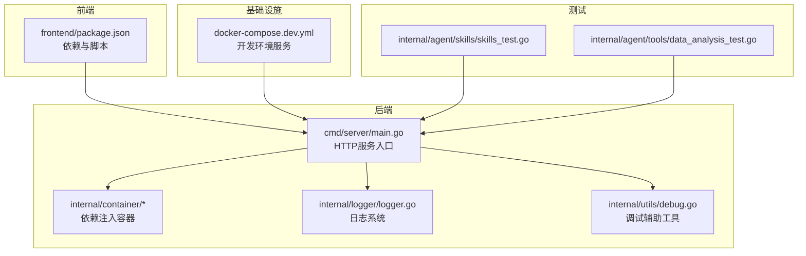
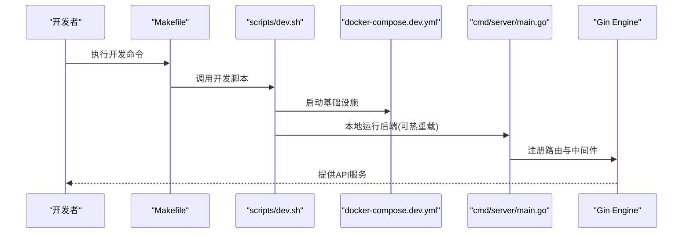
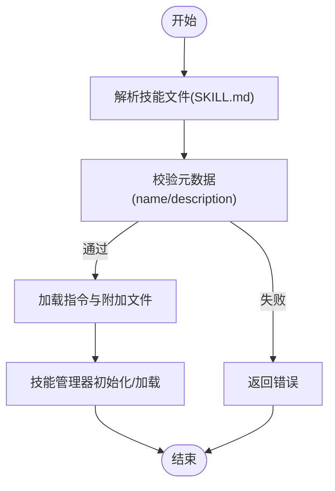
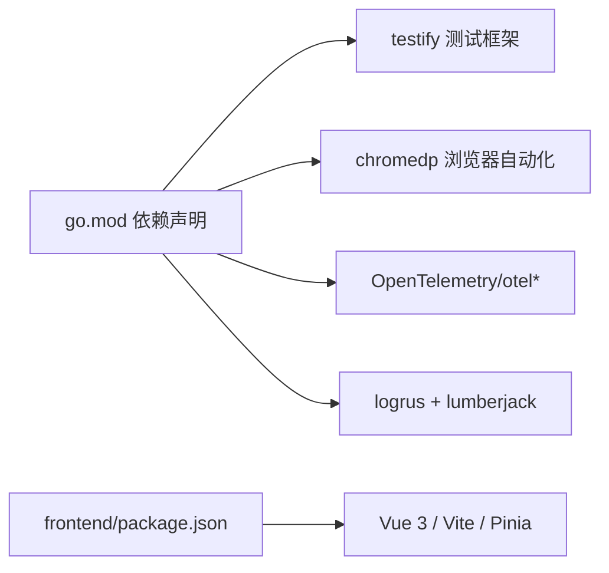

# 调试与测试

<cite>
**本文引用的文件**   
- [go.mod](file://go.mod)
- [cmd/server/main.go](file://cmd/server/main.go)
- [Makefile](file://Makefile)
- [scripts/dev.sh](file://scripts/dev.sh)
- [scripts/quick-dev.sh](file://scripts/quick-dev.sh)
- [docker-compose.dev.yml](file://docker-compose.dev.yml)
- [internal/logger/logger.go](file://internal/logger/logger.go)
- [internal/utils/debug.go](file://internal/utils/debug.go)
- [frontend/package.json](file://frontend/package.json)
- [internal/agent/skills/skills_test.go](file://internal/agent/skills/skills_test.go)
- [internal/agent/tools/data_analysis_test.go](file://internal/agent/tools/data_analysis_test.go)
</cite>

## 目录
1. [简介](#简介)
2. [项目结构](#项目结构)
3. [核心组件](#核心组件)
4. [架构总览](#架构总览)
5. [详细组件分析](#详细组件分析)
6. [依赖分析](#依赖分析)
7. [性能考虑](#性能考虑)
8. [故障排查指南](#故障排查指南)
9. [结论](#结论)
10. [附录](#附录)

## 简介
本指南面向WeKnora项目的调试与测试实践，覆盖后端Go应用、前端Vue.js应用、单元与集成测试、性能分析（pprof/火焰图）、日志系统配置与使用、常见问题排查以及自动化测试与持续集成建议。目标是帮助开发者快速定位问题、提升开发效率，并建立稳定可靠的测试与调试流程。

## 项目结构
WeKnora采用多模块分层组织：后端Go服务位于cmd/server，前端位于frontend，内部业务逻辑分布在internal下，测试与脚本位于scripts与各子包内。开发与测试通过Makefile统一入口，配合Docker Compose快速搭建基础设施。

**图表来源**
- [cmd/server/main.go:43-123](file://cmd/server/main.go#L43-L123)
- [internal/logger/logger.go:140-184](file://internal/logger/logger.go#L140-L184)
- [internal/utils/debug.go:11-90](file://internal/utils/debug.go#L11-L90)
- [docker-compose.dev.yml:1-420](file://docker-compose.dev.yml#L1-L420)
- [frontend/package.json:1-64](file://frontend/package.json#L1-L64)
- [internal/agent/skills/skills_test.go:1-393](file://internal/agent/skills/skills_test.go#L1-L393)
- [internal/agent/tools/data_analysis_test.go:1-91](file://internal/agent/tools/data_analysis_test.go#L1-L91)

**章节来源**
- [cmd/server/main.go:43-123](file://cmd/server/main.go#L43-L123)
- [Makefile:1-328](file://Makefile#L1-L328)
- [scripts/dev.sh:1-362](file://scripts/dev.sh#L1-L362)
- [docker-compose.dev.yml:1-420](file://docker-compose.dev.yml#L1-L420)
- [frontend/package.json:1-64](file://frontend/package.json#L1-L64)

## 核心组件
- HTTP服务与生命周期：后端通过Gin引擎对外提供API，支持优雅关闭、信号处理与资源清理。
- 日志系统：基于logrus封装，支持环境变量控制级别、落盘与彩色输出、上下文字段透传。
- 调试工具：提供Redis任务清理与状态检查等实用函数，便于排查异步任务异常。
- 开发脚本：一键启动基础设施、后端与前端，支持Air热重载与日志采集。
- 测试体系：覆盖Agent技能解析、验证与加载，以及数据处理工具SQL构造等关键逻辑。

**章节来源**
- [cmd/server/main.go:43-123](file://cmd/server/main.go#L43-L123)
- [internal/logger/logger.go:140-414](file://internal/logger/logger.go#L140-L414)
- [internal/utils/debug.go:11-90](file://internal/utils/debug.go#L11-L90)
- [scripts/dev.sh:240-325](file://scripts/dev.sh#L240-L325)
- [internal/agent/skills/skills_test.go:10-393](file://internal/agent/skills/skills_test.go#L10-L393)
- [internal/agent/tools/data_analysis_test.go:8-91](file://internal/agent/tools/data_analysis_test.go#L8-L91)

## 架构总览
后端服务启动后，通过依赖注入容器装配路由与中间件，监听配置端口并注册信号处理器。开发脚本提供本地后端与前端的分离运行模式，Docker Compose负责数据库、缓存、向量库、链路追踪等基础设施的编排。

**图表来源**
- [Makefile:305-327](file://Makefile#L305-L327)
- [scripts/dev.sh:105-198](file://scripts/dev.sh#L105-L198)
- [docker-compose.dev.yml:1-420](file://docker-compose.dev.yml#L1-L420)
- [cmd/server/main.go:43-123](file://cmd/server/main.go#L43-L123)

## 详细组件分析

### 后端调试与断点设置
- 入口与生命周期
  - 通过Gin模式切换与信号处理实现优雅关闭，便于在IDE中设置断点观察上下文与资源清理流程。
  - 关键位置：HTTP服务器创建、监听端口重试、信号接收与二次信号强制关闭、资源清理回调。
- 调试建议
  - 在main函数中设置断点，观察容器构建、配置加载与路由注册。
  - 在中间件与业务处理器中设置断点，检查请求上下文、鉴权与错误处理。
  - 使用环境变量调整日志级别，结合结构化日志定位问题。

**章节来源**
- [cmd/server/main.go:43-123](file://cmd/server/main.go#L43-L123)

### 变量检查与堆栈跟踪
- 结构化日志
  - 日志系统支持在上下文中附加字段（如请求ID、租户ID、用户ID等），便于跨服务串联。
  - 提供调用者信息（文件、行号、函数名）与彩色输出，便于快速定位。
- 堆栈与上下文
  - 通过上下文克隆与字段透传，确保错误日志包含足够的上下文信息。
  - 建议在关键路径记录关键字段，结合日志聚合系统进行检索。

**章节来源**
- [internal/logger/logger.go:140-414](file://internal/logger/logger.go#L140-L414)

### 前端调试方法（Vue.js）
- 开发服务器
  - 通过NPM脚本启动Vite开发服务器，默认端口5173，支持热更新。
- 调试技巧
  - 使用浏览器开发者工具检查网络请求、响应与状态码。
  - 在Vue组件中设置断点，检查props、状态与事件流。
  - 结合后端日志与前端控制台，定位接口调用与渲染问题。

**章节来源**
- [frontend/package.json:6-13](file://frontend/package.json#L6-L13)

### 单元测试与集成测试
- 单元测试
  - Agent技能解析与验证：覆盖文件解析、元数据提取、指令加载与脚本识别。
  - 数据分析工具：针对Excel读取SQL构造的边界条件与转义处理进行测试。
- 集成测试
  - 建议围绕Agent技能管理器初始化、发现与加载流程编写集成测试，模拟文件系统与沙箱环境。
- 测试执行
  - 使用Makefile统一入口运行全部测试，或在IDE中直接运行单个测试文件。

**图表来源**
- [internal/agent/skills/skills_test.go:10-179](file://internal/agent/skills/skills_test.go#L10-L179)

**章节来源**
- [internal/agent/skills/skills_test.go:10-393](file://internal/agent/skills/skills_test.go#L10-L393)
- [internal/agent/tools/data_analysis_test.go:8-91](file://internal/agent/tools/data_analysis_test.go#L8-L91)
- [Makefile:94-95](file://Makefile#L94-L95)

### 性能分析（pprof与火焰图）
- pprof集成
  - 项目引入OpenTelemetry与相关导出器，可用于性能采样与追踪。
  - 建议在开发环境中开启pprof端点，结合浏览器或go tool pprof生成火焰图。
- 火焰图分析
  - 通过火焰图定位热点函数、内存分配与阻塞点，优化关键路径。
- 实践建议
  - 在高频接口或批处理任务中启用采样，定期对比基准版本。

**章节来源**
- [go.mod:61-67](file://go.mod#L61-L67)

### 日志系统配置与使用
- 环境变量
  - LOG_LEVEL：设置日志级别（debug/info/warn/error/fatal）。
  - LOG_PATH：设置日志文件路径，支持滚动与归档。
- 行为特性
  - 非终端环境自动禁用ANSI颜色，避免日志聚合异常。
  - 支持多写入器（stdout与文件），便于本地与容器化部署。
- 上下文字段
  - 通过WithField/WithFields/WithRequestID在日志中附加请求ID与上下文信息，便于关联查询。

**章节来源**
- [internal/logger/logger.go:140-414](file://internal/logger/logger.go#L140-L414)

### 调试辅助工具（Redis任务清理与状态检查）
- 清理过期任务
  - 通过前缀匹配查找running/progress键，结合TTL判断并删除异常键。
- 状态检查
  - 查询running与progress键是否存在、TTL与内容，辅助定位异步任务卡住或超时问题。

**章节来源**
- [internal/utils/debug.go:11-90](file://internal/utils/debug.go#L11-L90)

### 开发与测试脚本
- 一键启动
  - scripts/quick-dev.sh：启动基础设施、后端与前端，支持后台运行与日志查看。
- 分离运行
  - scripts/dev.sh：分别启动基础设施、后端（支持Air热重载）、前端，适合IDE联调。
- Makefile入口
  - 提供build/run/test/docker等常用命令，统一开发与CI流程。

**章节来源**
- [scripts/quick-dev.sh:1-125](file://scripts/quick-dev.sh#L1-L125)
- [scripts/dev.sh:105-325](file://scripts/dev.sh#L105-L325)
- [Makefile:1-328](file://Makefile#L1-L328)

## 依赖分析
- 开发与测试依赖
  - 测试框架：testify
  - 浏览器自动化：chromedp
- 性能与可观测性
  - OpenTelemetry生态：trace导出、OTLP端点
  - 日志：logrus + lumberjack滚动
- 前端依赖
  - Vue 3、Vite、Pinia、Vue Router等

**图表来源**
- [go.mod:49-78](file://go.mod#L49-L78)
- [frontend/package.json:14-51](file://frontend/package.json#L14-L51)

**章节来源**
- [go.mod:49-78](file://go.mod#L49-L78)
- [frontend/package.json:14-51](file://frontend/package.json#L14-L51)

## 性能考虑
- 采样与导出
  - 在开发环境启用pprof与OTLP导出，定期生成火焰图与追踪数据。
- 关键路径优化
  - 结合日志与火焰图定位热点，优化数据库查询、缓存命中率与并发控制。
- 资源清理
  - 优雅关闭流程中确保连接池与临时资源释放，避免泄漏。

[本节为通用指导，无需特定文件来源]

## 故障排查指南
- 启动失败
  - 检查端口占用与权限，确认环境变量（DB/Redis/MinIO/Qdrant等）正确。
  - 使用scripts/dev.sh logs查看容器日志，定位依赖服务健康状态。
- 接口异常
  - 在后端设置断点，检查鉴权、参数校验与错误处理分支。
  - 在前端检查网络面板与响应体，核对状态码与消息。
- 异步任务卡住
  - 使用调试工具清理过期running/progress键，检查TTL与内容。
- 日志缺失或乱码
  - 检查LOG_LEVEL与LOG_PATH，确认非终端环境颜色禁用策略。

**章节来源**
- [scripts/dev.sh:228-238](file://scripts/dev.sh#L228-L238)
- [internal/utils/debug.go:11-90](file://internal/utils/debug.go#L11-L90)
- [internal/logger/logger.go:140-184](file://internal/logger/logger.go#L140-L184)

## 结论
通过统一的Makefile入口、完善的日志系统、可热重载的开发脚本与覆盖关键路径的测试体系，WeKnora能够高效支撑日常调试与测试工作。建议在团队内推广结构化日志与性能采样流程，持续优化关键路径与异步任务稳定性。

[本节为总结，无需特定文件来源]

## 附录

### 常用命令速查
- 启动开发环境：make dev-start
- 启动后端：make dev-app 或 ./scripts/dev.sh app
- 启动前端：make dev-frontend 或 ./scripts/dev.sh frontend
- 运行测试：make test
- 生成API文档：make docs

**章节来源**
- [Makefile:305-327](file://Makefile#L305-L327)
- [scripts/dev.sh:327-362](file://scripts/dev.sh#L327-L362)