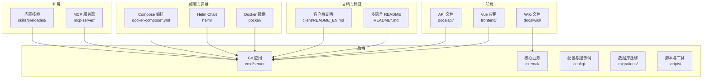
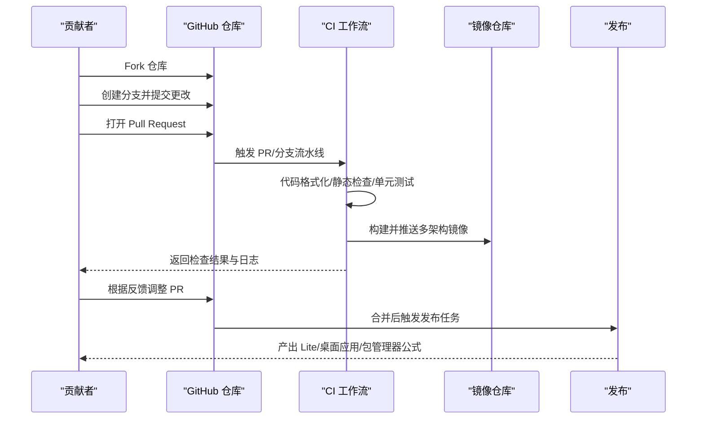
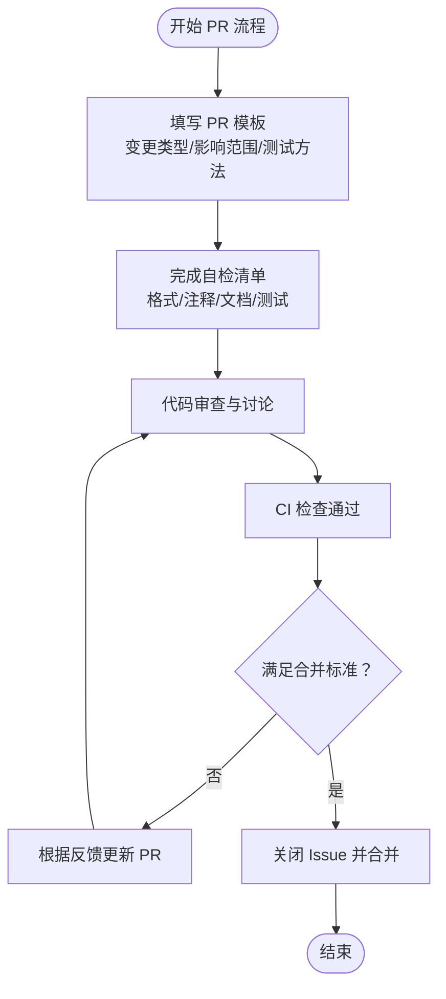
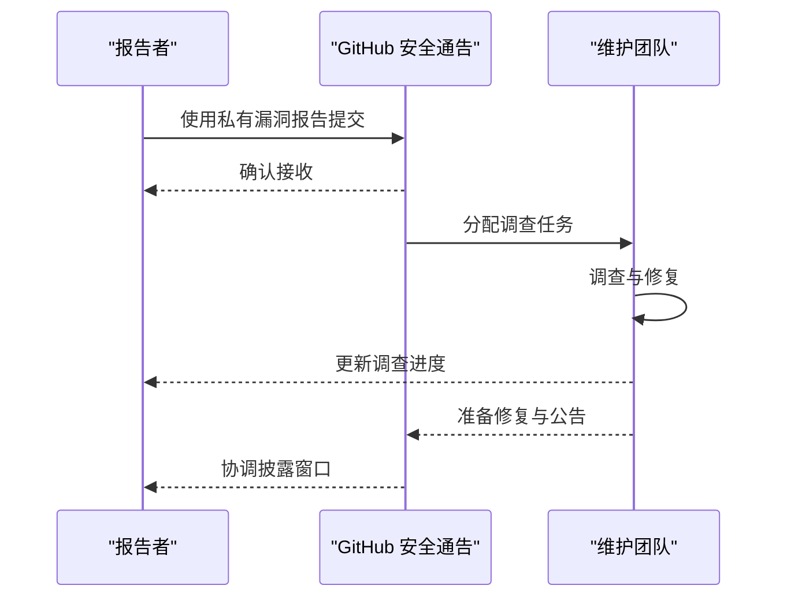
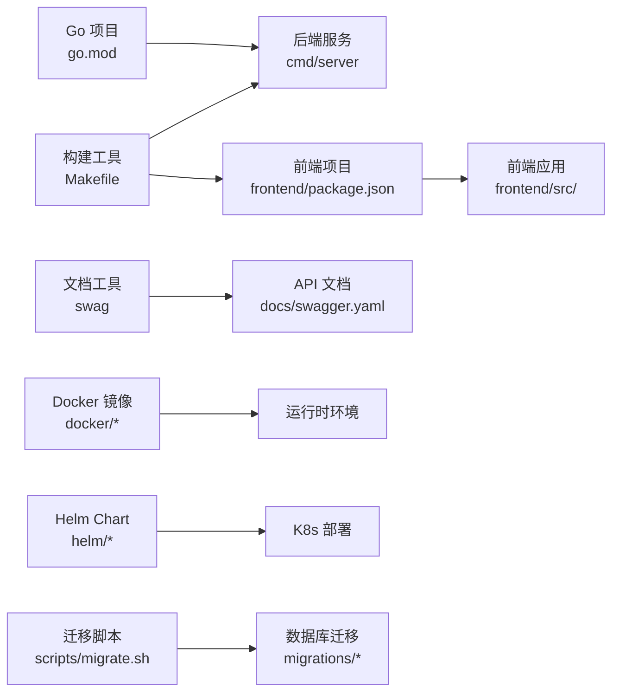

# 贡献流程

<cite>
**本文引用的文件**   
- [README.md](file://README.md)
- [SECURITY.md](file://SECURITY.md)
- [.github/pull_request_template.md](file://.github/pull_request_template.md)
- [Makefile](file://Makefile)
- [docs/开发指南.md](file://docs/开发指南.md)
- [docs/ROADMAP.md](file://docs/ROADMAP.md)
- [.github/workflows/docker-image.yml](file://.github/workflows/docker-image.yml)
- [.github/workflows/release-lite.yml](file://.github/workflows/release-lite.yml)
- [client/README_EN.md](file://client/README_EN.md)
- [docs/api/README.md](file://docs/api/README.md)
- [docs/开发指南.md](file://docs/开发指南.md)
- [scripts/dev.sh](file://scripts/dev.sh)
- [scripts/start_all.sh](file://scripts/start_all.sh)
- [scripts/build_images.sh](file://scripts/build_images.sh)
- [scripts/package-lite.sh](file://scripts/package-lite.sh)
- [scripts/package-mac-app.sh](file://scripts/package-mac-app.sh)
- [scripts/get_version.sh](file://scripts/get_version.sh)
- [go.mod](file://go.mod)
- [frontend/package.json](file://frontend/package.json)
- [frontend/tsconfig.json](file://frontend/tsconfig.json)
- [frontend/vite.config.ts](file://frontend/vite.config.ts)
- [frontend/Dockerfile](file://frontend/Dockerfile)
- [docker/Dockerfile.docreader](file://docker/Dockerfile.docreader)
- [docker/Dockerfile.sandbox](file://docker/Dockerfile.sandbox)
- [helm/Chart.yaml](file://helm/Chart.yaml)
- [helm/values.yaml](file://helm/values.yaml)
- [helm/templates/app.yaml](file://helm/templates/app.yaml)
- [helm/templates/frontend.yaml](file://helm/templates/frontend.yaml)
- [helm/templates/docreader.yaml](file://helm/templates/docreader.yaml)
- [helm/templates/ingress.yaml](file://helm/templates/ingress.yaml)
- [helm/templates/secrets.yaml](file://helm/templates/secrets.yaml)
- [helm/templates/serviceaccount.yaml](file://helm/templates/serviceaccount.yaml)
- [helm/templates/postgres.yaml](file://helm/templates/postgres.yaml)
- [helm/templates/redis.yaml](file://helm/templates/redis.yaml)
- [helm/templates/neo4j.yaml](file://helm/templates/neo4j.yaml)
- [helm/templates/notes.txt](file://helm/templates/notes.txt)
- [scripts/check-env.sh](file://scripts/check-env.sh)
- [scripts/test-homebrew.sh](file://scripts/test-homebrew.sh)
- [Formula/weknora-lite.rb](file://Formula/weknora-lite.rb)
- [scripts/update-homebrew-formula.sh](file://scripts/update-homebrew-formula.sh)
- [scripts/migrate.sh](file://scripts/migrate.sh)
- [migrations/sqlite/000000_init.up.sql](file://migrations/sqlite/000000_init.up.sql)
- [migrations/mysql/00-init-db.sql](file://migrations/mysql/00-init-db.sql)
- [migrations/paradedb/01-migrate-to-paradedb.sql](file://migrations/paradedb/01-migrate-to-paradedb.sql)
- [migrations/versioned/000000_init.up.sql](file://migrations/versioned/000000_init.up.sql)
- [migrations/versioned/000001_agent.up.sql](file://migrations/versioned/000001_agent.up.sql)
- [migrations/versioned/000002_embeddings.up.sql](file://migrations/versioned/000002_embeddings.up.sql)
- [migrations/versioned/000003_chunk_flags.up.sql](file://migrations/versioned/000003_chunk_flags.up.sql)
- [migrations/versioned/000004_drop_vlm_model_id.up.sql](file://migrations/versioned/000004_drop_vlm_model_id.up.sql)
- [migrations/versioned/000005_mentioned_items.up.sql](file://migrations/versioned/000005_mentioned_items.up.sql)
- [migrations/versioned/000006_custom_agents.up.sql](file://migrations/versioned/000006_custom_agents.up.sql)
- [migrations/versioned/000007_embeddings_tag_id.up.sql](file://migrations/versioned/000007_embeddings_tag_id.up.sql)
- [migrations/versioned/000008_migrate_untagged_faq.up.sql](file://migrations/versioned/000008_migrate_untagged_faq.up.sql)
- [migrations/versioned/000009_add_last_faq_import_result.up.sql](file://migrations/versioned/000009_add_last_faq_import_result.up.sql)
- [migrations/versioned/000010_add_seq_id.up.sql](file://migrations/versioned/000010_add_seq_id.up.sql)
- [migrations/versioned/000011_pg_search_update.up.sql](file://migrations/versioned/000011_pg_search_update.up.sql)
- [migrations/versioned/000012_organizations.up.sql](file://migrations/versioned/000012_organizations.up.sql)
- [migrations/versioned/000013_engine_configs.up.sql](file://migrations/versioned/000013_engine_configs.up.sql)
- [migrations/versioned/000014_storage_provider_config.up.sql](file://migrations/versioned/000014_storage_provider_config.up.sql)
- [migrations/versioned/000015_add_is_fallback.up.sql](file://migrations/versioned/000015_add_is_fallback.up.sql)
- [migrations/versioned/000016_add_kb_pinned.up.sql](file://migrations/versioned/000016_add_kb_pinned.up.sql)
- [migrations/versioned/000017_mcp_builtin.up.sql](file://migrations/versioned/000017_mcp_builtin.up.sql)
- [migrations/versioned/000018_extend_tenant_api_key.up.sql](file://migrations/versioned/000018_extend_tenant_api_key.up.sql)
- [migrations/versioned/000019_add_agent_duration_ms.up.sql](file://migrations/versioned/000019_add_agent_duration_ms.up.sql)
- [migrations/versioned/000020_add_message_knowledge_id.up.sql](file://migrations/versioned/000020_add_message_knowledge_id.up.sql)
- [migrations/versioned/000021_im_channel.up.sql](file://migrations/versioned/000021_im_channel.up.sql)
- [migrations/versioned/000022_message_images.up.sql](file://migrations/versioned/000022_message_images.up.sql)
- [migrations/versioned/000023_im_channel_kb_id.up.sql](file://migrations/versioned/000023_im_channel_kb_id.up.sql)
- [migrations/versioned/000024_im_channel_bot_identity.up.sql](file://migrations/versioned/000024_im_channel_bot_identity.up.sql)
- [migrations/versioned/000025_message_channel.up.sql](file://migrations/versioned/000025_message_channel.up.sql)
- [migrations/versioned/000026_chunks_query_indexes.up.sql](file://migrations/versioned/000026_chunks_query_indexes.up.sql)
- [migrations/versioned/000027_message_rendered_content.up.sql](file://migrations/versioned/000027_message_rendered_content.up.sql)
- [migrations/versioned/000028_im_thread_session.up.sql](file://migrations/versioned/000028_im_thread_session.up.sql)
- [migrations/versioned/000029_datasource_tables.up.sql](file://migrations/versioned/000029_datasource_tables.up.sql)
- [migrations/versioned/000030_web_search_providers.up.sql](file://migrations/versioned/000030_web_search_providers.up.sql)
- [migrations/versioned/000031_add_asr_config.up.sql](file://migrations/versioned/000031_add_asr_config.up.sql)
- [migrations/versioned/000032_vector_stores.up.sql](file://migrations/versioned/000032_vector_stores.up.sql)
- [migrations/versioned/000033_add_video_info_to_chunks.up.sql](file://migrations/versioned/000033_add_video_info_to_chunks.up.sql)
- [migrations/versioned/000034_add_attachments.up.sql](file://migrations/versioned/000034_add_attachments.up.sql)
- [migrations/versioned/000035_add_credentials.up.sql](file://migrations/versioned/000035_add_credentials.up.sql)
- [migrations/versioned/000036_kb_vector_store_id.up.sql](file://migrations/versioned/000036_kb_vector_store_id.up.sql)
- [migrations/versioned/000037_wiki_and_indexing.up.sql](file://migrations/versioned/000037_wiki_and_indexing.up.sql)
- [docker-compose.yml](file://docker-compose.yml)
- [docker-compose.dev.yml](file://docker-compose.dev.yml)
- [scripts/dev.sh](file://scripts/dev.sh)
- [scripts/start_all.sh](file://scripts/start_all.sh)
- [scripts/build_images.sh](file://scripts/build_images.sh)
- [scripts/package-lite.sh](file://scripts/package-lite.sh)
- [scripts/package-mac-app.sh](file://scripts/package-mac-app.sh)
- [scripts/get_version.sh](file://scripts/get_version.sh)
- [scripts/check-env.sh](file://scripts/check-env.sh)
- [scripts/test-homebrew.sh](file://scripts/test-homebrew.sh)
- [Formula/weknora-lite.rb](file://Formula/weknora-lite.rb)
- [scripts/update-homebrew-formula.sh](file://scripts/update-homebrew-formula.sh)
- [scripts/migrate.sh](file://scripts/migrate.sh)
- [migrations/sqlite/000000_init.down.sql](file://migrations/sqlite/000000_init.down.sql)
- [migrations/mysql/00-init-db.sql](file://migrations/mysql/00-init-db.sql)
- [migrations/paradedb/01-migrate-to-paradedb.sql](file://migrations/paradedb/01-migrate-to-paradedb.sql)
- [migrations/versioned/000000_init.down.sql](file://migrations/versioned/000000_init.down.sql)
- [migrations/versioned/000001_agent.down.sql](file://migrations/versioned/000001_agent.down.sql)
- [migrations/versioned/000002_embeddings.down.sql](file://migrations/versioned/000002_embeddings.down.sql)
- [migrations/versioned/000003_chunk_flags.down.sql](file://migrations/versioned/000003_chunk_flags.down.sql)
- [migrations/versioned/000004_drop_vlm_model_id.down.sql](file://migrations/versioned/000004_drop_vlm_model_id.down.sql)
- [migrations/versioned/000005_mentioned_items.down.sql](file://migrations/versioned/000005_mentioned_items.down.sql)
- [migrations/versioned/000006_custom_agents.down.sql](file://migrations/versioned/000006_custom_agents.down.sql)
- [migrations/versioned/000007_embeddings_tag_id.down.sql](file://migrations/versioned/000007_embeddings_tag_id.down.sql)
- [migrations/versioned/000008_migrate_untagged_faq.down.sql](file://migrations/versioned/000008_migrate_untagged_faq.down.sql)
- [migrations/versioned/000009_add_last_faq_import_result.down.sql](file://migrations/versioned/000009_add_last_faq_import_result.down.sql)
- [migrations/versioned/000010_add_seq_id.down.sql](file://migrations/versioned/000010_add_seq_id.down.sql)
- [migrations/versioned/000011_pg_search_update.down.sql](file://migrations/versioned/000011_pg_search_update.down.sql)
- [migrations/versioned/000012_organizations.down.sql](file://migrations/versioned/000012_organizations.down.sql)
- [migrations/versioned/000013_engine_configs.down.sql](file://migrations/versioned/000013_engine_configs.down.sql)
- [migrations/versioned/000014_storage_provider_config.down.sql](file://migrations/versioned/000014_storage_provider_config.down.sql)
- [migrations/versioned/000015_add_is_fallback.down.sql](file://migrations/versioned/000015_add_is_fallback.down.sql)
- [migrations/versioned/000016_add_kb_pinned.down.sql](file://migrations/versioned/000016_add_kb_pinned.down.sql)
- [migrations/versioned/000017_mcp_builtin.down.sql](file://migrations/versioned/000017_mcp_builtin.down.sql)
- [migrations/versioned/000018_extend_tenant_api_key.down.sql](file://migrations/versioned/000018_extend_tenant_api_key.down.sql)
- [migrations/versioned/000019_add_agent_duration_ms.down.sql](file://migrations/versioned/000019_add_agent_duration_ms.down.sql)
- [migrations/versioned/000020_add_message_knowledge_id.down.sql](file://migrations/versioned/000020_add_message_knowledge_id.down.sql)
- [migrations/versioned/000021_im_channel.down.sql](file://migrations/versioned/000021_im_channel.down.sql)
- [migrations/versioned/000022_message_images.down.sql](file://migrations/versioned/000022_message_images.down.sql)
- [migrations/versioned/000023_im_channel_kb_id.down.sql](file://migrations/versioned/000023_im_channel_kb_id.down.sql)
- [migrations/versioned/000024_im_channel_bot_identity.down.sql](file://migrations/versioned/000024_im_channel_bot_identity.down.sql)
- [migrations/versioned/000025_message_channel.down.sql](file://migrations/versioned/000025_message_channel.down.sql)
- [migrations/versioned/000026_chunks_query_indexes.down.sql](file://migrations/versioned/000026_chunks_query_indexes.down.sql)
- [migrations/versioned/000027_message_rendered_content.down.sql](file://migrations/versioned/000027_message_rendered_content.down.sql)
- [migrations/versioned/000028_im_thread_session.down.sql](file://migrations/versioned/000028_im_thread_session.down.sql)
- [migrations/versioned/000029_datasource_tables.down.sql](file://migrations/versioned/000029_datasource_tables.down.sql)
- [migrations/versioned/000030_web_search_providers.down.sql](file://migrations/versioned/000030_web_search_providers.down.sql)
- [migrations/versioned/000031_add_asr_config.down.sql](file://migrations/versioned/000031_add_asr_config.down.sql)
- [migrations/versioned/000032_vector_stores.down.sql](file://migrations/versioned/000032_vector_stores.down.sql)
- [migrations/versioned/000033_add_video_info_to_chunks.down.sql](file://migrations/versioned/000033_add_video_info_to_chunks.down.sql)
- [migrations/versioned/000034_add_attachments.down.sql](file://migrations/versioned/000034_add_attachments.down.sql)
- [migrations/versioned/000035_add_credentials.down.sql](file://migrations/versioned/000035_add_credentials.down.sql)
- [migrations/versioned/000036_kb_vector_store_id.down.sql](file://migrations/versioned/000036_kb_vector_store_id.down.sql)
- [migrations/versioned/000037_wiki_and_indexing.down.sql](file://migrations/versioned/000037_wiki_and_indexing.down.sql)
</cite>

## 目录
1. 引言
2. 项目结构
3. 核心组件
4. 架构总览
5. 详细组件分析
6. 依赖分析
7. 性能考虑
8. 故障排查指南
9. 结论
10. 附录

## 引言
本指南面向所有希望参与 WeKnora 贡献的开发者与社区成员，覆盖从 Issue 创建、Fork/分支/提交/PR 的完整协作流程，到代码审查、CI 检查、合并标准、安全漏洞报告、文档与翻译贡献、以及社区参与与行为规范。目标是帮助贡献者以最小摩擦融入项目，高质量交付改动。

## 项目结构
WeKnora 是一个由多语言与多组件构成的企业级智能知识管理与问答框架，包含后端 Go 服务、前端 Vue 应用、文档解析服务、MCP 服务器、数据库迁移脚本、Kubernetes/Helm 部署、以及丰富的文档与示例。贡献者通常围绕以下路径开展工作：
- 后端服务与业务逻辑：internal/、cmd/server、config/、migrations/、scripts/
- 前端交互与集成：frontend/、docs/api/、docs/wiki/
- 文档与翻译：docs/、client/README_EN.md、README*.md
- 部署与运维：docker/、helm/、docker-compose.yml、scripts/*.sh
- 外部扩展：mcp-server/、skills/preloaded/

**图表来源**
- [README.md:333-348](file://README.md#L333-L348)
- [Makefile:1-328](file://Makefile#L1-L328)
- [docs/开发指南.md:1-286](file://docs/开发指南.md#L1-L286)

**章节来源**
- [README.md:333-348](file://README.md#L333-L348)
- [Makefile:1-328](file://Makefile#L1-L328)
- [docs/开发指南.md:1-286](file://docs/开发指南.md#L1-L286)

## 核心组件
- 贡献入口与流程
  - Issue 与 PR：通过 GitHub Issues 和 Pull Requests 提交问题与变更，遵循统一模板与检查清单。
  - Fork/分支/提交/PR：采用 Fork + 分支 + 提交 + PR 的标准流程，确保变更可追溯与可审查。
- 代码质量与规范
  - Go 代码格式化与静态检查：使用 gofmt 与 golangci-lint。
  - Conventional Commits 规范：feat/fix/docs/test/refactor 等前缀。
- CI/CD 与发布
  - Docker 镜像构建与多架构推送：GitHub Actions 自动化。
  - Lite 版本与桌面应用打包：自动化脚本与 Homebrew 公式维护。
- 安全与合规
  - 安全漏洞私下上报与协调披露流程。
- 文档与翻译
  - 多语言 README 与客户端文档，Wiki 与 API 文档的维护与贡献。

**章节来源**
- [README.md:350-357](file://README.md#L350-L357)
- [Makefile:215-222](file://Makefile#L215-L222)
- [SECURITY.md:1-47](file://SECURITY.md#L1-L47)
- [.github/pull_request_template.md:1-73](file://.github/pull_request_template.md#L1-L73)

## 架构总览
下图展示了贡献流程的关键节点与自动化检查点，帮助贡献者理解从本地开发到 CI 验证再到发布产物的全链路。

**图表来源**
- [.github/workflows/docker-image.yml:48-243](file://.github/workflows/docker-image.yml#L48-L243)
- [.github/workflows/release-lite.yml:1-59](file://.github/workflows/release-lite.yml#L1-L59)
- [Makefile:102-124](file://Makefile#L102-L124)
- [scripts/build_images.sh](file://scripts/build_images.sh)
- [scripts/package-lite.sh](file://scripts/package-lite.sh)
- [scripts/package-mac-app.sh](file://scripts/package-mac-app.sh)

## 详细组件分析

### GitHub 工作流与 PR 模板
- PR 模板字段覆盖变更类型、影响范围、测试方法、数据库迁移、配置变更、部署说明等，确保评审者快速理解变更维度与风险。
- 建议在提交前完成自检清单，保证代码风格、注释、文档与测试齐备。

**图表来源**
- [.github/pull_request_template.md:1-73](file://.github/pull_request_template.md#L1-L73)
- [Makefile:215-222](file://Makefile#L215-L222)

**章节来源**
- [.github/pull_request_template.md:1-73](file://.github/pull_request_template.md#L1-L73)
- [Makefile:215-222](file://Makefile#L215-L222)

### Issue 创建规范
- Bug 报告
  - 环境信息：操作系统、浏览器、WeKnora 版本、后端/前端版本号。
  - 复现步骤：清晰的最小复现步骤，包含操作顺序与预期/实际结果。
  - 日志与截图：必要时附带后端日志、浏览器控制台输出、截图或录屏。
- 功能请求
  - 场景描述：说明使用场景与痛点，以及期望的行为。
  - 参考实现：如有竞品或替代方案，可提供链接或截图。
  - 影响范围：评估对现有功能的影响与兼容性。

**章节来源**
- [.github/pull_request_template.md:54-73](file://.github/pull_request_template.md#L54-L73)

### 代码审查流程与合并标准
- 代码审查
  - 至少一名维护者审查，关注代码风格、安全性、性能与可维护性。
  - 对数据库迁移与配置变更进行重点审查。
- CI 检查
  - 通过 gofmt、golangci-lint、单元测试与集成测试。
- 合并标准
  - 无阻塞性问题；所有检查通过；文档与测试同步更新；必要时进行回滚预案。

**章节来源**
- [Makefile:215-222](file://Makefile#L215-L222)
- [.github/workflows/docker-image.yml:48-243](file://.github/workflows/docker-image.yml#L48-L243)

### 安全漏洞报告与负责任披露
- 上报渠道
  - 优先使用 GitHub 私有漏洞报告功能，避免在公开 Issue 中披露细节。
- 报告内容
  - 明确的漏洞描述、复现步骤（可选 PoC）、受影响版本、潜在影响与严重性、建议缓解措施或修复方案。
- 响应时间
  - 48 小时内确认收到；按调查进度提供状态更新；协调披露期间避免提前公开。

**图表来源**
- [SECURITY.md:1-47](file://SECURITY.md#L1-L47)

**章节来源**
- [SECURITY.md:1-47](file://SECURITY.md#L1-L47)

### 文档贡献与翻译
- 文档更新
  - API 文档：通过 Swagger 生成与维护，确保与后端实现一致。
  - Wiki 与使用文档：涵盖功能说明、最佳实践与故障排查。
- 翻译贡献
  - README 多语言版本与客户端文档的翻译与校对。
  - 保持术语一致性与上下文准确性。

**章节来源**
- [docs/api/README.md](file://docs/api/README.md)
- [client/README_EN.md](file://client/README_EN.md)
- [README.md:30-31](file://README.md#L30-L31)

### 社区参与与行为准则
- 讨论参与
  - 在 Issues 中提问与反馈，使用清晰标题与描述，附带必要上下文。
  - 回答他人问题时保持友善与专业，提供可验证的解决方案。
- 沟通规范
  - 遵循项目 README 中的安全与合规要求，避免泄露敏感信息。
  - 在 PR 与讨论中尊重不同观点，聚焦技术与改进。

**章节来源**
- [README.md:350-357](file://README.md#L350-L357)

## 依赖分析
- 开发工具链
  - Go、Node.js、Docker、Make、Git、golangci-lint、swag。
- 前端构建与调试
  - Vite、TypeScript、Less、i18n 资源与浏览器调试工具。
- 部署与运维
  - Docker Compose、Helm Chart、Kubernetes、数据库迁移脚本。
- 扩展与集成
  - MCP 服务器、外部 LLM/向量库/存储提供商适配。

**图表来源**
- [go.mod](file://go.mod)
- [frontend/package.json](file://frontend/package.json)
- [Makefile:1-328](file://Makefile#L1-L328)
- [docs/api/README.md](file://docs/api/README.md)
- [docker/Dockerfile.docreader](file://docker/Dockerfile.docreader)
- [helm/Chart.yaml](file://helm/Chart.yaml)
- [scripts/migrate.sh](file://scripts/migrate.sh)

**章节来源**
- [go.mod](file://go.mod)
- [frontend/package.json](file://frontend/package.json)
- [Makefile:1-328](file://Makefile#L1-L328)
- [docs/api/README.md](file://docs/api/README.md)
- [docker/Dockerfile.docreader](file://docker/Dockerfile.docreader)
- [helm/Chart.yaml](file://helm/Chart.yaml)
- [scripts/migrate.sh](file://scripts/migrate.sh)

## 性能考虑
- 本地开发模式
  - 使用 Makefile 的 dev-* 命令与脚本，减少镜像构建与容器重启时间，提升迭代效率。
- 镜像与打包
  - 多架构镜像构建与合并，确保跨平台兼容与拉取效率。
- 前端与 API
  - 前端热重载与代理配置，后端调试与日志级别控制，有助于定位性能瓶颈。

**章节来源**
- [docs/开发指南.md:1-286](file://docs/开发指南.md#L1-L286)
- [Makefile:305-327](file://Makefile#L305-L327)
- [frontend/vite.config.ts](file://frontend/vite.config.ts)

## 故障排查指南
- 环境检查
  - 使用脚本检查依赖与服务状态，确保端口与网络连通性。
- 常见问题
  - 数据库连接失败、CORS 错误、DocReader 服务重建、前端代理配置不当等。
- 日志与诊断
  - 关注后端日志、前端控制台输出与 CI 报告，定位问题根因。

**章节来源**
- [scripts/check-env.sh](file://scripts/check-env.sh)
- [docs/开发指南.md:261-279](file://docs/开发指南.md#L261-L279)

## 结论
通过遵循本指南，贡献者可以在 WeKnora 项目中高效协作：以标准化的 Issue/PR 流程、严格的代码质量与安全流程、完善的 CI/CD 与发布机制，以及友好的社区参与规范，共同推动项目的演进与完善。

## 附录

### 贡献流程速查表
- 准备阶段
  - Fork 仓库并创建功能分支。
  - 阅读贡献指南与 Issue/PR 模板。
- 开发阶段
  - 使用本地开发模式快速迭代。
  - 遵循 gofmt 与 golangci-lint。
  - 补充或更新相关测试与文档。
- 提交阶段
  - 填写 PR 模板，确保自检清单完成。
  - 关联相关 Issue。
- 合并阶段
  - 等待 CI 通过与代码审查反馈。
  - 根据评审意见更新 PR。
  - 维护者合并并关闭 Issue。

**章节来源**
- [README.md:350-357](file://README.md#L350-L357)
- [.github/pull_request_template.md:1-73](file://.github/pull_request_template.md#L1-L73)
- [Makefile:215-222](file://Makefile#L215-L222)