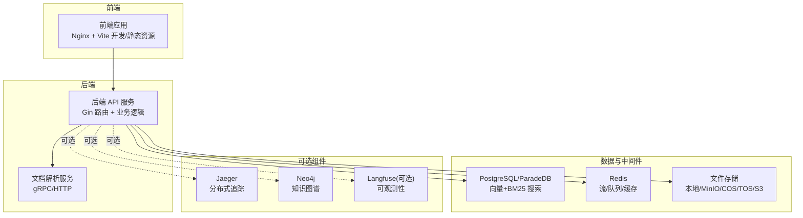
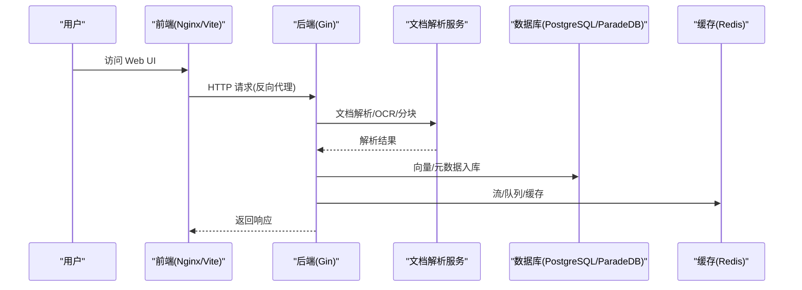
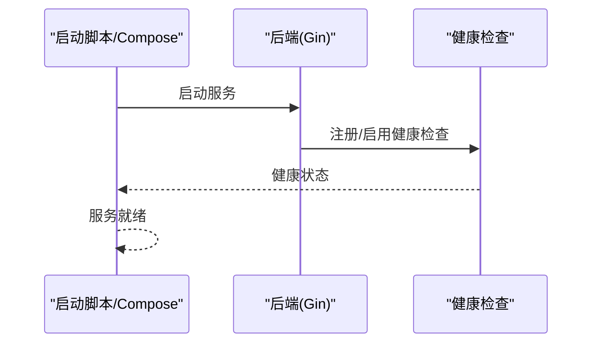
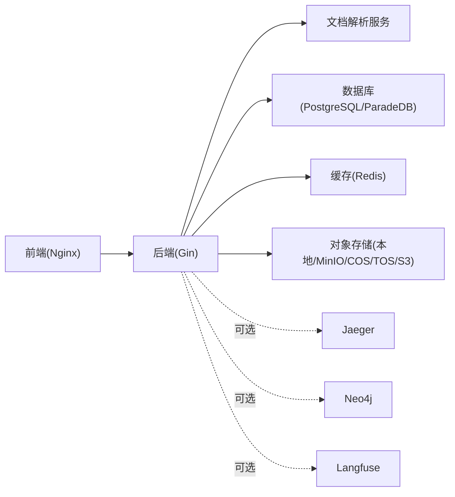

# 快速开始

<cite>
**本文引用的文件**
- [README.md](file://README.md)
- [docker-compose.yml](file://docker-compose.yml)
- [docker-compose.dev.yml](file://docker-compose.dev.yml)
- [cmd/server/main.go](file://cmd/server/main.go)
- [config/config.yaml](file://config/config.yaml)
- [Makefile](file://Makefile)
- [scripts/dev.sh](file://scripts/dev.sh)
- [scripts/start_all.sh](file://scripts/start_all.sh)
- [.env.example](file://.env.example)
- [frontend/Dockerfile](file://frontend/Dockerfile)
- [helm/Chart.yaml](file://helm/Chart.yaml)
- [helm/values.yaml](file://helm/values.yaml)
- [docs/开发指南.md](file://docs/开发指南.md)
</cite>

## 目录
1. [简介](#简介)
2. [项目结构](#项目结构)
3. [核心组件](#核心组件)
4. [架构总览](#架构总览)
5. [详细组件分析](#详细组件分析)
6. [依赖关系分析](#依赖关系分析)
7. [性能考虑](#性能考虑)
8. [故障排查指南](#故障排查指南)
9. [结论](#结论)
10. [附录](#附录)

## 简介
本指南面向初学者与一线运维/开发人员，帮助你在最短时间内完成 WeKnora 的安装、部署与本地开发。内容涵盖：
- 环境准备与前置条件
- Docker 一键部署与常用 Profile
- 本地开发模式与调试技巧
- 多种部署模式选择（本地、Docker、Kubernetes/Helm）
- 常见问题排查与解决
- 循序渐进的学习路径与命令示例

## 项目结构
WeKnora 采用前后端分离与多服务协作的架构，核心由后端 API、前端 UI、文档解析服务、数据库、缓存与可选的可观测性/图数据库等组成。项目提供 Docker Compose 与 Helm Chart 两种部署方式，并内置 Makefile 与脚本简化开发与运维。

图表来源
- [docker-compose.yml:1-613](file://docker-compose.yml#L1-L613)
- [frontend/Dockerfile:1-43](file://frontend/Dockerfile#L1-L43)

章节来源
- [README.md:226-287](file://README.md#L226-L287)
- [docker-compose.yml:1-613](file://docker-compose.yml#L1-L613)
- [frontend/Dockerfile:1-43](file://frontend/Dockerfile#L1-L43)

## 核心组件
- 后端 API 服务：基于 Gin 的 HTTP 服务，负责路由、鉴权、业务编排与对外 API。
- 文档解析服务：提供 gRPC/HTTP 接口，负责文档解析、OCR、分块与元数据抽取。
- 前端应用：基于 Nginx 提供静态资源，Vite 支持开发时热重载。
- 数据与中间件：PostgreSQL/ParadeDB（向量+BM25）、Redis（流/队列/缓存）、对象存储（本地/MinIO/COS/TOS/S3）。
- 可选组件：Jaeger（链路追踪）、Neo4j（知识图谱）、Langfuse（可观测性）。

章节来源
- [cmd/server/main.go:43-124](file://cmd/server/main.go#L43-L124)
- [docker-compose.yml:28-171](file://docker-compose.yml#L28-L171)
- [frontend/Dockerfile:25-43](file://frontend/Dockerfile#L25-L43)

## 架构总览
WeKnora 的架构强调“模块化、可替换、可观测”。后端通过依赖注入容器装配各子系统，前端通过 Nginx 提供静态资源与反向代理，文档解析服务通过 gRPC 与后端交互，数据库与缓存提供检索与流式能力，可选组件增强可观测性与知识图谱能力。

图表来源
- [docker-compose.yml:1-613](file://docker-compose.yml#L1-L613)
- [cmd/server/main.go:43-124](file://cmd/server/main.go#L43-L124)

## 详细组件分析

### 1) 安装与前置条件
- 必备工具
  - Docker 与 Docker Compose
  - Git
- 可选工具
  - Ollama（本地/远程）
  - Helm（Kubernetes 部署）

章节来源
- [README.md:228-232](file://README.md#L228-L232)

### 2) 一键 Docker 部署
- 步骤
  - 克隆仓库并复制环境变量模板为 .env
  - 使用 Docker Compose 启动核心服务
  - 可选启用 Profile（如 neo4j、minio、jaeger、langfuse 等）
- 访问地址
  - Web UI：http://localhost
  - 后端 API：http://localhost:8080
  - Jaeger UI：http://localhost:16686

章节来源
- [README.md:233-270](file://README.md#L233-L270)
- [docker-compose.yml:1-613](file://docker-compose.yml#L1-L613)

### 3) Docker Compose 配置详解
- 关键服务
  - 前端：Nginx 提供静态资源与反向代理，支持 MAX_FILE_SIZE_MB 等参数。
  - 后端：Gin 服务，挂载配置与技能目录，健康检查，可观测性与向量存储/对象存储等环境变量。
  - 文档解析：gRPC 服务，支持健康检查与文件大小限制。
  - 数据库：PostgreSQL/ParadeDB，持久化卷与健康检查。
  - 缓存：Redis，持久化卷与密码。
  - 可选：MinIO、Neo4j、Qdrant、Milvus、Weaviate、Jaeger、Langfuse。
- 环境变量
  - 通过 .env 与 docker-compose.yml 的环境段统一注入，覆盖默认值。
  - 常用变量包括：GIN_MODE、DB_DRIVER/DB_HOST/DB_PORT/DB_USER/DB_PASSWORD/DB_NAME、STORAGE_TYPE、RETRIEVE_DRIVER、STREAM_MANAGER_TYPE、JWT_SECRET、OLLAMA_BASE_URL、ENABLE_GRAPH_RAG、TZ、WEKNORA_LANGUAGE、MAX_FILE_SIZE_MB 等。

章节来源
- [docker-compose.yml:1-613](file://docker-compose.yml#L1-L613)
- [.env.example:1-437](file://.env.example#L1-L437)

### 4) 本地开发环境搭建
- 快速开发模式（推荐）
  - 启动基础设施：make dev-start 或 ./scripts/dev.sh start
  - 启动后端：make dev-app 或 ./scripts/dev.sh app（支持 Air 热重载）
  - 启动前端：make dev-frontend 或 ./scripts/dev.sh frontend
  - 查看状态/日志/停止：make dev-status/dev-logs/dev-stop
- 访问地址（开发模式）
  - 前端开发服务器：http://localhost:5173
  - 后端 API：http://localhost:8080
  - PostgreSQL/Redis/MinIO/Neo4j/Jaeger 等本地端口映射

章节来源
- [docs/开发指南.md:1-286](file://docs/开发指南.md#L1-L286)
- [scripts/dev.sh:105-362](file://scripts/dev.sh#L105-L362)
- [Makefile:305-328](file://Makefile#L305-L328)

### 5) 调试技巧
- 后端调试
  - 使用 IDE（VS Code/GoLand）连接本地运行的 Go 应用，设置环境变量（DB_HOST、DOCREADER_ADDR、MINIO_ENDPOINT、REDIS_ADDR、OTEL_EXPORTER_OTLP_ENDPOINT、NEO4J_URI 等）。
- 前端调试
  - 使用浏览器开发者工具，Vite 提供 Source Map。
- 日志与可观测性
  - 后端健康检查与日志级别；可选 Jaeger UI 查看链路；可选 Langfuse 观测调用与 Token 消耗。

章节来源
- [docs/开发指南.md:207-242](file://docs/开发指南.md#L207-L242)
- [docker-compose.yml:44-49](file://docker-compose.yml#L44-L49)

### 6) 多种部署模式选择
- 本地部署（单机）
  - 使用 scripts/start_all.sh 启动 Ollama 与 Docker 服务，适合快速体验与演示。
- Docker 部署
  - 使用 docker-compose.yml 与 .env，结合 Profile 启用可选组件。
- Kubernetes(Helm) 部署
  - 使用 helm/Chart.yaml 与 helm/values.yaml，支持 Ingress、Secrets、持久化与可选组件（MinIO、Neo4j、Qdrant、Jaeger 等）。

章节来源
- [scripts/start_all.sh:1-773](file://scripts/start_all.sh#L1-L773)
- [helm/Chart.yaml:1-27](file://helm/Chart.yaml#L1-L27)
- [helm/values.yaml:1-493](file://helm/values.yaml#L1-L493)

### 7) 配置文件模板与要点
- .env 示例
  - 包含 Gin 模式、时区、语言、禁用注册、Ollama 基础地址、数据库/向量存储/对象存储类型、流管理、JWT、文件大小限制、Agent Sandbox、Agent LLM 超时、APK 镜像源、DocReader 地址与传输方式、Weaviate/Neo4j/Tavily/OIDC 等。
- 前端 Dockerfile
  - 基于 Node 与 Nginx，支持 MAX_FILE_SIZE_MB 环境变量与入口脚本。
- 后端配置
  - config/config.yaml 提供服务、对话、知识库、提取等默认配置项，可在运行时通过环境变量覆盖。

章节来源
- [.env.example:1-437](file://.env.example#L1-L437)
- [frontend/Dockerfile:1-43](file://frontend/Dockerfile#L1-L43)
- [config/config.yaml:1-113](file://config/config.yaml#L1-L113)

### 8) 启动流程与健康检查
- 后端启动流程
  - 设置 Gin 模式 → 构建依赖注入容器 → 创建 HTTP 服务器 → 监听端口 → 信号处理与优雅关闭 → 资源清理。
- 健康检查
  - app 服务健康检查：/health
  - docreader 服务健康检查：gRPC 健康探针
  - postgres/redis 等服务健康检查：内置探针

图表来源
- [cmd/server/main.go:43-124](file://cmd/server/main.go#L43-L124)
- [docker-compose.yml:44-49](file://docker-compose.yml#L44-L49)

## 依赖关系分析
- 组件耦合
  - 后端与文档解析服务通过 gRPC/HTTP 交互；与数据库/缓存/对象存储通过配置驱动解耦。
  - 前端通过 Nginx 反向代理访问后端 API。
- 外部依赖
  - Docker 镜像、PostgreSQL/ParadeDB、Redis、MinIO/COS/TOS/S3、可选 Qdrant/Milvus/Weaviate/Neo4j/Jaeger/Langfuse。
- Profile 与可选组件
  - 通过 docker-compose.yml 的 profiles 控制启用范围，避免不必要的资源占用。

图表来源
- [docker-compose.yml:1-613](file://docker-compose.yml#L1-L613)

章节来源
- [docker-compose.yml:1-613](file://docker-compose.yml#L1-L613)

## 性能考虑
- 向量检索与并发
  - 通过 RETRIEVE_DRIVER 与 CONCURRENCY_POOL_SIZE 控制检索与并发，避免 429 错误。
- 文件大小与代理
  - MAX_FILE_SIZE_MB 控制上传与 gRPC/HTTP 限制，Nginx 反向代理与前端构建参数协同。
- 缓存与流
  - Redis 作为流/队列/缓存后端，合理设置 DB/Prefix 与容量。
- 可选组件
  - Neo4j/Qdrant/Milvus/Weaviate 等组件会增加资源消耗，按需启用。

章节来源
- [.env.example:211-213](file://.env.example#L211-L213)
- [frontend/Dockerfile:37-43](file://frontend/Dockerfile#L37-L43)
- [docker-compose.yml:95-124](file://docker-compose.yml#L95-L124)

## 故障排查指南
- 环境检查
  - 使用 scripts/start_all.sh --check 检查 Docker、Ollama、镜像、容器状态、磁盘与内存。
- 常见问题
  - Ollama 未启动/不可达：确认本地安装或远程地址配置，脚本会自动拉起或校验。
  - 容器启动失败：查看日志，检查 .env 与端口冲突；必要时清理数据卷。
  - 健康检查失败：检查服务依赖（数据库/缓存/解析服务）是否就绪。
  - CORS/代理问题：检查前端代理配置与后端跨域策略。
  - Agent Sandbox：确保沙箱镜像已拉取，Profile sandbox 已启用。
- 开发模式问题
  - dev-start 后端连接数据库失败：等待基础设施完全启动；检查 .env 与本地端口映射。
  - 前端热重载无效：确认 Vite 开发服务器运行与代理配置。

章节来源
- [scripts/start_all.sh:530-610](file://scripts/start_all.sh#L530-L610)
- [scripts/dev.sh:240-325](file://scripts/dev.sh#L240-L325)
- [docs/开发指南.md:261-286](file://docs/开发指南.md#L261-L286)

## 结论
通过本快速开始指南，你可以在本地快速完成 WeKnora 的安装与部署，并掌握 Docker 一键部署、本地开发模式与调试技巧。建议从 Docker 一键部署入手，熟悉系统后再切换到本地开发模式进行高频迭代，最终根据场景选择 Kubernetes/Helm 进行生产部署。

## 附录

### A. 快速命令清单
- 一键部署
  - git clone 与 cp .env.example .env
  - docker compose up -d
  - 可选 Profile：--profile neo4j/--profile minio/--profile jaeger/--profile langfuse
- 本地开发
  - make dev-start
  - make dev-app（新终端）
  - make dev-frontend（新终端）
  - make dev-stop
- Kubernetes(Helm)
  - helm install weknora ./helm -f helm/values.yaml

章节来源
- [README.md:233-270](file://README.md#L233-L270)
- [Makefile:305-328](file://Makefile#L305-L328)
- [helm/Chart.yaml:1-27](file://helm/Chart.yaml#L1-L27)

### B. 环境变量速查
- 基础
  - GIN_MODE、TZ、WEKNORA_LANGUAGE、DISABLE_REGISTRATION
- 数据库与存储
  - DB_DRIVER/DB_HOST/DB_PORT/DB_USER/DB_PASSWORD/DB_NAME、STORAGE_TYPE、LOCAL_STORAGE_BASE_DIR
- 检索与流
  - RETRIEVE_DRIVER、STREAM_MANAGER_TYPE、CONCURRENCY_POOL_SIZE
- 对象存储
  - MINIO_ENDPOINT/MINIO_ACCESS_KEY_ID/MINIO_SECRET_ACCESS_KEY/MINIO_BUCKET_NAME、COS_*、TOS_*、S3_*
- 可选组件
  - ENABLE_GRAPH_RAG、NEO4J_*、QDRANT_*、MILVUS_*、WEAVIATE_*、JAeger、Langfuse
- 文档解析与 Agent
  - DOCREADER_ADDR/DOCREADER_TRANSPORT、OLLAMA_BASE_URL、WEKNORA_SANDBOX_MODE/TIMEOUT/IMAGE、WEKNORA_AGENT_LLM_TIMEOUT
- 前端与代理
  - FRONTEND_PORT、APP_HOST/APP_PORT/APP_BACKEND_PORT/APP_SCHEME、MAX_FILE_SIZE_MB

章节来源
- [.env.example:1-437](file://.env.example#L1-L437)