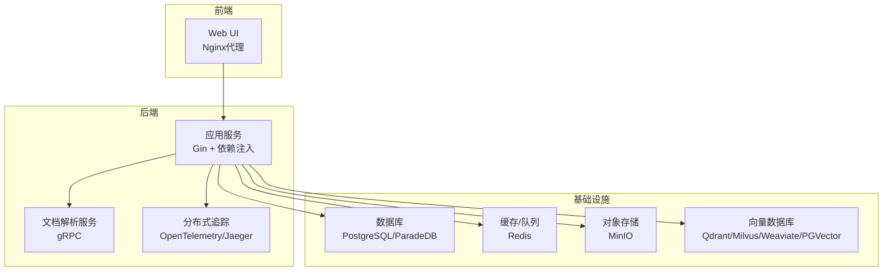
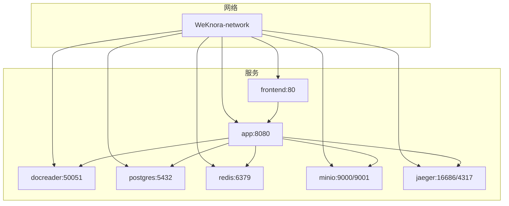
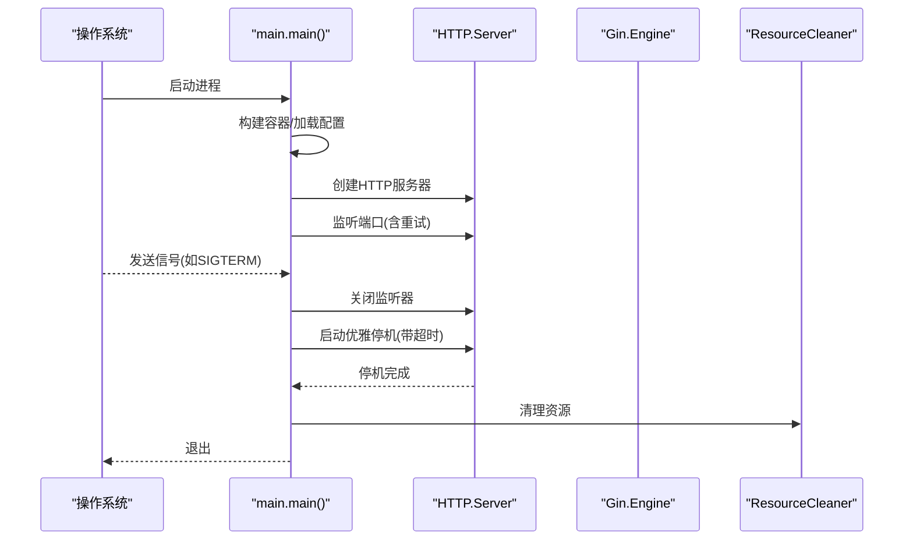
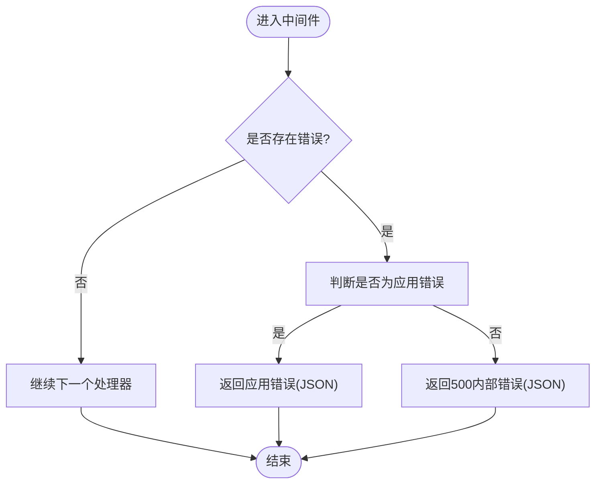
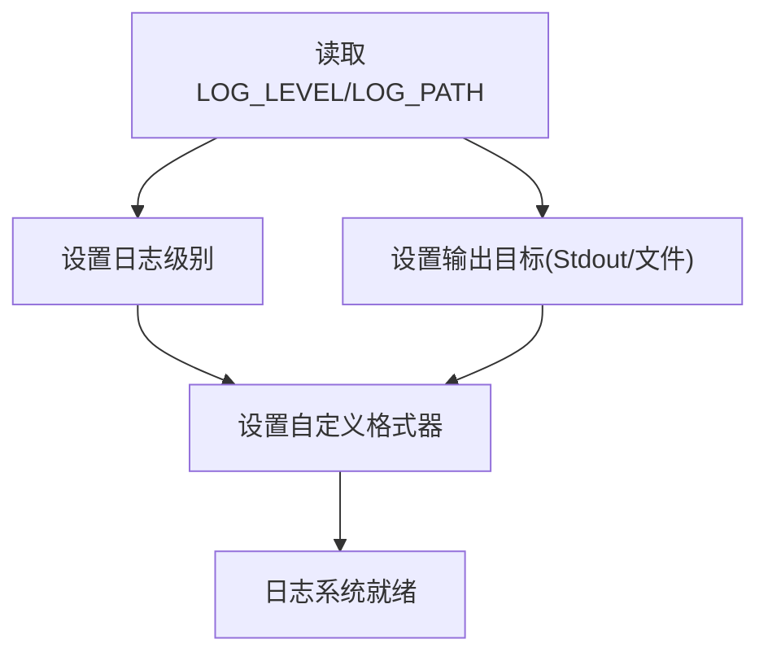
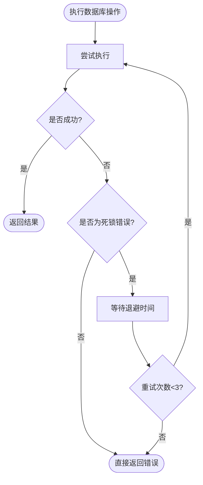
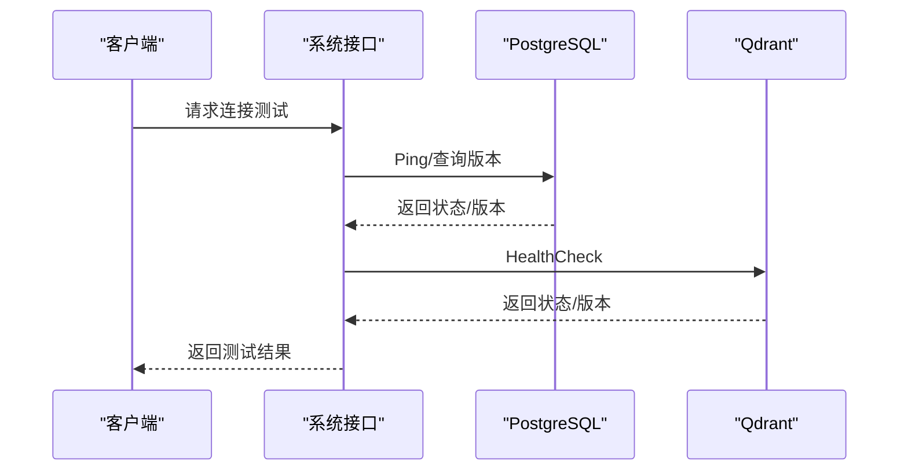
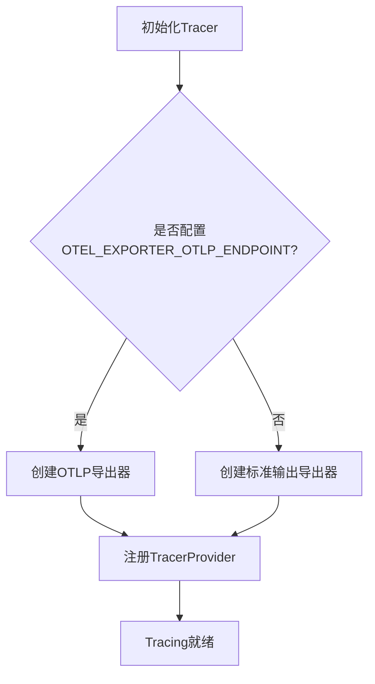
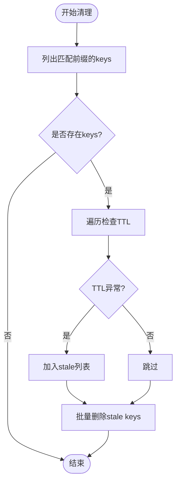
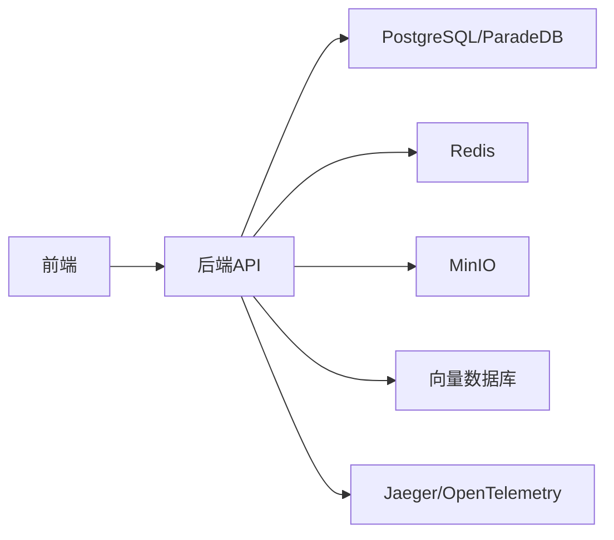

# 故障排除与FAQ

<cite>
**本文引用的文件**
- [README.md](file://README.md)
- [常见问题.md](file://docs/wiki/运维排障/常见问题.md)
- [docker-compose.yml](file://docker-compose.yml)
- [values.yaml](file://helm/values.yaml)
- [config.yaml](file://config/config.yaml)
- [main.go](file://cmd/server/main.go)
- [logger.go](file://internal/logger/logger.go)
- [error_handler.go](file://internal/middleware/error_handler.go)
- [errors.go](file://internal/errors/errors.go)
- [db_retry.go](file://internal/common/db_retry.go)
- [vectorstore_healthcheck.go](file://internal/application/service/vectorstore_healthcheck.go)
- [system.go](file://internal/handler/system.go)
- [migrate.sh](file://scripts/migrate.sh)
- [init.go](file://internal/tracing/init.go)
- [debug.go](file://internal/utils/debug.go)
</cite>

## 目录
1. [简介](#简介)
2. [项目结构](#项目结构)
3. [核心组件](#核心组件)
4. [架构总览](#架构总览)
5. [详细组件分析](#详细组件分析)
6. [依赖关系分析](#依赖关系分析)
7. [性能考虑](#性能考虑)
8. [故障排除指南](#故障排除指南)
9. [结论](#结论)
10. [附录](#附录)

## 简介
本文件面向用户与运维人员，提供WeKnora的全面故障排除与常见问题解答（FAQ）。内容覆盖部署与配置问题、数据库连接问题、网络通信问题、性能问题分析与优化、集成与第三方服务连接问题、API调用异常处理、调试工具与日志分析、性能监控方法以及常见错误代码的含义与修复步骤。

## 项目结构
WeKnora采用模块化架构，后端以Go实现，前端为Web应用，通过Docker与Kubernetes进行编排。核心服务包括应用服务、文档解析服务、数据库（PostgreSQL）、缓存（Redis）、对象存储（MinIO）、分布式追踪（Jaeger）等。系统支持Docker Compose与Helm两种部署方式，并提供迁移脚本与健康检查接口。

图表来源
- [docker-compose.yml:1-613](file://docker-compose.yml#L1-L613)
- [values.yaml:1-493](file://helm/values.yaml#L1-L493)

章节来源
- [README.md:226-284](file://README.md#L226-L284)
- [docker-compose.yml:1-613](file://docker-compose.yml#L1-L613)
- [values.yaml:1-493](file://helm/values.yaml#L1-L493)

## 核心组件
- 应用服务：负责HTTP路由、业务逻辑、中间件与错误处理，支持优雅停机与信号处理。
- 文档解析服务：提供gRPC接口，负责文档解析与图像处理。
- 数据库：默认使用PostgreSQL（ParadeDB），支持多种向量数据库后端。
- 缓存与队列：Redis用于流式管理、任务协调与速率限制。
- 对象存储：MinIO提供S3兼容的对象存储能力。
- 分布式追踪：OpenTelemetry集成，支持导出至Jaeger。
- 配置与日志：通过环境变量与配置文件控制运行行为，日志支持文件落盘与彩色输出。

章节来源
- [main.go:43-124](file://cmd/server/main.go#L43-L124)
- [docker-compose.yml:28-171](file://docker-compose.yml#L28-L171)
- [logger.go:140-184](file://internal/logger/logger.go#L140-L184)
- [init.go:31-95](file://internal/tracing/init.go#L31-L95)

## 架构总览
下图展示WeKnora在Docker环境中的典型拓扑与交互关系，涵盖服务发现、健康检查、端口映射与依赖关系。

图表来源
- [docker-compose.yml:1-613](file://docker-compose.yml#L1-L613)

章节来源
- [docker-compose.yml:1-613](file://docker-compose.yml#L1-L613)

## 详细组件分析

### 应用服务与优雅停机
应用服务通过Gin构建HTTP服务器，支持根据环境变量设置运行模式，并在启动时构建依赖注入容器。服务器监听端口并支持多次重试绑定，随后等待系统信号触发优雅停机：释放监听器、执行超时关闭、清理资源并退出。

图表来源
- [main.go:62-118](file://cmd/server/main.go#L62-L118)

章节来源
- [main.go:43-124](file://cmd/server/main.go#L43-L124)

### 错误处理与统一响应
应用通过中间件捕获错误，区分应用定义的错误与未知错误，返回标准化的JSON响应。应用错误包含业务错误码、消息与详情，未知错误统一返回内部服务器错误。

图表来源
- [error_handler.go:11-46](file://internal/middleware/error_handler.go#L11-L46)
- [errors.go:42-60](file://internal/errors/errors.go#L42-L60)

章节来源
- [error_handler.go:11-46](file://internal/middleware/error_handler.go#L11-L46)
- [errors.go:11-40](file://internal/errors/errors.go#L11-L40)

### 日志系统与落盘
日志系统支持从环境变量动态调整日志级别与输出目标，可在非TTY环境禁用ANSI颜色，同时将日志输出到标准输出与文件（滚动日志）。提供便捷的上下文字段注入与请求ID传播。

图表来源
- [logger.go:145-184](file://internal/logger/logger.go#L145-L184)

章节来源
- [logger.go:140-184](file://internal/logger/logger.go#L140-L184)

### 数据库死锁重试机制
针对MySQL死锁（错误码1213）场景，提供带指数退避的重试机制，最多重试3次，避免并发事务冲突导致的失败扩大。

图表来源
- [db_retry.go:13-35](file://internal/common/db_retry.go#L13-L35)

章节来源
- [db_retry.go:11-46](file://internal/common/db_retry.go#L11-L46)

### 向量数据库健康检查
系统提供多种向量数据库的连接测试接口，包括PostgreSQL（含版本探测）、Qdrant（版本探测）等，便于在配置变更后快速验证连接有效性。

图表来源
- [vectorstore_healthcheck.go:108-154](file://internal/application/service/vectorstore_healthcheck.go#L108-L154)

章节来源
- [vectorstore_healthcheck.go:108-154](file://internal/application/service/vectorstore_healthcheck.go#L108-L154)

### 分布式追踪与可观测性
系统通过OpenTelemetry初始化追踪器，支持将span导出至Jaeger（OTLP gRPC），或在未配置导出端点时输出到标准输出。提供全局tracer获取与上下文封装。

图表来源
- [init.go:31-95](file://internal/tracing/init.go#L31-L95)

章节来源
- [init.go:31-95](file://internal/tracing/init.go#L31-L95)

### Redis任务清理与状态检查（调试工具）
提供清理过期或异常运行中的任务键、检查运行中任务与进度键状态的工具函数，便于在复杂异步任务场景下进行维护与排错。

图表来源
- [debug.go:11-49](file://internal/utils/debug.go#L11-L49)

章节来源
- [debug.go:11-90](file://internal/utils/debug.go#L11-L90)

## 依赖关系分析
- 服务耦合：前端依赖后端API；后端依赖数据库、缓存、对象存储与文档解析服务；追踪组件贯穿全链路。
- 外部依赖：PostgreSQL/ParadeDB、Redis、MinIO、Qdrant/Milvus/Weaviate、Jaeger、OpenTelemetry。
- 配置耦合：Docker Compose与Helm values共享大量环境变量，确保部署一致性。

图表来源
- [docker-compose.yml:1-613](file://docker-compose.yml#L1-L613)
- [values.yaml:1-493](file://helm/values.yaml#L1-L493)

章节来源
- [docker-compose.yml:1-613](file://docker-compose.yml#L1-L613)
- [values.yaml:1-493](file://helm/values.yaml#L1-L493)

## 性能考虑
- 并发与资源：合理设置并发池大小、资源请求与限制，避免过度占用CPU与内存。
- 缓存与队列：利用Redis进行任务协调与速率限制，减少重复计算与阻塞。
- 向量检索：根据数据规模选择合适的向量数据库与索引策略，定期维护与版本升级。
- 日志与追踪：在生产环境中适度降低日志级别与采样率，避免I/O与CPU开销过大。
- 数据库：启用死锁重试与连接池优化，避免热点表争用。

[本节为通用指导，无需特定文件引用]

## 故障排除指南

### 一、部署与启动问题
- 服务无法启动或端口占用
  - 现象：启动报错或端口被占用。
  - 排查：检查端口映射与防火墙；使用重试绑定逻辑；查看健康检查失败原因。
  - 参考：[docker-compose.yml:44-49](file://docker-compose.yml#L44-L49)
- Docker Compose服务依赖未就绪
  - 现象：应用容器启动但健康检查失败。
  - 排查：确认数据库、缓存、文档解析服务健康；查看依赖条件与启动顺序。
  - 参考：[docker-compose.yml:148-154](file://docker-compose.yml#L148-L154)
- Kubernetes部署资源不足
  - 现象：Pod频繁重启或启动缓慢。
  - 排查：调整requests/limits、探针参数与节点亲和性。
  - 参考：[values.yaml:68-77](file://helm/values.yaml#L68-L77)

章节来源
- [docker-compose.yml:44-49](file://docker-compose.yml#L44-L49)
- [docker-compose.yml:148-154](file://docker-compose.yml#L148-L154)
- [values.yaml:68-77](file://helm/values.yaml#L68-L77)

### 二、Docker配置问题
- 环境变量缺失或拼写错误
  - 现象：服务启动后功能异常或连接失败。
  - 排查：核对.env与Compose/Helm中的变量；特别关注数据库、存储、向量库、追踪相关变量。
  - 参考：[docker-compose.yml:61-147](file://docker-compose.yml#L61-L147)
- 网络隔离与端口映射
  - 现象：容器内服务可达但外部不可达。
  - 排查：检查networks与ports映射；确认容器间通信与外网访问策略。
  - 参考：[docker-compose.yml:596-613](file://docker-compose.yml#L596-L613)
- 健康检查失败
  - 现象：容器处于unhealthy状态。
  - 排查：查看健康检查命令与超时设置；逐步定位具体依赖服务。
  - 参考：[docker-compose.yml:44-49](file://docker-compose.yml#L44-L49)

章节来源
- [docker-compose.yml:61-147](file://docker-compose.yml#L61-L147)
- [docker-compose.yml:596-613](file://docker-compose.yml#L596-L613)

### 三、数据库连接问题
- 连接拒绝或认证失败
  - 现象：应用日志出现连接失败或认证错误。
  - 排查：检查DB_HOST/PORT/USER/PASSWORD/NAME；确认网络可达与防火墙放行；使用健康检查接口验证。
  - 参考：[vectorstore_healthcheck.go:108-124](file://internal/application/service/vectorstore_healthcheck.go#L108-L124)
- 死锁与并发冲突
  - 现象：事务执行失败且提示死锁。
  - 排查：启用死锁重试；优化事务粒度与锁顺序；避免热点更新。
  - 参考：[db_retry.go:13-35](file://internal/common/db_retry.go#L13-L35)
- 迁移失败或版本不一致
  - 现象：启动时报迁移错误或版本异常。
  - 排查：使用迁移脚本检查/回滚/强制版本；确保数据库URL与SSL模式正确。
  - 参考：[migrate.sh:26-120](file://scripts/migrate.sh#L26-L120)

章节来源
- [vectorstore_healthcheck.go:108-124](file://internal/application/service/vectorstore_healthcheck.go#L108-L124)
- [db_retry.go:13-35](file://internal/common/db_retry.go#L13-L35)
- [migrate.sh:26-120](file://scripts/migrate.sh#L26-L120)

### 四、网络通信问题
- SSRF限制与白名单
  - 现象：访问内部服务或受限域名失败。
  - 排查：配置SSRF_WHITELIST允许精确域名、通配域名、IPv4/IPv6/CIDR；谨慎放宽生产环境。
  - 参考：[常见问题.md:80-88](file://docs/wiki/运维排障/常见问题.md#L80-L88)
- 外部服务不可达
  - 现象：调用第三方API或搜索引擎失败。
  - 排查：检查代理、DNS、防火墙；确认端点与凭据；使用健康检查接口验证。
  - 参考：[system.go:574-592](file://internal/handler/system.go#L574-L592)

章节来源
- [常见问题.md:80-88](file://docs/wiki/运维排障/常见问题.md#L80-L88)
- [system.go:574-592](file://internal/handler/system.go#L574-L592)

### 五、性能问题与优化
- CPU使用率高
  - 现象：LLM推理或向量检索耗时长。
  - 排查：降低并发池大小、优化检索阈值与top_k；启用更高效的向量后端；减少不必要的日志与追踪。
  - 参考：[config.yaml:9-39](file://config/config.yaml#L9-L39)
- 内存泄漏与GC压力大
  - 现象：长时间运行后内存持续增长。
  - 排查：检查大对象缓存、流式处理与资源释放；使用调试工具清理异常任务键；优化批处理大小。
  - 参考：[debug.go:11-49](file://internal/utils/debug.go#L11-L49)
- I/O瓶颈
  - 现象：磁盘吞吐低或对象存储延迟高。
  - 排查：调整存储类型与桶权限；启用压缩与分片；优化文件大小限制。
  - 参考：[docker-compose.yml:110-147](file://docker-compose.yml#L110-L147)

章节来源
- [config.yaml:9-39](file://config/config.yaml#L9-L39)
- [debug.go:11-49](file://internal/utils/debug.go#L11-L49)
- [docker-compose.yml:110-147](file://docker-compose.yml#L110-L147)

### 六、集成与第三方服务问题
- 对象存储（MinIO）连接异常
  - 现象：图片显示无效或上传失败。
  - 排查：确认MinIO服务健康、桶权限与公共端点；必要时自动创建桶。
  - 参考：[常见问题.md:47-54](file://docs/wiki/运维排障/常见问题.md#L47-L54)
- 向量数据库后端切换
  - 现象：检索效果差或连接失败。
  - 排查：使用健康检查接口验证；调整集合名与TLS设置；检查驱动与版本兼容性。
  - 参考：[vectorstore_healthcheck.go:126-154](file://internal/application/service/vectorstore_healthcheck.go#L126-L154)
- MCP工具连接不稳定
  - 现象：工具调用失败或断连。
  - 排查：检查MCP服务可达性与认证；使用前端测试结果界面验证工具清单。
  - 参考：[常见问题.md:90-107](file://docs/wiki/运维排障/常见问题.md#L90-L107)

章节来源
- [常见问题.md:47-54](file://docs/wiki/运维排障/常见问题.md#L47-L54)
- [vectorstore_healthcheck.go:126-154](file://internal/application/service/vectorstore_healthcheck.go#L126-L154)
- [常见问题.md:90-107](file://docs/wiki/运维排障/常见问题.md#L90-L107)

### 七、API调用异常处理
- 统一错误响应
  - 现象：接口返回错误码与消息。
  - 排查：根据错误码定位业务域（通用/租户/Agent等）；查看中间件错误处理逻辑。
  - 参考：[error_handler.go:11-46](file://internal/middleware/error_handler.go#L11-L46), [errors.go:11-40](file://internal/errors/errors.go#L11-L40)
- 认证与鉴权
  - 现象：401/403错误。
  - 排查：确认Bearer Token或X-API-Key；检查租户状态与权限。
  - 参考：[main.go:14-23](file://cmd/server/main.go#L14-L23)

章节来源
- [error_handler.go:11-46](file://internal/middleware/error_handler.go#L11-L46)
- [errors.go:11-40](file://internal/errors/errors.go#L11-L40)
- [main.go:14-23](file://cmd/server/main.go#L14-L23)

### 八、调试工具与日志分析
- 日志级别与输出
  - 现象：日志过多或过少。
  - 排查：设置LOG_LEVEL与LOG_PATH；在容器中禁用颜色输出；结合请求ID定位问题。
  - 参考：[logger.go:145-184](file://internal/logger/logger.go#L145-L184)
- 追踪与可观测性
  - 现象：链路不完整或导出失败。
  - 排查：配置OTEL_EXPORTER_OTLP_ENDPOINT；确认Jaeger端口映射与网络可达。
  - 参考：[init.go:31-95](file://internal/tracing/init.go#L31-L95)
- 异步任务清理
  - 现象：任务堆积或状态异常。
  - 排查：使用调试工具清理stale keys；检查running/progress键状态。
  - 参考：[debug.go:11-90](file://internal/utils/debug.go#L11-L90)

章节来源
- [logger.go:145-184](file://internal/logger/logger.go#L145-L184)
- [init.go:31-95](file://internal/tracing/init.go#L31-L95)
- [debug.go:11-90](file://internal/utils/debug.go#L11-L90)

### 九、常见错误代码与修复步骤
- 通用错误（1000-1999）
  - 示例：400错误（请求无效）、401错误（未授权）、403错误（禁止）、404错误（未找到）、409错误（冲突）、429错误（请求过多）、500错误（内部错误）、503错误（服务不可用）、408/504错误（超时）。
  - 修复：校验请求参数与鉴权头；检查租户状态与配额；优化上游服务与超时配置。
  - 参考：[errors.go:11-40](file://internal/errors/errors.go#L11-L40)
- 租户相关错误（2000-2099）
  - 示例：租户不存在、租户已存在、租户停用、租户名称必填、租户状态非法。
  - 修复：确认租户ID与状态；在管理界面创建/启用租户；检查API密钥归属。
  - 参考：[errors.go:127-153](file://internal/errors/errors.go#L127-L153)
- Agent相关错误（2100-2199）
  - 示例：缺少思考模型、未选择允许工具、最大迭代次数或温度参数非法。
  - 修复：在Agent配置中完善模型与工具；校验参数范围。
  - 参考：[errors.go:154-185](file://internal/errors/errors.go#L154-L185)

章节来源
- [errors.go:11-40](file://internal/errors/errors.go#L11-L40)
- [errors.go:127-153](file://internal/errors/errors.go#L127-L153)
- [errors.go:154-185](file://internal/errors/errors.go#L154-L185)

## 结论
通过本指南，用户与运维人员可以系统地定位与解决WeKnora在部署、数据库、网络、性能与集成方面的常见问题。建议在生产环境中：
- 明确日志级别与落盘策略；
- 合理配置并发与资源限制；
- 使用健康检查与迁移脚本保障稳定性；
- 利用追踪与调试工具提升可观测性与可维护性。

[本节为总结性内容，无需特定文件引用]

## 附录
- 快速启动与停止脚本：参见常见问题中的服务启停示例。
- 配置参考：参考Docker Compose与Helm values中的环境变量与服务配置。
- API安全：遵循认证与鉴权要求，避免在日志中泄露敏感信息。

章节来源
- [常见问题.md:16-24](file://docs/wiki/运维排障/常见问题.md#L16-L24)
- [docker-compose.yml:61-147](file://docker-compose.yml#L61-L147)
- [values.yaml:87-106](file://helm/values.yaml#L87-L106)