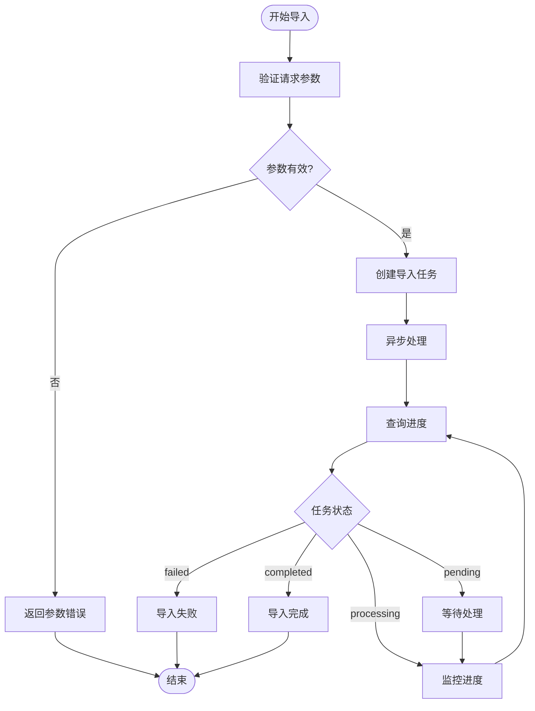

# 故障排除与FAQ

<cite>
**本文引用的文件**
- [README.md](file://README.md)
- [常见问题.md](file://docs/wiki/运维排障/常见问题.md)
- [QA.md](file://docs/QA.md)
- [faq.md](file://docs/api/faq.md)
- [docker-compose.yml](file://docker-compose.yml)
- [values.yaml](file://helm/values.yaml)
- [config.yaml](file://config/config.yaml)
- [main.go](file://cmd/server/main.go)
- [logger.go](file://internal/logger/logger.go)
- [error_handler.go](file://internal/middleware/error_handler.go)
- [errors.go](file://internal/errors/errors.go)
- [db_retry.go](file://internal/common/db_retry.go)
- [vectorstore_healthcheck.go](file://internal/application/service/vectorstore_healthcheck.go)
- [system.go](file://internal/handler/system.go)
- [faq.go](file://internal/handler/faq.go)
- [knowledgebase_search_faq.go](file://internal/application/service/knowledgebase_search_faq.go)
- [faq.go](file://internal/types/faq.go)
- [merge_faq.go](file://internal/application/service/chat_pipeline/merge_faq.go)
- [000008_migrate_untagged_faq.up.sql](file://migrations/versioned/000008_migrate_untagged_faq.up.sql)
- [000009_add_last_faq_import_result.up.sql](file://migrations/versioned/000009_add_last_faq_import_result.up.sql)
- [migrate.sh](file://scripts/migrate.sh)
- [init.go](file://internal/tracing/init.go)
- [debug.go](file://internal/utils/debug.go)
</cite>

## 更新摘要
**所做更改**
- 新增全面的FAQ管理API文档和故障排除指南
- 扩展了中文文档覆盖率，包含详细的FAQ导入导出和搜索功能
- 增强了部署问题诊断和解决方案
- 新增FAQ知识库的专门故障排除章节
- 完善了配置错误和数据库连接问题的排查流程

## 目录
1. [简介](#简介)
2. [FAQ管理API故障排除](#faq管理api故障排除)
3. [FAQ知识库故障排除](#faq知识库故障排除)
4. [部署与启动问题](#部署与启动问题)
5. [Docker配置问题](#docker配置问题)
6. [数据库连接问题](#数据库连接问题)
7. [网络通信问题](#网络通信问题)
8. [性能问题与优化](#性能问题与优化)
9. [集成与第三方服务问题](#集成与第三方服务问题)
10. [API调用异常处理](#api调用异常处理)
11. [调试工具与日志分析](#调试工具与日志分析)
12. [常见错误代码与修复步骤](#常见错误代码与修复步骤)
13. [结论](#结论)
14. [附录](#附录)

## 简介
本文件面向用户与运维人员，提供WeKnora的全面故障排除与常见问题解答（FAQ）。内容覆盖部署与配置问题、数据库连接问题、网络通信问题、性能问题分析与优化、集成与第三方服务连接问题、API调用异常处理、调试工具与日志分析、性能监控方法以及常见错误代码的含义与修复步骤。特别新增了完整的FAQ管理API故障排除指南和FAQ知识库专门的故障排除章节。

## FAQ管理API故障排除

### FAQ导入功能故障排除
FAQ批量导入功能是WeKnora的核心特性之一，但也是最常见的故障点。以下是详细的故障排除步骤：

#### 导入任务状态监控


**图表来源**
- [faq.go:157-186](file://internal/handler/faq.go#L157-L186)
- [faq.go:547-562](file://internal/handler/faq.go#L547-L562)

#### 常见导入错误及解决方案

**1. 重复问题导入失败**
- **现象**：导入任务完成后显示部分失败，提示"标准问与已有FAQ重复"
- **排查**：检查FAQ导入进度接口，查看失败条目的具体原因
- **解决方案**：使用批量更新接口更新现有FAQ，或在导入时选择"替换"模式

**2. 相似问题格式错误**
- **现象**：相似问题数组格式不正确导致验证失败
- **排查**：检查相似问题数组是否为空或包含重复项
- **解决方案**：确保相似问题数组格式正确，去重后提交

**3. 答案内容为空**
- **现象**：答案数组为空导致导入失败
- **排查**：检查答案数组是否包含有效内容
- **解决方案**：至少提供一个有效的答案内容

**章节来源**
- [faq.go:157-186](file://internal/handler/faq.go#L157-L186)
- [faq.go:547-562](file://internal/handler/faq.go#L547-L562)
- [faq.go:358-409](file://internal/handler/faq.go#L358-L409)

### FAQ搜索功能故障排除
FAQ搜索功能支持多种搜索模式和过滤条件，以下是常见的搜索问题及解决方案：

#### 搜索参数验证
- **查询文本**：确保查询文本长度适中，避免过短或过长
- **阈值设置**：vector_threshold建议设置在0.3-0.7之间
- **返回数量**：match_count最大不超过200
- **标签过滤**：first_priority_tag_ids和second_priority_tag_ids必须为有效的标签ID列表

#### 搜索结果质量优化
- **负向问题过滤**：确保FAQ条目正确设置了负向问题，避免无关结果
- **相似问题匹配**：检查相似问题是否准确设置，提高匹配精度
- **推荐标记**：使用only_recommended参数仅搜索推荐的FAQ条目

**章节来源**
- [faq.go:424-456](file://internal/handler/faq.go#L424-L456)
- [knowledgebase_search_faq.go:16-48](file://internal/application/service/knowledgebase_search_faq.go#L16-L48)

### FAQ导出功能故障排除
FAQ导出功能支持将知识库中的所有FAQ条目导出为CSV文件，以下是常见问题的解决方案：

#### 导出文件格式问题
- **编码问题**：导出文件包含BOM头，确保Excel能够正确识别UTF-8编码
- **字段完整性**：检查导出的CSV文件是否包含所有必要的字段
- **文件大小**：对于大量FAQ条目的知识库，导出可能需要较长时间

#### 导出权限问题
- **访问权限**：确保用户具有查看FAQ条目的权限
- **知识库访问**：检查知识库的共享设置和访问控制

**章节来源**
- [faq.go:470-492](file://internal/handler/faq.go#L470-L492)

## FAQ知识库故障排除

### FAQ知识库类型配置问题
FAQ知识库与普通文档知识库在配置和使用上有显著差异，以下是常见配置问题的排查步骤：

#### 知识库类型识别
```mermaid
graph TB
subgraph "知识库类型"
FAQ["FAQ知识库"]
DOC["文档知识库"]
END
subgraph "配置差异"
FAQ --> FAQConfig["FAQ专用配置"]
DOC --> DocConfig["文档专用配置"]
END
subgraph "功能差异"
FAQ --> FAQFeatures["相似问题<br/>负向问题<br/>答案策略"]
DOC --> DocFeatures["文档解析<br/>章节提取<br/>引用标注"]
END
```

**图表来源**
- [faq.go:16-38](file://internal/handler/faq.go#L16-L38)
- [faq.go:228-252](file://internal/handler/faq.go#L228-L252)

#### FAQ元数据结构问题
FAQ条目的元数据包含标准问题、相似问题、负向问题和答案等多个字段，以下是常见问题的解决方案：

**1. 标准问题重复**
- **现象**：创建FAQ条目时提示标准问题重复
- **排查**：检查知识库中是否已存在相同的标准问题
- **解决方案**：修改标准问题或使用相似问题功能

**2. 相似问题格式错误**
- **现象**：相似问题数组格式不正确
- **排查**：检查相似问题是否为空或包含重复项
- **解决方案**：确保相似问题格式正确，去重后提交

**3. 负向问题匹配问题**
- **现象**：负向问题设置后搜索结果仍然包含相关内容
- **排查**：检查负向问题是否正确设置，查询文本是否与负向问题完全匹配
- **解决方案**：确保负向问题设置准确，查询文本格式正确

**章节来源**
- [faq.go:16-38](file://internal/handler/faq.go#L16-L38)
- [faq.go:228-252](file://internal/handler/faq.go#L228-L252)
- [faq.go:138-174](file://internal/types/faq.go#L138-L174)

### FAQ导入进度监控
FAQ导入任务支持异步处理，用户可以通过进度接口监控导入状态：

#### 进度状态说明
- **pending**：任务已创建但尚未开始处理
- **processing**：任务正在处理中
- **completed**：任务处理完成
- **failed**：任务处理失败

#### 进度查询接口
```bash
curl --location 'http://localhost:8080/api/v1/faq/import/progress/task-00000001' \
--header 'X-API-Key: sk-vQHV2NZI_LK5W7wHQvH3yGYExX8YnhaHwZipUYbiZKCYJbBQ' \
--header 'Content-Type: application/json'
```

**章节来源**
- [faq.go:547-562](file://internal/handler/faq.go#L547-L562)

## 部署与启动问题

### 服务启动失败排查
服务启动失败是最常见的部署问题，以下是详细的排查步骤：

#### 启动日志分析
```bash
# 查看应用服务日志
docker compose logs -f app

# 查看文档解析服务日志  
docker compose logs -f docreader

# 查看数据库服务日志
docker compose logs -f postgres
```

#### 端口冲突排查
- **现象**：服务启动时报端口占用错误
- **排查**：检查8080端口是否被其他进程占用
- **解决方案**：修改docker-compose.yml中的端口映射或停止占用端口的进程

#### 依赖服务启动顺序
- **数据库服务**：PostgreSQL必须先于应用服务启动
- **缓存服务**：Redis必须先于应用服务启动
- **对象存储**：MinIO必须先于应用服务启动

**章节来源**
- [常见问题.md:10-14](file://docs/wiki/运维排障/常见问题.md#L10-L14)
- [常见问题.md:16-22](file://docs/wiki/运维排障/常见问题.md#L16-L22)

### 数据库初始化问题
数据库初始化失败可能导致服务无法正常启动，以下是常见问题的解决方案：

#### 数据库连接问题
- **检查数据库URL格式**：确保DATABASE_URL格式正确
- **验证数据库凭据**：检查用户名、密码、数据库名是否正确
- **确认网络连通性**：确保应用服务能够访问数据库服务

#### 数据库迁移失败
- **检查迁移脚本**：查看migrate.sh脚本的执行结果
- **验证数据库权限**：确保数据库用户具有足够的权限执行迁移
- **检查数据库版本**：确认数据库版本满足WeKnora的要求

**章节来源**
- [migrate.sh:26-120](file://scripts/migrate.sh#L26-L120)

## Docker配置问题

### 环境变量配置错误
环境变量配置错误是Docker部署中最常见的问题，以下是常见错误及解决方案：

#### 模型配置问题
- **INIT_LLM_MODEL_NAME**：必须设置有效的LLM模型名称
- **INIT_EMBEDDING_MODEL_NAME**：必须设置有效的嵌入模型名称
- **INIT_EMBEDDING_MODEL_DIMENSION**：必须设置正确的向量维度
- **BASE_URL和API_KEY**：如果使用远程API，必须正确配置

#### 存储配置问题
- **MINIO_ACCESS_KEY_ID和MINIO_SECRET_ACCESS_KEY**：必须设置有效的MinIO凭据
- **MINIO_PUBLIC_ENDPOINT**：必须设置正确的MinIO访问端点
- **MINIO_BUCKET_NAME**：Bucket名称不能包含特殊字符

#### 向量数据库配置问题
- **VECTOR_STORE_TYPE**：必须设置有效的向量数据库类型
- **VECTOR_STORE_CONFIG**：必须设置正确的向量数据库配置
- **向量维度**：必须与嵌入模型的维度匹配

**章节来源**
- [常见问题.md:26-58](file://docs/wiki/运维排障/常见问题.md#L26-L58)

### 网络配置问题
Docker网络配置错误会导致服务间通信失败，以下是常见问题的解决方案：

#### 网络隔离问题
- **检查网络配置**：确保所有服务都在同一个Docker网络中
- **验证服务发现**：确保服务名称可以正确解析
- **检查端口映射**：确保必要的端口已经正确映射

#### DNS解析问题
- **检查DNS配置**：确保容器能够正确解析外部域名
- **验证代理设置**：如果使用代理，确保代理配置正确
- **测试网络连通性**：使用ping或curl测试网络连通性

**章节来源**
- [docker-compose.yml:596-613](file://docker-compose.yml#L596-L613)

## 数据库连接问题

### 数据库连接池问题
数据库连接池配置不当会导致连接超时和性能问题，以下是常见问题的解决方案：

#### 连接池参数调优
- **最大连接数**：根据应用负载调整最大连接数
- **连接超时时间**：设置合理的连接超时时间
- **空闲连接数**：保持适当的空闲连接数
- **连接生命周期**：设置合理的连接生命周期

#### 连接重试机制
- **死锁重试**：启用MySQL死锁重试机制
- **网络异常重试**：处理网络异常导致的连接失败
- **超时重试**：处理超时导致的查询失败

**章节来源**
- [db_retry.go:13-35](file://internal/common/db_retry.go#L13-L35)

### 数据库性能问题
数据库性能问题会影响整个系统的响应速度，以下是常见问题的诊断和解决方案：

#### 查询性能优化
- **索引优化**：为常用查询字段创建适当的索引
- **查询计划分析**：使用EXPLAIN分析慢查询
- **批量操作**：使用批量插入和更新减少数据库往返

#### 连接池监控
- **连接使用率**：监控连接池的使用情况
- **等待时间**：监控连接等待时间
- **连接泄漏**：检查是否存在连接泄漏问题

**章节来源**
- [vectorstore_healthcheck.go:108-154](file://internal/application/service/vectorstore_healthcheck.go#L108-L154)

## 网络通信问题

### SSRF防护配置
SSRF（服务器端请求伪造）是Web应用的重要安全威胁，WeKnora提供了灵活的SSRF防护配置：

#### SSRF白名单配置
```bash
# 允许精确域名
SSRF_WHITELIST=api.internal

# 允许通配域名  
SSRF_WHITELIST=*.example.com

# 允许IPv4地址
SSRF_WHITELIST=192.168.1.100

# 允许IPv6地址
SSRF_WHITELIST=2001:db8::1

# 允许多种规则
SSRF_WHITELIST=internal.service,*.corp.example,172.16.0.0/12
```

#### 生产环境安全建议
- **最小权限原则**：只允许必要的域名和IP地址
- **定期审查**：定期审查和更新SSRF白名单
- **监控告警**：监控异常的外部请求
- **日志审计**：记录所有外部请求的日志

**章节来源**
- [常见问题.md:80-88](file://docs/wiki/运维排障/常见问题.md#L80-L88)

### 外部服务连接问题
连接外部服务时可能出现各种问题，以下是常见问题的解决方案：

#### API连接问题
- **网络连通性**：检查防火墙和网络策略
- **认证配置**：验证API密钥和认证信息
- **超时设置**：调整合理的超时时间
- **重试机制**：实现指数退避重试

#### 代理配置问题
- **代理服务器**：检查代理服务器的可用性和配置
- **代理认证**：验证代理认证信息
- **代理规则**：确保代理规则正确配置
- **代理性能**：监控代理服务器的性能

**章节来源**
- [system.go:574-592](file://internal/handler/system.go#L574-L592)

## 性能问题与优化

### CPU使用率优化
CPU使用率过高会影响系统的整体性能，以下是优化建议：

#### 并发控制
- **线程池大小**：根据CPU核心数合理设置线程池大小
- **请求并发数**：限制同时处理的请求数量
- **数据库连接池**：控制数据库连接池大小
- **缓存命中率**：提高缓存命中率减少计算开销

#### 算法优化
- **向量检索优化**：使用更高效的向量检索算法
- **模型推理优化**：启用模型推理优化选项
- **数据预处理**：优化数据预处理流程
- **结果缓存**：缓存常用的查询结果

#### 资源监控
- **CPU使用率监控**：实时监控CPU使用率
- **内存使用监控**：监控内存使用情况
- **磁盘I/O监控**：监控磁盘I/O性能
- **网络流量监控**：监控网络流量

**章节来源**
- [config.yaml:9-39](file://config/config.yaml#L9-L39)

### 内存泄漏检测
内存泄漏会导致系统性能逐渐下降，以下是检测和预防方法：

#### 内存使用监控
- **内存使用趋势**：监控内存使用随时间的变化趋势
- **垃圾回收**：观察垃圾回收的频率和效率
- **内存分配热点**：识别内存分配的热点区域
- **内存碎片**：监控内存碎片情况

#### 内存泄漏检测工具
- **pprof**：使用Go pprof工具检测内存泄漏
- **heap分析**：分析堆内存使用情况
- **GC日志**：分析垃圾回收日志
- **内存快照**：定期创建内存快照对比

#### 预防措施
- **资源管理**：确保及时释放不再使用的资源
- **循环引用**：避免循环引用导致的内存泄漏
- **大对象缓存**：合理管理大对象的缓存
- **goroutine管理**：确保goroutine正确退出

**章节来源**
- [debug.go:11-49](file://internal/utils/debug.go#L11-L49)

### I/O性能优化
I/O性能是影响系统响应时间的重要因素，以下是优化建议：

#### 存储优化
- **存储类型选择**：根据数据访问模式选择合适的存储类型
- **文件系统优化**：优化文件系统参数
- **磁盘空间监控**：监控磁盘空间使用情况
- **文件权限管理**：确保正确的文件权限设置

#### 网络优化
- **网络带宽**：监控网络带宽使用情况
- **连接复用**：启用HTTP连接复用
- **压缩传输**：启用数据压缩传输
- **CDN加速**：使用CDN加速静态资源

**章节来源**
- [docker-compose.yml:110-147](file://docker-compose.yml#L110-L147)

## 集成与第三方服务问题

### 对象存储连接问题
对象存储是WeKnora的重要组成部分，以下是常见问题的解决方案：

#### MinIO配置问题
- **服务可用性**：确保MinIO服务正常运行
- **桶权限设置**：检查桶的读写权限配置
- **访问密钥验证**：验证访问密钥和秘密密钥
- **网络连通性**：确保应用服务能够访问MinIO服务

#### 图片显示问题
- **公共端点配置**：确保MINIO_PUBLIC_ENDPOINT配置正确
- **CORS设置**：检查跨域资源共享设置
- **图片格式支持**：确认支持的图片格式
- **图片尺寸限制**：检查图片大小限制

**章节来源**
- [常见问题.md:47-91](file://docs/wiki/运维排障/常见问题.md#L47-L91)

### 向量数据库集成问题
向量数据库是WeKnora的核心组件，以下是常见问题的解决方案：

#### 向量数据库连接问题
- **连接参数验证**：检查向量数据库的连接参数
- **网络连通性**：确保应用服务能够访问向量数据库
- **认证配置**：验证向量数据库的认证信息
- **版本兼容性**：确认向量数据库版本兼容性

#### 检索性能问题
- **索引优化**：优化向量索引配置
- **查询参数调优**：调整检索参数
- **批量操作**：使用批量插入和查询
- **缓存策略**：实现合理的缓存策略

**章节来源**
- [vectorstore_healthcheck.go:126-154](file://internal/application/service/vectorstore_healthcheck.go#L126-L154)

### MCP工具集成问题
MCP（Model Context Protocol）工具集成了各种AI服务，以下是常见问题的解决方案：

#### 工具连接问题
- **服务可达性**：检查MCP服务的网络可达性
- **认证配置**：验证MCP工具的认证信息
- **工具可用性**：确认工具服务正常运行
- **版本兼容性**：检查工具版本兼容性

#### 工具调用失败
- **参数验证**：检查工具调用参数的正确性
- **超时设置**：调整合理的超时时间
- **重试机制**：实现指数退避重试
- **错误处理**：完善错误处理逻辑

**章节来源**
- [常见问题.md:90-107](file://docs/wiki/运维排障/常见问题.md#L90-L107)

## API调用异常处理

### 统一错误响应处理
WeKnora提供了统一的错误响应格式，以下是常见错误的处理方法：

#### HTTP状态码说明
- **200 OK**：请求成功
- **400 Bad Request**：请求参数错误
- **401 Unauthorized**：未授权访问
- **403 Forbidden**：禁止访问
- **404 Not Found**：资源不存在
- **429 Too Many Requests**：请求过于频繁
- **500 Internal Server Error**：服务器内部错误

#### 错误响应格式
```json
{
  "success": false,
  "error": {
    "code": "BAD_REQUEST",
    "message": "请求参数不合法",
    "details": "具体的错误详情"
  }
}
```

**章节来源**
- [error_handler.go:11-46](file://internal/middleware/error_handler.go#L11-L46)
- [errors.go:11-40](file://internal/errors/errors.go#L11-L40)

### 认证与鉴权问题
认证和鉴权是API安全的重要保障，以下是常见问题的解决方案：

#### Bearer Token问题
- **Token格式**：确保Bearer Token格式正确
- **Token有效期**：检查Token是否过期
- **Token权限**：验证Token的权限范围
- **Token刷新**：实现Token自动刷新机制

#### API Key问题
- **API Key配置**：确保API Key正确配置
- **API Key权限**：验证API Key的权限设置
- **API Key轮换**：定期轮换API Key
- **API Key监控**：监控API Key的使用情况

**章节来源**
- [main.go:14-23](file://cmd/server/main.go#L14-L23)

## 调试工具与日志分析

### 日志系统配置
WeKnora提供了灵活的日志系统配置，以下是常见配置选项：

#### 日志级别设置
- **DEBUG**：详细调试信息
- **INFO**：一般信息
- **WARN**：警告信息
- **ERROR**：错误信息

#### 日志输出配置
- **控制台输出**：在控制台显示日志
- **文件输出**：将日志写入文件
- **彩色输出**：在支持的颜色终端显示彩色日志
- **结构化日志**：输出JSON格式的日志

#### 日志轮转
- **文件大小限制**：设置日志文件大小上限
- **保留天数**：设置日志文件保留天数
- **压缩备份**：自动压缩旧的日志文件
- **磁盘空间监控**：监控磁盘空间使用情况

**章节来源**
- [logger.go:145-184](file://internal/logger/logger.go#L145-L184)

### 追踪与可观测性
WeKnora集成了OpenTelemetry追踪系统，以下是配置和使用指南：

#### 追踪配置
- **OTEL_EXPORTER_OTLP_ENDPOINT**：设置追踪数据导出端点
- **OTEL_SERVICE_NAME**：设置服务名称
- **采样率配置**：配置追踪采样率
- **资源属性**：设置追踪资源属性

#### Jaeger集成
- **Jaeger端点配置**：配置Jaeger收集器端点
- **端口映射**：确保Jaeger端口正确映射
- **网络可达性**：确保应用服务能够访问Jaeger
- **追踪数据可视化**：使用Jaeger界面查看追踪数据

**章节来源**
- [init.go:31-95](file://internal/tracing/init.go#L31-L95)

### 异步任务调试
WeKnora支持异步任务处理，以下是调试和监控方法：

#### 任务状态监控
- **任务队列监控**：监控任务队列的长度和状态
- **任务执行时间**：监控任务的执行时间
- **任务失败重试**：监控任务失败和重试情况
- **任务进度跟踪**：跟踪任务的执行进度

#### 任务清理工具
- **过期任务清理**：清理过期的任务状态
- **异常任务检测**：检测异常运行中的任务
- **任务状态恢复**：恢复异常的任务状态
- **任务日志分析**：分析任务执行日志

**章节来源**
- [debug.go:11-90](file://internal/utils/debug.go#L11-L90)

## 常见错误代码与修复步骤

### 通用错误代码
WeKnora定义了一套完整的错误代码体系，以下是常见错误的说明和修复步骤：

#### HTTP错误代码
- **400 Bad Request**：请求参数不合法
  - **修复**：检查请求参数格式和值的有效性
  - **验证**：使用API文档验证请求格式
  - **日志**：查看详细的错误日志

- **401 Unauthorized**：未授权访问
  - **修复**：检查认证信息的正确性
  - **权限**：验证用户的访问权限
  - **Token**：刷新或重新获取访问令牌

- **403 Forbidden**：禁止访问
  - **修复**：检查用户权限和资源访问权限
  - **租户**：验证用户所属的租户
  - **角色**：确认用户的角色和权限

- **404 Not Found**：资源不存在
  - **修复**：检查资源ID的正确性
  - **路径**：验证API路径的正确性
  - **权限**：确认用户是否有访问权限

- **429 Too Many Requests**：请求过于频繁
  - **修复**：实现请求限流和重试机制
  - **缓存**：使用缓存减少重复请求
  - **降级**：在高负载时提供降级服务

- **500 Internal Server Error**：服务器内部错误
  - **修复**：查看服务器日志获取详细错误信息
  - **重启**：重启相关服务组件
  - **回滚**：回滚最近的代码变更

**章节来源**
- [errors.go:11-40](file://internal/errors/errors.go#L11-L40)

### 租户相关错误
租户系统是WeKnora的重要特性，以下是租户相关错误的处理方法：

#### 租户管理错误
- **租户不存在**：检查租户ID的正确性
- **租户已存在**：避免重复创建租户
- **租户停用**：检查租户的状态
- **租户名称必填**：确保租户名称的完整性
- **租户状态非法**：验证租户状态的合法性

#### 租户权限错误
- **跨租户访问**：检查跨租户访问权限配置
- **租户配额**：验证租户的资源配额
- **租户限制**：确认租户的功能限制
- **租户隔离**：确保租户间的资源隔离

**章节来源**
- [errors.go:127-153](file://internal/errors/errors.go#L127-L153)

### Agent相关错误
Agent系统是WeKnora的核心功能，以下是Agent相关错误的处理方法：

#### Agent配置错误
- **缺少思考模型**：检查Agent的思考模型配置
- **未选择允许工具**：验证Agent的工具选择
- **最大迭代次数非法**：检查Agent的最大迭代次数设置
- **温度参数非法**：验证Agent的温度参数范围

#### Agent执行错误
- **工具调用失败**：检查工具的可用性和配置
- **模型调用超时**：调整模型调用的超时时间
- **内存不足**：增加Agent的内存资源
- **并发限制**：调整Agent的并发执行限制

**章节来源**
- [errors.go:154-185](file://internal/errors/errors.go#L154-L185)

## 结论
通过本全面的故障排除与FAQ指南，用户与运维人员可以系统地定位与解决WeKnora在部署、数据库、网络、性能与集成方面的常见问题。特别新增的FAQ管理API故障排除章节和FAQ知识库专门故障排除内容，为FAQ功能的正常使用提供了详细的技术支持。

建议在生产环境中：
- 明确日志级别与落盘策略
- 合理配置并发与资源限制
- 使用健康检查与迁移脚本保障稳定性
- 利用追踪与调试工具提升可观测性与可维护性
- 定期监控和优化系统性能

## 附录

### 快速故障排除清单
- **服务状态检查**：确认所有服务都处于健康状态
- **网络连通性**：验证服务间的网络连通性
- **配置验证**：检查所有配置参数的正确性
- **日志分析**：查看详细的错误日志信息
- **性能监控**：监控系统的性能指标

### 常用命令参考
```bash
# 查看服务状态
docker compose ps

# 查看服务日志
docker compose logs -f app

# 重启特定服务
docker compose restart app

# 停止所有服务
docker compose down

# 启动所有服务
docker compose up -d
```

### 支持资源
- **官方文档**：访问WeKnora官方网站获取最新文档
- **社区支持**：加入WeKnora社区获取技术支持
- **GitHub Issues**：在GitHub上提交问题报告
- **企业支持**：联系WeKnora销售团队获取商业支持

**章节来源**
- [常见问题.md:16-24](file://docs/wiki/运维排障/常见问题.md#L16-L24)
- [docker-compose.yml:61-147](file://docker-compose.yml#L61-L147)
- [values.yaml:87-106](file://helm/values.yaml#L87-L106)