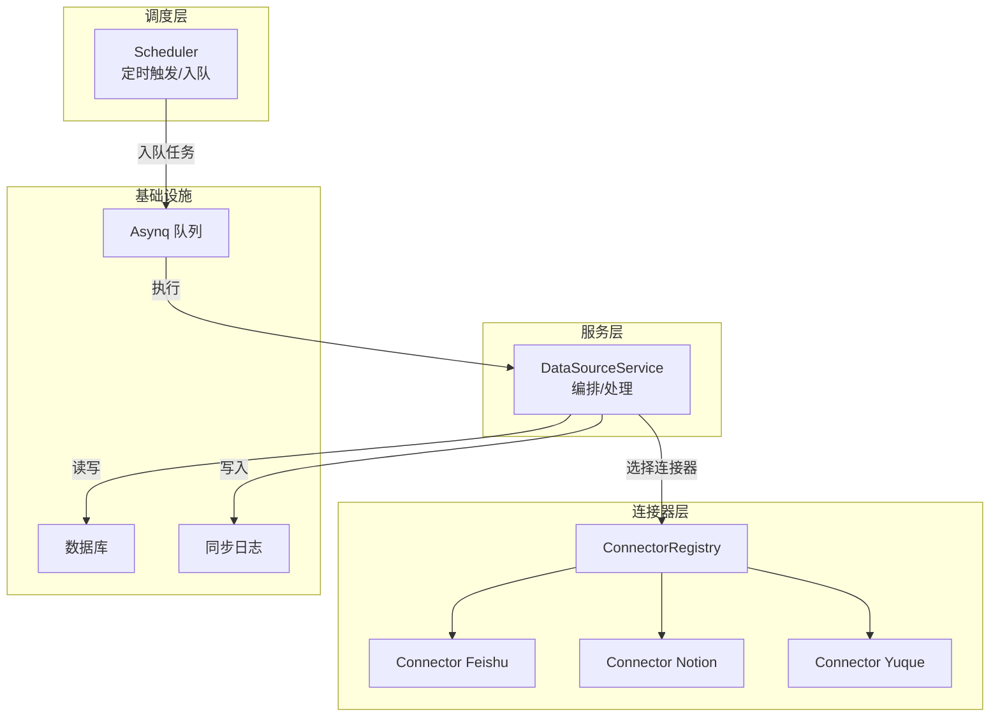
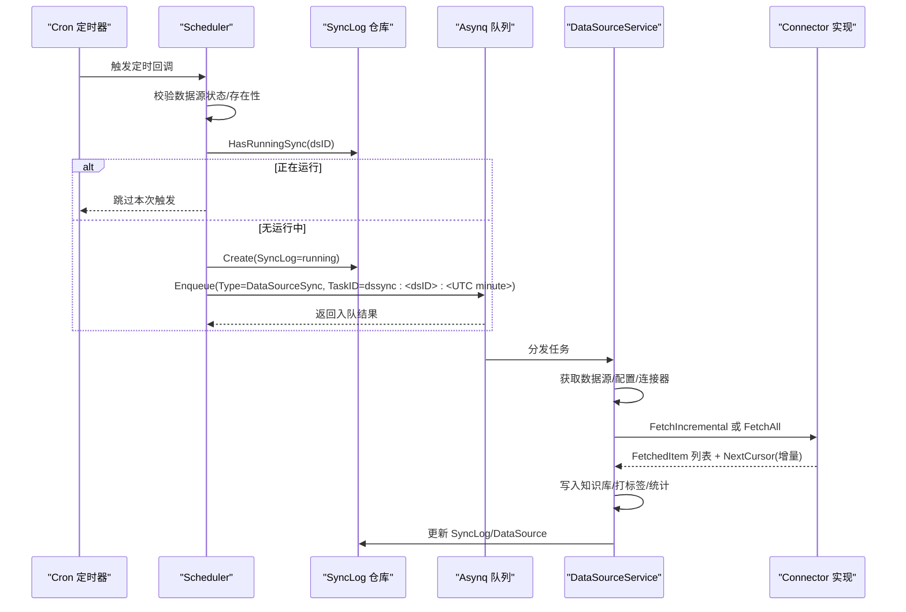
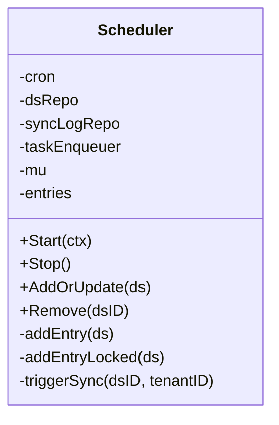
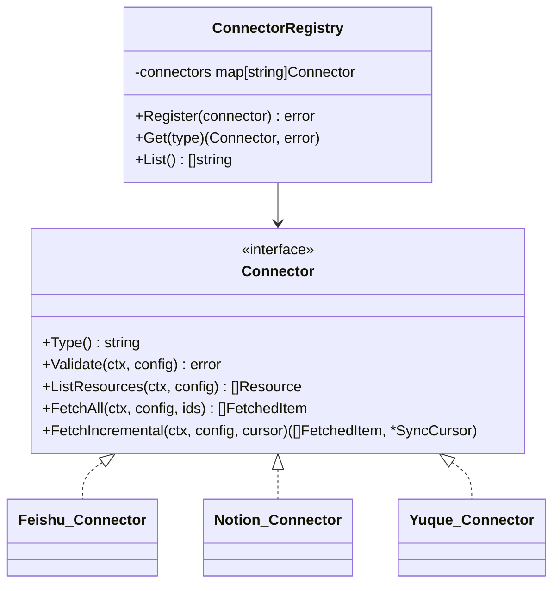
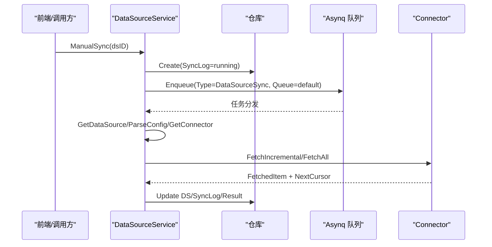
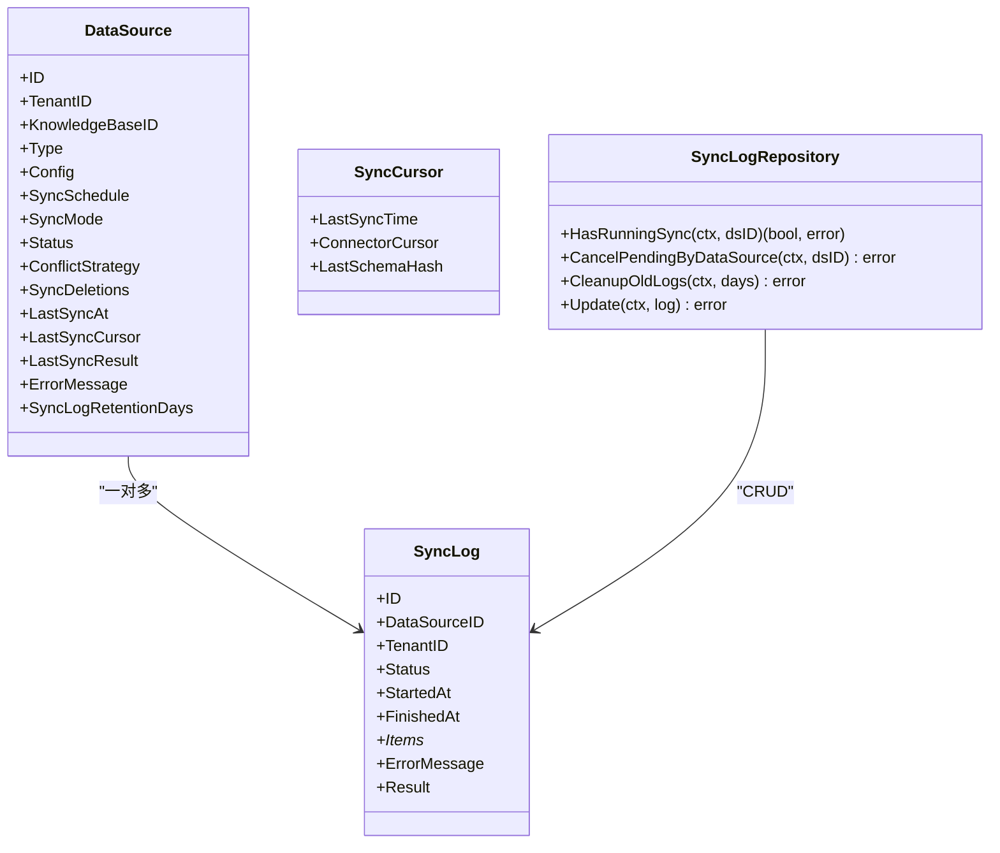
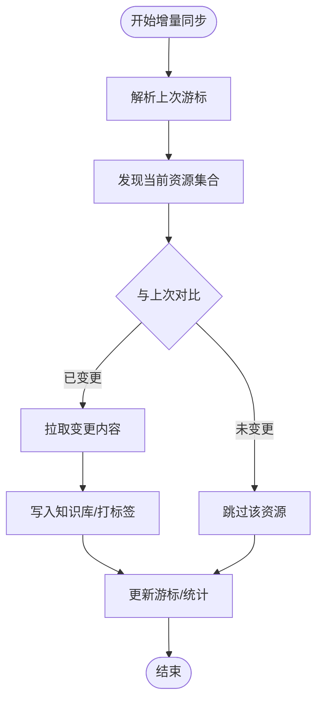
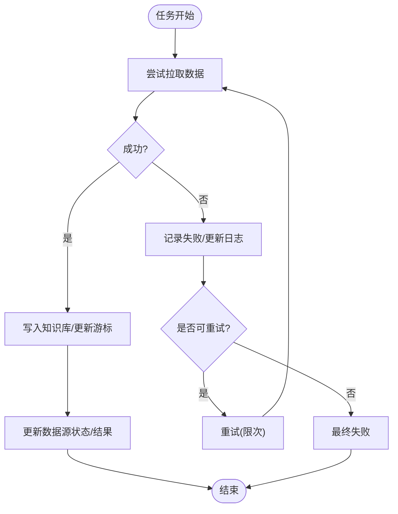
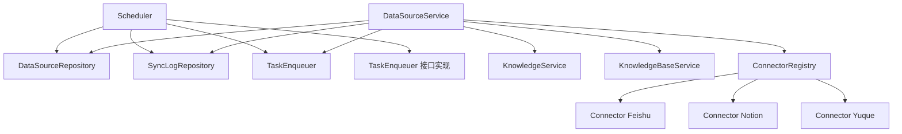

# 数据源同步调度

<cite>
**本文引用的文件**
- [scheduler.go](file://internal/datasource/scheduler.go)
- [scheduler_test.go](file://internal/datasource/scheduler_test.go)
- [connector.go](file://internal/datasource/connector.go)
- [datasource_service.go](file://internal/application/service/datasource_service.go)
- [datasource.go](file://internal/types/datasource.go)
- [datasource_repo.go](file://internal/application/repository/datasource_repo.go)
- [connector.feishu.go](file://internal/datasource/connector/feishu/connector.go)
- [connector.notion.go](file://internal/datasource/connector/notion/connector.go)
- [connector.yuque.go](file://internal/datasource/connector/yuque/connector.go)
- [errors.go](file://internal/datasource/errors.go)
- [main.go](file://cmd/server/main.go)
- [task_handler.go](file://internal/types/interfaces/task_handler.go)
- [task_enqueuer.go](file://internal/types/interfaces/task_enqueuer.go)
- [middleware.go](file://internal/event/middleware.go)
- [DataSourceSyncLogs.vue](file://frontend/src/views/knowledge/settings/DataSourceSyncLogs.vue)
- [数据源导入开发文档.md](file://docs/数据源导入开发文档.md)
</cite>

## 目录
1. [简介](#简介)
2. [项目结构](#项目结构)
3. [核心组件](#核心组件)
4. [架构总览](#架构总览)
5. [详细组件分析](#详细组件分析)
6. [依赖分析](#依赖分析)
7. [性能考量](#性能考量)
8. [故障排查指南](#故障排查指南)
9. [结论](#结论)
10. [附录](#附录)

## 简介
本技术文档围绕 WeKnora 的“数据源同步调度系统”展开，目标是为运维与开发人员提供从架构到实现细节的完整说明。内容涵盖：
- 定时任务管理、并发控制与资源分配
- 增量同步策略（游标管理、变更检测、批量处理优化）
- 错误恢复机制（失败重试、断点续传、异常处理）
- 同步状态监控与进度跟踪（状态持久化、日志记录、性能指标）
- 多租户调度隔离与资源限制
- 面向运维的配置与故障排查

## 项目结构
WeKnora 将“调度器”置于 internal/datasource 包中，通过 asynq 异步队列执行具体同步任务；业务服务在 internal/application/service 中编排数据源配置、连接器选择与知识库写入；类型定义与仓库接口位于 internal/types 与 internal/application/repository。



图表来源
- [scheduler.go:18-52](file://internal/datasource/scheduler.go#L18-L52)
- [datasource_service.go:21-57](file://internal/application/service/datasource_service.go#L21-L57)
- [connector.go:33-74](file://internal/datasource/connector.go#L33-L74)
- [datasource_repo.go:181-229](file://internal/application/repository/datasource_repo.go#L181-L229)

章节来源
- [scheduler.go:18-52](file://internal/datasource/scheduler.go#L18-L52)
- [datasource_service.go:21-57](file://internal/application/service/datasource_service.go#L21-L57)
- [connector.go:33-74](file://internal/datasource/connector.go#L33-L74)
- [datasource_repo.go:181-229](file://internal/application/repository/datasource_repo.go#L181-L229)

## 核心组件
- 调度器 Scheduler：基于 robfig/cron 的秒级定时器，按数据源配置注册 Cron 任务；触发时进行双层去重（DB 层 HasRunningSync + 队列层 asynq TaskID），避免重叠与重复执行。
- 连接器 Connector 接口族：统一抽象增量/全量拉取、资源列举与校验能力；各外部系统（如 Feishu、Notion、Yuque）实现具体 FetchAll/FetchIncremental。
- 数据源服务 DataSourceService：负责数据源生命周期（创建/更新/删除/暂停/恢复）、手动触发、结果写入知识库与标签自动打标、错误状态回写。
- 类型与仓库：定义数据源、同步日志、游标、任务负载等结构体；仓库提供 HasRunningSync、CancelPendingByDataSource、CleanupOldLogs 等能力。
- 队列与执行：asynq 作为任务队列，支持队列名与 TaskID 去重；任务处理器实现实际同步逻辑。

章节来源
- [scheduler.go:18-52](file://internal/datasource/scheduler.go#L18-L52)
- [connector.go:9-31](file://internal/datasource/connector.go#L9-L31)
- [datasource_service.go:21-57](file://internal/application/service/datasource_service.go#L21-L57)
- [datasource.go:49-114](file://internal/types/datasource.go#L49-L114)
- [datasource_repo.go:181-229](file://internal/application/repository/datasource_repo.go#L181-L229)

## 架构总览
调度器在启动时加载所有“活跃且有计划”的数据源，为每个数据源注册 Cron；Cron 触发后先检查“是否存在正在运行的同步”，若无则创建 SyncLog 并以确定性 TaskID 入队；任务处理器根据数据源配置选择连接器，执行增量或全量拉取，并将结果写入知识库与同步日志。



图表来源
- [scheduler.go:132-203](file://internal/datasource/scheduler.go#L132-L203)
- [datasource_service.go:387-599](file://internal/application/service/datasource_service.go#L387-L599)
- [datasource_repo.go:192-229](file://internal/application/repository/datasource_repo.go#L192-L229)

章节来源
- [scheduler.go:132-203](file://internal/datasource/scheduler.go#L132-L203)
- [datasource_service.go:387-599](file://internal/application/service/datasource_service.go#L387-L599)
- [数据源导入开发文档.md:709-751](file://docs/数据源导入开发文档.md#L709-L751)

## 详细组件分析

### 组件A：调度器 Scheduler
- 定时任务管理
  - 使用 robfig/cron（秒精度）注册每数据源的 Cron 表达式。
  - 支持动态 AddOrUpdate/Remove，保证配置变更即时生效。
- 并发控制与去重
  - 双层去重：DB 层 HasRunningSync 防止跨实例重叠；队列层以 TaskID="dssync:<dsID>:<UTC minute>" 去重，同一分钟仅一个任务入队。
- 资源分配
  - 任务入队指定队列名 "low"，便于与其它任务队列隔离。
- 生命周期
  - Start 加载活跃数据源并注册；Stop 停止 Cron 并等待退出。



图表来源
- [scheduler.go:18-52](file://internal/datasource/scheduler.go#L18-L52)
- [scheduler.go:111-130](file://internal/datasource/scheduler.go#L111-L130)
- [scheduler.go:132-203](file://internal/datasource/scheduler.go#L132-L203)

章节来源
- [scheduler.go:54-81](file://internal/datasource/scheduler.go#L54-L81)
- [scheduler.go:83-109](file://internal/datasource/scheduler.go#L83-L109)
- [scheduler.go:111-130](file://internal/datasource/scheduler.go#L111-L130)
- [scheduler.go:132-203](file://internal/datasource/scheduler.go#L132-L203)
- [scheduler_test.go:153-180](file://internal/datasource/scheduler_test.go#L153-L180)
- [scheduler_test.go:182-205](file://internal/datasource/scheduler_test.go#L182-L205)
- [scheduler_test.go:207-236](file://internal/datasource/scheduler_test.go#L207-L236)
- [scheduler_test.go:238-278](file://internal/datasource/scheduler_test.go#L238-L278)
- [scheduler_test.go:280-305](file://internal/datasource/scheduler_test.go#L280-L305)
- [scheduler_test.go:307-327](file://internal/datasource/scheduler_test.go#L307-L327)
- [scheduler_test.go:329-360](file://internal/datasource/scheduler_test.go#L329-L360)

### 组件B：连接器接口与实现
- Connector 接口
  - Type/Validate/ListResources/FetchAll/FetchIncremental 统一抽象。
- ConnectorRegistry
  - 注册/查找/列举可用连接器；提供前端展示元数据（名称、描述、认证方式、能力等）。
- 典型实现要点
  - Feishu：基于节点编辑时间比较进行增量检测；支持删除检测与占位错误项记录。
  - Notion：首次增量直接走全量以构建游标；后续周期基于页面最后编辑时间差分。
  - Yuque：按书籍遍历文档，基于内容更新时间戳进行增量过滤。



图表来源
- [connector.go:9-31](file://internal/datasource/connector.go#L9-L31)
- [connector.go:33-74](file://internal/datasource/connector.go#L33-L74)
- [connector.feishu.go:115-200](file://internal/datasource/connector/feishu/connector.go#L115-L200)
- [connector.notion.go:139-200](file://internal/datasource/connector/notion/connector.go#L139-L200)
- [connector.yuque.go:110-200](file://internal/datasource/connector/yuque/connector.go#L110-L200)

章节来源
- [connector.go:9-31](file://internal/datasource/connector.go#L9-L31)
- [connector.go:33-74](file://internal/datasource/connector.go#L33-L74)
- [connector.feishu.go:115-200](file://internal/datasource/connector/feishu/connector.go#L115-L200)
- [connector.notion.go:139-200](file://internal/datasource/connector/notion/connector.go#L139-L200)
- [connector.yuque.go:110-200](file://internal/datasource/connector/yuque/connector.go#L110-L200)

### 组件C：数据源服务 DataSourceService
- 生命周期编排
  - 创建/更新/删除/暂停/恢复数据源；更新时动态调整 Cron。
- 手动触发
  - ManualSync 直接创建 SyncLog 并入队默认队列任务。
- 同步执行
  - ProcessSync 解析负载、获取连接器、执行增量/全量拉取、写入知识库、更新游标与结果。
- 自动打标与冲突策略
  - 为每个数据源创建/复用标签，便于识别来源；重复内容按策略跳过。
- 多租户上下文
  - 在处理同步时注入租户信息，确保资源归属正确。



图表来源
- [datasource_service.go:269-324](file://internal/application/service/datasource_service.go#L269-L324)
- [datasource_service.go:387-599](file://internal/application/service/datasource_service.go#L387-L599)

章节来源
- [datasource_service.go:59-100](file://internal/application/service/datasource_service.go#L59-L100)
- [datasource_service.go:130-175](file://internal/application/service/datasource_service.go#L130-L175)
- [datasource_service.go:177-200](file://internal/application/service/datasource_service.go#L177-L200)
- [datasource_service.go:269-324](file://internal/application/service/datasource_service.go#L269-L324)
- [datasource_service.go:387-599](file://internal/application/service/datasource_service.go#L387-L599)

### 组件D：类型与仓库
- 数据源与同步日志
  - 定义数据源状态、同步模式、日志状态、游标结构、任务负载等。
- 仓库接口
  - HasRunningSync：防重叠的关键判断。
  - CancelPendingByDataSource：删除/暂停时取消待执行日志。
  - CleanupOldLogs：按保留天数清理历史日志。



图表来源
- [datasource.go:49-114](file://internal/types/datasource.go#L49-L114)
- [datasource.go:129-183](file://internal/types/datasource.go#L129-L183)
- [datasource.go:275-286](file://internal/types/datasource.go#L275-L286)
- [datasource_repo.go:192-229](file://internal/application/repository/datasource_repo.go#L192-L229)

章节来源
- [datasource.go:49-114](file://internal/types/datasource.go#L49-L114)
- [datasource.go:129-183](file://internal/types/datasource.go#L129-L183)
- [datasource.go:275-286](file://internal/types/datasource.go#L275-L286)
- [datasource_repo.go:192-229](file://internal/application/repository/datasource_repo.go#L192-L229)

### 组件E：增量同步策略与游标管理
- 游标设计
  - SyncCursor 统一承载上次同步时间与连接器特定游标字段；部分连接器在首次增量时退化为全量构建游标。
- 变更检测算法
  - Feishu：以节点对象编辑时间对比；Notion：以页面最后编辑时间对比；Yuque：以文档内容更新时间戳对比。
- 批量处理优化
  - 连接器内部对资源进行树形遍历/递归枚举，按需过滤（如类型、草稿状态），减少无效请求。
- 断点续传
  - 任务处理器在成功后更新数据源 LastSyncCursor 与 LastSyncAt；下次增量基于游标继续。



图表来源
- [connector.feishu.go:115-200](file://internal/datasource/connector/feishu/connector.go#L115-L200)
- [connector.notion.go:139-200](file://internal/datasource/connector/notion/connector.go#L139-L200)
- [connector.yuque.go:116-200](file://internal/datasource/connector/yuque/connector.go#L116-L200)
- [datasource_service.go:568-594](file://internal/application/service/datasource_service.go#L568-L594)

章节来源
- [datasource.go:275-286](file://internal/types/datasource.go#L275-L286)
- [connector.feishu.go:115-200](file://internal/datasource/connector/feishu/connector.go#L115-L200)
- [connector.notion.go:139-200](file://internal/datasource/connector/notion/connector.go#L139-L200)
- [connector.yuque.go:116-200](file://internal/datasource/connector/yuque/connector.go#L116-L200)
- [datasource_service.go:568-594](file://internal/application/service/datasource_service.go#L568-L594)

### 组件F：错误恢复与异常处理
- 失败重试策略
  - 连接器层对 5xx（非 429）进行一次性重试；4xx 不重试。
  - 调度层对 asynq.ErrTaskIDConflict 记录“去重”状态并更新日志。
- 断点续传
  - 成功后更新数据源 LastSyncCursor 与 LastSyncAt；失败时日志记录 ErrorMessage。
- 异常处理流程
  - 任务处理器捕获错误，设置 SyncLogStatusFailed，必要时回写数据源状态；删除/暂停场景会取消待执行日志。



图表来源
- [datasource_service.go:467-479](file://internal/application/service/datasource_service.go#L467-L479)
- [datasource_service.go:568-594](file://internal/application/service/datasource_service.go#L568-L594)
- [connector.yuque.go:212-254](file://internal/datasource/connector/yuque/connector.go#L212-L254)

章节来源
- [datasource_service.go:467-479](file://internal/application/service/datasource_service.go#L467-L479)
- [datasource_service.go:568-594](file://internal/application/service/datasource_service.go#L568-L594)
- [connector.yuque.go:212-254](file://internal/datasource/connector/yuque/connector.go#L212-L254)

### 组件G：状态监控与进度跟踪
- 状态持久化
  - SyncLog 记录每次同步的开始/结束、计数、错误与结果；DataSource 记录最近一次游标与结果。
- 日志记录
  - 调度层与服务层广泛使用日志记录关键事件（入队、去重、失败、完成）。
- 性能指标
  - 仓库接口提供 CleanupOldLogs；前端组件计算持续时间与统计信息用于展示。
- 前端展示
  - DataSourceSyncLogs.vue 提供同步日志列表、时长格式化、状态颜色等。

```mermaid
graph LR
DB["数据库: data_sources/sync_logs"] <- --> Repo["SyncLog 仓库"]
Repo --> Logs["查询/统计"]
Logs --> FE["前端: DataSourceSyncLogs.vue"]
FE --> UI["状态/时长/计数展示"]
```

图表来源
- [datasource_repo.go:181-229](file://internal/application/repository/datasource_repo.go#L181-L229)
- [DataSourceSyncLogs.vue:120-128](file://frontend/src/views/knowledge/settings/DataSourceSyncLogs.vue#L120-L128)

章节来源
- [datasource_repo.go:181-229](file://internal/application/repository/datasource_repo.go#L181-L229)
- [DataSourceSyncLogs.vue:120-128](file://frontend/src/views/knowledge/settings/DataSourceSyncLogs.vue#L120-L128)

### 组件H：多租户调度隔离与资源限制
- 多租户隔离
  - 数据源与同步日志均包含 TenantID 字段；调度器按数据源 TenantID 触发；服务层在处理时注入租户上下文。
- 资源限制
  - 调度器通过 Cron 与队列隔离不同优先级（如 "low" 队列）；连接器实现内部对请求速率与批量大小的控制（视具体实现而定）。
- 配置入口
  - 服务启动入口 main.go 通过容器构建依赖，确保调度器与队列在应用生命周期内正确初始化与关闭。

章节来源
- [datasource.go:54-55](file://internal/types/datasource.go#L54-L55)
- [datasource.go:137-138](file://internal/types/datasource.go#L137-L138)
- [scheduler.go:140-147](file://internal/datasource/scheduler.go#L140-L147)
- [datasource_service.go:486-503](file://internal/application/service/datasource_service.go#L486-L503)
- [main.go:55-60](file://cmd/server/main.go#L55-L60)

## 依赖分析
- 组件耦合
  - Scheduler 依赖 DataSourceRepository、SyncLogRepository、TaskEnqueuer；与连接器通过 Registry 解耦。
  - DataSourceService 依赖多个仓库与连接器 Registry，承担编排职责。
- 外部依赖
  - asynq：异步任务队列；robfig/cron：定时器；Langfuse：链路追踪注入。
- 循环依赖
  - 代码结构清晰，未见循环依赖迹象。



图表来源
- [scheduler.go:28-31](file://internal/datasource/scheduler.go#L28-L31)
- [datasource_service.go:22-29](file://internal/application/service/datasource_service.go#L22-L29)
- [connector.go:33-74](file://internal/datasource/connector.go#L33-L74)

章节来源
- [scheduler.go:28-31](file://internal/datasource/scheduler.go#L28-L31)
- [datasource_service.go:22-29](file://internal/application/service/datasource_service.go#L22-L29)
- [connector.go:33-74](file://internal/datasource/connector.go#L33-L74)

## 性能考量
- 定时触发与去重
  - 秒级 Cron 保证触发精度；双层去重避免重复执行与资源浪费。
- 队列隔离
  - 通过队列名与 TaskID 去重，降低竞争与冲突。
- 连接器侧优化
  - 增量同步基于时间戳/编辑时间对比，减少全量扫描；对不必要类型/状态进行过滤。
- 日志与清理
  - 定期清理旧日志，避免存储膨胀。

## 故障排查指南
- 常见问题定位
  - 无法入队：检查 asynq 服务与 TaskID 冲突（ErrTaskIDConflict）；查看调度层日志。
  - 重复执行：确认 HasRunningSync 是否返回 true；检查 Cron 表达式与实例数量。
  - 连接器失败：查看连接器 Validate/列表/拉取阶段的日志；关注 4xx/5xx 重试策略。
  - 结果不一致：核对游标更新与数据源状态回写；检查知识库写入与标签打标。
- 关键日志位置
  - 调度层：triggerSync、入队、去重、失败回写。
  - 服务层：ManualSync、ProcessSync、写入知识库、更新游标。
- 前端辅助
  - DataSourceSyncLogs.vue 展示状态、时长与计数，便于快速定位异常批次。

章节来源
- [scheduler.go:176-200](file://internal/datasource/scheduler.go#L176-L200)
- [datasource_service.go:295-324](file://internal/application/service/datasource_service.go#L295-L324)
- [datasource_service.go:467-479](file://internal/application/service/datasource_service.go#L467-L479)
- [errors.go:6-32](file://internal/datasource/errors.go#L6-L32)
- [DataSourceSyncLogs.vue:120-128](file://frontend/src/views/knowledge/settings/DataSourceSyncLogs.vue#L120-L128)

## 结论
WeKnora 的数据源同步调度系统通过“秒级定时 + 双层去重 + 连接器抽象 + 队列隔离 + 游标驱动增量”的组合，实现了高可靠、可观测、可扩展的同步能力。配合完善的日志与前端展示，运维人员可以高效地进行配置、监控与故障排查。

## 附录
- 配置建议
  - Cron 表达式：建议错峰设置，避免高峰重叠；秒级表达式需谨慎，防止过于频繁。
  - 队列：将低优先级任务放入 "low" 队列，避免阻塞高优任务。
  - 游标：确保连接器实现正确维护 NextCursor；定期清理旧日志以保持性能。
- 运行时注意
  - 服务启动顺序：先启动队列与调度器，再启动 API 服务；优雅关闭时先停止监听再清理资源。