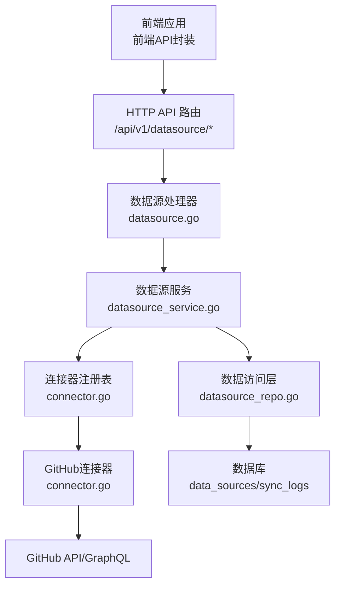
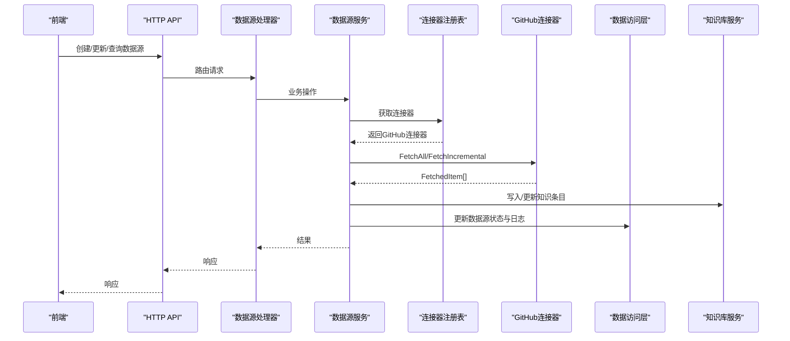
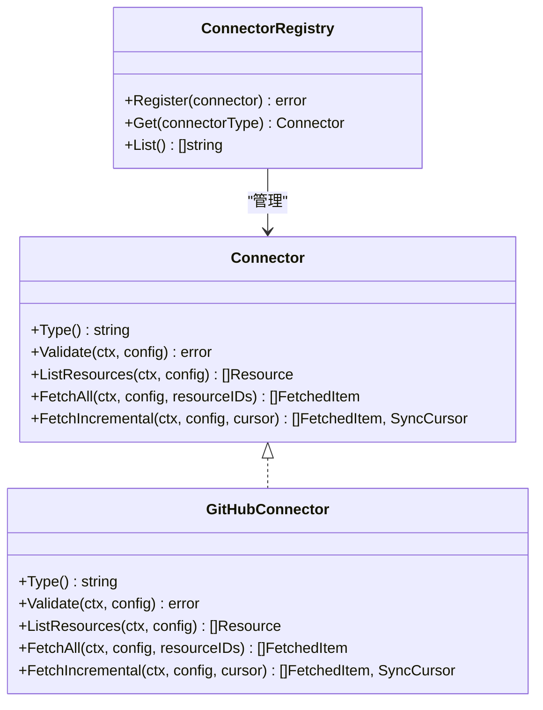
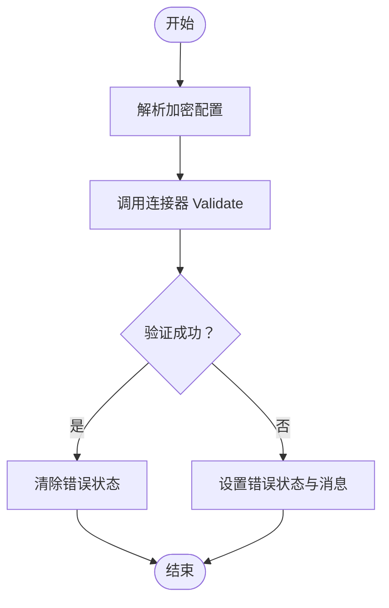
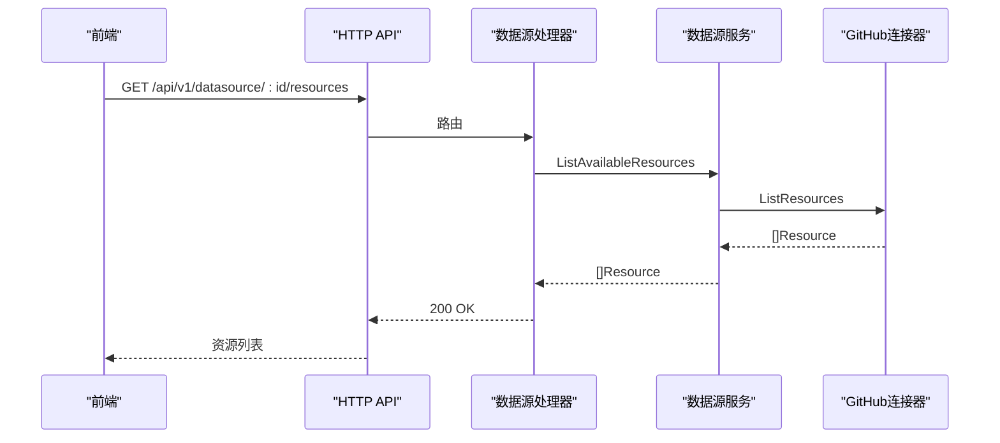
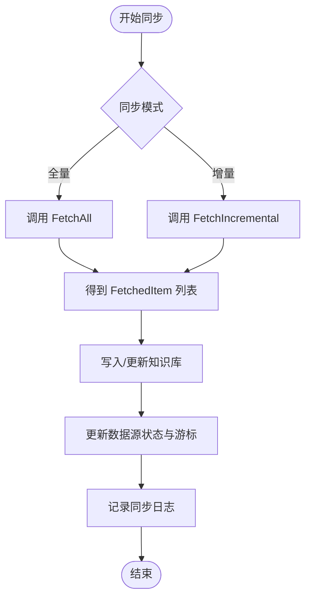
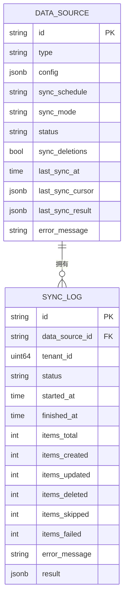
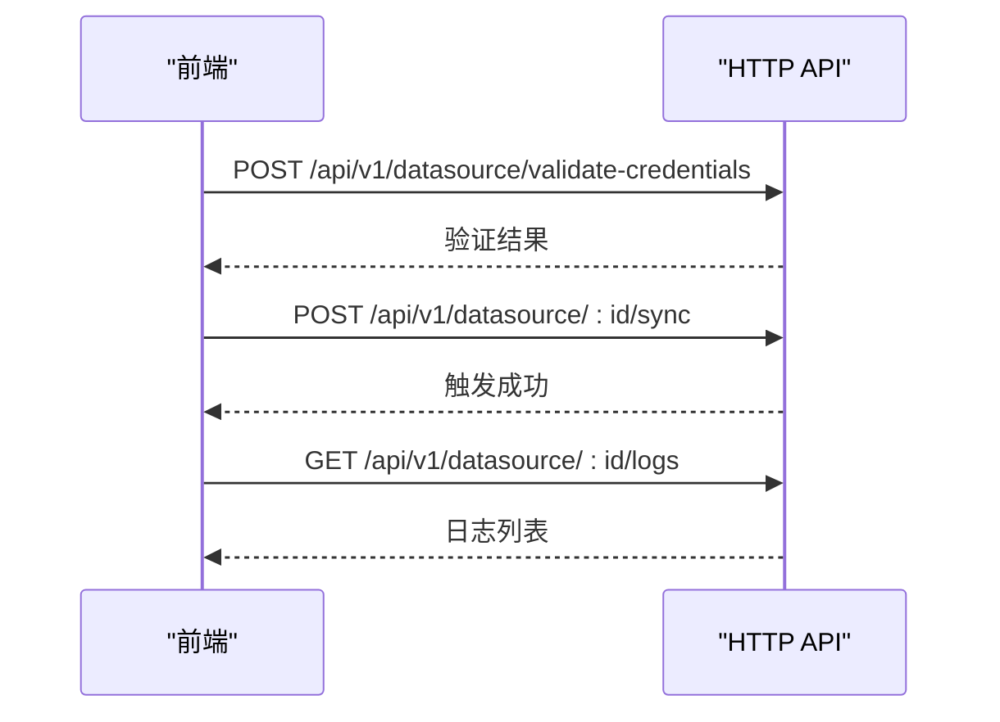
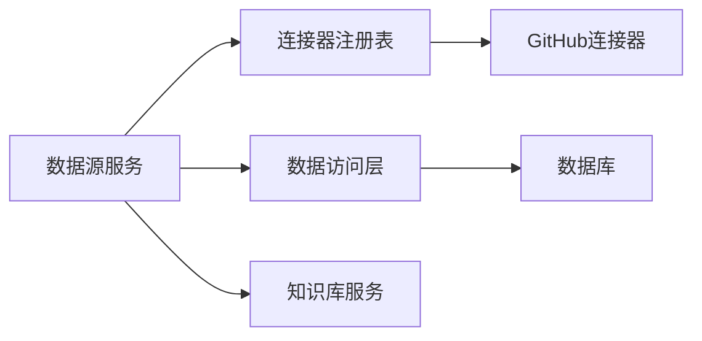

# GitHub数据源连接器

<cite>
**本文档引用的文件**
- [connector.go](file://internal/datasource/connector.go)
- [datasource.go](file://internal/types/datasource.go)
- [datasource_service.go](file://internal/application/service/datasource_service.go)
- [datasource_repo.go](file://internal/application/repository/datasource_repo.go)
- [datasource.go](file://internal/handler/datasource.go)
- [CONNECTOR_IMPLEMENTATION_GUIDE.md](file://internal/datasource/CONNECTOR_IMPLEMENTATION_GUIDE.md)
- [README.md](file://internal/datasource/README.md)
- [index.ts](file://frontend/src/api/datasource/index.ts)
</cite>

## 目录
1. [简介](#简介)
2. [项目结构](#项目结构)
3. [核心组件](#核心组件)
4. [架构总览](#架构总览)
5. [详细组件分析](#详细组件分析)
6. [依赖关系分析](#依赖关系分析)
7. [性能考虑](#性能考虑)
8. [故障排除指南](#故障排除指南)
9. [结论](#结论)

## 简介
本文件为WeKnora的GitHub数据源连接器技术文档，面向需要在WeKnora中集成GitHub仓库同步能力的开发者与运维人员。文档基于现有代码库中的数据源同步框架，系统性阐述GitHub连接器的实现架构、认证方式、API调用与GraphQL查询支持、仓库遍历与分支处理、文件内容获取与元数据提取、Git历史记录处理与变更检测机制，并提供配置选项、速率限制处理、错误重试策略、私有仓库支持、组织权限管理以及大规模仓库性能优化方案。

## 项目结构
WeKnora的数据源同步框架采用分层设计：前端通过HTTP API调用后端；后端路由到数据源处理器；处理器委托业务服务执行具体任务；服务层通过连接器注册表获取对应平台的连接器实现；连接器负责与外部平台API交互并返回统一的数据模型。

**图表来源**
- [datasource.go:546-556](file://internal/handler/datasource.go#L546-L556)
- [datasource_service.go:387-599](file://internal/application/service/datasource_service.go#L387-L599)
- [connector.go:1-74](file://internal/datasource/connector.go#L1-L74)
- [datasource_repo.go:13-121](file://internal/application/repository/datasource_repo.go#L13-L121)

**章节来源**
- [README.md:1-91](file://internal/datasource/README.md#L1-L91)
- [datasource.go:546-556](file://internal/handler/datasource.go#L546-L556)

## 核心组件
- 连接器接口与注册表：所有外部平台连接器需实现统一接口并通过注册表进行管理。
- 数据源服务：封装业务逻辑，协调连接器、知识服务与任务队列。
- 数据模型：统一的资源、条目、游标与日志模型，保证不同平台的一致性。
- 前端API封装：提供连接器类型查询、数据源创建/更新、资源列表、手动同步、暂停/恢复、日志查询等能力。

**章节来源**
- [connector.go:9-31](file://internal/datasource/connector.go#L9-L31)
- [datasource.go:196-286](file://internal/types/datasource.go#L196-L286)
- [datasource_service.go:21-57](file://internal/application/service/datasource_service.go#L21-L57)
- [index.ts:62-113](file://frontend/src/api/datasource/index.ts#L62-L113)

## 架构总览
WeKnora的数据源同步采用异步任务队列（asynq）驱动，支持定时调度与手动触发。连接器负责从外部平台拉取数据，服务层进行去重、更新策略与结果汇总，并将内容写入知识库。

**图表来源**
- [datasource_service.go:387-599](file://internal/application/service/datasource_service.go#L387-L599)
- [connector.go:9-31](file://internal/datasource/connector.go#L9-L31)
- [datasource_repo.go:13-121](file://internal/application/repository/datasource_repo.go#L13-L121)

## 详细组件分析

### GitHub连接器接口与元数据
- 接口方法：Type、Validate、ListResources、FetchAll、FetchIncremental。
- 元数据：GitHub连接器类型常量、名称、描述、认证方式（OAuth2）、优先级与能力（增量同步）。

**图表来源**
- [connector.go:9-31](file://internal/datasource/connector.go#L9-L31)
- [connector.go:33-73](file://internal/datasource/connector.go#L33-L73)
- [connector.go:121-128](file://internal/datasource/connector.go#L121-L128)

**章节来源**
- [connector.go:121-128](file://internal/datasource/connector.go#L121-L128)
- [datasource.go:12-26](file://internal/types/datasource.go#L12-L26)

### 认证与凭据管理
- 认证类型：OAuth2（适用于GitHub）。
- 凭据存储：数据源配置字段加密存储（AES-256-GCM），服务层解析后传递给连接器。
- 连接测试：Validate方法用于验证凭据有效性与连通性，失败时更新数据源状态与错误消息。

**图表来源**
- [datasource_service.go:202-238](file://internal/application/service/datasource_service.go#L202-L238)
- [datasource.go:372-381](file://internal/types/datasource.go#L372-L381)

**章节来源**
- [datasource_service.go:202-238](file://internal/application/service/datasource_service.go#L202-L238)
- [datasource.go:66-68](file://internal/types/datasource.go#L66-L68)

### 资源列举与选择
- ListResources：列出可用资源（如仓库、组织或用户拥有的仓库集合），供用户选择需要同步的范围。
- 前端API：提供列出可用资源的接口，便于UI展示与选择。

**图表来源**
- [datasource.go:546-556](file://internal/handler/datasource.go#L546-L556)
- [datasource_service.go:240-267](file://internal/application/service/datasource_service.go#L240-L267)
- [index.ts:95-97](file://frontend/src/api/datasource/index.ts#L95-L97)

**章节来源**
- [datasource_service.go:240-267](file://internal/application/service/datasource_service.go#L240-L267)
- [index.ts:95-97](file://frontend/src/api/datasource/index.ts#L95-L97)

### 同步流程与增量策略
- 全量同步：FetchAll拉取所选资源下的全部条目。
- 增量同步：FetchIncremental基于上次游标（时间戳与连接器特定游标）仅拉取变更项。
- 任务执行：ProcessSync根据数据源配置决定全量或增量，处理结果并更新日志与数据源状态。

**图表来源**
- [datasource_service.go:451-465](file://internal/application/service/datasource_service.go#L451-L465)
- [datasource_service.go:515-556](file://internal/application/service/datasource_service.go#L515-L556)
- [datasource.go:275-286](file://internal/types/datasource.go#L275-L286)

**章节来源**
- [datasource_service.go:387-599](file://internal/application/service/datasource_service.go#L387-L599)
- [datasource.go:275-286](file://internal/types/datasource.go#L275-L286)

### 数据模型与转换
- 统一模型：Resource（外部ID、名称、类型、URL、修改时间等）、FetchedItem（标题、内容、类型、文件名、URL、更新时间、元数据、删除标记、来源资源ID）。
- 写入知识库：若存在相同external_id则先删除再重建，支持按URL或已下载内容两种路径。

**图表来源**
- [datasource.go:49-114](file://internal/types/datasource.go#L49-L114)
- [datasource.go:129-183](file://internal/types/datasource.go#L129-L183)

**章节来源**
- [datasource.go:212-273](file://internal/types/datasource.go#L212-L273)
- [datasource_service.go:636-710](file://internal/application/service/datasource_service.go#L636-L710)

### 前端集成与API
- 前端提供数据源管理、资源列举、手动同步、暂停/恢复、日志查询等API封装。
- 支持“测试连接”（ValidateCredentials）在不持久化的情况下验证凭据。

**图表来源**
- [index.ts:91-113](file://frontend/src/api/datasource/index.ts#L91-L113)

**章节来源**
- [index.ts:62-113](file://frontend/src/api/datasource/index.ts#L62-L113)

## 依赖关系分析
- 连接器注册表集中管理各平台连接器，服务层通过类型键获取具体实现。
- 数据源服务依赖知识库服务进行内容写入，依赖任务队列进行异步执行。
- 数据访问层提供数据源与同步日志的持久化能力。

**图表来源**
- [datasource_service.go:21-57](file://internal/application/service/datasource_service.go#L21-L57)
- [connector.go:33-73](file://internal/datasource/connector.go#L33-L73)
- [datasource_repo.go:13-121](file://internal/application/repository/datasource_repo.go#L13-L121)

**章节来源**
- [datasource_service.go:21-57](file://internal/application/service/datasource_service.go#L21-L57)
- [connector.go:33-73](file://internal/datasource/connector.go#L33-L73)
- [datasource_repo.go:13-121](file://internal/application/repository/datasource_repo.go#L13-L121)

## 性能考虑
- 异步任务队列：使用asynq进行非阻塞同步，避免阻塞主线程。
- 增量同步：通过游标减少API调用次数，降低带宽与服务器压力。
- 批量处理：服务层逐条处理条目并统计结果，便于监控与回滚。
- 速率限制：建议在连接器实现中引入指数退避与重试策略，以应对平台限流。
- 大规模仓库优化：分页拉取、并发控制、内存占用控制与断点续传。

[本节为通用性能指导，无需特定文件引用]

## 故障排除指南
- 连接失败：检查凭据是否正确、网络连通性与平台权限。
- 同步异常：查看同步日志中的错误消息，确认数据源状态与最近一次游标。
- 重复内容：系统会检测相同external_id并进行更新（删除后重建），若出现重复请检查元数据键值。
- 速率限制：当遇到429/限流时，应在连接器实现中增加重试与退避逻辑。

**章节来源**
- [datasource_service.go:467-479](file://internal/application/service/datasource_service.go#L467-L479)
- [datasource_repo.go:192-206](file://internal/application/repository/datasource_repo.go#L192-L206)

## 结论
WeKnora的GitHub数据源连接器基于统一的连接器接口与注册表，结合异步任务队列与标准化数据模型，实现了对GitHub仓库、Wiki与Issue等内容的全量与增量同步。通过加密凭据存储、完善的错误处理与日志追踪，系统具备良好的安全性与可观测性。未来可在连接器层进一步完善速率限制处理、GraphQL查询支持与大规模仓库的性能优化，以满足更复杂的生产场景需求。