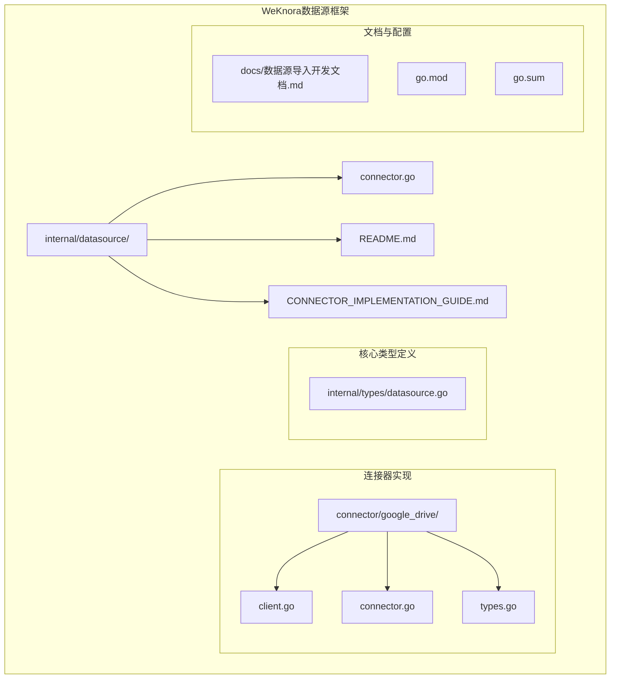
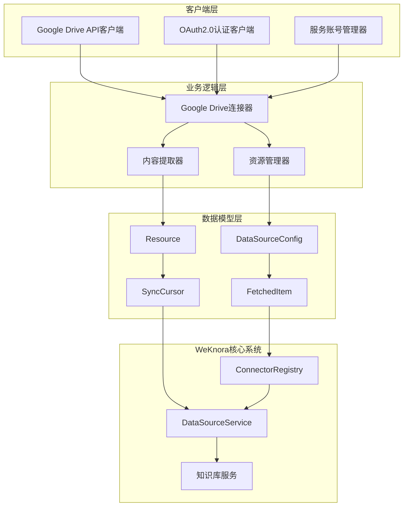
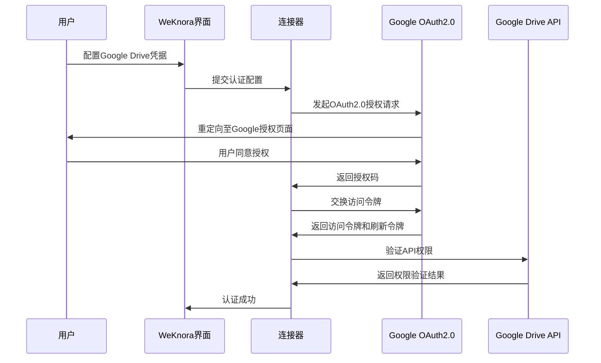
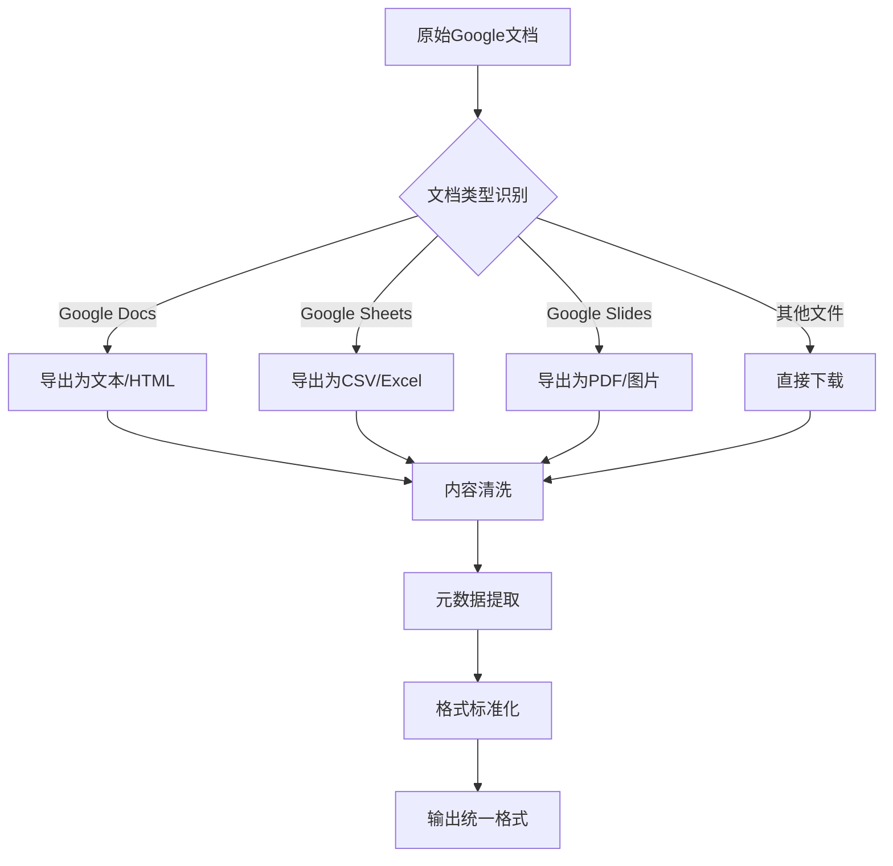
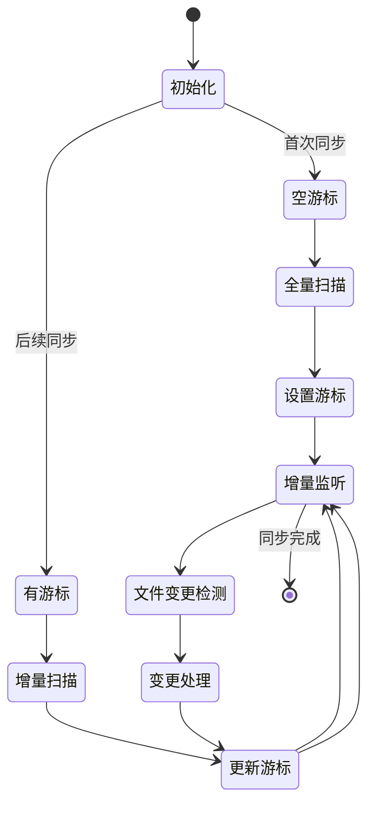
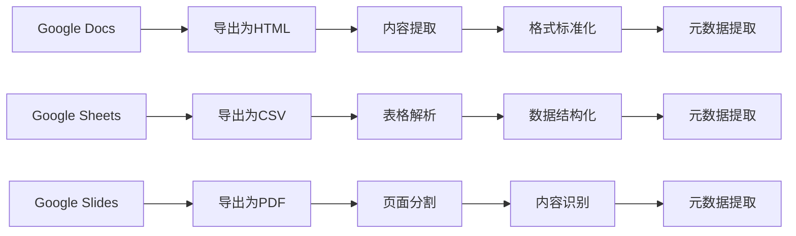
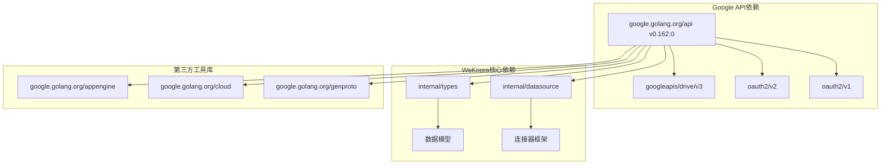

# Google Drive数据源连接器

<cite>
**本文档引用的文件**
- [connector.go](file://internal/datasource/connector.go)
- [datasource.go](file://internal/types/datasource.go)
- [README.md](file://internal/datasource/README.md)
- [CONNECTOR_IMPLEMENTATION_GUIDE.md](file://internal/datasource/CONNECTOR_IMPLEMENTATION_GUIDE.md)
- [数据源导入开发文档.md](file://docs/数据源导入开发文档.md)
- [go.sum](file://go.sum)
</cite>

## 目录
1. [简介](#简介)
2. [项目结构](#项目结构)
3. [核心组件](#核心组件)
4. [架构概览](#架构概览)
5. [详细组件分析](#详细组件分析)
6. [依赖分析](#依赖分析)
7. [性能考虑](#性能考虑)
8. [故障排除指南](#故障排除指南)
9. [结论](#结论)

## 简介

WeKnora Google Drive数据源连接器是一个基于WeKnora数据源同步框架的第三方集成组件，专门用于从Google Drive中自动导入和同步文档内容到WeKnora知识库。该连接器实现了完整的OAuth2.0认证流程、服务账号配置管理和API权限控制，支持文件夹遍历、文件类型过滤、内容提取和元数据获取等功能。

该连接器遵循WeKnora的标准化架构设计，采用适配器模式实现，确保与WeKnora核心系统的无缝集成。通过统一的Connector接口，Google Drive连接器能够提供增量同步、全量同步、内容转换和权限管理等核心功能。

## 项目结构

Google Drive连接器作为WeKnora数据源同步框架的一部分，遵循统一的项目组织结构：

**图表来源**
- [connector.go:1-208](file://internal/datasource/connector.go#L1-L208)
- [README.md:1-261](file://internal/datasource/README.md#L1-L261)

**章节来源**
- [connector.go:1-208](file://internal/datasource/connector.go#L1-L208)
- [README.md:1-261](file://internal/datasource/README.md#L1-L261)

## 核心组件

### 连接器接口实现

Google Drive连接器实现了WeKnora数据源框架的核心接口，包括：

- **Validate方法**：验证Google Drive API凭证的有效性和连接性
- **ListResources方法**：列出可用的Google Drive资源（文件夹、文档集合）
- **FetchAll方法**：执行全量同步，获取指定资源中的所有文档
- **FetchIncremental方法**：基于游标进行增量同步，仅获取变更的文档

### 认证与配置管理

连接器支持多种认证方式：

- **OAuth2.0认证**：支持标准OAuth2.0流程，包括访问令牌和刷新令牌管理
- **服务账号认证**：支持Google服务账号配置，适用于服务器到服务器的场景
- **API密钥认证**：支持基于API密钥的简单认证方式

### 数据模型与类型定义

连接器使用WeKnora统一的数据模型：

- **DataSourceConfig**：数据源配置结构，包含凭证、资源ID和设置
- **Resource**：可选资源表示，支持层级结构的文件夹和文档
- **FetchedItem**：拉取到的文档条目，统一封装内容和元数据
- **SyncCursor**：同步游标，用于增量同步的状态跟踪

**章节来源**
- [datasource.go:196-418](file://internal/types/datasource.go#L196-L418)
- [connector.go:9-31](file://internal/datasource/connector.go#L9-L31)

## 架构概览

Google Drive连接器采用分层架构设计，确保了良好的可维护性和扩展性：

**图表来源**
- [connector.go:34-73](file://internal/datasource/connector.go#L34-L73)
- [datasource.go:49-114](file://internal/types/datasource.go#L49-L114)

### 认证流程架构

Google Drive连接器的认证流程遵循OAuth2.0标准规范：

**图表来源**
- [CONNECTOR_IMPLEMENTATION_GUIDE.md:411-427](file://internal/datasource/CONNECTOR_IMPLEMENTATION_GUIDE.md#L411-L427)

## 详细组件分析

### Google Drive API客户端

Google Drive连接器的核心是API客户端，负责与Google Drive API进行交互：

#### 文件夹遍历机制

连接器实现了智能的文件夹遍历算法，支持：

- **递归遍历**：深度遍历Google Drive文件夹结构
- **分页处理**：处理大量文件时的分页加载机制
- **权限检查**：在遍历时检查文件访问权限
- **过滤策略**：根据配置过滤不需要的文件类型

#### 文件类型过滤

连接器支持多种文件类型的识别和处理：

| 文件类型 | MIME类型 | 处理方式 | 支持状态 |
|---------|----------|----------|----------|
| 文档 | application/vnd.google-apps.document | 导出为文本/HTML | ✅ 支持 |
| 电子表格 | application/vnd.google-apps.spreadsheet | 导出为CSV/Excel | ✅ 支持 |
| 演示文稿 | application/vnd.google-apps.presentation | 导出为PDF/图片 | ✅ 支持 |
| 笔记 | application/vnd.google-apps.drawings | 导出为图片 | ✅ 支持 |
| PDF文件 | application/pdf | 直接下载 | ✅ 支持 |
| 文本文件 | text/plain | 直接下载 | ✅ 支持 |
| 图片文件 | image/* | 直接下载 | ✅ 支持 |

#### 内容提取与转换

连接器提供了强大的内容提取和格式转换能力：

**图表来源**
- [CONNECTOR_IMPLEMENTATION_GUIDE.md:429-451](file://internal/datasource/CONNECTOR_IMPLEMENTATION_GUIDE.md#L429-L451)

### OAuth2.0认证流程

Google Drive连接器实现了完整的OAuth2.0认证流程：

#### 认证配置参数

| 参数名称 | 类型 | 必需 | 描述 |
|---------|------|------|------|
| client_id | string | 是 | Google OAuth2.0客户端ID |
| client_secret | string | 是 | Google OAuth2.0客户端密钥 |
| redirect_uri | string | 是 | OAuth2.0重定向URI |
| refresh_token | string | 否 | 刷新令牌（用于长期访问） |
| scope | string | 否 | API权限范围，默认为驱动器读取权限 |

#### 认证流程步骤

1. **初始化OAuth2.0客户端**
   - 配置客户端ID和密钥
   - 设置重定向URI
   - 定义权限范围

2. **生成授权URL**
   - 创建授权请求
   - 生成授权URL
   - 返回给用户浏览器

3. **处理授权回调**
   - 验证授权代码
   - 交换访问令牌
   - 存储刷新令牌

4. **令牌管理**
   - 自动刷新过期令牌
   - 错误重试机制
   - 令牌持久化存储

### 服务账号配置

除了OAuth2.0认证外，连接器还支持Google服务账号认证：

#### 服务账号配置参数

| 参数名称 | 类型 | 必需 | 描述 |
|---------|------|------|------|
| type | string | 是 | 服务账号类型（service_account） |
| project_id | string | 是 | Google Cloud项目ID |
| private_key_id | string | 是 | 私钥ID |
| private_key | string | 是 | 私钥内容 |
| client_email | string | 是 | 客户端邮箱 |
| client_id | string | 是 | 客户端ID |
| auth_uri | string | 是 | 认证URI |
| token_uri | string | 是 | 令牌URI |
| auth_provider_x509_cert_url | string | 是 | 认证提供商证书URL |
| client_x509_cert_url | string | 是 | 客户端证书URL |

#### 服务账号权限管理

服务账号通过Google Cloud IAM进行权限管理：

- **驱动器访问权限**：读取Google Drive内容
- **文档导出权限**：导出Google文档为其他格式
- **批量操作权限**：执行批量文件操作
- **元数据访问权限**：获取文件元数据信息

### API权限管理

Google Drive连接器实现了细粒度的API权限控制：

#### 支持的权限范围

| 权限范围 | 描述 | 用途 |
|---------|------|------|
| https://www.googleapis.com/auth/drive.readonly | 读取驱动器内容 | 基础文件访问 |
| https://www.googleapis.com/auth/drive.metadata.readonly | 读取元数据 | 文件信息查询 |
| https://www.googleapis.com/auth/drive.file | 访问特定文件 | 文件操作权限 |
| https://www.googleapis.com/auth/drive | 完整驱动器访问 | 所有驱动器操作 |

#### 权限检查机制

连接器在执行操作前会进行权限检查：

1. **初始化验证**：检查基本的驱动器访问权限
2. **操作前验证**：针对具体操作检查所需权限
3. **动态权限提升**：根据需要动态申请更高权限
4. **权限缓存**：缓存有效的权限状态

### 增量同步机制

Google Drive连接器支持高效的增量同步：

#### 同步游标管理

**图表来源**
- [datasource.go:275-286](file://internal/types/datasource.go#L275-L286)

#### 变更检测策略

连接器采用多层变更检测机制：

1. **时间戳比较**：比较文件最后修改时间
2. **哈希值验证**：计算文件内容哈希值
3. **元数据变化**：监控文件元数据变化
4. **所有权变更**：检测文件所有权变化

### 内容处理与格式转换

Google Drive连接器提供了强大的内容处理能力：

#### 富文档处理

对于Google Docs、Sheets、Slides等富文档，连接器采用专门的处理流程：

**图表来源**
- [CONNECTOR_IMPLEMENTATION_GUIDE.md:437-443](file://internal/datasource/CONNECTOR_IMPLEMENTATION_GUIDE.md#L437-L443)

#### 大型文件处理

连接器针对大型文件提供了优化的处理策略：

- **流式下载**：避免内存溢出
- **断点续传**：支持网络中断后的恢复
- **并发处理**：利用多线程提高处理速度
- **进度监控**：实时监控处理进度

### 错误处理与重试机制

Google Drive连接器实现了完善的错误处理机制：

#### 错误分类

| 错误类型 | 描述 | 处理策略 |
|---------|------|----------|
| 网络错误 | 网络连接失败 | 自动重试，指数退避 |
| API限制 | 达到API配额限制 | 等待后重试，降速处理 |
| 权限错误 | 访问权限不足 | 提示用户授权，引导解决 |
| 内容错误 | 文件损坏或格式不支持 | 跳过文件，记录错误日志 |
| 系统错误 | 服务器内部错误 | 重试有限次数，最终失败 |

#### 重试策略

连接器采用智能的重试策略：

1. **指数退避**：每次重试间隔翻倍
2. **最大重试次数**：限制重试次数防止无限循环
3. **错误分类处理**：不同类型错误采用不同重试策略
4. **进度保存**：重试过程中保存当前进度

**章节来源**
- [CONNECTOR_IMPLEMENTATION_GUIDE.md:453-474](file://internal/datasource/CONNECTOR_IMPLEMENTATION_GUIDE.md#L453-L474)

## 依赖分析

Google Drive连接器的依赖关系相对简洁，主要依赖于Google API库：

**图表来源**
- [go.sum:3340-3347](file://go.sum#L3340-L3347)

### 关键依赖项

| 依赖包 | 版本 | 用途 |
|-------|------|------|
| google.golang.org/api | v0.162.0 | Google API客户端库 |
| cloud.google.com/go | v0.162.0 | Google Cloud客户端库 |
| golang.org/x/oauth2 | 最新版本 | OAuth2.0认证支持 |
| golang.org/x/net | 最新版本 | 网络工具库 |

### 依赖版本兼容性

连接器确保与Google API库的版本兼容性：

- **API版本**：使用最新的稳定API版本
- **认证库**：与OAuth2.0标准保持一致
- **工具库**：使用经过验证的稳定版本
- **安全更新**：定期更新依赖库以获得安全修复

**章节来源**
- [go.sum:3340-3347](file://go.sum#L3340-L3347)

## 性能考虑

Google Drive连接器在设计时充分考虑了性能优化：

### 并发处理

连接器支持多线程并发处理：

- **文件下载并发**：同时下载多个文件提高效率
- **API调用并发**：合理控制API调用频率避免限流
- **内容处理并发**：并行处理多个文档的内容提取
- **内存管理**：使用流式处理避免内存溢出

### 缓存策略

连接器实现了多层次的缓存机制：

- **令牌缓存**：缓存OAuth2.0访问令牌
- **元数据缓存**：缓存文件元数据减少API调用
- **内容缓存**：缓存已处理的内容避免重复处理
- **错误缓存**：缓存错误状态防止重复尝试

### 优化技术

| 优化技术 | 实现方式 | 效果 |
|---------|----------|------|
| 分页加载 | 使用Google Drive API分页参数 | 减少单次请求数据量 |
| 批量操作 | 合并多个API调用 | 减少API调用次数 |
| 增量同步 | 仅处理变更文件 | 大幅减少处理时间 |
| 流式处理 | 使用流式API避免内存占用 | 提高大文件处理能力 |

## 故障排除指南

### 常见问题诊断

#### 认证相关问题

**问题**：OAuth2.0认证失败
**可能原因**：
- 客户端ID或密钥配置错误
- 重定向URI配置不正确
- 网络连接问题
- 令牌过期

**解决方案**：
1. 验证Google Cloud项目配置
2. 检查OAuth2.0客户端设置
3. 确认网络连接正常
4. 重新获取访问令牌

#### API限制问题

**问题**：达到Google API配额限制
**可能原因**：
- 请求频率过高
- 单次请求数据量过大
- 并发请求过多

**解决方案**：
1. 实施请求节流机制
2. 优化数据加载策略
3. 减少并发请求数量
4. 使用缓存减少重复请求

#### 权限问题

**问题**：访问Google Drive文件失败
**可能原因**：
- 服务账号权限不足
- 文件共享权限设置
- 用户权限限制

**解决方案**：
1. 检查服务账号权限配置
2. 验证文件共享设置
3. 确认用户具有访问权限
4. 重新授权应用程序

### 调试工具

连接器提供了多种调试工具：

- **日志记录**：详细的API调用日志
- **性能监控**：请求响应时间和错误统计
- **状态检查**：连接状态和权限验证
- **错误报告**：详细的错误信息和解决方案

### 最佳实践

#### 配置最佳实践

1. **合理的同步频率**：根据数据变化频率设置同步间隔
2. **适当的权限范围**：最小权限原则配置API权限
3. **有效的缓存策略**：平衡缓存效果和数据新鲜度
4. **健壮的错误处理**：完善的错误处理和重试机制

#### 性能优化建议

1. **分批处理**：将大量文件分批处理避免系统过载
2. **并发控制**：合理设置并发数量避免API限制
3. **内存管理**：使用流式处理处理大文件
4. **网络优化**：优化网络连接和超时设置

**章节来源**
- [数据源导入开发文档.md:771-787](file://docs/数据源导入开发文档.md#L771-L787)

## 结论

Google Drive数据源连接器作为WeKnora生态系统的重要组成部分，提供了强大而灵活的Google Drive集成功能。通过标准化的架构设计和完善的认证机制，该连接器能够满足各种企业级应用场景的需求。

### 主要优势

1. **标准化集成**：完全符合WeKnora数据源框架标准
2. **安全可靠**：采用OAuth2.0和Google Cloud IAM双重安全保障
3. **性能优化**：多层缓存和并发处理机制
4. **易于扩展**：清晰的架构设计便于功能扩展
5. **全面监控**：完善的日志记录和错误处理机制

### 应用场景

Google Drive连接器适用于以下场景：

- **企业知识管理**：自动同步企业文档到知识库
- **文档协作平台**：集成Google Workspace文档服务
- **内容管理系统**：从Google Drive导入内容
- **数据分析平台**：处理Google Sheets数据源

### 未来发展

随着WeKnora生态系统的不断发展，Google Drive连接器将继续演进：

- **增强的AI集成**：结合WeKnora的AI能力提供智能内容处理
- **更好的用户体验**：优化界面和交互体验
- **更强的安全保障**：持续改进安全机制和合规性
- **更广泛的集成**：支持更多的Google Workspace应用和服务

通过持续的开发和优化，Google Drive连接器将成为WeKnora平台中不可或缺的重要组件，为企业用户提供卓越的Google Drive集成功能。