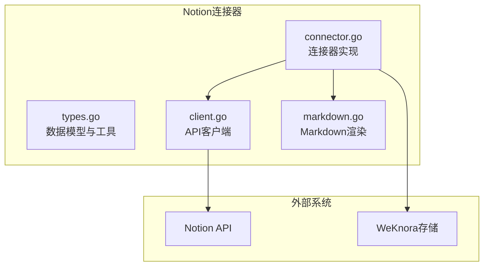
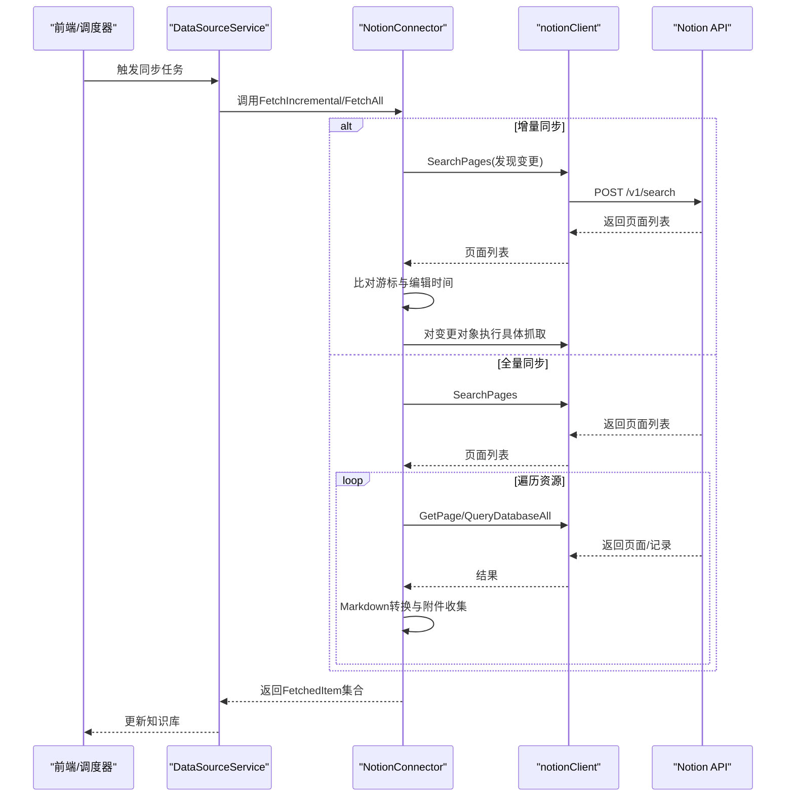
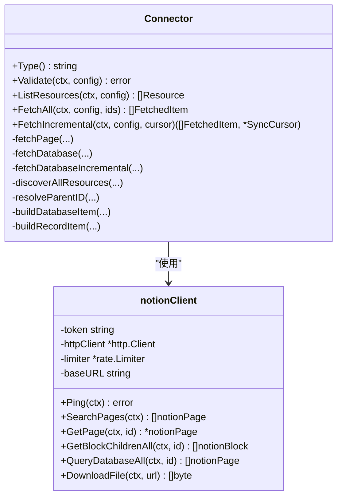
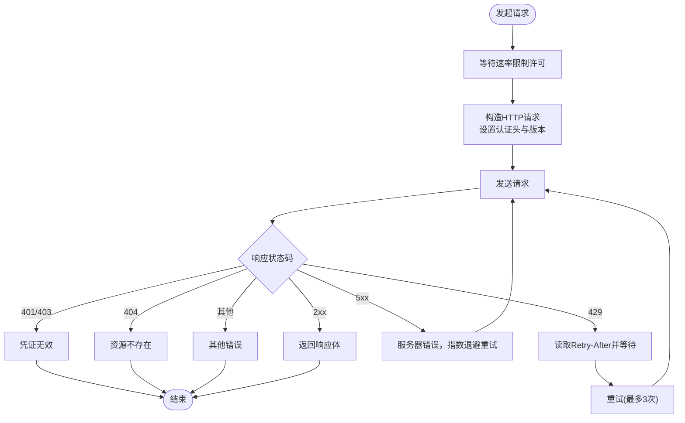
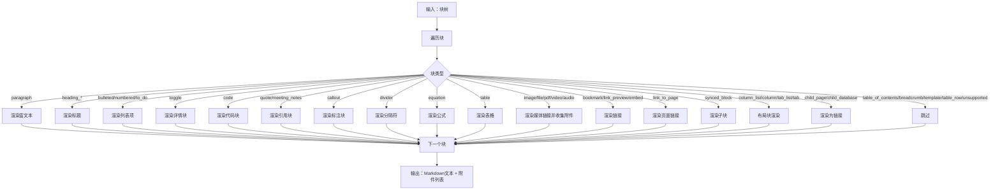
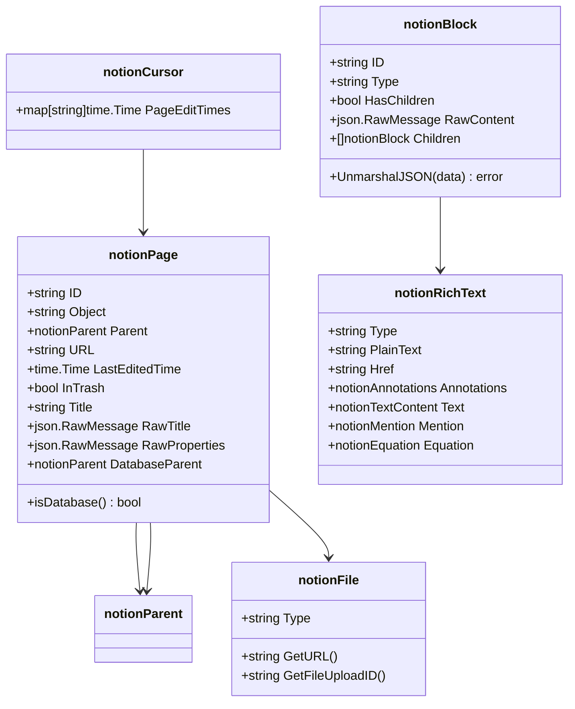
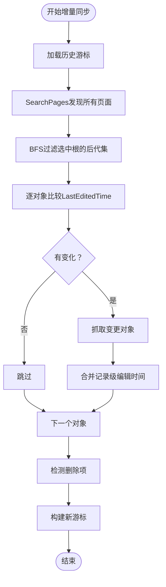
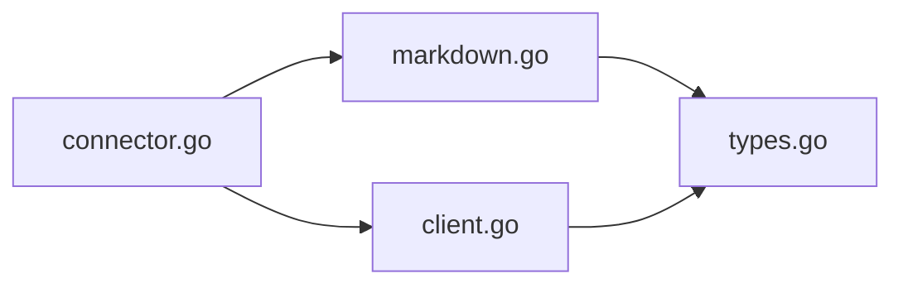

# Notion数据源连接器

<cite>
**本文档引用的文件**
- [connector.go](file://internal/datasource/connector/notion/connector.go)
- [client.go](file://internal/datasource/connector/notion/client.go)
- [types.go](file://internal/datasource/connector/notion/types.go)
- [markdown.go](file://internal/datasource/connector/notion/markdown.go)
- [connector_test.go](file://internal/datasource/connector/notion/connector_test.go)
- [client_test.go](file://internal/datasource/connector/notion/client_test.go)
- [markdown_test.go](file://internal/datasource/connector/notion/markdown_test.go)
- [connector.go](file://internal/datasource/connector.go)
- [README.md](file://internal/datasource/README.md)
</cite>

## 目录
1. [简介](#简介)
2. [项目结构](#项目结构)
3. [核心组件](#核心组件)
4. [架构总览](#架构总览)
5. [详细组件分析](#详细组件分析)
6. [依赖关系分析](#依赖关系分析)
7. [性能考虑](#性能考虑)
8. [故障排除指南](#故障排除指南)
9. [结论](#结论)
10. [附录](#附录)

## 简介
本文件为WeKnora的Notion数据源连接器提供全面技术文档。该连接器实现了与Notion API的完整对接，支持页面与数据库的全量/增量同步、Markdown内容转换、附件下载、删除检测与增量游标管理等能力。文档重点涵盖以下方面：
- OAuth认证流程（基于API密钥）
- API客户端封装与重试/限流策略
- 数据转换机制（块到Markdown、属性到表格）
- 查询策略（页面/数据库/记录）
- 增量同步算法与游标设计
- 缓存与并发控制
- 配置参数、API调用示例与数据映射规则
- 页面类型差异处理、特殊字符编码与格式兼容性

## 项目结构
Notion连接器位于internal/datasource/connector/notion目录下，采用分层设计：
- types.go：Notion API数据模型与工具类型
- client.go：Notion API客户端，封装HTTP请求、重试、限流与分页
- markdown.go：块树到Markdown的渲染引擎
- connector.go：连接器主实现，负责资源发现、全量/增量同步、数据转换与附件处理
- 测试文件：覆盖核心功能与边界场景

**图表来源**
- [connector.go:1-120](file://internal/datasource/connector/notion/connector.go#L1-L120)
- [client.go:1-60](file://internal/datasource/connector/notion/client.go#L1-L60)
- [types.go:1-60](file://internal/datasource/connector/notion/types.go#L1-L60)
- [markdown.go:1-40](file://internal/datasource/connector/notion/markdown.go#L1-L40)

**章节来源**
- [connector.go:1-120](file://internal/datasource/connector/notion/connector.go#L1-L120)
- [client.go:1-60](file://internal/datasource/connector/notion/client.go#L1-L60)
- [types.go:1-60](file://internal/datasource/connector/notion/types.go#L1-L60)
- [markdown.go:1-40](file://internal/datasource/connector/notion/markdown.go#L1-L40)

## 核心组件
- Connector接口实现：实现Type、Validate、ListResources、FetchAll、FetchIncremental等方法，满足WeKnora数据源框架要求
- notionClient：封装Notion API调用，内置速率限制（每秒3次突发3个）、指数退避重试、分页处理、标题提取与文件下载
- Markdown渲染器：将Notion块树转换为Markdown文本，并收集附件引用
- 类型系统：notionPage、notionBlock、notionRichText、notionFile等，支持动态字段解析与自定义反序列化
- 增量游标：notionCursor跟踪页面最后编辑时间，用于增量同步与删除检测

**章节来源**
- [connector.go:23-35](file://internal/datasource/connector/notion/connector.go#L23-L35)
- [client.go:20-40](file://internal/datasource/connector/notion/client.go#L20-L40)
- [types.go:53-121](file://internal/datasource/connector/notion/types.go#L53-L121)
- [markdown.go:9-22](file://internal/datasource/connector/notion/markdown.go#L9-L22)
- [types.go:249-254](file://internal/datasource/connector/notion/types.go#L249-L254)

## 架构总览
连接器遵循WeKnora数据源框架的适配器模式，通过Connector接口与上层业务解耦。整体流程如下：

**图表来源**
- [connector.go:139-256](file://internal/datasource/connector/notion/connector.go#L139-L256)
- [client.go:156-174](file://internal/datasource/connector/notion/client.go#L156-L174)
- [client.go:337-356](file://internal/datasource/connector/notion/client.go#L337-L356)

**章节来源**
- [connector.go:139-256](file://internal/datasource/connector/notion/connector.go#L139-L256)
- [client.go:156-174](file://internal/datasource/connector/notion/client.go#L156-L174)
- [README.md:47-63](file://internal/datasource/README.md#L47-L63)

## 详细组件分析

### Connector实现
- 类型标识：返回ConnectorTypeNotion
- 验证：通过Ping校验API密钥有效性
- 资源列举：使用SearchPages获取页面与数据库，构建父子关系树
- 同步策略：
  - 全量：按资源ID拉取页面或数据库，页面递归展开子块，数据库转为Markdown表格
  - 增量：基于游标比较编辑时间，仅抓取变更；支持数据库内记录级增量
- 删除检测：对比游标中存在但当前不存在的对象，生成删除标记项

**图表来源**
- [connector.go:23-35](file://internal/datasource/connector/notion/connector.go#L23-L35)
- [client.go:20-39](file://internal/datasource/connector/notion/client.go#L20-L39)

**章节来源**
- [connector.go:31-107](file://internal/datasource/connector/notion/connector.go#L31-L107)
- [connector.go:109-137](file://internal/datasource/connector/notion/connector.go#L109-L137)
- [connector.go:139-256](file://internal/datasource/connector/notion/connector.go#L139-L256)

### API客户端封装（notionClient）
- 认证头：Authorization: Bearer {token}，Notion-Version固定版本
- 速率限制：每秒3次，突发3个，避免触发Notion限流
- 重试策略：指数退避（1s, 2s, 4s...），最大重试3次
- 错误处理：
  - 401/403：凭证无效
  - 404：资源不存在
  - 429：根据Retry-After等待
  - 5xx：服务端错误，指数退避
- 分页：统一paginatePages处理page_size与next_cursor
- 特殊能力：
  - GetBlockChildrenFlat：快速扫描子块类型
  - ResolveBlock：解决file_upload类型的临时下载链接
  - DownloadFile：独立下载，限制最大100MB

**图表来源**
- [client.go:55-148](file://internal/datasource/connector/notion/client.go#L55-L148)

**章节来源**
- [client.go:20-40](file://internal/datasource/connector/notion/client.go#L20-L40)
- [client.go:55-148](file://internal/datasource/connector/notion/client.go#L55-L148)
- [client.go:269-335](file://internal/datasource/connector/notion/client.go#L269-L335)
- [client.go:373-421](file://internal/datasource/connector/notion/client.go#L373-L421)

### Markdown转换引擎
- 支持块类型：段落、标题、列表、待办、折叠、代码、引用、标注、分隔符、公式、表格、媒体、链接、子页面/数据库、列/标签页等
- 富文本渲染：粗体、斜体、删除线、下划线、代码、链接等注解
- 表格渲染：从table/table_row块生成Markdown表格
- 附件收集：图片、文件、PDF、视频、音频作为附件引用，不重复下载图片
- 列表间距：自动合并连续空行，避免过多空白

**图表来源**
- [markdown.go:49-235](file://internal/datasource/connector/notion/markdown.go#L49-L235)

**章节来源**
- [markdown.go:9-22](file://internal/datasource/connector/notion/markdown.go#L9-L22)
- [markdown.go:49-235](file://internal/datasource/connector/notion/markdown.go#L49-L235)
- [markdown.go:255-279](file://internal/datasource/connector/notion/markdown.go#L255-L279)

### 数据模型与类型系统
- notionPage：页面/数据库对象，支持RawProperties与RawTitle，动态提取标题
- notionBlock：块对象，自定义UnmarshalJSON将type对应的嵌套字段抽取到RawContent
- notionRichText：富文本元素，支持text、mention、equation与注解
- notionFile：文件对象，支持hosted、external与file_upload三种类型
- notionCursor：增量游标，记录page_id→last_edited_time映射

**图表来源**
- [types.go:53-121](file://internal/datasource/connector/notion/types.go#L53-L121)
- [types.go:155-225](file://internal/datasource/connector/notion/types.go#L155-L225)
- [types.go:249-254](file://internal/datasource/connector/notion/types.go#L249-L254)

**章节来源**
- [types.go:53-121](file://internal/datasource/connector/notion/types.go#L53-L121)
- [types.go:155-225](file://internal/datasource/connector/notion/types.go#L155-L225)
- [types.go:249-254](file://internal/datasource/connector/notion/types.go#L249-L254)

### 增量同步算法与游标
- 首次同步：直接走全量路径，随后基于已获取项目的UpdatedAt构建游标
- 后续同步：
  - 使用SearchPages发现所有页面，BFS过滤出选中根节点的后代集
  - 比较每个对象的LastEditedTime与游标中的时间，有变化则抓取
  - 数据库记录：按记录粒度比较编辑时间，任一记录变化则重建整表
  - 删除检测：若某对象在游标中存在但在当前发现集中缺失且不在排除集，则标记删除
- 游标构建：将页面/数据库/记录的编辑时间写入ConnectorCursor

**图表来源**
- [connector.go:139-256](file://internal/datasource/connector/notion/connector.go#L139-L256)
- [connector.go:640-702](file://internal/datasource/connector/notion/connector.go#L640-L702)

**章节来源**
- [connector.go:139-256](file://internal/datasource/connector/notion/connector.go#L139-L256)
- [connector.go:640-702](file://internal/datasource/connector/notion/connector.go#L640-L702)

### 附件处理逻辑
- 文件上传块：先ResolveBlock获取临时下载URL，再DownloadFile下载
- 附件类型：除图片外的文件、PDF、视频、音频作为独立条目入库
- 图片处理：仅生成Markdown引用，不单独下载为附件条目
- 大小限制：下载上限100MB，超限报错

**章节来源**
- [connector.go:342-367](file://internal/datasource/connector/notion/connector.go#L342-L367)
- [client.go:358-421](file://internal/datasource/connector/notion/client.go#L358-L421)
- [types.go:257-262](file://internal/datasource/connector/notion/types.go#L257-L262)

### 页面/数据库/记录的差异化处理
- 页面：按块树渲染为Markdown，支持子页面/数据库块的递归抓取
- 数据库：转为Markdown表格，包含标题与属性列；记录内容作为额外段落追加
- 记录：识别父类型为database_id或data_source_id的页面即为记录，优先走buildRecordItem路径

**章节来源**
- [connector.go:275-383](file://internal/datasource/connector/notion/connector.go#L275-L383)
- [connector.go:385-413](file://internal/datasource/connector/notion/connector.go#L385-L413)
- [connector.go:487-541](file://internal/datasource/connector/notion/connector.go#L487-L541)
- [connector.go:543-638](file://internal/datasource/connector/notion/connector.go#L543-L638)

### 配置参数与API调用示例
- 配置参数
  - credentials.api_key：Notion内部集成令牌（必需）
  - settings.base_url：可选，自定义Notion API基础URL，默认为官方地址
- API调用示例（基于测试用例）
  - 验证连接：GET /v1/users/me
  - 列举资源：POST /v1/search
  - 获取页面：GET /v1/pages/{id}
  - 获取块子树：GET /v1/blocks/{id}/children（分页）
  - 查询数据库：POST /v1/data_sources/{id}/query（或通过容器ID解析后查询）
  - 解析文件上传：GET /v1/blocks/{id}（重新获取以获得临时下载URL）

**章节来源**
- [connector.go:36-45](file://internal/datasource/connector/notion/connector.go#L36-L45)
- [client.go:150-174](file://internal/datasource/connector/notion/client.go#L150-L174)
- [client.go:337-356](file://internal/datasource/connector/notion/client.go#L337-L356)
- [client.go:358-371](file://internal/datasource/connector/notion/client.go#L358-L371)
- [connector_test.go:11-22](file://internal/datasource/connector/notion/connector_test.go#L11-L22)
- [client_test.go:12-230](file://internal/datasource/connector/notion/client_test.go#L12-L230)

### 数据映射规则
- FetchedItem元数据
  - channel：notion
  - object_type：page、database、attachment
  - database：数据库标题（仅记录/数据库项）
- Markdown命名
  - 页面：以页面标题命名，无标题时使用“未命名”
  - 附件：以文件名命名，类型映射为标准MIME类型

**章节来源**
- [connector.go:327-340](file://internal/datasource/connector/notion/connector.go#L327-L340)
- [connector.go:354-366](file://internal/datasource/connector/notion/connector.go#L354-L366)
- [connector.go:625-638](file://internal/datasource/connector/notion/connector.go#L625-L638)
- [connector.go:931-944](file://internal/datasource/connector/notion/connector.go#L931-L944)

### 特殊字符编码与格式兼容性
- Markdown转义：表格单元格中的“|”字符进行转义
- 富文本注解：粗体、斜体、删除线、下划线、代码等正确包裹
- 公式渲染：行内公式$...$与块级公式$$...$$
- 日期范围：日期提及显示为“开始 → 结束”
- 未知块类型：静默跳过，保证向前兼容

**章节来源**
- [markdown.go:586-596](file://internal/datasource/connector/notion/markdown.go#L586-L596)
- [markdown.go:344-366](file://internal/datasource/connector/notion/markdown.go#L344-L366)
- [markdown.go:800-814](file://internal/datasource/connector/notion/markdown.go#L800-L814)
- [markdown.go:232-235](file://internal/datasource/connector/notion/markdown.go#L232-L235)

## 依赖关系分析
- 组件耦合
  - Connector依赖notionClient与Markdown渲染器
  - notionClient依赖HTTP客户端与速率限制器
  - Markdown渲染器依赖notionBlock与notionRichText模型
- 外部依赖
  - Notion API：Search、Pages、Blocks、Databases、DataSources等端点
  - HTTP与速率限制库：net/http、golang.org/x/time/rate
- 可能的循环依赖
  - 当前模块间无循环导入，结构清晰

**图表来源**
- [connector.go:1-20](file://internal/datasource/connector/notion/connector.go#L1-L20)
- [client.go:1-20](file://internal/datasource/connector/notion/client.go#L1-L20)
- [markdown.go:1-10](file://internal/datasource/connector/notion/markdown.go#L1-L10)
- [types.go:1-20](file://internal/datasource/connector/notion/types.go#L1-L20)

**章节来源**
- [connector.go:1-20](file://internal/datasource/connector/notion/connector.go#L1-L20)
- [client.go:1-20](file://internal/datasource/connector/notion/client.go#L1-L20)
- [markdown.go:1-10](file://internal/datasource/connector/notion/markdown.go#L1-L10)
- [types.go:1-20](file://internal/datasource/connector/notion/types.go#L1-L20)

## 性能考虑
- 速率限制：每秒3次请求，避免触发Notion限流
- 分页与深度限制：分页获取块，限制最大块数与递归深度，防止过度API调用
- 增量同步：通过编辑时间差分减少全量抓取
- 下载大小限制：防止大文件导致内存压力
- 并发控制：当前实现为单实例同步，建议在上层任务队列中串行化同一数据源的多次同步

[本节为通用指导，无需特定文件引用]

## 故障排除指南
- 凭证无效
  - 现象：401/403错误
  - 排查：确认api_key是否正确、权限是否足够
- 资源不存在
  - 现象：404错误
  - 排查：检查资源ID是否有效，确认资源是否被移动或删除
- 限流
  - 现象：429错误
  - 排查：等待Retry-After指定时间后重试
- 服务器错误
  - 现象：5xx错误
  - 排查：指数退避重试，关注服务可用性
- 下载失败
  - 现象：文件下载失败或超过大小限制
  - 排查：检查URL有效性、文件大小是否超过100MB

**章节来源**
- [client.go:109-147](file://internal/datasource/connector/notion/client.go#L109-L147)
- [client.go:383-421](file://internal/datasource/connector/notion/client.go#L383-L421)

## 结论
WeKnora的Notion连接器通过清晰的分层设计与完善的错误处理，实现了对Notion页面与数据库的稳定同步。其核心优势包括：
- 增量同步与删除检测，显著降低API调用成本
- 完整的Markdown渲染与附件处理，确保内容完整性
- 严格的速率限制与重试策略，提升稳定性
- 易于扩展的类型系统与测试覆盖，便于维护与演进

[本节为总结，无需特定文件引用]

## 附录

### API端点与行为摘要
- GET /v1/users/me：验证API密钥
- POST /v1/search：列举页面与数据库
- GET /v1/pages/{id}：获取页面详情
- GET /v1/blocks/{id}/children：分页获取块子树
- GET /v1/databases/{id}：获取数据库容器（含data_sources数组）
- GET /v1/data_sources/{id}：获取数据源schema
- POST /v1/data_sources/{id}/query：查询数据库记录
- GET /v1/blocks/{id}：解析file_upload类型以获取临时下载URL

**章节来源**
- [client.go:150-174](file://internal/datasource/connector/notion/client.go#L150-L174)
- [client.go:182-228](file://internal/datasource/connector/notion/client.go#L182-L228)
- [client.go:337-356](file://internal/datasource/connector/notion/client.go#L337-L356)
- [client.go:358-371](file://internal/datasource/connector/notion/client.go#L358-L371)

### 配置参数清单
- credentials.api_key：字符串，必填
- settings.base_url：字符串，可选

**章节来源**
- [connector.go:34-49](file://internal/datasource/connector/notion/connector.go#L34-L49)
- [connector.go:922-929](file://internal/datasource/connector/notion/connector.go#L922-L929)