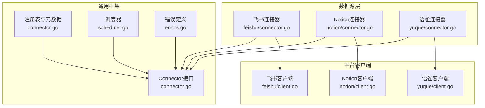
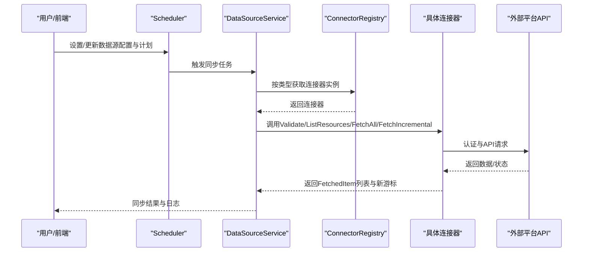
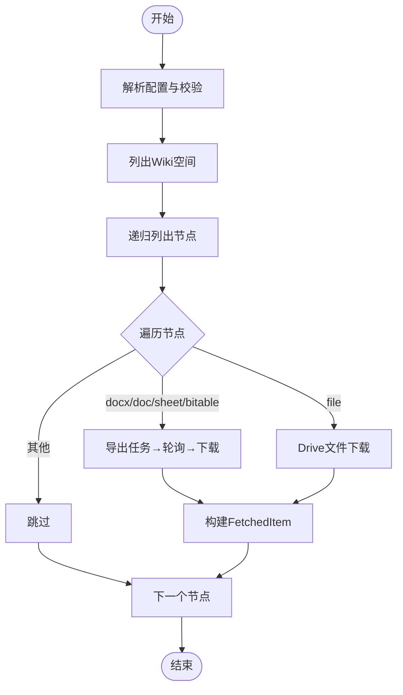
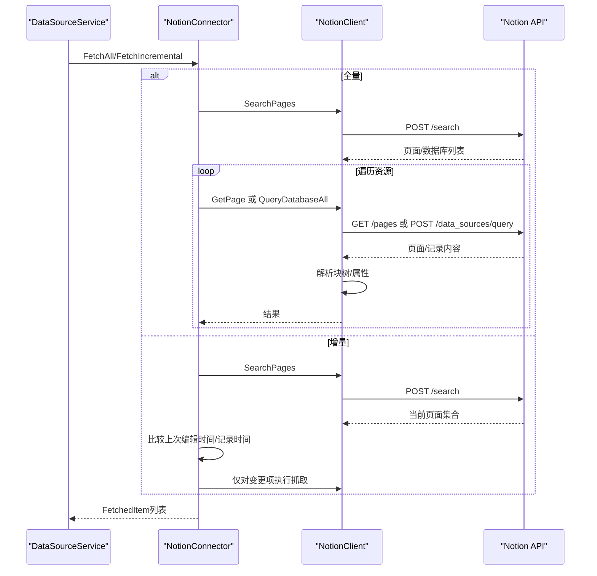
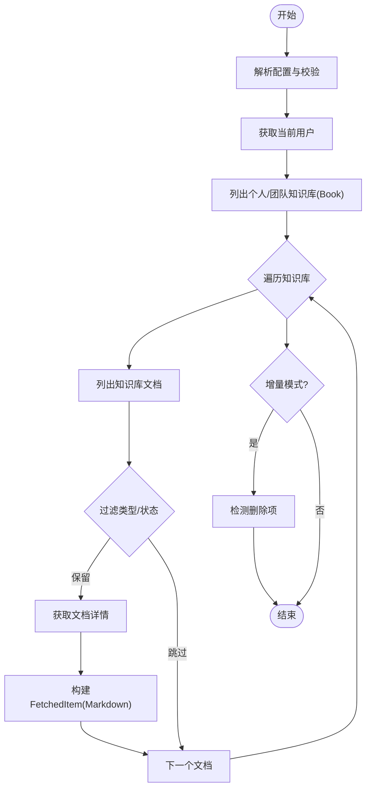
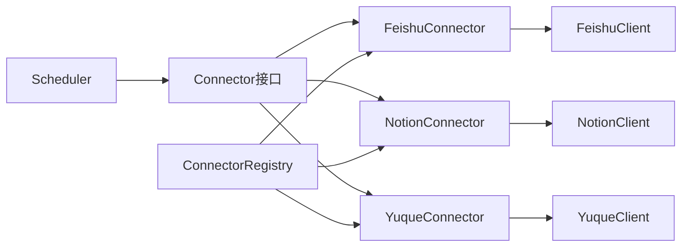

# 数据源连接器实现

<cite>
**本文档引用的文件**
- [connector.go](file://internal/datasource/connector.go)
- [README.md](file://internal/datasource/README.md)
- [CONNECTOR_IMPLEMENTATION_GUIDE.md](file://internal/datasource/CONNECTOR_IMPLEMENTATION_GUIDE.md)
- [scheduler.go](file://internal/datasource/scheduler.go)
- [errors.go](file://internal/datasource/errors.go)
- [feishu/client.go](file://internal/datasource/connector/feishu/client.go)
- [feishu/connector.go](file://internal/datasource/connector/feishu/connector.go)
- [feishu/types.go](file://internal/datasource/connector/feishu/types.go)
- [notion/client.go](file://internal/datasource/connector/notion/client.go)
- [notion/connector.go](file://internal/datasource/connector/notion/connector.go)
- [notion/types.go](file://internal/datasource/connector/notion/types.go)
- [yuque/client.go](file://internal/datasource/connector/yuque/client.go)
- [yuque/connector.go](file://internal/datasource/connector/yuque/connector.go)
- [yuque/types.go](file://internal/datasource/connector/yuque/types.go)
</cite>

## 目录
1. [简介](#简介)
2. [项目结构](#项目结构)
3. [核心组件](#核心组件)
4. [架构总览](#架构总览)
5. [详细组件分析](#详细组件分析)
6. [依赖关系分析](#依赖关系分析)
7. [性能考虑](#性能考虑)
8. [故障排查指南](#故障排查指南)
9. [结论](#结论)
10. [附录](#附录)

## 简介
本文件面向WeKnora数据源同步框架，系统化梳理并深入解析各外部数据源连接器的实现细节与扩展开发流程。重点覆盖飞书(Feishu)、Notion、语雀(Yuque)三大连接器的认证机制、API调用方式、增量/全量同步策略、错误处理与配置参数，并提供可直接落地的扩展开发指南与测试验证方法。

## 项目结构
WeKnora的数据源同步采用“适配器模式”，通过统一的Connector接口对接不同平台；调度层负责周期性触发同步任务；业务层负责资源发现、差异计算与知识入库；类型与错误定义位于公共模块，确保跨连接器一致性。

图表来源
- [connector.go:11-31](file://internal/datasource/connector.go#L11-L31)
- [scheduler.go:18-52](file://internal/datasource/scheduler.go#L18-L52)
- [feishu/connector.go:15-26](file://internal/datasource/connector/feishu/connector.go#L15-L26)
- [notion/connector.go:23-34](file://internal/datasource/connector/notion/connector.go#L23-L34)
- [yuque/connector.go:21-28](file://internal/datasource/connector/yuque/connector.go#L21-L28)

章节来源
- [README.md:1-261](file://internal/datasource/README.md#L1-L261)
- [connector.go:1-208](file://internal/datasource/connector.go#L1-L208)

## 核心组件
- Connector接口：定义统一能力集（类型标识、连通性校验、资源列举、全量/增量抓取）。
- ConnectorRegistry：注册与查找连接器实例，维护可用连接器元数据（名称、描述、认证方式、能力）。
- 调度器Scheduler：基于cron表达式定时触发同步任务，支持去重与并发控制。
- 错误体系：对连接器、数据源、配置、同步、日志等场景进行细粒度错误分类。

章节来源
- [connector.go:11-31](file://internal/datasource/connector.go#L11-L31)
- [connector.go:34-73](file://internal/datasource/connector.go#L34-L73)
- [scheduler.go:18-52](file://internal/datasource/scheduler.go#L18-L52)
- [errors.go:6-32](file://internal/datasource/errors.go#L6-L32)

## 架构总览
下图展示从用户配置到增量/全量同步执行的关键路径，以及与平台API交互的时序。

图表来源
- [scheduler.go:132-203](file://internal/datasource/scheduler.go#L132-L203)
- [connector.go:11-31](file://internal/datasource/connector.go#L11-L31)
- [README.md:47-63](file://internal/datasource/README.md#L47-L63)

## 详细组件分析

### 飞书(Feishu)连接器
- 认证机制
  - 使用企业自建应用的内部租户访问令牌(tenant_access_token)，自动缓存与续期，避免频繁鉴权。
  - 客户端封装doRequest，统一设置Authorization头与日志输出。
- API调用方式
  - Wiki空间与节点：ListWikiSpaces、ListAllWikiNodesRecursive递归遍历。
  - 文档导出：ExportAndDownload通过异步导出任务API获取docx/xlsx/pdf等文件字节流。
  - 原始文件下载：针对file类型的wiki节点，走Drive下载接口。
- 数据获取策略
  - 全量：遍历选中空间下的所有节点，按对象类型选择导出或下载策略。
  - 增量：以节点内容编辑时间(obj_edit_time)与节点属性编辑时间(node_edit_time)对比，检测变更；记录删除项。
- 错误处理
  - 统一返回带上下文的错误；对429/5xx进行指数退避重试；失败项记录错误元数据继续推进。
- 配置参数与权限
  - 配置字段：app_id、app_secret、base_url（默认飞书，国际版可切换至Lark）。
  - 权限要求：需具备对应空间的访问权限与文档导出能力。
- 使用限制
  - mindnote/slides不支持内容读取；导出任务有超时上限；下载链接有时效窗口。

图表来源
- [feishu/connector.go:74-113](file://internal/datasource/connector/feishu/connector.go#L74-L113)
- [feishu/connector.go:117-227](file://internal/datasource/connector/feishu/connector.go#L117-L227)
- [feishu/client.go:299-411](file://internal/datasource/connector/feishu/client.go#L299-L411)

章节来源
- [feishu/connector.go:23-41](file://internal/datasource/connector/feishu/connector.go#L23-L41)
- [feishu/connector.go:43-71](file://internal/datasource/connector/feishu/connector.go#L43-L71)
- [feishu/connector.go:74-113](file://internal/datasource/connector/feishu/connector.go#L74-L113)
- [feishu/connector.go:117-227](file://internal/datasource/connector/feishu/connector.go#L117-L227)
- [feishu/client.go:40-95](file://internal/datasource/connector/feishu/client.go#L40-L95)
- [feishu/client.go:299-411](file://internal/datasource/connector/feishu/client.go#L299-L411)
- [feishu/types.go:15-41](file://internal/datasource/connector/feishu/types.go#L15-L41)
- [feishu/types.go:198-206](file://internal/datasource/connector/feishu/types.go#L198-L206)

### Notion连接器
- 认证机制
  - 使用内部集成令牌(api_key)，通过Ping校验连通性。
- API调用方式
  - 搜索：SearchPages一次性获取工作区内的页面与数据库/数据源。
  - 页面：GetPage获取页面元信息；GetBlockChildrenAll递归拉取块树（限制最大深度与每页块数）。
  - 数据库：QueryDatabaseAll查询记录；ResolveBlock解决file_upload类型的临时下载地址。
  - 文件：DownloadFile下载S3签名URL（带大小限制与重试）。
- 数据获取策略
  - 全量：对选中资源逐一fetchPage/fetchDatabase，构建Markdown内容与附件。
  - 增量：首次同步退化为全量；后续基于页面最后编辑时间diff，数据库记录级也做增量处理；检测删除项。
- 错误处理
  - 对401/403明确返回无效凭证；429按Retry-After或指数退避；5xx有限重试；失败项记录元数据。
- 配置参数与权限
  - 配置字段：api_key；可选base_url（默认官方API）。
  - 权限要求：集成令牌需具备目标工作区的读取权限。
- 使用限制
  - 块树深度与数量限制；file_upload需二次解析；大文件下载有上限。

图表来源
- [notion/connector.go:109-137](file://internal/datasource/connector/notion/connector.go#L109-L137)
- [notion/connector.go:139-256](file://internal/datasource/connector/notion/connector.go#L139-L256)
- [notion/client.go:157-174](file://internal/datasource/connector/notion/client.go#L157-L174)
- [notion/client.go:276-335](file://internal/datasource/connector/notion/client.go#L276-L335)
- [notion/client.go:340-356](file://internal/datasource/connector/notion/client.go#L340-L356)

章节来源
- [notion/connector.go:36-45](file://internal/datasource/connector/notion/connector.go#L36-L45)
- [notion/connector.go:47-107](file://internal/datasource/connector/notion/connector.go#L47-L107)
- [notion/connector.go:109-137](file://internal/datasource/connector/notion/connector.go#L109-L137)
- [notion/connector.go:139-256](file://internal/datasource/connector/notion/connector.go#L139-L256)
- [notion/client.go:20-39](file://internal/datasource/connector/notion/client.go#L20-L39)
- [notion/client.go:56-148](file://internal/datasource/connector/notion/client.go#L56-L148)
- [notion/client.go:276-335](file://internal/datasource/connector/notion/client.go#L276-L335)
- [notion/client.go:340-356](file://internal/datasource/connector/notion/client.go#L340-L356)
- [notion/types.go:28-49](file://internal/datasource/connector/notion/types.go#L28-L49)
- [notion/types.go:53-110](file://internal/datasource/connector/notion/types.go#L53-L110)
- [notion/types.go:249-253](file://internal/datasource/connector/notion/types.go#L249-L253)

### 语雀(Yuque)连接器
- 认证机制
  - 使用个人令牌X-Auth-Token，通过Ping校验当前用户身份。
- API调用方式
  - 用户与群组：GetCurrentUser、ListUserGroups。
  - 知识库与文档：ListUserRepos/ListGroupRepos、ListBookDocs、GetDocDetail。
  - 分页：统一使用offset/limit分页，过滤仅保留文档型知识库(Book)。
- 数据获取策略
  - 全量：遍历选中知识库的所有文档，过滤非Doc类型与草稿，仅保留Markdown/Lake格式正文。
  - 增量：以content_updated_at作为变更依据，记录删除项（当前列表缺失的先前文档ID）。
- 错误处理
  - 401/403明确返回无效凭证；429按Retry-After或指数退避；5xx有限重试；失败项记录元数据。
- 配置参数与权限
  - 配置字段：api_token、base_url（默认公有云）。
  - 权限要求：令牌需能访问目标用户/群组的知识库。
- 使用限制
  - 仅同步Doc类型与已发布状态；私有库图片可能因CDN鉴权无法加载；Lake格式非标准Markdown需注意兼容。

图表来源
- [yuque/connector.go:111-114](file://internal/datasource/connector/yuque/connector.go#L111-L114)
- [yuque/connector.go:118-265](file://internal/datasource/connector/yuque/connector.go#L118-L265)
- [yuque/connector.go:279-312](file://internal/datasource/connector/yuque/connector.go#L279-L312)
- [yuque/client.go:240-286](file://internal/datasource/connector/yuque/client.go#L240-L286)
- [yuque/client.go:288-297](file://internal/datasource/connector/yuque/client.go#L288-L297)

章节来源
- [yuque/connector.go:30-41](file://internal/datasource/connector/yuque/connector.go#L30-L41)
- [yuque/connector.go:43-108](file://internal/datasource/connector/yuque/connector.go#L43-L108)
- [yuque/connector.go:111-114](file://internal/datasource/connector/yuque/connector.go#L111-L114)
- [yuque/connector.go:118-265](file://internal/datasource/connector/yuque/connector.go#L118-L265)
- [yuque/connector.go:279-312](file://internal/datasource/connector/yuque/connector.go#L279-L312)
- [yuque/client.go:47-151](file://internal/datasource/connector/yuque/client.go#L47-L151)
- [yuque/client.go:240-297](file://internal/datasource/connector/yuque/client.go#L240-L297)
- [yuque/types.go:35-81](file://internal/datasource/connector/yuque/types.go#L35-L81)
- [yuque/types.go:205-210](file://internal/datasource/connector/yuque/types.go#L205-L210)

## 依赖关系分析
- 接口耦合
  - 所有连接器均实现Connector接口，解耦上层业务逻辑与平台差异。
  - ConnectorRegistry集中管理连接器注册与查找，便于扩展新增连接器。
- 外部依赖
  - asynq用于异步任务队列；robfig/cron用于定时调度；HTTP客户端封装统一错误与重试。
- 循环依赖
  - 连接器与客户端双向协作但无循环导入；类型与错误定义在独立包，被连接器共享。

图表来源
- [connector.go:34-73](file://internal/datasource/connector.go#L34-L73)
- [scheduler.go:18-52](file://internal/datasource/scheduler.go#L18-L52)
- [feishu/connector.go:15-26](file://internal/datasource/connector/feishu/connector.go#L15-L26)
- [notion/connector.go:23-34](file://internal/datasource/connector/notion/connector.go#L23-L34)
- [yuque/connector.go:21-28](file://internal/datasource/connector/yuque/connector.go#L21-L28)

章节来源
- [connector.go:34-73](file://internal/datasource/connector.go#L34-L73)
- [scheduler.go:18-52](file://internal/datasource/scheduler.go#L18-L52)

## 性能考虑
- 请求限流与退避
  - Notion连接器内置速率限制器与指数退避；语雀连接器对429与5xx进行可控重试。
- 分页与批量
  - 三大连接器均采用分页策略，避免单次请求过大；飞书导出任务轮询避免阻塞。
- 内容体积控制
  - Notion对文件下载设置上限，防止内存溢出；语雀对文件名进行UTF-8安全截断。
- 增量同步
  - 通过游标记录上次编辑时间，减少重复抓取；飞书基于节点编辑时间，语雀基于内容更新时间。

章节来源
- [notion/client.go:26-39](file://internal/datasource/connector/notion/client.go#L26-L39)
- [notion/client.go:115-148](file://internal/datasource/connector/notion/client.go#L115-L148)
- [yuque/client.go:47-151](file://internal/datasource/connector/yuque/client.go#L47-L151)
- [yuque/client.go:373-421](file://internal/datasource/connector/yuque/client.go#L373-L421)
- [feishu/client.go:299-411](file://internal/datasource/connector/feishu/client.go#L299-L411)

## 故障排查指南
- 常见错误定位
  - 无效凭证：Notion/语雀在401/403时明确返回无效凭证错误；飞书在获取token或请求失败时返回带上下文的错误。
  - 资源不存在：Notion在404时返回资源未找到错误；语雀在API返回非2xx时解析错误体。
  - 速率限制：Notion/语雀在429时根据Retry-After或指数退避；检查平台配额与重试策略。
- 日志与追踪
  - 各客户端均输出请求/响应摘要与状态码，便于定位异常；飞书导出任务轮询过程有明确提示。
- 建议排查步骤
  - 先Validate连通性，再ListResources确认可见范围。
  - 小范围资源(FetchAll)验证内容质量与格式。
  - 增量同步先观察游标变化，再逐步扩大资源范围。

章节来源
- [errors.go:12-26](file://internal/datasource/errors.go#L12-L26)
- [notion/client.go:109-148](file://internal/datasource/connector/notion/client.go#L109-L148)
- [yuque/client.go:105-141](file://internal/datasource/connector/yuque/client.go#L105-L141)
- [feishu/client.go:138-149](file://internal/datasource/connector/feishu/client.go#L138-L149)

## 结论
WeKnora的数据源连接器通过统一接口与注册表实现了良好的可扩展性；三大连接器分别针对平台特性设计了稳健的认证、API调用与增量策略；结合完善的错误处理与性能优化，能够稳定支撑多源内容的导入与同步。新增连接器可遵循现有指南，快速完成适配与集成。

## 附录

### 新连接器扩展开发指南
- 包结构与职责
  - client.go：封装平台API调用、认证、分页、重试与错误转换。
  - connector.go：实现Connector接口（Type/Validate/ListResources/FetchAll/FetchIncremental）。
  - types.go：定义平台特定的配置、响应结构与游标。
- 实现要点
  - 认证：优先使用平台推荐的令牌/密钥方式，封装统一鉴权与缓存。
  - 资源发现：提供可选资源树/列表，便于前端选择。
  - 全量/增量：明确变更判定维度（时间戳/版本号），保证幂等与去重。
  - 错误处理：区分瞬时错误与永久错误，合理重试与降级。
- 注册与元数据
  - 在容器中注册连接器实例；在元数据表中补充名称、描述、认证方式与能力。
- 测试与验证
  - 单元测试覆盖关键路径；小样本真实API验证；逐步扩大资源规模。

章节来源
- [CONNECTOR_IMPLEMENTATION_GUIDE.md:1-498](file://internal/datasource/CONNECTOR_IMPLEMENTATION_GUIDE.md#L1-L498)
- [connector.go:86-185](file://internal/datasource/connector.go#L86-L185)