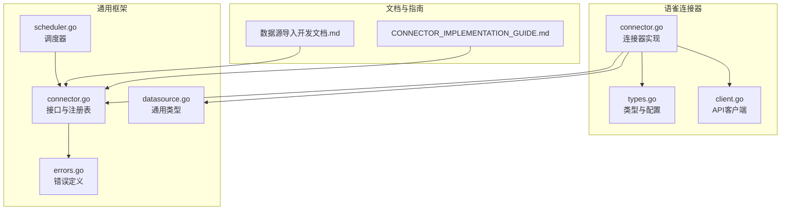
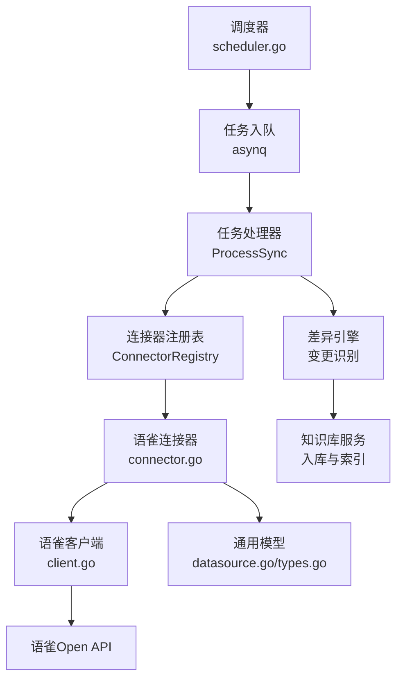
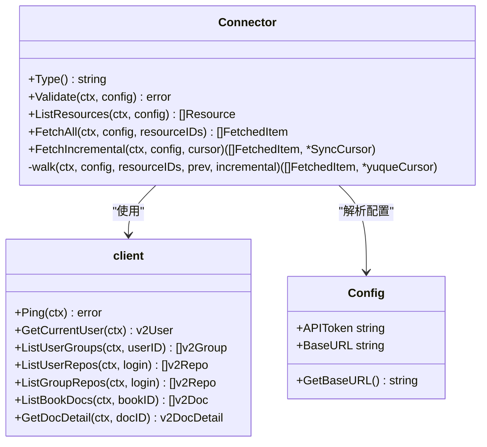
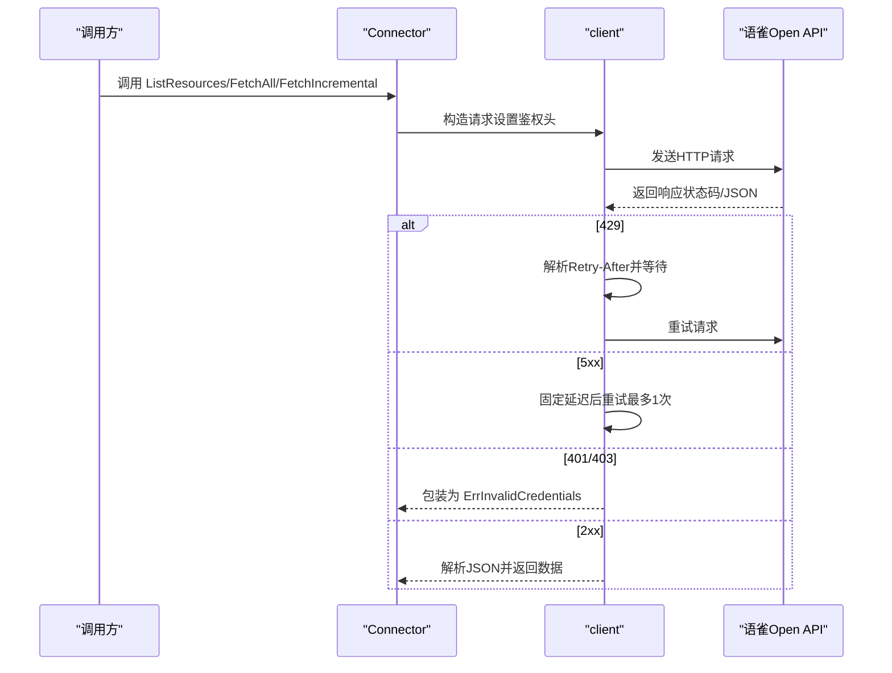
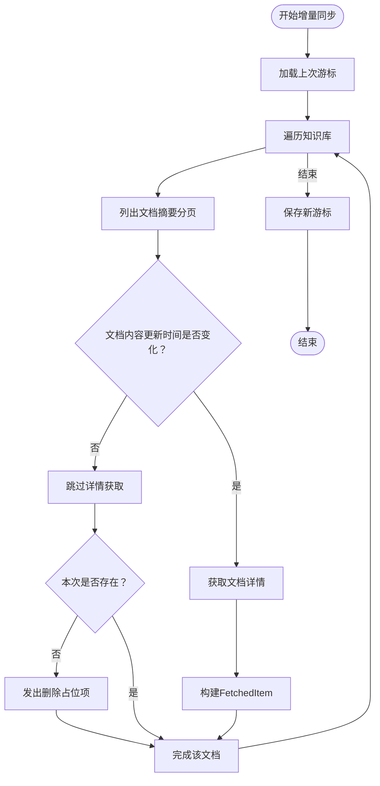
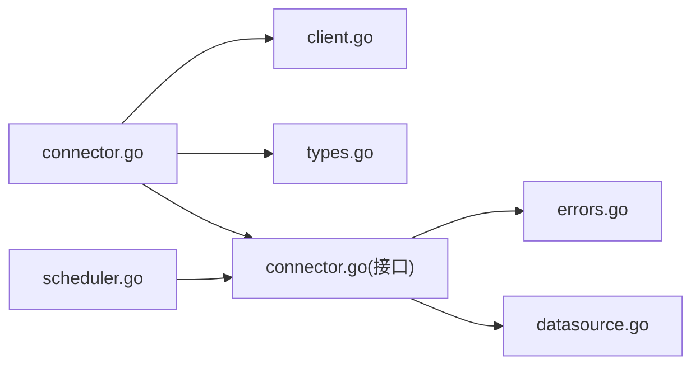

# 语雀数据源连接器

<cite>
**本文引用的文件**
- [connector.go](file://internal/datasource/connector/yuque/connector.go)
- [client.go](file://internal/datasource/connector/yuque/client.go)
- [types.go](file://internal/datasource/connector/yuque/types.go)
- [connector_test.go](file://internal/datasource/connector/yuque/connector_test.go)
- [client_test.go](file://internal/datasource/connector/yuque/client_test.go)
- [datasource.go](file://internal/types/datasource.go)
- [connector.go](file://internal/datasource/connector.go)
- [errors.go](file://internal/datasource/errors.go)
- [scheduler.go](file://internal/datasource/scheduler.go)
- [数据源导入开发文档.md](file://docs/数据源导入开发文档.md)
- [CONNECTOR_IMPLEMENTATION_GUIDE.md](file://internal/datasource/CONNECTOR_IMPLEMENTATION_GUIDE.md)
</cite>

## 目录
1. [简介](#简介)
2. [项目结构](#项目结构)
3. [核心组件](#核心组件)
4. [架构总览](#架构总览)
5. [详细组件分析](#详细组件分析)
6. [依赖关系分析](#依赖关系分析)
7. [性能考量](#性能考量)
8. [故障排查指南](#故障排查指南)
9. [结论](#结论)
10. [附录](#附录)

## 简介
本文件面向WeKnora的语雀（Yuque）数据源连接器，系统性阐述其架构设计、认证机制、API封装、数据获取策略、文档树遍历、增量更新与版本控制、Markdown内容解析与图片资源处理、链接转换、配置参数、API调用示例以及错误处理机制。同时结合WeKnora整体数据源同步框架，说明该连接器如何与调度器、任务队列、知识库入库流水线协同工作。

## 项目结构
语雀连接器位于内部模块的“数据源连接器”体系下，采用标准的三文件结构：types.go（平台类型定义）、client.go（API客户端封装）、connector.go（连接器实现）。配合通用的数据源类型、接口与错误定义，以及调度与测试代码，形成完整的同步链路。

**图表来源**
- [connector.go:1-313](file://internal/datasource/connector/yuque/connector.go#L1-L313)
- [client.go:1-297](file://internal/datasource/connector/yuque/client.go#L1-L297)
- [types.go:1-262](file://internal/datasource/connector/yuque/types.go#L1-L262)
- [connector.go:1-208](file://internal/datasource/connector.go#L1-L208)
- [datasource.go:1-418](file://internal/types/datasource.go#L1-L418)
- [errors.go:1-33](file://internal/datasource/errors.go#L1-L33)
- [scheduler.go:1-211](file://internal/datasource/scheduler.go#L1-L211)
- [数据源导入开发文档.md:124-197](file://docs/数据源导入开发文档.md#L124-L197)
- [CONNECTOR_IMPLEMENTATION_GUIDE.md:1-498](file://internal/datasource/CONNECTOR_IMPLEMENTATION_GUIDE.md#L1-L498)

**章节来源**
- [connector.go:1-313](file://internal/datasource/connector/yuque/connector.go#L1-L313)
- [client.go:1-297](file://internal/datasource/connector/yuque/client.go#L1-L297)
- [types.go:1-262](file://internal/datasource/connector/yuque/types.go#L1-L262)
- [connector.go:1-208](file://internal/datasource/connector.go#L1-L208)
- [datasource.go:1-418](file://internal/types/datasource.go#L1-L418)
- [errors.go:1-33](file://internal/datasource/errors.go#L1-L33)
- [scheduler.go:1-211](file://internal/datasource/scheduler.go#L1-L211)
- [数据源导入开发文档.md:124-197](file://docs/数据源导入开发文档.md#L124-L197)
- [CONNECTOR_IMPLEMENTATION_GUIDE.md:1-498](file://internal/datasource/CONNECTOR_IMPLEMENTATION_GUIDE.md#L1-L498)

## 核心组件
- 连接器接口与注册表：定义统一的Connector接口，提供按类型查找、注册能力；语雀连接器通过注册表被框架发现并调度。
- 通用数据模型：包含数据源配置、资源、抓取项、游标、同步结果等跨平台通用结构。
- 语雀连接器：实现Validate、ListResources、FetchAll、FetchIncremental四个关键方法，负责与语雀Open API交互、过滤与转换数据。
- 语雀API客户端：封装HTTP请求、重试与退避、鉴权头设置、分页与错误归类（429、5xx、401/403等）。
- 错误与异常：统一的错误类型，便于上层区分无效凭据、配置错误、资源不存在等场景。
- 调度器：基于cron的周期调度，结合任务队列去重，确保多实例环境下不重复执行。

**章节来源**
- [connector.go:9-31](file://internal/datasource/connector.go#L9-L31)
- [datasource.go:11-418](file://internal/types/datasource.go#L11-L418)
- [connector.go:21-41](file://internal/datasource/connector/yuque/connector.go#L21-L41)
- [client.go:23-41](file://internal/datasource/connector/yuque/client.go#L23-L41)
- [errors.go:6-32](file://internal/datasource/errors.go#L6-L32)
- [scheduler.go:18-52](file://internal/datasource/scheduler.go#L18-L52)

## 架构总览
语雀连接器遵循WeKnora数据源同步框架的“适配器模式”，通过统一接口对接外部平台。整体流程从调度器触发，经连接器抓取，到差异引擎识别变更，最终进入知识库入库与向量化索引。

**图表来源**
- [scheduler.go:117-203](file://internal/datasource/scheduler.go#L117-L203)
- [connector.go:34-73](file://internal/datasource/connector.go#L34-L73)
- [connector.go:110-114](file://internal/datasource/connector/yuque/connector.go#L110-L114)
- [client.go:43-151](file://internal/datasource/connector/yuque/client.go#L43-L151)
- [datasource.go:196-333](file://internal/types/datasource.go#L196-L333)

**章节来源**
- [数据源导入开发文档.md:124-197](file://docs/数据源导入开发文档.md#L124-L197)
- [CONNECTOR_IMPLEMENTATION_GUIDE.md:1-498](file://internal/datasource/CONNECTOR_IMPLEMENTATION_GUIDE.md#L1-L498)

## 详细组件分析

### 语雀连接器（Connector）
- 类型标识：返回“yuque”，用于注册表与业务逻辑识别。
- 认证校验：通过Ping调用当前用户接口，验证令牌有效性。
- 资源枚举：聚合个人与团队知识库（book），去重后输出Resource列表。
- 全量抓取：遍历指定知识库，过滤非文档类型与草稿，抓取详情并转换为FetchedItem。
- 增量抓取：基于游标记录各文档的最后内容更新时间，仅抓取变更文档，并检测删除项。
- 删除检测：若某文档在上次游标存在但本次不存在，则生成IsDeleted=true的占位项。
- 文件名清洗：对标题进行安全化处理，避免非法字符与超长文件名。

**图表来源**
- [connector.go:21-313](file://internal/datasource/connector/yuque/connector.go#L21-L313)
- [client.go:23-297](file://internal/datasource/connector/yuque/client.go#L23-L297)
- [types.go:35-81](file://internal/datasource/connector/yuque/types.go#L35-L81)

**章节来源**
- [connector.go:27-312](file://internal/datasource/connector/yuque/connector.go#L27-L312)
- [connector_test.go:20-476](file://internal/datasource/connector/yuque/connector_test.go#L20-L476)

### 语雀API客户端（Client）
- 鉴权头：统一设置X-Auth-Token、User-Agent、Content-Type。
- 请求执行：doRequest封装HTTP请求、响应体读取、状态码分支处理。
- 错误分类：
  - 401/403：包装为ErrInvalidCredentials，便于上层判定凭据失效。
  - 429：解析Retry-After，指数退避重试，超过预算则报错。
  - 5xx：最多一次重试，固定延迟。
  - 其他4xx：直接报错，不重试。
- 日志与安全：仅在首次请求时打印脱敏后的令牌信息，避免泄露。
- 分页与查询：构建查询参数，支持offset/limit分页；对空值进行过滤。
- 用户与仓库：获取当前用户、用户组、用户/团队仓库列表；仅筛选类型为Book的知识库。
- 文档列表与详情：分页列出知识库内文档摘要，再按需获取详情以获取正文。

**图表来源**
- [client.go:43-151](file://internal/datasource/connector/yuque/client.go#L43-L151)
- [client.go:181-297](file://internal/datasource/connector/yuque/client.go#L181-L297)

**章节来源**
- [client.go:43-297](file://internal/datasource/connector/yuque/client.go#L43-L297)
- [client_test.go:52-419](file://internal/datasource/connector/yuque/client_test.go#L52-L419)

### 增量同步与游标（Cursor）
- 游标结构：记录每次同步的时间戳与各知识库下各文档的最后内容更新时间。
- 变更检测：仅当文档的ContentUpdatedAt发生变化时才抓取详情。
- 删除检测：若某文档在上次游标存在而本次不存在，则生成IsDeleted=true的占位项。
- 游标序列化：将内部游标结构转为通用SyncCursor的ConnectorCursor字段，供框架持久化与传递。

**图表来源**
- [connector.go:116-265](file://internal/datasource/connector/yuque/connector.go#L116-L265)
- [connector.go:276-312](file://internal/datasource/connector/yuque/connector.go#L276-L312)

**章节来源**
- [connector.go:116-312](file://internal/datasource/connector/yuque/connector.go#L116-L312)

### 数据模型与转换
- 配置模型：包含APIToken与BaseURL，提供GetBaseURL规范化处理。
- 通用类型：DataSourceConfig、Resource、FetchedItem、SyncCursor、SyncResult等。
- 内容格式：仅接受“markdown”或“lake”的文档，其余格式（如html）将被跳过并记录原因。
- 文件名清洗：替换非法字符并限制长度，保证下游文件系统兼容性。
- 时间解析：ContentUpdatedAt使用RFC3339解析，失败则为空时间。

**章节来源**
- [types.go:35-262](file://internal/datasource/connector/yuque/types.go#L35-L262)
- [datasource.go:196-333](file://internal/types/datasource.go#L196-L333)

### 测试与行为验证
- 连接器测试：覆盖类型、验证成功/失败、资源枚举聚合与去重、全量与增量抓取、删除检测、格式过滤等。
- 客户端测试：覆盖鉴权头、401/403包装、429重试与耗尽、5xx一次性重试、分页、错误日志等。

**章节来源**
- [connector_test.go:26-476](file://internal/datasource/connector/yuque/connector_test.go#L26-L476)
- [client_test.go:52-419](file://internal/datasource/connector/yuque/client_test.go#L52-L419)

## 依赖关系分析
- 组件耦合：
  - Connector依赖client进行API调用，依赖types进行配置解析与数据建模。
  - Connector与通用类型强耦合，确保跨平台一致性。
  - Connector通过注册表被调度器与业务层发现与调用。
- 外部依赖：
  - HTTP客户端与重试策略由client封装，屏蔽上层。
  - 错误类型统一由datasource包提供，便于上层处理。
- 循环依赖：
  - 未发现循环依赖；连接器仅单向依赖client与通用类型。

**图表来源**
- [connector.go:1-313](file://internal/datasource/connector/yuque/connector.go#L1-L313)
- [client.go:1-297](file://internal/datasource/connector/yuque/client.go#L1-L297)
- [types.go:1-262](file://internal/datasource/connector/yuque/types.go#L1-L262)
- [connector.go:1-208](file://internal/datasource/connector.go#L1-L208)
- [errors.go:1-33](file://internal/datasource/errors.go#L1-L33)
- [datasource.go:1-418](file://internal/types/datasource.go#L1-L418)
- [scheduler.go:1-211](file://internal/datasource/scheduler.go#L1-L211)

**章节来源**
- [connector.go:1-313](file://internal/datasource/connector/yuque/connector.go#L1-L313)
- [client.go:1-297](file://internal/datasource/connector/yuque/client.go#L1-L297)
- [types.go:1-262](file://internal/datasource/connector/yuque/types.go#L1-L262)
- [connector.go:1-208](file://internal/datasource/connector.go#L1-L208)
- [errors.go:1-33](file://internal/datasource/errors.go#L1-L33)
- [datasource.go:1-418](file://internal/types/datasource.go#L1-L418)
- [scheduler.go:1-211](file://internal/datasource/scheduler.go#L1-L211)

## 性能考量
- 分页与并发：仓库与文档列表默认每页100条，已通过分页遍历处理；当前实现为串行逐页，个人仓库通常较少，满足需求；如需进一步优化，可在ListResources阶段对用户与团队仓库并行请求（注意限流与速率控制）。
- 增量同步：通过ContentUpdatedAt精确判断变更，避免重复抓取正文，显著降低API调用量与带宽消耗。
- 重试与退避：针对429与5xx提供指数退避与固定延迟重试，提升稳定性并减少抖动。
- 日志与可观测性：对关键请求与错误进行结构化日志记录，便于定位问题与容量规划。
- 文件名与内容：对文件名进行安全化处理，避免因非法字符导致的后续处理失败。

[本节为通用性能讨论，无需特定文件引用]

## 故障排查指南
- 凭据无效（401/403）：
  - 现象：Validate失败，错误被包装为ErrInvalidCredentials。
  - 排查：确认APIToken正确且具有访问用户、群组、仓库与文档的权限；检查BaseURL是否指向企业私有部署域名。
- 速率限制（429）：
  - 现象：出现“rate limited”错误，客户端会根据Retry-After等待并重试。
  - 排查：适当降低同步频率或并发；关注语雀平台的速率限制策略。
- 服务器错误（5xx）：
  - 现象：临时性服务不可用，客户端最多重试一次。
  - 排查：稍后重试；若持续发生，检查网络连通性与代理设置。
- 文档格式不受支持：
  - 现象：格式为html等的文档被跳过，并记录skip_reason。
  - 处理：此类文档不会进入知识库，属预期行为。
- 删除检测：
  - 现象：增量同步中出现IsDeleted=true的占位项。
  - 处理：知识库侧应识别并删除对应文档，保持与源一致。
- 资源枚举部分失败：
  - 现象：对某些团队仓库无权限时，会跳过该团队并记录警告。
  - 处理：调整权限或排除无权限团队。

**章节来源**
- [client.go:105-141](file://internal/datasource/connector/yuque/client.go#L105-L141)
- [connector.go:245-258](file://internal/datasource/connector/yuque/connector.go#L245-L258)
- [connector_test.go:439-476](file://internal/datasource/connector/yuque/connector_test.go#L439-L476)
- [errors.go:18-25](file://internal/datasource/errors.go#L18-L25)

## 结论
语雀连接器严格遵循WeKnora数据源同步框架的设计原则，通过清晰的接口、完善的错误处理、稳健的重试与退避策略、以及精确的增量同步机制，实现了对语雀知识库的高效、可靠同步。其对文档格式的保守选择与对删除检测的支持，确保了入库内容的质量与一致性。结合调度器的任务去重与框架的入库流水线，语雀连接器能够稳定地融入WeKnora的整体知识管理生态。

[本节为总结性内容，无需特定文件引用]

## 附录

### 配置参数
- APIToken：语雀个人令牌（必填）。
- BaseURL：语雀API基础地址，默认为公有云地址，企业私有部署需填写自定义域名。

**章节来源**
- [types.go:35-59](file://internal/datasource/connector/yuque/types.go#L35-L59)

### API调用示例（路径级说明）
- 获取当前用户：GET /api/v2/user
- 获取用户所属群组：GET /api/v2/users/{id}/groups
- 获取用户仓库（仅Book类型）：GET /api/v2/users/{login}/repos
- 获取团队仓库（仅Book类型）：GET /api/v2/groups/{login}/repos
- 列出知识库文档（分页）：GET /api/v2/repos/{book_id}/docs
- 获取文档详情（含正文）：GET /api/v2/repos/docs/{id}

**章节来源**
- [client.go:209-297](file://internal/datasource/connector/yuque/client.go#L209-L297)

### 权限控制与协作
- 个人仓库优先：在同名仓库情况下，个人仓库优先于团队仓库，确保作者侧元数据权威性。
- 团队仓库枚举：对无权限的团队仓库会跳过并记录警告，不影响其他仓库的同步。
- 文档类型与状态：仅同步类型为Doc且状态为已发布的文档，草稿与非文档类型会被过滤。

**章节来源**
- [connector.go:57-107](file://internal/datasource/connector/yuque/connector.go#L57-L107)
- [connector.go:150-166](file://internal/datasource/connector/yuque/connector.go#L150-L166)

### 增量更新与版本控制
- 变更检测：基于ContentUpdatedAt字段判断文档内容是否更新。
- 删除检测：通过对比游标中的文档集合，识别本次缺失的文档并发出删除占位项。
- 游标存储：游标结构包含LastSyncTime与各文档的ContentUpdatedAt，便于下次增量同步。

**章节来源**
- [connector.go:172-179](file://internal/datasource/connector/yuque/connector.go#L172-L179)
- [connector.go:245-258](file://internal/datasource/connector/yuque/connector.go#L245-L258)
- [connector.go:205-210](file://internal/datasource/connector/yuque/connector.go#L205-L210)

### Markdown内容解析与图片资源处理
- 内容格式：仅接受“markdown”与“lake”格式的文档正文；html等格式将被跳过。
- 文件名清洗：对标题进行非法字符替换与长度截断，保证文件系统兼容性。
- 图片资源：当前实现直接抓取正文Markdown，未对图片资源进行额外下载或转换；私有仓库中的图片CDN可能需要鉴权，需结合上游平台策略处理。

**章节来源**
- [connector.go:204-220](file://internal/datasource/connector/yuque/connector.go#L204-L220)
- [types.go:224-253](file://internal/datasource/connector/yuque/types.go#L224-L253)

### 链接转换
- 文档URL：根据知识库命名空间与文档slug拼接浏览器可访问URL。
- 资源URL：知识库层面使用BaseURL与命名空间组合。

**章节来源**
- [connector.go:267-274](file://internal/datasource/connector/yuque/connector.go#L267-L274)
- [connector.go:92-103](file://internal/datasource/connector/yuque/connector.go#L92-L103)

### 批量操作与调度
- 调度器：基于robfig/cron与asynq，支持多实例去重与重试；同一分钟内的重复任务会被取消。
- 任务负载：支持手动触发与定时触发；支持强制全量同步选项。

**章节来源**
- [scheduler.go:117-203](file://internal/datasource/scheduler.go#L117-L203)
- [datasource.go:315-333](file://internal/types/datasource.go#L315-L333)