# 连接器开发指南

<cite>
**本文档引用的文件**
- [CONNECTOR_IMPLEMENTATION_GUIDE.md](file://internal/datasource/CONNECTOR_IMPLEMENTATION_GUIDE.md)
- [connector.go](file://internal/datasource/connector.go)
- [scheduler.go](file://internal/datasource/scheduler.go)
- [errors.go](file://internal/datasource/errors.go)
- [数据源导入开发文档.md](file://docs/数据源导入开发文档.md)
- [connector.go](file://internal/datasource/connector/feishu/connector.go)
- [connector.go](file://internal/datasource/connector/notion/connector.go)
- [connector.go](file://internal/datasource/connector/yuque/connector.go)
- [datasource.go](file://internal/types/datasource.go)
- [datasource.go](file://internal/handler/datasource.go)
- [datasource_service.go](file://internal/application/service/datasource_service.go)
- [engine_factory.go](file://internal/container/engine_factory.go)
</cite>

## 目录
1. [简介](#简介)
2. [项目结构](#项目结构)
3. [核心组件](#核心组件)
4. [架构总览](#架构总览)
5. [详细组件分析](#详细组件分析)
6. [依赖关系分析](#依赖关系分析)
7. [性能考虑](#性能考虑)
8. [故障排除指南](#故障排除指南)
9. [结论](#结论)
10. [附录](#附录)

## 简介

WeKnora数据源连接器是一个强大的内容同步框架，支持从多种外部平台（如飞书、Notion、语雀等）自动导入和同步内容到知识库。本文档提供了完整的连接器开发指南，涵盖了接口规范、实现要求、最佳实践以及完整的开发示例。

## 项目结构

WeKnora的数据源连接器架构采用模块化设计，主要包含以下几个核心部分：

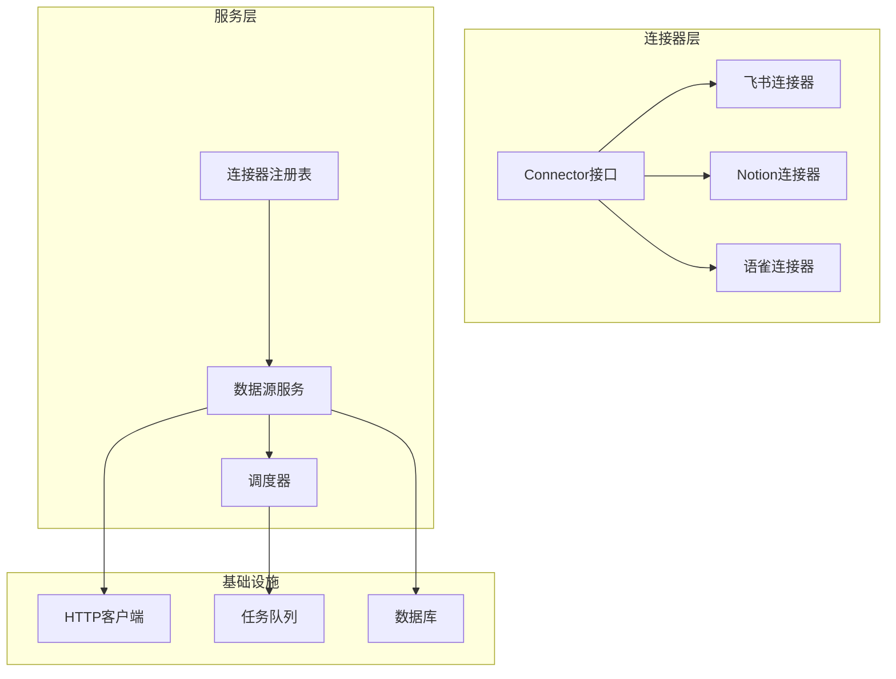

**图表来源**
- [connector.go:9-31](file://internal/datasource/connector.go#L9-L31)
- [scheduler.go:18-52](file://internal/datasource/scheduler.go#L18-L52)

**章节来源**
- [CONNECTOR_IMPLEMENTATION_GUIDE.md:1-50](file://internal/datasource/CONNECTOR_IMPLEMENTATION_GUIDE.md#L1-L50)
- [数据源导入开发文档.md:124-184](file://docs/数据源导入开发文档.md#L124-L184)

## 核心组件

### 连接器接口规范

连接器接口定义了所有外部数据源连接器必须实现的标准方法：

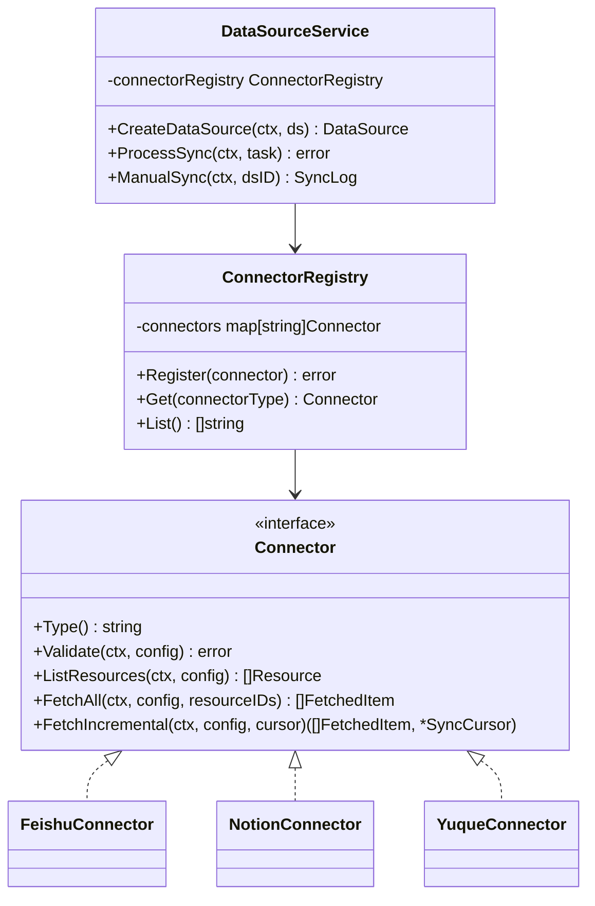

**图表来源**
- [connector.go:9-31](file://internal/datasource/connector.go#L9-L31)
- [connector.go:34-73](file://internal/datasource/connector.go#L34-L73)

### 数据模型

连接器使用统一的数据模型来表示外部系统的内容：

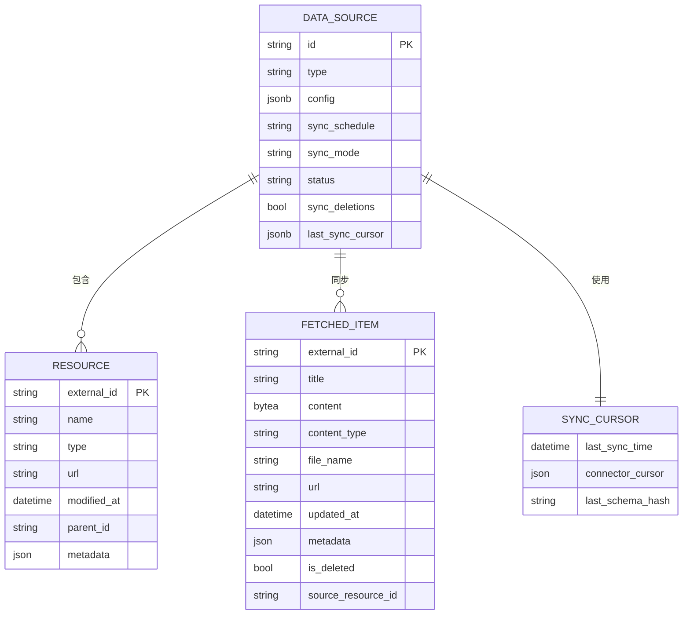

**图表来源**
- [datasource.go:49-114](file://internal/types/datasource.go#L49-L114)
- [datasource.go:212-273](file://internal/types/datasource.go#L212-L273)
- [datasource.go:275-286](file://internal/types/datasource.go#L275-L286)

**章节来源**
- [connector.go:75-84](file://internal/datasource/connector.go#L75-L84)
- [datasource.go:196-286](file://internal/types/datasource.go#L196-L286)

## 架构总览

WeKnora的数据源导入架构采用了现代化的微服务设计理念，支持高并发、可扩展的内容同步：

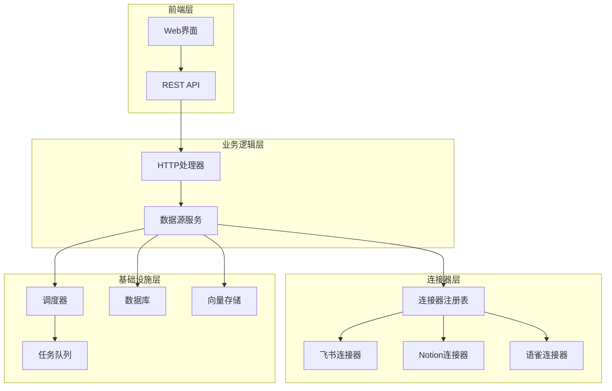

**图表来源**
- [数据源导入开发文档.md:124-184](file://docs/数据源导入开发文档.md#L124-L184)
- [datasource_service.go:21-56](file://internal/application/service/datasource_service.go#L21-L56)

## 详细组件分析

### 连接器实现模式

#### 基础连接器模板

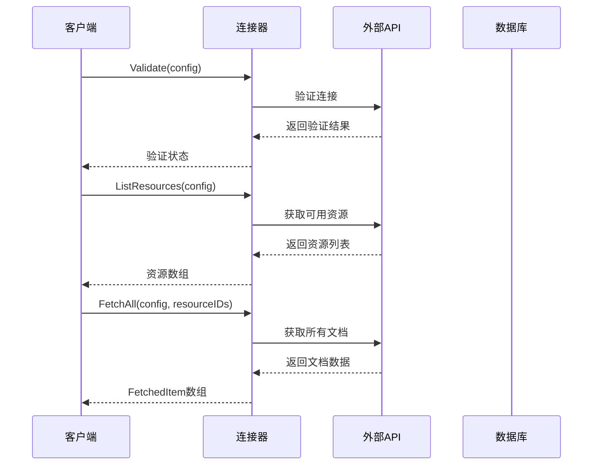

**图表来源**
- [connector.go:11-30](file://internal/datasource/connector.go#L11-L30)

#### 飞书连接器实现

飞书连接器作为最复杂的实现示例，展示了完整的功能实现：

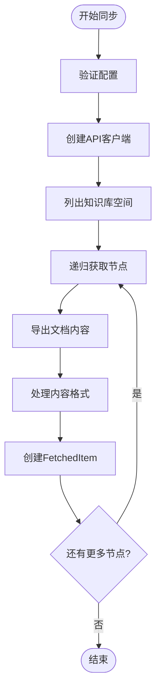

**图表来源**
- [connector.go:74-113](file://internal/datasource/connector/feishu/connector.go#L74-L113)

**章节来源**
- [connector.go:15-41](file://internal/datasource/connector/feishu/connector.go#L15-L41)
- [connector.go:43-71](file://internal/datasource/connector/feishu/connector.go#L43-L71)

### 调度系统

调度系统负责管理数据源的定时同步任务：

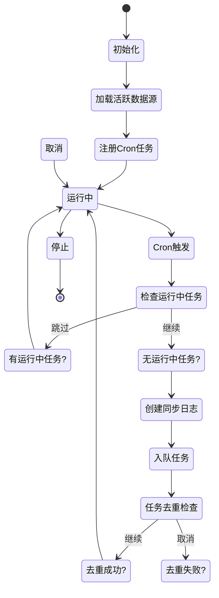

**图表来源**
- [scheduler.go:18-75](file://internal/datasource/scheduler.go#L18-L75)

**章节来源**
- [scheduler.go:111-130](file://internal/datasource/scheduler.go#L111-L130)
- [scheduler.go:132-203](file://internal/datasource/scheduler.go#L132-L203)

### 数据源服务

数据源服务协调整个同步过程：

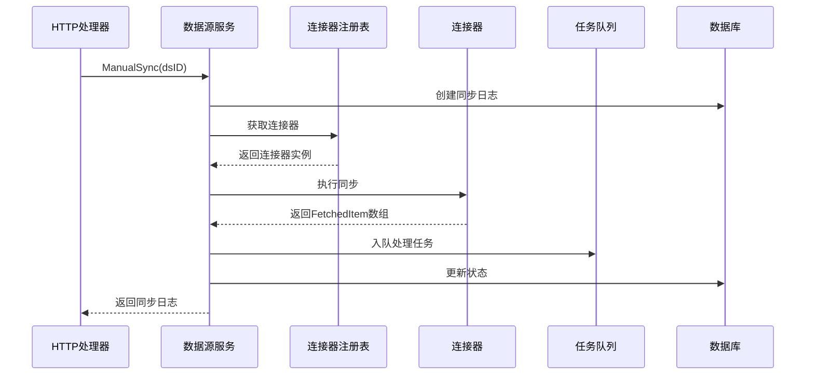

**图表来源**
- [datasource_service.go:269-324](file://internal/application/service/datasource_service.go#L269-L324)

**章节来源**
- [datasource_service.go:387-599](file://internal/application/service/datasource_service.go#L387-L599)

## 依赖关系分析

### 外部依赖

连接器开发涉及多个外部依赖和服务：

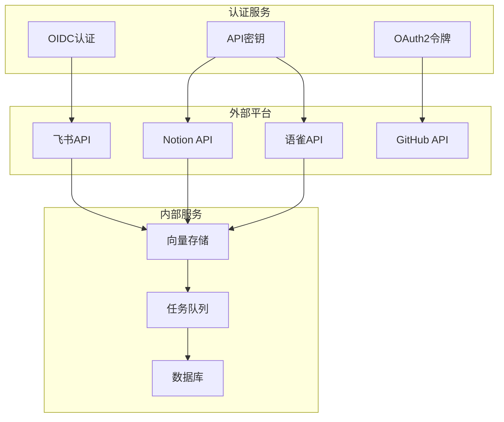

**图表来源**
- [connector.go:86-185](file://internal/datasource/connector.go#L86-L185)

### 内部依赖关系

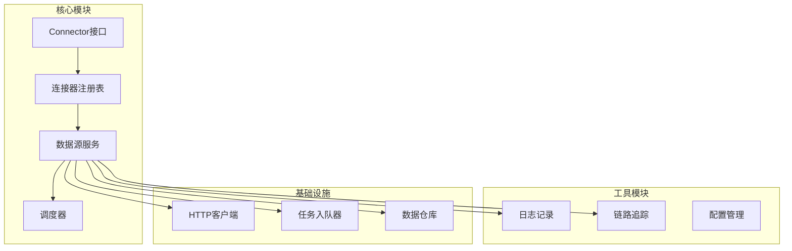

**图表来源**
- [datasource_service.go:21-56](file://internal/application/service/datasource_service.go#L21-L56)
- [engine_factory.go:32-64](file://internal/container/engine_factory.go#L32-L64)

**章节来源**
- [errors.go:5-32](file://internal/datasource/errors.go#L5-L32)
- [datasource.go:34-73](file://internal/datasource/connector.go#L34-L73)

## 性能考虑

### 并发控制

连接器实现中采用了多层并发控制机制：

1. **DB层防重叠**：防止长时间运行的同步任务重叠
2. **队列层去重**：基于TaskID确保同一分钟内只有一个任务执行
3. **连接池管理**：合理配置HTTP客户端连接池

### 缓存策略

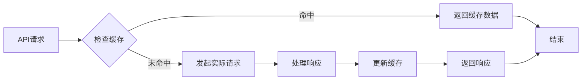

**章节来源**
- [scheduler.go:132-203](file://internal/datasource/scheduler.go#L132-L203)

### 错误处理策略

连接器实现了完善的错误处理和重试机制：

1. **连接错误**：自动重试，指数退避
2. **API限制**：自动降速，遵守速率限制
3. **数据错误**：单个文档失败不影响整体同步
4. **网络错误**：智能重连，超时处理

## 故障排除指南

### 常见问题诊断

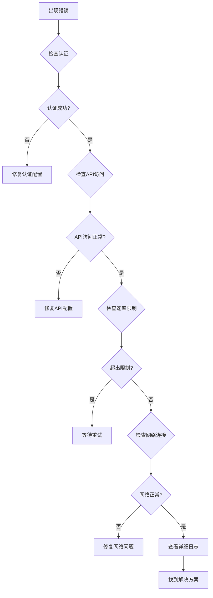

### 日志记录标准

连接器遵循统一的日志记录标准：

1. **结构化日志**：使用JSON格式记录关键信息
2. **级别分类**：区分INFO、WARN、ERROR、DEBUG级别
3. **上下文追踪**：包含请求ID、数据源ID等上下文信息
4. **敏感信息过滤**：自动过滤认证令牌等敏感信息

**章节来源**
- [errors.go:5-32](file://internal/datasource/errors.go#L5-L32)
- [datasource_service.go:486-503](file://internal/application/service/datasource_service.go#L486-L503)

## 结论

WeKnora数据源连接器提供了一个完整、可扩展的内容同步解决方案。通过遵循本文档的开发指南，开发者可以快速实现新的数据源连接器，享受统一的接口规范、完善的错误处理机制和高性能的同步能力。

关键要点总结：
- 遵循Connector接口规范，确保兼容性
- 实现完整的认证机制和错误处理
- 优化性能，支持大规模数据同步
- 提供详细的日志和监控支持
- 遵循最佳实践，确保代码质量

## 附录

### 开发最佳实践

1. **代码组织**：按照模块化原则组织代码结构
2. **测试覆盖**：编写全面的单元测试和集成测试
3. **文档维护**：及时更新API文档和使用说明
4. **性能监控**：建立完善的性能监控和告警机制
5. **安全考虑**：确保认证信息的安全存储和传输

### 部署注意事项

1. **环境配置**：正确配置生产环境的各项参数
2. **资源规划**：合理规划CPU、内存、存储资源
3. **网络配置**：确保与外部API的网络连通性
4. **备份策略**：建立数据备份和恢复机制
5. **监控告警**：配置完善的监控和告警系统