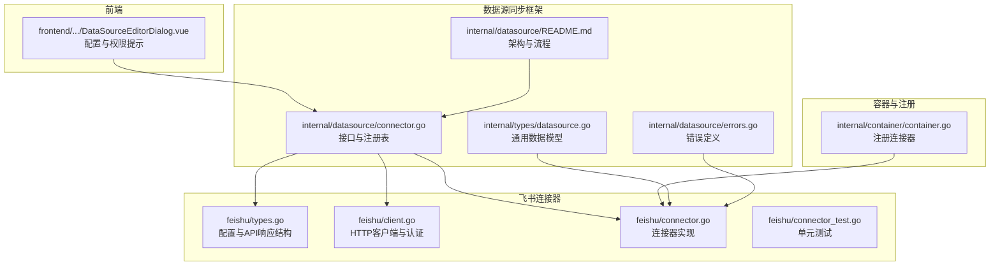
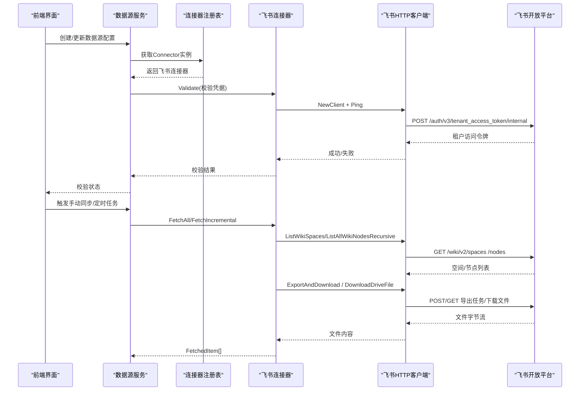
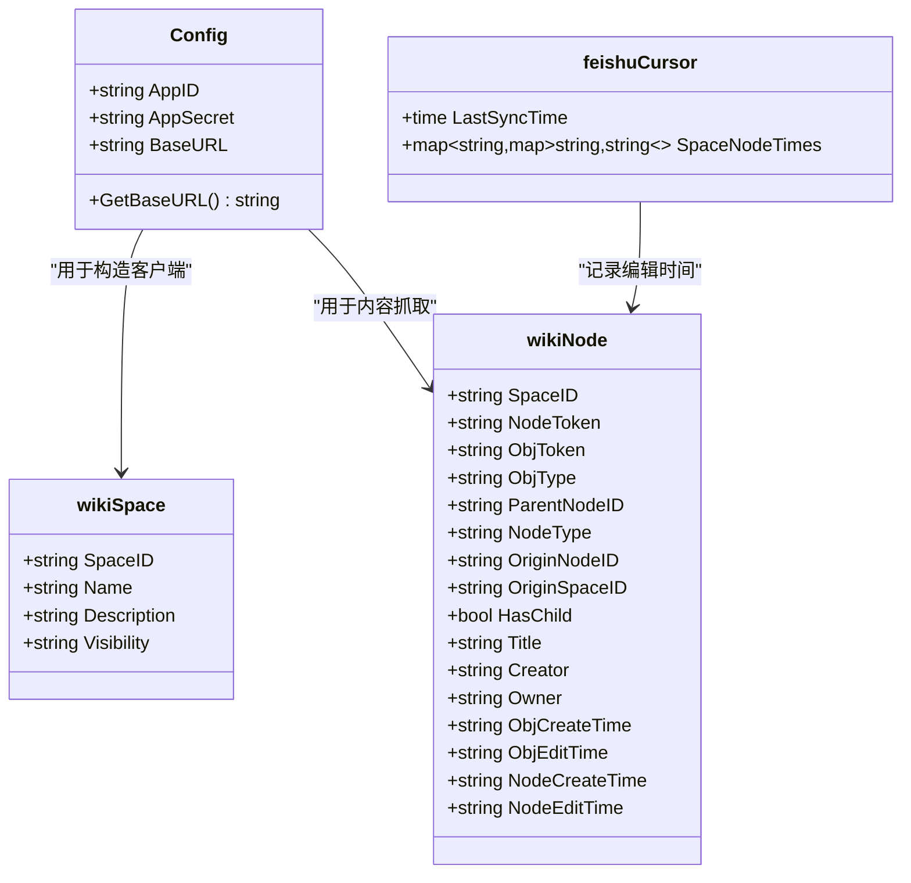
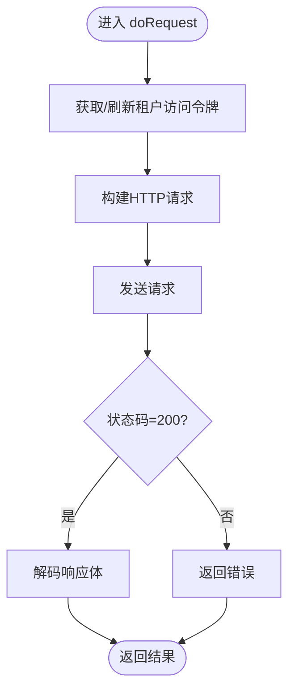
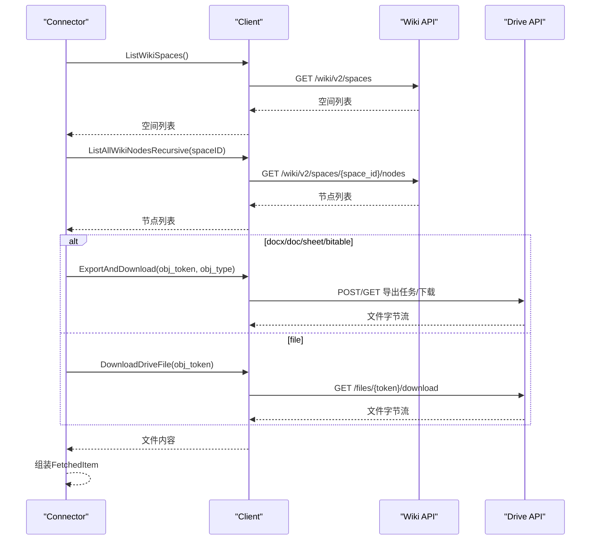
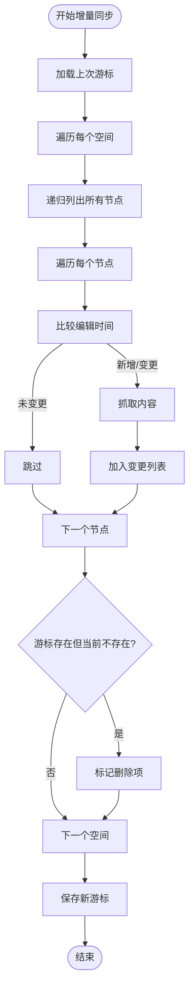
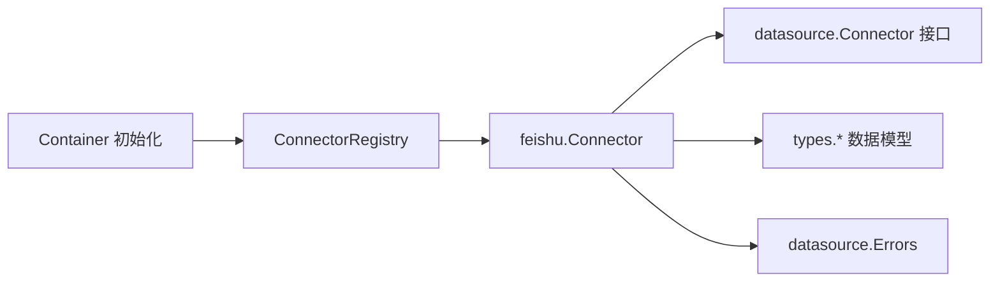

# 飞书数据源连接器

<cite>
**本文引用的文件**
- [connector.go](file://internal/datasource/connector/feishu/connector.go)
- [client.go](file://internal/datasource/connector/feishu/client.go)
- [types.go](file://internal/datasource/connector/feishu/types.go)
- [connector_test.go](file://internal/datasource/connector/feishu/connector_test.go)
- [connector.go](file://internal/datasource/connector.go)
- [README.md](file://internal/datasource/README.md)
- [datasource.go](file://internal/types/datasource.go)
- [errors.go](file://internal/datasource/errors.go)
- [container.go](file://internal/container/container.go)
- [DataSourceEditorDialog.vue](file://frontend/src/views/knowledge/settings/DataSourceEditorDialog.vue)
- [数据源导入开发文档.md](file://docs/数据源导入开发文档.md)
</cite>

## 目录
1. [简介](#简介)
2. [项目结构](#项目结构)
3. [核心组件](#核心组件)
4. [架构总览](#架构总览)
5. [详细组件分析](#详细组件分析)
6. [依赖关系分析](#依赖关系分析)
7. [性能考量](#性能考量)
8. [故障排查指南](#故障排查指南)
9. [结论](#结论)
10. [附录](#附录)

## 简介
本技术文档面向WeKnora飞书数据源连接器，系统化阐述其完整实现，包括：
- 飞书开放平台OAuth2.0认证机制与企业自建应用凭据配置
- 客户端初始化与Token缓存策略
- 文档列表获取、递归节点遍历与内容导出/下载策略
- 增量同步与删除检测逻辑
- 错误处理、性能优化与故障排查方法
- 前端配置项与权限要求说明

## 项目结构
飞书连接器位于内部模块的“数据源同步框架”之下，采用“适配器模式”，通过统一的Connector接口对接不同外部平台。

**图表来源**
- [connector.go:11-31](file://internal/datasource/connector.go#L11-L31)
- [README.md:1-91](file://internal/datasource/README.md#L1-L91)
- [types.go:15-41](file://internal/datasource/connector/feishu/types.go#L15-L41)
- [client.go:16-38](file://internal/datasource/connector/feishu/client.go#L16-L38)
- [connector.go:15-26](file://internal/datasource/connector/feishu/connector.go#L15-L26)
- [container.go:1500-1513](file://internal/container/container.go#L1500-L1513)
- [DataSourceEditorDialog.vue:160-172](file://frontend/src/views/knowledge/settings/DataSourceEditorDialog.vue#L160-L172)

**章节来源**
- [connector.go:11-31](file://internal/datasource/connector.go#L11-L31)
- [README.md:1-91](file://internal/datasource/README.md#L1-L91)
- [container.go:1500-1513](file://internal/container/container.go#L1500-L1513)

## 核心组件
- 配置与类型定义：封装飞书AppID/AppSecret/BaseURL、对象类型映射、API响应结构与增量游标
- HTTP客户端：负责认证、请求封装、响应解码与日志记录；内置租户访问令牌缓存
- 连接器实现：实现Connector接口，提供验证、资源发现、全量/增量抓取与内容转换
- 单元测试：覆盖配置解析、文件名清理、时间戳解析、导出/下载流程与增量同步逻辑

**章节来源**
- [types.go:15-77](file://internal/datasource/connector/feishu/types.go#L15-L77)
- [client.go:16-95](file://internal/datasource/connector/feishu/client.go#L16-L95)
- [connector.go:15-41](file://internal/datasource/connector/feishu/connector.go#L15-L41)
- [connector_test.go:178-257](file://internal/datasource/connector/feishu/connector_test.go#L178-L257)

## 架构总览
飞书连接器遵循WeKnora数据源同步框架的通用架构：前端配置与校验 → 服务层校验与调度 → 连接器抓取 → 差异引擎与入库。

**图表来源**
- [connector.go:11-31](file://internal/datasource/connector.go#L11-L31)
- [connector.go:28-41](file://internal/datasource/connector/feishu/connector.go#L28-L41)
- [client.go:40-95](file://internal/datasource/connector/feishu/client.go#L40-L95)
- [client.go:159-194](file://internal/datasource/connector/feishu/client.go#L159-L194)
- [client.go:230-265](file://internal/datasource/connector/feishu/client.go#L230-L265)
- [client.go:299-411](file://internal/datasource/connector/feishu/client.go#L299-L411)
- [client.go:417-422](file://internal/datasource/connector/feishu/client.go#L417-L422)

**章节来源**
- [README.md:47-63](file://internal/datasource/README.md#L47-L63)
- [数据源导入开发文档.md:124-183](file://docs/数据源导入开发文档.md#L124-L183)

## 详细组件分析

### 飞书配置与类型定义
- 配置结构：包含AppID、AppSecret与BaseURL，默认指向国内版开放平台，支持国际版Lark
- 对象类型映射：docx/doc/sheet/bitable映射到导出类型与文件扩展名
- API响应结构：统一封装code/msg与data，便于错误处理与日志记录
- 增量游标：记录每个空间下节点的最后编辑时间，用于变更检测与删除识别

**图表来源**
- [types.go:17-41](file://internal/datasource/connector/feishu/types.go#L17-L41)
- [types.go:104-140](file://internal/datasource/connector/feishu/types.go#L104-L140)
- [types.go:198-206](file://internal/datasource/connector/feishu/types.go#L198-L206)

**章节来源**
- [types.go:15-77](file://internal/datasource/connector/feishu/types.go#L15-L77)
- [types.go:104-140](file://internal/datasource/connector/feishu/types.go#L104-L140)
- [types.go:198-206](file://internal/datasource/connector/feishu/types.go#L198-L206)

### HTTP客户端与认证
- 租户访问令牌：通过内部接口获取，缓存至过期时间前5分钟，避免频繁请求
- 请求封装：统一设置Authorization头，记录请求与响应日志，便于调试
- 分页遍历：空间列表与节点列表均支持分页，自动拼接page_token
- 导出与下载：导出任务API三段式（创建/轮询/下载），驱动文件直接下载

**图表来源**
- [client.go:98-149](file://internal/datasource/connector/feishu/client.go#L98-L149)

**章节来源**
- [client.go:40-95](file://internal/datasource/connector/feishu/client.go#L40-L95)
- [client.go:98-149](file://internal/datasource/connector/feishu/client.go#L98-L149)
- [client.go:159-194](file://internal/datasource/connector/feishu/client.go#L159-L194)
- [client.go:230-265](file://internal/datasource/connector/feishu/client.go#L230-L265)
- [client.go:299-411](file://internal/datasource/connector/feishu/client.go#L299-L411)
- [client.go:417-459](file://internal/datasource/connector/feishu/client.go#L417-L459)

### 连接器实现与抓取策略
- 验证：通过Ping获取租户访问令牌，验证凭据有效性
- 资源发现：列出所有Wiki空间，映射为可选资源
- 全量抓取：递归遍历空间内所有节点，按类型导出或下载
- 增量抓取：基于节点编辑时间对比，检测新增/修改/删除
- 内容转换：根据obj_type选择导出或下载，生成FetchedItem

**图表来源**
- [connector.go:28-41](file://internal/datasource/connector/feishu/connector.go#L28-L41)
- [connector.go:43-71](file://internal/datasource/connector/feishu/connector.go#L43-L71)
- [connector.go:73-113](file://internal/datasource/connector/feishu/connector.go#L73-L113)
- [connector.go:115-227](file://internal/datasource/connector/feishu/connector.go#L115-L227)
- [connector.go:229-310](file://internal/datasource/connector/feishu/connector.go#L229-L310)
- [client.go:230-265](file://internal/datasource/connector/feishu/client.go#L230-L265)
- [client.go:299-411](file://internal/datasource/connector/feishu/client.go#L299-L411)
- [client.go:417-422](file://internal/datasource/connector/feishu/client.go#L417-L422)

**章节来源**
- [connector.go:28-41](file://internal/datasource/connector/feishu/connector.go#L28-L41)
- [connector.go:43-71](file://internal/datasource/connector/feishu/connector.go#L43-L71)
- [connector.go:73-113](file://internal/datasource/connector/feishu/connector.go#L73-L113)
- [connector.go:115-227](file://internal/datasource/connector/feishu/connector.go#L115-L227)
- [connector.go:229-310](file://internal/datasource/connector/feishu/connector.go#L229-L310)

### 增量同步与删除检测
- 游标结构：feishuCursor记录上次同步时间与每个空间下节点的编辑时间
- 变更检测：优先比较obj_edit_time，其次node_edit_time；未变更则跳过
- 删除检测：若游标存在但当前遍历不存在，则标记为删除项
- 游标更新：生成新游标，包含本轮各节点最新编辑时间

**图表来源**
- [connector.go:115-227](file://internal/datasource/connector/feishu/connector.go#L115-L227)
- [connector.go:198-214](file://internal/datasource/connector/feishu/connector.go#L198-L214)

**章节来源**
- [connector.go:115-227](file://internal/datasource/connector/feishu/connector.go#L115-L227)

### 前端配置与权限
- 凭证字段：app_id、app_secret（可选base_url）
- 权限要求：wiki:wiki:readonly、drive:drive:readonly、drive:export:readonly、docx:document:readonly
- 配置流程：创建数据源 → 校验凭据 → 列出资源 → 选择空间 → 设置同步策略

**章节来源**
- [DataSourceEditorDialog.vue:160-172](file://frontend/src/views/knowledge/settings/DataSourceEditorDialog.vue#L160-L172)
- [数据源导入开发文档.md:242-247](file://docs/数据源导入开发文档.md#L242-L247)

## 依赖关系分析
- 连接器注册：在容器初始化时注册飞书连接器
- 通用接口：Connector接口定义了统一能力边界
- 数据模型：通用的DataSource、SyncLog、FetchedItem等贯穿整个同步链路
- 错误定义：集中化的错误类型便于上层处理

**图表来源**
- [connector.go:34-73](file://internal/datasource/connector.go#L34-L73)
- [connector.go:15-26](file://internal/datasource/connector/feishu/connector.go#L15-L26)
- [datasource.go:196-273](file://internal/types/datasource.go#L196-L273)
- [errors.go:6-32](file://internal/datasource/errors.go#L6-L32)
- [container.go:1500-1513](file://internal/container/container.go#L1500-L1513)

**章节来源**
- [connector.go:34-73](file://internal/datasource/connector.go#L34-L73)
- [datasource.go:196-273](file://internal/types/datasource.go#L196-L273)
- [errors.go:6-32](file://internal/datasource/errors.go#L6-L32)
- [container.go:1500-1513](file://internal/container/container.go#L1500-L1513)

## 性能考量
- Token缓存：租户访问令牌缓存并在过期前5分钟刷新，减少鉴权开销
- 分页遍历：空间与节点列表均分页，避免一次性请求过大
- 导出轮询：导出任务轮询间隔2秒，超时60秒，平衡成功率与延迟
- 增量遍历：全量扫描节点树以检测变更，大型空间建议降低同步频率
- 日志裁剪：响应体按阈值截断，避免日志膨胀

**章节来源**
- [client.go:40-95](file://internal/datasource/connector/feishu/client.go#L40-L95)
- [client.go:159-194](file://internal/datasource/connector/feishu/client.go#L159-L194)
- [client.go:230-265](file://internal/datasource/connector/feishu/client.go#L230-L265)
- [client.go:354-411](file://internal/datasource/connector/feishu/client.go#L354-L411)
- [数据源导入开发文档.md:648-649](file://docs/数据源导入开发文档.md#L648-L649)

## 故障排查指南
- 凭据无效：Validate失败通常由AppID/AppSecret错误或BaseURL不正确导致
- 权限不足：前端提示所需权限，确保应用已在目标Wiki空间具备只读权限
- 导出失败：检查导出任务状态与文件令牌，确认在有效期内下载
- 增量异常：核对游标序列化/反序列化是否一致，编辑时间字段是否为空
- 日志定位：关注[Feishu]前缀日志，包含请求路径、状态码与响应摘要

**章节来源**
- [connector.go:28-41](file://internal/datasource/connector/feishu/connector.go#L28-L41)
- [DataSourceEditorDialog.vue:160-172](file://frontend/src/views/knowledge/settings/DataSourceEditorDialog.vue#L160-L172)
- [client.go:129-148](file://internal/datasource/connector/feishu/client.go#L129-L148)
- [connector_test.go:318-330](file://internal/datasource/connector/feishu/connector_test.go#L318-L330)

## 结论
飞书连接器通过清晰的接口设计与稳健的实现，提供了从飞书Wiki空间到WeKnora知识库的可靠数据导入能力。其基于租户访问令牌的认证、完善的导出/下载策略以及增量同步机制，满足了企业知识管理的常见需求。配合前端权限提示与容器注册机制，整体具备良好的可维护性与扩展性。

## 附录

### 配置参数说明
- app_id：飞书开发者后台的企业自建应用App ID
- app_secret：对应密钥
- base_url：可选，国内默认https://open.feishu.cn，国际版使用https://open.larksuite.com

**章节来源**
- [types.go:17-41](file://internal/datasource/connector/feishu/types.go#L17-L41)
- [数据源导入开发文档.md:242-247](file://docs/数据源导入开发文档.md#L242-L247)

### 支持的文档类型与导出策略
- docx/doc/sheet/bitable：通过导出任务API获取文件
- file：通过驱动下载API获取原始文件
- mindnote/slides：不支持内容读取，将被跳过

**章节来源**
- [connector.go:229-310](file://internal/datasource/connector/feishu/connector.go#L229-L310)
- [connector.go:337-347](file://internal/datasource/connector/feishu/connector.go#L337-L347)
- [数据源导入开发文档.md:650-660](file://docs/数据源导入开发文档.md#L650-L660)

### API调用示例（路径与行为）
- 获取租户访问令牌：POST /open-apis/auth/v3/tenant_access_token/internal
- 列出Wiki空间：GET /open-apis/wiki/v2/spaces?page_size=50
- 列出节点：GET /open-apis/wiki/v2/spaces/{space_id}/nodes?page_size=50
- 创建导出任务：POST /open-apis/drive/v1/export_tasks
- 查询导出状态：GET /open-apis/drive/v1/export_tasks/{ticket}?token={obj_token}
- 下载导出文件：GET /open-apis/drive/v1/export_tasks/file/{file_token}/download
- 下载驱动文件：GET /open-apis/drive/v1/files/{file_token}/download

**章节来源**
- [client.go:55-62](file://internal/datasource/connector/feishu/client.go#L55-L62)
- [client.go:164-190](file://internal/datasource/connector/feishu/client.go#L164-L190)
- [client.go:203-225](file://internal/datasource/connector/feishu/client.go#L203-L225)
- [client.go:304-319](file://internal/datasource/connector/feishu/client.go#L304-L319)
- [client.go:324-344](file://internal/datasource/connector/feishu/client.go#L324-L344)
- [client.go:350-411](file://internal/datasource/connector/feishu/client.go#L350-L411)
- [client.go:420-422](file://internal/datasource/connector/feishu/client.go#L420-L422)