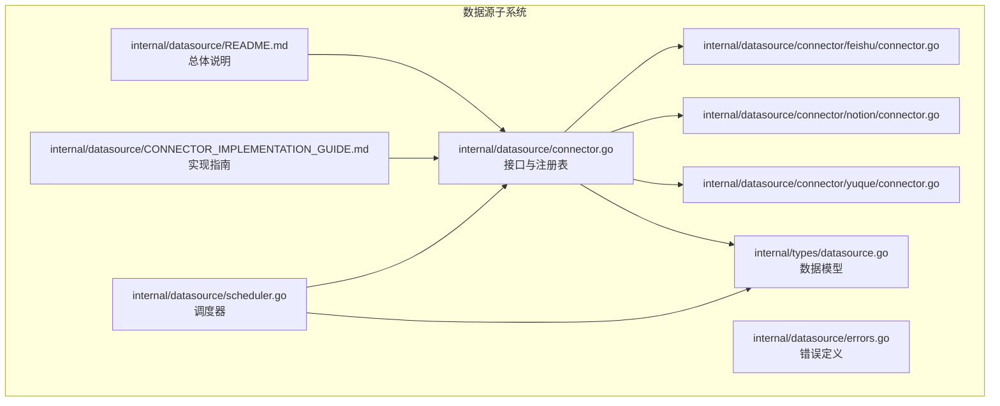
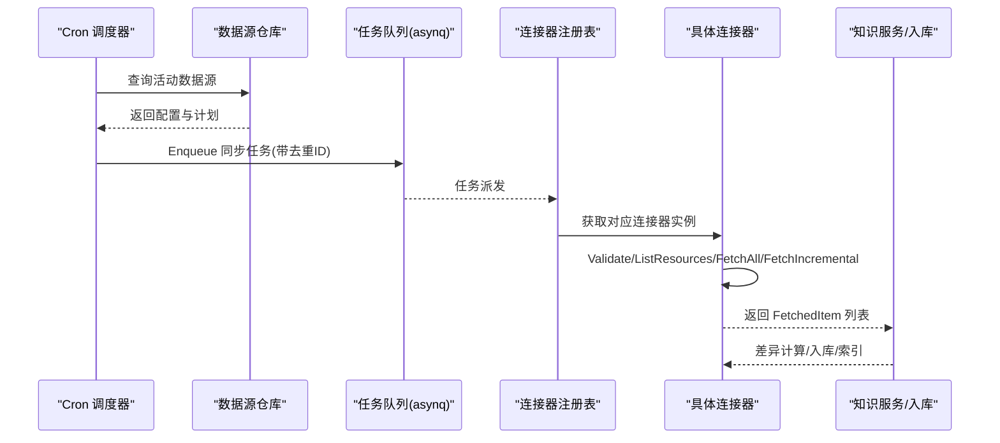
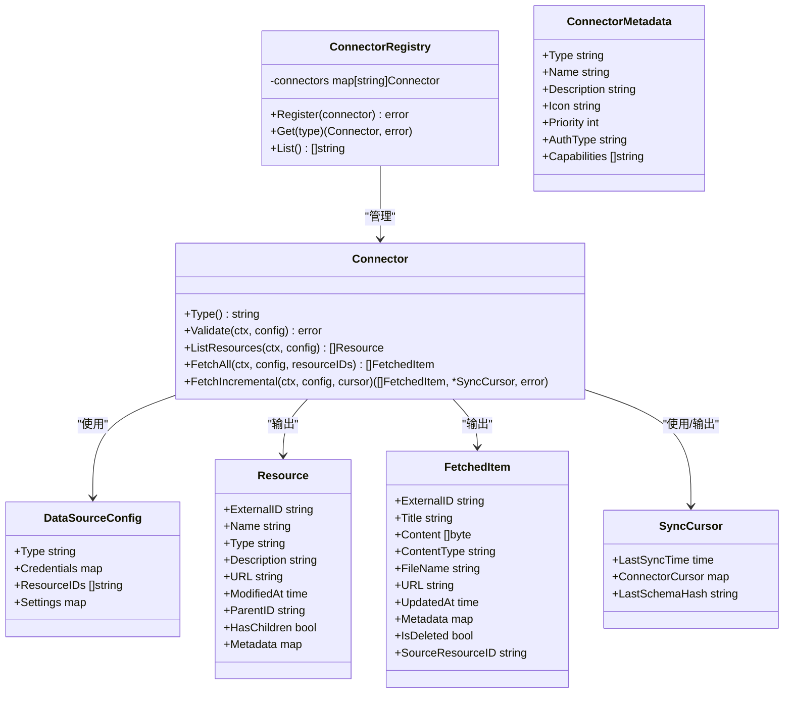

# 数据源连接器架构

<cite>
**本文引用的文件列表**
- [connector.go](file://internal/datasource/connector.go)
- [scheduler.go](file://internal/datasource/scheduler.go)
- [errors.go](file://internal/datasource/errors.go)
- [connector.go](file://internal/datasource/connector/feishu/connector.go)
- [connector.go](file://internal/datasource/connector/notion/connector.go)
- [connector.go](file://internal/datasource/connector/yuque/connector.go)
- [datasource.go](file://internal/types/datasource.go)
- [CONNECTOR_IMPLEMENTATION_GUIDE.md](file://internal/datasource/CONNECTOR_IMPLEMENTATION_GUIDE.md)
- [README.md](file://internal/datasource/README.md)
</cite>

## 目录
1. [引言](#引言)
2. [项目结构](#项目结构)
3. [核心组件](#核心组件)
4. [架构总览](#架构总览)
5. [详细组件分析](#详细组件分析)
6. [依赖关系分析](#依赖关系分析)
7. [性能考量](#性能考量)
8. [故障排查指南](#故障排查指南)
9. [结论](#结论)
10. [附录](#附录)

## 引言
本技术文档围绕 WeKnora 的“数据源连接器”架构展开，目标是帮助开发者深入理解 Connector 接口的设计理念、核心方法职责与实现要求；掌握 ConnectorRegistry 注册表机制的工作原理；理解 ConnectorMetadata 的字段含义与用途；并总结连接器实现的最佳实践（错误处理、并发安全、性能优化）。文档同时提供面向实现者的完整设计理解与落地指导。

## 项目结构
WeKnora 的数据源同步框架位于 internal/datasource 目录，核心文件包括：
- 接口与注册表：connector.go
- 调度器：scheduler.go
- 错误定义：errors.go
- 平台连接器示例：feishu、notion、yuque 的 connector.go
- 类型定义：internal/types/datasource.go
- 实现指南与总体说明：CONNECTOR_IMPLEMENTATION_GUIDE.md、README.md

图表来源
- [connector.go:1-208](file://internal/datasource/connector.go#L1-L208)
- [scheduler.go:1-211](file://internal/datasource/scheduler.go#L1-L211)
- [connector.go:1-387](file://internal/datasource/connector/feishu/connector.go#L1-L387)
- [connector.go:1-945](file://internal/datasource/connector/notion/connector.go#L1-L945)
- [connector.go:1-313](file://internal/datasource/connector/yuque/connector.go#L1-L313)
- [datasource.go:1-418](file://internal/types/datasource.go#L1-L418)
- [CONNECTOR_IMPLEMENTATION_GUIDE.md:1-498](file://internal/datasource/CONNECTOR_IMPLEMENTATION_GUIDE.md#L1-L498)
- [README.md:1-261](file://internal/datasource/README.md#L1-L261)

章节来源
- [connector.go:1-208](file://internal/datasource/connector.go#L1-L208)
- [scheduler.go:1-211](file://internal/datasource/scheduler.go#L1-L211)
- [datasource.go:1-418](file://internal/types/datasource.go#L1-L418)
- [CONNECTOR_IMPLEMENTATION_GUIDE.md:1-498](file://internal/datasource/CONNECTOR_IMPLEMENTATION_GUIDE.md#L1-L498)
- [README.md:1-261](file://internal/datasource/README.md#L1-L261)

## 核心组件
- Connector 接口：统一抽象外部数据源适配器，定义 Type、Validate、ListResources、FetchAll、FetchIncremental 五项能力。
- ConnectorRegistry：注册表负责注册、查找与列举连接器，提供线程安全的访问。
- ConnectorMetadata：描述连接器的元数据（类型、名称、描述、图标、优先级、认证方式、能力等），用于前端展示与排序。
- 类型系统：DataSource、Resource、FetchedItem、SyncCursor、SyncResult 等，支撑配置、资源、抓取结果与增量游标。
- 调度器：基于 cron 的周期性任务调度，结合 asynq 任务队列，避免重复执行与重叠运行。

章节来源
- [connector.go:9-31](file://internal/datasource/connector.go#L9-L31)
- [connector.go:33-73](file://internal/datasource/connector.go#L33-L73)
- [connector.go:75-84](file://internal/datasource/connector.go#L75-L84)
- [datasource.go:196-273](file://internal/types/datasource.go#L196-L273)
- [datasource.go:275-286](file://internal/types/datasource.go#L275-L286)
- [datasource.go:288-313](file://internal/types/datasource.go#L288-L313)
- [scheduler.go:18-52](file://internal/datasource/scheduler.go#L18-L52)

## 架构总览
WeKnora 的数据源同步采用“适配器 + 注册表 + 调度”的分层架构：
- 外部平台（如 Feishu、Notion、GitHub 等）通过各自 Connector 实现接入；
- ConnectorRegistry 统一管理与查找；
- 调度器按 Cron 触发任务，将同步工作交由具体 Connector；
- Connector 将外部内容转换为 FetchedItem，供后续知识入库与索引。

图表来源
- [scheduler.go:117-203](file://internal/datasource/scheduler.go#L117-L203)
- [connector.go:45-64](file://internal/datasource/connector.go#L45-L64)

章节来源
- [README.md:47-63](file://internal/datasource/README.md#L47-L63)
- [scheduler.go:117-203](file://internal/datasource/scheduler.go#L117-L203)
- [connector.go:45-64](file://internal/datasource/connector.go#L45-L64)

## 详细组件分析

### Connector 接口与实现要求
- Type(): 返回连接器类型标识（如 "feishu", "notion"），用于注册表与路由。
- Validate(ctx, config): 校验配置有效性（连通性、凭据正确性），失败返回错误。
- ListResources(ctx, config): 列出可选资源（文档、空间、文件夹等），返回 Resource 列表供用户选择。
- FetchAll(ctx, config, resourceIDs): 全量同步指定资源的所有内容，返回 FetchedItem 列表。
- FetchIncremental(ctx, config, cursor): 增量同步，基于游标比较变更，返回变更项与新游标。

实现要点
- 参数校验：对 config、resourceIDs、cursor 进行空值与格式检查。
- 错误传播：将底层 API 错误包装为可读的业务错误，便于上层记录与展示。
- 资源发现：ListResources 应返回可展开的树形结构（含 ParentID、HasChildren）以支持前端渲染。
- 增量策略：FetchIncremental 需要稳定的时间戳或版本号作为变更判定依据，并支持删除检测（IsDeleted）。
- 输出标准化：统一输出 FetchedItem，确保 Content、ContentType、FileName、URL、UpdatedAt、Metadata、SourceResourceID 等字段完整。

章节来源
- [connector.go:9-31](file://internal/datasource/connector.go#L9-L31)
- [connector.go:23-41](file://internal/datasource/connector/feishu/connector.go#L23-L41)
- [connector.go:31-45](file://internal/datasource/connector/notion/connector.go#L31-L45)
- [connector.go:27-41](file://internal/datasource/connector/yuque/connector.go#L27-L41)

### ConnectorRegistry 注册表机制
- 注册 Register(connector): 校验非空与 Type 非空，存入映射表。
- 查找 Get(type): 不存在时返回 ErrConnectorNotFound。
- 列表 List(): 返回已注册类型集合。
- 元数据管理：ConnectorMetadataRegistry 提供类型到元数据的映射，用于前端展示与排序。

最佳实践
- 在应用启动阶段集中注册各连接器，避免并发写入。
- 使用常量统一管理 Type 字符串，防止拼写错误。
- 对外暴露只读视图，内部使用互斥锁保护并发安全。

章节来源
- [connector.go:33-73](file://internal/datasource/connector.go#L33-L73)
- [connector.go:75-84](file://internal/datasource/connector.go#L75-L84)
- [connector.go:86-185](file://internal/datasource/connector.go#L86-L185)

### ConnectorMetadata 结构体设计
- 字段说明
  - Type：连接器类型标识
  - Name：显示名称
  - Description：简要描述
  - Icon：图标路径（可选）
  - Priority：优先级（数值越小优先级越高）
  - AuthType：认证方式（"oauth2"、"api_key"、"token"、"password" 等）
  - Capabilities：能力清单（如 "incremental"、"webhook"、"deletion_sync"）

使用场景
- 前端根据 Priority 排序展示连接器选项
- 根据 AuthType 渲染不同的凭据输入表单
- 根据 Capabilities 控制 UI 功能开关

章节来源
- [connector.go:75-84](file://internal/datasource/connector.go#L75-L84)
- [connector.go:86-185](file://internal/datasource/connector.go#L86-L185)

### 平台连接器实现示例

#### Feishu 连接器
- Validate：解析配置并调用 Ping 校验连通性。
- ListResources：列出 Wiki 空间作为可选资源。
- FetchAll：递归遍历空间内节点，导出内容为文件或下载原始文件，封装为 FetchedItem。
- FetchIncremental：基于节点编辑时间对比与游标记录，检测新增/变更/删除，返回变更项与新游标。

关键点
- 支持多种对象类型（docx/doc/sheet/bitable/file），不同处理策略。
- 时间戳解析与文件名清洗，避免非法字符与截断导致的 UTF-8 不合法。
- 删除检测：当前节点集与历史游标对比，缺失即标记为删除。

章节来源
- [connector.go:23-41](file://internal/datasource/connector/feishu/connector.go#L23-L41)
- [connector.go:43-71](file://internal/datasource/connector/feishu/connector.go#L43-L71)
- [connector.go:73-113](file://internal/datasource/connector/feishu/connector.go#L73-L113)
- [connector.go:115-227](file://internal/datasource/connector/feishu/connector.go#L115-L227)
- [connector.go:229-310](file://internal/datasource/connector/feishu/connector.go#L229-L310)
- [connector.go:314-387](file://internal/datasource/connector/feishu/connector.go#L314-L387)

#### Notion 连接器
- Validate：通过 API Key 调用 Ping。
- ListResources：搜索页面与数据库，构建父子关系，支持树形渲染。
- FetchAll：区分页面与数据库，页面转 Markdown，数据库转表格 Markdown，支持附件下载。
- FetchIncremental：首次同步走 FetchAll，后续基于页面/记录编辑时间差分，支持删除检测。

关键点
- 数据库记录与页面内容分别处理，记录以属性与块内容组合生成 Markdown。
- 通过搜索 API 发现资源树，避免逐层遍历带来的多次往返。
- 删除检测：排除“被取消选择但仍可见”的页面，仅报告真正消失的页面。

章节来源
- [connector.go:31-45](file://internal/datasource/connector/notion/connector.go#L31-L45)
- [connector.go:47-107](file://internal/datasource/connector/notion/connector.go#L47-L107)
- [connector.go:109-137](file://internal/datasource/connector/notion/connector.go#L109-L137)
- [connector.go:139-256](file://internal/datasource/connector/notion/connector.go#L139-L256)
- [connector.go:275-383](file://internal/datasource/connector/notion/connector.go#L275-L383)
- [connector.go:385-462](file://internal/datasource/connector/notion/connector.go#L385-L462)
- [connector.go:464-485](file://internal/datasource/connector/notion/connector.go#L464-L485)
- [connector.go:640-702](file://internal/datasource/connector/notion/connector.go#L640-L702)

#### Yuque 连接器
- Validate：调用当前用户接口校验凭据。
- ListResources：合并个人与团队仓库，去重后返回资源列表。
- FetchAll：遍历书籍下的文档，过滤类型与状态，封装为 FetchedItem。
- FetchIncremental：基于内容更新时间对比，支持删除检测。

关键点
- 支持格式白名单（markdown/lake），跳过不支持格式。
- 删除检测：当前文档集合与历史游标对比，缺失即标记为删除。
- 日志统计：记录跳过的文档数量与原因，便于运维观察。

章节来源
- [connector.go:30-41](file://internal/datasource/connector/yuque/connector.go#L30-L41)
- [connector.go:43-108](file://internal/datasource/connector/yuque/connector.go#L43-L108)
- [connector.go:110-114](file://internal/datasource/connector/yuque/connector.go#L110-L114)
- [connector.go:116-265](file://internal/datasource/connector/yuque/connector.go#L116-L265)
- [connector.go:276-312](file://internal/datasource/connector/yuque/connector.go#L276-L312)

### 调度器与任务执行
- Cron 调度：加载活动数据源，按 Cron 表达式注册任务。
- 去重机制：同一分钟内的相同任务使用确定性 TaskID，Redis 保证仅一个实例入队。
- 并发控制：若上次同步仍在运行则跳过本次触发，避免重叠。
- 任务负载：封装 DataSourceSyncPayload，携带数据源 ID、租户 ID、日志 ID、强制全量标志等。

章节来源
- [scheduler.go:18-52](file://internal/datasource/scheduler.go#L18-L52)
- [scheduler.go:117-203](file://internal/datasource/scheduler.go#L117-L203)

## 依赖关系分析

图表来源
- [connector.go:9-31](file://internal/datasource/connector.go#L9-L31)
- [connector.go:33-73](file://internal/datasource/connector.go#L33-L73)
- [connector.go:75-84](file://internal/datasource/connector.go#L75-L84)
- [datasource.go:196-240](file://internal/types/datasource.go#L196-L240)
- [datasource.go:242-273](file://internal/types/datasource.go#L242-L273)
- [datasource.go:275-286](file://internal/types/datasource.go#L275-L286)

章节来源
- [connector.go:9-84](file://internal/datasource/connector.go#L9-L84)
- [datasource.go:196-286](file://internal/types/datasource.go#L196-L286)

## 性能考量
- 增量同步优先：尽量使用 FetchIncremental，减少 API 调用与传输开销。
- 游标设计：游标应包含最小必要信息（如时间戳、版本号、节点映射），避免冗余。
- 分页与批量：在平台 API 支持的情况下，采用批量与分页降低请求次数。
- 并发与限流：在连接器内部对第三方 API 进行并发限制与退避重试，避免触发限流。
- 缓存与去重：对资源列表与元数据进行缓存，避免重复查询；对已处理的文档 ID 去重。
- I/O 优化：Content 以字节形式传递，避免不必要的拷贝；文件名与 URL 规范化减少无效索引。
- 调度去重：利用 asynq 的 TaskID 去重与 HasRunningSync 防重叠，避免重复任务。

[本节为通用性能建议，无需特定文件引用]

## 故障排查指南
常见错误与定位
- 连接器未注册：Get(type) 返回 ErrConnectorNotFound，检查注册流程与 Type 常量一致性。
- 凭据无效：Validate 报错，核对凭据结构与权限范围。
- 资源不可见：ListResources 返回空或部分资源，确认授权范围与组织/团队权限。
- 增量游标异常：FetchIncremental 报错或漏同步，检查游标序列化/反序列化与字段兼容性。
- 删除检测异常：IsDeleted 误报或漏报，核对当前集合与历史游标的对比逻辑。

错误定义参考
- 连接器相关：ErrConnectorNil、ErrConnectorTypeEmpty、ErrConnectorNotFound
- 数据源相关：ErrDataSourceNotFound、ErrDataSourceInvalid、ErrDataSourceNotActive
- 配置相关：ErrInvalidConfig、ErrInvalidCredentials
- 同步相关：ErrSyncFailed、ErrSyncCanceled、ErrFetchFailed、ErrResourceNotFound
- 同步日志：ErrSyncLogNotFound

章节来源
- [errors.go:5-32](file://internal/datasource/errors.go#L5-L32)

## 结论
WeKnora 的数据源连接器架构通过清晰的接口抽象、完善的注册表与元数据体系、以及健壮的调度与去重机制，实现了对多平台外部数据源的统一接入与高效同步。遵循本文档的实现规范与最佳实践，可以快速、安全地扩展新的连接器，并在生产环境中保持高可靠与高性能。

[本节为总结性内容，无需特定文件引用]

## 附录

### 接口实现最佳实践清单
- 明确职责边界：Validate 仅做连通性与凭据校验；ListResources 仅返回可选资源；FetchAll/FetchIncremental 严格按契约返回数据。
- 错误处理：统一包装底层错误，保留上下文信息；对可恢复错误进行重试与退避。
- 并发安全：注册表与全局状态使用互斥锁保护；任务队列使用确定性 TaskID 去重。
- 性能优化：增量优先、批量与分页、缓存与去重、I/O 优化。
- 元数据与 UI：合理设置 Priority 与 Capabilities，确保前端体验一致。
- 测试覆盖：单元测试覆盖 Validate、ListResources、FetchAll、FetchIncremental；模拟失败与边界条件。

章节来源
- [CONNECTOR_IMPLEMENTATION_GUIDE.md:396-498](file://internal/datasource/CONNECTOR_IMPLEMENTATION_GUIDE.md#L396-L498)
- [README.md:248-261](file://internal/datasource/README.md#L248-L261)