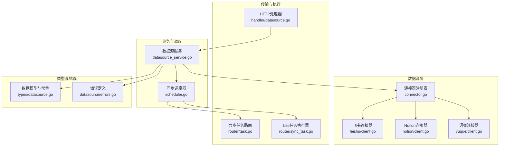
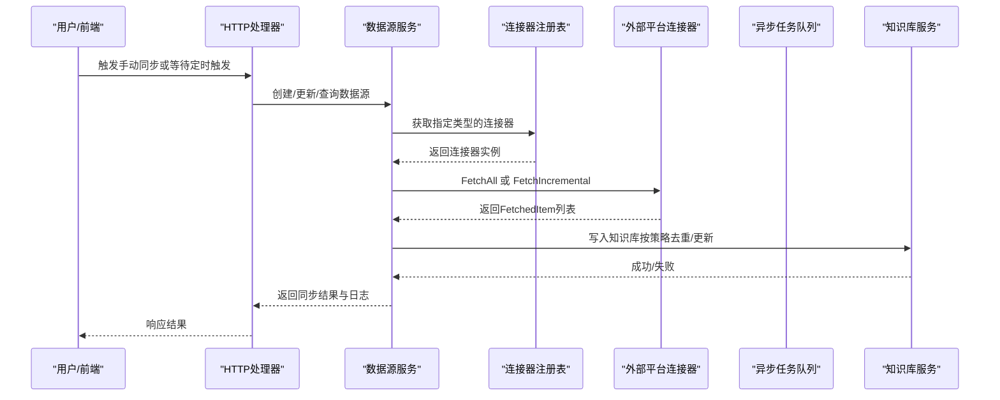
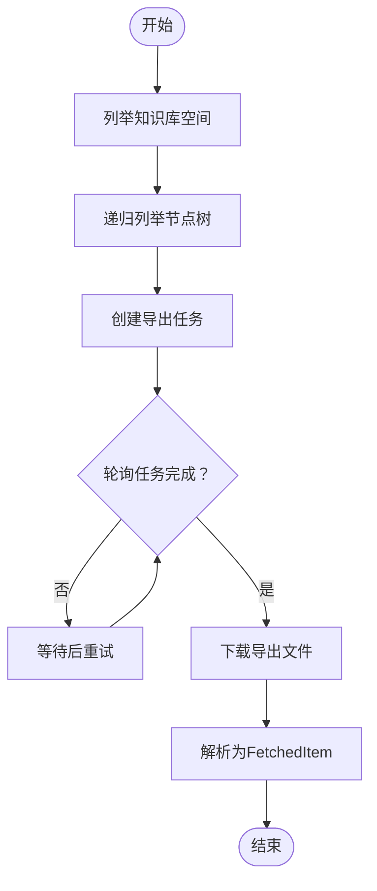
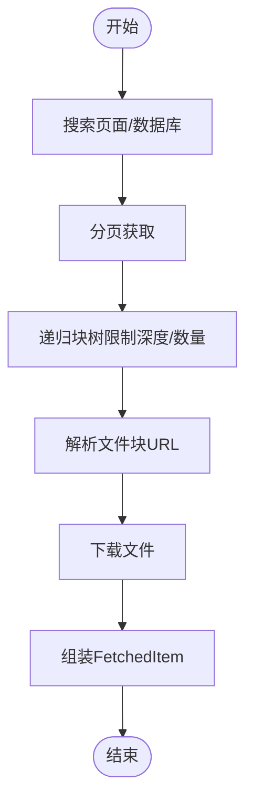
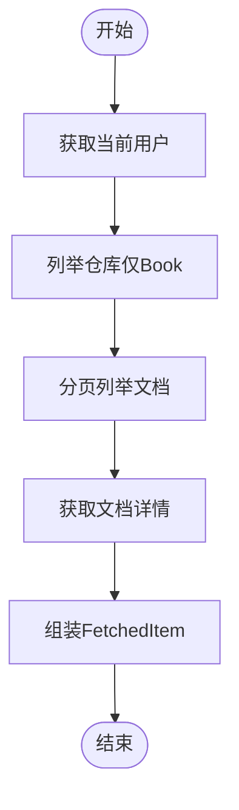
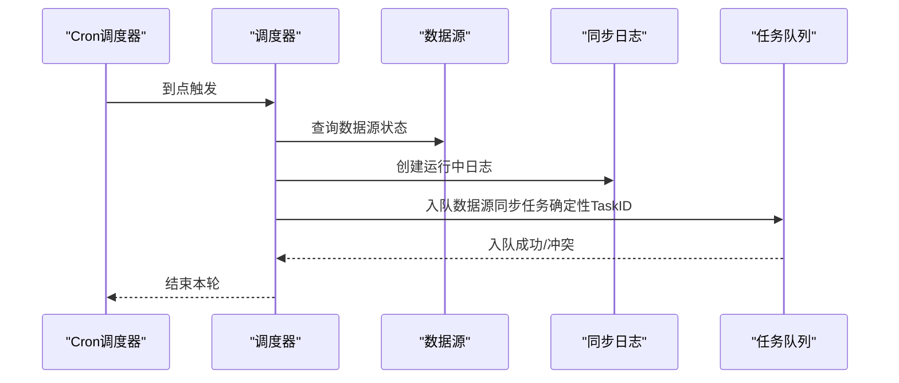
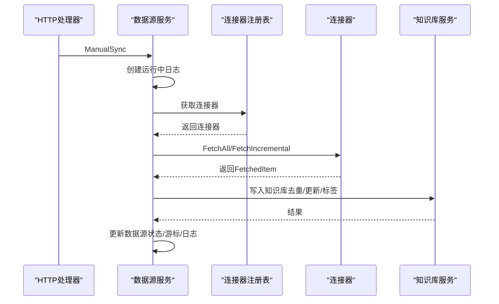
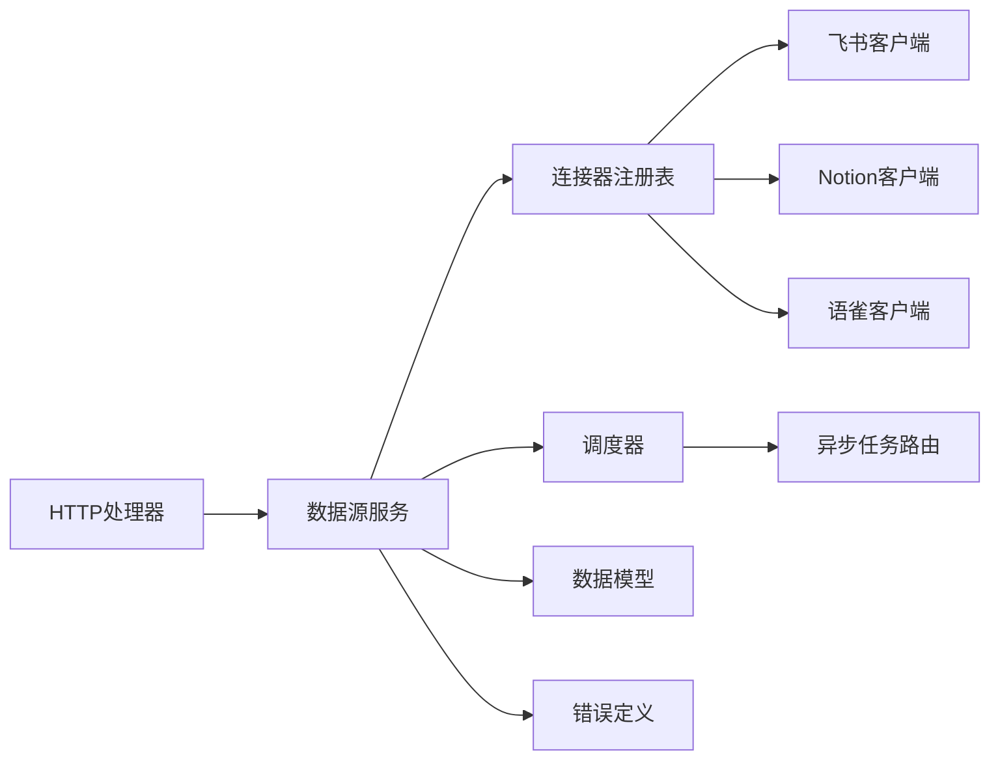

# 数据源集成

<cite>
**本文引用的文件**
- [connector.go](file://internal/datasource/connector.go)
- [scheduler.go](file://internal/datasource/scheduler.go)
- [CONNECTOR_IMPLEMENTATION_GUIDE.md](file://internal/datasource/CONNECTOR_IMPLEMENTATION_GUIDE.md)
- [README.md](file://internal/datasource/README.md)
- [client.go（飞书）](file://internal/datasource/connector/feishu/client.go)
- [client.go（Notion）](file://internal/datasource/connector/notion/client.go)
- [client.go（语雀）](file://internal/datasource/connector/yuque/client.go)
- [datasource.go](file://internal/types/datasource.go)
- [datasource_service.go](file://internal/application/service/datasource_service.go)
- [datasource.go（HTTP处理器）](file://internal/handler/datasource.go)
- [task.go（异步任务路由）](file://internal/router/task.go)
- [sync_task.go（Lite模式任务路由）](file://internal/router/sync_task.go)
- [errors.go（数据源错误定义）](file://internal/datasource/errors.go)
</cite>

## 目录
1. [简介](#简介)
2. [项目结构](#项目结构)
3. [核心组件](#核心组件)
4. [架构总览](#架构总览)
5. [详细组件分析](#详细组件分析)
6. [依赖关系分析](#依赖关系分析)
7. [性能考量](#性能考量)
8. [故障排查指南](#故障排查指南)
9. [结论](#结论)
10. [附录](#附录)

## 简介
本技术文档面向WeKnora数据源集成系统，聚焦于外部数据源连接器的架构设计与实现，覆盖飞书、Notion、语雀三大连接器，并深入解释自动同步机制、同步调度器、增量同步策略与错误恢复机制。同时涵盖数据源配置管理、连接测试、权限验证、数据转换处理、多租户隔离、同步状态监控与故障诊断方法，以及扩展新数据源的最佳实践与性能优化策略。

## 项目结构
WeKnora的数据源集成以“适配器模式”为核心：统一的Connector接口抽象不同平台差异，通过注册表管理具体连接器实现；业务层负责编排与调度，异步任务队列承载实际抓取与入库流程；HTTP层提供REST API供前端与运维操作。

图表来源
- [connector.go:1-208](file://internal/datasource/connector.go#L1-L208)
- [scheduler.go:1-211](file://internal/datasource/scheduler.go#L1-L211)
- [datasource_service.go:1-755](file://internal/application/service/datasource_service.go#L1-L755)
- [datasource.go（HTTP处理器）:1-557](file://internal/handler/datasource.go#L1-L557)
- [task.go（异步任务路由）:1-166](file://internal/router/task.go#L1-L166)
- [sync_task.go（Lite模式任务路由）:1-107](file://internal/router/sync_task.go#L1-L107)
- [datasource.go:1-418](file://internal/types/datasource.go#L1-L418)
- [errors.go（数据源错误定义）:1-33](file://internal/datasource/errors.go#L1-L33)

章节来源
- [README.md:1-261](file://internal/datasource/README.md#L1-L261)

## 核心组件
- 连接器接口与注册表
  - Connector接口定义了Type、Validate、ListResources、FetchAll、FetchIncremental等能力，确保各平台实现一致的契约。
  - ConnectorRegistry负责注册与查找连接器实例，支持动态扩展。
- 同步调度器
  - 基于robfig/cron与asynq实现，支持多实例去重、防止重叠运行、记录同步日志。
- 数据源服务
  - 负责配置校验、手动触发、暂停/恢复、结果写入知识库、自动标签、冲突策略与错误回退。
- HTTP处理器
  - 提供数据源的CRUD、资源列举、连接测试、手动同步、日志查询等API端点。
- 异步任务路由
  - 注册数据源同步任务处理器，支持生产环境Redis队列与Lite模式本地执行两种形态。

章节来源
- [connector.go:9-31](file://internal/datasource/connector.go#L9-L31)
- [connector.go:33-73](file://internal/datasource/connector.go#L33-L73)
- [scheduler.go:18-52](file://internal/datasource/scheduler.go#L18-L52)
- [datasource_service.go:21-57](file://internal/application/service/datasource_service.go#L21-L57)
- [datasource.go（HTTP处理器）:14-29](file://internal/handler/datasource.go#L14-L29)
- [task.go（异步任务路由）:100-166](file://internal/router/task.go#L100-L166)
- [sync_task.go（Lite模式任务路由）:17-107](file://internal/router/sync_task.go#L17-L107)

## 架构总览
下图展示从用户触发到内容入库的完整链路，包括定时调度、任务执行、连接器抓取与知识库写入。

图表来源
- [datasource.go（HTTP处理器）:366-396](file://internal/handler/datasource.go#L366-L396)
- [datasource_service.go:269-324](file://internal/application/service/datasource_service.go#L269-L324)
- [datasource_service.go:387-599](file://internal/application/service/datasource_service.go#L387-L599)
- [connector.go:11-31](file://internal/datasource/connector.go#L11-L31)

## 详细组件分析

### 飞书连接器（Feishu）
- 设计要点
  - 使用租户级访问令牌（tenant_access_token），带过期时间缓存与安全余量，避免频繁鉴权。
  - 支持知识库空间与节点树递归遍历，获取所有文档。
  - 提供导出任务与下载能力，兼容多种对象类型（docx、sheet、bitable等）。
- 关键流程
  - 列举空间与节点 → 递归展开树 → 导出/下载内容 → 解析为FetchedItem。
- 错误与重试
  - 统一日志记录请求与响应摘要，便于定位异常。
  - 导出任务轮询超时与下载失败有明确错误返回。

图表来源
- [client.go（飞书）:159-265](file://internal/datasource/connector/feishu/client.go#L159-L265)
- [client.go（飞书）:299-411](file://internal/datasource/connector/feishu/client.go#L299-L411)

章节来源
- [client.go（飞书）:16-95](file://internal/datasource/connector/feishu/client.go#L16-L95)
- [client.go（飞书）:159-265](file://internal/datasource/connector/feishu/client.go#L159-L265)
- [client.go（飞书）:299-411](file://internal/datasource/connector/feishu/client.go#L299-L411)

### Notion连接器（Notion）
- 设计要点
  - 自带速率限制（每秒请求数与突发容量），并具备指数退避重试。
  - 支持分页检索页面与数据库，块树递归拉取但限制深度与每页块数，避免过度API开销。
  - 对文件上传块进行二次解析以获得可下载URL。
- 关键流程
  - 搜索页面/数据库 → 分页获取 → 递归块树 → 文件块解析 → 下载文件 → 组装FetchedItem。
- 错误与重试
  - 401/403识别为无效凭证；429按Retry-After或默认等待；5xx有限重试；其他状态码统一报错。

图表来源
- [client.go（Notion）:156-174](file://internal/datasource/connector/notion/client.go#L156-L174)
- [client.go（Notion）:269-335](file://internal/datasource/connector/notion/client.go#L269-L335)
- [client.go（Notion）:358-371](file://internal/datasource/connector/notion/client.go#L358-L371)
- [client.go（Notion）:375-421](file://internal/datasource/connector/notion/client.go#L375-L421)

章节来源
- [client.go（Notion）:20-39](file://internal/datasource/connector/notion/client.go#L20-L39)
- [client.go（Notion）:156-174](file://internal/datasource/connector/notion/client.go#L156-L174)
- [client.go（Notion）:269-335](file://internal/datasource/connector/notion/client.go#L269-L335)
- [client.go（Notion）:358-421](file://internal/datasource/connector/notion/client.go#L358-L421)

### 语雀连接器（Yuque）
- 设计要点
  - 带重试与指数退避，支持429与5xx有限重试，401/403识别为无效凭证。
  - 用户组/仓库/文档列表采用分页拉取，仅保留文档型仓库（Book）。
- 关键流程
  - 获取当前用户 → 列举仓库 → 列举文档 → 拉取详情 → 组装FetchedItem。
- 错误与重试
  - Retry-After解析与最小等待控制；超过阈值返回明确错误信息。

图表来源
- [client.go（语雀）:181-185](file://internal/datasource/connector/yuque/client.go#L181-L185)
- [client.go（语雀）:218-238](file://internal/datasource/connector/yuque/client.go#L218-L238)
- [client.go（语雀）:264-296](file://internal/datasource/connector/yuque/client.go#L264-L296)

章节来源
- [client.go（语雀）:23-41](file://internal/datasource/connector/yuque/client.go#L23-L41)
- [client.go（语雀）:181-238](file://internal/datasource/connector/yuque/client.go#L181-L238)
- [client.go（语雀）:264-296](file://internal/datasource/connector/yuque/client.go#L264-L296)

### 同步调度器（Scheduler）
- 设计要点
  - 基于robfig/cron按绝对时刻触发；通过DB层HasRunningSync防止重叠运行。
  - 通过asynq的确定性TaskID在多实例场景下去重，同一分钟内仅一个实例入队。
  - 记录SyncLog并注入Langfuse追踪上下文，便于端到端可观测。
- 关键流程
  - 加载活跃数据源 → 注册/更新Cron条目 → 触发时创建运行中日志 → 入队数据源同步任务 → 多实例去重与失败回写。

图表来源
- [scheduler.go:117-130](file://internal/datasource/scheduler.go#L117-L130)
- [scheduler.go:132-203](file://internal/datasource/scheduler.go#L132-L203)

章节来源
- [scheduler.go:18-52](file://internal/datasource/scheduler.go#L18-L52)
- [scheduler.go:117-203](file://internal/datasource/scheduler.go#L117-L203)

### 数据源服务（DataSourceService）
- 设计要点
  - 配置校验：ValidateConnection/ValidateCredentials分别持久化与非持久化校验。
  - 手动同步：创建运行中日志并入队异步任务。
  - 处理同步：根据模式选择全量或增量抓取，写入知识库并统计结果。
  - 自动标签：为每个数据源创建唯一标签，便于溯源与筛选。
- 关键流程
  - 手动触发 → 创建日志 → 入队任务 → 取消/暂停时清理待执行日志 → 处理任务 → 更新数据源状态与游标。

图表来源
- [datasource_service.go:269-324](file://internal/application/service/datasource_service.go#L269-L324)
- [datasource_service.go:387-599](file://internal/application/service/datasource_service.go#L387-L599)

章节来源
- [datasource_service.go:202-238](file://internal/application/service/datasource_service.go#L202-L238)
- [datasource_service.go:240-267](file://internal/application/service/datasource_service.go#L240-L267)
- [datasource_service.go:269-324](file://internal/application/service/datasource_service.go#L269-L324)
- [datasource_service.go:387-599](file://internal/application/service/datasource_service.go#L387-L599)

### HTTP处理器（API层）
- 设计要点
  - 租户隔离：所有端点均校验租户上下文与知识库归属。
  - 连接测试：ValidateConnection持久化测试，ValidateCredentials不落库测试。
  - 日志查询：支持分页参数limit/offset。
- 关键流程
  - 校验租户 → 校验知识库归属 → 调用服务层 → 返回JSON响应。

章节来源
- [datasource.go（HTTP处理器）:31-75](file://internal/handler/datasource.go#L31-L75)
- [datasource.go（HTTP处理器）:261-290](file://internal/handler/datasource.go#L261-L290)
- [datasource.go（HTTP处理器）:460-511](file://internal/handler/datasource.go#L460-L511)

### 异步任务路由（生产/轻量）
- 生产模式
  - 通过RunAsynqServer注册数据源同步任务处理器，支持队列优先级与自定义重试策略。
- Lite模式
  - 通过SyncTaskExecutor在无Redis环境下直接goroutine执行，便于单机调试与演示。

章节来源
- [task.go（异步任务路由）:100-166](file://internal/router/task.go#L100-L166)
- [sync_task.go（Lite模式任务路由）:68-107](file://internal/router/sync_task.go#L68-L107)

## 依赖关系分析
- 组件耦合
  - ConnectorRegistry与各平台连接器松耦合，通过接口契约解耦。
  - DataSourceService依赖连接器注册表、知识库服务、任务队列与租户仓库，承担编排职责。
  - HTTP处理器仅作为入口，不直接参与业务逻辑。
- 外部依赖
  - asynq用于任务队列与重试；robfig/cron用于定时；Langfuse用于追踪。
- 循环依赖
  - 未发现循环依赖迹象；类型与服务分层清晰。

图表来源
- [datasource.go（HTTP处理器）:14-29](file://internal/handler/datasource.go#L14-L29)
- [datasource_service.go:21-57](file://internal/application/service/datasource_service.go#L21-L57)
- [connector.go:33-73](file://internal/datasource/connector.go#L33-L73)
- [scheduler.go:18-52](file://internal/datasource/scheduler.go#L18-L52)
- [task.go（异步任务路由）:100-166](file://internal/router/task.go#L100-L166)
- [datasource.go:1-418](file://internal/types/datasource.go#L1-L418)
- [errors.go（数据源错误定义）:1-33](file://internal/datasource/errors.go#L1-L33)

章节来源
- [connector.go:33-73](file://internal/datasource/connector.go#L33-L73)
- [datasource_service.go:21-57](file://internal/application/service/datasource_service.go#L21-L57)
- [scheduler.go:18-52](file://internal/datasource/scheduler.go#L18-L52)
- [task.go（异步任务路由）:100-166](file://internal/router/task.go#L100-L166)

## 性能考量
- 并发与去重
  - 多实例同分钟内的确定性TaskID确保仅一个实例入队，避免重复工作。
  - HasRunningSync防止长耗时同步任务重叠执行。
- 速率限制与退避
  - Notion连接器内置速率限制与指数退避；语雀连接器对429/5xx进行有限重试与等待。
- 分页与深度限制
  - Notion块树递归设置最大深度与每页块数上限，避免API风暴。
- 资源隔离
  - 多租户字段贯穿配置、日志与任务执行，确保数据隔离。
- 可观测性
  - Langfuse中间件自动注入追踪上下文，便于端到端性能分析。

章节来源
- [scheduler.go:132-203](file://internal/datasource/scheduler.go#L132-L203)
- [client.go（Notion）:269-335](file://internal/datasource/connector/notion/client.go#L269-L335)
- [client.go（语雀）:43-151](file://internal/datasource/connector/yuque/client.go#L43-L151)

## 故障排查指南
- 常见错误分类
  - 连接器错误：连接器为空、类型为空、未找到类型。
  - 数据源错误：数据源不存在、配置无效、状态异常。
  - 配置错误：配置无效、凭证无效。
  - 同步错误：同步失败、被取消、抓取失败、资源未找到。
  - 知识库错误：知识库未找到。
  - 日志错误：日志未找到。
- 排查步骤
  - 使用ValidateConnection或ValidateCredentials快速验证凭证有效性。
  - 查看SyncLog中的状态、开始/结束时间、失败项与错误消息。
  - 检查租户ID与知识库归属是否匹配。
  - 在生产环境检查Redis连通性与队列状态；Lite模式检查本地goroutine执行日志。
  - 针对特定平台，关注其API返回码与重试行为（Notion 429/5xx、语雀429/401/403）。

章节来源
- [errors.go（数据源错误定义）:6-32](file://internal/datasource/errors.go#L6-L32)
- [datasource_service.go:202-238](file://internal/application/service/datasource_service.go#L202-L238)
- [datasource.go（HTTP处理器）:261-290](file://internal/handler/datasource.go#L261-L290)
- [datasource.go（HTTP处理器）:460-511](file://internal/handler/datasource.go#L460-L511)

## 结论
WeKnora数据源集成系统通过统一的连接器接口与注册表，实现了对飞书、Notion、语雀等多平台的标准化接入；结合robfig/cron与asynq的调度与任务执行机制，提供了高可用、可扩展、可观测的自动同步能力。服务层在配置校验、增量/全量同步、知识库写入与错误恢复方面形成闭环；HTTP层与任务路由层保证了易用性与可维护性。建议在新增连接器时遵循官方开发指南，严格控制速率与重试、做好分页与深度限制，并充分利用租户隔离与追踪能力提升稳定性与可运维性。

## 附录

### 数据源配置管理与连接测试
- 配置结构
  - 类型、凭证、资源ID集合、设置项。
- 连接测试
  - ValidateConnection：持久化测试，失败会更新数据源状态与错误信息。
  - ValidateCredentials：非持久化测试，适合前端“测试连接”按钮。

章节来源
- [datasource.go:196-210](file://internal/types/datasource.go#L196-L210)
- [datasource_service.go:202-238](file://internal/application/service/datasource_service.go#L202-L238)
- [datasource_service.go:601-618](file://internal/application/service/datasource_service.go#L601-L618)
- [datasource.go（HTTP处理器）:261-329](file://internal/handler/datasource.go#L261-L329)

### 权限验证与多租户隔离
- 权限验证
  - 通过租户ID与知识库归属校验，确保只有拥有者可访问数据源配置。
- 多租户隔离
  - 数据源、同步日志、任务执行均携带TenantID，保障跨租户数据隔离。

章节来源
- [datasource.go（HTTP处理器）:31-75](file://internal/handler/datasource.go#L31-L75)
- [datasource.go:48-114](file://internal/types/datasource.go#L48-L114)
- [datasource_service.go:486-503](file://internal/application/service/datasource_service.go#L486-L503)

### 增量同步策略与游标
- 增量同步
  - 读取LastSyncCursor，调用FetchIncremental获取变更项，返回NextCursor用于下次同步。
- 游标结构
  - 包含最后同步时间、平台特定游标与schema哈希，便于检测结构变化。

章节来源
- [datasource_service.go:456-465](file://internal/application/service/datasource_service.go#L456-L465)
- [datasource.go:275-286](file://internal/types/datasource.go#L275-L286)

### 数据转换与入库
- 写入策略
  - 若存在相同external_id则先删除再重建，实现“更新=删除+重建”。
  - 支持从字节流或URL两种方式构建知识条目。
- 自动标签
  - 为每个数据源创建唯一标签，便于溯源与筛选。

章节来源
- [datasource_service.go:636-710](file://internal/application/service/datasource_service.go#L636-L710)
- [datasource_service.go:505-513](file://internal/application/service/datasource_service.go#L505-L513)

### 扩展新数据源最佳实践
- 参考官方指南
  - 创建包结构、实现平台类型、API客户端与连接器接口。
  - 在容器中注册连接器与元数据，添加类型常量与优先级。
- 实现要点
  - 明确认证方式（OAuth/API Key/Token/密码）与能力清单（增量/网页钩子/删除同步）。
  - 控制速率与重试，做好分页与深度限制。
  - 统一输出FetchedItem格式，保留必要元数据与来源信息。

章节来源
- [CONNECTOR_IMPLEMENTATION_GUIDE.md:1-498](file://internal/datasource/CONNECTOR_IMPLEMENTATION_GUIDE.md#L1-L498)
- [connector.go:86-185](file://internal/datasource/connector.go#L86-L185)