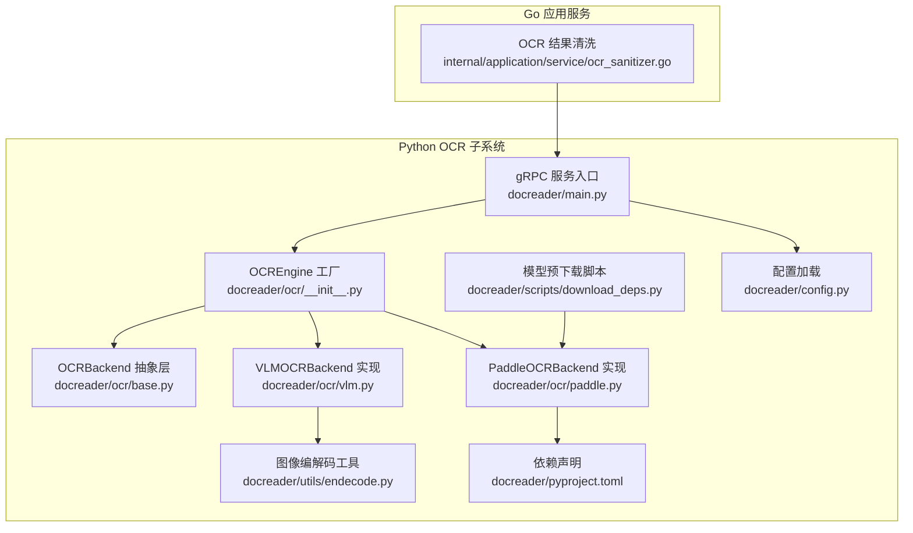
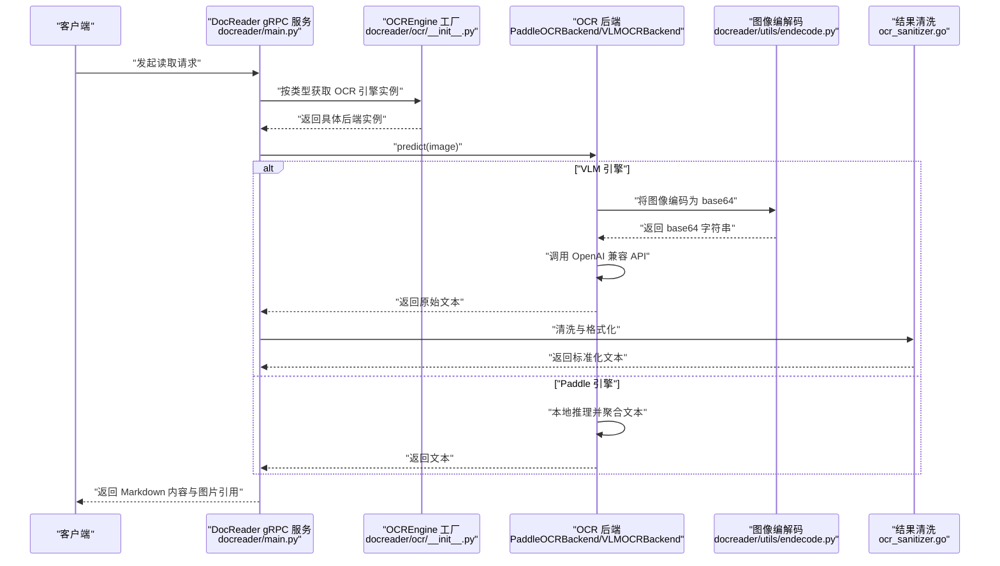
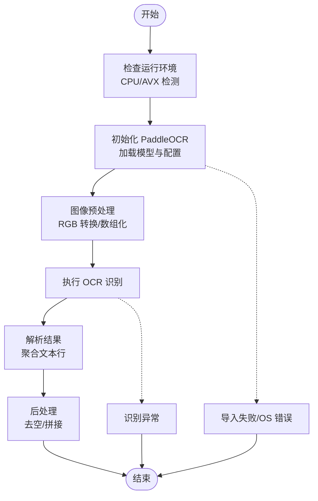
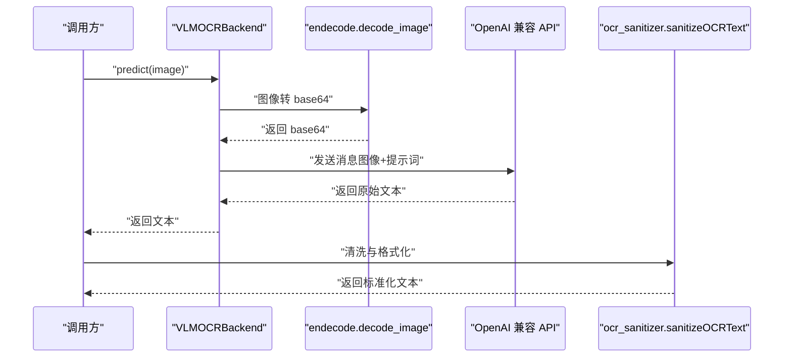
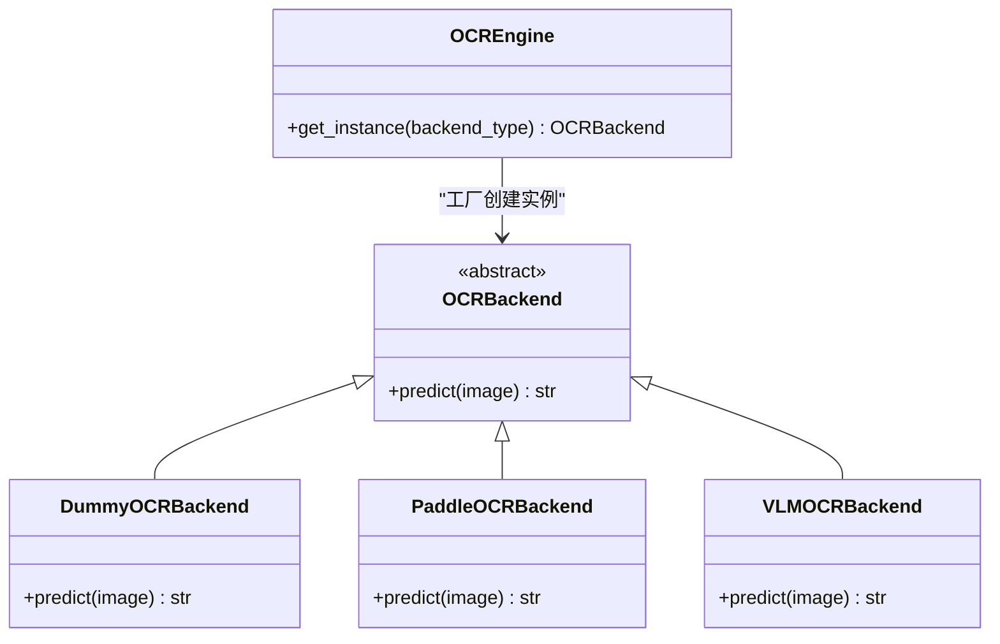
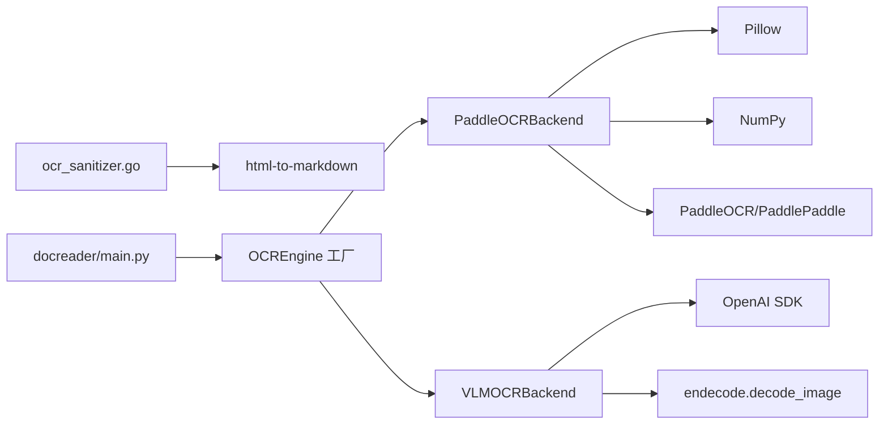

# OCR识别功能

<cite>
**本文引用的文件**
- [docreader/ocr/__init__.py](file://docreader/ocr/__init__.py)
- [docreader/ocr/base.py](file://docreader/ocr/base.py)
- [docreader/ocr/paddle.py](file://docreader/ocr/paddle.py)
- [docreader/ocr/vlm.py](file://docreader/ocr/vlm.py)
- [docreader/utils/endecode.py](file://docreader/utils/endecode.py)
- [docreader/scripts/download_deps.py](file://docreader/scripts/download_deps.py)
- [docreader/pyproject.toml](file://docreader/pyproject.toml)
- [internal/application/service/ocr_sanitizer.go](file://internal/application/service/ocr_sanitizer.go)
- [docreader/main.py](file://docreader/main.py)
- [docreader/config.py](file://docreader/config.py)
</cite>

## 目录
1. [简介](#简介)
2. [项目结构](#项目结构)
3. [核心组件](#核心组件)
4. [架构总览](#架构总览)
5. [详细组件分析](#详细组件分析)
6. [依赖关系分析](#依赖关系分析)
7. [性能考虑](#性能考虑)
8. [故障排查指南](#故障排查指南)
9. [结论](#结论)
10. [附录](#附录)

## 简介
本文件面向开发者，系统性梳理 WeKnora 的 OCR 识别能力：包括 OCR 引擎架构、多引擎支持（PaddleOCR 与 VL 模型）、识别流程设计、图像预处理、文本识别与结果后处理机制，并给出性能优化、准确率提升与错误处理策略。同时提供不同引擎选择指南、配置参数说明与集成方法，帮助快速完成 OCR 功能的使用与扩展。

## 项目结构
WeKnora 的 OCR 能力主要位于 Python 子系统 docreader 中，核心模块如下：
- OCR 引擎工厂与抽象层：docreader/ocr
- 图像编解码工具：docreader/utils/endecode.py
- OCR 模型初始化脚本：docreader/scripts/download_deps.py
- OCR 结果清洗（Go 侧）：internal/application/service/ocr_sanitizer.go
- 服务入口与 gRPC 接口：docreader/main.py
- 配置加载：docreader/config.py
- 依赖声明：docreader/pyproject.toml

图表来源
- [docreader/ocr/__init__.py:12-38](file://docreader/ocr/__init__.py#L12-L38)
- [docreader/ocr/base.py:10-32](file://docreader/ocr/base.py#L10-L32)
- [docreader/ocr/paddle.py:16-176](file://docreader/ocr/paddle.py#L16-L176)
- [docreader/ocr/vlm.py:14-88](file://docreader/ocr/vlm.py#L14-L88)
- [docreader/utils/endecode.py:23-76](file://docreader/utils/endecode.py#L23-L76)
- [docreader/scripts/download_deps.py:26-71](file://docreader/scripts/download_deps.py#L26-L71)
- [docreader/config.py:48-122](file://docreader/config.py#L48-L122)
- [docreader/main.py:98-215](file://docreader/main.py#L98-L215)
- [docreader/pyproject.toml:1-40](file://docreader/pyproject.toml#L1-L40)
- [internal/application/service/ocr_sanitizer.go:27-110](file://internal/application/service/ocr_sanitizer.go#L27-L110)

章节来源
- [docreader/ocr/__init__.py:12-38](file://docreader/ocr/__init__.py#L12-L38)
- [docreader/ocr/base.py:10-32](file://docreader/ocr/base.py#L10-L32)
- [docreader/ocr/paddle.py:16-176](file://docreader/ocr/paddle.py#L16-L176)
- [docreader/ocr/vlm.py:14-88](file://docreader/ocr/vlm.py#L14-L88)
- [docreader/utils/endecode.py:23-76](file://docreader/utils/endecode.py#L23-L76)
- [docreader/scripts/download_deps.py:26-71](file://docreader/scripts/download_deps.py#L26-L71)
- [docreader/pyproject.toml:1-40](file://docreader/pyproject.toml#L1-L40)
- [internal/application/service/ocr_sanitizer.go:27-110](file://internal/application/service/ocr_sanitizer.go#L27-L110)
- [docreader/main.py:98-215](file://docreader/main.py#L98-L215)
- [docreader/config.py:48-122](file://docreader/config.py#L48-L122)

## 核心组件
- OCR 引擎工厂（OCREngine）
  - 提供按类型获取后端实例的单例工厂，支持“paddle”、“vlm”与“dummy”三种后端。
  - 关键实现路径：[docreader/ocr/__init__.py:12-38](file://docreader/ocr/__init__.py#L12-L38)
- OCR 抽象层（OCRBackend）
  - 统一 predict 接口，定义所有后端的最小契约。
  - 关键实现路径：[docreader/ocr/base.py:10-32](file://docreader/ocr/base.py#L10-L32)
- PaddleOCR 后端（PaddleOCRBackend）
  - 基于 PaddleOCR 的本地推理引擎，支持 CPU 自适应与 AVX 指令集检测，提供 OCR 文本提取。
  - 关键实现路径：[docreader/ocr/paddle.py:16-176](file://docreader/ocr/paddle.py#L16-L176)
- VL 模型后端（VLMOCRBackend）
  - 基于 OpenAI 兼容 API 的视觉语言模型 OCR，通过提示词引导输出 Markdown 格式。
  - 关键实现路径：[docreader/ocr/vlm.py:14-88](file://docreader/ocr/vlm.py#L14-L88)
- 图像编解码工具（endecode.decode_image）
  - 支持从多种输入格式生成 base64 字符串，用于 VLM API 传输。
  - 关键实现路径：[docreader/utils/endecode.py:23-76](file://docreader/utils/endecode.py#L23-L76)
- OCR 结果清洗（ocr_sanitizer.sanitizeOCRText）
  - 清洗 VLM 输出中的 HTML 包装、去除无意义回复、规范化换行等。
  - 关键实现路径：[internal/application/service/ocr_sanitizer.go:27-110](file://internal/application/service/ocr_sanitizer.go#L27-L110)
- 模型预下载脚本（download_deps.init_ocr_model）
  - 预下载并缓存 PaddleOCR 模型，减少首次调用延迟。
  - 关键实现路径：[docreader/scripts/download_deps.py:26-71](file://docreader/scripts/download_deps.py#L26-L71)
- 配置加载（config.load_config）
  - 提供 DocReader 的运行时配置项，影响服务行为。
  - 关键实现路径：[docreader/config.py:66-97](file://docreader/config.py#L66-L97)

章节来源
- [docreader/ocr/__init__.py:12-38](file://docreader/ocr/__init__.py#L12-L38)
- [docreader/ocr/base.py:10-32](file://docreader/ocr/base.py#L10-L32)
- [docreader/ocr/paddle.py:16-176](file://docreader/ocr/paddle.py#L16-L176)
- [docreader/ocr/vlm.py:14-88](file://docreader/ocr/vlm.py#L14-L88)
- [docreader/utils/endecode.py:23-76](file://docreader/utils/endecode.py#L23-L76)
- [internal/application/service/ocr_sanitizer.go:27-110](file://internal/application/service/ocr_sanitizer.go#L27-L110)
- [docreader/scripts/download_deps.py:26-71](file://docreader/scripts/download_deps.py#L26-L71)
- [docreader/config.py:66-97](file://docreader/config.py#L66-L97)

## 架构总览
OCR 识别在 WeKnora 中采用“后端可插拔 + 服务编排”的架构：
- 前端或上层服务通过 gRPC 请求 DocReader 服务。
- DocReader 服务根据请求选择 OCR 引擎（工厂模式），执行识别。
- 对于 VLM 引擎，将图像编码为 base64 并通过 OpenAI 兼容 API 发送；对于 Paddle 引擎，在本地执行推理。
- 识别完成后，Go 侧对 VLM 输出进行清洗与格式化，再返回给客户端。

图表来源
- [docreader/main.py:98-215](file://docreader/main.py#L98-L215)
- [docreader/ocr/__init__.py:12-38](file://docreader/ocr/__init__.py#L12-L38)
- [docreader/ocr/paddle.py:118-176](file://docreader/ocr/paddle.py#L118-L176)
- [docreader/ocr/vlm.py:41-88](file://docreader/ocr/vlm.py#L41-L88)
- [docreader/utils/endecode.py:23-76](file://docreader/utils/endecode.py#L23-L76)
- [internal/application/service/ocr_sanitizer.go:27-110](file://internal/application/service/ocr_sanitizer.go#L27-L110)

## 详细组件分析

### PaddleOCR 引擎实现与配置
- 初始化策略
  - 强制使用 CPU 设备，禁用 GPU。
  - 在 Linux 上尝试检测 CPU 是否支持 AVX，不支持则切换兼容模式。
  - 使用固定模型名称与阈值配置，启用文档方向分类与文本行方向检测，提高准确性。
- 输入预处理
  - 支持字符串路径、字节流与 PIL 图像对象；统一转换为 RGB。
  - 转换为 numpy 数组后交由 PaddleOCR 执行检测与识别。
- 结果后处理
  - 解析 PaddleOCR 返回的多行文本，过滤空行并拼接为单一字符串。
- 错误处理
  - 捕获导入失败、OS 错误（非法指令等）与通用异常，记录日志并回退为空字符串。
- 性能与优化
  - 通过 det_db_score_mode 与 use_dilation 等参数提升精度。
  - 首次初始化耗时较长，建议配合预下载脚本。

图表来源
- [docreader/ocr/paddle.py:19-117](file://docreader/ocr/paddle.py#L19-L117)
- [docreader/ocr/paddle.py:118-176](file://docreader/ocr/paddle.py#L118-L176)

章节来源
- [docreader/ocr/paddle.py:16-176](file://docreader/ocr/paddle.py#L16-L176)
- [docreader/scripts/download_deps.py:26-71](file://docreader/scripts/download_deps.py#L26-L71)

### VL 模型引擎实现与配置
- 初始化与调用
  - 从全局配置读取模型名、API Key 与基础地址，构造 OpenAI 兼容客户端。
  - 使用自定义提示词，要求模型以 Markdown 格式输出正文，忽略页眉页脚，表格用 HTML 表达，公式用 LaTeX 表达。
- 图像传输
  - 通过 endecode.decode_image 将输入图像编码为 base64，封装为 OpenAI API 的消息结构发送。
- 结果清洗
  - Go 侧清洗函数负责去除 HTML 包装、转换为 Markdown、过滤无意义回复与多余换行。
- 错误处理
  - 捕获客户端未初始化、API 调用异常等情况，记录日志并回退为空字符串。

图表来源
- [docreader/ocr/vlm.py:17-88](file://docreader/ocr/vlm.py#L17-L88)
- [docreader/utils/endecode.py:23-76](file://docreader/utils/endecode.py#L23-L76)
- [internal/application/service/ocr_sanitizer.go:27-110](file://internal/application/service/ocr_sanitizer.go#L27-L110)

章节来源
- [docreader/ocr/vlm.py:14-88](file://docreader/ocr/vlm.py#L14-L88)
- [docreader/utils/endecode.py:23-76](file://docreader/utils/endecode.py#L23-L76)
- [internal/application/service/ocr_sanitizer.go:27-110](file://internal/application/service/ocr_sanitizer.go#L27-L110)

### OCR 引擎工厂与抽象层
- 工厂模式
  - OCREngine.get_instance 根据 backend_type 返回对应后端实例，内部维护线程安全的实例缓存。
  - 支持“paddle”、“vlm”与“dummy”，默认回退为 dummy。
- 抽象层
  - OCRBackend 定义统一的 predict 接口，便于替换与扩展。

图表来源
- [docreader/ocr/base.py:10-32](file://docreader/ocr/base.py#L10-L32)
- [docreader/ocr/__init__.py:12-38](file://docreader/ocr/__init__.py#L12-L38)
- [docreader/ocr/paddle.py:16-176](file://docreader/ocr/paddle.py#L16-L176)
- [docreader/ocr/vlm.py:14-88](file://docreader/ocr/vlm.py#L14-L88)

章节来源
- [docreader/ocr/base.py:10-32](file://docreader/ocr/base.py#L10-L32)
- [docreader/ocr/__init__.py:12-38](file://docreader/ocr/__init__.py#L12-L38)

### 图像预处理与传输机制
- 多格式输入
  - 支持文件路径、字节流、PIL 图像对象与 numpy 数组。
- 编码传输
  - VLM 引擎通过 base64 编码图像，避免二进制传输复杂度。
- 格式转换
  - Paddle 引擎统一转换为 RGB，确保后续推理一致性。

章节来源
- [docreader/utils/endecode.py:23-76](file://docreader/utils/endecode.py#L23-L76)
- [docreader/ocr/paddle.py:118-155](file://docreader/ocr/paddle.py#L118-L155)
- [docreader/ocr/vlm.py:55-61](file://docreader/ocr/vlm.py#L55-L61)

### 结果后处理与清洗
- HTML 包装剥离与 Markdown 转换
- 去除无意义回复（如“无文字内容”、“no text”等）
- 规范化换行与空白字符
- 代码块包装剥离

章节来源
- [internal/application/service/ocr_sanitizer.go:27-110](file://internal/application/service/ocr_sanitizer.go#L27-L110)

## 依赖关系分析
- Python 依赖
  - 主要依赖包括 gRPC、PaddleOCR、OpenAI SDK、Pillow 等，满足本地推理与远程 API 调用需求。
- 模块间耦合
  - OCREngine 仅依赖抽象层与具体后端实现，耦合度低，易于扩展新引擎。
  - VLM 引擎依赖配置与图像编解码工具，耦合集中在外部 API 与数据格式。
  - Go 侧清洗器独立于 Python 层，通过文本接口交互，降低耦合风险。

图表来源
- [docreader/pyproject.toml:7-39](file://docreader/pyproject.toml#L7-L39)
- [docreader/ocr/paddle.py:19-93](file://docreader/ocr/paddle.py#L19-L93)
- [docreader/ocr/vlm.py:25-32](file://docreader/ocr/vlm.py#L25-L32)
- [docreader/utils/endecode.py:23-76](file://docreader/utils/endecode.py#L23-L76)
- [internal/application/service/ocr_sanitizer.go:8](file://internal/application/service/ocr_sanitizer.go#L8)
- [docreader/main.py:98-101](file://docreader/main.py#L98-L101)

章节来源
- [docreader/pyproject.toml:1-40](file://docreader/pyproject.toml#L1-L40)
- [docreader/ocr/paddle.py:19-117](file://docreader/ocr/paddle.py#L19-L117)
- [docreader/ocr/vlm.py:17-32](file://docreader/ocr/vlm.py#L17-L32)
- [docreader/utils/endecode.py:23-76](file://docreader/utils/endecode.py#L23-L76)
- [internal/application/service/ocr_sanitizer.go:8](file://internal/application/service/ocr_sanitizer.go#L8)
- [docreader/main.py:98-101](file://docreader/main.py#L98-L101)

## 性能考虑
- PaddleOCR
  - 使用 CPU 与 AVX 检测，避免非法指令导致崩溃。
  - 通过 use_dilation 与 det_db_score_mode 提升识别精度，可能增加耗时。
  - 建议使用预下载脚本提前缓存模型，降低首次调用延迟。
- VL 模型
  - 依赖网络 API，受带宽与远端服务稳定性影响。
  - 可通过合理设置温度与最大 token 数控制输出长度与稳定性。
- 结果清洗
  - Go 侧清洗器对 HTML 到 Markdown 的转换与正则匹配有额外开销，建议在必要时启用。

章节来源
- [docreader/ocr/paddle.py:25-67](file://docreader/ocr/paddle.py#L25-L67)
- [docreader/ocr/paddle.py:72-90](file://docreader/ocr/paddle.py#L72-L90)
- [docreader/scripts/download_deps.py:26-71](file://docreader/scripts/download_deps.py#L26-L71)
- [docreader/ocr/vlm.py:31-32](file://docreader/ocr/vlm.py#L31-L32)
- [internal/application/service/ocr_sanitizer.go:27-110](file://internal/application/service/ocr_sanitizer.go#L27-L110)

## 故障排查指南
- PaddleOCR 初始化失败
  - 症状：导入失败或 OS 错误（非法指令/崩溃）。
  - 处理：确认 CPU 指令集支持；在 Linux 上检测 AVX；必要时安装 CPU-only 版本或切换引擎。
  - 参考路径：[docreader/ocr/paddle.py:95-116](file://docreader/ocr/paddle.py#L95-L116)
- VLM OCR 调用异常
  - 症状：客户端未初始化或 API 调用失败。
  - 处理：检查 OCR 相关环境变量与 API Key；确认网络连通性。
  - 参考路径：[docreader/ocr/vlm.py:50-52](file://docreader/ocr/vlm.py#L50-L52)、[docreader/ocr/vlm.py:85-87](file://docreader/ocr/vlm.py#L85-L87)
- 输出为空或无意义
  - 症状：返回空字符串或“无文字内容”等提示。
  - 处理：Go 侧清洗器已内置过滤逻辑；检查输入图像质量与提示词。
  - 参考路径：[internal/application/service/ocr_sanitizer.go:52-54](file://internal/application/service/ocr_sanitizer.go#L52-L54)、[docreader/ocr/vlm.py:34-39](file://docreader/ocr/vlm.py#L34-L39)
- 首次启动慢
  - 症状：PaddleOCR 首次初始化耗时长。
  - 处理：执行预下载脚本，提前缓存模型。
  - 参考路径：[docreader/scripts/download_deps.py:26-71](file://docreader/scripts/download_deps.py#L26-L71)

章节来源
- [docreader/ocr/paddle.py:95-116](file://docreader/ocr/paddle.py#L95-L116)
- [docreader/ocr/vlm.py:50-52](file://docreader/ocr/vlm.py#L50-L52)
- [docreader/ocr/vlm.py:85-87](file://docreader/ocr/vlm.py#L85-L87)
- [internal/application/service/ocr_sanitizer.go:52-54](file://internal/application/service/ocr_sanitizer.go#L52-L54)
- [docreader/scripts/download_deps.py:26-71](file://docreader/scripts/download_deps.py#L26-L71)

## 结论
WeKnora 的 OCR 能力通过可插拔的引擎工厂与清晰的抽象层实现，既支持本地高性能推理（PaddleOCR），也支持云端视觉语言模型（VLM）。结合图像编解码与 Go 侧清洗器，形成从输入到输出的一体化处理链路。建议在生产环境中优先使用 PaddleOCR 以获得更稳定的本地性能，若需要更强的语义理解与格式化能力，可选用 VLM 引擎并配合提示词优化与预下载策略。

## 附录

### 不同引擎选择指南
- 选择 PaddleOCR 当：
  - 需要稳定、可控的本地推理。
  - 对延迟敏感且希望避免网络波动。
  - 可接受纯文本输出或自行后处理格式。
- 选择 VLM 引擎当：
  - 需要更强的版面理解与格式化能力（Markdown/HTML/LaTeX）。
  - 可接受网络调用与 API Key 管理。
  - 对输出结构化程度有更高要求。

### 配置参数说明（Python 侧）
- PaddleOCR 配置要点
  - use_gpu: False（强制 CPU）
  - text_det_limit_side_len: 960（限制边长）
  - use_doc_orientation_classify: True（启用文档方向分类）
  - use_textline_orientation: True（启用文本行方向检测）
  - text_recognition_model_name: PP-OCRv4_server_rec
  - text_detection_model_name: PP-OCRv4_server_det
  - text_det_thresh/text_det_box_thresh/text_det_unclip_ratio：检测阈值与框扩展
  - text_rec_score_thresh: 0.0（识别置信度阈值）
  - use_dilation/det_db_score_mode：提升精度的参数
  - lang: ch（语言）
  - show_log: False（关闭日志）
- VLM 引擎配置要点
  - 从全局配置读取：
    - ocr_model：模型名
    - ocr_api_key：API Key
    - ocr_api_base_url：基础 URL
  - 调用参数：
    - temperature：0.0（稳定输出）
    - max_tokens：5000（输出长度上限）

章节来源
- [docreader/ocr/paddle.py:72-90](file://docreader/ocr/paddle.py#L72-L90)
- [docreader/ocr/vlm.py:25-32](file://docreader/ocr/vlm.py#L25-L32)

### 集成方法
- 本地集成（PaddleOCR）
  - 安装依赖：参见 [docreader/pyproject.toml:7-39](file://docreader/pyproject.toml#L7-L39)
  - 预下载模型：执行 [docreader/scripts/download_deps.py:26-71](file://docreader/scripts/download_deps.py#L26-L71)
  - 获取引擎实例：通过 [docreader/ocr/__init__.py:18-37](file://docreader/ocr/__init__.py#L18-L37) 传入 backend_type="paddle"
- 远程集成（VLM）
  - 设置环境变量：ocr_model、ocr_api_key、ocr_api_base_url
  - 获取引擎实例：传入 backend_type="vlm"
  - 发送图像：图像将被自动编码为 base64 并通过 OpenAI 兼容 API 发送
- 结果清洗
  - 若使用 VLM，请在 Go 侧调用 [internal/application/service/ocr_sanitizer.go:27-110](file://internal/application/service/ocr_sanitizer.go#L27-L110) 进行清洗

章节来源
- [docreader/pyproject.toml:7-39](file://docreader/pyproject.toml#L7-L39)
- [docreader/scripts/download_deps.py:26-71](file://docreader/scripts/download_deps.py#L26-L71)
- [docreader/ocr/__init__.py:18-37](file://docreader/ocr/__init__.py#L18-L37)
- [docreader/ocr/vlm.py:25-32](file://docreader/ocr/vlm.py#L25-L32)
- [internal/application/service/ocr_sanitizer.go:27-110](file://internal/application/service/ocr_sanitizer.go#L27-L110)