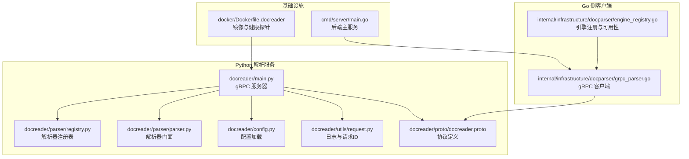
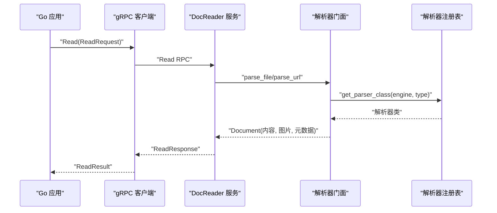
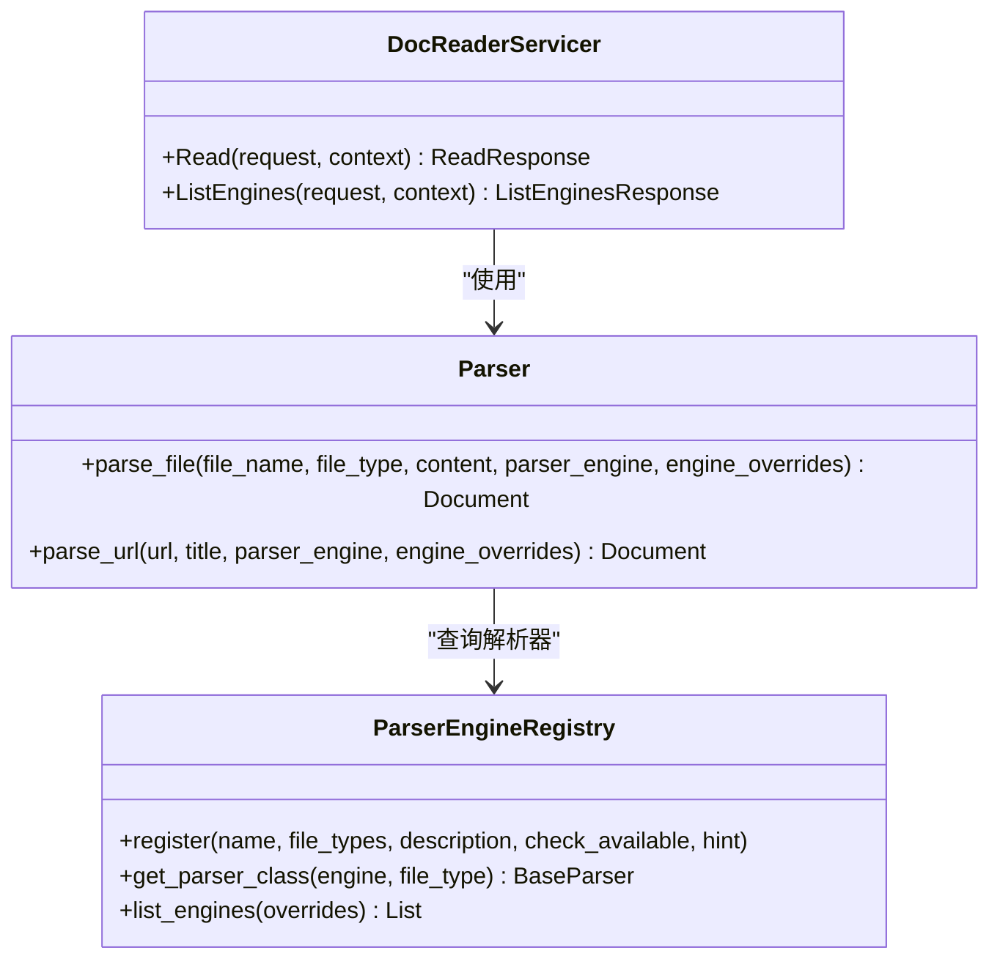
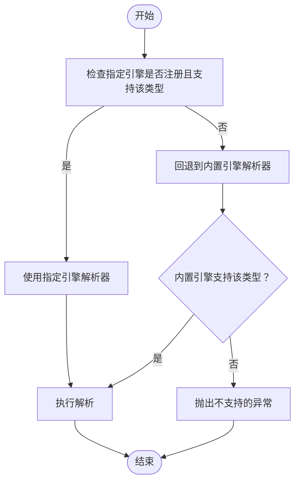
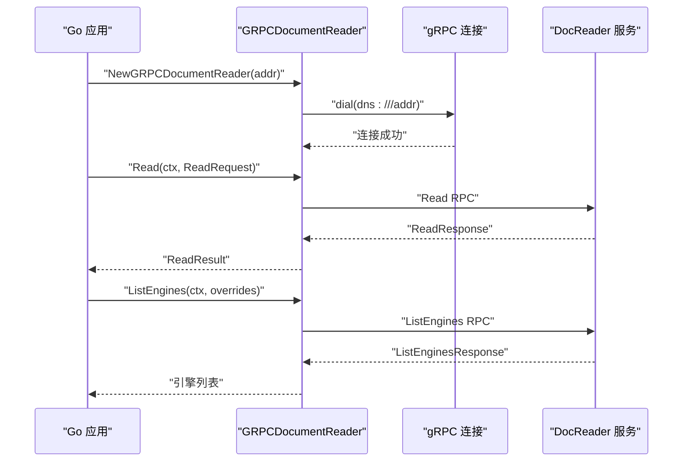
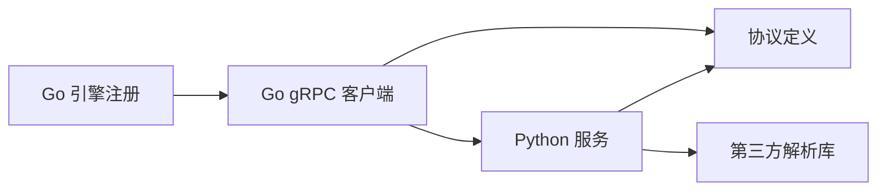

# Python解析服务

<cite>
**本文引用的文件**
- [docreader/main.py](file://docreader/main.py)
- [docreader/proto/docreader.proto](file://docreader/proto/docreader.proto)
- [docreader/config.py](file://docreader/config.py)
- [docreader/utils/request.py](file://docreader/utils/request.py)
- [docreader/parser/__init__.py](file://docreader/parser/__init__.py)
- [docreader/parser/registry.py](file://docreader/parser/registry.py)
- [docreader/parser/parser.py](file://docreader/parser/parser.py)
- [docreader/parser/pdf_parser.py](file://docreader/parser/pdf_parser.py)
- [internal/infrastructure/docparser/grpc_parser.go](file://internal/infrastructure/docparser/grpc_parser.go)
- [internal/infrastructure/docparser/engine_registry.go](file://internal/infrastructure/docparser/engine_registry.go)
- [docker/Dockerfile.docreader](file://docker/Dockerfile.docreader)
- [docreader/README.md](file://docreader/README.md)
- [docreader/pyproject.toml](file://docreader/pyproject.toml)
- [cmd/server/main.go](file://cmd/server/main.go)
</cite>

## 目录
1. [简介](#简介)
2. [项目结构](#项目结构)
3. [核心组件](#核心组件)
4. [架构总览](#架构总览)
5. [详细组件分析](#详细组件分析)
6. [依赖关系分析](#依赖关系分析)
7. [性能考虑](#性能考虑)
8. [故障排查指南](#故障排查指南)
9. [结论](#结论)
10. [附录](#附录)

## 简介
本文件为 WeKnora 项目中的 Python 解析服务（DocReader）提供完整技术文档。该服务基于 gRPC 提供统一的文档解析能力，支持文件与 URL 两种读取模式，返回 Markdown 内容、图片引用及元数据。服务采用线程池并发处理，结合健康检查与日志追踪，便于在生产环境中稳定运行。

## 项目结构
- 服务入口与 gRPC 实现位于 docreader/main.py，包含 DocReaderServicer 的 Read 与 ListEngines 方法。
- 协议定义位于 docreader/proto/docreader.proto，定义了 ReadRequest/ReadResponse 与 ListEnginesRequest/ListEnginesResponse。
- 配置管理位于 docreader/config.py，从环境变量加载 gRPC 与解析相关参数。
- 日志与请求 ID 上下文位于 docreader/utils/request.py，提供统一日志格式与请求追踪。
- 解析器注册与选择位于 docreader/parser/registry.py，解析器工厂位于 docreader/parser/parser.py。
- Go 侧 gRPC 客户端适配位于 internal/infrastructure/docparser/grpc_parser.go，引擎注册与可用性检查位于 internal/infrastructure/docparser/engine_registry.go。
- Docker 镜像构建位于 docker/Dockerfile.docreader，包含健康探针与运行时依赖。
- 服务使用说明与环境变量位于 docreader/README.md，依赖清单位于 docreader/pyproject.toml。
- 后端主服务入口位于 cmd/server/main.go，展示服务生命周期与优雅关闭流程。

**图表来源**
- [docreader/main.py:184-215](file://docreader/main.py#L184-L215)
- [docreader/config.py:66-100](file://docreader/config.py#L66-L100)
- [docreader/utils/request.py:47-82](file://docreader/utils/request.py#L47-L82)
- [docreader/parser/registry.py:112-161](file://docreader/parser/registry.py#L112-L161)
- [docreader/parser/parser.py:11-83](file://docreader/parser/parser.py#L11-L83)
- [docreader/proto/docreader.proto:7-62](file://docreader/proto/docreader.proto#L7-L62)
- [internal/infrastructure/docparser/grpc_parser.go:28-176](file://internal/infrastructure/docparser/grpc_parser.go#L28-L176)
- [internal/infrastructure/docparser/engine_registry.go:9-194](file://internal/infrastructure/docparser/engine_registry.go#L9-L194)
- [docker/Dockerfile.docreader:154-158](file://docker/Dockerfile.docreader#L154-L158)
- [cmd/server/main.go:43-124](file://cmd/server/main.go#L43-L124)

**章节来源**
- [docreader/main.py:184-215](file://docreader/main.py#L184-L215)
- [docreader/proto/docreader.proto:7-62](file://docreader/proto/docreader.proto#L7-L62)
- [docreader/config.py:66-100](file://docreader/config.py#L66-L100)
- [docreader/utils/request.py:47-82](file://docreader/utils/request.py#L47-L82)
- [docreader/parser/registry.py:112-161](file://docreader/parser/registry.py#L112-L161)
- [docreader/parser/parser.py:11-83](file://docreader/parser/parser.py#L11-L83)
- [internal/infrastructure/docparser/grpc_parser.go:28-176](file://internal/infrastructure/docparser/grpc_parser.go#L28-L176)
- [internal/infrastructure/docparser/engine_registry.go:9-194](file://internal/infrastructure/docparser/engine_registry.go#L9-L194)
- [docker/Dockerfile.docreader:154-158](file://docker/Dockerfile.docreader#L154-L158)
- [cmd/server/main.go:43-124](file://cmd/server/main.go#L43-L124)

## 核心组件
- DocReaderServicer：gRPC 服务端实现，提供 Read 与 ListEngines 两个 RPC。
- Parser：解析器门面，根据引擎与文件类型选择具体解析器。
- ParserEngineRegistry：解析器引擎注册表，支持引擎可用性检查与回退逻辑。
- 配置模块：从环境变量加载 gRPC 并发、消息大小、端口等参数。
- 日志与请求追踪：统一日志格式，注入请求 ID 与耗时统计。
- Go 侧客户端：封装 gRPC 客户端连接、重连、超时与调用。

**章节来源**
- [docreader/main.py:98-182](file://docreader/main.py#L98-L182)
- [docreader/parser/parser.py:11-83](file://docreader/parser/parser.py#L11-L83)
- [docreader/parser/registry.py:18-110](file://docreader/parser/registry.py#L18-L110)
- [docreader/config.py:66-100](file://docreader/config.py#L66-L100)
- [docreader/utils/request.py:47-150](file://docreader/utils/request.py#L47-L150)
- [internal/infrastructure/docparser/grpc_parser.go:28-176](file://internal/infrastructure/docparser/grpc_parser.go#L28-L176)

## 架构总览
Python 解析服务通过 gRPC 暴露 DocReader 服务，Go 侧应用通过 gRPC 客户端调用。服务端采用线程池并发处理请求，支持健康检查，日志包含请求 ID 与耗时。解析器注册表负责引擎选择与可用性检查，支持回退到内置引擎。

**图表来源**
- [internal/infrastructure/docparser/grpc_parser.go:102-128](file://internal/infrastructure/docparser/grpc_parser.go#L102-L128)
- [docreader/main.py:103-167](file://docreader/main.py#L103-L167)
- [docreader/parser/parser.py:25-83](file://docreader/parser/parser.py#L25-L83)
- [docreader/parser/registry.py:51-76](file://docreader/parser/registry.py#L51-L76)

## 详细组件分析

### DocReaderServicer 类与 RPC 方法
- Read 方法
  - 支持文件模式（file_content）与 URL 模式（url），自动推断文件类型。
  - 从请求配置中读取解析引擎名与覆盖参数，交由 Parser 执行解析。
  - 将结果转换为 ReadResponse，包含 Markdown 内容、图片引用与元数据；若解析失败返回错误字段。
  - 图片处理：将 base64 或字节流解码为内联字节，构造 ImageRef 列表。
  - 错误处理：捕获异常并记录堆栈，返回 ReadResponse.error。
- ListEngines 方法
  - 读取 config_overrides，查询解析器注册表，返回各引擎的可用性与描述信息。

**图表来源**
- [docreader/main.py:98-182](file://docreader/main.py#L98-L182)
- [docreader/parser/parser.py:11-83](file://docreader/parser/parser.py#L11-L83)
- [docreader/parser/registry.py:18-110](file://docreader/parser/registry.py#L18-L110)

**章节来源**
- [docreader/main.py:98-182](file://docreader/main.py#L98-L182)
- [docreader/main.py:54-96](file://docreader/main.py#L54-L96)

### 解析器注册与选择
- 注册表支持多引擎注册，包含内置引擎与可选引擎（如 markitdown）。
- get_parser_class 优先按指定引擎查找，若不支持则回退到内置引擎；若仍不支持则抛出异常。
- list_engines 返回每个引擎的可用性与原因，支持传入租户级覆盖参数。

**图表来源**
- [docreader/parser/registry.py:51-76](file://docreader/parser/registry.py#L51-L76)

**章节来源**
- [docreader/parser/registry.py:18-110](file://docreader/parser/registry.py#L18-L110)

### 配置管理
- 从环境变量加载 gRPC 最大工作线程数、最大消息大小（MB）、端口等。
- 支持 DocReader 专属前缀与通用前缀，兼容不同部署场景。
- 提供打印配置与导出配置的方法，便于诊断。

**章节来源**
- [docreader/config.py:66-100](file://docreader/config.py#L66-L100)
- [docreader/config.py:103-122](file://docreader/config.py#L103-L122)

### 日志记录与请求追踪
- 初始化日志格式，统一包含毫秒时间戳、请求 ID、级别与消息。
- 通过上下文变量注入请求 ID，自动计算耗时并在日志中附加。
- 支持在请求开始与结束时记录日志，便于端到端追踪。

**章节来源**
- [docreader/utils/request.py:47-82](file://docreader/utils/request.py#L47-L82)
- [docreader/utils/request.py:84-150](file://docreader/utils/request.py#L84-L150)

### Go 侧 gRPC 客户端集成
- 客户端连接支持 DNS 解析、负载均衡策略与消息大小限制。
- 提供 Read 与 ListEngines 调用封装，错误统一包装。
- 支持重连与连接状态检查，避免服务不可用导致的失败。

**图表来源**
- [internal/infrastructure/docparser/grpc_parser.go:36-83](file://internal/infrastructure/docparser/grpc_parser.go#L36-L83)
- [internal/infrastructure/docparser/grpc_parser.go:102-154](file://internal/infrastructure/docparser/grpc_parser.go#L102-L154)

**章节来源**
- [internal/infrastructure/docparser/grpc_parser.go:28-176](file://internal/infrastructure/docparser/grpc_parser.go#L28-L176)

### 服务启动流程与健康检查
- 服务启动时打印有效配置，初始化 gRPC 服务器与健康服务。
- 使用 ThreadPoolExecutor 配置并发线程数与消息大小上限。
- 通过 grpc_health_probe 进行健康检查，容器层面暴露 50051 端口。

**章节来源**
- [docreader/main.py:184-215](file://docreader/main.py#L184-L215)
- [docker/Dockerfile.docreader:154-158](file://docker/Dockerfile.docreader#L154-L158)

## 依赖关系分析
- Python 服务依赖 grpcio、protobuf、解析器库（如 pdfplumber、paddleocr、playwright 等）。
- Go 侧依赖 grpc 与 DocReader 协议定义，通过 gRPC 客户端调用 Python 服务。
- 引擎注册表在 Go 侧也有本地注册与远程发现的合并逻辑，增强可扩展性。

**图表来源**
- [docreader/pyproject.toml:7-39](file://docreader/pyproject.toml#L7-L39)
- [docreader/proto/docreader.proto:1-62](file://docreader/proto/docreader.proto#L1-L62)
- [internal/infrastructure/docparser/grpc_parser.go:28-176](file://internal/infrastructure/docparser/grpc_parser.go#L28-L176)
- [internal/infrastructure/docparser/engine_registry.go:137-194](file://internal/infrastructure/docparser/engine_registry.go#L137-L194)

**章节来源**
- [docreader/pyproject.toml:7-39](file://docreader/pyproject.toml#L7-L39)
- [internal/infrastructure/docparser/engine_registry.go:9-194](file://internal/infrastructure/docparser/engine_registry.go#L9-L194)

## 性能考虑
- 并发与线程池：通过 gRPC 选项配置最大工作线程数与消息大小，避免高并发下的内存与 CPU 峰值。
- 图片处理：将图片解码为内联字节返回，减少跨语言传输开销；Go 侧负责持久化存储。
- 超时与重连：Go 侧客户端支持重连与连接状态检查，提升稳定性。
- 引擎选择：优先使用目标引擎，不支持时回退内置引擎，保证解析成功率。
- 健康检查：容器层使用 grpc_health_probe，便于编排系统快速发现不可用实例。

**章节来源**
- [docreader/main.py:187-193](file://docreader/main.py#L187-L193)
- [docreader/main.py:54-96](file://docreader/main.py#L54-L96)
- [internal/infrastructure/docparser/grpc_parser.go:46-83](file://internal/infrastructure/docparser/grpc_parser.go#L46-L83)
- [docreader/parser/registry.py:51-76](file://docreader/parser/registry.py#L51-L76)
- [docker/Dockerfile.docreader:134-135](file://docker/Dockerfile.docreader#L134-L135)

## 故障排查指南
- 服务无法启动
  - 检查日志中 gRPC 端口占用与健康检查探针。
  - 确认环境变量（如端口、最大文件大小）正确。
- 解析失败
  - 查看 ReadResponse.error 字段与服务端异常堆栈。
  - 确认解析引擎是否可用，必要时回退到内置引擎。
- 图片无法显示
  - 检查图片引用与 Go 侧存储配置（MinIO/COS/OSS）。
  - 确认公共访问地址与网络可达性。
- 性能问题
  - 调整 gRPC 最大工作线程数与消息大小。
  - 检查上游依赖（OCR/VLM）的可用性与延迟。

**章节来源**
- [docreader/main.py:162-167](file://docreader/main.py#L162-L167)
- [docreader/parser/registry.py:77-106](file://docreader/parser/registry.py#L77-L106)
- [docreader/README.md:226-244](file://docreader/README.md#L226-L244)

## 结论
Python 解析服务通过清晰的 gRPC 接口与灵活的解析器注册机制，实现了对多格式文档的统一解析与返回。配合 Go 侧客户端与健康检查，可在生产环境中稳定运行。建议在部署时合理配置并发与消息大小，关注引擎可用性与存储链路，以获得最佳性能与可靠性。

## 附录

### gRPC 客户端集成步骤（Go）
- 初始化 gRPC 客户端，设置 DNS 解析与消息大小上限。
- 调用 Read 与 ListEngines，处理返回结果与错误。
- 支持重连与连接状态检查，确保高可用。

**章节来源**
- [internal/infrastructure/docparser/grpc_parser.go:36-154](file://internal/infrastructure/docparser/grpc_parser.go#L36-L154)

### 服务启动与健康检查（Docker）
- 镜像暴露 50051 端口，使用 grpc_health_probe 进行健康检查。
- CMD 直接运行 Python 服务，日志输出到 stdout/stderr。

**章节来源**
- [docker/Dockerfile.docreader:154-158](file://docker/Dockerfile.docreader#L154-L158)

### PDF 解析链与回退策略
- PDF 解析采用链式责任模式：优先尝试 MarkItDown，再尝试扫描 PDF 图像提取，最后回退到内置解析器。
- 若解析无文本，自动转为图片并生成 Markdown 引用。

**章节来源**
- [docreader/parser/pdf_parser.py:57-69](file://docreader/parser/pdf_parser.py#L57-L69)