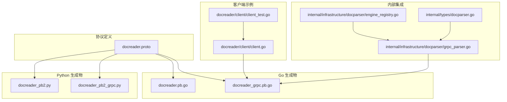
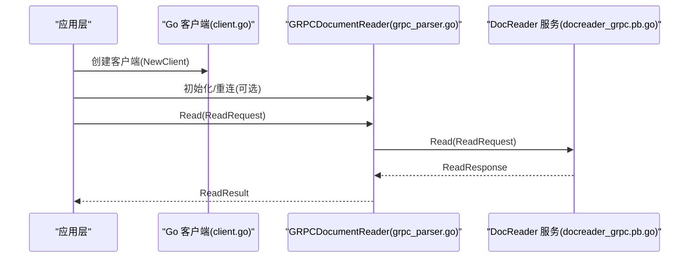
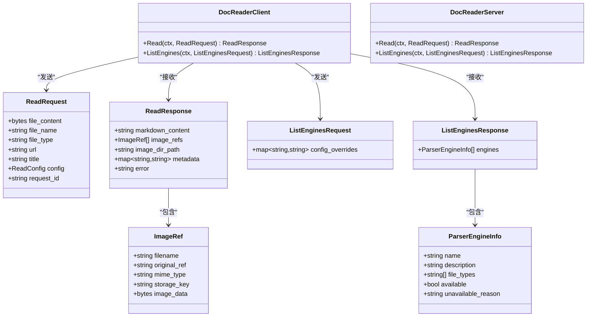
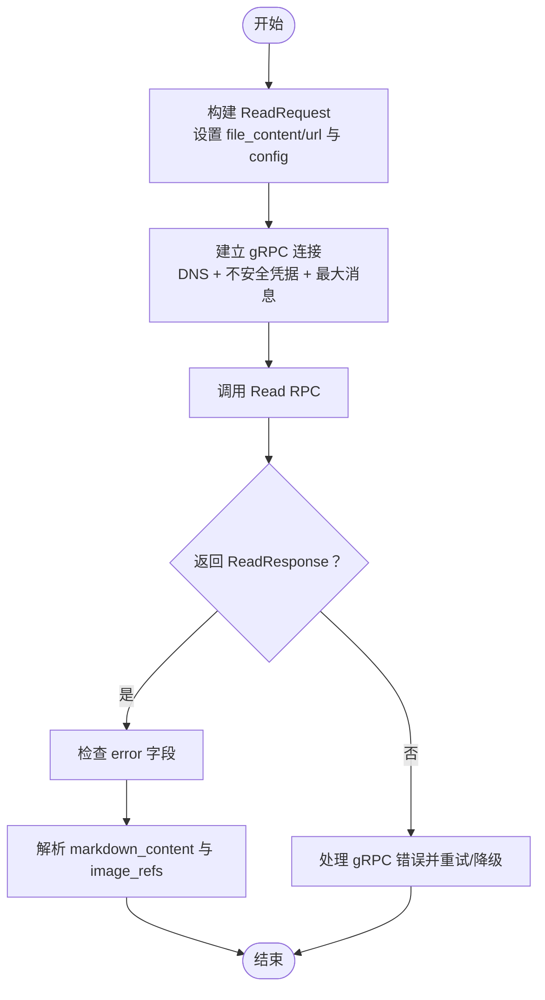
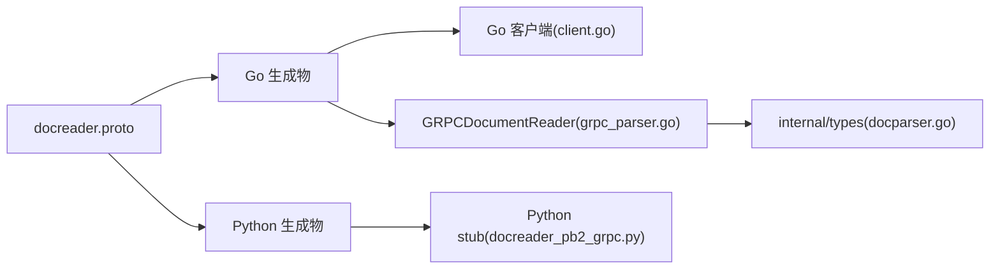

# gRPC协议定义

<cite>
**本文引用的文件**
- [docreader.proto](file://docreader/proto/docreader.proto)
- [docreader.pb.go](file://docreader/proto/docreader.pb.go)
- [docreader_grpc.pb.go](file://docreader/proto/docreader_grpc.pb.go)
- [docreader_pb2.py](file://docreader/proto/docreader_pb2.py)
- [docreader_pb2_grpc.py](file://docreader/proto/docreader_pb2_grpc.py)
- [client.go](file://docreader/client/client.go)
- [grpc_parser.go](file://internal/infrastructure/docparser/grpc_parser.go)
- [engine_registry.go](file://internal/infrastructure/docparser/engine_registry.go)
- [docparser.go](file://internal/types/docparser.go)
- [client_test.go](file://docreader/client/client_test.go)
- [generate_proto.sh](file://docreader/scripts/generate_proto.sh)
</cite>

## 目录
1. [简介](#简介)
2. [项目结构](#项目结构)
3. [核心组件](#核心组件)
4. [架构总览](#架构总览)
5. [详细组件分析](#详细组件分析)
6. [依赖关系分析](#依赖关系分析)
7. [性能考量](#性能考量)
8. [故障排查指南](#故障排查指南)
9. [结论](#结论)
10. [附录](#附录)

## 简介
本文档系统性地阐述 WeKnora 的 DocReader gRPC 协议定义与实现，覆盖 Protocol Buffers 消息模型、服务接口、RPC 方法设计，并对 ReadRequest/ReadResponse 的字段语义进行详解。同时给出 ImageRef、ParserEngineInfo 等数据结构的字段定义与使用方法，说明协议版本管理、向后兼容性与扩展策略，提供 gRPC 客户端实现指南、连接管理与错误处理建议，帮助开发者快速完成协议理解与集成。

## 项目结构
DocReader 协议位于 docreader 子模块中，采用多语言生成策略：Go 与 Python 同步生成，分别用于 Go 服务端与 Python 解析器生态。Go 侧通过 protoc-gen-go 与 protoc-gen-go-grpc 生成强类型客户端与服务端桩代码；Python 侧通过 grpc_tools 生成 pb2 与 grpc stub。

**图表来源**
- [docreader.proto:1-62](file://docreader/proto/docreader.proto#L1-L62)
- [docreader.pb.go:1-608](file://docreader/proto/docreader.pb.go#L1-L608)
- [docreader_grpc.pb.go:1-160](file://docreader/proto/docreader_grpc.pb.go#L1-L160)
- [docreader_pb2.py:1-64](file://docreader/proto/docreader_pb2.py#L1-L64)
- [docreader_pb2_grpc.py:1-141](file://docreader/proto/docreader_pb2_grpc.py#L1-L141)
- [client.go:1-104](file://docreader/client/client.go#L1-L104)
- [grpc_parser.go:1-176](file://internal/infrastructure/docparser/grpc_parser.go#L1-L176)
- [engine_registry.go:1-194](file://internal/infrastructure/docparser/engine_registry.go#L1-L194)
- [docparser.go:1-97](file://internal/types/docparser.go#L1-L97)

**章节来源**
- [docreader.proto:1-62](file://docreader/proto/docreader.proto#L1-L62)
- [generate_proto.sh:1-36](file://docreader/scripts/generate_proto.sh#L1-L36)

## 核心组件
- DocReader 服务：提供统一的文档读取与解析能力，支持文件内容直传与 URL 两种模式。
- ReadRequest/ReadResponse：统一请求与响应载体，包含解析配置、元信息、图片引用与错误信息。
- ImageRef：描述文档中提取出的图片资源，支持存储键与内联字节回退。
- ParserEngineInfo：远程引擎能力描述，包含名称、描述、支持的文件类型、可用性与原因。
- ListEnginesRequest/Response：查询可用解析引擎的能力清单。

**章节来源**
- [docreader.proto:7-61](file://docreader/proto/docreader.proto#L7-L61)
- [docreader.pb.go:24-320](file://docreader/proto/docreader.pb.go#L24-L320)
- [docreader_grpc.pb.go:26-92](file://docreader/proto/docreader_grpc.pb.go#L26-L92)
- [docparser.go:3-43](file://internal/types/docparser.go#L3-L43)

## 架构总览
DocReader 协议采用一主多从的架构：Go 服务端实现 DocReader 服务，Go 客户端通过 gRPC 调用；内部 Go 应用通过 GRPCDocumentReader 封装调用 DocReader 服务；Python 生态通过 Python 生成物对接同一协议。

**图表来源**
- [client.go:42-69](file://docreader/client/client.go#L42-L69)
- [grpc_parser.go:102-128](file://internal/infrastructure/docparser/grpc_parser.go#L102-L128)
- [docreader_grpc.pb.go:29-60](file://docreader/proto/docreader_grpc.pb.go#L29-L60)

**章节来源**
- [client.go:1-104](file://docreader/client/client.go#L1-L104)
- [grpc_parser.go:1-176](file://internal/infrastructure/docparser/grpc_parser.go#L1-L176)
- [docreader_grpc.pb.go:1-160](file://docreader/proto/docreader_grpc.pb.go#L1-L160)

## 详细组件分析

### DocReader 服务接口与 RPC 方法
- Read(ReadRequest) -> ReadResponse：统一文档读取入口，支持文件内容或 URL 两种模式。
- ListEngines(ListEnginesRequest) -> ListEnginesResponse：列举可用解析引擎及其能力。

**图表来源**
- [docreader.proto:7-61](file://docreader/proto/docreader.proto#L7-L61)
- [docreader.pb.go:24-320](file://docreader/proto/docreader.pb.go#L24-L320)
- [docreader_grpc.pb.go:26-92](file://docreader/proto/docreader_grpc.pb.go#L26-L92)

**章节来源**
- [docreader.proto:7-61](file://docreader/proto/docreader.proto#L7-L61)
- [docreader_grpc.pb.go:26-92](file://docreader/proto/docreader_grpc.pb.go#L26-L92)

### ReadRequest 字段详解
- file_content：二进制文件内容（文件模式）。
- file_name：文件名（便于识别与日志记录）。
- file_type：文件类型标识（如 md、pdf 等）。
- url：URL 模式下的文档地址。
- title：文档标题（可选）。
- config：解析配置，包含解析引擎选择与覆盖参数。
- request_id：请求唯一标识，便于链路追踪。

**章节来源**
- [docreader.proto:20-29](file://docreader/proto/docreader.proto#L20-L29)
- [docparser.go:5-14](file://internal/types/docparser.go#L5-L14)

### ReadResponse 字段详解
- markdown_content：标准化后的 Markdown 文本。
- image_refs：提取到的图片引用列表，每个元素为 ImageRef。
- image_dir_path：图片目录路径（若存在）。
- metadata：键值对形式的元信息（如作者、创建时间等）。
- error：错误信息（成功时为空）。

**章节来源**
- [docreader.proto:39-45](file://docreader/proto/docreader.proto#L39-L45)
- [docparser.go:16-25](file://internal/types/docparser.go#L16-L25)

### ImageRef 数据结构
- filename：图片文件名。
- original_ref：原始引用标识（便于溯源）。
- mime_type：图片 MIME 类型。
- storage_key：共享存储下载地址（优先使用）。
- image_data：内联图片字节（跨机器部署的通用回退方案）。

**章节来源**
- [docreader.proto:31-37](file://docreader/proto/docreader.proto#L31-L37)
- [docparser.go:27-34](file://internal/types/docparser.go#L27-L34)

### ParserEngineInfo 数据结构
- name：引擎名称（如 builtin、simple、weknoracloud、mineru、mineru_cloud）。
- description：引擎描述。
- file_types：该引擎支持的文件类型集合。
- available：是否可用。
- unavailable_reason：不可用原因（可用时为空）。

**章节来源**
- [docreader.proto:51-57](file://docreader/proto/docreader.proto#L51-L57)
- [engine_registry.go:39-134](file://internal/infrastructure/docparser/engine_registry.go#L39-L134)
- [docparser.go:36-43](file://internal/types/docparser.go#L36-L43)

### 协议版本管理、向后兼容与扩展
- 字段保留与兼容：协议中对已移除字段使用 reserved 保留号，确保未来新增字段不会破坏现有序列化兼容性。
- 扩展策略：新增可选字段（带默认值），避免破坏现有客户端；避免删除或重用已保留字段。
- 多语言一致性：Go 与 Python 生成物均来自同一 proto 文件，保证跨语言行为一致。

**章节来源**
- [docreader.proto:15-17](file://docreader/proto/docreader.proto#L15-L17)
- [generate_proto.sh:1-36](file://docreader/scripts/generate_proto.sh#L1-L36)

### gRPC 客户端实现指南
- Go 客户端
  - 连接建立：使用不安全凭据与 DNS 解析器，默认启用轮询负载均衡与最大消息大小。
  - 请求构造：根据模式设置 file_content 或 url，填充 config 与 request_id。
  - 错误处理：捕获 gRPC 错误与 ReadResponse 中的 error 字段。
- Python 客户端
  - 使用生成的 stub 发起 unary_unary 调用，注意 gRPC 版本要求。
- 内部集成
  - GRPCDocumentReader 封装连接、重连、超时与错误转换，将协议响应映射为内部 ReadResult。

**图表来源**
- [client.go:42-69](file://docreader/client/client.go#L42-L69)
- [grpc_parser.go:102-128](file://internal/infrastructure/docparser/grpc_parser.go#L102-L128)
- [docreader_grpc.pb.go:42-60](file://docreader/proto/docreader_grpc.pb.go#L42-L60)

**章节来源**
- [client.go:1-104](file://docreader/client/client.go#L1-L104)
- [grpc_parser.go:1-176](file://internal/infrastructure/docparser/grpc_parser.go#L1-L176)
- [client_test.go:19-85](file://docreader/client/client_test.go#L19-L85)

## 依赖关系分析
- Go 生成物依赖 Google Protobuf 运行时与 gRPC。
- Python 生成物依赖 Python Protobuf 与 grpcio。
- 内部集成通过 GRPCDocumentReader 统一封装，屏蔽底层 gRPC 细节。

**图表来源**
- [docreader.proto:1-62](file://docreader/proto/docreader.proto#L1-L62)
- [docreader.pb.go:1-608](file://docreader/proto/docreader.pb.go#L1-L608)
- [docreader_pb2_grpc.py:1-141](file://docreader/proto/docreader_pb2_grpc.py#L1-L141)
- [client.go:1-104](file://docreader/client/client.go#L1-L104)
- [grpc_parser.go:1-176](file://internal/infrastructure/docparser/grpc_parser.go#L1-L176)
- [docparser.go:1-97](file://internal/types/docparser.go#L1-L97)

**章节来源**
- [docreader.pb.go:9-15](file://docreader/proto/docreader.pb.go#L9-L15)
- [docreader_pb2_grpc.py:3-25](file://docreader/proto/docreader_pb2_grpc.py#L3-L25)
- [grpc_parser.go:3-17](file://internal/infrastructure/docparser/grpc_parser.go#L3-L17)

## 性能考量
- 最大消息大小：通过环境变量控制，避免超大文档导致内存压力。
- 负载均衡：默认 round_robin，提升多实例场景下的吞吐与容错。
- 超时与重试：结合业务上下文设置合理超时与指数退避重试策略。
- 图片处理：优先使用 storage_key 下载，必要时回退 image_data，减少重复传输。

**章节来源**
- [client.go:16-23](file://docreader/client/client.go#L16-L23)
- [grpc_parser.go:19-26](file://internal/infrastructure/docparser/grpc_parser.go#L19-L26)

## 故障排查指南
- 连接失败
  - 检查目标地址与 DNS 解析；确认服务端已启动。
  - 查看 gRPC 状态码与错误详情。
- 超时或断流
  - 提升 MAX_FILE_SIZE_MB 与超时阈值；优化上游解析器性能。
- 返回错误
  - 读取 ReadResponse.error 字段定位具体问题；查看服务端日志。
- Python 版本不匹配
  - 确保 grpcio 版本满足生成代码要求。

**章节来源**
- [client.go:56-62](file://docreader/client/client.go#L56-L62)
- [grpc_parser.go:60-64](file://internal/infrastructure/docparser/grpc_parser.go#L60-L64)
- [docreader_pb2_grpc.py:12-25](file://docreader/proto/docreader_pb2_grpc.py#L12-L25)

## 结论
DocReader gRPC 协议以简洁的消息模型与清晰的服务边界，实现了文档读取与引擎发现的统一抽象。通过严格的字段保留与多语言生成，保障了协议演进的向后兼容性。结合 Go 与 Python 的客户端实现，开发者可快速完成集成与扩展。

## 附录
- 协议生成脚本：一键生成 Go 与 Python 代码，并修复 Python 导入差异。
- 测试用例：演示文件与 URL 两种模式的调用流程与结果校验。

**章节来源**
- [generate_proto.sh:1-36](file://docreader/scripts/generate_proto.sh#L1-L36)
- [client_test.go:19-85](file://docreader/client/client_test.go#L19-L85)