# 工具函数库

<cite>
**本文引用的文件**
- [tools.go](file://internal/common/tools.go)
- [crypto.go](file://internal/utils/crypto.go)
- [security.go](file://internal/utils/security.go)
- [taskid.go](file://internal/utils/taskid.go)
- [filesize.go](file://internal/utils/filesize.go)
- [log_sanitize.go](file://internal/utils/log_sanitize.go)
- [extraheaders.go](file://internal/utils/extraheaders.go)
- [split.py](file://docreader/utils/split.py)
- [endecode.py](file://docreader/utils/endecode.py)
- [request.py](file://docreader/utils/request.py)
- [tempfile.py](file://docreader/utils/tempfile.py)
</cite>

## 目录
1. [简介](#简介)
2. [项目结构](#项目结构)
3. [核心组件](#核心组件)
4. [架构总览](#架构总览)
5. [详细组件分析](#详细组件分析)
6. [依赖分析](#依赖分析)
7. [性能考虑](#性能考虑)
8. [故障排查指南](#故障排查指南)
9. [结论](#结论)
10. [附录](#附录)

## 简介
本文件为 WeKnora 工具函数库的技术文档，聚焦以下能力：
- 编码与解码：UTF-8 文本处理、Base64 图像编解码、多编码自动检测
- 请求上下文与追踪：基于上下文变量的请求 ID 管理、日志注入与耗时统计
- 文本分割与正则：按分隔符、字符、正则表达式分割，以及匹配工具
- 临时文件与目录：上下文管理的临时文件与目录生命周期
- 安全与并发：任务 ID 生成、日志注入防护、并发安全策略
- 文件与网络：内容类型推断、最大文件大小配置、HTTP 自定义头注入、SSRF 安全客户端

本指南兼顾开发者与非技术读者，既提供实现细节，也给出使用建议与最佳实践。

## 项目结构
工具函数库分布在两个主要区域：
- Go 后端工具集：位于 internal/utils 与 internal/common，涵盖加密、安全、任务 ID、日志清洗、HTTP 头注入、文件大小限制等
- Python 文档处理工具集：位于 docreader/utils，涵盖文本分割、图像与文本编解码、请求上下文与临时文件

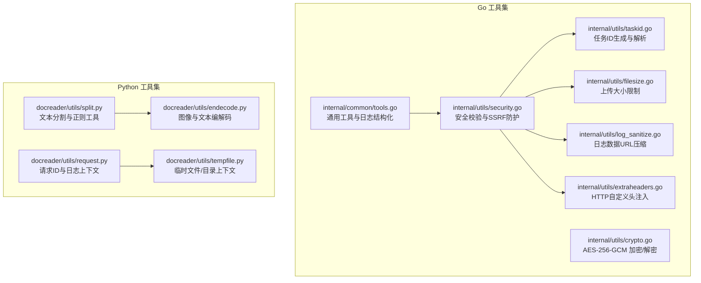

**图表来源**
- [tools.go:1-225](file://internal/common/tools.go#L1-L225)
- [crypto.go:1-90](file://internal/utils/crypto.go#L1-L90)
- [security.go:1-1025](file://internal/utils/security.go#L1-L1025)
- [taskid.go:1-115](file://internal/utils/taskid.go#L1-L115)
- [filesize.go:1-28](file://internal/utils/filesize.go#L1-L28)
- [log_sanitize.go:1-30](file://internal/utils/log_sanitize.go#L1-L30)
- [extraheaders.go:1-87](file://internal/utils/extraheaders.go#L1-L87)
- [split.py:1-81](file://docreader/utils/split.py#L1-L81)
- [endecode.py:1-205](file://docreader/utils/endecode.py#L1-L205)
- [request.py:1-150](file://docreader/utils/request.py#L1-L150)
- [tempfile.py:1-78](file://docreader/utils/tempfile.py#L1-L78)

**章节来源**
- [tools.go:1-225](file://internal/common/tools.go#L1-L225)
- [split.py:1-81](file://docreader/utils/split.py#L1-L81)

## 核心组件
- 通用工具与日志结构化：提供去重、JSON 解析增强、非法 UTF-8 清理、结构化流水线日志与截断
- 加密与解密：AES-256-GCM 对称加密封装，带版本前缀与 Base64 输出
- 安全与 SSRF：URL/主机/IP 白名单与黑名单、危险参数/环境变量检测、SSRF 安全 HTTP 客户端
- 任务 ID：多段唯一标识生成与解析，支持租户隔离与业务 ID
- 文件大小限制：从环境变量读取最大上传大小
- 日志清洗：日志注入防护与大尺寸数据 URL 压缩
- HTTP 自定义头：保留关键头、注入用户自定义头、包装 RoundTripper
- 文本分割：按分隔符、字符、正则表达式分割，以及匹配工具
- 图像与文本编解码：图像转 Base64、Base64 解码回字节、多编码自动检测
- 请求上下文：基于 contextvar 的请求 ID 注入、毫秒格式化时间戳、耗时统计
- 临时文件与目录：上下文管理器自动清理

**章节来源**
- [tools.go:19-225](file://internal/common/tools.go#L19-L225)
- [crypto.go:14-90](file://internal/utils/crypto.go#L14-L90)
- [security.go:21-1025](file://internal/utils/security.go#L21-L1025)
- [taskid.go:12-115](file://internal/utils/taskid.go#L12-L115)
- [filesize.go:8-28](file://internal/utils/filesize.go#L8-L28)
- [log_sanitize.go:8-30](file://internal/utils/log_sanitize.go#L8-L30)
- [extraheaders.go:8-87](file://internal/utils/extraheaders.go#L8-L87)
- [split.py:5-81](file://docreader/utils/split.py#L5-L81)
- [endecode.py:23-205](file://docreader/utils/endecode.py#L23-L205)
- [request.py:12-150](file://docreader/utils/request.py#L12-L150)
- [tempfile.py:8-78](file://docreader/utils/tempfile.py#L8-L78)

## 架构总览
工具函数库围绕“安全—可追踪—可扩展”的设计目标构建：
- 安全：统一的输入校验、URL/主机/IP 白黑名单、SSRF 客户端、日志注入防护
- 可追踪：请求 ID 上下文贯穿日志与网络请求，便于跨服务链路定位
- 可扩展：模块化工具集，Go 与 Python 并行实现，便于在不同子系统复用

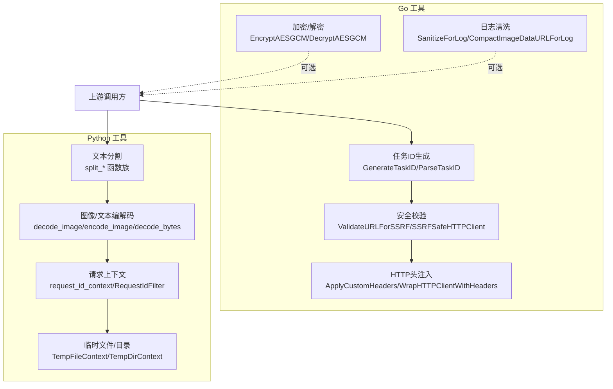

**图表来源**
- [taskid.go:12-94](file://internal/utils/taskid.go#L12-L94)
- [crypto.go:27-89](file://internal/utils/crypto.go#L27-L89)
- [security.go:965-1005](file://internal/utils/security.go#L965-L1005)
- [log_sanitize.go:15-29](file://internal/utils/log_sanitize.go#L15-L29)
- [extraheaders.go:28-86](file://internal/utils/extraheaders.go#L28-L86)
- [split.py:5-81](file://docreader/utils/split.py#L5-L81)
- [endecode.py:23-205](file://docreader/utils/endecode.py#L23-L205)
- [request.py:120-150](file://docreader/utils/request.py#L120-L150)
- [tempfile.py:8-78](file://docreader/utils/tempfile.py#L8-L78)

## 详细组件分析

### 编码与解码工具（UTF-8、Base64、图像）
- UTF-8 文本处理
  - 非法 UTF-8 字符与空字符清理，保证后续处理安全
  - 结构化日志值格式化与截断，避免超长字段影响日志系统
- Base64 图像编解码
  - 支持多种输入格式（文件路径、字节、PIL 图像、NumPy 数组）
  - 统一输出 Base64 字符串，便于嵌入 JSON 或传输
- 多编码自动检测
  - 按优先级尝试常见编码，失败时回退 latin-1 并记录警告

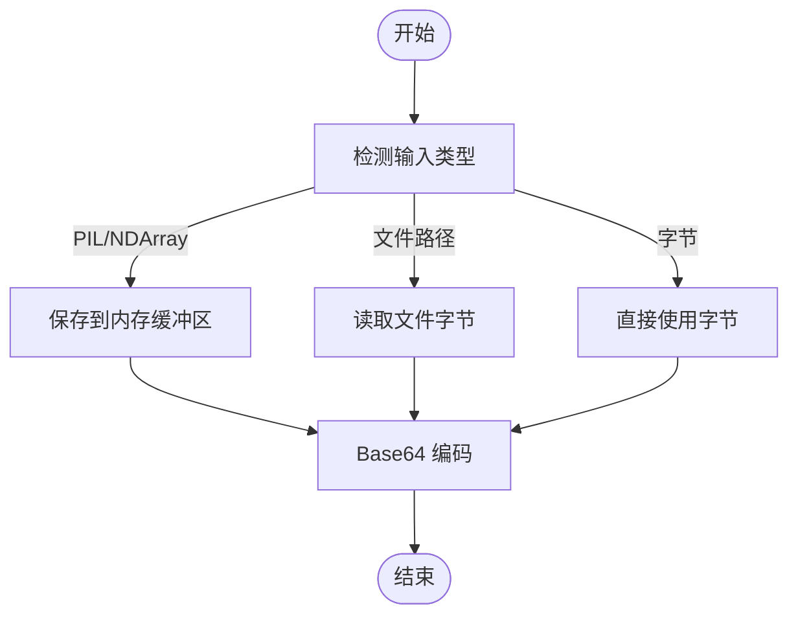

**图表来源**
- [endecode.py:23-76](file://docreader/utils/endecode.py#L23-L76)

**章节来源**
- [tools.go:119-141](file://internal/common/tools.go#L119-L141)
- [tools.go:199-224](file://internal/common/tools.go#L199-L224)
- [endecode.py:23-205](file://docreader/utils/endecode.py#L23-L205)

### 请求 ID 管理与日志上下文
- 请求 ID 上下文
  - 使用 contextvar 存储当前请求 ID，支持自动生成或传入
  - 提供上下文管理器，进入时设置 ID 与起始时间，退出时记录耗时并清理
- 日志注入
  - 自定义过滤器将请求 ID 注入日志记录，并可截断显示
  - 格式化器支持毫秒级时间戳（3 位），提升可观测性
- 执行耗时统计
  - 记录请求开始时间，计算并附加到日志消息中

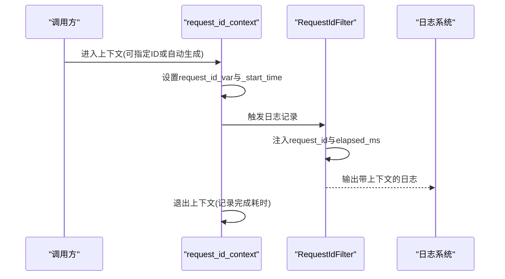

**图表来源**
- [request.py:120-150](file://docreader/utils/request.py#L120-L150)
- [request.py:84-118](file://docreader/utils/request.py#L84-L118)

**章节来源**
- [request.py:12-150](file://docreader/utils/request.py#L12-L150)

### 文本分割与正则处理
- 分割策略
  - 按固定分隔符分割并保留分隔符位置
  - 按字符粒度切分
  - 按正则表达式分割，捕获分隔符以保留
- 匹配工具
  - 正则匹配函数，支持预编译以提高性能

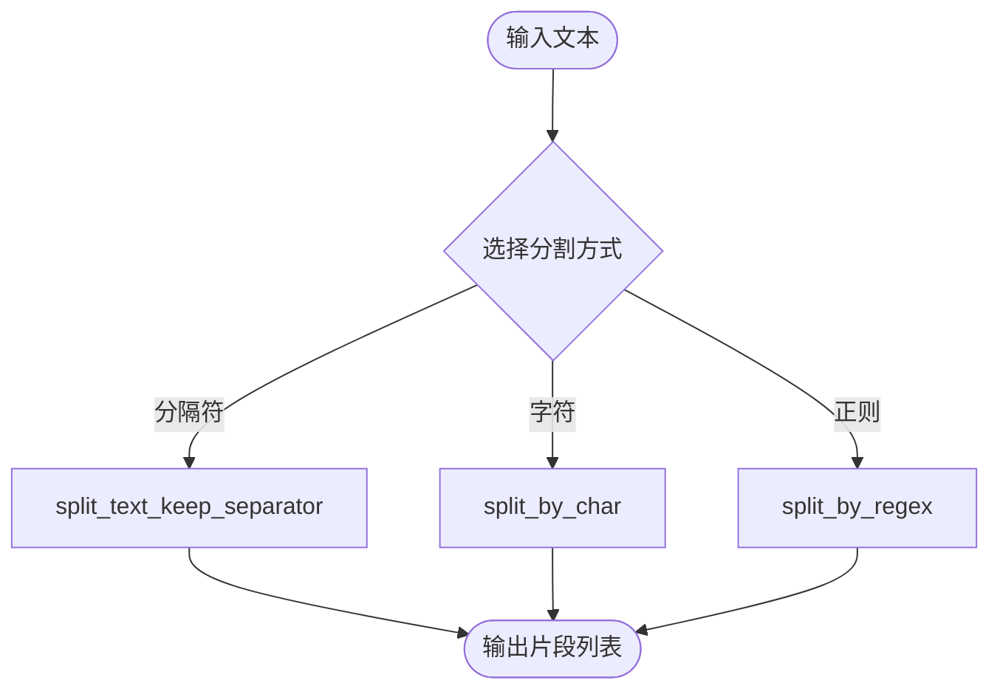

**图表来源**
- [split.py:5-81](file://docreader/utils/split.py#L5-L81)

**章节来源**
- [split.py:5-81](file://docreader/utils/split.py#L5-L81)

### 临时文件与目录处理
- 临时文件
  - 写入字节内容到命名临时文件，支持后缀
  - 上下文退出时自动关闭并删除文件
- 临时目录
  - 创建临时目录，上下文退出时清理

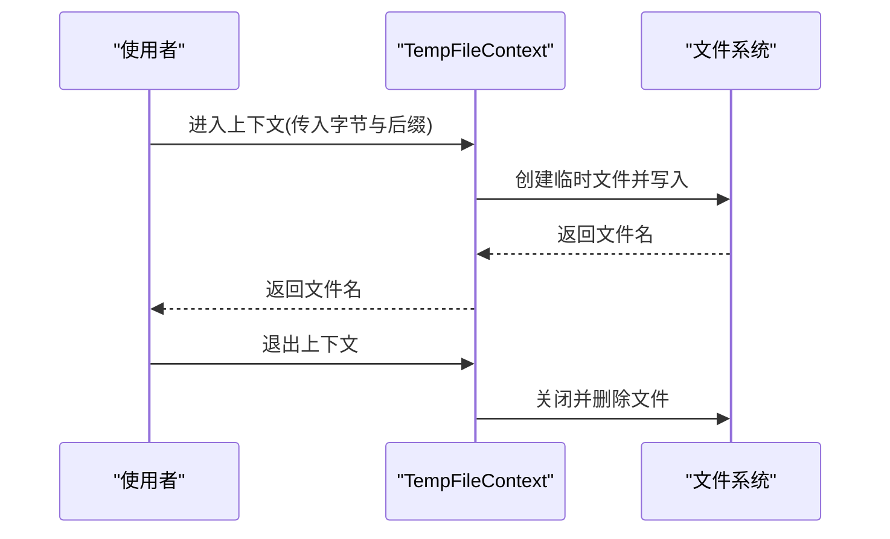

**图表来源**
- [tempfile.py:8-42](file://docreader/utils/tempfile.py#L8-L42)

**章节来源**
- [tempfile.py:8-78](file://docreader/utils/tempfile.py#L8-L78)

### 请求上下文管理（Go）
- 结构化流水线日志
  - 统一前缀与键值对格式，自动排序键名，安全清洗字段值
  - 对超长字段进行截断，避免日志膨胀
- 日志注入防护
  - 清洗换行、制表符与控制字符，保留可打印字符
  - 大尺寸 data URL 压缩，避免日志过大

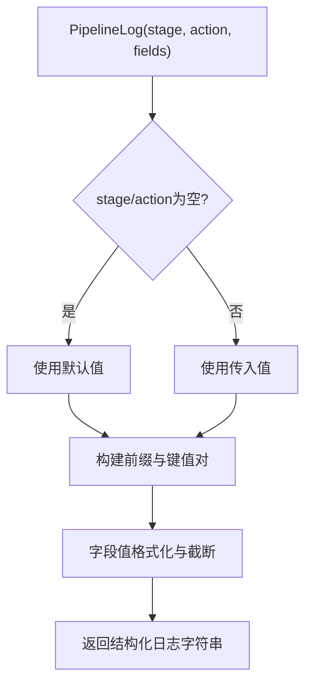

**图表来源**
- [tools.go:151-182](file://internal/common/tools.go#L151-L182)
- [tools.go:199-220](file://internal/common/tools.go#L199-L220)
- [log_sanitize.go:15-29](file://internal/utils/log_sanitize.go#L15-L29)

**章节来源**
- [tools.go:143-225](file://internal/common/tools.go#L143-L225)
- [log_sanitize.go:8-30](file://internal/utils/log_sanitize.go#L8-L30)

### 并发安全策略
- Go 工具
  - 任务 ID 生成使用 UUID 与毫秒时间戳，降低碰撞概率
  - 日志清洗与结构化日志采用字符串构建器，避免共享状态
  - SSRF 安全客户端与白名单加载使用一次性初始化，避免竞态
- Python 工具
  - 请求 ID 使用 contextvar，天然支持 goroutine/线程隔离
  - 临时文件/目录上下文在退出时清理，避免资源泄漏

**章节来源**
- [taskid.go:12-42](file://internal/utils/taskid.go#L12-L42)
- [security.go:865-910](file://internal/utils/security.go#L865-L910)
- [request.py:12-25](file://docreader/utils/request.py#L12-L25)
- [tempfile.py:31-41](file://docreader/utils/tempfile.py#L31-L41)

### 文件操作工具
- 内容类型推断
  - 基于扩展名映射常见 MIME 类型，支持图片、文档、音频、视频、压缩包等
- 最大文件大小限制
  - 从环境变量读取，未设置时使用默认值（通常 50MB）

**章节来源**
- [fileutil.go:5-53](file://internal/utils/fileutil.go#L5-L53)
- [filesize.go:8-28](file://internal/utils/filesize.go#L8-L28)

### 加密与解密机制（Go）
- AES-256-GCM
  - 固定版本前缀标识加密格式
  - 自动生成随机 Nonce，组合输出 Base64
  - 解密时验证前缀与长度，使用 GCM 验证标签

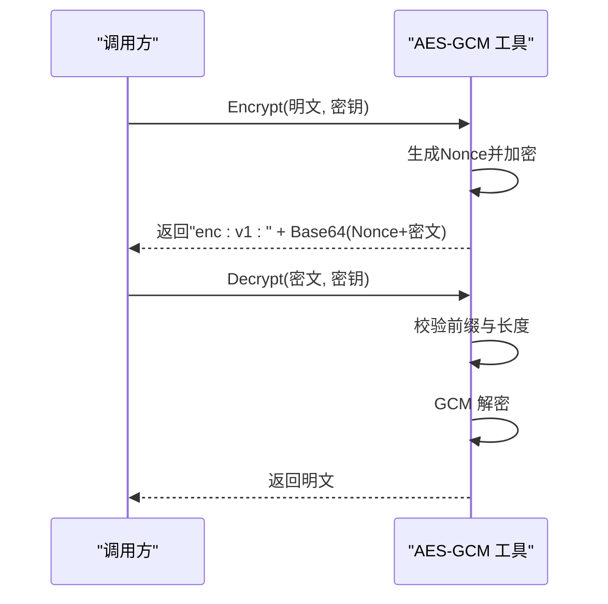

**图表来源**
- [crypto.go:27-89](file://internal/utils/crypto.go#L27-L89)

**章节来源**
- [crypto.go:14-90](file://internal/utils/crypto.go#L14-L90)

### HTTP 自定义头注入（Go）
- 保留关键头
  - 防止覆盖授权、内容类型、主机、连接等关键头
- 注入策略
  - 直接设置用户自定义头，允许覆盖默认值
  - 包装 RoundTripper，适用于第三方 SDK 场景

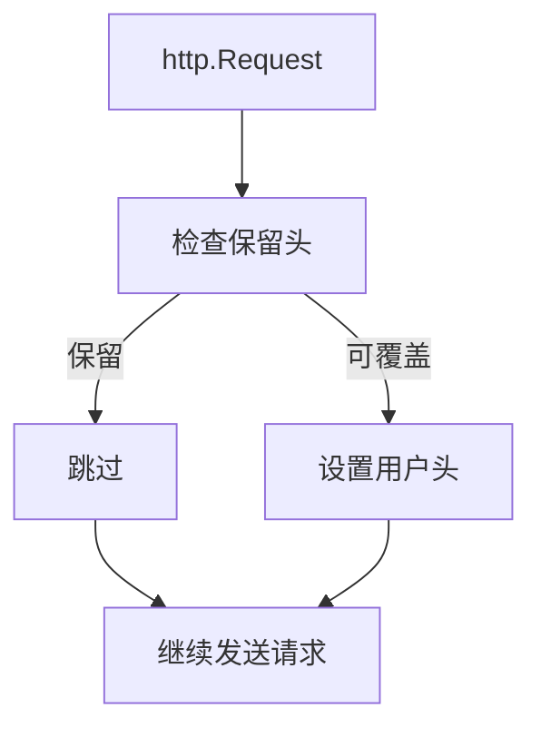

**图表来源**
- [extraheaders.go:22-45](file://internal/utils/extraheaders.go#L22-L45)
- [extraheaders.go:47-86](file://internal/utils/extraheaders.go#L47-L86)

**章节来源**
- [extraheaders.go:8-87](file://internal/utils/extraheaders.go#L8-L87)

### SSRF 安全策略（Go）
- URL 校验
  - 严格限制协议（http/https），禁止直接 IP 与可疑后缀
  - 拒绝内网/回环/保留范围 IP，阻断 DNS 重绑定
- 客户端保护
  - 自定义 DialContext 与 CheckRedirect，拦截受限目标
  - 白名单机制支持精确域名/CIDR，必要时放宽限制

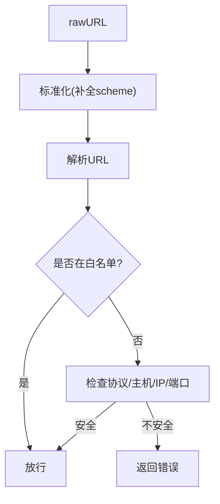

**图表来源**
- [security.go:965-1005](file://internal/utils/security.go#L965-L1005)
- [security.go:755-792](file://internal/utils/security.go#L755-L792)
- [security.go:794-849](file://internal/utils/security.go#L794-L849)

**章节来源**
- [security.go:21-1025](file://internal/utils/security.go#L21-L1025)

## 依赖分析
- 模块内聚与耦合
  - Go 工具集内部低耦合，职责清晰：加密/安全/任务/日志/HTTP 头/文件大小
  - Python 工具集内部低耦合，文本处理与图像/文本编解码分离
- 外部依赖
  - Go：标准库为主，少量第三方 JSON Schema 生成
  - Python：Pillow、NumPy、正则表达式、临时文件系统

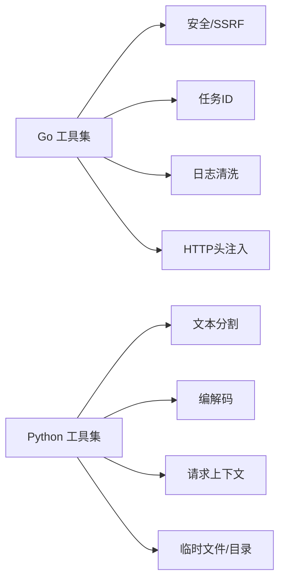

**图表来源**
- [tools.go:1-225](file://internal/common/tools.go#L1-L225)
- [security.go:1-1025](file://internal/utils/security.go#L1-L1025)
- [taskid.go:1-115](file://internal/utils/taskid.go#L1-L115)
- [extraheaders.go:1-87](file://internal/utils/extraheaders.go#L1-L87)
- [split.py:1-81](file://docreader/utils/split.py#L1-L81)
- [endecode.py:1-205](file://docreader/utils/endecode.py#L1-L205)
- [request.py:1-150](file://docreader/utils/request.py#L1-L150)
- [tempfile.py:1-78](file://docreader/utils/tempfile.py#L1-L78)

## 性能考虑
- 文本处理
  - 正则表达式建议预编译并复用，减少重复编译开销
  - 分割函数尽量避免过小的分隔符，减少碎片化
- 编解码
  - 图像编解码优先使用内存缓冲，避免多次磁盘 IO
  - Base64 大数据建议分块处理，避免一次性分配过多内存
- 日志
  - 结构化日志字段数量与长度应受控，避免超长字段
  - data URL 压缩与截断可显著降低日志体积
- 网络
  - SSRF 客户端启用 Keep-Alive 与压缩需结合实际场景权衡
  - 自定义头注入仅在必要时使用，避免多余复制

## 故障排查指南
- 任务 ID 解析失败
  - 检查格式是否符合生成规则（至少四段）
  - 校验 tenantID/timestamp 是否为有效数值
- 加密/解密异常
  - 确认密钥长度为 32 字节
  - 检查输入是否带有版本前缀
- SSRF 校验失败
  - 检查 URL 协议与主机是否在白名单
  - 确认 DNS 解析结果不在受限 IP 范围
- 日志注入告警
  - 检查日志字段是否包含换行/制表符/控制字符
  - 对 data URL 使用压缩工具
- HTTP 头冲突
  - 确认未覆盖保留头
  - 使用包装器注入自定义头

**章节来源**
- [taskid.go:64-94](file://internal/utils/taskid.go#L64-L94)
- [crypto.go:56-89](file://internal/utils/crypto.go#L56-L89)
- [security.go:965-1005](file://internal/utils/security.go#L965-L1005)
- [log_sanitize.go:15-29](file://internal/utils/log_sanitize.go#L15-L29)
- [extraheaders.go:22-45](file://internal/utils/extraheaders.go#L22-L45)

## 结论
WeKnora 工具函数库在安全、可追踪与可扩展方面提供了完善的基础设施：
- 通过严格的输入校验与 SSRF 防护，保障系统边界安全
- 通过请求 ID 与结构化日志，实现端到端的可观测性
- 通过模块化的工具集，支持多语言协作与快速迭代
建议在生产环境中结合白名单与最小权限原则，持续监控日志与告警，确保工具链稳定可靠。

## 附录
- 使用示例（路径指引）
  - 任务 ID 生成与解析：[taskid.go:21-94](file://internal/utils/taskid.go#L21-L94)
  - AES-256-GCM 加密/解密：[crypto.go:29-89](file://internal/utils/crypto.go#L29-L89)
  - SSRF 安全 URL 校验：[security.go:974-1005](file://internal/utils/security.go#L974-L1005)
  - 结构化流水线日志：[tools.go:152-182](file://internal/common/tools.go#L152-L182)
  - 请求 ID 上下文：[request.py:120-150](file://docreader/utils/request.py#L120-L150)
  - 文本分割工具：[split.py:5-81](file://docreader/utils/split.py#L5-L81)
  - 图像/文本编解码：[endecode.py:23-205](file://docreader/utils/endecode.py#L23-L205)
  - 临时文件/目录：[tempfile.py:8-78](file://docreader/utils/tempfile.py#L8-L78)
- 最佳实践
  - 优先使用白名单而非黑名单
  - 对超长日志字段进行截断与压缩
  - 在高并发场景下避免共享可变状态
  - 对第三方 SDK 使用 HTTP 头包装器，避免覆盖关键头