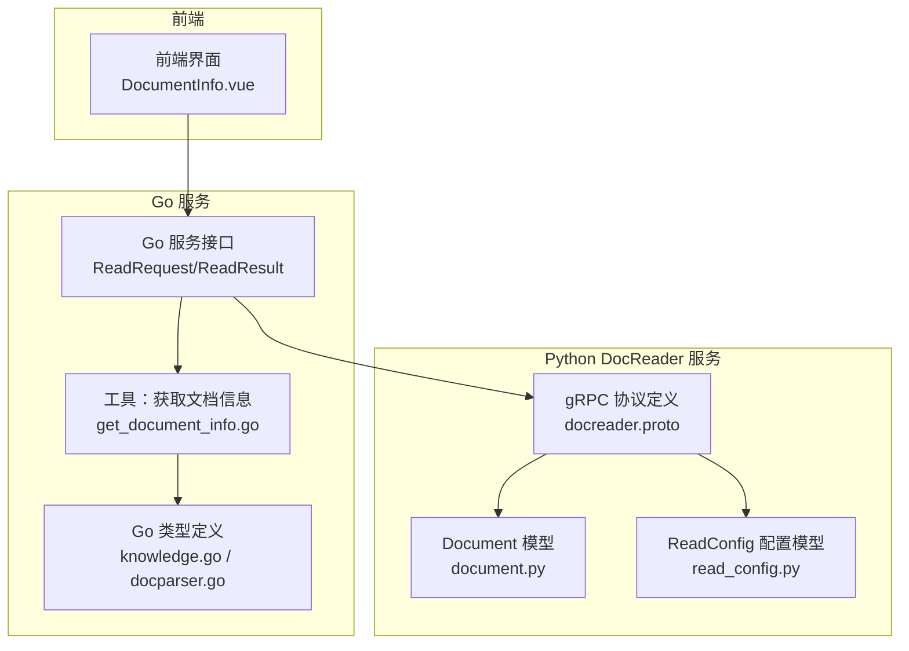
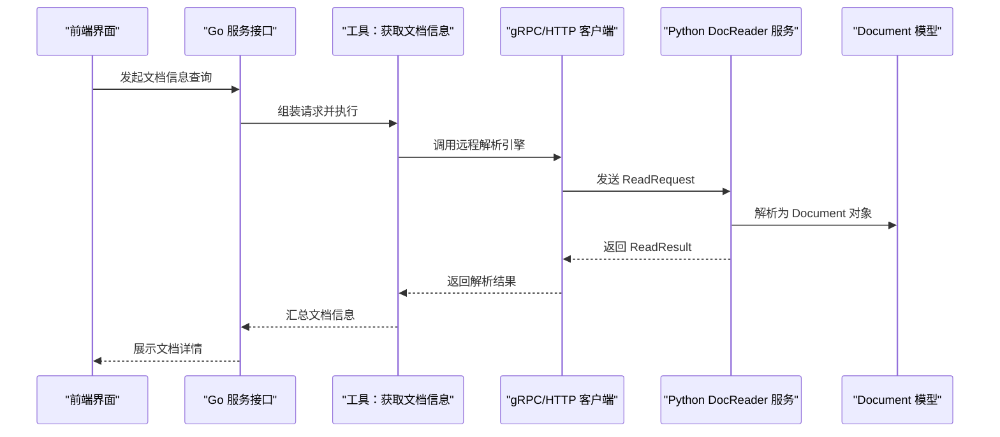
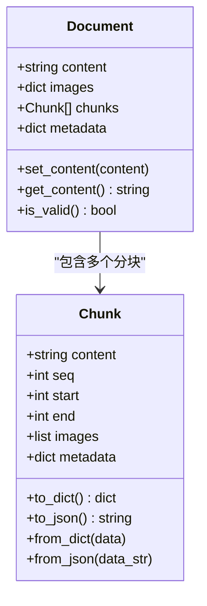
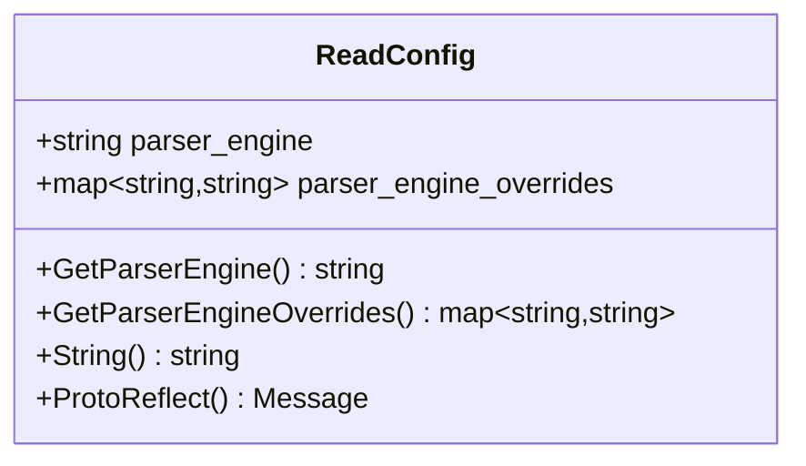
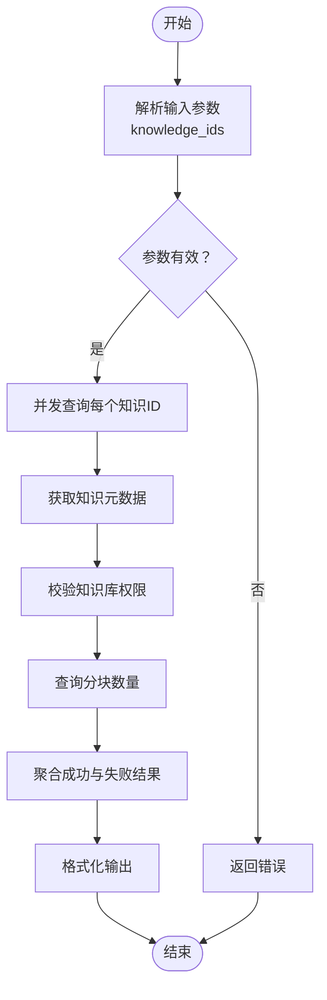
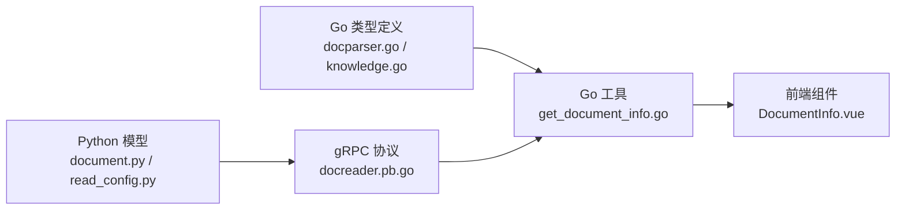

# 文档模型定义

<cite>
**本文档引用的文件**
- [document.py](file://docreader/models/document.py)
- [read_config.py](file://docreader/models/read_config.py)
- [docreader.pb.go](file://docreader/proto/docreader.pb.go)
- [docparser.go](file://internal/times/docparser.go)
- [knowledge.go](file://internal/types/knowledge.go)
- [get_document_info.go](file://internal/agent/tools/get_document_info.go)
- [DocumentInfo.vue](file://frontend/src/views/chat/components/tool-results/DocumentInfo.vue)
</cite>

## 目录
1. [简介](#简介)
2. [项目结构](#项目结构)
3. [核心组件](#核心组件)
4. [架构总览](#架构总览)
5. [详细组件分析](#详细组件分析)
6. [依赖分析](#依赖分析)
7. [性能考虑](#性能考虑)
8. [故障排除指南](#故障排除指南)
9. [结论](#结论)

## 简介
本文件为 WeKnora 文档模型定义的技术文档，聚焦于两类核心模型：Python 端的 Document 模型与 Go 端的 ReadConfig 配置模型。文档详细说明了：
- Document 模型的数据结构、字段定义与属性说明
- ReadConfig 配置模型的参数设置、默认值与验证规则
- 文档对象的生命周期管理、序列化与反序列化机制
- 模型扩展方法、自定义字段添加与数据验证策略
- 模型使用示例、最佳实践与性能考虑
- 面向开发者的完整理解与使用指导

## 项目结构
WeKnora 的文档处理涉及多语言协作：
- Python docreader 服务负责文档解析与分块，输出包含文本、图片引用与元数据的 Document 对象
- Go 服务通过 gRPC/HTTP 与 docreader 通信，传输 ReadRequest/ReadResult，并在后端进行索引与检索
- 前端通过工具结果组件展示文档信息

**图表来源**
- [DocumentInfo.vue:32-215](file://frontend/src/views/chat/components/tool-results/DocumentInfo.vue#L32-L215)
- [get_document_info.go:1-305](file://internal/agent/tools/get_document_info.go#L1-L305)
- [knowledge.go:70-128](file://internal/types/knowledge.go#L70-L128)
- [docparser.go:3-25](file://internal/types/docparser.go#L3-L25)
- [document.py:62-87](file://docreader/models/document.py#L62-L87)
- [read_config.py:1-18](file://docreader/models/read_config.py#L1-L18)
- [docreader.pb.go:24-30](file://docreader/proto/docreader.pb.go#L24-L30)

**章节来源**
- [DocumentInfo.vue:32-215](file://frontend/src/views/chat/components/tool-results/DocumentInfo.vue#L32-L215)
- [get_document_info.go:1-305](file://internal/agent/tools/get_document_info.go#L1-L305)
- [knowledge.go:70-128](file://internal/types/knowledge.go#L70-L128)
- [docparser.go:3-25](file://internal/types/docparser.go#L3-L25)
- [document.py:62-87](file://docreader/models/document.py#L62-L87)
- [read_config.py:1-18](file://docreader/models/read_config.py#L1-L18)
- [docreader.pb.go:24-30](file://docreader/proto/docreader.pb.go#L24-L30)

## 核心组件
本节从 Go 与 Python 双端分别介绍文档模型与配置模型的关键结构。

- Go 端类型定义
  - ReadRequest：统一的文档读取请求，支持文件内容或 URL 两种模式，包含解析引擎与覆盖参数
  - ReadResult：统一的文档读取结果，包含 Markdown 内容、图片引用、元数据、错误信息等
  - Knowledge：知识实体，包含标题、描述、来源、通道、解析状态、文件信息、元数据等
  - DocParser 相关类型：用于分块、图像引用、存储与视觉语言模型配置

- Python 端类型定义
  - Document：包含文本内容、图片映射、分块列表与元数据
  - Chunk：分块对象，包含内容、序号、起止位置、图片与元数据
  - ReadConfig：解析配置，包含解析引擎与引擎覆盖参数

**章节来源**
- [docparser.go:3-25](file://internal/types/docparser.go#L3-L25)
- [knowledge.go:70-128](file://internal/types/knowledge.go#L70-L128)
- [document.py:62-87](file://docreader/models/document.py#L62-L87)
- [document.py:9-45](file://docreader/models/document.py#L9-L45)
- [read_config.py:1-18](file://docreader/models/read_config.py#L1-L18)
- [docreader.pb.go:24-30](file://docreader/proto/docreader.pb.go#L24-L30)

## 架构总览
下图展示了从前端到 Go 服务再到 Python DocReader 的完整调用链路，以及文档模型在各层的流转。

**图表来源**
- [get_document_info.go:74-260](file://internal/agent/tools/get_document_info.go#L74-L260)
- [docparser.go:3-25](file://internal/types/docparser.go#L3-L25)
- [docreader.pb.go:155-160](file://docreader/proto/docreader.pb.go#L155-L160)
- [document.py:62-87](file://docreader/models/document.py#L62-L87)

## 详细组件分析

### Document 模型（Python 端）
Document 是 Python DocReader 服务的核心数据结构，承载解析后的文本内容、图片引用、分块与元数据。

- 字段定义与属性
  - content：字符串，文档文本内容
  - images：字典，键为图片引用路径，值为图片数据（base64 或内联数据）
  - chunks：分块列表，每个分块包含内容、顺序、起止位置、图片与元数据
  - metadata：字典，文档级元数据（如标题提取结果）

- 生命周期管理
  - 创建：解析器返回 Document 实例
  - 有效性校验：is_valid 判断 content 是否为空
  - 序列化/反序列化：提供 to_dict、to_json、from_dict、from_json 方法，便于跨进程/网络传输

- 数据验证策略
  - 内容非空：通过 is_valid 保证
  - 图片引用完整性：由解析器阶段确保 images 映射有效
  - 分块一致性：chunks 中的起止位置与内容长度需一致

- 扩展与自定义
  - 可在 metadata 中添加自定义字段，如来源、版本、标签等
  - 支持在 pipeline 中追加图片与元数据，最终合并到 Document

**图表来源**
- [document.py:62-87](file://docreader/models/document.py#L62-L87)
- [document.py:9-45](file://docreader/models/document.py#L9-L45)

**章节来源**
- [document.py:62-87](file://docreader/models/document.py#L62-L87)
- [document.py:9-45](file://docreader/models/document.py#L9-L45)

### ReadConfig 配置模型（Go 端）
ReadConfig 用于控制文档解析引擎的选择与覆盖参数，是 Go 服务与 Python DocReader 通信的关键配置载体。

- 字段定义与默认值
  - parser_engine：解析引擎名称（可选），用于指定具体解析器
  - parser_engine_overrides：引擎覆盖参数（可选），以键值对形式传递给解析器，覆盖默认行为

- 参数设置与验证规则
  - 引擎名称：应与已注册的解析器名称一致，否则可能导致解析失败
  - 覆盖参数：键值对需符合目标解析器期望的配置项；建议在客户端进行参数合法性检查
  - 默认值：若未设置，解析器将采用内置默认策略

- 生命周期与序列化
  - 在 Go 端作为消息结构存在，通过 gRPC/HTTP 序列化传输
  - 在 Python 端对应为协议缓冲区消息，具备标准的字符串化与反射能力

**图表来源**
- [docreader.pb.go:24-30](file://docreader/proto/docreader.pb.go#L24-L30)
- [docreader.pb.go:62-74](file://docreader/proto/docreader.pb.go#L62-L74)

**章节来源**
- [docreader.pb.go:24-30](file://docreader/proto/docreader.pb.go#L24-L30)
- [docreader.pb.go:62-74](file://docreader/proto/docreader.pb.go#L62-L74)

### ReadRequest/ReadResult（Go 端）
- ReadRequest：统一的文档读取请求，支持文件内容或 URL 两种模式，包含解析引擎与覆盖参数
- ReadResult：统一的文档读取结果，包含 Markdown 内容、图片引用、元数据、错误信息等

这些类型在 Go 服务中被广泛使用，贯穿从请求接收、远程引擎调用到结果回传的全流程。

**章节来源**
- [docparser.go:3-25](file://internal/types/docparser.go#L3-L25)

### Knowledge 模型（Go 端）
Knowledge 表示系统内的知识实体，包含标题、描述、来源、通道、解析状态、文件信息、元数据等。该模型与前端展示的文档信息高度对应，便于在 UI 中渲染与交互。

- 关键字段
  - 标识与归属：ID、TenantID、KnowledgeBaseID
  - 基本信息：Title、Description、Type、Source、Channel
  - 文件信息：FileName、FileType、FileSize、FileHash、FilePath、StorageSize
  - 状态信息：ParseStatus、SummaryStatus、EnableStatus、ErrorMessage、ProcessedAt
  - 元数据：Metadata、LastFAQImportResult
  - 时间戳：CreatedAt、UpdatedAt、DeletedAt

- 与前端展示的关系
  - 前端组件 DocumentInfo.vue 展示的知识信息来源于 Knowledge 与分块统计结果

**章节来源**
- [knowledge.go:70-128](file://internal/types/knowledge.go#L70-L128)
- [DocumentInfo.vue:32-215](file://frontend/src/views/chat/components/tool-results/DocumentInfo.vue#L32-L215)

### 工具：获取文档信息（Go 端）
该工具通过并发查询知识元数据与分块数量，汇总为用户友好的展示结果。其流程如下：

**图表来源**
- [get_document_info.go:74-260](file://internal/agent/tools/get_document_info.go#L74-L260)

**章节来源**
- [get_document_info.go:74-260](file://internal/agent/tools/get_document_info.go#L74-L260)

## 依赖分析
- Go 端依赖
  - types/docparser.go：定义 ReadRequest/ReadResult 与相关内部类型
  - types/knowledge.go：定义 Knowledge 模型及其元数据操作
  - agent/tools/get_document_info.go：使用 Knowledge/Chunk 服务进行并发查询
  - frontend/components/DocumentInfo.vue：消费后端返回的文档信息

- Python 端依赖
  - docreader/models/document.py：定义 Document/Chunk 模型
  - docreader/models/read_config.py：定义 ReadConfig（兼容性保留）
  - docreader/proto/docreader.pb.go：定义 gRPC 协议中的 ReadConfig 结构

**图表来源**
- [docparser.go:3-25](file://internal/types/docparser.go#L3-L25)
- [knowledge.go:70-128](file://internal/types/knowledge.go#L70-L128)
- [get_document_info.go:1-305](file://internal/agent/tools/get_document_info.go#L1-L305)
- [document.py:62-87](file://docreader/models/document.py#L62-L87)
- [read_config.py:1-18](file://docreader/models/read_config.py#L1-L18)
- [docreader.pb.go:24-30](file://docreader/proto/docreader.pb.go#L24-L30)

**章节来源**
- [docparser.go:3-25](file://internal/types/docparser.go#L3-L25)
- [knowledge.go:70-128](file://internal/types/knowledge.go#L70-L128)
- [get_document_info.go:1-305](file://internal/agent/tools/get_document_info.go#L1-L305)
- [document.py:62-87](file://docreader/models/document.py#L62-L87)
- [read_config.py:1-18](file://docreader/models/read_config.py#L1-L18)
- [docreader.pb.go:24-30](file://docreader/proto/docreader.pb.go#L24-L30)

## 性能考虑
- 并发查询：工具通过 goroutine 并发查询多个知识 ID，显著提升批量查询性能
- 分块统计：仅查询分块总数，避免加载全部分块内容，降低 IO 压力
- 图像与元数据：Document 模型支持图片引用与元数据合并，pipeline 中按阶段累积，减少重复处理
- 配置覆盖：ReadConfig 的引擎覆盖参数应在客户端严格校验，避免无效参数导致的重试与失败

## 故障排除指南
- 文档解析为空
  - 检查解析器是否正确返回 Document，is_valid 应为真
  - 确认文件类型与解析器匹配，必要时切换 parser_engine 或调整覆盖参数
- 权限与可见性
  - 确保知识库在搜索目标范围内，避免因权限导致查询失败
- 错误信息
  - ReadResult.Error 字段包含解析错误摘要，可用于定位问题
- 前端展示异常
  - 检查返回的文档信息结构是否符合前端组件预期（如文件大小、状态格式化）

**章节来源**
- [get_document_info.go:112-156](file://internal/agent/tools/get_document_info.go#L112-L156)
- [docparser.go:16-25](file://internal/types/docparser.go#L16-L25)

## 结论
本文档系统梳理了 WeKnora 的文档模型与配置模型，明确了 Go 与 Python 两端的数据结构、字段定义与交互方式。通过并发查询、分块统计与协议化配置，系统实现了高效、可扩展的文档处理能力。开发者可基于本文档进行模型扩展、自定义字段添加与验证策略优化，并结合最佳实践与性能考量，构建稳定可靠的文档应用。