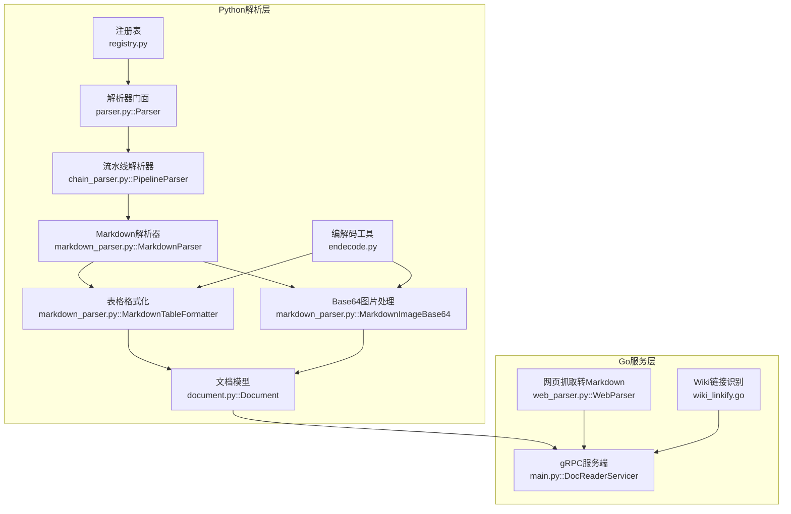
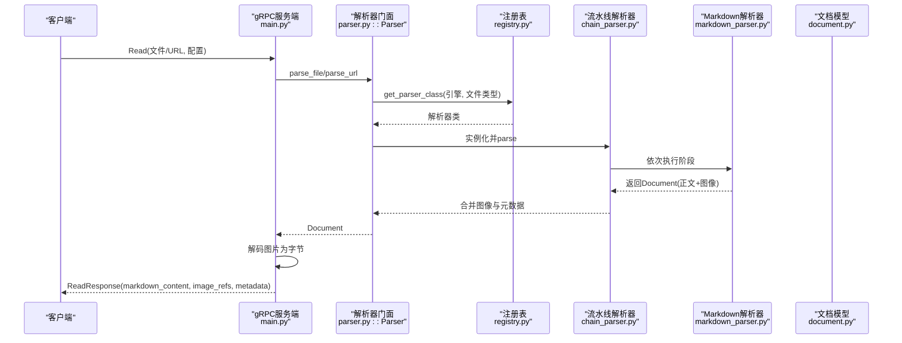
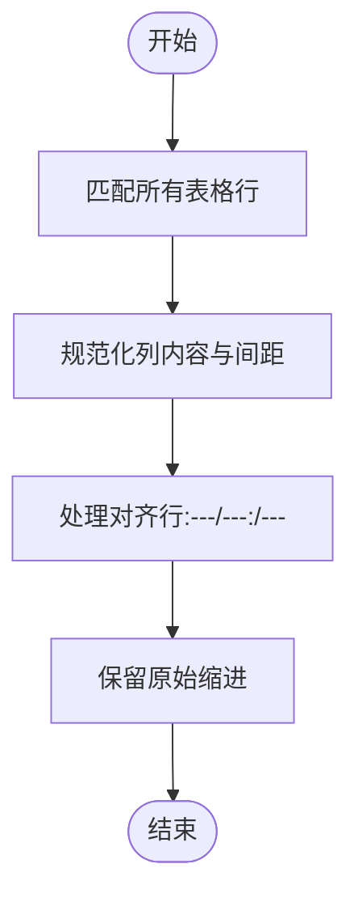
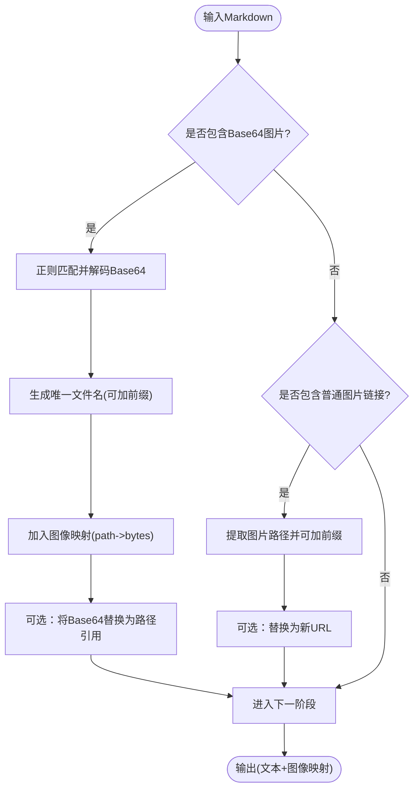
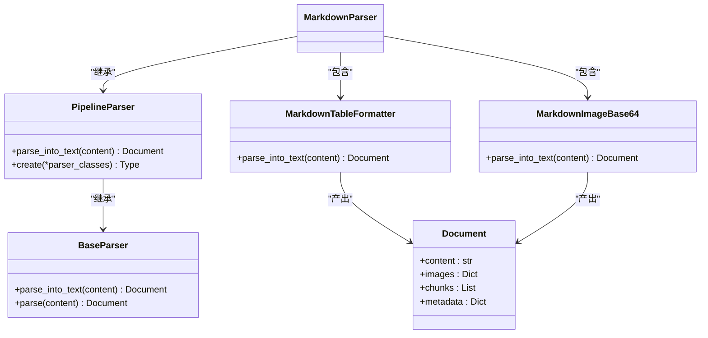
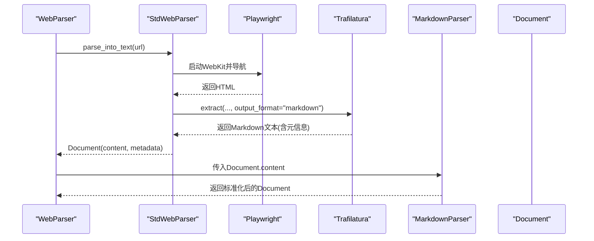
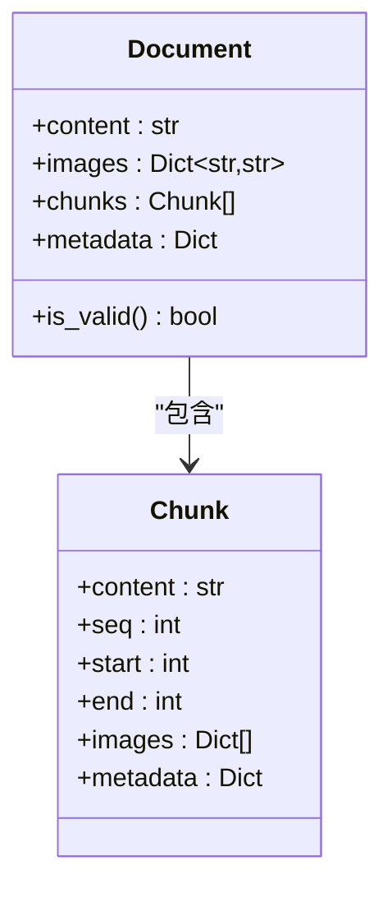
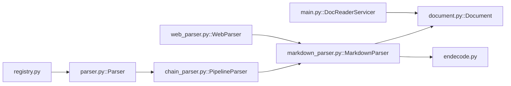

# Markdown解析器

<cite>
**本文引用的文件**
- [markdown_parser.py](file://docreader/parser/markdown_parser.py)
- [base_parser.py](file://docreader/parser/base_parser.py)
- [chain_parser.py](file://docreader/parser/chain_parser.py)
- [registry.py](file://docreader/parser/registry.py)
- [parser.py](file://docreader/parser/parser.py)
- [document.py](file://docreader/models/document.py)
- [endecode.py](file://docreader/utils/endecode.py)
- [test.md](file://docreader/testdata/test.md)
- [web_parser.py](file://docreader/parser/web_parser.py)
- [config.py](file://docreader/config.py)
- [main.py](file://docreader/main.py)
- [wiki_linkify.go](file://internal/application/service/wiki_linkify.go)
- [web_fetch.go](file://internal/agent/tools/web_fetch.go)
- [splitter.go](file://internal/infrastructure/chunker/splitter.go)
</cite>

## 目录
1. [简介](#简介)
2. [项目结构](#项目结构)
3. [核心组件](#核心组件)
4. [架构总览](#架构总览)
5. [详细组件分析](#详细组件分析)
6. [依赖分析](#依赖分析)
7. [性能考虑](#性能考虑)
8. [故障排查指南](#故障排查指南)
9. [结论](#结论)
10. [附录](#附录)

## 简介
本技术文档围绕WeKnora的Markdown解析器展开，系统性阐述其解析原理、语法树构建思路、内容提取与图像处理机制，并覆盖复杂文档结构（如表格、代码块、链接、图片）的处理策略。文档同时给出扩展开发与定制化建议，帮助开发者在现有管道基础上添加新阶段或自定义渲染器。

## 项目结构
WeKnora的Markdown解析能力主要位于Python子系统docreader中，采用“注册表+解析器工厂+流水线”的架构组织。Markdown解析器通过管道串联多个阶段，先标准化表格格式，再抽取并转换内联图片；同时提供统一入口Parser进行文件/URL解析，并与Go侧服务对接完成图像持久化与返回。

**图表来源**
- [registry.py:112-161](file://docreader/parser/registry.py#L112-L161)
- [parser.py:11-83](file://docreader/parser/parser.py#L11-L83)
- [chain_parser.py:94-171](file://docreader/parser/chain_parser.py#L94-L171)
- [markdown_parser.py:376-387](file://docreader/parser/markdown_parser.py#L376-L387)
- [document.py:62-88](file://docreader/models/document.py#L62-L88)
- [endecode.py:133-197](file://docreader/utils/endecode.py#L133-L197)
- [main.py:98-182](file://docreader/main.py#L98-L182)
- [web_parser.py:128-138](file://docreader/parser/web_parser.py#L128-L138)
- [wiki_linkify.go:35-82](file://internal/application/service/wiki_linkify.go#L35-L82)

**章节来源**
- [registry.py:112-161](file://docreader/parser/registry.py#L112-L161)
- [parser.py:11-83](file://docreader/parser/parser.py#L11-L83)
- [chain_parser.py:94-171](file://docreader/parser/chain_parser.py#L94-L171)
- [markdown_parser.py:376-387](file://docreader/parser/markdown_parser.py#L376-L387)
- [document.py:62-88](file://docreader/models/document.py#L62-L88)
- [endecode.py:133-197](file://docreader/utils/endecode.py#L133-L197)
- [main.py:98-182](file://docreader/main.py#L98-L182)
- [web_parser.py:128-138](file://docreader/parser/web_parser.py#L128-L138)
- [wiki_linkify.go:35-82](file://internal/application/service/wiki_linkify.go#L35-L82)

## 核心组件
- 注册表与引擎选择：根据文件类型自动选择解析器类，支持回退到内置引擎。
- 解析器门面：统一对外接口，负责实例化具体解析器并执行解析。
- 流水线解析器：顺序执行多个解析阶段，合并各阶段的图像与元数据。
- Markdown解析器：标准表格格式化 + Base64图片抽取。
- 文档模型：承载纯文本、图像映射、分块与元数据。
- 编解码工具：多编码自动检测、Base64图像编解码、字节与字符串互转。
- Web解析器：网页抓取+Trafilatura提取+Markdown转换，再进入Markdown管道。
- Go服务端：接收解析结果，解码图片并返回给前端渲染。

**章节来源**
- [registry.py:51-76](file://docreader/parser/registry.py#L51-L76)
- [parser.py:25-63](file://docreader/parser/parser.py#L25-L63)
- [chain_parser.py:122-151](file://docreader/parser/chain_parser.py#L122-L151)
- [markdown_parser.py:376-387](file://docreader/parser/markdown_parser.py#L376-L387)
- [document.py:62-88](file://docreader/models/document.py#L62-L88)
- [endecode.py:133-197](file://docreader/utils/endecode.py#L133-L197)
- [web_parser.py:128-138](file://docreader/parser/web_parser.py#L128-L138)
- [main.py:98-167](file://docreader/main.py#L98-L167)

## 架构总览
下图展示从请求到响应的关键路径：客户端发起Read请求，服务端根据文件类型或URL选择解析器，执行流水线解析，最终将Markdown正文与图像引用返回。

**图表来源**
- [main.py:103-167](file://docreader/main.py#L103-L167)
- [parser.py:25-63](file://docreader/parser/parser.py#L25-L63)
- [registry.py:51-76](file://docreader/parser/registry.py#L51-L76)
- [chain_parser.py:122-151](file://docreader/parser/chain_parser.py#L122-L151)
- [markdown_parser.py:376-387](file://docreader/parser/markdown_parser.py#L376-L387)
- [document.py:62-88](file://docreader/models/document.py#L62-L88)

## 详细组件分析

### Markdown表格格式化
- 功能目标：统一表格行与对齐标记的空白与对齐符号，保证渲染一致性。
- 关键点：
  - 使用正则分别匹配“表头/数据行”和“对齐行”，先处理常规行，再处理对齐行，避免冲突。
  - 保留缩进与列内容空白清理，输出标准格式。
- 复杂度：按行扫描，时间复杂度近似O(N)，N为内容字符数；空间开销与输出规模线性相关。

**图表来源**
- [markdown_parser.py:61-103](file://docreader/parser/markdown_parser.py#L61-L103)

**章节来源**
- [markdown_parser.py:30-104](file://docreader/parser/markdown_parser.py#L30-L104)

### Markdown图片处理（Base64与路径）
- 功能目标：从Markdown中抽取内联Base64图片，转换为可存储的文件路径，并返回原始二进制供Go侧持久化；同时支持替换本地路径为上传后的URL。
- 关键点：
  - 提取正则支持带方括号的alt文本与灵活的URL格式。
  - Base64解码失败时记录错误并跳过该图片，保证健壮性。
  - 生成唯一文件名并可加前缀目录，便于归档。
  - 替换路径时仅对映射中存在的路径生效，避免误伤。
- 输出：更新后的Markdown文本与图像映射（路径->base64字符串），由Go侧解码为字节后返回。

**图表来源**
- [markdown_parser.py:190-296](file://docreader/parser/markdown_parser.py#L190-L296)
- [endecode.py:78-112](file://docreader/utils/endecode.py#L78-L112)

**章节来源**
- [markdown_parser.py:163-339](file://docreader/parser/markdown_parser.py#L163-L339)
- [endecode.py:78-112](file://docreader/utils/endecode.py#L78-L112)

### Markdown解析器（流水线）
- 组成：MarkdownTableFormatter + MarkdownImageBase64。
- 流程：先格式化表格，再抽取Base64图片，最终合并图像与元数据。
- 设计优势：阶段职责清晰、易于扩展；图像与元数据在每个阶段累积，最终统一返回。

**图表来源**
- [chain_parser.py:94-171](file://docreader/parser/chain_parser.py#L94-L171)
- [markdown_parser.py:127-161](file://docreader/parser/markdown_parser.py#L127-L161)
- [markdown_parser.py:352-374](file://docreader/parser/markdown_parser.py#L352-L374)
- [markdown_parser.py:376-387](file://docreader/parser/markdown_parser.py#L376-L387)
- [document.py:62-88](file://docreader/models/document.py#L62-L88)

**章节来源**
- [chain_parser.py:94-171](file://docreader/parser/chain_parser.py#L94-L171)
- [markdown_parser.py:352-387](file://docreader/parser/markdown_parser.py#L352-L387)
- [document.py:62-88](file://docreader/models/document.py#L62-L88)

### Web解析器（网页抓取+Markdown）
- 组件：StdWebParser（Playwright+Trafilatura）+ WebParser（流水线）。
- 流程：抓取HTML→Trafilatura提取→生成含标题、图片、表格、链接的Markdown→进入Markdown管道。
- 适用场景：在线文档、博客文章等富文本页面的Markdown化。

**图表来源**
- [web_parser.py:86-126](file://docreader/parser/web_parser.py#L86-L126)
- [web_parser.py:128-138](file://docreader/parser/web_parser.py#L128-L138)
- [markdown_parser.py:376-387](file://docreader/parser/markdown_parser.py#L376-L387)

**章节来源**
- [web_parser.py:18-138](file://docreader/parser/web_parser.py#L18-L138)
- [markdown_parser.py:376-387](file://docreader/parser/markdown_parser.py#L376-L387)

### 文档模型与图像解码
- Document：承载content、images、chunks、metadata；提供有效性判断。
- 图像解码：服务端将解析阶段产生的base64图像解码为字节，构造ImageRef返回给前端渲染。

**图表来源**
- [document.py:9-88](file://docreader/models/document.py#L9-L88)
- [main.py:54-96](file://docreader/main.py#L54-L96)

**章节来源**
- [document.py:62-88](file://docreader/models/document.py#L62-L88)
- [main.py:54-96](file://docreader/main.py#L54-L96)

### 编解码工具
- decode_bytes：多编码自动检测（UTF-8、GB系列、Big5、Latin-1等），优先成功解码，失败回退Latin-1并告警。
- encode_image/decode_image：Base64与二进制互转，支持多种输入格式（路径、字节、PIL、NumPy）。
- 用途：解析阶段读取字节流、写入图像映射；服务端解码为字节返回。

**章节来源**
- [endecode.py:133-197](file://docreader/utils/endecode.py#L133-L197)
- [endecode.py:23-112](file://docreader/utils/endecode.py#L23-L112)

### Wiki链接识别（Go侧）
- 能力：在内容中识别并注入[[slug|matchText]]跨链接，跳过代码块、行内代码、已有链接与图片等区域，保证不破坏结构。
- 适用：知识库/wiki内容的交叉引用增强。

**章节来源**
- [wiki_linkify.go:35-82](file://internal/application/service/wiki_linkify.go#L35-L82)
- [wiki_linkify.go:190-200](file://internal/application/service/wiki_linkify.go#L190-L200)

### HTML到Markdown转换（Go侧）
- 能力：将HTML节点树转换为Markdown，处理标题、段落、列表、链接、图片、代码块、引用、表格等。
- 适用：网页抓取后的结构化Markdown生成。

**章节来源**
- [web_fetch.go:551-636](file://internal/agent/tools/web_fetch.go#L551-L636)

## 依赖分析
- 解析器注册表：按引擎与文件类型映射解析器类，未命中时回退至内置引擎。
- 解析器门面：根据注册表选择解析器实例，统一日志与异常处理。
- 流水线解析器：顺序执行多个解析器，合并图像与元数据。
- 文档模型：作为解析器与服务端之间的契约对象。
- 编解码工具：为解析与服务端提供通用的文本与图像处理能力。

**图表来源**
- [registry.py:51-76](file://docreader/parser/registry.py#L51-L76)
- [parser.py:25-63](file://docreader/parser/parser.py#L25-L63)
- [chain_parser.py:122-151](file://docreader/parser/chain_parser.py#L122-L151)
- [markdown_parser.py:376-387](file://docreader/parser/markdown_parser.py#L376-L387)
- [document.py:62-88](file://docreader/models/document.py#L62-L88)
- [main.py:98-167](file://docreader/main.py#L98-L167)
- [web_parser.py:128-138](file://docreader/parser/web_parser.py#L128-L138)

**章节来源**
- [registry.py:51-76](file://docreader/parser/registry.py#L51-L76)
- [parser.py:25-63](file://docreader/parser/parser.py#L25-L63)
- [chain_parser.py:122-151](file://docreader/parser/chain_parser.py#L122-L151)
- [markdown_parser.py:376-387](file://docreader/parser/markdown_parser.py#L376-L387)
- [document.py:62-88](file://docreader/models/document.py#L62-L88)
- [main.py:98-167](file://docreader/main.py#L98-L167)
- [web_parser.py:128-138](file://docreader/parser/web_parser.py#L128-L138)

## 性能考虑
- 正则匹配：表格与图片的正则扫描为线性复杂度，适合大文档；注意避免重复编译正则，可在模块级缓存。
- 字符集检测：decode_bytes尝试多种编码，建议在已知编码的场景下直接指定编码，减少尝试次数。
- 图像处理：Base64解码与二进制写入为CPU与I/O密集操作，建议批量处理并控制并发。
- 管道阶段：流水线阶段越多，内存占用与处理时间越长；按需启用阶段，避免冗余转换。
- Web抓取：Playwright启动成本较高，建议复用浏览器或限制并发，合理设置超时。

[本节为通用性能建议，无需特定文件引用]

## 故障排查指南
- 解析为空：检查输入内容是否为空或编码异常；确认注册表是否正确映射文件类型。
- 图片解码失败：查看Base64格式是否规范，errors参数设置为忽略时会跳过无效项。
- Web抓取失败：检查代理配置、网络连通性与超时设置；确认Trafilatura输出是否为空。
- gRPC传输：关注最大消息长度配置，避免超大文档导致截断。

**章节来源**
- [parser.py:58-62](file://docreader/parser/parser.py#L58-L62)
- [endecode.py:103-112](file://docreader/utils/endecode.py#L103-L112)
- [web_parser.py:48-84](file://docreader/parser/web_parser.py#L48-L84)
- [config.py:69-97](file://docreader/config.py#L69-L97)
- [main.py:187-193](file://docreader/main.py#L187-L193)

## 结论
WeKnora的Markdown解析器采用轻量、可扩展的流水线设计：先标准化表格，再抽取并转换图片，最后由Go侧完成图像持久化与返回。该架构既满足常见Markdown文档的高质量提取，也为复杂场景（网页抓取、跨链接识别）提供了良好扩展基础。开发者可通过新增解析阶段、自定义渲染器或调整配置参数来适配更多业务需求。

[本节为总结性内容，无需特定文件引用]

## 附录

### Markdown扩展与自定义渲染
- 代码块识别：支持行内代码与围栏代码块，行内代码用反引号包裹，围栏代码块以三个及以上相同字符开头与结尾。
- 图片链接解析：支持内联图片与普通链接，正则可处理带括号的URL。
- 链接与表格：遵循CommonMark语义，表格对齐行与内容行分别处理，确保渲染一致性。
- 自定义渲染器：前端可针对不同语言（如Mermaid）定制代码块渲染逻辑，提升可视化效果。

**章节来源**
- [markdown_parser.py:182-188](file://docreader/parser/markdown_parser.py#L182-L188)
- [web_fetch.go:600-610](file://internal/agent/tools/web_fetch.go#L600-L610)
- [wiki_linkify.go:402-456](file://internal/application/service/wiki_linkify.go#L402-L456)

### 配置选项与环境变量
- gRPC相关：最大工作线程、最大文件大小、端口。
- 解析器：Docx最大页数。
- 代理：HTTP/HTTPS代理。
- 图像输出目录：临时图像输出路径（与Go侧共享卷）。

**章节来源**
- [config.py:48-97](file://docreader/config.py#L48-L97)

### 示例文档
- 测试Markdown文档包含图片、链接、代码块、表格与分块示例，可用于验证解析与分块逻辑。

**章节来源**
- [test.md:1-37](file://docreader/testdata/test.md#L1-L37)