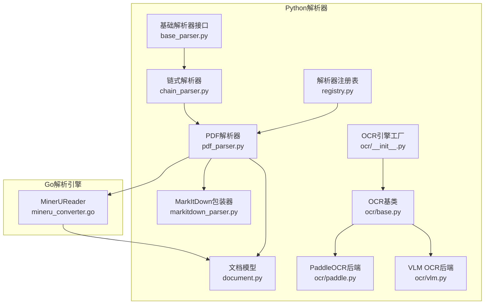
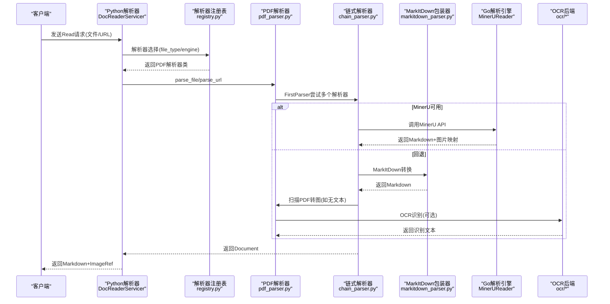
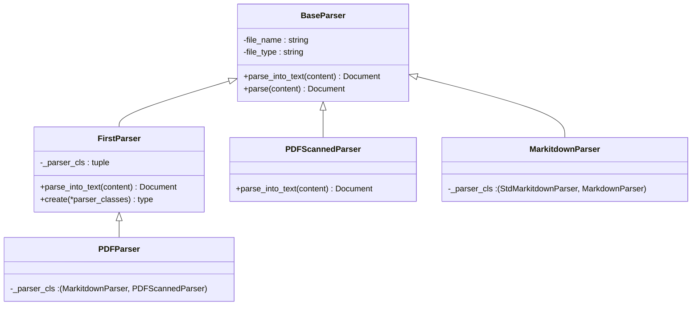
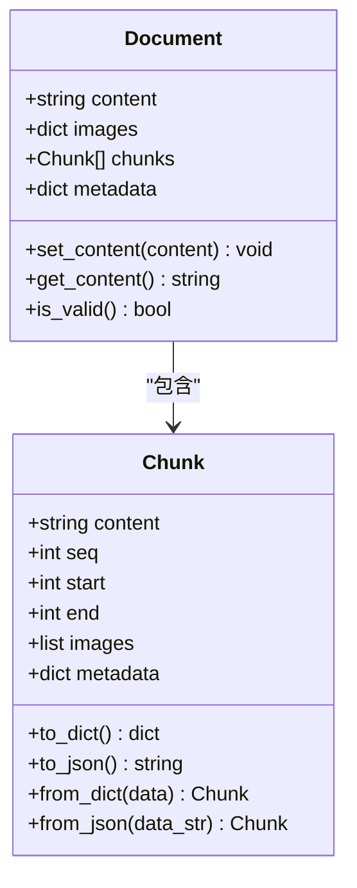
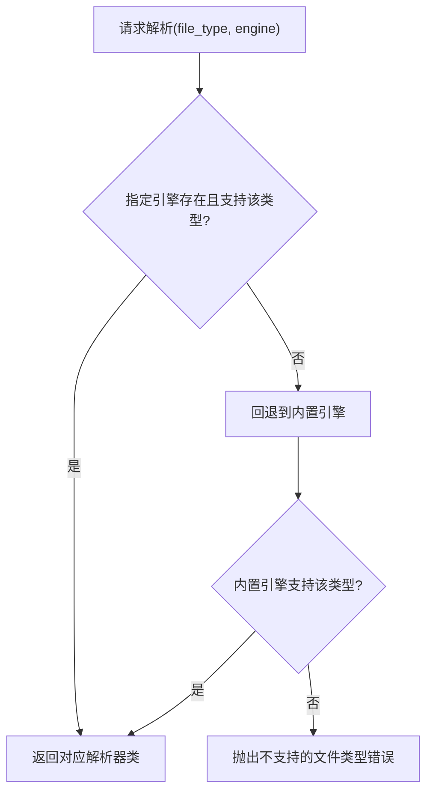
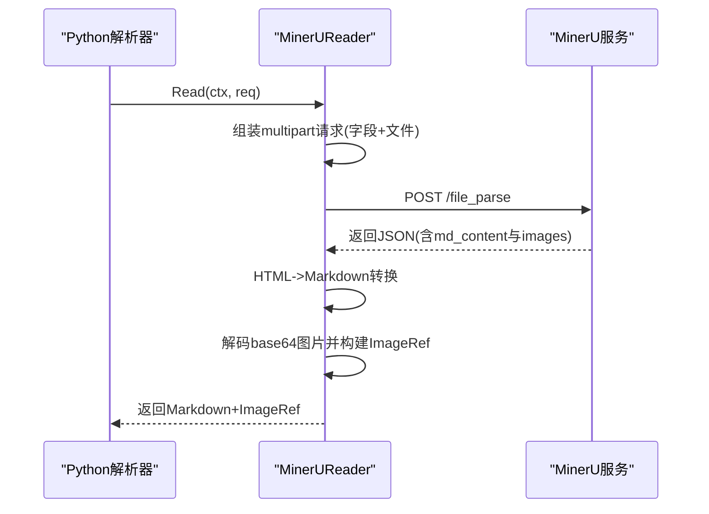
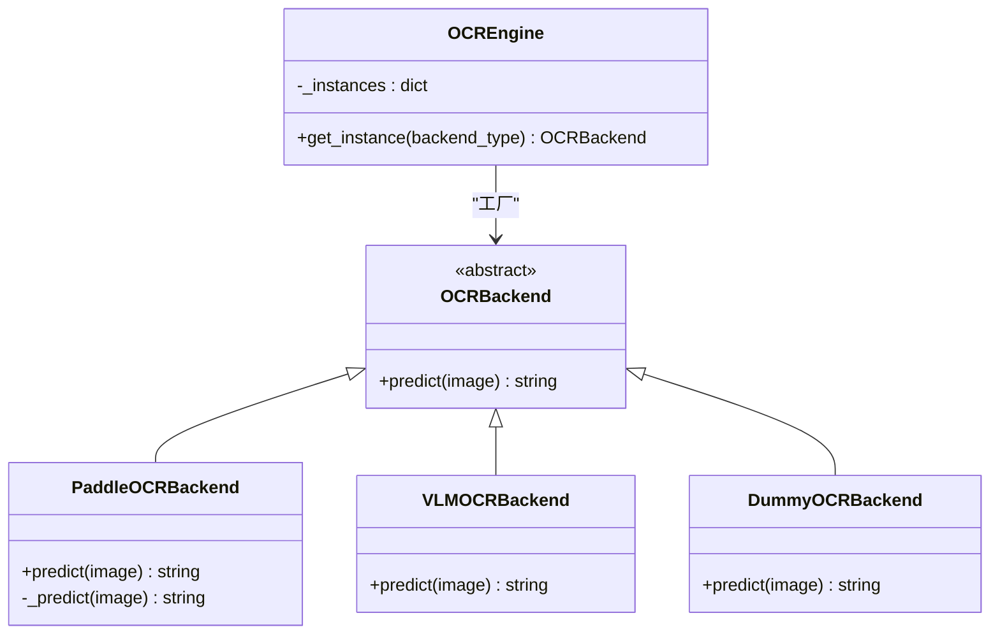
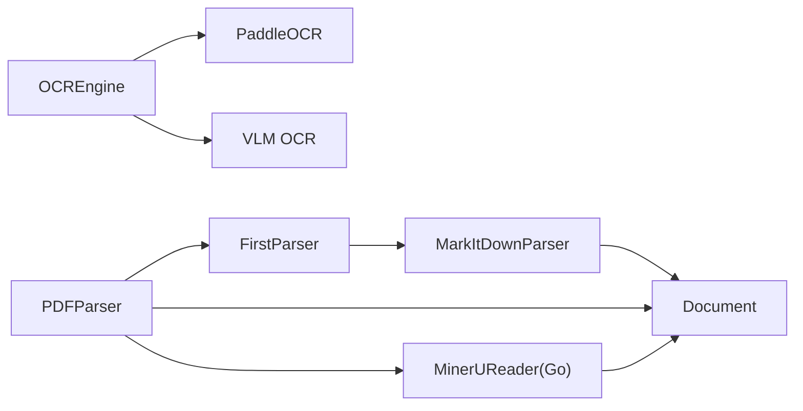

# PDF文档解析器

<cite>
**本文档引用的文件**
- [pdf_parser.py](file://docreader/parser/pdf_parser.py)
- [base_parser.py](file://docreader/parser/base_parser.py)
- [chain_parser.py](file://docreader/parser/chain_parser.py)
- [markitdown_parser.py](file://docreader/parser/markitdown_parser.py)
- [document.py](file://docreader/models/document.py)
- [registry.py](file://docreader/parser/registry.py)
- [mineru_converter.go](file://internal/infrastructure/docparser/mineru_converter.go)
- [__init__.py](file://docreader/ocr/__init__.py)
- [base.py](file://docreader/ocr/base.py)
- [paddle.py](file://docreader/ocr/paddle.py)
- [vlm.py](file://docreader/ocr/vlm.py)
- [main.py](file://docreader/main.py)
- [analyze_form.py](file://examples/skills/pdf-processing/scripts/analyze_form.py)
</cite>

## 目录
1. [简介](#简介)
2. [项目结构](#项目结构)
3. [核心组件](#核心组件)
4. [架构总览](#架构总览)
5. [详细组件分析](#详细组件分析)
6. [依赖分析](#依赖分析)
7. [性能考虑](#性能考虑)
8. [故障排除指南](#故障排除指南)
9. [结论](#结论)
10. [附录](#附录)

## 简介
本文件为WeKnora PDF文档解析器的技术文档，聚焦于PDF解析器的实现原理、文本提取算法与布局分析技术，解释PDF文档结构解析、元数据提取与图像识别机制，并阐述多语言支持、字体处理与复杂版式还原策略。同时覆盖PDF质量评估、解析精度优化与错误恢复机制，提供解析配置选项、性能调优参数与故障排除方法，面向开发者提供定制与优化指导。

## 项目结构
WeKnora的PDF解析能力由Python侧解析器与Go侧解析引擎协同完成：
- Python侧：提供解析器注册表、链式解析器、PDF专用解析器与OCR后端工厂等模块
- Go侧：提供MinerU自托管解析引擎的HTTP客户端封装，负责调用外部解析服务并处理响应

**图表来源**
- [registry.py:112-161](file://docreader/parser/registry.py#L112-L161)
- [base_parser.py:13-62](file://docreader/parser/base_parser.py#L13-L62)
- [chain_parser.py:20-180](file://docreader/parser/chain_parser.py#L20-L180)
- [pdf_parser.py:13-69](file://docreader/parser/pdf_parser.py#L13-L69)
- [markitdown_parser.py:14-46](file://docreader/parser/markitdown_parser.py#L14-L46)
- [document.py:62-88](file://docreader/models/document.py#L62-L88)
- [__init__.py:12-37](file://docreader/ocr/__init__.py#L12-L37)
- [base.py:10-31](file://docreader/ocr/base.py#L10-L31)
- [paddle.py:16-176](file://docreader/ocr/paddle.py#L16-L176)
- [vlm.py:14-88](file://docreader/ocr/vlm.py#L14-L88)
- [mineru_converter.go:28-81](file://internal/infrastructure/docparser/mineru_converter.go#L28-L81)

**章节来源**
- [pdf_parser.py:13-69](file://docreader/parser/pdf_parser.py#L13-L69)
- [registry.py:112-161](file://docreader/parser/registry.py#L112-L161)

## 核心组件
- 基础解析器接口：定义统一的解析契约，负责记录日志与输出Document对象
- 链式解析器：FirstParser按顺序尝试多个解析器；PipelineParser将多个解析器串联处理
- PDF专用解析器：PDFParser采用“先MinerU，再MarkItDown，最后扫描PDF转图”的链式策略
- 文档模型：Document承载文本内容、图片映射与分块信息
- OCR引擎工厂：统一管理PaddleOCR与VLM OCR后端实例
- MinerUReader：Go侧封装MinerU自托管解析服务的HTTP客户端，负责调用与结果处理

**章节来源**
- [base_parser.py:13-62](file://docreader/parser/base_parser.py#L13-L62)
- [chain_parser.py:20-180](file://docreader/parser/chain_parser.py#L20-L180)
- [pdf_parser.py:57-69](file://docreader/parser/pdf_parser.py#L57-L69)
- [document.py:62-88](file://docreader/models/document.py#L62-L88)
- [__init__.py:12-37](file://docreader/ocr/__init__.py#L12-L37)
- [mineru_converter.go:28-81](file://internal/infrastructure/docparser/mineru_converter.go#L28-L81)

## 架构总览
PDF解析的整体流程如下：
- Python侧根据文件类型选择解析器，优先尝试MinerU（通过Go侧调用），失败则回退到MarkItDown，最终对扫描版PDF转为图片供后续OCR处理
- Go侧MinerUReader负责构造multipart请求、设置解析参数（表格/公式/OCR开关、语言等）、解析响应并生成ImageRef列表
- Python侧DocReaderServicer统一接收gRPC请求，调用解析器并返回Markdown与图片引用

**图表来源**
- [main.py:98-182](file://docreader/main.py#L98-L182)
- [registry.py:51-76](file://docreader/parser/registry.py#L51-L76)
- [pdf_parser.py:57-69](file://docreader/parser/pdf_parser.py#L57-L69)
- [chain_parser.py:48-73](file://docreader/parser/chain_parser.py#L48-L73)
- [markitdown_parser.py:45-46](file://docreader/parser/markitdown_parser.py#L45-L46)
- [mineru_converter.go:50-81](file://internal/infrastructure/docparser/mineru_converter.go#L50-L81)
- [__init__.py:18-37](file://docreader/ocr/__init__.py#L18-L37)

## 详细组件分析

### PDF解析器（PDFParser）
- 设计模式：采用链式责任模式（FirstParser），按顺序尝试多个解析器
- 解析顺序：
  1) MarkItDownParser：通用文档格式转换（含PDF）
  2) PDFScannedParser：若前序无文本，将每页转为PNG图片，供Go侧OCR处理
- 输出：Document对象，包含Markdown文本、图片映射与元数据（页数、来源类型）

**图表来源**
- [base_parser.py:13-62](file://docreader/parser/base_parser.py#L13-L62)
- [chain_parser.py:20-92](file://docreader/parser/chain_parser.py#L20-L92)
- [pdf_parser.py:13-69](file://docreader/parser/pdf_parser.py#L13-L69)
- [markitdown_parser.py:45-46](file://docreader/parser/markitdown_parser.py#L45-L46)

**章节来源**
- [pdf_parser.py:13-69](file://docreader/parser/pdf_parser.py#L13-L69)

### 文档模型（Document）
- 字段：content（Markdown文本）、images（相对路径到base64数据的映射）、chunks（分块列表）、metadata（解析元数据）
- 方法：set_content/get_content/is_valid等，用于内容设置与有效性判断
- 分块模型：Chunk包含content、seq、start/end位置、images与metadata

**图表来源**
- [document.py:62-88](file://docreader/models/document.py#L62-L88)

**章节来源**
- [document.py:62-88](file://docreader/models/document.py#L62-L88)

### 解析器注册表（ParserEngineRegistry）
- 功能：按引擎名与文件类型映射到具体解析器类；不支持时自动回退到内置引擎
- 内置引擎支持：docx、doc、pdf、md/markdown、xlsx/xls、多种图片格式
- 可插拔：支持通过check_available函数检查可用性与提示原因

**图表来源**
- [registry.py:51-76](file://docreader/parser/registry.py#L51-L76)

**章节来源**
- [registry.py:18-161](file://docreader/parser/registry.py#L18-L161)

### MinerU解析引擎（Go侧）
- 职责：调用自托管MinerU服务，传入解析参数（表格/公式/OCR开关、语言、页码范围等），解析HTML为Markdown并处理图片
- 图片处理：解码base64或data URI，构建ImageRef列表，替换Markdown中的图片引用
- 错误处理：超时控制、状态码校验、响应结构调试日志

**图表来源**
- [mineru_converter.go:50-81](file://internal/infrastructure/docparser/mineru_converter.go#L50-L81)
- [mineru_converter.go:97-193](file://internal/infrastructure/docparser/mineru_converter.go#L97-L193)
- [mineru_converter.go:195-245](file://internal/infrastructure/docparser/mineru_converter.go#L195-L245)

**章节来源**
- [mineru_converter.go:28-280](file://internal/infrastructure/docparser/mineru_converter.go#L28-L280)

### OCR后端与图像识别
- OCR引擎工厂：按后端类型获取实例（paddle/vlm/dummy）
- PaddleOCR后端：CPU优先、指令集兼容性检测、多阈值与模型配置
- VLM OCR后端：OpenAI兼容接口，发送base64图片与提示词，返回Markdown格式文本
- 图像识别：扫描版PDF转图后，由OCR后端识别正文文本，支持表格HTML与公式LaTeX格式

**图表来源**
- [__init__.py:12-37](file://docreader/ocr/__init__.py#L12-L37)
- [base.py:10-31](file://docreader/ocr/base.py#L10-L31)
- [paddle.py:16-176](file://docreader/ocr/paddle.py#L16-L176)
- [vlm.py:14-88](file://docreader/ocr/vlm.py#L14-L88)

**章节来源**
- [__init__.py:12-37](file://docreader/ocr/__init__.py#L12-L37)
- [paddle.py:16-176](file://docreader/ocr/paddle.py#L16-L176)
- [vlm.py:14-88](file://docreader/ocr/vlm.py#L14-L88)

### 表单字段分析示例
- 示例脚本展示如何分析PDF表单字段结构，便于在解析后进行表单抽取与填充策略制定

**章节来源**
- [analyze_form.py:10-47](file://examples/skills/pdf-processing/scripts/analyze_form.py#L10-L47)

## 依赖分析
- Python解析器依赖关系清晰：PDFParser依赖FirstParser与MarkItDownParser；MarkItDownParser内部组合StdMarkitdownParser与MarkdownParser
- Go解析引擎作为外部服务调用方，依赖MinerU API响应结构与图片编码格式
- OCR后端独立于解析器，通过工厂模式注入

**图表来源**
- [pdf_parser.py:57-69](file://docreader/parser/pdf_parser.py#L57-L69)
- [chain_parser.py:48-73](file://docreader/parser/chain_parser.py#L48-L73)
- [markitdown_parser.py:45-46](file://docreader/parser/markitdown_parser.py#L45-L46)
- [mineru_converter.go:50-81](file://internal/infrastructure/docparser/mineru_converter.go#L50-L81)
- [__init__.py:18-37](file://docreader/ocr/__init__.py#L18-L37)

**章节来源**
- [pdf_parser.py:57-69](file://docreader/parser/pdf_parser.py#L57-L69)
- [chain_parser.py:48-73](file://docreader/parser/chain_parser.py#L48-L73)
- [mineru_converter.go:50-81](file://internal/infrastructure/docparser/mineru_converter.go#L50-L81)
- [__init__.py:18-37](file://docreader/ocr/__init__.py#L18-L37)

## 性能考虑
- 解析链路优化
  - 优先使用MinerU（Go侧）以获得更好的表格/公式/OCR处理能力，减少回退成本
  - 对大文档设置合理超时（MinerUReader默认较长超时）
- 图片处理
  - 扫描版PDF转图分辨率建议适中（当前默认150dpi），避免过大导致内存与传输压力
  - 图片base64解码与MIME类型推断在Go侧完成，Python侧仅做解码与组装
- OCR后端
  - PaddleOCR在CPU上运行，需注意指令集兼容性；必要时切换VLM后端
  - VLM后端受网络与模型限制，建议配置合理的超时与重试策略
- 并发与资源
  - gRPC服务器线程池大小与消息长度限制可在启动参数中调整

**章节来源**
- [mineru_converter.go:23-24](file://internal/infrastructure/docparser/mineru_converter.go#L23-L24)
- [pdf_parser.py:32-36](file://docreader/parser/pdf_parser.py#L32-L36)
- [paddle.py:25-67](file://docreader/ocr/paddle.py#L25-L67)
- [main.py:187-193](file://docreader/main.py#L187-L193)

## 故障排除指南
- 解析失败
  - 检查MinerU服务可达性与端点配置；确认解析参数（表格/公式/OCR开关、语言）设置
  - 若MinerU不可用，确认回退链路（MarkItDown/PDFScanned）是否正常
- 图片缺失或乱码
  - 确认图片引用在Markdown中存在；检查base64编码与data URI格式
  - Go侧会过滤不在Markdown中的图片引用，确保引用路径一致
- OCR无结果
  - 检查OCR后端初始化日志；PaddleOCR需满足CPU指令集要求
  - VLM后端需确保API密钥与基础地址正确
- 日志与调试
  - Python侧记录请求ID与解析耗时；Go侧记录MinerU响应结构与截断日志
  - gRPC服务端打印启动信息与错误堆栈，便于定位问题

**章节来源**
- [mineru_converter.go:252-268](file://internal/infrastructure/docparser/mineru_converter.go#L252-L268)
- [mineru_converter.go:160-172](file://internal/infrastructure/docparser/mineru_converter.go#L160-L172)
- [main.py:162-166](file://docreader/main.py#L162-L166)
- [paddle.py:95-117](file://docreader/ocr/paddle.py#L95-L117)
- [vlm.py:50-59](file://docreader/ocr/vlm.py#L50-L59)

## 结论
WeKnora的PDF解析器通过“Python解析器 + Go解析引擎 + OCR后端”的协作架构，实现了对结构化文档的高质量解析与复杂版式的还原。其链式解析策略、可插拔的引擎注册表与完善的错误恢复机制，为多语言、多格式PDF处理提供了稳定可靠的解决方案。开发者可根据业务需求调整解析参数、切换OCR后端与优化性能参数，以达到最佳解析效果。

## 附录
- 配置项与参数
  - MinerU解析参数：表格启用、公式启用、解析方式（OCR/纯文本）、语言列表、页码范围等
  - OCR后端参数：模型名称、API密钥、基础URL、温度与最大token数
  - gRPC服务参数：并发线程数、最大消息长度、日志级别
- 最佳实践
  - 大文档优先启用MinerU并开启表格/公式/OCR
  - 扫描版PDF务必启用OCR后端
  - 在生产环境监控MinerU响应时间与错误率，及时调整超时与重试策略