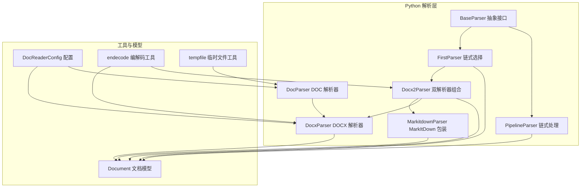
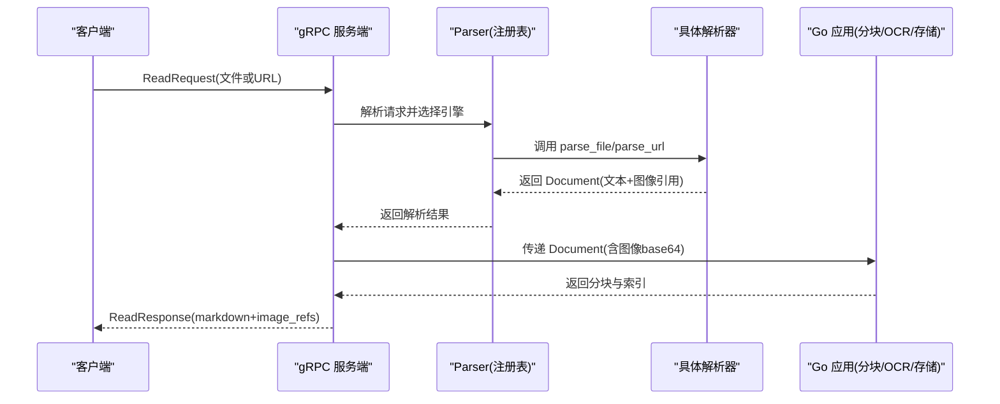
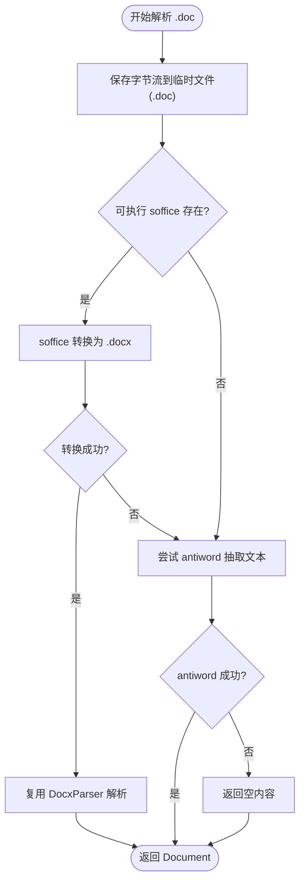
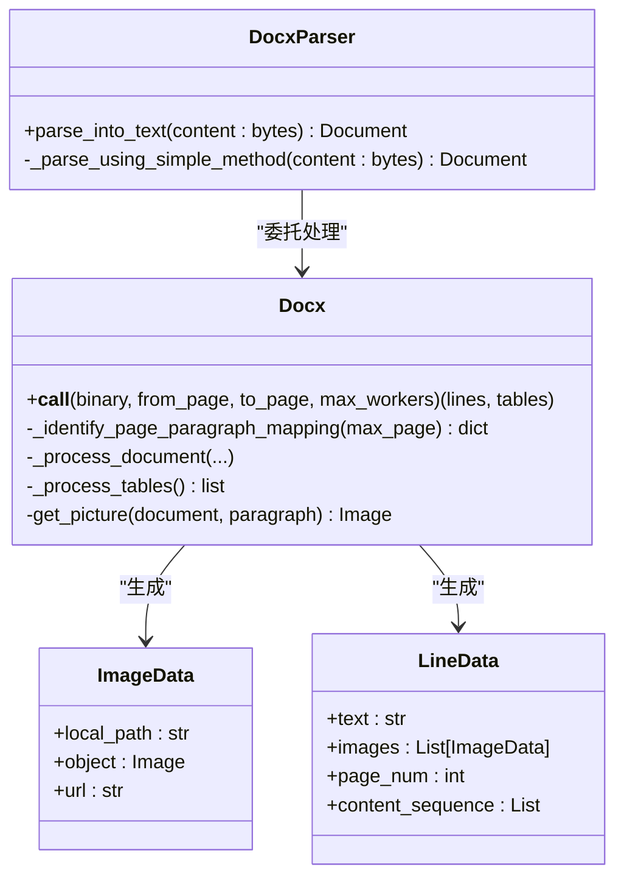
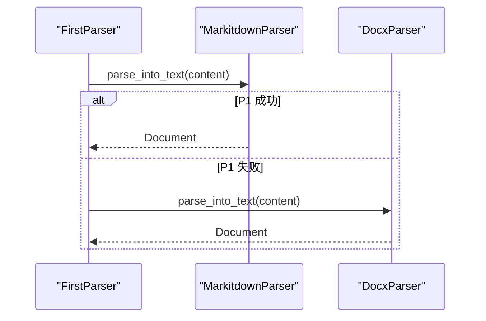
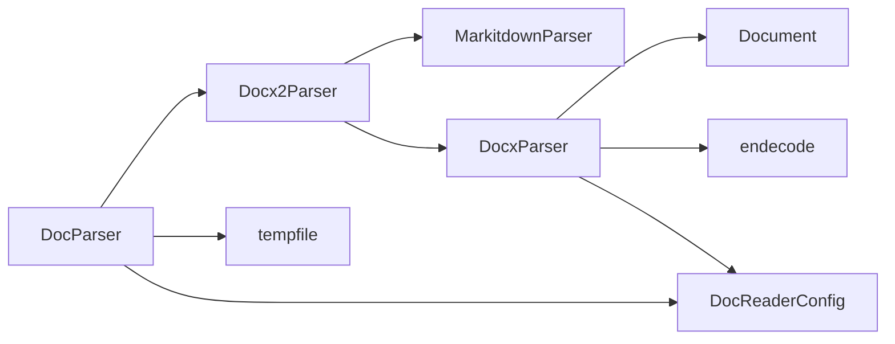

# Word文档解析器

<cite>
**本文档引用的文件**
- [doc_parser.py](file://docreader/parser/doc_parser.py)
- [docx_parser.py](file://docreader/parser/docx_parser.py)
- [docx2_parser.py](file://docreader/parser/docx2_parser.py)
- [base_parser.py](file://docreader/parser/base_parser.py)
- [chain_parser.py](file://docreader/parser/chain_parser.py)
- [markitdown_parser.py](file://docreader/parser/markitdown_parser.py)
- [document.py](file://docreader/models/document.py)
- [read_config.py](file://docreader/models/read_config.py)
- [config.py](file://docreader/config.py)
- [endecode.py](file://docreader/utils/endecode.py)
- [tempfile.py](file://docreader/utils/tempfile.py)
- [main.py](file://docreader/main.py)
</cite>

## 目录
1. [简介](#简介)
2. [项目结构](#项目结构)
3. [核心组件](#核心组件)
4. [架构总览](#架构总览)
5. [详细组件分析](#详细组件分析)
6. [依赖关系分析](#依赖关系分析)
7. [性能考虑](#性能考虑)
8. [故障排除指南](#故障排除指南)
9. [结论](#结论)
10. [附录](#附录)

## 简介
本文件为 WeKnora Word 文档解析器的技术文档，聚焦 DOC 与 DOCX 格式解析器的实现差异与处理策略，涵盖文档结构分析、样式信息提取、表格识别、元数据处理、批注与修订跟踪机制，以及复杂文档格式支持、样式转换与内容重构策略。同时提供解析器配置选项、性能优化技巧与兼容性处理方法，并面向开发者提供定制化开发指导。

## 项目结构
WeKnora 的文档解析模块位于 docreader/parser 目录，围绕抽象基类 BaseParser 提供多种具体解析器实现，包括 DOC 解析器（DocParser）、DOCX 解析器（DocxParser）、链式解析器（FirstParser、PipelineParser）以及 MarkItDown 包装器（MarkitdownParser）。解析结果统一通过 Document 模型返回，图像以相对路径与 base64 数据形式存储，最终由 Go 侧完成持久化与分块处理。

**图表来源**
- [base_parser.py:13-62](file://docreader/parser/base_parser.py#L13-L62)
- [chain_parser.py:20-180](file://docreader/parser/chain_parser.py#L20-L180)
- [doc_parser.py:95-332](file://docreader/parser/doc_parser.py#L95-L332)
- [docx_parser.py:75-800](file://docreader/parser/docx_parser.py#L75-L800)
- [docx2_parser.py:10-29](file://docreader/parser/docx2_parser.py#L10-L29)
- [markitdown_parser.py:14-46](file://docreader/parser/markitdown_parser.py#L14-L46)
- [document.py:62-88](file://docreader/models/document.py#L62-L88)
- [config.py:48-98](file://docreader/config.py#L48-L98)
- [endecode.py:23-131](file://docreader/utils/endecode.py#L23-L131)
- [tempfile.py:8-78](file://docreader/utils/tempfile.py#L8-L78)

**章节来源**
- [base_parser.py:13-62](file://docreader/parser/base_parser.py#L13-L62)
- [chain_parser.py:20-180](file://docreader/parser/chain_parser.py#L20-L180)
- [doc_parser.py:95-332](file://docreader/parser/doc_parser.py#L95-L332)
- [docx_parser.py:75-800](file://docreader/parser/docx_parser.py#L75-L800)
- [docx2_parser.py:10-29](file://docreader/parser/docx2_parser.py#L10-L29)
- [markitdown_parser.py:14-46](file://docreader/parser/markitdown_parser.py#L14-L46)
- [document.py:62-88](file://docreader/models/document.py#L62-L88)
- [config.py:48-98](file://docreader/config.py#L48-L98)
- [endecode.py:23-131](file://docreader/utils/endecode.py#L23-L131)
- [tempfile.py:8-78](file://docreader/utils/tempfile.py#L8-L78)

## 核心组件
- 抽象解析器 BaseParser：定义统一的 parse_into_text 接口，负责将字节流解析为 Document 对象，仅负责文本与图像引用的提取，不进行分块、OCR 或 VLM 处理。
- DOC 解析器 DocParser：针对 .doc 文件，优先尝试转换为 .docx 后复用 DocxParser；若失败则回退到 antiword 文本抽取；textract 路径因安全原因被禁用。
- DOCX 解析器 DocxParser：基于 python-docx，支持并发多进程处理页面、图片提取与缓存、段落页码映射、表格识别与文本重构。
- 链式解析器 FirstParser/PipelineParser：FirstParser 顺序尝试多个解析器直到成功；PipelineParser 将前序输出作为后序输入，累积图像与元数据。
- MarkItDown 包装器：通过 MarkItDown 库对多种文档格式（含 docx、pdf 等）进行统一转换。
- 文档模型 Document：包含 content、images、chunks、metadata 字段，提供 is_valid 判定与序列化能力。
- 配置系统 DocReaderConfig：从环境变量加载 gRPC、解析器、代理与图片输出目录等参数。
- 工具模块：endecode 提供图像 base64 编解码与多编码文本解码；tempfile 提供临时文件/目录上下文管理。

**章节来源**
- [base_parser.py:13-62](file://docreader/parser/base_parser.py#L13-L62)
- [doc_parser.py:95-332](file://docreader/parser/doc_parser.py#L95-L332)
- [docx_parser.py:75-800](file://docreader/parser/docx_parser.py#L75-L800)
- [chain_parser.py:20-180](file://docreader/parser/chain_parser.py#L20-L180)
- [markitdown_parser.py:14-46](file://docreader/parser/markitdown_parser.py#L14-L46)
- [document.py:62-88](file://docreader/models/document.py#L62-L88)
- [config.py:48-98](file://docreader/config.py#L48-L98)
- [endecode.py:23-131](file://docreader/utils/endecode.py#L23-L131)
- [tempfile.py:8-78](file://docreader/utils/tempfile.py#L8-L78)

## 架构总览
解析器整体采用“Python 解析 + Go 处理”的分层设计：Python 层负责文档结构解析、样式与表格提取、图像发现与引用生成；Go 层负责分块、OCR/VLM、存储与检索。

**图表来源**
- [main.py:98-182](file://docreader/main.py#L98-L182)
- [docx_parser.py:102-207](file://docreader/parser/docx_parser.py#L102-L207)
- [doc_parser.py:103-128](file://docreader/parser/doc_parser.py#L103-L128)

**章节来源**
- [main.py:98-182](file://docreader/main.py#L98-L182)
- [docx_parser.py:102-207](file://docreader/parser/docx_parser.py#L102-L207)
- [doc_parser.py:103-128](file://docreader/parser/doc_parser.py#L103-L128)

## 详细组件分析

### DOC 解析器（DocParser）
- 设计目标：兼容旧版 .doc 文档，优先通过 LibreOffice/OpenOffice 转换为 .docx 后复用 DocxParser；若不可用则尝试 antiword；textract 路径出于 SSRF 风险禁用。
- 关键流程：
  - 临时保存 .doc 字节流，依次尝试转换为 .docx 并解析；若失败则调用 antiword 提取文本；最后回退空文档。
  - 转换过程在沙箱中执行，注入 http/https 代理环境变量，超时控制默认 60 秒。
  - 可自动探测 soffice 与 antiword 可执行文件路径，支持多平台常见安装位置。
- 安全与稳定性：通过 SandboxExecutor 执行外部命令，记录日志并抛出异常；antiword 失败时明确返回错误信息；转换失败时返回空内容避免崩溃。

**图表来源**
- [doc_parser.py:103-229](file://docreader/parser/doc_parser.py#L103-L229)

**章节来源**
- [doc_parser.py:95-332](file://docreader/parser/doc_parser.py#L95-L332)

### DOCX 解析器（DocxParser）
- 设计目标：高性能解析 .docx，支持并发多进程、图片提取与缓存、段落页码映射、表格识别与文本重构。
- 关键特性：
  - 并发策略：根据 CPU 核数与页面数量动态调整工作进程数；大文档使用启发式估算减少 XML 解析开销。
  - 页面映射：两种策略——标准遍历段落查找分页符与节断，或对大文档使用平均每页段落数估算；最终统计每页段落数分布。
  - 图片处理：提取嵌入图片，PIL 解码并缓存；支持上传回调生成内联 base64；图片引用以相对路径返回，由 Go 侧持久化。
  - 表格识别：遍历所有表格行，过滤空单元格，按“|”连接生成行文本，累积到最终文本。
  - 回退机制：主流程失败时回退到简化方法，直接读取段落与表格文本。
- 性能优化：
  - 进程池 + 共享资源锁，避免重复加载文档；
  - 临时文件共享，减少内存占用；
  - 最大页数限制（默认 100），防止超大文档导致内存压力。

**图表来源**
- [docx_parser.py:75-800](file://docreader/parser/docx_parser.py#L75-L800)
- [document.py:52-88](file://docreader/models/document.py#L52-L88)

**章节来源**
- [docx_parser.py:75-800](file://docreader/parser/docx_parser.py#L75-L800)
- [document.py:52-88](file://docreader/models/document.py#L52-L88)

### 链式解析器（FirstParser / PipelineParser）
- FirstParser：按顺序尝试多个解析器，首个成功返回有效 Document 即终止；适合容错与多格式兼容。
- PipelineParser：将前序解析器输出作为后序输入，累积图像与元数据；适合多阶段处理（如预处理、转换、后处理）。
- Docx2Parser：继承 FirstParser，组合 MarkitdownParser 与 DocxParser，先尝试 MarkItDown，再回退到 DocxParser。

**图表来源**
- [chain_parser.py:20-92](file://docreader/parser/chain_parser.py#L20-L92)
- [docx2_parser.py:10-12](file://docreader/parser/docx2_parser.py#L10-L12)

**章节来源**
- [chain_parser.py:20-180](file://docreader/parser/chain_parser.py#L20-L180)
- [docx2_parser.py:10-29](file://docreader/parser/docx2_parser.py#L10-L29)

### MarkItDown 包装器（MarkitdownParser）
- 通过 MarkItDown 库对多种文档格式进行统一转换，内部使用文件扩展名提示格式，保留 data URI 图像引用。
- 作为 PipelineParser 的一部分，可与其他解析器串联，提升多格式兼容性。

**章节来源**
- [markitdown_parser.py:14-46](file://docreader/parser/markitdown_parser.py#L14-L46)

### 文档模型与编解码工具
- Document：统一承载解析结果，支持 content、images、chunks、metadata；提供 is_valid 判定与序列化。
- endecode：提供图像 base64 编解码与多编码文本解码，保障跨语言传输一致性。
- tempfile：提供临时文件/目录上下文管理，确保资源清理。

**章节来源**
- [document.py:62-88](file://docreader/models/document.py#L62-L88)
- [endecode.py:23-131](file://docreader/utils/endecode.py#L23-L131)
- [tempfile.py:8-78](file://docreader/utils/tempfile.py#L8-L78)

## 依赖关系分析
- DocParser 依赖 Docx2Parser 与外部 soffice/antiword；通过 SandboxExecutor 注入代理环境变量并限制超时。
- DocxParser 依赖 python-docx、PIL、docx.opc；通过 Docx 类封装并发处理与页面映射。
- ChainParser 与 Docx2Parser 作为组合模式，降低耦合度，便于扩展新解析器。
- 配置系统 DocReaderConfig 通过环境变量驱动，影响并发、代理与图片输出路径。

**图表来源**
- [doc_parser.py:95-332](file://docreader/parser/doc_parser.py#L95-L332)
- [docx2_parser.py:10-29](file://docreader/parser/docx2_parser.py#L10-L29)
- [docx_parser.py:75-800](file://docreader/parser/docx_parser.py#L75-L800)
- [chain_parser.py:20-180](file://docreader/parser/chain_parser.py#L20-L180)
- [config.py:48-98](file://docreader/config.py#L48-L98)
- [endecode.py:23-131](file://docreader/utils/endecode.py#L23-L131)
- [tempfile.py:8-78](file://docreader/utils/tempfile.py#L8-L78)

**章节来源**
- [doc_parser.py:95-332](file://docreader/parser/doc_parser.py#L95-L332)
- [docx_parser.py:75-800](file://docreader/parser/docx_parser.py#L75-L800)
- [chain_parser.py:20-180](file://docreader/parser/chain_parser.py#L20-L180)
- [config.py:48-98](file://docreader/config.py#L48-L98)

## 性能考虑
- 并发与资源控制
  - DocxParser 动态计算最大工作进程数，结合文档图片数量与 CPU 核心数，避免过度并发导致内存峰值过高。
  - 使用进程池与共享列表收集结果，减少线程间同步成本。
- 页面映射优化
  - 大文档采用平均每页段落数估算，显著降低 XML 解析与分页符检测开销；小文档使用精确遍历保证准确性。
- 图片处理
  - 图片缓存与 base64 内联策略，减少重复 I/O；临时文件命名与清理确保磁盘空间可控。
- 配置调优
  - 通过环境变量设置最大页数、gRPC 并发与文件大小限制，平衡吞吐与稳定性。
- 安全与健壮性
  - 外部命令执行在沙箱中进行，注入代理并设置超时；异常捕获与回退逻辑确保单个解析器失败不影响整体可用性。

**章节来源**
- [docx_parser.py:640-800](file://docreader/parser/docx_parser.py#L640-L800)
- [doc_parser.py:16-90](file://docreader/parser/doc_parser.py#L16-L90)
- [config.py:66-98](file://docreader/config.py#L66-L98)

## 故障排除指南
- DOC 转换失败
  - 症状：转换为 .docx 失败或返回空内容。
  - 排查：确认 soffice 是否安装且可执行；检查代理配置；查看沙箱执行日志与返回码。
- antiword 抽取失败
  - 症状：antiword 未安装或执行失败。
  - 排查：确认 antiword 可执行路径；检查权限与依赖库；查看命令输出与返回码。
- DOCX 解析异常
  - 症状：python-docx 加载失败或图片解码异常。
  - 排查：检查文档完整性；查看图片格式是否受支持；启用简化方法回退。
- 图像引用缺失
  - 症状：Document.images 为空。
  - 排查：确认 enable_multimodal 开关；检查图片提取与上传回调逻辑；验证 Go 侧图片解析与持久化。
- 性能问题
  - 症状：内存占用高或处理缓慢。
  - 排查：调整 docx_max_pages；减少并发进程数；优化图片尺寸与数量。

**章节来源**
- [doc_parser.py:142-229](file://docreader/parser/doc_parser.py#L142-L229)
- [docx_parser.py:300-475](file://docreader/parser/docx_parser.py#L300-L475)
- [main.py:54-96](file://docreader/main.py#L54-L96)

## 结论
WeKnora 的 Word 文档解析器通过抽象接口与链式组合实现了对 DOC 与 DOCX 的差异化处理：DOC 侧重转换与回退策略，DOCX 强调并发与结构化提取。配合统一的 Document 模型与 Go 侧处理管线，系统在兼容性、性能与安全性方面取得良好平衡。开发者可通过扩展解析器、调整配置与优化并发策略，满足复杂场景下的定制化需求。

## 附录

### 配置选项与环境变量
- gRPC 相关
  - DOCREADER_GRPC_MAX_WORKERS：gRPC 服务器最大工作线程数
  - DOCREADER_GRPC_PORT：监听端口
  - DOCREADER_GRPC_MAX_FILE_SIZE_MB：最大消息长度（MB）
- 解析器相关
  - DOCREADER_DOCX_MAX_PAGES：DOCX 最大处理页数
- 代理相关
  - DOCREADER_EXTERNAL_HTTP_PROXY / DOCREADER_EXTERNAL_HTTPS_PROXY：外部 HTTP/HTTPS 代理
- 图片输出
  - DOCREADER_IMAGE_OUTPUT_DIR：图片输出目录（本地回退）

**章节来源**
- [config.py:66-98](file://docreader/config.py#L66-L98)

### 兼容性与扩展建议
- 新增解析器
  - 实现 BaseParser 接口，提供 parse_into_text 方法；在 ChainParser 中注册或通过自定义工厂类组合。
- 支持新格式
  - 通过 MarkItDown 包装器快速接入；或实现专用解析器并加入 FirstParser 链。
- 批注与修订跟踪
  - 当前解析器主要提取文本与图片；如需批注/修订，可在 DocxParser 中扩展相关字段并返回到 Document.metadata。

**章节来源**
- [base_parser.py:13-62](file://docreader/parser/base_parser.py#L13-L62)
- [chain_parser.py:20-180](file://docreader/parser/chain_parser.py#L20-L180)
- [markitdown_parser.py:14-46](file://docreader/parser/markitdown_parser.py#L14-L46)