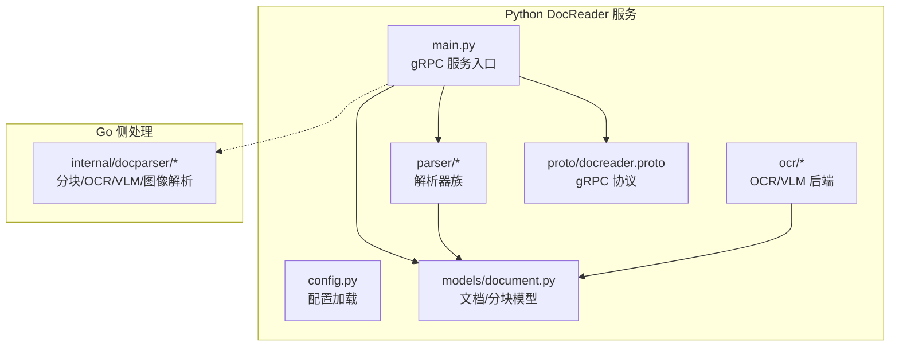
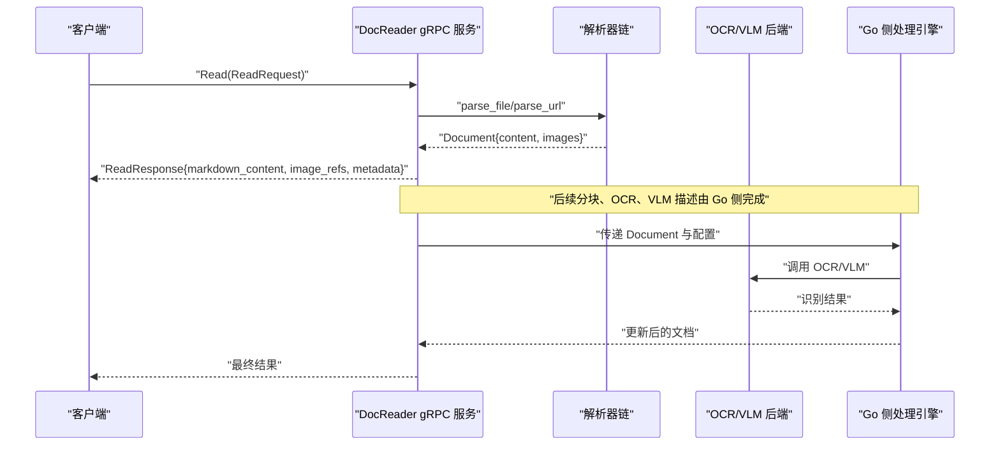
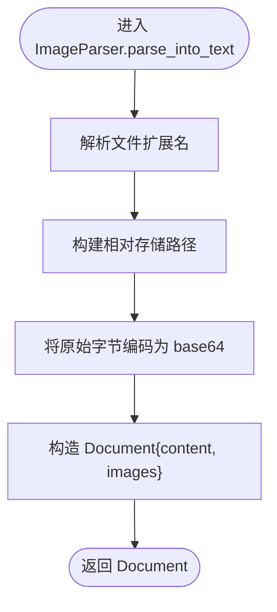
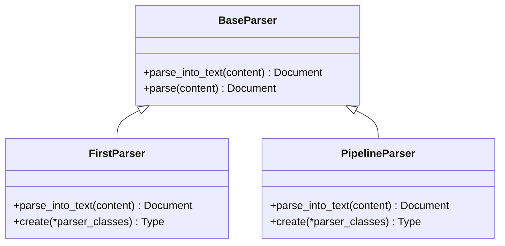
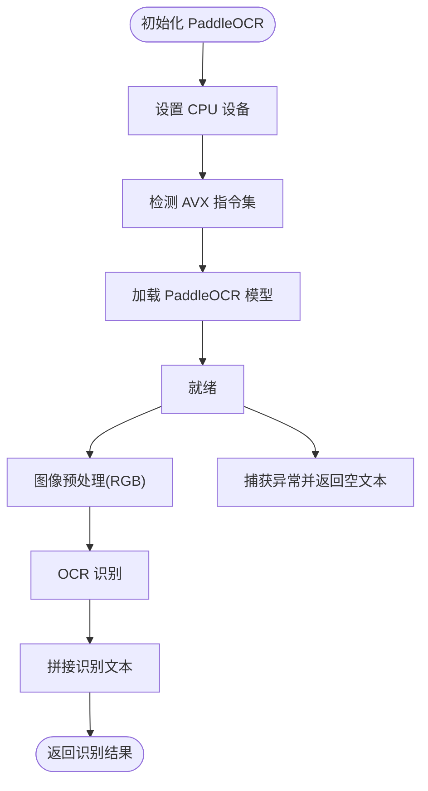
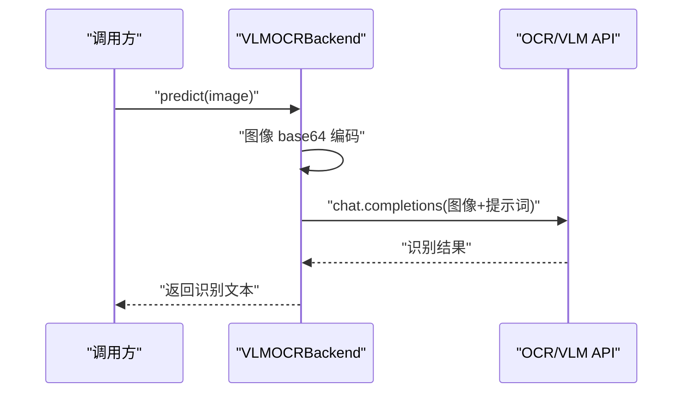
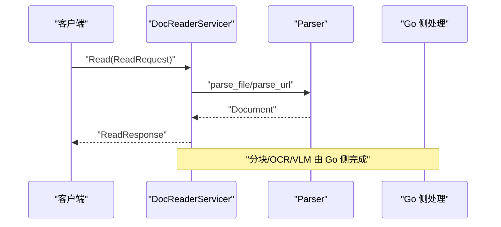
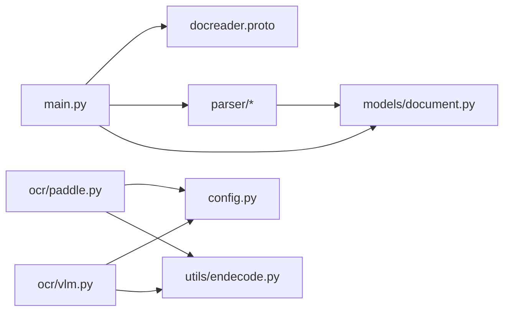

# 图像文档解析器

<cite>
**本文引用的文件**
- [docreader/README.md](file://docreader/README.md)
- [docreader/main.py](file://docreader/main.py)
- [docreader/config.py](file://docreader/config.py)
- [docreader/proto/docreader.proto](file://docreader/proto/docreader.proto)
- [docreader/models/document.py](file://docreader/models/document.py)
- [docreader/models/read_config.py](file://docreader/models/read_config.py)
- [docreader/parser/base_parser.py](file://docreader/parser/base_parser.py)
- [docreader/parser/image_parser.py](file://docreader/parser/image_parser.py)
- [docreader/parser/chain_parser.py](file://docreader/parser/chain_parser.py)
- [docreader/ocr/paddle.py](file://docreader/ocr/paddle.py)
- [docreader/ocr/vlm.py](file://docreader/ocr/vlm.py)
</cite>

## 目录
1. [简介](#简介)
2. [项目结构](#项目结构)
3. [核心组件](#核心组件)
4. [架构总览](#架构总览)
5. [详细组件分析](#详细组件分析)
6. [依赖分析](#依赖分析)
7. [性能考虑](#性能考虑)
8. [故障排查指南](#故障排查指南)
9. [结论](#结论)
10. [附录](#附录)

## 简介
本文件为 WeKnora 图像文档解析器的技术文档，聚焦于图像解析器的实现原理、OCR 技术与视觉语言模型（VLM）的应用。文档解释图像预处理、文字识别与内容提取算法，阐述多语言 OCR 支持、图像质量优化与识别精度提升策略，并覆盖复杂图像格式处理、表格识别与文档版式分析技术。同时提供图像解析配置项、性能优化参数与识别准确率调优方法，面向开发者给出集成与性能优化指导。

## 项目结构
WeKnora 的图像文档解析能力由 Python 侧 DocReader 服务提供，采用 gRPC 对外暴露统一接口；解析链路在 Python 层完成基础解析与图像引用生成，后续的分块、OCR、VLM 描述等由 Go 侧模块承接。核心目录与职责如下：
- docreader：Python 解析服务与协议定义
  - main.py：gRPC 服务入口与请求处理
  - config.py：环境变量驱动的配置加载
  - proto/docreader.proto：gRPC 协议定义
  - models/document.py：文档与分块数据模型
  - parser/*：解析器族（基础抽象、图像解析、链式解析）
  - ocr/*：OCR 后端（PaddleOCR、VLM）
- internal/docparser：Go 侧文档解析引擎与图像解析器（与 Python 服务协同）

图表来源
- [docreader/main.py:184-215](file://docreader/main.py#L184-L215)
- [docreader/config.py:66-97](file://docreader/config.py#L66-L97)
- [docreader/proto/docreader.proto:1-62](file://docreader/proto/docreader.proto#L1-L62)
- [docreader/models/document.py:62-88](file://docreader/models/document.py#L62-L88)
- [docreader/parser/base_parser.py:13-62](file://docreader/parser/base_parser.py#L13-L62)
- [docreader/ocr/paddle.py:16-176](file://docreader/ocr/paddle.py#L16-L176)
- [docreader/ocr/vlm.py:14-88](file://docreader/ocr/vlm.py#L14-L88)

章节来源
- [docreader/README.md:1-252](file://docreader/README.md#L1-L252)
- [docreader/main.py:184-215](file://docreader/main.py#L184-L215)
- [docreader/config.py:66-97](file://docreader/config.py#L66-L97)
- [docreader/proto/docreader.proto:1-62](file://docreader/proto/docreader.proto#L1-L62)
- [docreader/models/document.py:62-88](file://docreader/models/document.py#L62-L88)
- [docreader/parser/base_parser.py:13-62](file://docreader/parser/base_parser.py#L13-L62)
- [docreader/ocr/paddle.py:16-176](file://docreader/ocr/paddle.py#L16-L176)
- [docreader/ocr/vlm.py:14-88](file://docreader/ocr/vlm.py#L14-L88)

## 核心组件
- gRPC 服务与请求处理
  - DocReaderServicer.Read：统一处理“文件模式”和“URL 模式”，委托 Parser 执行解析，最终返回 Markdown 文本、图像引用与元数据。
  - ListEngines：列举可用解析引擎及其文件类型支持。
- 配置系统
  - DocReaderConfig：从环境变量加载 gRPC 并发、消息长度、端口、代理、临时输出目录等。
- 解析器基类与图像解析
  - BaseParser：定义解析接口，约束仅产出 Markdown 文本与图像引用，不执行分块、OCR、VLM。
  - ImageParser：对独立图像文件生成 Markdown 图片引用与内嵌 base64 图像数据，交由 Go 侧存储与处理。
- 链式解析器
  - FirstParser：按序尝试多个解析器，首个成功者即返回。
  - PipelineParser：串联多个解析器，累积图像与元数据。
- OCR 与 VLM
  - PaddleOCRBackend：基于 PaddleOCR 的本地 OCR 后端，支持 CPU 指令集兼容性检测与参数调优。
  - VLMOCRBackend：OpenAI 兼容接口的视觉语言模型 OCR，支持提示词定制与响应控制。

章节来源
- [docreader/main.py:98-182](file://docreader/main.py#L98-L182)
- [docreader/config.py:48-97](file://docreader/config.py#L48-L97)
- [docreader/parser/base_parser.py:13-62](file://docreader/parser/base_parser.py#L13-L62)
- [docreader/parser/image_parser.py:11-29](file://docreader/parser/image_parser.py#L11-L29)
- [docreader/parser/chain_parser.py:20-171](file://docreader/parser/chain_parser.py#L20-L171)
- [docreader/ocr/paddle.py:16-176](file://docreader/ocr/paddle.py#L16-L176)
- [docreader/ocr/vlm.py:14-88](file://docreader/ocr/vlm.py#L14-L88)

## 架构总览
下图展示从客户端到 Python DocReader 服务，再到 Go 侧处理的整体流程。Python 侧负责解析与图像引用生成，Go 侧负责分块、OCR、VLM 描述与存储。

图表来源
- [docreader/main.py:103-161](file://docreader/main.py#L103-L161)
- [docreader/parser/base_parser.py:45-62](file://docreader/parser/base_parser.py#L45-L62)
- [docreader/ocr/paddle.py:118-176](file://docreader/ocr/paddle.py#L118-L176)
- [docreader/ocr/vlm.py:41-88](file://docreader/ocr/vlm.py#L41-L88)

## 详细组件分析

### 组件一：图像解析器（ImageParser）
- 职责
  - 对独立图像文件生成 Markdown 图片引用与 base64 图像数据，交由 Go 侧存储与后续处理。
- 关键行为
  - 依据文件名推断扩展名，构造相对存储路径。
  - 将原始字节编码为 base64，作为 Document.images 的值。
- 输出
  - Document.content：Markdown 图片引用字符串。
  - Document.images：相对路径到 base64 的映射。

图表来源
- [docreader/parser/image_parser.py:19-28](file://docreader/parser/image_parser.py#L19-L28)

章节来源
- [docreader/parser/image_parser.py:11-29](file://docreader/parser/image_parser.py#L11-L29)

### 组件二：解析器基类与链式解析（BaseParser、FirstParser、PipelineParser）
- BaseParser
  - 规定解析接口，强调仅产出文本与图像引用，不进行分块、OCR、VLM。
- FirstParser
  - 顺序尝试多个解析器，首个成功者即返回有效 Document。
- PipelineParser
  - 串联多个解析器，将前一解析器输出作为下一解析器输入，累积所有图像与元数据。

图表来源
- [docreader/parser/base_parser.py:13-62](file://docreader/parser/base_parser.py#L13-L62)
- [docreader/parser/chain_parser.py:20-171](file://docreader/parser/chain_parser.py#L20-L171)

章节来源
- [docreader/parser/base_parser.py:13-62](file://docreader/parser/base_parser.py#L13-L62)
- [docreader/parser/chain_parser.py:20-171](file://docreader/parser/chain_parser.py#L20-L171)

### 组件三：OCR 后端（PaddleOCRBackend）
- 初始化策略
  - 强制使用 CPU，禁用 GPU。
  - 检测 CPU 是否支持 AVX 指令集，不支持则切换兼容模式。
  - 加载 PaddleOCR 模型，启用文档方向分类与文本行方向检测。
- 预处理与识别
  - 确保输入为 RGB 图像。
  - 调用 OCR 模型识别，拼接非空行文本作为结果。
- 错误处理
  - 导入失败、OS 错误（非法指令等）、通用异常均记录错误并返回空文本。

图表来源
- [docreader/ocr/paddle.py:19-176](file://docreader/ocr/paddle.py#L19-L176)

章节来源
- [docreader/ocr/paddle.py:16-176](file://docreader/ocr/paddle.py#L16-L176)

### 组件四：VLM OCR 后端（VLMOCRBackend）
- 初始化
  - 基于配置加载 OCR API 基础地址、模型名与密钥，设置温度与最大 token 数。
  - 准备中文提示词，要求输出 Markdown、表格用 HTML、公式用 LaTeX。
- 推理流程
  - 将图像编码为 base64，构造 OpenAI 兼容的消息结构。
  - 调用 chat.completions 接口，返回第一条回复内容。
- 错误处理
  - 客户端未初始化或调用异常时记录错误并返回空文本。

图表来源
- [docreader/ocr/vlm.py:41-88](file://docreader/ocr/vlm.py#L41-L88)

章节来源
- [docreader/ocr/vlm.py:14-88](file://docreader/ocr/vlm.py#L14-L88)

### 组件五：gRPC 服务与协议（DocReaderServicer、docreader.proto）
- 服务接口
  - Read：统一读取接口，支持文件内容或 URL。
  - ListEngines：列出可用解析引擎及支持的文件类型。
- 请求/响应
  - ReadRequest：文件名、类型、内容、URL、标题、请求 ID、解析配置。
  - ReadResponse：Markdown 内容、图像引用、图像目录路径、元数据、错误信息。
- 服务启动
  - 从配置加载并发与消息长度，绑定端口并启动。

图表来源
- [docreader/proto/docreader.proto:20-45](file://docreader/proto/docreader.proto#L20-L45)
- [docreader/main.py:103-161](file://docreader/main.py#L103-L161)

章节来源
- [docreader/proto/docreader.proto:1-62](file://docreader/proto/docreader.proto#L1-L62)
- [docreader/main.py:98-182](file://docreader/main.py#L98-L182)

## 依赖分析
- 组件耦合
  - DocReaderServicer 依赖 Parser 与配置；Parser 依赖 Document 模型；OCR/VLM 后端依赖配置与工具函数。
- 外部依赖
  - gRPC、PaddleOCR、OpenAI 兼容 API、Pillow、NumPy 等。
- 配置耦合
  - DocReaderConfig 通过环境变量影响并发、消息长度、端口、代理与临时输出目录；OCR/VLM 后端通过配置加载模型与密钥。

图表来源
- [docreader/main.py:184-215](file://docreader/main.py#L184-L215)
- [docreader/config.py:66-97](file://docreader/config.py#L66-L97)
- [docreader/parser/base_parser.py:13-62](file://docreader/parser/base_parser.py#L13-L62)
- [docreader/ocr/paddle.py:16-176](file://docreader/ocr/paddle.py#L16-L176)
- [docreader/ocr/vlm.py:14-88](file://docreader/ocr/vlm.py#L14-L88)

章节来源
- [docreader/main.py:184-215](file://docreader/main.py#L184-L215)
- [docreader/config.py:66-97](file://docreader/config.py#L66-L97)
- [docreader/parser/base_parser.py:13-62](file://docreader/parser/base_parser.py#L13-L62)
- [docreader/ocr/paddle.py:16-176](file://docreader/ocr/paddle.py#L16-L176)
- [docreader/ocr/vlm.py:14-88](file://docreader/ocr/vlm.py#L14-L88)

## 性能考虑
- 并发与消息长度
  - 通过环境变量设置 gRPC 最大工作线程数与最大消息长度，避免过大文件导致内存压力与超时。
- CPU 指令集兼容性（PaddleOCR）
  - 在不支持 AVX 的 CPU 上自动降级兼容模式，减少崩溃风险；必要时可切换至无 GPU 的纯 CPU 模式。
- 图像处理并发
  - 通过 IMAGE_MAX_CONCURRENT 控制图像处理并发度，平衡吞吐与资源占用。
- 代理与网络
  - 支持 HTTP/HTTPS 代理，便于在受限网络环境下访问外部 OCR/VLM 服务。
- 分块与存储
  - 文档分块与存储由 Go 侧完成，Python 侧仅负责解析与图像引用生成，降低单体复杂度。

章节来源
- [docreader/config.py:69-97](file://docreader/config.py#L69-L97)
- [docreader/README.md:75-149](file://docreader/README.md#L75-L149)
- [docreader/ocr/paddle.py:25-67](file://docreader/ocr/paddle.py#L25-L67)

## 故障排查指南
- DocReader 服务无法启动
  - 若出现 PaddleOCR 相关错误，可将 OCR_BACKEND 设置为 no_ocr 以禁用 OCR 功能进行验证。
- 图片无法显示
  - 检查 MINIO_PUBLIC_ENDPOINT 配置，确保使用可从浏览器访问的地址；跨设备访问时避免使用 localhost。
- 文件上传失败
  - 检查 MAX_FILE_SIZE_MB 配置，确保前后端一致；适当提高限制以适配大文件。
- OCR/VLM 调用异常
  - 确认 OCR_API_BASE_URL、OCR_API_KEY、OCR_MODEL 与 VLM 相关配置正确；检查网络代理设置。
- 日志与健康检查
  - 查看服务日志定位异常；使用健康检查探针确认服务可用性。

章节来源
- [docreader/README.md:205-244](file://docreader/README.md#L205-L244)
- [docreader/main.py:162-166](file://docreader/main.py#L162-L166)

## 结论
WeKnora 图像文档解析器通过清晰的职责划分与可插拔的解析链路，实现了从图像到结构化内容的高效转换。Python 侧专注解析与图像引用生成，Go 侧承接分块、OCR 与 VLM 描述，二者配合达成高吞吐与高精度的文档理解目标。通过完善的配置体系与错误处理机制，开发者可在不同硬件与网络环境下灵活部署与优化。

## 附录
- 配置项一览（环境变量）
  - gRPC：DOCREADER_GRPC_MAX_WORKERS、DOCREADER_GRPC_MAX_FILE_SIZE_MB、DOCREADER_GRPC_PORT
  - OCR：OCR_BACKEND、OCR_API_BASE_URL、OCR_API_KEY、OCR_MODEL
  - VLM：VLM_MODEL_BASE_URL、VLM_MODEL_NAME、VLM_MODEL_API_KEY、VLM_INTERFACE_TYPE
  - 存储：STORAGE_TYPE、MinIO/COS/OSS 相关密钥与桶配置
  - 代理：EXTERNAL_HTTP_PROXY、EXTERNAL_HTTPS_PROXY
  - 图像处理：IMAGE_MAX_CONCURRENT
  - 其他：LOG_LEVEL、IMAGE_OUTPUT_DIR 等

章节来源
- [docreader/README.md:71-149](file://docreader/README.md#L71-L149)
- [docreader/config.py:66-97](file://docreader/config.py#L66-L97)