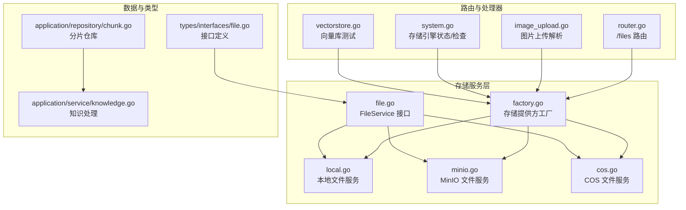
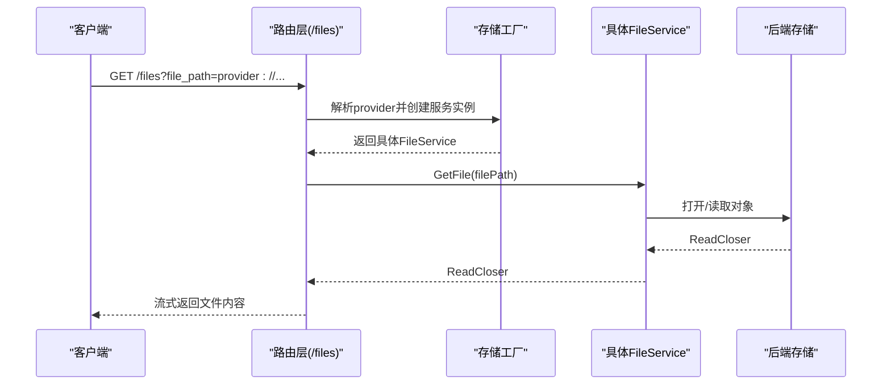
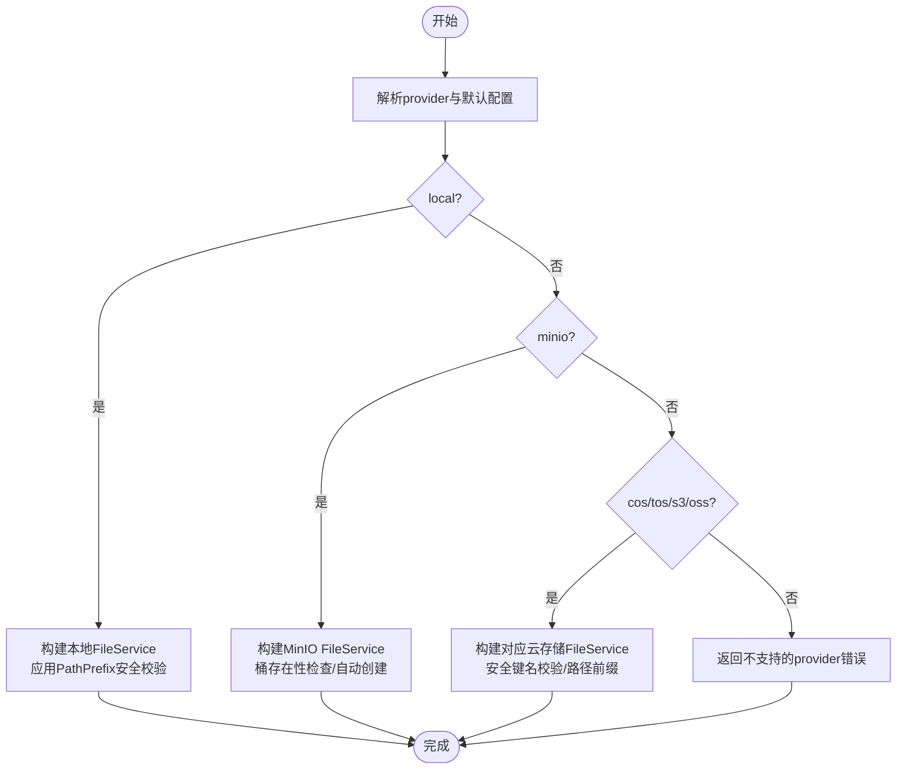
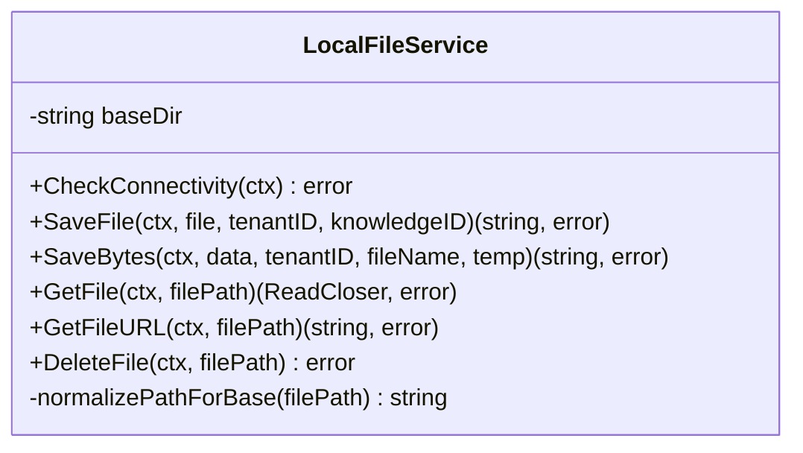
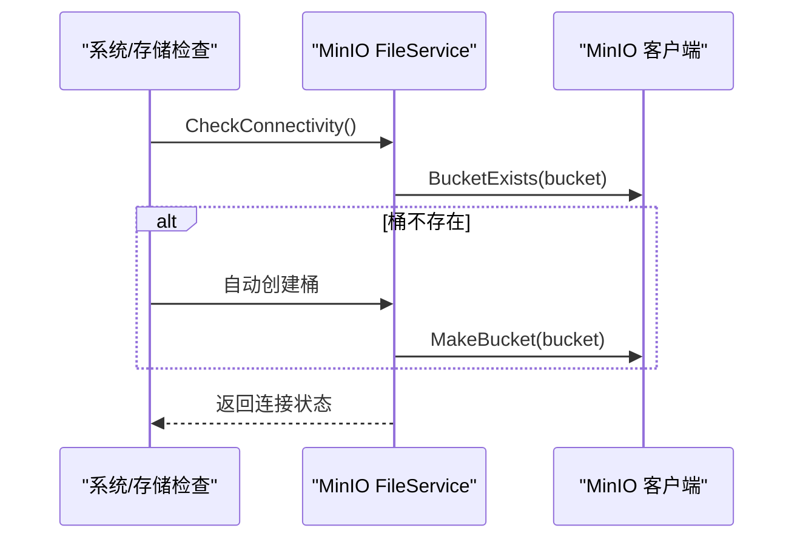
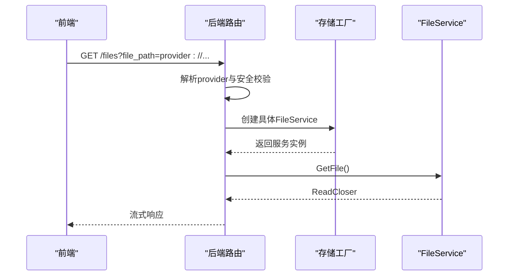
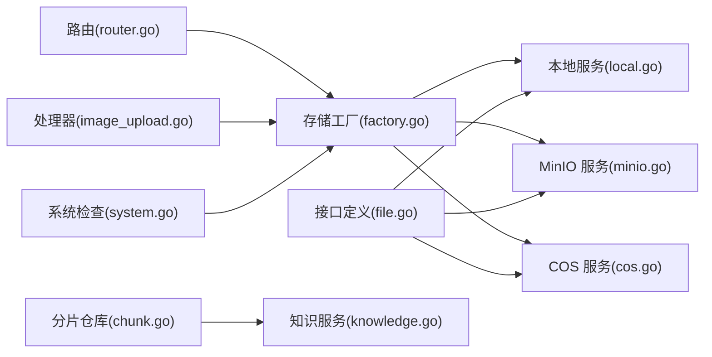

# 存储解析器

<cite>
**本文档引用的文件**
- [factory.go](file://internal/application/service/file/factory.go)
- [local.go](file://internal/application/service/file/local.go)
- [minio.go](file://internal/application/service/file/minio.go)
- [cos.go](file://internal/application/service/file/cos.go)
- [file.go](file://internal/types/interfaces/file.go)
- [router.go](file://internal/router/router.go)
- [image_upload.go](file://internal/handler/session/image_upload.go)
- [system.go](file://internal/handler/system.go)
- [chunk.go](file://internal/application/repository/chunk.go)
- [knowledge.go](file://internal/application/service/knowledge.go)
- [vectorstore.go](file://internal/handler/vectorstore.go)
- [vectorstore_service.go](file://internal/application/service/vectorstore.go)
- [vectorstore_repo.go](file://internal/application/repository/vectorstore.go)
- [metric_hook.go](file://internal/application/service/metric_hook.go)
- [ndcg.go](file://internal/application/service/metric/ndcg.go)
- [security.ts](file://frontend/src/utils/security.ts)
- [storage.py](file://docreader/parser/storage.py)
</cite>

## 目录
1. [简介](#简介)
2. [项目结构](#项目结构)
3. [核心组件](#核心组件)
4. [架构总览](#架构总览)
5. [详细组件分析](#详细组件分析)
6. [依赖关系分析](#依赖关系分析)
7. [性能考虑](#性能考虑)
8. [故障排查指南](#故障排查指南)
9. [结论](#结论)
10. [附录](#附录)

## 简介
本文件为 WeKnora 存储解析器的技术文档，聚焦于文件存储子系统的实现原理、文件系统操作与数据存储策略，涵盖以下主题：
- 存储提供方抽象与工厂模式：统一接入本地、MinIO、COS、TOS、S3、OSS 等多种后端
- 文件读写机制：上传、下载、删除、URL 生成与路径规范化
- 缓存与访问控制：前端受保护资源访问、预签名 URL、路径安全校验
- 分布式存储支持：对象存储的桶/区域/前缀配置、自动桶创建能力
- 数据一致性与并发控制：租户隔离、序列化存储、分页检索
- 性能监控与评估：检索指标钩子与计算
- 配置管理与运维：环境变量、租户配置、健康检查与自动修复

## 项目结构
存储解析器位于 Go 后端的 internal/application/service/file 目录，配合路由层、处理器层与类型定义共同构成完整的存储能力。

**图表来源**
- [factory.go:1-132](file://internal/application/service/file/factory.go#L1-L132)
- [local.go:1-230](file://internal/application/service/file/local.go#L1-L230)
- [minio.go:42-200](file://internal/application/service/file/minio.go#L42-L200)
- [cos.go:112-151](file://internal/application/service/file/cos.go#L112-L151)
- [file.go:1-27](file://internal/types/interfaces/file.go#L1-L27)
- [router.go:724-757](file://internal/router/router.go#L724-L757)
- [image_upload.go:143-160](file://internal/handler/session/image_upload.go#L143-L160)
- [system.go:373-482](file://internal/handler/system.go#L373-L482)
- [vectorstore.go:397-455](file://internal/handler/vectorstore.go#L397-L455)
- [chunk.go:133-145](file://internal/application/repository/chunk.go#L133-L145)
- [knowledge.go:2014-2048](file://internal/application/service/knowledge.go#L2014-L2048)

**章节来源**
- [factory.go:1-132](file://internal/application/service/file/factory.go#L1-L132)
- [router.go:724-757](file://internal/router/router.go#L724-L757)

## 核心组件
- 存储提供方工厂：根据 provider 或租户配置动态选择具体存储实现，并进行参数校验与路径安全处理
- FileService 接口：统一的文件操作契约，包括连接性检查、保存、读取、删除、URL 获取
- 具体实现：
  - 本地文件系统：目录结构按租户/知识库组织，支持相对路径与绝对路径兼容
  - MinIO：桶存在性检查与自动创建、预签名下载 URL
  - 对象存储（COS/TOS/S3/OSS）：基于租户配置或环境变量，支持路径前缀与安全键名校验

**章节来源**
- [file.go:9-26](file://internal/types/interfaces/file.go#L9-L26)
- [factory.go:14-132](file://internal/application/service/file/factory.go#L14-L132)
- [local.go:18-230](file://internal/application/service/file/local.go#L18-L230)
- [minio.go:63-200](file://internal/application/service/file/minio.go#L63-L200)
- [cos.go:112-151](file://internal/application/service/file/cos.go#L112-L151)

## 架构总览
存储解析器通过工厂模式解耦上层业务与底层存储实现，结合路由层对受保护资源进行鉴权与转发，确保多租户隔离与路径安全。

**图表来源**
- [router.go:743-757](file://internal/router/router.go#L743-L757)
- [factory.go:17-132](file://internal/application/service/file/factory.go#L17-L132)
- [local.go:107-125](file://internal/application/service/file/local.go#L107-L125)

## 详细组件分析

### 工厂模式与存储提供方选择
- 支持 provider 参数或租户默认配置，默认回退到 sec.DefaultProvider
- 本地存储：可配置 PathPrefix，使用安全路径校验避免路径穿越
- MinIO：支持远程模式（租户配置）与 Docker/默认模式（环境变量），自动创建桶
- 对象存储：COS/TOS/S3/OSS 均支持路径前缀与安全键名校验

**图表来源**
- [factory.go:17-132](file://internal/application/service/file/factory.go#L17-L132)

**章节来源**
- [factory.go:14-132](file://internal/application/service/file/factory.go#L14-L132)

### 本地文件系统存储
- 目录结构：baseDir/{tenantID}/{knowledgeID}/ 或 exports/
- 路径安全：统一通过安全路径校验函数限制在 baseDir 下
- 文件命名：上传采用时间戳+扩展名，导出采用安全文件名+时间戳
- URL 生成：返回 provider:// 格式路径，便于前端统一处理

**图表来源**
- [local.go:18-230](file://internal/application/service/file/local.go#L18-L230)

**章节来源**
- [local.go:25-230](file://internal/application/service/file/local.go#L25-L230)

### MinIO 对象存储
- 连接性检查：可选桶存在性验证；无写入权限，仅只读探测
- 自动桶创建：在连接性检查阶段若桶不存在且允许则自动创建
- 预签名 URL：GetFileURL 生成 24 小时有效期下载链接
- 路径解析：从 provider:// 格式提取桶与对象键，执行安全键名校验

**图表来源**
- [minio.go:63-91](file://internal/application/service/file/minio.go#L63-L91)
- [system.go:657-676](file://internal/handler/system.go#L657-L676)

**章节来源**
- [minio.go:63-200](file://internal/application/service/file/minio.go#L63-L200)
- [system.go:373-482](file://internal/handler/system.go#L373-L482)

### 对象存储（COS/TOS/S3/OSS）
- 配置来源：优先租户配置，其次环境变量
- 路径前缀：可配置，用于多租户隔离与命名空间管理
- 安全校验：对象键/桶名格式校验，防止注入与越权访问
- 文档解析器 Python 实现：同样遵循相同配置与校验逻辑

**章节来源**
- [factory.go:76-126](file://internal/application/service/file/factory.go#L76-L126)
- [cos.go:112-151](file://internal/application/service/file/cos.go#L112-L151)
- [storage.py:52-82](file://docreader/parser/storage.py#L52-L82)

### 路由与受保护资源访问
- /files 路由：接收 file_path 查询参数，解析 provider 类型并委派给对应 FileService
- 租户上下文：从认证中间件注入，确保按租户隔离访问
- 前端安全：受保护图片资源通过统一代理接口，支持缓存与鉴权头传递

**图表来源**
- [router.go:743-757](file://internal/router/router.go#L743-L757)
- [security.ts:302-345](file://frontend/src/utils/security.ts#L302-L345)

**章节来源**
- [router.go:724-757](file://internal/router/router.go#L724-L757)
- [security.ts:302-345](file://frontend/src/utils/security.ts#L302-L345)

### 图片上传与存储提供方解析
- 处理 data URI 图片上传，解析 MIME 并转换为二进制
- 根据请求指定的 storageProvider 或租户配置解析 FileService
- 回退策略：解析失败时回退到默认 FileService

**章节来源**
- [image_upload.go:112-160](file://internal/handler/session/image_upload.go#L112-L160)

### 向量库存储与连接测试
- 向量库测试：支持原始凭据测试与持久化存储测试，返回检测到的服务器版本
- 版本更新：若检测到新版本，自动更新存储配置中的版本字段
- 存储引擎状态：系统级接口展示各存储引擎可用性与描述

**章节来源**
- [vectorstore.go:397-455](file://internal/handler/vectorstore.go#L397-L455)
- [vectorstore_service.go:103-139](file://internal/application/service/vectorstore.go#L103-L139)
- [system.go:467-482](file://internal/handler/system.go#L467-L482)

### 分片与知识处理中的存储交互
- 分片列表与分页：按知识 ID 查询分片，支持文本类型过滤与排序
- 知识处理：在知识导入/更新过程中维护分片顺序与父子关系，确保检索一致性

**章节来源**
- [chunk.go:133-145](file://internal/application/repository/chunk.go#L133-L145)
- [knowledge.go:2014-2048](file://internal/application/service/knowledge.go#L2014-L2048)

## 依赖关系分析
存储解析器与周边模块的耦合关系如下：

**图表来源**
- [factory.go:1-132](file://internal/application/service/file/factory.go#L1-L132)
- [local.go:1-230](file://internal/application/service/file/local.go#L1-L230)
- [minio.go:42-200](file://internal/application/service/file/minio.go#L42-L200)
- [cos.go:112-151](file://internal/application/service/file/cos.go#L112-L151)
- [router.go:724-757](file://internal/router/router.go#L724-L757)
- [image_upload.go:143-160](file://internal/handler/session/image_upload.go#L143-L160)
- [system.go:373-482](file://internal/handler/system.go#L373-L482)
- [file.go:1-27](file://internal/types/interfaces/file.go#L1-L27)
- [chunk.go:133-145](file://internal/application/repository/chunk.go#L133-L145)
- [knowledge.go:2014-2048](file://internal/application/service/knowledge.go#L2014-L2048)

**章节来源**
- [file.go:9-26](file://internal/types/interfaces/file.go#L9-L26)
- [router.go:724-757](file://internal/router/router.go#L724-L757)

## 性能考虑
- 本地存储
  - 目录层级浅、I/O 路径短，适合小规模单机部署
  - 建议合理设置 baseDir 与 PathPrefix，避免过多子目录导致的 inode 压力
- 对象存储
  - 利用桶/前缀实现多租户隔离，减少跨租户扫描
  - MinIO 预签名 URL 提供高效下载，避免服务端中转放大带宽
- 并发与一致性
  - 分片查询使用分页与索引字段，降低大文档检索延迟
  - 知识处理中维护 chunk_index 与父子关系，保证检索结果顺序与语义连贯
- 指标与监控
  - 提供检索指标钩子（Precision、Recall、NDCG、MRR、MAP 等），支持批量评估与平均值统计

**章节来源**
- [minio.go:189-200](file://internal/application/service/file/minio.go#L189-L200)
- [chunk.go:147-153](file://internal/application/repository/chunk.go#L147-L153)
- [metric_hook.go:18-82](file://internal/application/service/metric_hook.go#L18-L82)
- [ndcg.go:1-55](file://internal/application/service/metric/ndcg.go#L1-L55)

## 故障排查指南
- 存储引擎状态检查
  - 通过系统接口查看各引擎可用性与描述，定位配置问题
  - MinIO：若提示桶不存在，系统会尝试自动创建，需确认凭据与网络可达性
- 路由访问错误
  - /files 路由要求 file_path 参数，且路径中不得包含路径穿越片段
  - 前端受保护资源需通过统一代理接口访问，确保鉴权头正确传递
- 文件操作异常
  - 本地存储：确认 baseDir 可写、路径安全校验未被触发
  - 对象存储：核对桶名、区域、密钥与前缀配置，确保对象键安全校验通过
- 向量库连接测试
  - 使用原始凭据测试快速验证连通性，成功后可更新持久化配置中的版本信息

**章节来源**
- [system.go:467-482](file://internal/handler/system.go#L467-L482)
- [router.go:743-757](file://internal/router/router.go#L743-L757)
- [security.ts:302-345](file://frontend/src/utils/security.ts#L302-L345)
- [vectorstore.go:432-455](file://internal/handler/vectorstore.go#L432-L455)

## 结论
WeKnora 存储解析器以工厂模式为核心，统一抽象多种存储后端，结合路由层的安全访问与前端的受保护资源代理，实现了多租户隔离、路径安全与高效访问。通过对象存储的自动桶创建、预签名 URL 与指标监控体系，系统在可扩展性、安全性与可观测性方面具备良好表现。建议在生产环境中优先采用对象存储方案，并结合分片与向量库的索引策略进行容量与性能规划。

## 附录

### 存储配置选项与最佳实践
- 本地存储
  - LOCAL_STORAGE_BASE_DIR：本地根目录，默认 /data/files
  - PathPrefix：可选，用于在 baseDir 下进一步隔离
- MinIO
  - 模式：remote（租户配置）或 docker/default（环境变量）
  - MINIO_ENDPOINT/MINIO_ACCESS_KEY_ID/MINIO_SECRET_ACCESS_KEY：环境变量
  - 自动创建桶：连接性检查阶段按需创建
- 对象存储（COS/TOS/S3/OSS）
  - 租户配置优先，其次环境变量
  - 区域/桶名/密钥/前缀均需符合安全校验规则
- 前端受保护资源
  - 统一通过 /files 代理访问，支持本地与远端 provider:// 路径

**章节来源**
- [factory.go:30-132](file://internal/application/service/file/factory.go#L30-L132)
- [system.go:373-482](file://internal/handler/system.go#L373-L482)
- [router.go:724-757](file://internal/router/router.go#L724-L757)
- [security.ts:302-345](file://frontend/src/utils/security.ts#L302-L345)