# 文档解析器实现

<cite>
**本文档引用的文件**
- [docreader/parser/__init__.py](file://docreader/parser/__init__.py)
- [docreader/parser/base_parser.py](file://docreader/parser/base_parser.py)
- [docreader/parser/registry.py](file://docreader/parser/registry.py)
- [docreader/parser/parser.py](file://docreader/parser/parser.py)
- [docreader/parser/pdf_parser.py](file://docreader/parser/pdf_parser.py)
- [docreader/parser/docx_parser.py](file://docreader/parser/docx_parser.py)
- [docreader/parser/markdown_parser.py](file://docreader/parser/markdown_parser.py)
- [docreader/parser/excel_parser.py](file://docreader/parser/excel_parser.py)
- [docreader/parser/image_parser.py](file://docreader/parser/image_parser.py)
- [docreader/parser/web_parser.py](file://docreader/parser/web_parser.py)
- [docreader/parser/chain_parser.py](file://docreader/parser/chain_parser.py)
- [docreader/parser/markitdown_parser.py](file://docreader/parser/markitdown_parser.py)
- [docreader/models/document.py](file://docreader/models/document.py)
- [docreader/main.py](file://docreader/main.py)
</cite>

## 目录
1. [简介](#简介)
2. [项目结构](#项目结构)
3. [核心组件](#核心组件)
4. [架构总览](#架构总览)
5. [详细组件分析](#详细组件分析)
6. [依赖关系分析](#依赖关系分析)
7. [性能考虑](#性能考虑)
8. [故障排除指南](#故障排除指南)
9. [结论](#结论)
10. [附录](#附录)

## 简介
本文件为 WeKnora 文档解析器实现的技术文档，聚焦于解析器注册机制、多格式文档支持与解析流程设计。文档详细解释了基础解析器接口、具体解析器实现以及解析器工厂模式，并对 PDF、Word、Excel、Markdown 等解析器进行深入分析。同时提供解析器扩展指南、自定义解析器开发步骤、性能优化策略、解析质量评估方法、错误处理与故障排除建议，帮助开发者完成解析器的开发与集成。

## 项目结构
docreader 子模块负责文档解析与内容抽取，采用“Python 解析 + Go 应用”的协作架构：Python 负责解析与预处理，Go 负责后续的分块、存储、OCR/VLM 等处理。解析器通过注册表统一管理，支持多种引擎（如内置引擎、MarkItDown 引擎），并提供链式与优先级选择两种组合模式。

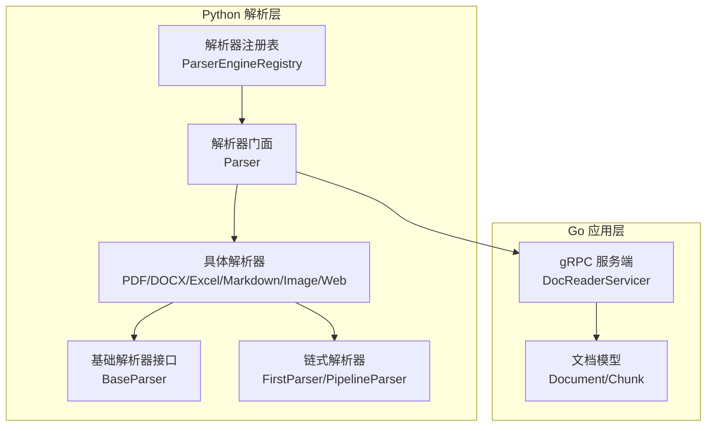

**图表来源**
- [docreader/parser/registry.py:18-161](file://docreader/parser/registry.py#L18-L161)
- [docreader/parser/parser.py:11-83](file://docreader/parser/parser.py#L11-L83)
- [docreader/parser/base_parser.py:13-62](file://docreader/parser/base_parser.py#L13-L62)
- [docreader/parser/chain_parser.py:20-171](file://docreader/parser/chain_parser.py#L20-L171)
- [docreader/main.py:98-215](file://docreader/main.py#L98-L215)

**章节来源**
- [docreader/parser/__init__.py:1-39](file://docreader/parser/__init__.py#L1-L39)
- [docreader/parser/registry.py:112-161](file://docreader/parser/registry.py#L112-L161)
- [docreader/parser/parser.py:11-83](file://docreader/parser/parser.py#L11-L83)
- [docreader/main.py:98-215](file://docreader/main.py#L98-L215)

## 核心组件
- 基础解析器接口 BaseParser：定义统一的解析契约，仅负责提取 Markdown 文本与原始图片引用，不包含分块、OCR、VLM 等逻辑。
- 解析器注册表 ParserEngineRegistry：集中管理引擎与文件类型映射，支持引擎可用性检查与回退到内置引擎。
- 解析器门面 Parser：对外提供统一入口，根据引擎名与文件类型选择具体解析器实例。
- 链式解析器 FirstParser/PipelineParser：实现“先成功者优先”或“顺序流水线”两种组合策略。
- 具体解析器：PDF、DOCX、Excel、Markdown、Image、Web 等，覆盖常见文档格式。
- 文档模型 Document/Chunk：承载解析结果（文本、图片引用、分块、元数据）。

**章节来源**
- [docreader/parser/base_parser.py:13-62](file://docreader/parser/base_parser.py#L13-L62)
- [docreader/parser/registry.py:18-161](file://docreader/parser/registry.py#L18-L161)
- [docreader/parser/parser.py:11-83](file://docreader/parser/parser.py#L11-L83)
- [docreader/parser/chain_parser.py:20-171](file://docreader/parser/chain_parser.py#L20-L171)
- [docreader/models/document.py:62-88](file://docreader/models/document.py#L62-L88)

## 架构总览
解析器体系采用“注册表 + 门面 + 链式组合”的分层设计。客户端通过 gRPC 请求触发解析，Go 侧根据请求参数选择解析引擎与覆盖配置，Python 侧按文件类型路由到对应解析器，最终返回统一的 Document 结构。

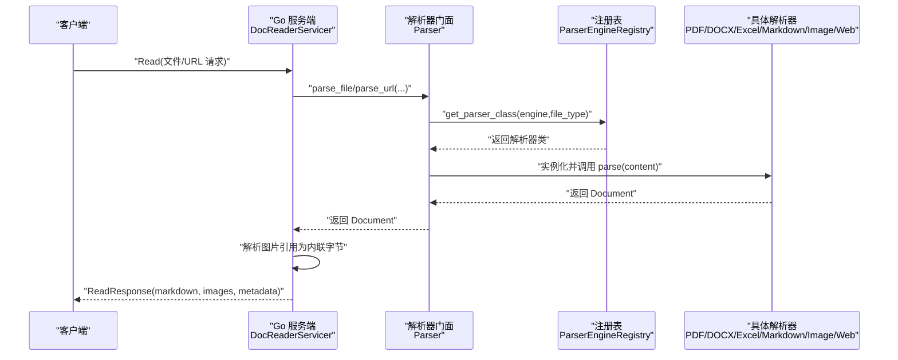

**图表来源**
- [docreader/main.py:103-167](file://docreader/main.py#L103-L167)
- [docreader/parser/parser.py:25-83](file://docreader/parser/parser.py#L25-L83)
- [docreader/parser/registry.py:51-76](file://docreader/parser/registry.py#L51-L76)

**章节来源**
- [docreader/main.py:98-215](file://docreader/main.py#L98-L215)
- [docreader/parser/parser.py:11-83](file://docreader/parser/parser.py#L11-L83)
- [docreader/parser/registry.py:18-161](file://docreader/parser/registry.py#L18-L161)

## 详细组件分析

### 基础解析器接口与门面
- BaseParser：定义 parse_into_text 抽象方法；parse 方法记录日志并委托给 parse_into_text。
- Parser 门面：封装引擎选择与实例化，支持文件与 URL 两种入口；记录解析耗时与结果长度。

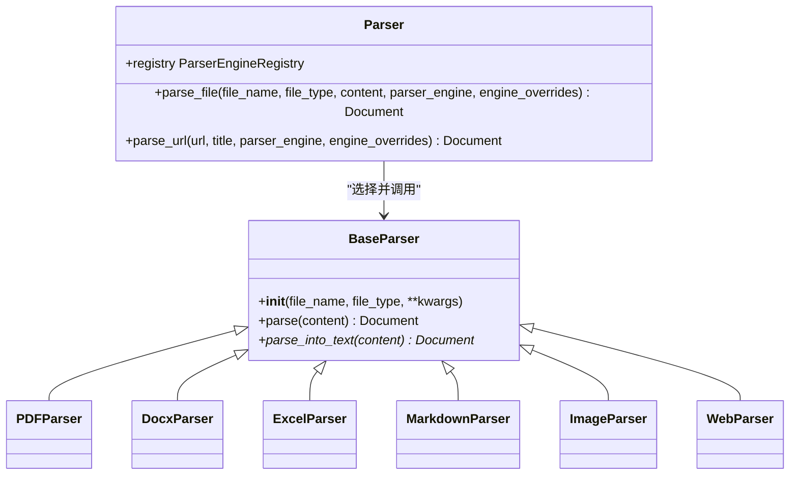

**图表来源**
- [docreader/parser/base_parser.py:13-62](file://docreader/parser/base_parser.py#L13-L62)
- [docreader/parser/parser.py:11-83](file://docreader/parser/parser.py#L11-L83)

**章节来源**
- [docreader/parser/base_parser.py:13-62](file://docreader/parser/base_parser.py#L13-L62)
- [docreader/parser/parser.py:11-83](file://docreader/parser/parser.py#L11-L83)

### 解析器注册机制
- 注册表 ParserEngineRegistry：维护引擎名到文件类型到解析器类的映射；支持引擎可用性检查与提示信息；当指定引擎不支持某类型时自动回退到内置引擎。
- 默认注册：内置引擎包含 docx、doc、pdf、md/markdown、xlsx/xls、多种图片格式；MarkItDown 引擎覆盖 md、pdf、docx、doc、pptx、ppt、xlsx、xls、csv 等。
- 列表查询：list_engines 返回各引擎的可用状态与原因，供前端或调用方展示。

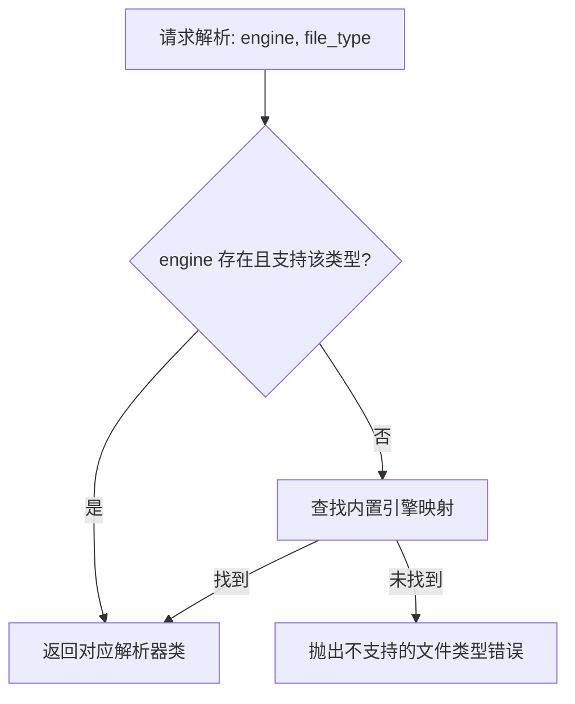

**图表来源**
- [docreader/parser/registry.py:51-76](file://docreader/parser/registry.py#L51-L76)

**章节来源**
- [docreader/parser/registry.py:18-161](file://docreader/parser/registry.py#L18-L161)

### 链式与优先级解析器
- FirstParser：按顺序尝试多个解析器，首个成功产出有效 Document 的解析器获胜；适合容错场景（如扫描版 PDF 的备用路径）。
- PipelineParser：将前一解析器输出作为下一解析器输入，串联处理；适合需要多阶段处理（如网页抓取后 Markdown 规范化）。
- 工厂方法 create：动态生成子类，便于按需组合不同解析器。

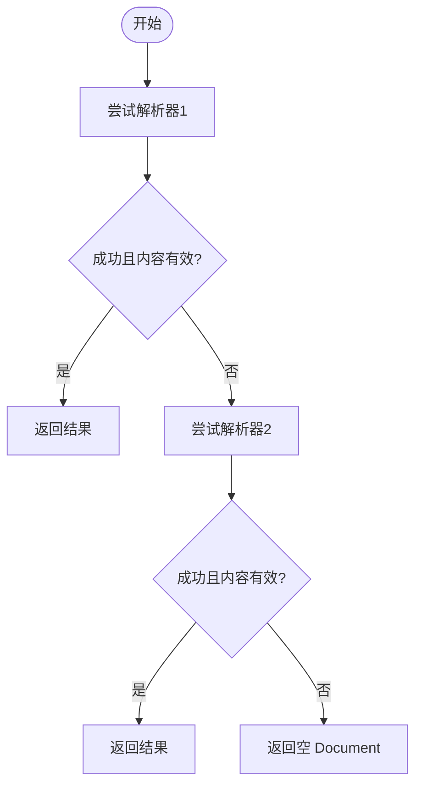

**图表来源**
- [docreader/parser/chain_parser.py:48-73](file://docreader/parser/chain_parser.py#L48-L73)

**章节来源**
- [docreader/parser/chain_parser.py:20-171](file://docreader/parser/chain_parser.py#L20-L171)

### PDF 解析器
- PDFParser：采用 FirstParser 链，依次尝试 MarkItDown 解析器与扫描版 PDF 图像提取器；若 MarkItDown 无法提取文本，则转为将每页转换为 PNG 图片，交由 Go 侧执行 OCR。
- PDFScannedParser：使用 pdfplumber 将 PDF 页面渲染为图像，生成 Markdown 图片引用与 base64 图像数据，附带页面计数等元数据。

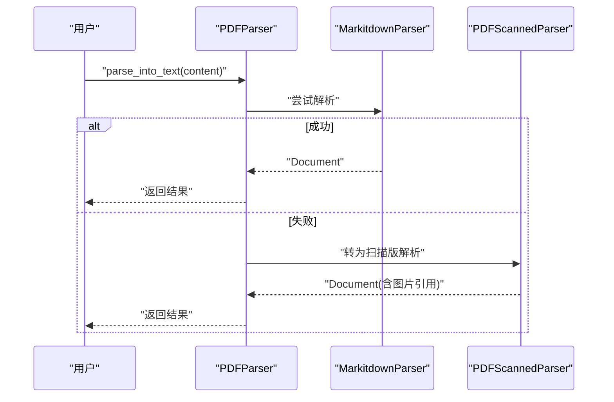

**图表来源**
- [docreader/parser/pdf_parser.py:57-69](file://docreader/parser/pdf_parser.py#L57-L69)
- [docreader/parser/pdf_parser.py:13-56](file://docreader/parser/pdf_parser.py#L13-L56)

**章节来源**
- [docreader/parser/pdf_parser.py:1-69](file://docreader/parser/pdf_parser.py#L1-L69)

### Word 解析器（DOC/DOCX）
- DocxParser：基于 python-docx 与并发处理，支持大文档分页并行解析；可选简化回退路径；提取段落文本与表格内容，合并为统一文本；支持图片提取与 base64 编码。
- Docx：内部处理器，负责页面识别、并行任务调度、图片缓存与上传回调；根据文档大小与图片数量动态调整工作进程数。

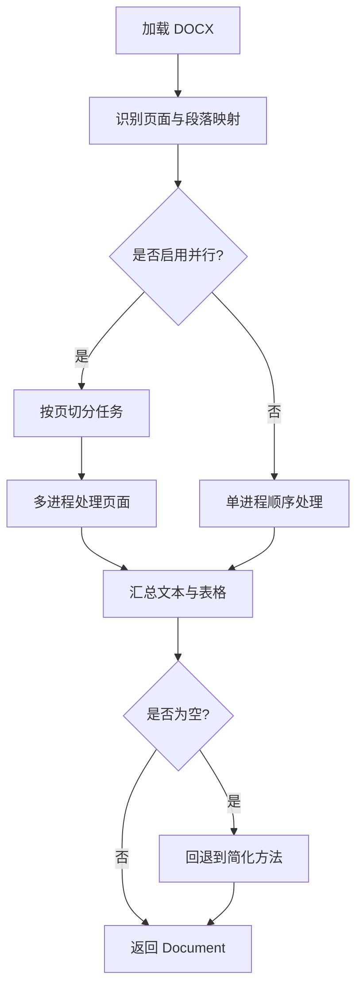

**图表来源**
- [docreader/parser/docx_parser.py:476-542](file://docreader/parser/docx_parser.py#L476-L542)
- [docreader/parser/docx_parser.py:692-711](file://docreader/parser/docx_parser.py#L692-L711)

**章节来源**
- [docreader/parser/docx_parser.py:75-290](file://docreader/parser/docx_parser.py#L75-L290)

### Excel 解析器
- ExcelParser：使用 pandas 读取所有工作表，过滤空行，将非空单元格拼接为“列: 值”格式；每个有效行形成独立 Chunk，保留起止位置与序列号；最终合并为 Document。

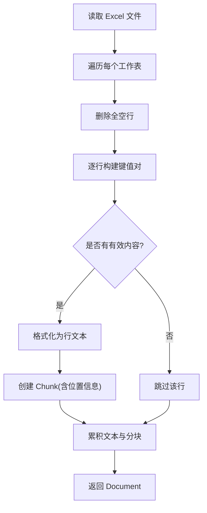

**图表来源**
- [docreader/parser/excel_parser.py:43-98](file://docreader/parser/excel_parser.py#L43-L98)

**章节来源**
- [docreader/parser/excel_parser.py:20-120](file://docreader/parser/excel_parser.py#L20-L120)

### Markdown 解析器
- MarkdownParser：采用 Pipeline，先标准化表格格式，再提取并转换 Markdown 中的 base64 图片为文件路径引用，同时保留原始图片数据以便 Go 侧存储。
- MarkdownTableFormatter：统一表格对齐与间距。
- MarkdownImageBase64：提取 base64 图片并生成唯一文件名，替换为相对路径引用，图片数据以 base64 形式放入 Document.images。

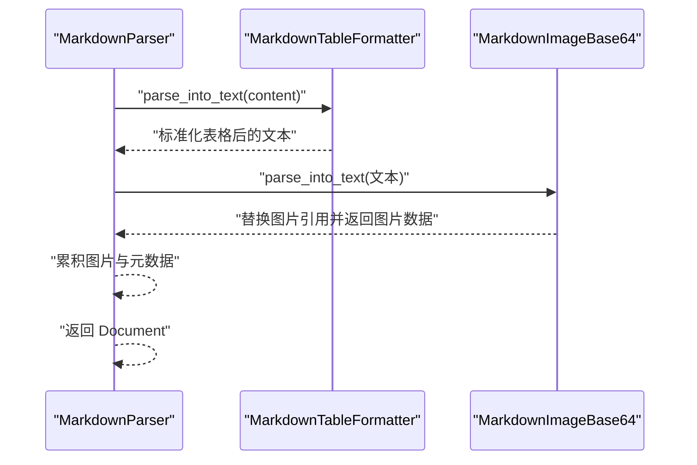

**图表来源**
- [docreader/parser/markdown_parser.py:376-388](file://docreader/parser/markdown_parser.py#L376-L388)

**章节来源**
- [docreader/parser/markdown_parser.py:127-161](file://docreader/parser/markdown_parser.py#L127-L161)
- [docreader/parser/markdown_parser.py:352-374](file://docreader/parser/markdown_parser.py#L352-L374)
- [docreader/parser/markdown_parser.py:376-388](file://docreader/parser/markdown_parser.py#L376-L388)

### 图像解析器
- ImageParser：将单个图像文件包装为 Markdown 图片引用，并将原始字节以 base64 形式存入 Document.images，等待 Go 侧存储。

**章节来源**
- [docreader/parser/image_parser.py:11-29](file://docreader/parser/image_parser.py#L11-L29)

### Web 解析器
- WebParser：采用 Pipeline，先通过 Playwright + Trafilatura 抓取网页并转为 Markdown，再通过 MarkdownParser 进一步规范化表格与图片引用。
- StdWebParser：异步抓取网页 HTML，支持代理配置；Trafilatura 提取正文、标题、图片、表格与链接。

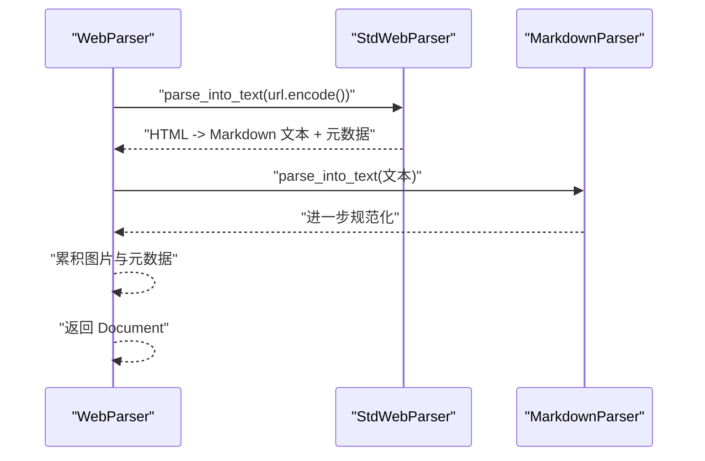

**图表来源**
- [docreader/parser/web_parser.py:128-138](file://docreader/parser/web_parser.py#L128-L138)
- [docreader/parser/web_parser.py:86-126](file://docreader/parser/web_parser.py#L86-L126)

**章节来源**
- [docreader/parser/web_parser.py:18-126](file://docreader/parser/web_parser.py#L18-L126)
- [docreader/parser/web_parser.py:128-138](file://docreader/parser/web_parser.py#L128-L138)

### MarkItDown 解析器
- MarkitdownParser：将 MarkItDown 作为标准解析器包装，结合 MarkdownParser 实现多阶段处理；适合 PDF、DOCX、PPTX、XLSX 等格式的统一转换。

**章节来源**
- [docreader/parser/markitdown_parser.py:14-46](file://docreader/parser/markitdown_parser.py#L14-L46)

## 依赖关系分析
- 模块耦合：解析器均依赖 BaseParser 接口；注册表集中管理映射；门面统一调度；Go 侧通过 gRPC 接收解析结果。
- 外部依赖：pdfplumber（PDF 图像提取）、Playwright/Trafilatura（网页抓取与清理）、pandas（Excel 解析）、markitdown（多格式转换）。
- 可能的循环依赖：当前结构清晰，解析器之间通过抽象接口交互，未发现循环导入。

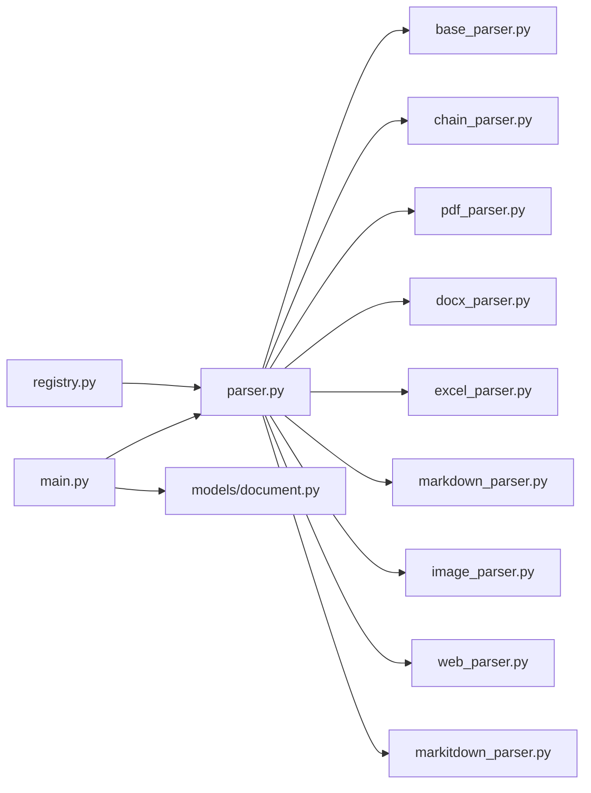

**图表来源**
- [docreader/parser/registry.py:112-161](file://docreader/parser/registry.py#L112-L161)
- [docreader/parser/parser.py:11-83](file://docreader/parser/parser.py#L11-L83)
- [docreader/main.py:98-215](file://docreader/main.py#L98-L215)

**章节来源**
- [docreader/parser/registry.py:112-161](file://docreader/parser/registry.py#L112-L161)
- [docreader/parser/parser.py:11-83](file://docreader/parser/parser.py#L11-L83)
- [docreader/main.py:98-215](file://docreader/main.py#L98-L215)

## 性能考虑
- 并发与分页：DocxParser 对大文档采用多进程分页并行，依据文档图片数量与页数动态调整工作进程数，降低内存峰值。
- 图像缓存：Docx 内部使用图片缓存避免重复处理相同嵌入图片。
- 回退策略：PDF 解析失败时快速降级为图像提取，减少重试成本。
- 输出最小化：BaseParser 仅返回文本与图片引用，后续分块、存储、OCR/VLM 由 Go 侧完成，降低 Python 层负担。
- 日志与可观测：大量 INFO/WARNING 记录解析过程与耗时，便于定位瓶颈。

**章节来源**
- [docreader/parser/docx_parser.py:692-711](file://docreader/parser/docx_parser.py#L692-L711)
- [docreader/parser/pdf_parser.py:13-56](file://docreader/parser/pdf_parser.py#L13-L56)

## 故障排除指南
- 解析为空：检查解析器是否成功提取内容；确认回退路径（如 PDF 扫描版）是否生效；查看日志中的警告信息。
- 引擎不可用：通过 list_engines 查询引擎可用性与原因；根据 unavailable_reason 调整配置或安装依赖。
- 图片缺失：确认 Document.images 是否存在；检查 Go 侧图片解析函数是否正确解码 base64 并生成 ImageRef。
- 网页抓取失败：检查代理配置、超时设置与目标站点可访问性；查看 StdWebParser 的异常日志。
- Excel 行为空：确认是否被全空行过滤；检查列名与数据类型。

**章节来源**
- [docreader/parser/parser.py:58-63](file://docreader/parser/parser.py#L58-L63)
- [docreader/parser/registry.py:77-106](file://docreader/parser/registry.py#L77-L106)
- [docreader/main.py:140-167](file://docreader/main.py#L140-L167)

## 结论
WeKnora 文档解析器通过清晰的接口抽象、灵活的注册表与链式组合模式，实现了对多格式文档的统一处理。解析流程在 Python 层完成内容抽取与图片引用生成，在 Go 层完成分块、存储与高级处理。该架构易于扩展新格式与新引擎，具备良好的容错与可观测性，适合在企业级知识库与检索增强应用中稳定运行。

## 附录

### 解析器扩展指南
- 新增解析器类：继承 BaseParser，实现 parse_into_text，返回包含 content 与可选 images/metadata 的 Document。
- 注册到引擎：在默认注册表中添加文件类型到解析器类的映射；如需外部可用性检查，提供 check_available 与 unavailable_hint。
- 组合策略：如需多阶段处理，使用 PipelineParser；如需容错回退，使用 FirstParser。
- 集成测试：编写单元测试验证解析结果与图片引用；在真实文档样本上评估质量。

**章节来源**
- [docreader/parser/base_parser.py:36-43](file://docreader/parser/base_parser.py#L36-L43)
- [docreader/parser/registry.py:32-49](file://docreader/parser/registry.py#L32-L49)
- [docreader/parser/chain_parser.py:94-171](file://docreader/parser/chain_parser.py#L94-L171)

### 自定义解析器开发步骤
- 明确输入格式与期望输出：确定文件类型、编码、图片处理需求。
- 设计解析流程：必要时拆分为多个小解析器，使用 Pipeline 组合。
- 错误处理：捕获并记录异常，保证 parse_into_text 始终返回合法 Document。
- 性能优化：利用并发、缓存与回退策略，控制内存与 CPU 占用。
- 集成验证：通过 Parser 门面与 gRPC 服务端进行端到端测试。

**章节来源**
- [docreader/parser/parser.py:25-63](file://docreader/parser/parser.py#L25-L63)
- [docreader/main.py:103-167](file://docreader/main.py#L103-L167)

### 解析质量评估与优化
- 质量指标：文本完整性、表格对齐一致性、图片引用准确性、分块粒度合理性。
- 评估方法：对比人工标注与解析结果；统计解析失败率与回退次数；收集用户反馈。
- 优化策略：增加规则与正则表达式；引入更强大的第三方库；改进并发策略与缓存。

**章节来源**
- [docreader/parser/markdown_parser.py:61-103](file://docreader/parser/markdown_parser.py#L61-L103)
- [docreader/parser/docx_parser.py:102-207](file://docreader/parser/docx_parser.py#L102-L207)