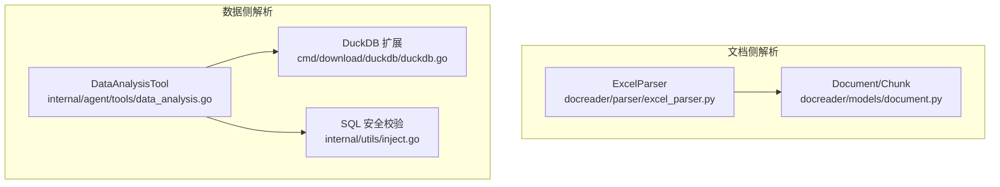
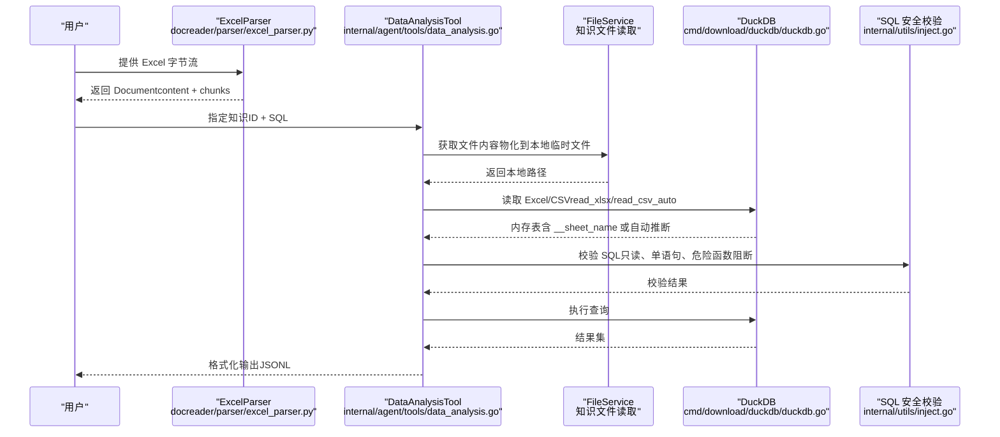
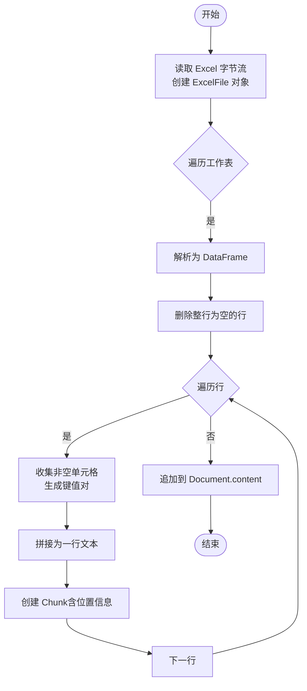
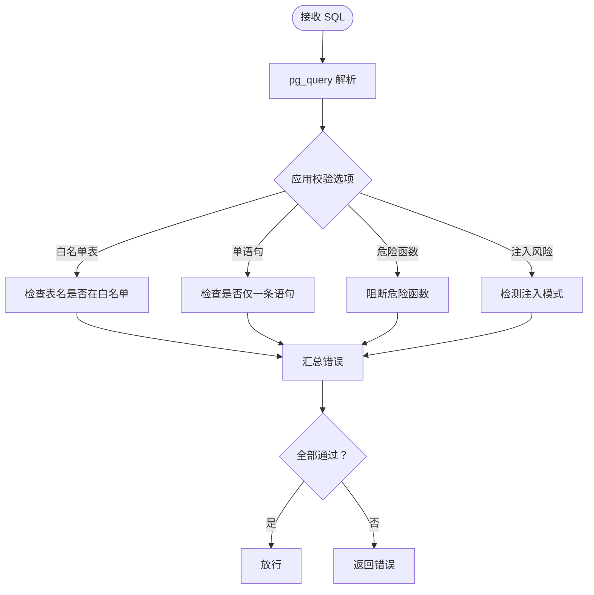
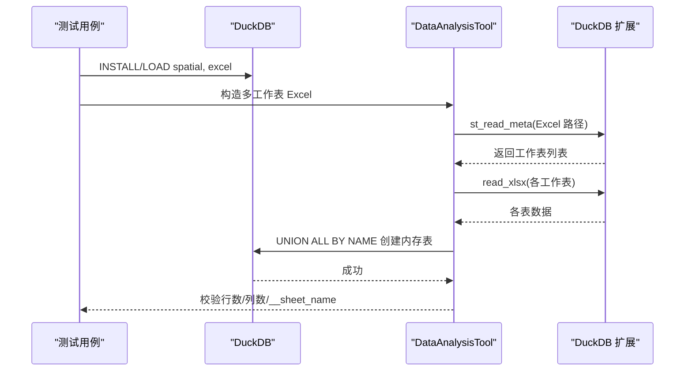
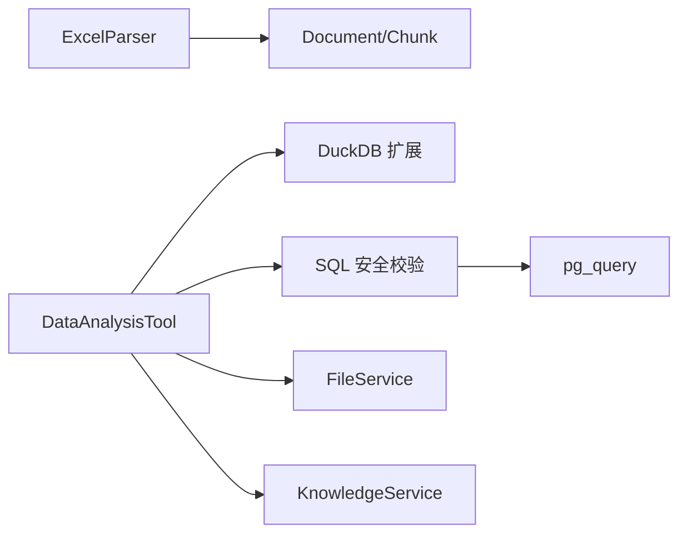

# 电子表格解析器

<cite>
**本文引用的文件**
- [excel_parser.py](file://docreader/parser/excel_parser.py)
- [document.py](file://docreader/models/document.py)
- [data_analysis.go](file://internal/agent/tools/data_analysis.go)
- [inject.go](file://internal/utils/inject.go)
- [duckdb.go](file://cmd/download/duckdb/duckdb.go)
- [data_analysis_test.go](file://internal/agent/tools/data_analysis_test.go)
- [data_analysis_duckdb_test.go](file://internal/agent/tools/data_analysis_duckdb_test.go)
</cite>

## 目录
1. [简介](#简介)
2. [项目结构](#项目结构)
3. [核心组件](#核心组件)
4. [架构总览](#架构总览)
5. [详细组件分析](#详细组件分析)
6. [依赖关系分析](#依赖关系分析)
7. [性能考虑](#性能考虑)
8. [故障排查指南](#故障排查指南)
9. [结论](#结论)
10. [附录](#附录)

## 简介
本文件为 WeKnora 电子表格解析器的技术文档，聚焦于 Excel 文件解析与数据抽取能力。文档涵盖以下方面：
- Excel 文件解析器（Python）：基于 pandas 的行级文本化输出，支持多工作表、空行过滤与块级分段。
- 数据分析工具（Go）：通过 DuckDB 扩展读取 Excel/CSV，自动枚举工作表并进行安全 SQL 查询，支持多工作表 UNION ALL BY NAME 融合与 __sheet_name 标记列。
- 安全与验证：SQL 解析与注入防护、只读查询限制、危险函数阻断等。
- 配置与运行：DuckDB 扩展安装脚本、测试用例与行为验证。
- 集成与定制：如何在 WeKnora 中集成电子表格解析与数据分析工具，以及扩展与优化建议。

## 项目结构
WeKnora 将电子表格解析分为两层：
- 文档侧解析：docreader/parser/excel_parser.py 将 Excel 行数据转为结构化文本与块，便于后续检索与索引。
- 数据侧解析：internal/agent/tools/data_analysis.go 通过 DuckDB 扩展读取 Excel/CSV，构建内存表并执行 SQL 查询，支持多工作表合并与安全校验。



**图表来源**
- [excel_parser.py:1-120](file://docreader/parser/excel_parser.py#L1-L120)
- [document.py:1-88](file://docreader/models/document.py#L1-L88)
- [data_analysis.go:1-656](file://internal/agent/tools/data_analysis.go#L1-L656)
- [inject.go:1-200](file://internal/utils/inject.go#L1-L200)
- [duckdb.go:1-38](file://cmd/download/duckdb/duckdb.go#L1-L38)

**章节来源**
- [excel_parser.py:1-120](file://docreader/parser/excel_parser.py#L1-L120)
- [document.py:1-88](file://docreader/models/document.py#L1-L88)
- [data_analysis.go:1-656](file://internal/agent/tools/data_analysis.go#L1-L656)
- [inject.go:1-200](file://internal/utils/inject.go#L1-L200)
- [duckdb.go:1-38](file://cmd/download/duckdb/duckdb.go#L1-L38)

## 核心组件
- ExcelParser（Python）
  - 多工作表遍历与行级文本化，空行过滤，逐行生成 Chunk。
  - 输出结构化 Document，包含 content 与 chunks 列表。
- DataAnalysisTool（Go）
  - 自动识别 CSV/XLSX/XLS，加载到 DuckDB 内存表。
  - 多工作表场景：枚举工作表并通过 UNION ALL BY NAME 合并，添加 __sheet_name 标记列。
  - 只读查询限制 + SQL 安全校验（危险函数阻断、单语句、白名单表等）。
- SQL 安全校验（Go）
  - 基于 pg_query 的 SQL 解析与规则校验，支持注入风险检测、子查询/CTE/系统列/模式访问等限制。
- DuckDB 扩展（Go/脚本）
  - spatial 用于枚举 Excel 工作表元数据；excel 用于 read_xlsx 类型推断与读取。

**章节来源**
- [excel_parser.py:20-97](file://docreader/parser/excel_parser.py#L20-L97)
- [data_analysis.go:100-179](file://internal/agent/tools/data_analysis.go#L100-L179)
- [inject.go:149-200](file://internal/utils/inject.go#L149-L200)
- [duckdb.go:11-15](file://cmd/download/duckdb/duckdb.go#L11-L15)

## 架构总览
电子表格解析的整体流程如下：
- 文档侧：ExcelParser 读取 Excel 字节流，按工作表逐行解析，生成文本内容与块。
- 数据侧：DataAnalysisTool 将知识库中的 Excel/CSV 材料物化到本地临时文件，交由 DuckDB 扩展读取，构建内存表，执行用户 SQL 并返回结果。
- 安全：所有查询在进入 DuckDB 前经过 SQL 安全校验，确保只读与安全。



**图表来源**
- [excel_parser.py:43-97](file://docreader/parser/excel_parser.py#L43-L97)
- [data_analysis.go:100-179](file://internal/agent/tools/data_analysis.go#L100-L179)
- [data_analysis.go:444-486](file://internal/agent/tools/data_analysis.go#L444-L486)
- [inject.go:149-200](file://internal/utils/inject.go#L149-L200)
- [duckdb.go:11-15](file://cmd/download/duckdb/duckdb.go#L11-L15)

## 详细组件分析

### 组件一：ExcelParser（Python）
- 功能要点
  - 支持多工作表：遍历 ExcelFile.sheet_names，逐表解析为 DataFrame。
  - 行级文本化：对每行非空单元格生成“列名: 值”的键值对，拼接为一行文本，并记录块位置信息。
  - 空行过滤：dropna(how="all") 移除整行为空的数据。
  - 块粒度：每个有效行对应一个 Chunk，便于后续检索与溯源。
- 数据结构
  - Document：包含 content（拼接后的文本）与 chunks（块列表）。
  - Chunk：包含 content、seq、start、end、images、metadata 等字段。
- 性能与复杂度
  - 时间复杂度：O(R×C)，其中 R 为总行数，C 为列数。
  - 空间复杂度：O(R×C) 用于中间 DataFrame 与文本拼接。
- 错误处理
  - 对空行跳过，避免产生无效块；对空内容行直接忽略。
- 适用场景
  - 需要将 Excel 表格转换为可检索文本的场景，如知识入库前的预处理。



**图表来源**
- [excel_parser.py:63-97](file://docreader/parser/excel_parser.py#L63-L97)

**章节来源**
- [excel_parser.py:20-97](file://docreader/parser/excel_parser.py#L20-L97)
- [document.py:9-88](file://docreader/models/document.py#L9-L88)

### 组件二：DataAnalysisTool（Go）
- 功能要点
  - 文件类型识别：根据 FileType 自动选择 CSV 或 Excel 加载路径。
  - Excel 多工作表：优先通过 DuckDB spatial 扩展枚举工作表，若失败则回退到首表。
  - 多表融合：UNION ALL BY NAME 融合不同工作表，缺失列以 NULL 填充，类型冲突自动宽化。
  - 标记列：为每条记录添加 __sheet_name，便于按工作表筛选/聚合。
  - 安全执行：只允许 SELECT/SHOW/DESCRIBE/EXPLAIN/PRAGMA；禁止多语句与危险函数。
- 关键流程
  - LoadFromKnowledgeID → LoadFromKnowledge → materializeKnowledgeFile → LoadFromExcel/CSV → LoadFromTable。
  - SQL 执行前进行 ValidateSQL，确保安全。
- 数据结构
  - TableSchema：包含表名、列信息（名称、类型、是否可空）、行数与元数据。
  - ColumnInfo：列名、类型、可空性。
- 性能与复杂度
  - 多工作表 UNION ALL BY NAME 在 DuckDB 内部完成，避免 Go 层重复拼接。
  - 临时文件物化后由 DuckDB 直接读取，减少跨存储协议开销。
- 错误处理
  - sheet 枚举失败时回退到首表；SQL 验证失败或执行错误均返回明确错误信息。
- 适用场景
  - 需要在知识库中对 Excel/CSV 进行交互式 SQL 分析与统计。

```mermaid
classDiagram
class DataAnalysisTool {
+Execute(ctx, args) ToolResult
+LoadFromKnowledgeID(ctx, knowledgeID) TableSchema
+LoadFromExcel(ctx, filename, tableName) TableSchema
+LoadFromCSV(ctx, filename, tableName) TableSchema
+LoadFromTable(ctx, tableName) TableSchema
-materializeKnowledgeFile(ctx, knowledge) (string, func(), error)
-listExcelSheets(ctx, filename) []string
}
class TableSchema {
+string TableName
+ColumnInfo[] Columns
+int64 RowCount
+map[string]interface{} Metadata
+Description() string
}
class ColumnInfo {
+string Name
+string Type
+string Nullable
}
DataAnalysisTool --> TableSchema : "返回"
TableSchema --> ColumnInfo : "包含"
```

**图表来源**
- [data_analysis.go:41-636](file://internal/agent/tools/data_analysis.go#L41-L636)

**章节来源**
- [data_analysis.go:100-179](file://internal/agent/tools/data_analysis.go#L100-L179)
- [data_analysis.go:317-364](file://internal/agent/tools/data_analysis.go#L317-L364)
- [data_analysis.go:444-486](file://internal/agent/tools/data_analysis.go#L444-L486)
- [data_analysis.go:562-636](file://internal/agent/tools/data_analysis.go#L562-L636)

### 组件三：SQL 安全校验（Go）
- 功能要点
  - 基于 pg_query 解析 SQL，提取表名、字段、WHERE 条件等。
  - 支持多种校验选项：输入长度校验、仅 SELECT、单语句、白名单表、默认安全函数、禁止子查询/CTE、系统列/模式访问、危险函数等。
  - 注入风险检测：识别 1=1、'1'='1' 等常见注入模式。
- 设计原则
  - 严格白名单 + 严格黑名单结合，最小权限原则。
  - 通过 WithSecurityDefaults 快速启用生产级安全策略。
- 适用场景
  - 任何外部可控 SQL 输入的前置安全检查，防止注入与越权。



**图表来源**
- [inject.go:149-200](file://internal/utils/inject.go#L149-L200)
- [inject.go:531-574](file://internal/utils/inject.go#L531-L574)

**章节来源**
- [inject.go:149-200](file://internal/utils/inject.go#L149-L200)
- [inject.go:531-574](file://internal/utils/inject.go#L531-L574)

### 组件四：DuckDB 扩展与测试
- 扩展要求
  - spatial：枚举 Excel 工作表元数据（st_read_meta），用于 listExcelSheets。
  - excel：读取 Excel 文件（read_xlsx），支持类型推断与 sheet 参数。
- 测试保障
  - 单工作表与多工作表场景的端到端测试，覆盖 UNION ALL BY NAME、__sheet_name 标记、NULL 填充等行为。
  - SQL 构建函数 buildExcelCreateTableSQL 的单元测试，验证转义与拼接逻辑。



**图表来源**
- [duckdb.go:11-15](file://cmd/download/duckdb/duckdb.go#L11-L15)
- [data_analysis_duckdb_test.go:18-36](file://internal/agent/tools/data_analysis_duckdb_test.go#L18-L36)
- [data_analysis_test.go:8-67](file://internal/agent/tools/data_analysis_test.go#L8-L67)

**章节来源**
- [duckdb.go:11-15](file://cmd/download/duckdb/duckdb.go#L11-L15)
- [data_analysis_duckdb_test.go:18-36](file://internal/agent/tools/data_analysis_duckdb_test.go#L18-L36)
- [data_analysis_test.go:8-67](file://internal/agent/tools/data_analysis_test.go#L8-L67)

## 依赖关系分析
- 组件耦合
  - ExcelParser 与 Document/Chunk 低耦合，仅依赖 pandas 与基础模型。
  - DataAnalysisTool 依赖 DuckDB 扩展、FileService、知识服务接口，耦合度中等。
  - SQL 安全校验独立于业务逻辑，通过选项化配置接入。
- 外部依赖
  - pandas：Excel/CSV 读取与 DataFrame 处理。
  - DuckDB + spatial/excel：Excel 工作表枚举与读取。
  - pg_query：SQL 解析与安全校验。
- 循环依赖
  - 未发现循环依赖，模块职责清晰。



**图表来源**
- [excel_parser.py:12-17](file://docreader/parser/excel_parser.py#L12-L17)
- [data_analysis.go:43-63](file://internal/agent/tools/data_analysis.go#L43-L63)
- [inject.go:3-9](file://internal/utils/inject.go#L3-L9)

**章节来源**
- [excel_parser.py:12-17](file://docreader/parser/excel_parser.py#L12-L17)
- [data_analysis.go:43-63](file://internal/agent/tools/data_analysis.go#L43-L63)
- [inject.go:3-9](file://internal/utils/inject.go#L3-L9)

## 性能考虑
- 文档侧解析
  - 行级文本化与块粒度有利于后续检索加速，但会增加内存占用。建议在大规模 Excel 场景下控制块大小与数量。
- 数据侧解析
  - DuckDB 内存表与 UNION ALL BY NAME 在多工作表场景下具备良好容错性，但需注意列类型差异导致的类型宽化与额外内存消耗。
  - 临时文件物化避免了跨存储协议的复杂性，但在高并发场景下需关注磁盘 IO 与清理策略。
- 安全校验
  - SQL 解析与规则校验带来一定 CPU 开销，建议在入口处集中执行，避免重复解析。
- 建议
  - 对超大 Excel 文件，优先采用 DataAnalysisTool 的分页/分组查询策略，配合 LIMIT 控制结果规模。
  - 在多工作表场景下，尽量统一列名与类型，减少 UNION ALL BY NAME 的类型冲突与 NULL 填充成本。

[本节为通用性能讨论，不直接分析具体文件]

## 故障排查指南
- Excel 工作表枚举失败
  - 现象：多工作表场景下回退到首表。
  - 排查：确认 DuckDB spatial 扩展已安装并可用；检查 Excel 文件是否损坏。
  - 参考
    - [data_analysis.go:341-347](file://internal/agent/tools/data_analysis.go#L341-L347)
    - [data_analysis.go:373-400](file://internal/agent/tools/data_analysis.go#L373-L400)
- SQL 注入或语法错误
  - 现象：执行被拒绝或报错。
  - 排查：检查是否包含多语句、危险函数、子查询/CTE、系统列访问等；确认白名单表是否正确。
  - 参考
    - [data_analysis.go:141-154](file://internal/agent/tools/data_analysis.go#L141-L154)
    - [inject.go:531-574](file://internal/utils/inject.go#L531-L574)
- DuckDB 扩展缺失
  - 现象：无法枚举工作表或读取 Excel。
  - 排查：运行扩展安装脚本，确保 spatial 与 excel 已加载。
  - 参考
    - [duckdb.go:17-34](file://cmd/download/duckdb/duckdb.go#L17-L34)
- 多工作表合并异常
  - 现象：列数不一致或类型冲突。
  - 排查：确认 UNION ALL BY NAME 是否生效；检查 __sheet_name 标记列是否存在。
  - 参考
    - [data_analysis_test.go:30-57](file://internal/agent/tools/data_analysis_test.go#L30-L57)
    - [data_analysis_duckdb_test.go:90-185](file://internal/agent/tools/data_analysis_duckdb_test.go#L90-L185)

**章节来源**
- [data_analysis.go:341-400](file://internal/agent/tools/data_analysis.go#L341-L400)
- [data_analysis.go:141-154](file://internal/agent/tools/data_analysis.go#L141-L154)
- [inject.go:531-574](file://internal/utils/inject.go#L531-L574)
- [duckdb.go:17-34](file://cmd/download/duckdb/duckdb.go#L17-L34)
- [data_analysis_test.go:30-57](file://internal/agent/tools/data_analysis_test.go#L30-L57)
- [data_analysis_duckdb_test.go:90-185](file://internal/agent/tools/data_analysis_duckdb_test.go#L90-L185)

## 结论
WeKnora 的电子表格解析器提供了两条路径：
- 文档侧：快速将 Excel 表格转为可检索文本，适合知识入库与检索增强。
- 数据侧：通过 DuckDB 扩展实现安全、灵活的交互式 SQL 分析，支持多工作表融合与标记列，满足复杂统计与聚合需求。
配合严格的 SQL 安全校验与完善的测试用例，系统在安全性与稳定性上具备较高保障。对于大规模数据与复杂格式，建议结合块粒度控制、类型统一与查询优化策略，进一步提升性能与体验。

[本节为总结性内容，不直接分析具体文件]

## 附录

### 配置与安装
- DuckDB 扩展安装
  - 运行扩展安装脚本，确保 spatial 与 excel 已安装并加载。
  - 参考：[duckdb.go:17-34](file://cmd/download/duckdb/duckdb.go#L17-L34)
- SQL 安全校验选项
  - 常用选项：WithSingleStatement、WithNoDangerousFunctions、WithAllowedTables 等。
  - 参考：[inject.go:531-574](file://internal/utils/inject.go#L531-L574)

### 开发与集成指引
- 集成 DataAnalysisTool
  - 通过知识 ID 与 SQL 输入，工具自动加载 Excel/CSV 并执行查询。
  - 参考：[data_analysis.go:100-179](file://internal/agent/tools/data_analysis.go#L100-L179)
- 自定义扩展
  - 若需支持新格式，可在 DataAnalysisTool 中扩展 LoadFromKnowledge 的分支。
  - 参考：[data_analysis.go:459-486](file://internal/agent/tools/data_analysis.go#L459-L486)
- 文档侧解析扩展
  - 可在 ExcelParser 中调整行级文本化策略或块粒度。
  - 参考：[excel_parser.py:74-97](file://docreader/parser/excel_parser.py#L74-L97)

### 测试与验证
- 多工作表场景
  - 端到端测试覆盖多表 UNION ALL BY NAME、__sheet_name 标记与 NULL 填充。
  - 参考：[data_analysis_duckdb_test.go:90-185](file://internal/agent/tools/data_analysis_duckdb_test.go#L90-L185)
- SQL 构建逻辑
  - 单元测试覆盖转义、拼接与多表合并。
  - 参考：[data_analysis_test.go:8-67](file://internal/agent/tools/data_analysis_test.go#L8-L67)