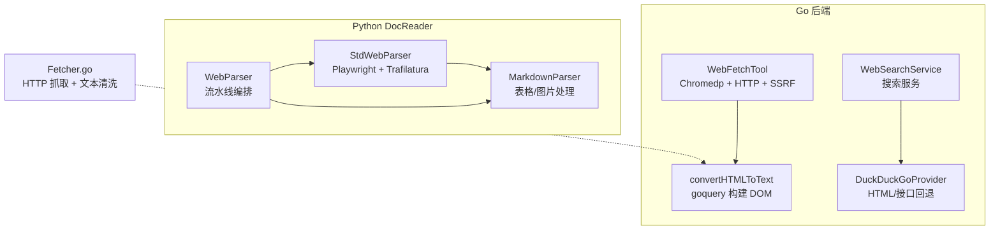
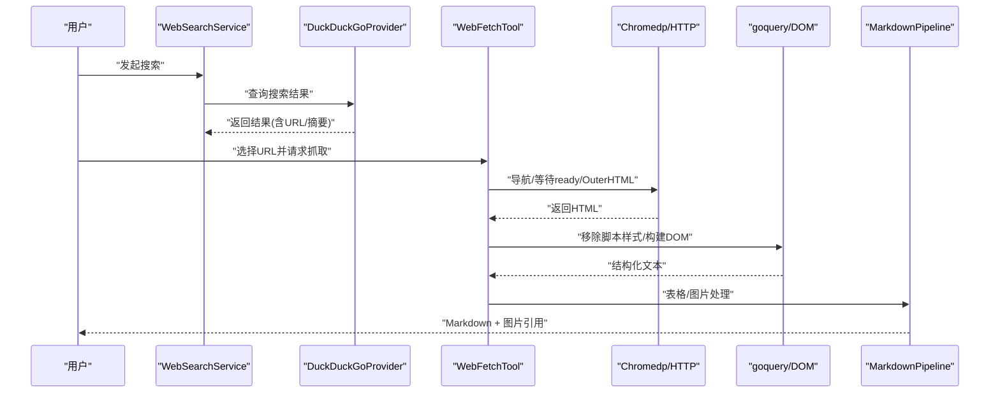
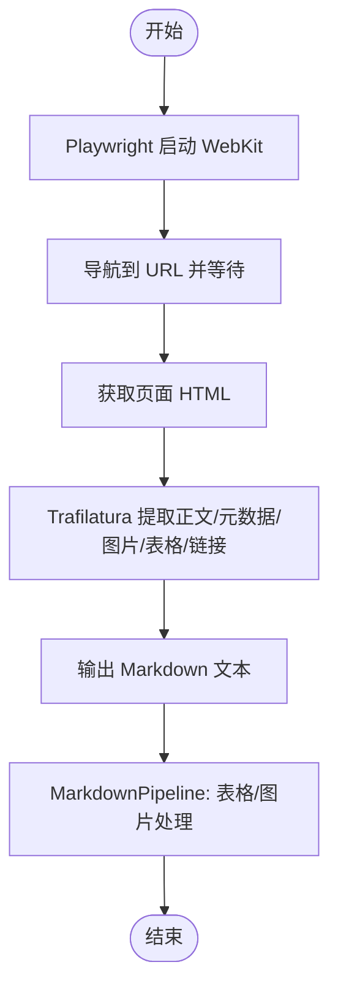
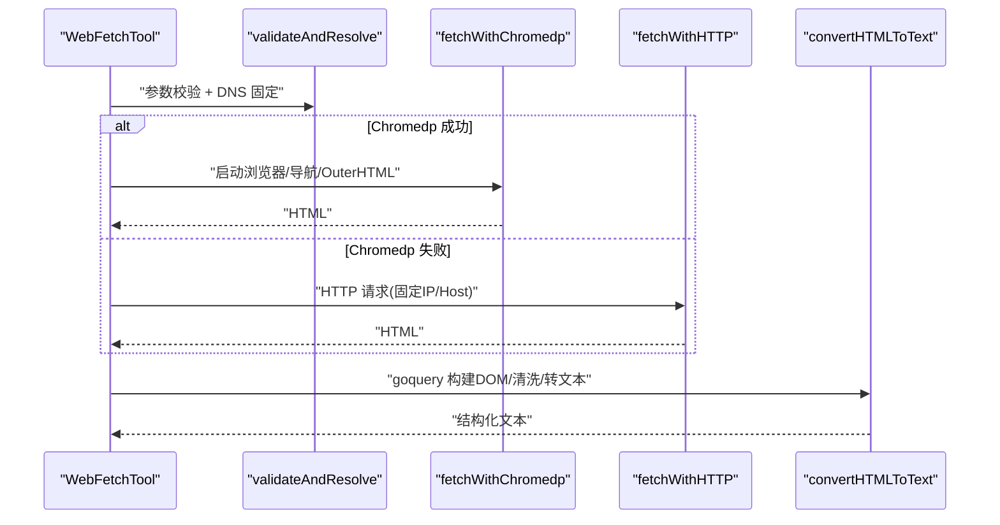
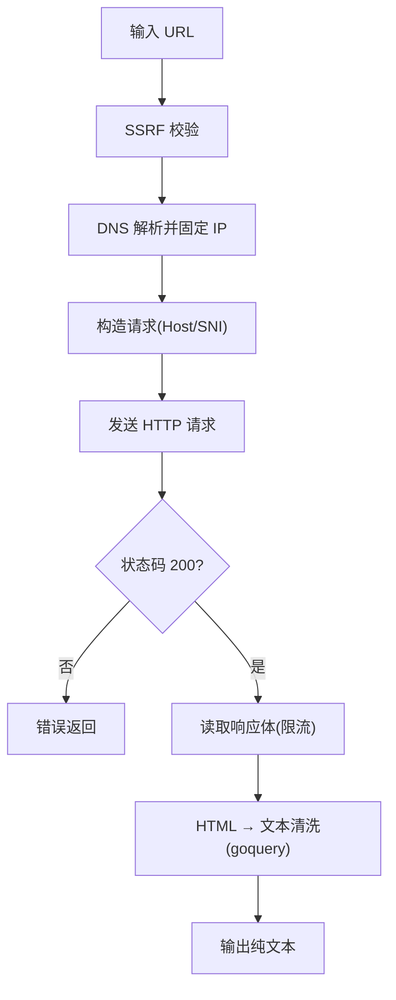
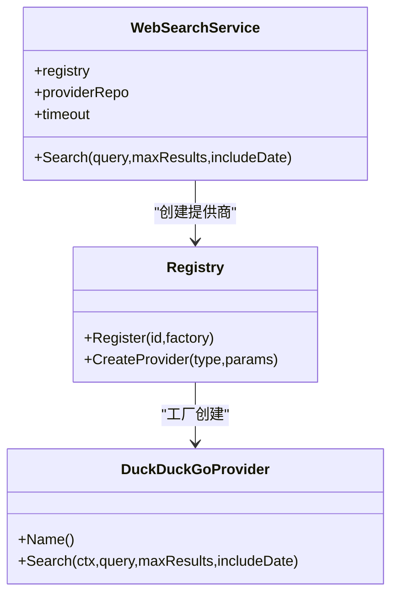
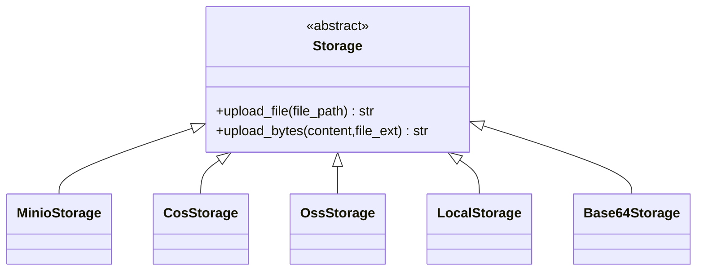
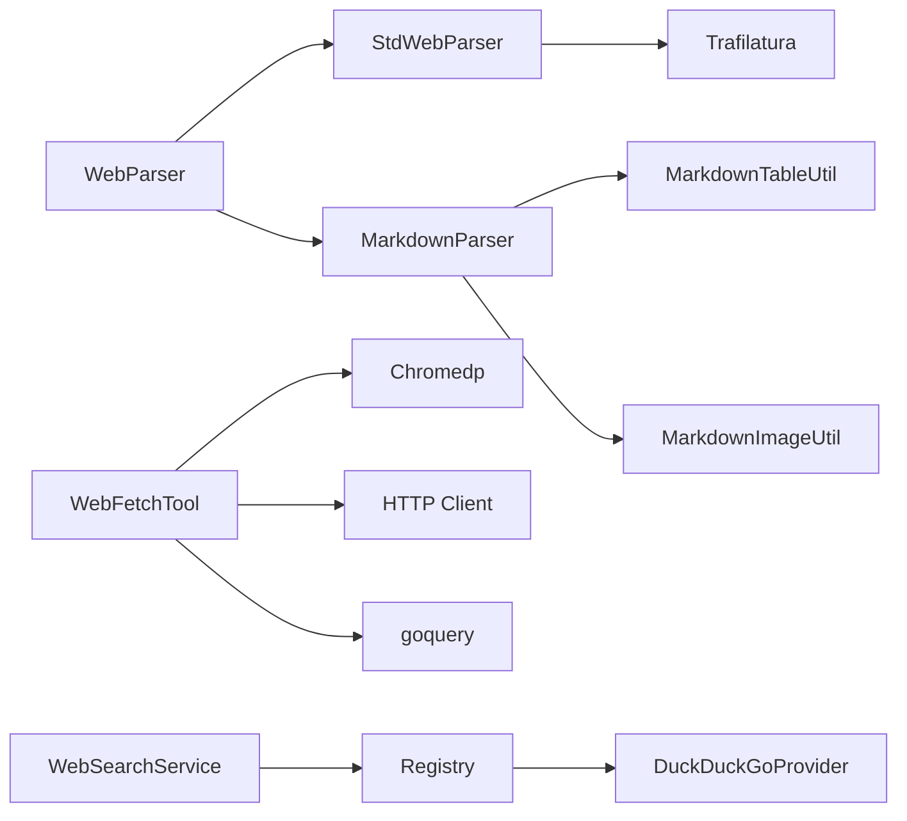

# 网页解析器

<cite>
**本文引用的文件**
- [docreader/parser/web_parser.py](file://docreader/parser/web_parser.py)
- [docreader/parser/base_parser.py](file://docreader/parser/base_parser.py)
- [docreader/parser/markdown_parser.py](file://docreader/parser/markdown_parser.py)
- [docreader/config.py](file://docreader/config.py)
- [internal/infrastructure/web_fetch/fetcher.go](file://internal/infrastructure/web_fetch/fetcher.go)
- [internal/agent/tools/web_fetch.go](file://internal/agent/tools/web_fetch.go)
- [internal/application/service/web_search.go](file://internal/application/service/web_search.go)
- [internal/infrastructure/web_search/registry.go](file://internal/infrastructure/web_search/registry.go)
- [internal/infrastructure/web_search/duckduckgo.go](file://internal/infrastructure/web_search/duckduckgo.go)
- [internal/types/web_search.go](file://internal/types/web_search.go)
- [docreader/testdata/test.html](file://docreader/testdata/test.html)
- [docreader/parser/storage.py](file://docreader/parser/storage.py)
- [frontend/src/utils/security.ts](file://frontend/src/utils/security.ts)
</cite>

## 目录
1. [简介](#简介)
2. [项目结构](#项目结构)
3. [核心组件](#核心组件)
4. [架构总览](#架构总览)
5. [详细组件分析](#详细组件分析)
6. [依赖分析](#依赖分析)
7. [性能考虑](#性能考虑)
8. [故障排查指南](#故障排查指南)
9. [结论](#结论)
10. [附录](#附录)

## 简介
本文件为 WeKnora 网页解析器的技术文档，聚焦于网页内容解析器的实现原理、HTML 解析技术与内容提取策略，涵盖网页结构分析、DOM 树构建、关键内容识别、去噪与广告过滤、导航链接提取、复杂网页格式支持、动态内容处理、移动端适配、解析配置选项、性能优化与内容质量评估方法，并提供面向开发者的定制与集成指导。

## 项目结构
WeKnora 将网页解析分为两类能力：
- Python DocReader 子系统：基于 Playwright + Trafilatura 的“网页抓取 + 清洗 + Markdown 转换”的流水线，适合批量离线解析与预处理。
- Go 后端子系统：提供“网页抓取 + 文本清洗 + Markdown 转换 + LLM 分析”的在线工具链，支持并发、SSRF 防护与浏览器指纹模拟。

**图表来源**
- [docreader/parser/web_parser.py:18-137](file://docreader/parser/web_parser.py#L18-L137)
- [docreader/parser/markdown_parser.py:376-387](file://docreader/parser/markdown_parser.py#L376-L387)
- [internal/agent/tools/web_fetch.go:417-437](file://internal/agent/tools/web_fetch.go#L417-L437)
- [internal/infrastructure/web_fetch/fetcher.go:26-130](file://internal/infrastructure/web_fetch/fetcher.go#L26-L130)
- [internal/application/service/web_search.go:18-44](file://internal/application/service/web_search.go#L18-L44)
- [internal/infrastructure/web_search/duckduckgo.go:20-49](file://internal/infrastructure/web_search/duckduckgo.go#L20-L49)

**章节来源**
- [docreader/parser/web_parser.py:18-137](file://docreader/parser/web_parser.py#L18-L137)
- [docreader/parser/markdown_parser.py:376-387](file://docreader/parser/markdown_parser.py#L376-L387)
- [internal/agent/tools/web_fetch.go:417-437](file://internal/agent/tools/web_fetch.go#L417-L437)
- [internal/infrastructure/web_fetch/fetcher.go:26-130](file://internal/infrastructure/web_fetch/fetcher.go#L26-L130)
- [internal/application/service/web_search.go:18-44](file://internal/application/service/web_search.go#L18-L44)
- [internal/infrastructure/web_search/duckduckgo.go:20-49](file://internal/infrastructure/web_search/duckduckgo.go#L20-L49)

## 核心组件
- Python 网页解析流水线
  - StdWebParser：使用 Playwright WebKit 导航到目标 URL，抓取完整 HTML，随后用 Trafilatura 提取正文、元数据、图片、表格与链接，输出 Markdown。
  - MarkdownParser：通过管道依次执行表格标准化与 Base64 图片抽取，生成统一格式的 Markdown 文本与图片引用。
  - WebParser：将 StdWebParser 与 MarkdownParser 串联，形成完整的“网页抓取 → Markdown”流水线。
- Go 在线网页抓取与清洗
  - WebFetchTool：支持并发抓取多个 URL，优先使用 Chromedp（带 DNS 固定与浏览器指纹），失败则回退到 HTTP 请求；对 HTML 进行 goquery DOM 构建与节点遍历，生成结构化文本；可选调用小模型进行摘要。
  - Fetcher.go：提供独立的 HTTP 抓取与 HTML 到纯文本转换，内置 SSRF 校验、DNS 固定、浏览器头与内容大小限制。
- 搜索与结果过滤
  - WebSearchService：按租户配置选择具体提供商（如 DuckDuckGo），支持黑名单过滤与代理覆盖。
  - DuckDuckGoProvider：HTML 抓取为主，必要时回退到官方接口。
- 存储与图片处理
  - storage.py：支持 MinIO、COS、OSS、本地与 Base64 等多种存储后端，负责图片上传与 URL 生成，供 Go 侧后续渲染使用。
- 前端安全与渲染
  - security.ts：DOMPurify 白名单策略与受保护图片懒加载，保障渲染安全与性能。

**章节来源**
- [docreader/parser/web_parser.py:18-137](file://docreader/parser/web_parser.py#L18-L137)
- [docreader/parser/markdown_parser.py:376-387](file://docreader/parser/markdown_parser.py#L376-L387)
- [internal/agent/tools/web_fetch.go:417-437](file://internal/agent/tools/web_fetch.go#L417-L437)
- [internal/infrastructure/web_fetch/fetcher.go:26-130](file://internal/infrastructure/web_fetch/fetcher.go#L26-L130)
- [internal/application/service/web_search.go:18-44](file://internal/application/service/web_search.go#L18-L44)
- [internal/infrastructure/web_search/duckduckgo.go:20-49](file://internal/infrastructure/web_search/duckduckgo.go#L20-L49)
- [docreader/parser/storage.py:391-420](file://docreader/parser/storage.py#L391-L420)
- [frontend/src/utils/security.ts:1-32](file://frontend/src/utils/security.ts#L1-L32)

## 架构总览
下图展示从“搜索结果到最终内容”的端到端流程，包括网页抓取、内容清洗、Markdown 转换、图片处理与前端渲染。

**图表来源**
- [internal/application/service/web_search.go:18-44](file://internal/application/service/web_search.go#L18-L44)
- [internal/infrastructure/web_search/duckduckgo.go:40-49](file://internal/infrastructure/web_search/duckduckgo.go#L40-L49)
- [internal/agent/tools/web_fetch.go:417-437](file://internal/agent/tools/web_fetch.go#L417-L437)
- [internal/agent/tools/web_fetch.go:528-655](file://internal/agent/tools/web_fetch.go#L528-L655)
- [docreader/parser/markdown_parser.py:376-387](file://docreader/parser/markdown_parser.py#L376-L387)

## 详细组件分析

### 组件一：Python 网页解析流水线（DocReader）
- StdWebParser
  - 使用 Playwright WebKit 打开页面，等待超时控制，抓取完整 HTML。
  - 使用 Trafilatura 提取正文、元数据、图片、表格与链接，输出 Markdown。
  - 可配置外部 HTTPS 代理。
- MarkdownParser
  - 表格标准化：统一列对齐与间距。
  - Base64 图片抽取：将内嵌图片解码为二进制，生成唯一文件名并替换为相对路径，同时保留原始图片字节以便 Go 侧处理。
- WebParser
  - 顺序执行 StdWebParser 与 MarkdownParser，形成稳定可靠的“网页抓取 → Markdown”流水线。

**图表来源**
- [docreader/parser/web_parser.py:39-125](file://docreader/parser/web_parser.py#L39-L125)
- [docreader/parser/markdown_parser.py:127-160](file://docreader/parser/markdown_parser.py#L127-L160)
- [docreader/parser/markdown_parser.py:352-373](file://docreader/parser/markdown_parser.py#L352-L373)

**章节来源**
- [docreader/parser/web_parser.py:18-137](file://docreader/parser/web_parser.py#L18-L137)
- [docreader/parser/markdown_parser.py:376-387](file://docreader/parser/markdown_parser.py#L376-L387)

### 组件二：Go 在线网页抓取与清洗（WebFetchTool）
- 并发抓取：支持多 URL 并行，每个任务独立校验与 DNS 固定。
- 失败回退：优先 Chromedp（带 host-resolver-rules 与浏览器指纹），失败则使用 HTTP 请求。
- SSRF 防护：集中式 URL 校验、DNS 解析固定到公网 IP、TLS SNI 与 Host 头一致性。
- DOM 构建与内容提取：使用 goquery 移除脚本/样式/导航/页脚/页眉等干扰元素，递归遍历节点，生成结构化文本与 Markdown。
- 动态内容处理：通过 Chromedp 等待 body 就绪，确保 SPA/动态渲染内容加载完成。
- LLM 分析：可选调用小模型对抓取内容进行摘要，辅助下游问答。

**图表来源**
- [internal/agent/tools/web_fetch.go:252-309](file://internal/agent/tools/web_fetch.go#L252-L309)
- [internal/agent/tools/web_fetch.go:417-437](file://internal/agent/tools/web_fetch.go#L417-L437)
- [internal/agent/tools/web_fetch.go:528-655](file://internal/agent/tools/web_fetch.go#L528-L655)

**章节来源**
- [internal/agent/tools/web_fetch.go:417-437](file://internal/agent/tools/web_fetch.go#L417-L437)
- [internal/agent/tools/web_fetch.go:528-655](file://internal/agent/tools/web_fetch.go#L528-L655)

### 组件三：Go HTTP 抓取与文本清洗（Fetcher.go）
- SSRF 校验：统一入口校验 URL 安全性。
- DNS 固定：解析一次并绑定到公网 IP，避免二次解析与 DNS 重绑定。
- 浏览器头：设置 UA、Accept、语言、缓存控制等，降低 403 概率。
- 内容清洗：移除 script/style/nav/footer/header/iframe/noscript/svg/img 等，保留 body 文本并规范化空白。

**图表来源**
- [internal/infrastructure/web_fetch/fetcher.go:26-130](file://internal/infrastructure/web_fetch/fetcher.go#L26-L130)

**章节来源**
- [internal/infrastructure/web_fetch/fetcher.go:26-130](file://internal/infrastructure/web_fetch/fetcher.go#L26-L130)

### 组件四：网页搜索与结果过滤（WebSearchService/Provider）
- Provider 注册与创建：通过注册表按类型创建具体提供商实例（如 DuckDuckGo）。
- 搜索执行：支持最大结果数、是否包含日期、代理覆盖等参数。
- 黑名单过滤：支持通配符与正则两种规则，过滤不希望的结果。

**图表来源**
- [internal/application/service/web_search.go:18-44](file://internal/application/service/web_search.go#L18-L44)
- [internal/infrastructure/web_search/registry.go:11-45](file://internal/infrastructure/web_search/registry.go#L11-L45)
- [internal/infrastructure/web_search/duckduckgo.go:20-49](file://internal/infrastructure/web_search/duckduckgo.go#L20-L49)

**章节来源**
- [internal/application/service/web_search.go:18-44](file://internal/application/service/web_search.go#L18-L44)
- [internal/infrastructure/web_search/registry.go:11-45](file://internal/infrastructure/web_search/registry.go#L11-L45)
- [internal/infrastructure/web_search/duckduckgo.go:20-49](file://internal/infrastructure/web_search/duckduckgo.go#L20-L49)

### 组件五：存储与图片处理（storage.py）
- 多存储后端：MinIO、COS、OSS、本地文件系统、Base64。
- 图片上传：根据配置生成对象键与下载 URL，返回给上游使用。
- Base64 存储：将二进制图片编码为 data URL，便于内联渲染。

**图表来源**
- [docreader/parser/storage.py:36-420](file://docreader/parser/storage.py#L36-L420)

**章节来源**
- [docreader/parser/storage.py:391-420](file://docreader/parser/storage.py#L391-L420)

### 组件六：前端安全与渲染（security.ts）
- DOMPurify 白名单：仅允许安全标签与属性，防止 XSS。
- 受保护图片懒加载：对特定协议前缀的图片进行鉴权后拉取并缓存 Blob URL，提升渲染性能与安全性。

**章节来源**
- [frontend/src/utils/security.ts:1-32](file://frontend/src/utils/security.ts#L1-L32)
- [frontend/src/utils/security.ts:302-364](file://frontend/src/utils/security.ts#L302-L364)

## 依赖分析
- 组件耦合
  - Python 端：WebParser 依赖 StdWebParser 与 MarkdownParser；StdWebParser 依赖 Trafilatura；MarkdownParser 依赖自定义工具类。
  - Go 端：WebFetchTool 依赖 Chromedp/HTTP、goquery；Fetcher.go 独立提供 HTTP 抓取能力；WebSearchService 依赖注册表与提供商实现。
- 外部依赖
  - Python：Playwright、Trafilatura、goquery（在 Go 端）、MinIO/COS/OSS SDK。
  - Go：chromedp、goquery、net/http、tls、context。
- 循环依赖
  - 未发现循环依赖；模块职责清晰，接口边界明确。

**图表来源**
- [docreader/parser/web_parser.py:128-137](file://docreader/parser/web_parser.py#L128-L137)
- [docreader/parser/markdown_parser.py:30-104](file://docreader/parser/markdown_parser.py#L30-L104)
- [internal/agent/tools/web_fetch.go:417-437](file://internal/agent/tools/web_fetch.go#L417-L437)
- [internal/application/service/web_search.go:18-44](file://internal/application/service/web_search.go#L18-L44)
- [internal/infrastructure/web_search/registry.go:11-45](file://internal/infrastructure/web_search/registry.go#L11-L45)

**章节来源**
- [docreader/parser/web_parser.py:128-137](file://docreader/parser/web_parser.py#L128-L137)
- [docreader/parser/markdown_parser.py:30-104](file://docreader/parser/markdown_parser.py#L30-L104)
- [internal/agent/tools/web_fetch.go:417-437](file://internal/agent/tools/web_fetch.go#L417-L437)
- [internal/application/service/web_search.go:18-44](file://internal/application/service/web_search.go#L18-L44)
- [internal/infrastructure/web_search/registry.go:11-45](file://internal/infrastructure/web_search/registry.go#L11-L45)

## 性能考虑
- 并发抓取：Go 端 WebFetchTool 对多个 URL 并行抓取，显著缩短总耗时。
- 超时与大小限制：Go 端抓取设置超时与响应体上限，避免资源泄露；Python 端 Trafilatura 输出可控。
- DNS 固定与 TLS SNI：减少重解析与握手失败，提高稳定性。
- DOM 构建与清洗：goquery 仅保留必要节点，减少内存占用；正则与字符串处理尽量简洁。
- 图片处理：Base64 图片在 Python 端解码后交由 Go 侧存储与 URL 生成，避免重复计算。
- 搜索结果过滤：黑名单规则在服务端快速过滤，减少无效抓取。

[本节为通用性能建议，无需特定文件引用]

## 故障排查指南
- Chromedp 抓取失败
  - 现象：返回 chromedp 错误，回退到 HTTP。
  - 排查：确认目标站点可访问、网络代理可用、浏览器指纹与 UA 设置合理。
  - 参考
    - [internal/agent/tools/web_fetch.go:417-437](file://internal/agent/tools/web_fetch.go#L417-L437)
- HTTP 请求失败
  - 现象：状态码非 200 或读取失败。
  - 排查：检查 URL 格式、SSRF 校验、DNS 解析、Host/SNI 一致性、响应体大小限制。
  - 参考
    - [internal/agent/tools/web_fetch.go:482-526](file://internal/agent/tools/web_fetch.go#L482-L526)
    - [internal/infrastructure/web_fetch/fetcher.go:112-130](file://internal/infrastructure/web_fetch/fetcher.go#L112-L130)
- Trafilatura 输出为空
  - 现象：提取正文失败，返回错误提示。
  - 排查：确认 HTML 正常、网络可达、代理配置正确。
  - 参考
    - [docreader/parser/web_parser.py:103-125](file://docreader/parser/web_parser.py#L103-L125)
- 黑名单过滤导致结果过少
  - 现象：搜索结果被过度过滤。
  - 排查：检查黑名单规则格式（通配符/正则），必要时放宽规则。
  - 参考
    - [internal/application/service/web_search.go:363-405](file://internal/application/service/web_search.go#L363-L405)
- 图片无法渲染
  - 现象：前端显示占位图或加载失败。
  - 排查：确认存储后端可用、URL 生成正确、受保护图片鉴权头有效。
  - 参考
    - [docreader/parser/storage.py:391-420](file://docreader/parser/storage.py#L391-L420)
    - [frontend/src/utils/security.ts:302-364](file://frontend/src/utils/security.ts#L302-L364)

**章节来源**
- [internal/agent/tools/web_fetch.go:417-437](file://internal/agent/tools/web_fetch.go#L417-L437)
- [internal/agent/tools/web_fetch.go:482-526](file://internal/agent/tools/web_fetch.go#L482-L526)
- [internal/infrastructure/web_fetch/fetcher.go:112-130](file://internal/infrastructure/web_fetch/fetcher.go#L112-L130)
- [docreader/parser/web_parser.py:103-125](file://docreader/parser/web_parser.py#L103-L125)
- [internal/application/service/web_search.go:363-405](file://internal/application/service/web_search.go#L363-L405)
- [docreader/parser/storage.py:391-420](file://docreader/parser/storage.py#L391-L420)
- [frontend/src/utils/security.ts:302-364](file://frontend/src/utils/security.ts#L302-L364)

## 结论
WeKnora 的网页解析体系结合了 Python 的离线高效解析与 Go 的在线高并发抓取，通过严格的 SSRF 防护、DNS 固定与浏览器指纹模拟，确保在复杂动态网页场景下的稳定性与准确性。Markdown 管道进一步提升了内容结构化程度，配合多存储后端与前端安全渲染，形成从“抓取 → 清洗 → 结构化 → 渲染”的完整闭环。开发者可根据业务需求选择合适的解析路径，并通过配置项与黑名单策略实现灵活定制。

[本节为总结性内容，无需特定文件引用]

## 附录

### A. 配置选项与环境变量
- Python DocReader
  - 外部代理：DOCREADER_EXTERNAL_HTTPS_PROXY、DOCREADER_EXTERNAL_HTTP_PROXY
  - gRPC：DOCREADER_GRPC_MAX_WORKERS、DOCREADER_GRPC_MAX_FILE_SIZE_MB、DOCREADER_GRPC_PORT
  - 图片输出目录：DOCREADER_IMAGE_OUTPUT_DIR
  - 参考
    - [docreader/config.py:58-97](file://docreader/config.py#L58-L97)
- Go 网页抓取
  - 超时与字符限制：webFetchTimeout、webFetchMaxChars
  - SSRF 客户端配置：DefaultSSRFSafeHTTPClientConfig
  - 参考
    - [internal/agent/tools/web_fetch.go:25-28](file://internal/agent/tools/web_fetch.go#L25-L28)
    - [internal/agent/tools/web_fetch.go:88-97](file://internal/agent/tools/web_fetch.go#L88-L97)

**章节来源**
- [docreader/config.py:58-97](file://docreader/config.py#L58-L97)
- [internal/agent/tools/web_fetch.go:25-28](file://internal/agent/tools/web_fetch.go#L25-L28)
- [internal/agent/tools/web_fetch.go:88-97](file://internal/agent/tools/web_fetch.go#L88-L97)

### B. 示例与测试数据
- 示例 HTML：包含标题、段落、图片、链接、代码块、表格与列表，可用于验证解析与分块逻辑。
  - 参考
    - [docreader/testdata/test.html:1-56](file://docreader/testdata/test.html#L1-L56)

**章节来源**
- [docreader/testdata/test.html:1-56](file://docreader/testdata/test.html#L1-L56)