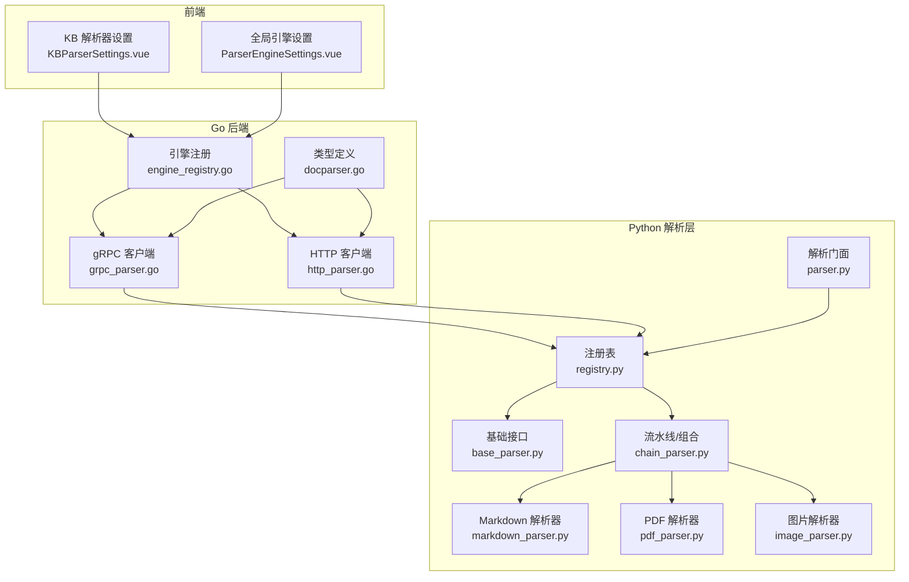
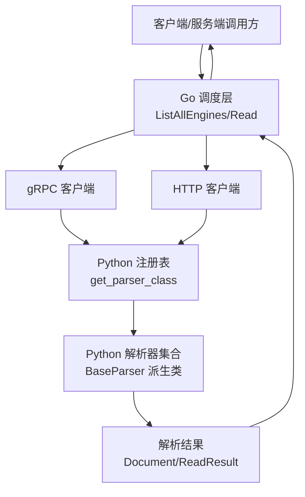
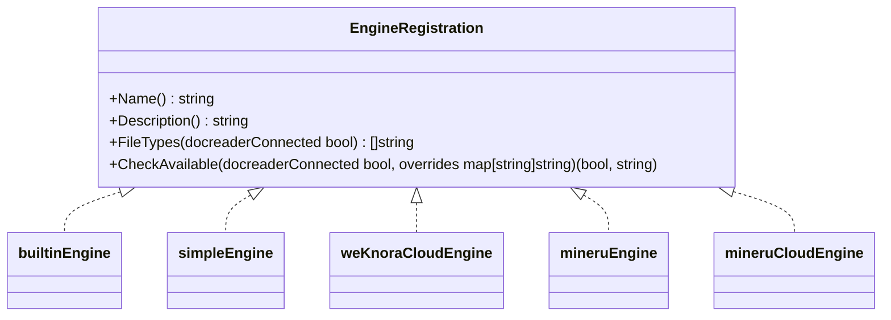
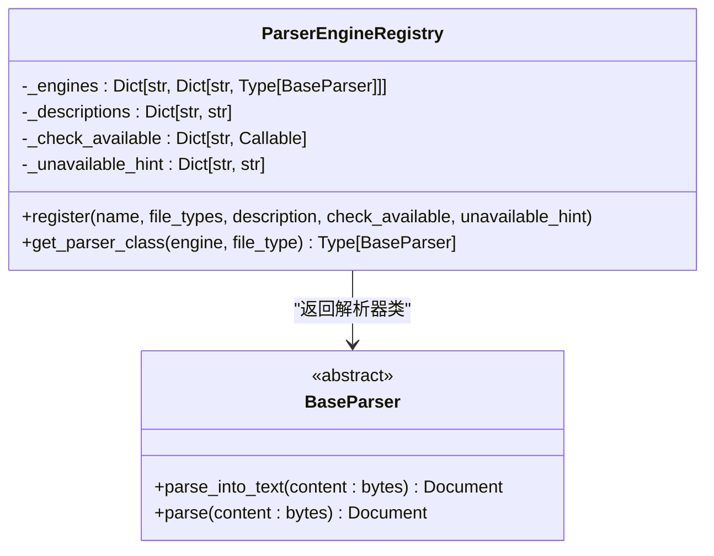
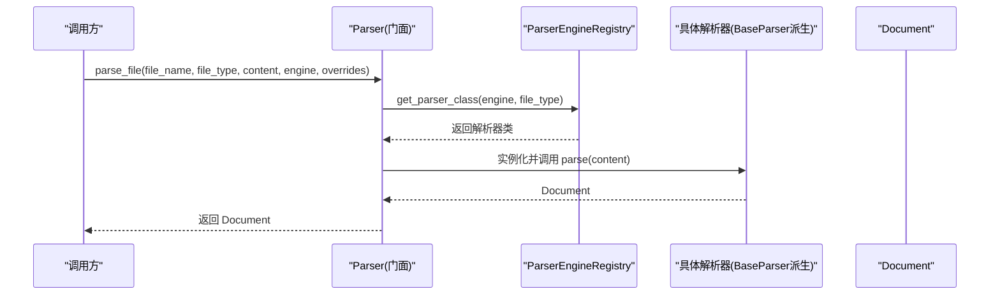
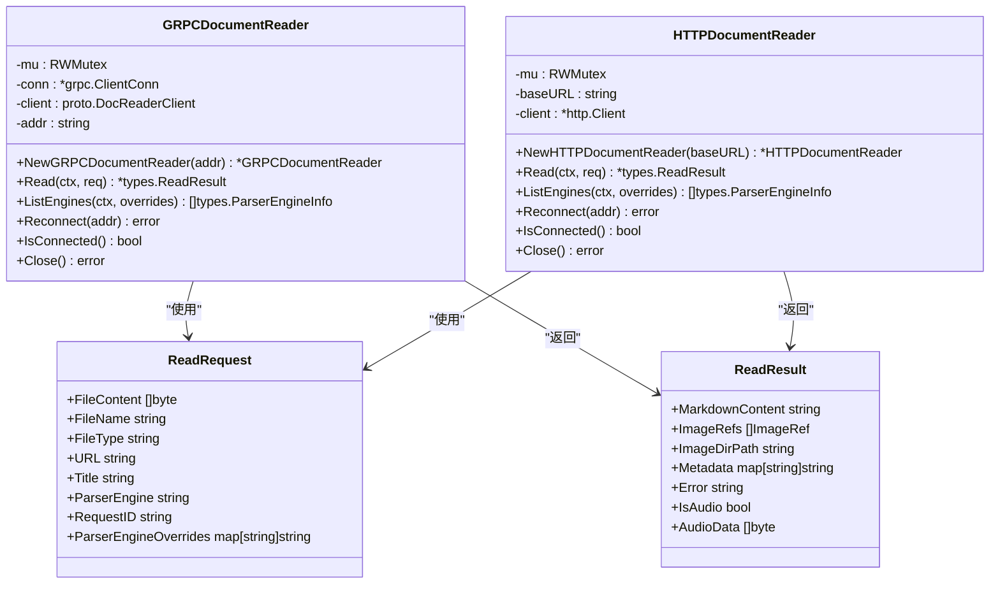
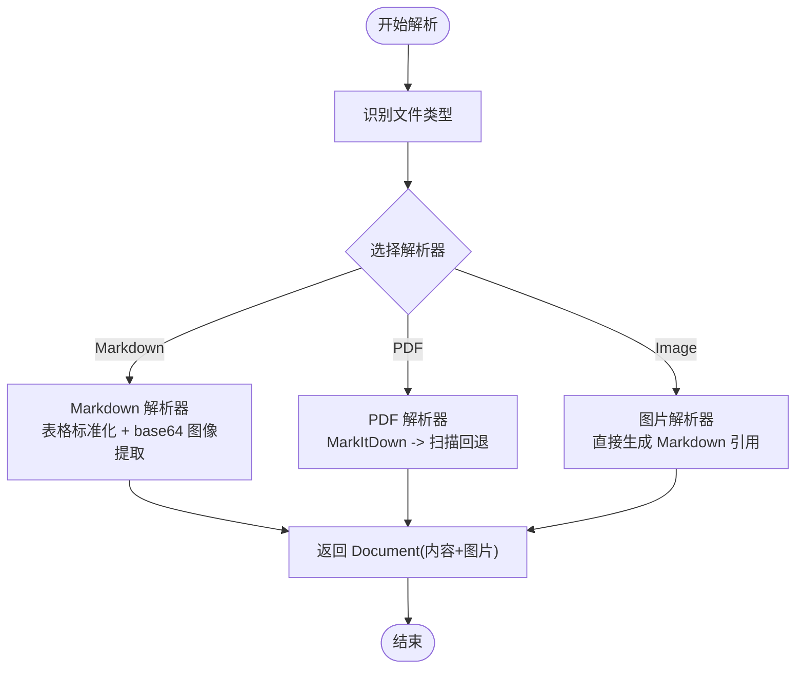
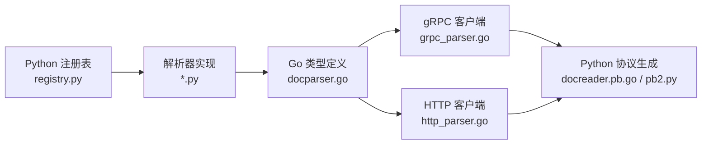

# 解析器架构设计

<cite>
**本文档引用的文件**
- [engine_registry.go](file://internal/infrastructure/docparser/engine_registry.go)
- [grpc_parser.go](file://internal/infrastructure/docparser/grpc_parser.go)
- [http_parser.go](file://internal/infrastructure/docparser/http_parser.go)
- [docparser.go](file://internal/types/docparser.go)
- [registry.py](file://docreader/parser/registry.py)
- [base_parser.py](file://docreader/parser/base_parser.py)
- [parser.py](file://docreader/parser/parser.py)
- [markdown_parser.py](file://docreader/parser/markdown_parser.py)
- [pdf_parser.py](file://docreader/parser/pdf_parser.py)
- [image_parser.py](file://docreader/parser/image_parser.py)
- [chain_parser.py](file://docreader/parser/chain_parser.py)
- [docreader.pb.go](file://docreader/proto/docreader.pb.go)
- [docreader_pb2.py](file://docreader/proto/docreader_pb2.py)
- [KBParserSettings.vue](file://frontend/src/views/knowledge/settings/KBParserSettings.vue)
- [ParserEngineSettings.vue](file://frontend/src/views/settings/ParserEngineSettings.vue)
</cite>

## 目录
1. [简介](#简介)
2. [项目结构](#项目结构)
3. [核心组件](#核心组件)
4. [架构总览](#架构总览)
5. [详细组件分析](#详细组件分析)
6. [依赖分析](#依赖分析)
7. [性能考虑](#性能考虑)
8. [故障排查指南](#故障排查指南)
9. [结论](#结论)
10. [附录](#附录)

## 简介
本文件面向架构师与高级开发者，系统化阐述 WeKnora 文档解析器的架构设计与实现要点，涵盖基础接口设计、注册机制与工厂模式、生命周期管理、错误处理策略、性能优化、扩展点与插件化、配置管理与版本兼容性、以及开发最佳实践与测试调试方法。解析器采用“Python 解析层 + Go 调度层”的分层设计：Python 层负责具体格式解析与图像提取，Go 层负责引擎注册、可用性检查、远程发现与统一调度。

## 项目结构
解析器相关代码主要分布在以下模块：
- Go 后端（引擎注册与调度）
  - 引擎注册与可用性检查：internal/infrastructure/docparser/engine_registry.go
  - gRPC 客户端封装：internal/infrastructure/docparser/grpc_parser.go
  - HTTP 客户端封装：internal/infrastructure/docparser/http_parser.go
  - 类型定义：internal/types/docparser.go
- Python 解析层
  - 基础接口与解析器门面：docreader/parser/base_parser.py, docreader/parser/parser.py
  - 注册表与默认引擎映射：docreader/parser/registry.py
  - 具体解析器实现：docreader/parser/markdown_parser.py, docreader/parser/pdf_parser.py, docreader/parser/image_parser.py
  - 解析器组合与流水线：docreader/parser/chain_parser.py
  - 协议定义（Go/Python 互操作）：docreader/proto/docreader.pb.go, docreader/proto/docreader_pb2.py
- 前端设置界面
  - 知识库解析器规则配置：frontend/src/views/knowledge/settings/KBParserSettings.vue
  - 全局解析器引擎设置：frontend/src/views/settings/ParserEngineSettings.vue

**图表来源**
- [engine_registry.go:1-194](file://internal/infrastructure/docparser/engine_registry.go#L1-L194)
- [grpc_parser.go:1-176](file://internal/infrastructure/docparser/grpc_parser.go#L1-L176)
- [http_parser.go:1-232](file://internal/infrastructure/docparser/http_parser.go#L1-L232)
- [docparser.go:1-97](file://internal/types/docparser.go#L1-L97)
- [registry.py:1-160](file://docreader/parser/registry.py#L1-L160)
- [base_parser.py:1-62](file://docreader/parser/base_parser.py#L1-L62)
- [parser.py:1-83](file://docreader/parser/parser.py#L1-L83)
- [chain_parser.py:165-179](file://docreader/parser/chain_parser.py#L165-L179)
- [markdown_parser.py:1-406](file://docreader/parser/markdown_parser.py#L1-L406)
- [pdf_parser.py:1-69](file://docreader/parser/pdf_parser.py#L1-L69)
- [image_parser.py:1-29](file://docreader/parser/image_parser.py#L1-L29)
- [KBParserSettings.vue:96-348](file://frontend/src/views/knowledge/settings/KBParserSettings.vue#L96-L348)
- [ParserEngineSettings.vue:295-455](file://frontend/src/views/settings/ParserEngineSettings.vue#L295-L455)

**章节来源**
- [engine_registry.go:1-194](file://internal/infrastructure/docparser/engine_registry.go#L1-L194)
- [grpc_parser.go:1-176](file://internal/infrastructure/docparser/grpc_parser.go#L1-L176)
- [http_parser.go:1-232](file://internal/infrastructure/docparser/http_parser.go#L1-L232)
- [docparser.go:1-97](file://internal/types/docparser.go#L1-L97)
- [registry.py:1-160](file://docreader/parser/registry.py#L1-L160)
- [base_parser.py:1-62](file://docreader/parser/base_parser.py#L1-L62)
- [parser.py:1-83](file://docreader/parser/parser.py#L1-L83)
- [chain_parser.py:165-179](file://docreader/parser/chain_parser.py#L165-L179)
- [markdown_parser.py:1-406](file://docreader/parser/markdown_parser.py#L1-L406)
- [pdf_parser.py:1-69](file://docreader/parser/pdf_parser.py#L1-L69)
- [image_parser.py:1-29](file://docreader/parser/image_parser.py#L1-L29)
- [KBParserSettings.vue:96-348](file://frontend/src/views/knowledge/settings/KBParserSettings.vue#L96-L348)
- [ParserEngineSettings.vue:295-455](file://frontend/src/views/settings/ParserEngineSettings.vue#L295-L455)

## 核心组件
- 引擎注册与可用性检查（Go）
  - EngineRegistration 接口定义引擎名称、描述、支持的文件类型、可用性检查等能力。
  - 内置本地引擎：builtin、simple、weknoracloud、mineru、mineru_cloud。
  - ListAllEngines 合并本地引擎与远程引擎，优先使用远程能力描述与文件类型，Go 侧负责可用性检查。
- 解析器注册表（Python）
  - ParserEngineRegistry 维护引擎到文件类型的映射，支持回退到内置引擎。
  - 提供 get_parser_class 解析引擎与文件类型的映射。
- 解析门面（Python）
  - Parser 封装文件/URL 解析流程，选择解析器并执行解析。
- 解析器基础接口（Python）
  - BaseParser 抽象接口，定义 parse_into_text 与 parse。
- 流水线与组合（Python）
  - PipelineParser/FirstParser 支持多阶段解析与责任链模式。
- 传输抽象（Go）
  - GRPCDocumentReader/HTTPDocumentReader 实现统一的 Read/ListEngines 接口，屏蔽底层通信细节。
- 类型定义（Go）
  - ReadRequest/ReadResult/ParserEngineInfo 等跨语言传输对象。

**章节来源**
- [engine_registry.go:9-193](file://internal/infrastructure/docparser/engine_registry.go#L9-L193)
- [registry.py:18-159](file://docreader/parser/registry.py#L18-L159)
- [parser.py:11-83](file://docreader/parser/parser.py#L11-L83)
- [base_parser.py:13-62](file://docreader/parser/base_parser.py#L13-L62)
- [chain_parser.py:165-179](file://docreader/parser/chain_parser.py#L165-L179)
- [grpc_parser.go:28-176](file://internal/infrastructure/docparser/grpc_parser.go#L28-L176)
- [http_parser.go:57-232](file://internal/infrastructure/docparser/http_parser.go#L57-L232)
- [docparser.go:3-97](file://internal/types/docparser.go#L3-L97)

## 架构总览
整体架构采用“Go 调度 + Python 解析”的分层设计。Go 层负责引擎注册、可用性检查、远程引擎发现与统一调度；Python 层负责具体格式解析与图像提取。二者通过 gRPC 或 HTTP 交互，使用统一的 ReadRequest/ReadResult 和 ParserEngineInfo 类型进行数据交换。

**图表来源**
- [engine_registry.go:140-193](file://internal/infrastructure/docparser/engine_registry.go#L140-L193)
- [grpc_parser.go:102-154](file://internal/infrastructure/docparser/grpc_parser.go#L102-L154)
- [http_parser.go:120-231](file://internal/infrastructure/docparser/http_parser.go#L120-L231)
- [registry.py:51-74](file://docreader/parser/registry.py#L51-L74)
- [parser.py:25-83](file://docreader/parser/parser.py#L25-L83)
- [docparser.go:3-25](file://internal/types/docparser.go#L3-L25)

## 详细组件分析

### 引擎注册与可用性检查（Go）
- 设计要点
  - EngineRegistration 接口统一本地引擎能力描述与可用性检查。
  - init() 中注册内置引擎，确保启动时即具备基础能力。
  - ListAllEngines 合并本地与远程引擎，远程能力优先覆盖本地描述与文件类型。
  - 可配置覆盖（overrides）用于动态注入外部服务凭据或端点。
- 生命周期
  - 初始化：注册本地引擎。
  - 运行期：根据 overrides 动态检查可用性。
  - 关闭：无需显式关闭，HTTP/gRPC 客户端在需要时建立连接。
- 错误处理
  - 可用性检查失败返回原因字符串，前端据此提示用户配置。
  - 远程引擎不可达时，本地引擎仍可工作，保证降级能力。

**图表来源**
- [engine_registry.go:9-134](file://internal/infrastructure/docparser/engine_registry.go#L9-L134)

**章节来源**
- [engine_registry.go:9-193](file://internal/infrastructure/docparser/engine_registry.go#L9-L193)

### 解析器注册表与工厂模式（Python）
- 设计要点
  - ParserEngineRegistry 维护引擎名到文件类型到解析器类的映射。
  - get_parser_class 支持按引擎名与文件类型解析，并在目标引擎不支持时回退到内置引擎。
  - 默认注册包含多种解析器（Markdown、Excel、Image、PDF 等），覆盖常见格式。
- 工厂模式
  - 通过映射表实现“按需实例化”，避免硬编码分支。
  - 结合 Python 的动态类创建能力，支持流水线解析器组合。

**图表来源**
- [registry.py:18-74](file://docreader/parser/registry.py#L18-L74)
- [base_parser.py:13-62](file://docreader/parser/base_parser.py#L13-L62)

**章节来源**
- [registry.py:18-159](file://docreader/parser/registry.py#L18-L159)
- [base_parser.py:13-62](file://docreader/parser/base_parser.py#L13-L62)

### 解析门面与流水线（Python）
- 解析门面 Parser
  - 统一入口：parse_file 与 parse_url。
  - 选择解析器：基于文件类型与引擎名，委托注册表解析。
  - 日志记录：记录解析过程与结果长度，便于可观测性。
- 流水线与组合
  - PipelineParser/FirstParser 支持多阶段解析与责任链模式，提升容错性与扩展性。
  - MarkdownParser 采用流水线：先标准化表格，再提取 base64 图像。
  - PDFParser 采用责任链：优先尝试 MarkItDown，失败则转为扫描 PDF 图像回退。

**图表来源**
- [parser.py:25-83](file://docreader/parser/parser.py#L25-L83)
- [registry.py:51-74](file://docreader/parser/registry.py#L51-L74)
- [base_parser.py:45-62](file://docreader/parser/base_parser.py#L45-L62)

**章节来源**
- [parser.py:11-83](file://docreader/parser/parser.py#L11-L83)
- [chain_parser.py:165-179](file://docreader/parser/chain_parser.py#L165-L179)
- [markdown_parser.py:376-388](file://docreader/parser/markdown_parser.py#L376-L388)
- [pdf_parser.py:57-69](file://docreader/parser/pdf_parser.py#L57-L69)

### 传输抽象与统一类型（Go）
- gRPCDocumentReader/HTTPDocumentReader
  - 统一 Read(ListEngines) 接口，屏蔽底层通信细节。
  - gRPC 支持 DNS 解析、负载均衡、消息大小限制；HTTP 支持超时与连接池。
- 类型定义
  - ReadRequest/ReadResult/ParserEngineInfo 在 Go 与 Python 间保持一致字段，确保跨语言互操作。

**图表来源**
- [grpc_parser.go:28-176](file://internal/infrastructure/docparser/grpc_parser.go#L28-L176)
- [http_parser.go:57-232](file://internal/infrastructure/docparser/http_parser.go#L57-L232)
- [docparser.go:3-25](file://internal/types/docparser.go#L3-L25)

**章节来源**
- [grpc_parser.go:28-176](file://internal/infrastructure/docparser/grpc_parser.go#L28-L176)
- [http_parser.go:57-232](file://internal/infrastructure/docparser/http_parser.go#L57-L232)
- [docparser.go:3-97](file://internal/types/docparser.go#L3-L97)

### 具体解析器实现
- Markdown 解析器
  - 标准化表格格式，提取 base64 图像并替换为路径引用，返回图像数据字典以便后续存储。
- PDF 解析器
  - 责任链模式：优先 MarkItDown，失败则转为扫描 PDF 回退，将每页转换为 PNG 图像并生成 Markdown 引用。
- 图片解析器
  - 直接将图片封装为 Markdown 引用，并将原始二进制以 base64 形式返回，交由 Go 侧处理存储。

**图表来源**
- [markdown_parser.py:127-388](file://docreader/parser/markdown_parser.py#L127-L388)
- [pdf_parser.py:13-69](file://docreader/parser/pdf_parser.py#L13-L69)
- [image_parser.py:11-29](file://docreader/parser/image_parser.py#L11-L29)

**章节来源**
- [markdown_parser.py:127-388](file://docreader/parser/markdown_parser.py#L127-L388)
- [pdf_parser.py:13-69](file://docreader/parser/pdf_parser.py#L13-L69)
- [image_parser.py:11-29](file://docreader/parser/image_parser.py#L11-L29)

## 依赖分析
- 组件耦合
  - Go 层对 Python 层仅通过协议定义交互，耦合度低。
  - Python 层通过注册表解耦具体解析器，便于扩展新格式。
- 外部依赖
  - gRPC/HTTP 客户端依赖标准库与第三方库，注意版本兼容性。
  - PDF 解析依赖 pdfplumber，图像处理依赖 base64 编解码。
- 循环依赖
  - 当前结构未见循环依赖，Go 类型与 Python 协议通过 protobuf 生成代码解耦。

**图表来源**
- [docparser.go:3-97](file://internal/types/docparser.go#L3-L97)
- [grpc_parser.go:1-176](file://internal/infrastructure/docparser/grpc_parser.go#L1-L176)
- [http_parser.go:1-232](file://internal/infrastructure/docparser/http_parser.go#L1-L232)
- [docreader.pb.go:370-416](file://docreader/proto/docreader.pb.go#L370-L416)
- [docreader_pb2.py:50-63](file://docreader/proto/docreader_pb2.py#L50-L63)
- [registry.py:1-160](file://docreader/parser/registry.py#L1-L160)

**章节来源**
- [docparser.go:3-97](file://internal/types/docparser.go#L3-L97)
- [grpc_parser.go:1-176](file://internal/infrastructure/docparser/grpc_parser.go#L1-L176)
- [http_parser.go:1-232](file://internal/infrastructure/docparser/http_parser.go#L1-L232)
- [docreader.pb.go:370-416](file://docreader/proto/docreader.pb.go#L370-L416)
- [docreader_pb2.py:50-63](file://docreader/proto/docreader_pb2.py#L50-L63)
- [registry.py:1-160](file://docreader/parser/registry.py#L1-L160)

## 性能考虑
- 连接与超时
  - gRPC：启用 DNS 解析、轮询负载均衡、设置最大消息大小，减少大文件传输失败。
  - HTTP：配置连接池与超时，避免长时间阻塞。
- 解析器选择
  - 优先选择轻量级解析器（如 simple），避免不必要的外部服务调用。
  - 对复杂格式（PDF/Doc）使用专用解析器，但注意失败回退成本。
- 图像处理
  - base64 图像提取与替换应避免重复处理，尽量在流水线中一次性完成。
  - 扫描 PDF 回退会产生大量图像，建议控制分辨率与页数上限。
- 日志与可观测性
  - 记录解析耗时与结果长度，便于定位性能瓶颈。

[本节为通用性能建议，无需特定文件来源]

## 故障排查指南
- 连接失败
  - gRPC：检查地址与证书配置，确认 DNS 解析可用。
  - HTTP：检查 baseURL 与网络连通性，关注状态码与响应体。
- 引擎不可用
  - 查看 ListAllEngines 返回的 UnavailableReason，按提示补充凭据或端点。
  - 前端“测试连接”按钮可快速验证当前引擎状态。
- 解析结果为空
  - 检查文件类型是否受支持，必要时切换到回退引擎。
  - 对于扫描 PDF，确认回退逻辑是否生效。
- 错误日志
  - Python 解析器与 Go 客户端均输出详细日志，结合 RequestID 定位问题。

**章节来源**
- [grpc_parser.go:46-83](file://internal/infrastructure/docparser/grpc_parser.go#L46-L83)
- [http_parser.go:120-164](file://internal/infrastructure/docparser/http_parser.go#L120-L164)
- [engine_registry.go:150-193](file://internal/infrastructure/docparser/engine_registry.go#L150-L193)
- [parser.py:25-83](file://docreader/parser/parser.py#L25-L83)
- [ParserEngineSettings.vue:422-455](file://frontend/src/views/settings/ParserEngineSettings.vue#L422-L455)

## 结论
WeKnora 解析器架构通过“Go 调度 + Python 解析”的分层设计实现了高内聚、低耦合的可扩展系统。注册机制与工厂模式使新增解析器变得简单；流水线与责任链提升了容错性；统一的传输抽象与类型定义保障了跨语言互操作。配合完善的前端配置与可观测性，能够满足复杂场景下的文档解析需求。

[本节为总结性内容，无需特定文件来源]

## 附录

### 配置管理与版本兼容
- 配置项
  - 引擎覆盖参数（overrides）：用于注入外部服务凭据或端点。
  - 最大消息大小环境变量：控制 gRPC 传输上限。
- 版本兼容
  - ParserEngineInfo 字段在 Go 与 Python 保持一致，避免协议变更导致的兼容问题。
  - 远程引擎优先覆盖本地描述与文件类型，确保新能力自动生效。

**章节来源**
- [engine_registry.go:150-193](file://internal/infrastructure/docparser/engine_registry.go#L150-L193)
- [grpc_parser.go:19-26](file://internal/infrastructure/docparser/grpc_parser.go#L19-L26)
- [docreader.pb.go:370-416](file://docreader/proto/docreader.pb.go#L370-L416)
- [docreader_pb2.py:50-63](file://docreader/proto/docreader_pb2.py#L50-L63)

### 开发最佳实践
- 新增解析器
  - 在 Python 层实现 BaseParser 子类，完善 parse_into_text。
  - 在注册表中添加文件类型映射，必要时提供回退策略。
- 新增引擎
  - 在 Go 层实现 EngineRegistration 接口，注册到 init()。
  - 提供可用性检查与描述信息，确保前端正确展示。
- 测试与调试
  - 使用前端“测试连接”功能验证引擎可用性。
  - 通过日志与 RequestID 追踪解析流程，定位异常。

**章节来源**
- [base_parser.py:13-62](file://docreader/parser/base_parser.py#L13-L62)
- [registry.py:32-49](file://docreader/parser/registry.py#L32-L49)
- [engine_registry.go:22-33](file://internal/infrastructure/docparser/engine_registry.go#L22-L33)
- [ParserEngineSettings.vue:422-455](file://frontend/src/views/settings/ParserEngineSettings.vue#L422-L455)