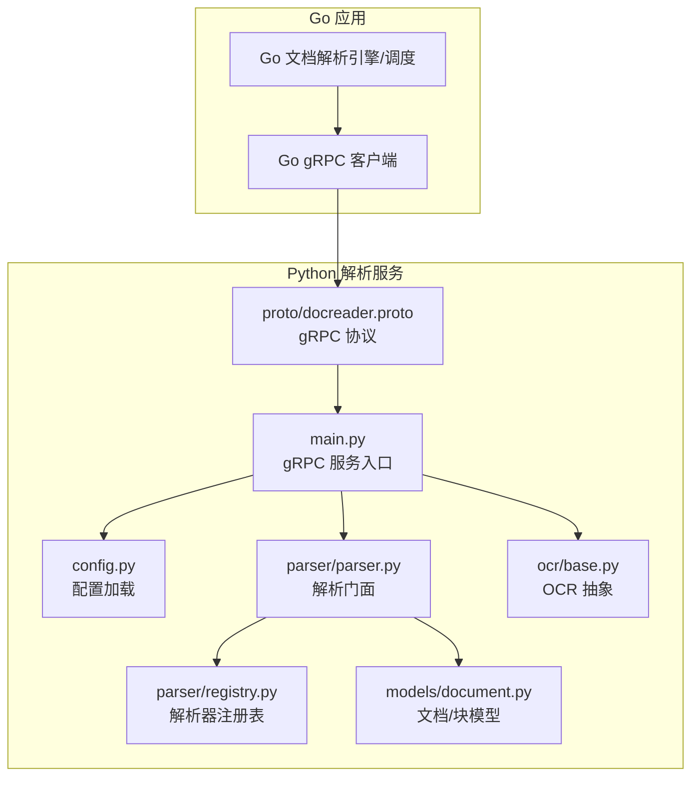
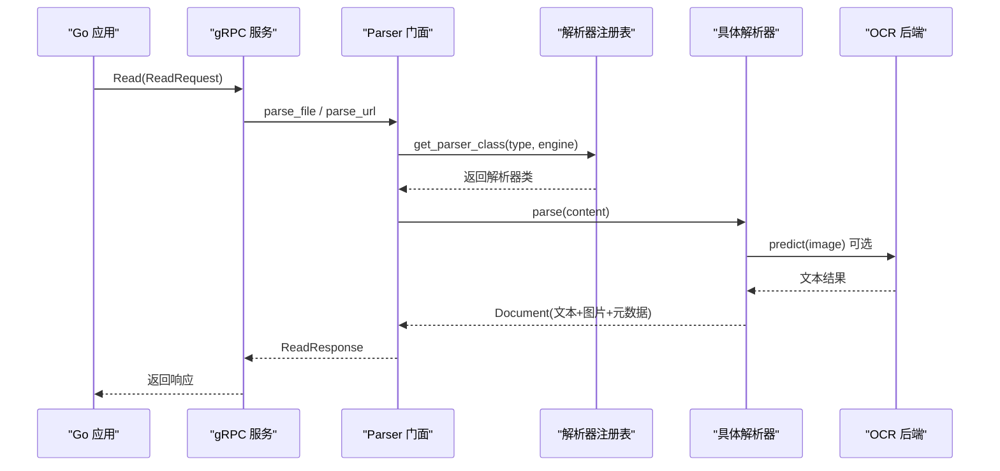
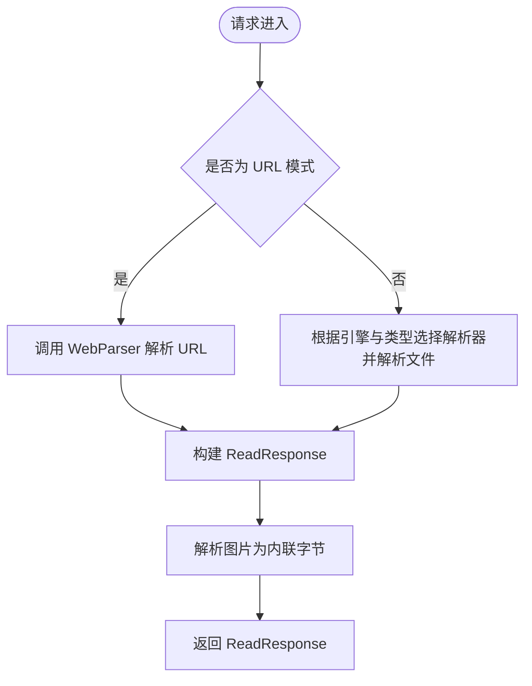
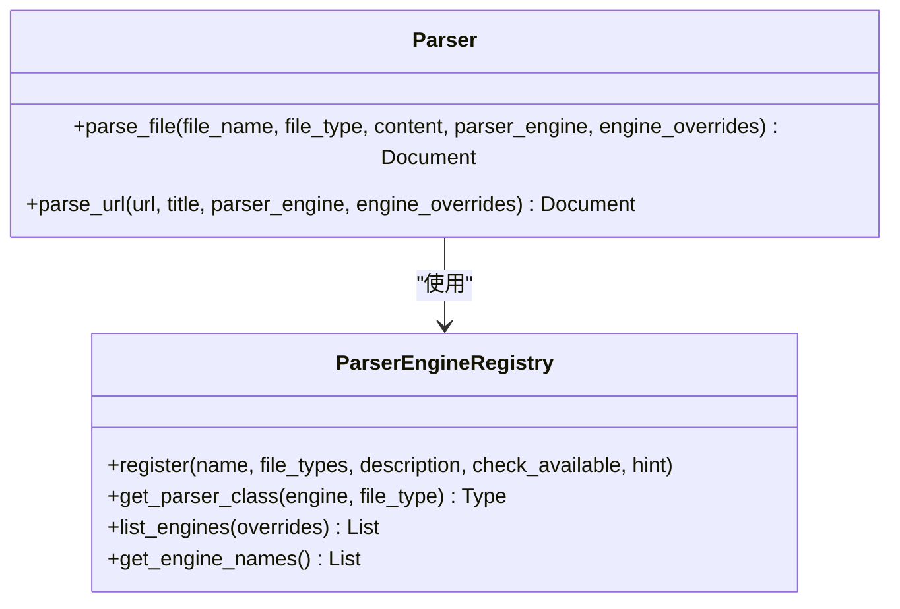
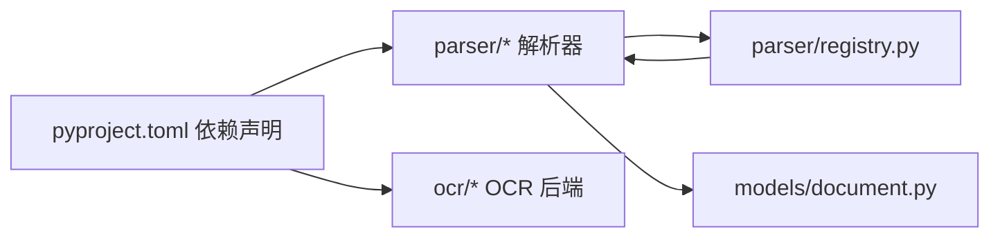

# 文档解析系统

<cite>
**本文引用的文件**
- [docreader/main.py](file://docreader/main.py)
- [docreader/config.py](file://docreader/config.py)
- [docreader/README.md](file://docreader/README.md)
- [docreader/proto/docreader.proto](file://docreader/proto/docreader.proto)
- [docreader/pyproject.toml](file://docreader/pyproject.toml)
- [docreader/parser/__init__.py](file://docreader/parser/__init__.py)
- [docreader/parser/parser.py](file://docreader/parser/parser.py)
- [docreader/parser/registry.py](file://docreader/parser/registry.py)
- [docreader/ocr/base.py](file://docreader/ocr/base.py)
- [docreader/models/document.py](file://docreader/models/document.py)
</cite>

## 目录
1. [简介](#简介)
2. [项目结构](#项目结构)
3. [核心组件](#核心组件)
4. [架构总览](#架构总览)
5. [详细组件分析](#详细组件分析)
6. [依赖关系分析](#依赖关系分析)
7. [性能考虑](#性能考虑)
8. [故障排除指南](#故障排除指南)
9. [结论](#结论)
10. [附录](#附录)

## 简介
WeKnora 文档解析系统是一个基于 Python 的文档解析服务，通过 gRPC 提供统一的文档读取与结构化输出能力。系统支持多种文档格式（PDF、Word、Markdown、Excel、图片、网页等），并提供 OCR 识别、多模态理解（VLM）、元数据提取与质量控制等能力。解析结果以 Markdown 文本与图片引用的形式返回，便于后续索引与检索。

该服务由 Go 应用作为前端控制器，Python 服务负责具体解析逻辑，二者通过 gRPC 协议交互。Python 侧采用线程池并发模型，支持多请求并发处理；解析器通过注册表动态选择引擎，具备良好的扩展性。

## 项目结构
docreader 目录是本次文档重点，包含以下关键子模块：
- 服务入口与 gRPC 实现：main.py、proto/docreader.proto
- 配置加载：config.py
- 解析器集合：parser/（含注册表、各类解析器）
- OCR 后端抽象与实现：ocr/
- 数据模型：models/document.py
- 依赖声明：pyproject.toml
- 使用说明：README.md

图表来源
- [docreader/main.py:184-215](file://docreader/main.py#L184-L215)
- [docreader/config.py:66-97](file://docreader/config.py#L66-L97)
- [docreader/parser/registry.py:112-161](file://docreader/parser/registry.py#L112-L161)
- [docreader/parser/parser.py:11-83](file://docreader/parser/parser.py#L11-L83)
- [docreader/ocr/base.py:10-32](file://docreader/ocr/base.py#L10-L32)
- [docreader/models/document.py:62-88](file://docreader/models/document.py#L62-L88)
- [docreader/proto/docreader.proto:7-62](file://docreader/proto/docreader.proto#L7-L62)

章节来源
- [docreader/main.py:1-215](file://docreader/main.py#L1-L215)
- [docreader/config.py:1-122](file://docreader/config.py#L1-L122)
- [docreader/README.md:1-252](file://docreader/README.md#L1-L252)
- [docreader/proto/docreader.proto:1-62](file://docreader/proto/docreader.proto#L1-L62)
- [docreader/pyproject.toml:1-40](file://docreader/pyproject.toml#L1-L40)

## 核心组件
- gRPC 服务与健康检查：服务端初始化、线程池并发、消息长度限制、健康检查注册。
- 解析门面 Parser：根据文件类型与引擎选择器，委派给具体解析器；支持文件模式与 URL 模式。
- 解析器注册表 Registry：按引擎名与文件类型映射解析器类，自动回退至内置引擎。
- OCR 抽象与实现：定义统一 OCR 接口，提供空实现用于禁用 OCR。
- 数据模型 Document/Chunk：标准化文档内容、图片引用、元数据与分块结构。
- 配置系统：从环境变量加载 gRPC 参数、代理、图片输出目录等。

章节来源
- [docreader/main.py:98-182](file://docreader/main.py#L98-L182)
- [docreader/parser/parser.py:11-83](file://docreader/parser/parser.py#L11-L83)
- [docreader/parser/registry.py:18-110](file://docreader/parser/registry.py#L18-L110)
- [docreader/ocr/base.py:10-32](file://docreader/ocr/base.py#L10-L32)
- [docreader/models/document.py:62-88](file://docreader/models/document.py#L62-L88)
- [docreader/config.py:66-97](file://docreader/config.py#L66-L97)

## 架构总览
系统采用“Go 控制层 + Python 解析层”的双层架构。Go 应用负责路由、鉴权、任务编排与存储对接，Python 服务专注于文档解析与结构化输出。两者通过 gRPC 协议通信，协议定义位于 docreader.proto。

图表来源
- [docreader/main.py:103-167](file://docreader/main.py#L103-L167)
- [docreader/parser/parser.py:25-83](file://docreader/parser/parser.py#L25-L83)
- [docreader/parser/registry.py:51-76](file://docreader/parser/registry.py#L51-L76)
- [docreader/ocr/base.py:10-32](file://docreader/ocr/base.py#L10-L32)
- [docreader/proto/docreader.proto:20-45](file://docreader/proto/docreader.proto#L20-L45)

## 详细组件分析

### gRPC 服务与并发处理
- 服务端使用线程池并发执行请求，默认工作线程数来自配置；设置发送/接收消息最大长度以限制文件大小。
- Read 方法支持两种模式：文件模式（file_content + file_type）与 URL 模式（url + title）。
- 图片处理：将 base64 或字节形式的图片解码为内联字节，返回给 Go 应用进行持久化。
- 错误处理：捕获异常并记录堆栈，返回错误信息；日志包含请求 ID 以便追踪。

图表来源
- [docreader/main.py:103-167](file://docreader/main.py#L103-L167)
- [docreader/main.py:54-95](file://docreader/main.py#L54-L95)

章节来源
- [docreader/main.py:184-215](file://docreader/main.py#L184-L215)
- [docreader/main.py:98-182](file://docreader/main.py#L98-L182)

### 解析门面 Parser
- 统一入口：parse_file 与 parse_url 分别处理本地文件与远程网页。
- 引擎选择：通过注册表按引擎名与文件类型解析器类，若指定引擎不支持则回退到内置引擎。
- 结果校验：对空内容进行告警并记录日志。

图表来源
- [docreader/parser/parser.py:11-83](file://docreader/parser/parser.py#L11-L83)
- [docreader/parser/registry.py:18-110](file://docreader/parser/registry.py#L18-L110)

章节来源
- [docreader/parser/parser.py:11-83](file://docreader/parser/parser.py#L11-L83)
- [docreader/parser/registry.py:18-110](file://docreader/parser/registry.py#L18-L110)

### 解析器注册表与引擎
- 内置引擎：覆盖 docx、doc、pdf、md/markdown、xlsx/xls、常见图片格式等。
- MarkItDown 引擎：覆盖 md/markdown、pdf、doc/docx、ppt/pptx、xlsx/xls、csv 等。
- 可插拔扩展：通过 register 注册新引擎，支持可用性检测与原因提示。
- 回退策略：当指定引擎不支持某类型时自动回退到内置引擎。

章节来源
- [docreader/parser/registry.py:112-161](file://docreader/parser/registry.py#L112-L161)

### OCR 识别与多模态
- OCR 抽象：定义 predict 接口，支持传入路径、字节或 PIL 图像对象。
- 空实现：DummyOCRBackend 返回空字符串，用于禁用 OCR。
- 配置项：可通过环境变量选择后端（paddle/no_ocr/api）及 VLM 模型参数。

章节来源
- [docreader/ocr/base.py:10-32](file://docreader/ocr/base.py#L10-L32)
- [docreader/README.md:80-104](file://docreader/README.md#L80-L104)

### 数据模型与结构化输出
- Document：包含文本内容、图片映射、分块列表与元数据。
- Chunk：分块内容、顺序、起止位置与块内图片列表。
- 输出约定：服务返回 Markdown 文本、图片引用列表与元数据字典；图片以内联字节形式返回，由 Go 应用负责持久化。

章节来源
- [docreader/models/document.py:62-88](file://docreader/models/document.py#L62-L88)

### 协议定义与客户端集成
- 协议：DocReader 服务包含 Read 与 ListEngines 两个 RPC；ReadConfig 支持引擎选择与覆盖参数。
- 请求体：ReadRequest 支持文件模式（file_content + file_name + file_type）与 URL 模式（url + title）。
- 响应体：ReadResponse 返回 markdown_content、image_refs、image_dir_path、metadata 与 error。
- 列表引擎：ListEnginesResponse 返回各引擎的可用性与描述。

章节来源
- [docreader/proto/docreader.proto:7-62](file://docreader/proto/docreader.proto#L7-L62)

## 依赖关系分析
- Python 依赖：gRPC、lxml、pdfplumber、pypdf、python-docx、pillow、playwright、markitdown、paddleocr、ollama/openai、minio/oss/cos 等。
- 模块耦合：Parser 依赖 Registry；Registry 依赖各解析器实现；OCR 抽象被解析器按需调用；Document 作为跨模块的数据契约。
- 外部接口：MinIO/OSS/COS 对象存储（通过 Go 应用），OCR/VLM 外部 API（通过环境变量配置）。

图表来源
- [docreader/pyproject.toml:7-39](file://docreader/pyproject.toml#L7-L39)
- [docreader/parser/__init__.py:16-38](file://docreader/parser/__init__.py#L16-L38)
- [docreader/ocr/base.py:10-32](file://docreader/ocr/base.py#L10-L32)
- [docreader/models/document.py:62-88](file://docreader/models/document.py#L62-L88)
- [docreader/parser/registry.py:18-110](file://docreader/parser/registry.py#L18-L110)

章节来源
- [docreader/pyproject.toml:1-40](file://docreader/pyproject.toml#L1-L40)
- [docreader/parser/__init__.py:1-39](file://docreader/parser/__init__.py#L1-L39)

## 性能考虑
- 并发模型：使用线程池处理请求，线程数由配置决定；适合 I/O 密集型场景（网络抓取、OCR/VLM 调用）。
- 文件大小限制：通过 gRPC 选项限制最大消息长度，避免内存压力。
- 图片处理：将图片解码为内联字节返回，减少额外网络往返；最终持久化由 Go 应用完成。
- 引擎选择：优先选择更高效的引擎（如 MarkItDown 对多种格式有良好支持），并在注册表中按需启用。
- 代理与网络：支持 HTTP/HTTPS 代理，降低外部服务访问延迟与失败率。

章节来源
- [docreader/main.py:187-193](file://docreader/main.py#L187-L193)
- [docreader/config.py:69-97](file://docreader/config.py#L69-L97)
- [docreader/README.md:139-149](file://docreader/README.md#L139-L149)

## 故障排除指南
- 服务无法启动或健康检查失败：检查 gRPC 端口与线程池配置；确认日志级别与请求 ID 上下文。
- OCR 相关错误：可通过环境变量禁用 OCR 或切换后端；检查 OCR API 基础地址与密钥。
- 图片无法显示：确认 MinIO 公网访问地址配置正确，避免使用 localhost；确保端口映射与防火墙放行。
- 文件上传失败：核对 MAX_FILE_SIZE_MB 配置，确保前后端一致；检查磁盘空间与临时目录权限。
- 引擎不可用：通过 ListEngines 查询引擎可用性与原因；根据提示修复依赖或网络。

章节来源
- [docreader/main.py:168-182](file://docreader/main.py#L168-L182)
- [docreader/README.md:205-237](file://docreader/README.md#L205-L237)

## 结论
WeKnora 文档解析系统通过清晰的模块划分与 gRPC 接口，实现了对多格式文档的统一解析与结构化输出。其注册表机制提供了良好的扩展性，结合 OCR/VLM 能力与质量控制策略，能够满足复杂场景下的文档处理需求。建议在生产环境中合理配置并发与资源限制，并通过健康检查与日志监控保障稳定性。

## 附录

### gRPC 接口定义摘要
- 服务：DocReader
- 方法：
  - Read(ReadRequest) → ReadResponse
  - ListEngines(ListEnginesRequest) → ListEnginesResponse
- 关键字段：
  - ReadRequest：file_content、file_name、file_type、url、title、config、request_id
  - ReadResponse：markdown_content、image_refs、image_dir_path、metadata、error
  - ListEnginesResponse：engines（name、description、file_types、available、unavailable_reason）

章节来源
- [docreader/proto/docreader.proto:7-62](file://docreader/proto/docreader.proto#L7-L62)

### 配置项一览（环境变量）
- gRPC：DOCREADER_GRPC_MAX_WORKERS、DOCREADER_GRPC_PORT、DOCREADER_GRPC_MAX_FILE_SIZE_MB
- 解析：DOCREADER_DOCX_MAX_PAGES
- 代理：DOCREADER_EXTERNAL_HTTP_PROXY、DOCREADER_EXTERNAL_HTTPS_PROXY
- 图片输出：DOCREADER_IMAGE_OUTPUT_DIR
- OCR/VLM：OCR_BACKEND、OCR_API_BASE_URL、OCR_API_KEY、OCR_MODEL、VLM_MODEL_BASE_URL、VLM_MODEL_NAME、VLM_MODEL_API_KEY、VLM_INTERFACE_TYPE
- 存储：STORAGE_TYPE、MINIO_*、COS_*、OSS_* 等

章节来源
- [docreader/config.py:66-97](file://docreader/config.py#L66-L97)
- [docreader/README.md:75-149](file://docreader/README.md#L75-L149)