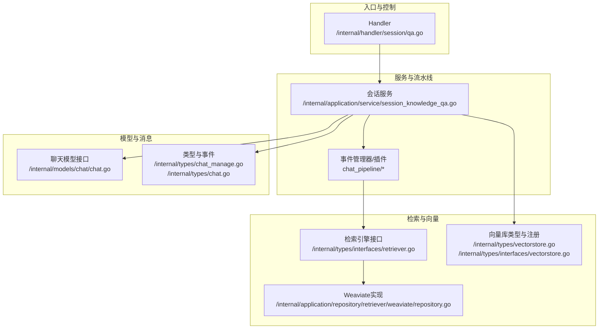
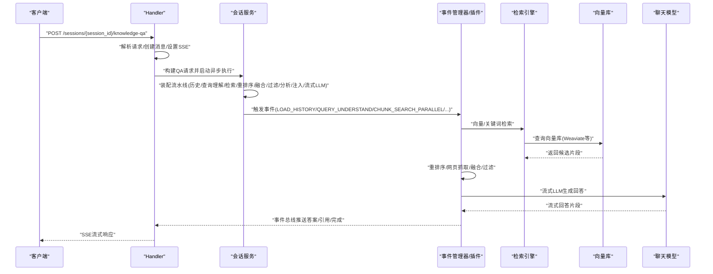
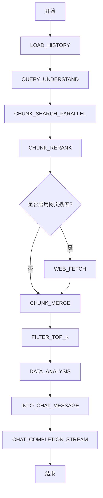
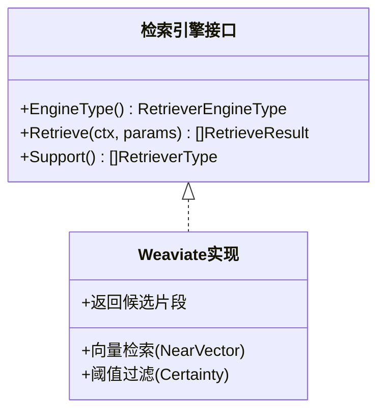
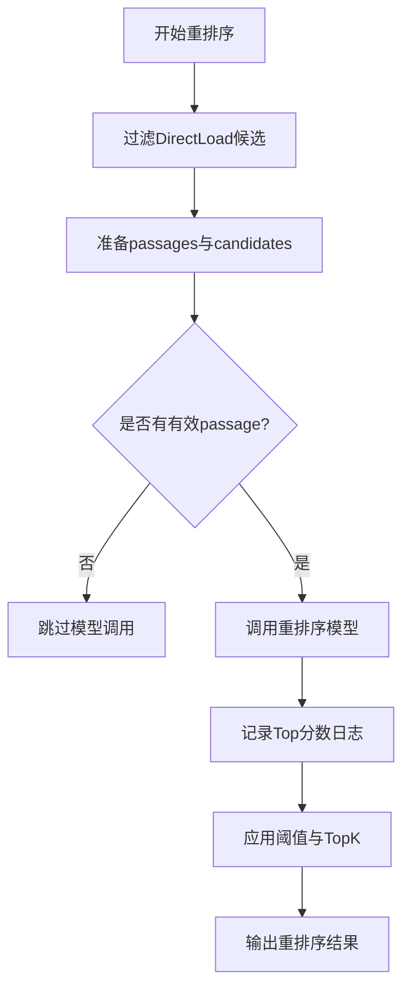
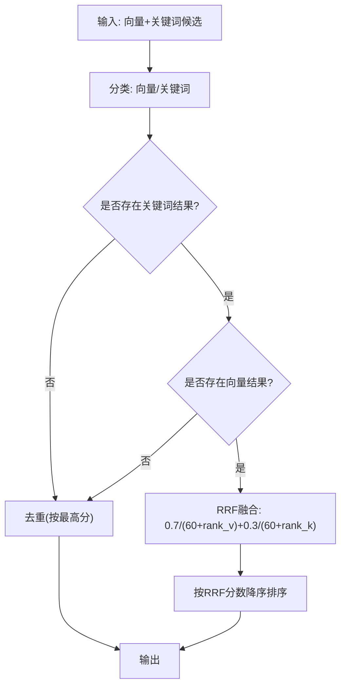
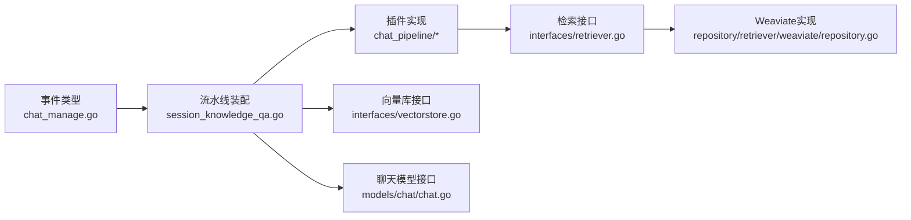

# Quick Q&A模式

<cite>
**本文引用的文件**
- [session_knowledge_qa.go](file://internal/application/service/session_knowledge_qa.go)
- [knowledgebase_search_fusion.go](file://internal/application/service/knowledgebase_search_fusion.go)
- [qa.go](file://internal/handler/session/qa.go)
- [chat.go](file://internal/models/chat/chat.go)
- [chat_manage.go](file://internal/types/chat_manage.go)
- [retrieval_config.go](file://internal/types/retrieval_config.go)
- [interfaces/retriever.go](file://internal/types/interfaces/retriever.go)
- [interfaces/vectorstore.go](file://internal/types/interfaces/vectorstore.go)
- [vectorstore.go](file://internal/types/vectorstore.go)
- [repository/retriever/weaviate/repository.go](file://internal/application/repository/retriever/weaviate/repository.go)
- [chat_pipeline/rerank.go](file://internal/application/service/chat_pipeline/rerank.go)
- [chat.go](file://internal/types/chat.go)
</cite>

## 目录
1. [简介](#简介)
2. [项目结构](#项目结构)
3. [核心组件](#核心组件)
4. [架构总览](#架构总览)
5. [详细组件分析](#详细组件分析)
6. [依赖分析](#依赖分析)
7. [性能考虑](#性能考虑)
8. [故障排查指南](#故障排查指南)
9. [结论](#结论)
10. [附录](#附录)

## 简介
本文件为WeKnora Quick Q&A模式的完整技术文档，聚焦“检索增强生成”（RAG）管道的设计与实现，覆盖检索策略、重排序机制、结果融合与合并、查询理解、上下文窗口优化、响应生成、性能优化、缓存与并发、质量评估与参数调优、错误处理与最佳实践。文档面向开发者，提供可操作的实现指南与定制化配置建议。

## 项目结构
Quick Q&A模式位于后端服务层，通过HTTP入口接收请求，经由会话服务组装RAG流水线，按阶段触发事件插件执行具体任务，并通过事件总线向前端以SSE方式流式输出答案与引用信息。关键模块包括：
- Handler层：解析请求、准备上下文、建立SSE流、异步执行服务
- Service层：构建ChatManage、动态装配事件流水线、触发事件、回退策略
- Pipeline插件：事件驱动的各阶段实现（历史加载、查询理解、并行检索、重排序、网页抓取、结果融合、过滤TopK、数据分析、消息注入、流式LLM）
- 检索引擎与向量库：抽象检索引擎接口、Weaviate实现、向量存储注册与连接测试
- 类型与配置：检索参数、聊天消息、事件类型、向量库元数据

图表来源
- [qa.go:463-658](file://internal/handler/session/qa.go#L463-L658)
- [session_knowledge_qa.go:21-224](file://internal/application/service/session_knowledge_qa.go#L21-L224)
- [interfaces/retriever.go:10-20](file://internal/types/interfaces/retriever.go#L10-L20)
- [repository/retriever/weaviate/repository.go:561-596](file://internal/application/repository/retriever/weaviate/repository.go#L561-L596)
- [interfaces/vectorstore.go:12-24](file://internal/types/interfaces/vectorstore.go#L12-L24)
- [chat.go:82-94](file://internal/models/chat/chat.go#L82-L94)

章节来源
- [qa.go:463-658](file://internal/handler/session/qa.go#L463-L658)
- [session_knowledge_qa.go:21-224](file://internal/application/service/session_knowledge_qa.go#L21-L224)

## 核心组件
- 事件类型与流水线装配
  - 事件类型枚举定义了RAG流水线的阶段：历史加载、查询理解、并行检索、重排序、网页抓取、结果融合、过滤TopK、数据分析、消息注入、流式LLM等。
  - 会话服务根据是否需要RAG（存在知识库或开启网页搜索）动态装配流水线，纯聊天路径仅包含历史加载、内存检索/存储与流式LLM。
- ChatManage与参数
  - 统一承载请求、检索参数、模型ID、重写后的查询、图像描述、引用上下文、事件总线、消息ID等，贯穿整个流水线。
  - 检索参数来自全局租户配置与内置默认值，支持向量阈值、关键词阈值、TopK、重排序阈值与TopK等。
- 事件驱动的插件化实现
  - 插件注册在事件管理器中，按阶段触发；每个阶段负责特定职责（如向量检索、重排序、网页抓取、结果融合等）。
- 结果融合与去重
  - 支持向量与关键词两种检索器混合（RRF）或单一检索器（去重保留最高分）。
- 回退策略
  - 当检索为空或失败时，支持固定回复或基于模型的回退流式生成。

章节来源
- [chat_manage.go:228-247](file://internal/types/chat_manage.go#L228-L247)
- [session_knowledge_qa.go:93-139](file://internal/application/service/session_knowledge_qa.go#L93-L139)
- [retrieval_config.go:8-27](file://internal/types/retrieval_config.go#L8-L27)
- [knowledgebase_search_fusion.go:12-49](file://internal/application/service/knowledgebase_search_fusion.go#L12-L49)

## 架构总览
Quick Q&A的端到端流程如下：

图表来源
- [qa.go:463-658](file://internal/handler/session/qa.go#L463-L658)
- [session_knowledge_qa.go:172-186](file://internal/application/service/session_knowledge_qa.go#L172-L186)
- [chat_pipeline/rerank.go:36-61](file://internal/application/service/chat_pipeline/rerank.go#L36-L61)
- [repository/retriever/weaviate/repository.go:561-596](file://internal/application/repository/retriever/weaviate/repository.go#L561-L596)

## 详细组件分析

### 事件流水线与阶段职责
- LOAD_HISTORY：加载历史消息，用于上下文增强。
- QUERY_UNDERSTAND：对原始查询进行改写与意图理解（可选）。
- CHUNK_SEARCH_PARALLEL：并行执行向量与关键词检索，支持多知识库/文件组合。
- CHUNK_RERANK：使用重排序模型对候选片段打分并排序。
- WEB_FETCH：可选的网页抓取与结果注入。
- CHUNK_MERGE：将向量与关键词结果按类型分类与融合。
- FILTER_TOP_K：按阈值与TopK过滤最终结果。
- DATA_ANALYSIS：对结果进行统计/可视化等分析（可选）。
- INTO_CHAT_MESSAGE：将最终引用与上下文注入到聊天消息。
- CHAT_COMPLETION_STREAM：流式调用LLM生成最终回答。

图表来源
- [session_knowledge_qa.go:172-186](file://internal/application/service/session_knowledge_qa.go#L172-L186)
- [chat_manage.go:228-247](file://internal/types/chat_manage.go#L228-L247)

章节来源
- [session_knowledge_qa.go:172-186](file://internal/application/service/session_knowledge_qa.go#L172-L186)
- [chat_manage.go:228-247](file://internal/types/chat_manage.go#L228-L247)

### 检索策略与向量相似度计算
- 向量检索
  - 通过Weaviate等引擎执行近似最近邻搜索，使用向量相似度阈值与TopK限制候选数量。
  - 返回的候选片段包含匹配类型（如向量匹配）、内容与元数据，供后续重排序与融合使用。
- 关键词匹配
  - 支持关键词检索作为补充，与向量检索并行执行，随后统一进入融合阶段。
- 检索参数
  - 来自租户级检索配置与默认值，包括EmbeddingTopK、VectorThreshold、KeywordThreshold、RerankTopK、RerankThreshold等。

图表来源
- [interfaces/retriever.go:10-20](file://internal/types/interfaces/retriever.go#L10-L20)
- [repository/retriever/weaviate/repository.go:561-596](file://internal/application/repository/retriever/weaviate/repository.go#L561-L596)

章节来源
- [repository/retriever/weaviate/repository.go:561-596](file://internal/application/repository/retriever/weaviate/repository.go#L561-L596)
- [interfaces/retriever.go:10-20](file://internal/types/interfaces/retriever.go#L10-L20)
- [retrieval_config.go:14-27](file://internal/types/retrieval_config.go#L14-L27)

### 重排序机制
- 输入：候选片段集合（排除直接加载类型），准备为重排序模型输入。
- 执行：调用重排序模型对查询与候选片段进行相关性评分。
- 输出：按重排序分数降序排列的候选列表，结合阈值与TopK进一步筛选。

图表来源
- [chat_pipeline/rerank.go:73-264](file://internal/application/service/chat_pipeline/rerank.go#L73-L264)

章节来源
- [chat_pipeline/rerank.go:36-61](file://internal/application/service/chat_pipeline/rerank.go#L36-L61)
- [chat_pipeline/rerank.go:238-264](file://internal/application/service/chat_pipeline/rerank.go#L238-L264)

### 结果融合与合并算法
- 分类：将检索结果按向量与关键词两类分离。
- 融合策略：
  - 仅向量或仅关键词：按最高分去重，保留每chunk最高分。
  - 向量+关键词：采用RRF（Reciprocal Rank Fusion）融合，加权综合两路排名。
- 排序：按融合后的分数降序排列，便于后续过滤TopK。

图表来源
- [knowledgebase_search_fusion.go:12-49](file://internal/application/service/knowledgebase_search_fusion.go#L12-L49)
- [knowledgebase_search_fusion.go:79-141](file://internal/application/service/knowledgebase_search_fusion.go#L79-L141)

章节来源
- [knowledgebase_search_fusion.go:12-49](file://internal/application/service/knowledgebase_search_fusion.go#L12-L49)
- [knowledgebase_search_fusion.go:79-141](file://internal/application/service/knowledgebase_search_fusion.go#L79-L141)

### 查询理解、上下文窗口优化与响应生成
- 查询理解与改写
  - 支持查询改写与扩展，提升检索召回质量；改写后的查询参与向量与关键词检索。
- 上下文窗口优化
  - 将历史消息、重排序后的片段、网页抓取结果、引用上下文等拼接为最终提示，控制整体长度以适配模型上下文窗口。
- 响应生成
  - 通过流式LLM接口生成回答，事件总线持续推送答案片段，前端以SSE消费；最终完成事件用于标记会话消息完成状态。

章节来源
- [session_knowledge_qa.go:134-139](file://internal/application/service/session_knowledge_qa.go#L134-L139)
- [chat.go:82-94](file://internal/models/chat/chat.go#L82-L94)
- [chat.go:62-75](file://internal/types/chat.go#L62-L75)

### 并发处理与SSE流式输出
- Handler层
  - 设置SSE头部，初始化事件总线与可取消上下文，注册停止事件处理器与流式事件处理。
  - 异步执行QA服务，VLM分析在合适时机运行并发出进度事件。
- 服务层
  - 动态装配流水线，逐阶段触发事件，记录阶段耗时与状态。
  - 检索阶段支持并行检索（多知识库/文件组合），提高吞吐。

章节来源
- [qa.go:325-372](file://internal/handler/session/qa.go#L325-L372)
- [qa.go:602-658](file://internal/handler/session/qa.go#L602-L658)
- [session_knowledge_qa.go:172-186](file://internal/application/service/session_knowledge_qa.go#L172-L186)

## 依赖分析
- 事件类型与流水线
  - 事件类型集中定义于类型层，服务层通过PipelineBuilder按需装配。
- 检索引擎抽象
  - 检索引擎接口定义统一能力，Weaviate等具体实现通过仓库层接入。
- 向量库与连接
  - 向量库类型元数据与注册接口，支持多种引擎（如Elasticsearch等）。
- 模型与聊天
  - 聊天接口抽象本地与远程模型，支持流式与非流式调用。

图表来源
- [chat_manage.go:228-247](file://internal/types/chat_manage.go#L228-L247)
- [session_knowledge_qa.go:172-186](file://internal/application/service/session_knowledge_qa.go#L172-L186)
- [interfaces/retriever.go:10-20](file://internal/types/interfaces/retriever.go#L10-L20)
- [repository/retriever/weaviate/repository.go:561-596](file://internal/application/repository/retriever/weaviate/repository.go#L561-L596)
- [interfaces/vectorstore.go:12-24](file://internal/types/interfaces/vectorstore.go#L12-L24)
- [chat.go:82-94](file://internal/models/chat/chat.go#L82-L94)

章节来源
- [chat_manage.go:228-247](file://internal/types/chat_manage.go#L228-L247)
- [session_knowledge_qa.go:172-186](file://internal/application/service/session_knowledge_qa.go#L172-L186)
- [interfaces/retriever.go:10-20](file://internal/types/interfaces/retriever.go#L10-L20)
- [interfaces/vectorstore.go:12-24](file://internal/types/interfaces/vectorstore.go#L12-L24)
- [chat.go:82-94](file://internal/models/chat/chat.go#L82-L94)

## 性能考虑
- 检索参数调优
  - EmbeddingTopK：控制向量检索候选规模，影响延迟与召回。
  - VectorThreshold/KeywordThreshold：过滤低相关片段，减少下游负担。
  - RerankTopK/RerankThreshold：重排序后保留高质量片段，平衡准确度与性能。
- 并行检索
  - 对多个知识库/文件组合执行并行检索，缩短总等待时间。
- 重排序与融合
  - 合理设置RRF权重与k值，避免过度稀释高分片段；优先保留高分片段。
- 流式输出
  - 使用SSE与流式LLM，尽早开始输出，改善感知延迟。
- 缓存与索引
  - 向量库层面的命中率与索引质量直接影响延迟；定期维护索引与版本检测有助于稳定性能。

[本节为通用指导，无需列出具体文件来源]

## 故障排查指南
- 检索为空
  - 现象：触发ErrSearchNothing，进入回退流程。
  - 处理：检查检索参数（阈值、TopK）、向量库连通性、索引状态；必要时放宽阈值或增加TopK。
- 重排序模型缺失
  - 现象：重排序阶段跳过或报错。
  - 处理：确认租户配置中的RerankModelID或自动选择可用的重排序模型。
- 事件阶段失败
  - 现象：某阶段返回错误，记录错误类型与描述。
  - 处理：查看该阶段日志与参数，定位上游异常（如模型不可用、网络问题）。
- 回退策略
  - 固定回退：直接返回预设回复。
  - 模型回退：渲染模板后流式生成，注意检查事件总线与模型可用性。

章节来源
- [session_knowledge_qa.go:542-561](file://internal/application/service/session_knowledge_qa.go#L542-L561)
- [session_knowledge_qa.go:686-762](file://internal/application/service/session_knowledge_qa.go#L686-L762)

## 结论
Quick Q&A模式通过事件驱动的RAG流水线，实现了从查询理解、并行检索、重排序、网页抓取、结果融合到流式响应的完整链路。借助可插拔的检索引擎与向量库抽象、灵活的租户级检索配置、以及SSE流式输出，系统在准确性与性能之间取得良好平衡。开发者可依据本文档的参数调优与最佳实践，针对不同场景进行定制化配置与优化。

[本节为总结性内容，无需列出具体文件来源]

## 附录

### 关键参数与配置项
- 检索参数（来自租户配置）
  - EmbeddingTopK：向量检索TopK
  - VectorThreshold：向量相似度阈值
  - KeywordThreshold：关键词匹配阈值
  - RerankTopK：重排序后TopK
  - RerankThreshold：重排序阈值
  - RerankModelID：重排序模型ID
- 事件类型（阶段）
  - LOAD_HISTORY、QUERY_UNDERSTAND、CHUNK_SEARCH_PARALLEL、CHUNK_RERANK、WEB_FETCH、CHUNK_MERGE、FILTER_TOP_K、DATA_ANALYSIS、INTO_CHAT_MESSAGE、CHAT_COMPLETION_STREAM
- 向量库类型与字段
  - 支持引擎类型与连接/索引字段定义，便于配置与健康检查

章节来源
- [retrieval_config.go:14-27](file://internal/types/retrieval_config.go#L14-L27)
- [chat_manage.go:228-247](file://internal/types/chat_manage.go#L228-L247)
- [vectorstore.go:482-498](file://internal/types/vectorstore.go#L482-L498)