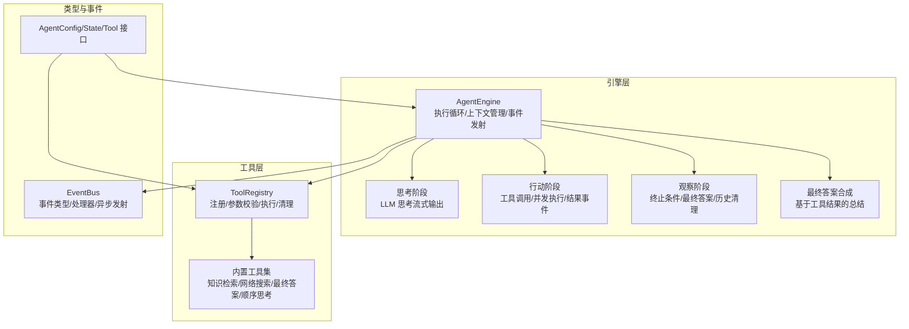
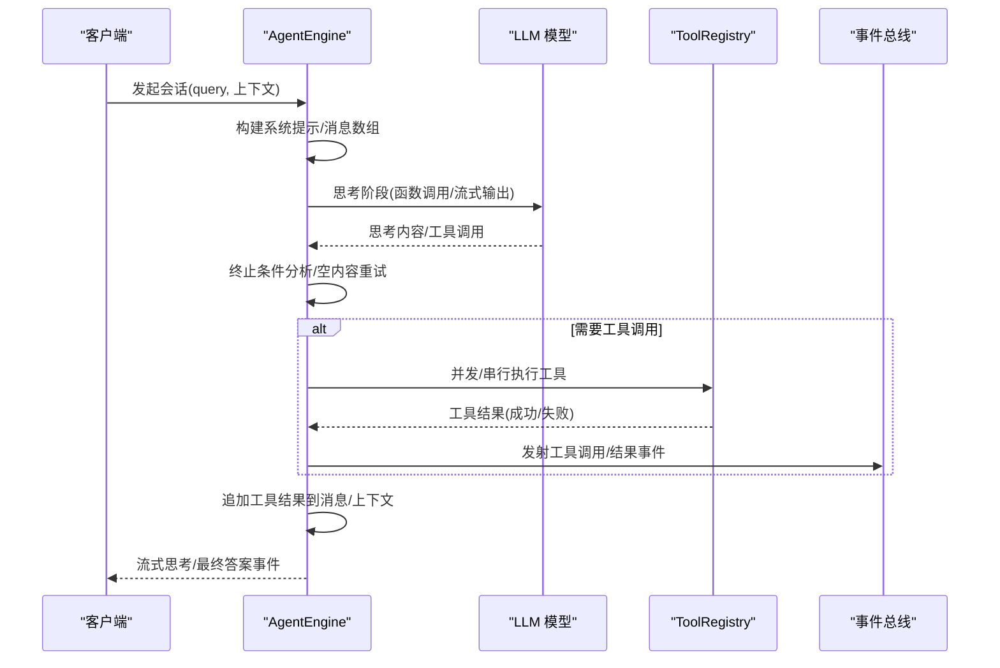
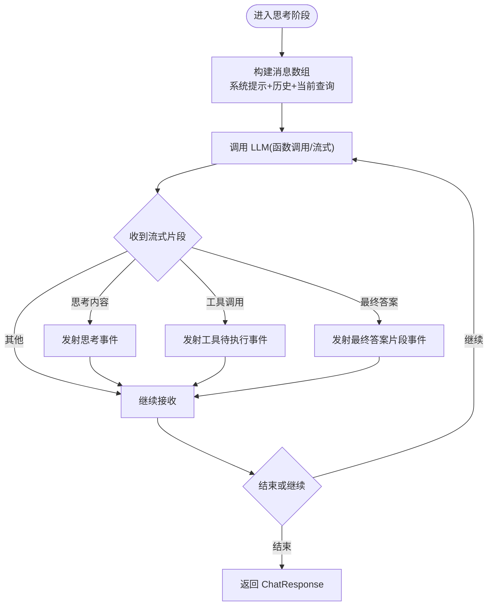
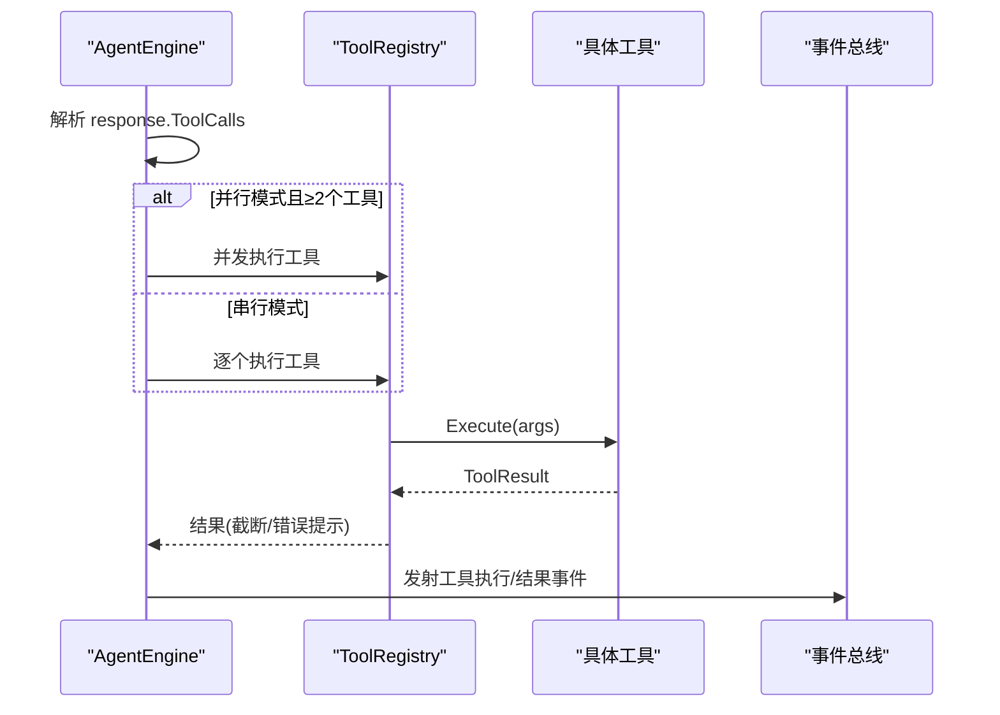
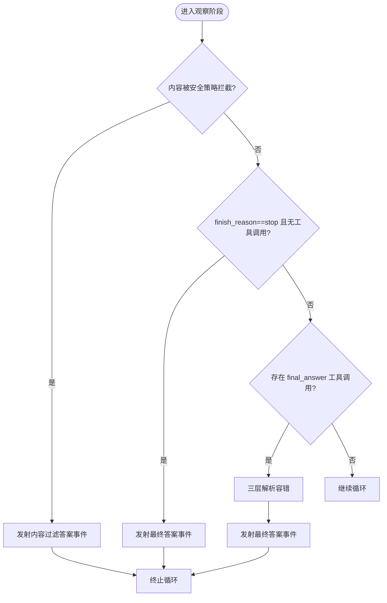
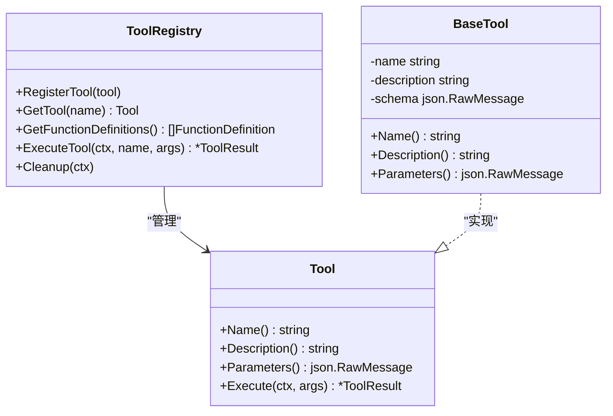
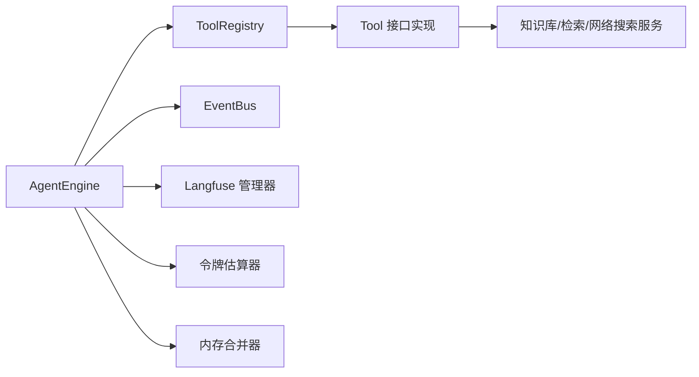

# 智能推理模式

<cite>
**本文引用的文件**
- [engine.go](file://internal/agent/engine.go)
- [think.go](file://internal/agent/think.go)
- [act.go](file://internal/agent/act.go)
- [observe.go](file://internal/agent/observe.go)
- [finalize.go](file://internal/agent/finalize.go)
- [prompts.go](file://internal/agent/prompts.go)
- [agent.go](file://internal/types/agent.go)
- [event.go](file://internal/event/event.go)
- [registry.go](file://internal/agent/tools/registry.go)
- [tool.go](file://internal/agent/tools/tool.go)
- [sequentialthinking.go](file://internal/agent/tools/sequentialthinking.go)
- [knowledge_search.go](file://internal/agent/tools/knowledge_search.go)
- [web_search.go](file://internal/agent/tools/web_search.go)
- [final_answer.go](file://internal/agent/tools/final_answer.go)
- [config.yaml](file://config/config.yaml)
</cite>

## 目录
1. [简介](#简介)
2. [项目结构](#项目结构)
3. [核心组件](#核心组件)
4. [架构总览](#架构总览)
5. [详细组件分析](#详细组件分析)
6. [依赖分析](#依赖分析)
7. [性能考虑](#性能考虑)
8. [故障排查指南](#故障排查指南)
9. [结论](#结论)
10. [附录](#附录)

## 简介
本技术文档围绕 WeKnora 的智能推理模式，系统性阐述 ReACT（思考-行动-观察）框架在代码层面的实现与运行机制。文档聚焦以下主题：
- ReACT 执行流程：思考阶段的消息构建、行动阶段的工具调用、观察阶段的终止条件判定与结果整合。
- 工具注册系统：工具定义、参数校验、参数修复、并发执行与资源清理。
- 错误处理与优雅降级：LLM 调用失败时的重试与“最终答案合成”降级策略。
- 推理链可视化：通过事件总线实时流式输出思考、工具调用、工具结果与最终答案。
- 性能监控与调试：上下文窗口管理、令牌估算、Langfuse 链路追踪、事件诊断日志。
- 配置定制与扩展：系统提示模板、工具白名单、最大迭代轮次、并行工具调用等。

## 项目结构
WeKnora 的智能推理模式主要由以下模块构成：
- 引擎层：负责 ReACT 循环调度、消息构建、上下文窗口管理、事件发射与链路追踪。
- 工具层：提供统一的工具注册、参数校验、执行与结果截断；内置多种检索与搜索工具。
- 类型与事件：定义 Agent 配置、状态、工具接口与事件类型，支撑前后端交互与可观测性。
- 提示词与系统提示：动态渲染系统提示，支持 Progressive RAG 与技能（Skills）注入。

**图表来源**
- [engine.go:28-92](file://internal/agent/engine.go#L28-L92)
- [think.go:92-230](file://internal/agent/think.go#L92-L230)
- [act.go:163-301](file://internal/agent/act.go#L163-L301)
- [observe.go:68-253](file://internal/agent/observe.go#L68-L253)
- [finalize.go:15-176](file://internal/agent/finalize.go#L15-L176)
- [registry.go:87-159](file://internal/agent/tools/registry.go#L87-L159)
- [agent.go:146-225](file://internal/types/agent.go#L146-L225)
- [event.go:11-65](file://internal/event/event.go#L11-L65)

**章节来源**
- [engine.go:158-298](file://internal/agent/engine.go#L158-L298)
- [prompts.go:318-375](file://internal/agent/prompts.go#L318-L375)
- [agent.go:13-65](file://internal/types/agent.go#L13-L65)

## 核心组件
- AgentEngine：ReACT 主引擎，封装执行循环、消息构建、上下文窗口管理、事件发射与链路追踪。
- ToolRegistry：工具注册中心，负责工具注册、参数类型转换与校验、执行与清理。
- 工具接口与基类：统一工具能力抽象，提供参数 Schema、执行入口与可选清理接口。
- 事件总线：定义 Agent 推理链中的思考、工具调用、工具结果、最终答案等事件类型，并支持同步/异步处理。
- 系统提示构建器：根据知识库、网络搜索开关、语言与技能注入动态生成系统提示。

**章节来源**
- [engine.go:28-92](file://internal/agent/engine.go#L28-L92)
- [registry.go:16-85](file://internal/agent/tools/registry.go#L16-L85)
- [tool.go:10-47](file://internal/agent/tools/tool.go#L10-L47)
- [event.go:11-65](file://internal/event/event.go#L11-L65)
- [prompts.go:318-375](file://internal/agent/prompts.go#L318-L375)

## 架构总览
ReACT 推理模式以 AgentEngine 为核心，按轮次（round）驱动思考-行动-观察循环。每轮内部以 Langfuse 分层追踪，细化到“agent.execute → agent.round.N → (chat + tools)”的结构，便于定位性能瓶颈与异常。

**图表来源**
- [engine.go:341-405](file://internal/agent/engine.go#L341-L405)
- [think.go:92-230](file://internal/agent/think.go#L92-L230)
- [act.go:163-301](file://internal/agent/act.go#L163-L301)
- [observe.go:68-253](file://internal/agent/observe.go#L68-L253)
- [finalize.go:15-176](file://internal/agent/finalize.go#L15-L176)

## 详细组件分析

### 思考阶段（Think）
- 流式思考：通过 ChatStream 获取内容增量，区分“思考内容”“工具调用”“最终答案”三类响应类型，分别映射到事件总线。
- 参数与行为：温度、思考模式、工具列表、是否并行工具调用等均在 ChatOptions 中传递。
- 结果封装：将流式片段拼接为完整内容，剥离思考块标记，记录 finish_reason 与用量统计。

**图表来源**
- [think.go:24-90](file://internal/agent/think.go#L24-L90)
- [think.go:92-230](file://internal/agent/think.go#L92-L230)

**章节来源**
- [think.go:24-90](file://internal/agent/think.go#L24-L90)
- [think.go:92-230](file://internal/agent/think.go#L92-L230)

### 行动阶段（Act）
- 工具解析：从 LLM 返回的工具调用中提取参数，尝试修复 JSON，再进行参数 Schema 校验。
- 并发执行：当开启并行工具调用且存在多个工具调用时，使用 errgroup 并发执行，保证兄弟工具不互相影响。
- 结果事件：发射工具执行事件与工具结果事件，包含成功与否、耗时、输出长度等指标。
- Langfuse 集成：为每个工具调用开启子 Span，记录输入/输出摘要与错误分类。

**图表来源**
- [act.go:163-301](file://internal/agent/act.go#L163-L301)
- [registry.go:87-159](file://internal/agent/tools/registry.go#L87-L159)

**章节来源**
- [act.go:163-301](file://internal/agent/act.go#L163-L301)
- [registry.go:87-159](file://internal/agent/tools/registry.go#L87-L159)

### 观察阶段（Observe）
- 终止条件判定：
  - 自然停止：finish_reason 为 stop 且无工具调用。
  - 内容过滤：finish_reason 为 content_filter。
  - 显式最终答案：检测到 final_answer 工具调用，采用三层解析容错（严格解析、修复 JSON、正则提取），确保循环终止。
- 历史管理：对历史中的知识库检索结果进行去敏化（替换为提示语），避免跨轮次使用过期检索结果。
- 上下文窗口管理：基于上次用量估算新增消息的令牌数，必要时压缩或合并历史消息。

**图表来源**
- [observe.go:68-253](file://internal/agent/observe.go#L68-L253)

**章节来源**
- [observe.go:68-253](file://internal/agent/observe.go#L68-L253)

### 最终答案合成（Finalize）
- 当达到最大迭代轮次仍未自然停止时，引擎会基于已收集的工具结果构建上下文，再次调用 LLM 生成最终答案，并通过事件总线流式输出。
- 若合成失败，回退为默认兜底文本并标记完成。

**章节来源**
- [finalize.go:15-176](file://internal/agent/finalize.go#L15-L176)

### 工具注册系统与参数校验
- 注册策略：首次命中优先（first-wins），防止名称冲突导致的劫持。
- 参数处理：先进行类型转换（如布尔/数值字符串），再进行 JSON Schema 校验，最后执行工具。
- 输出截断：超过阈值的工具输出会被截断，避免污染上下文窗口。
- 清理机制：会话结束时遍历清理实现了 Cleanable 接口的工具。

**图表来源**
- [registry.go:16-85](file://internal/agent/tools/registry.go#L16-L85)
- [tool.go:10-47](file://internal/agent/tools/tool.go#L10-L47)

**章节来源**
- [registry.go:43-171](file://internal/agent/tools/registry.go#L43-L171)
- [tool.go:10-47](file://internal/agent/tools/tool.go#L10-L47)

### 内置工具与扩展点
- 顺序思考工具：支持多步递归思考、修订与分支，适合复杂推理场景。
- 知识检索工具：向量/关键词混合检索，支持多查询与多知识库过滤。
- 网络搜索工具：KB 优先策略下的实时信息补充，支持会话级缓存与 RAG 压缩。
- 最终答案工具：作为终止信号，提供三层解析容错，避免重复输出。

**章节来源**
- [sequentialthinking.go:12-129](file://internal/agent/tools/sequentialthinking.go#L12-L129)
- [knowledge_search.go:22-103](file://internal/agent/tools/knowledge_search.go#L22-L103)
- [web_search.go:16-69](file://internal/agent/tools/web_search.go#L16-L69)
- [final_answer.go:13-43](file://internal/agent/tools/final_answer.go#L13-L43)

### 推理链可视化与事件流
- 事件类型覆盖：思考、工具调用、工具结果、最终答案、完成事件等。
- 流式输出：思考与最终答案通过事件总线以流式片段推送，前端可实时渲染。
- 事件聚合：完成事件包含最终答案、知识引用、步骤明细与总耗时，便于持久化与回放。

**章节来源**
- [event.go:11-65](file://internal/event/event.go#L11-L65)
- [think.go:121-230](file://internal/agent/think.go#L121-L230)
- [act.go:225-301](file://internal/agent/act.go#L225-L301)
- [observe.go:135-163](file://internal/agent/observe.go#L135-L163)
- [finalize.go:150-176](file://internal/agent/finalize.go#L150-L176)

## 依赖分析
- AgentEngine 依赖：
  - 工具注册中心：用于函数定义与工具执行。
  - 事件总线：用于发射推理链事件。
  - 上下文管理器：用于持久化消息。
  - Langfuse 管理器：用于链路追踪。
  - 令牌估算器与内存合并器：用于上下文窗口管理。
- 工具层依赖：
  - ToolRegistry 依赖工具接口与参数校验工具。
  - 具体工具依赖服务接口（知识库、检索、网络搜索等）。

**图表来源**
- [engine.go:28-92](file://internal/agent/engine.go#L28-L92)
- [registry.go:87-159](file://internal/agent/tools/registry.go#L87-L159)

**章节来源**
- [engine.go:28-92](file://internal/agent/engine.go#L28-L92)
- [registry.go:87-159](file://internal/agent/tools/registry.go#L87-L159)

## 性能考虑
- 上下文窗口管理：基于上次用量估算新增消息的令牌数，必要时压缩或合并历史消息，避免超出模型上下文上限。
- 并行工具调用：在满足并发度的前提下，使用 errgroup 并发执行工具，提升吞吐。
- 工具输出截断：限制单次工具输出长度，降低上下文污染风险。
- 流式输出：思考与最终答案均采用流式事件，减少前端等待时间。
- 链路追踪：Langfuse 分层追踪，便于定位热点与异常。

**章节来源**
- [engine.go:146-156](file://internal/agent/engine.go#L146-L156)
- [act.go:179-182](file://internal/agent/act.go#L179-L182)
- [registry.go:129-133](file://internal/agent/tools/registry.go#L129-L133)

## 故障排查指南
- LLM 调用失败：
  - 支持瞬时错误重试（超时、限流、服务器错误）。
  - 若已有工具结果，尝试“最终答案合成”，避免完全失败。
- 工具参数错误：
  - 参数类型转换与 JSON Schema 校验失败时，返回带指引的错误信息，便于 LLM 重试。
- 工具执行异常：
  - Langfuse 会记录错误分类与耗时，结合事件日志定位问题。
- 终止条件异常：
  - 若出现“空内容”或“重复内容”，引擎会触发重试或提前终止，避免死循环。

**章节来源**
- [think.go:282-323](file://internal/agent/think.go#L282-L323)
- [registry.go:113-125](file://internal/agent/tools/registry.go#L113-L125)
- [act.go:54-104](file://internal/agent/act.go#L54-L104)
- [observe.go:528-547](file://internal/agent/observe.go#L528-L547)

## 结论
WeKnora 的智能推理模式以 ReACT 为核心，通过严格的思考-行动-观察闭环、完善的工具注册与参数校验体系、以及事件驱动的流式输出与链路追踪，实现了高鲁棒性与可观测性的智能推理体验。开发者可通过系统提示模板、工具白名单、最大迭代轮次与并行工具调用等配置进行定制，并通过 Langfuse 与事件日志进行性能监控与调试。

## 附录

### 配置定制与扩展建议
- 系统提示模板：通过配置文件中的模板 ID 动态加载，支持 Progressive RAG 与技能注入。
- 工具白名单：在 AgentConfig 中设置 allowed_tools，限制可用工具集合。
- 最大迭代轮次：控制 ReACT 循环次数，避免长时间占用。
- 并行工具调用：在工具数量较多时启用，提升吞吐。
- 最大上下文令牌：根据模型能力调整，配合内存合并器与压缩策略。
- 网络搜索开关：遵循“KB 优先”规则，仅在检索不足时启用。

**章节来源**
- [config.yaml:1-113](file://config/config.yaml#L1-L113)
- [prompts.go:318-375](file://internal/agent/prompts.go#L318-L375)
- [agent.go:13-65](file://internal/types/agent.go#L13-L65)