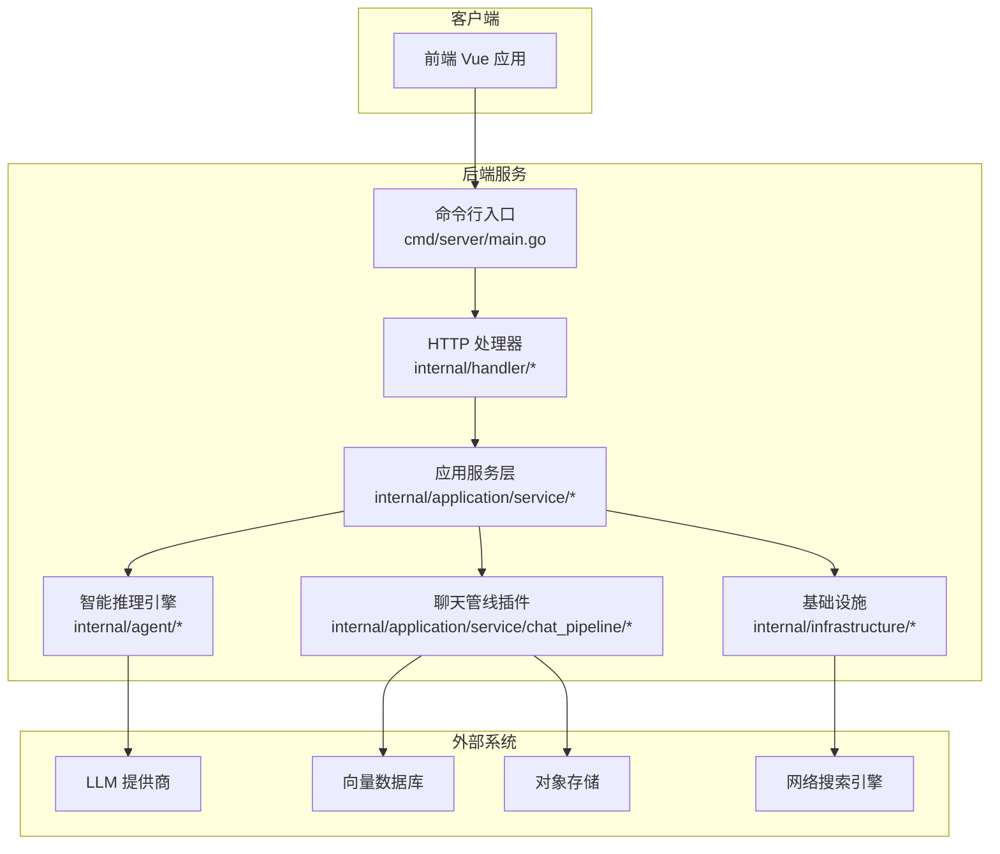
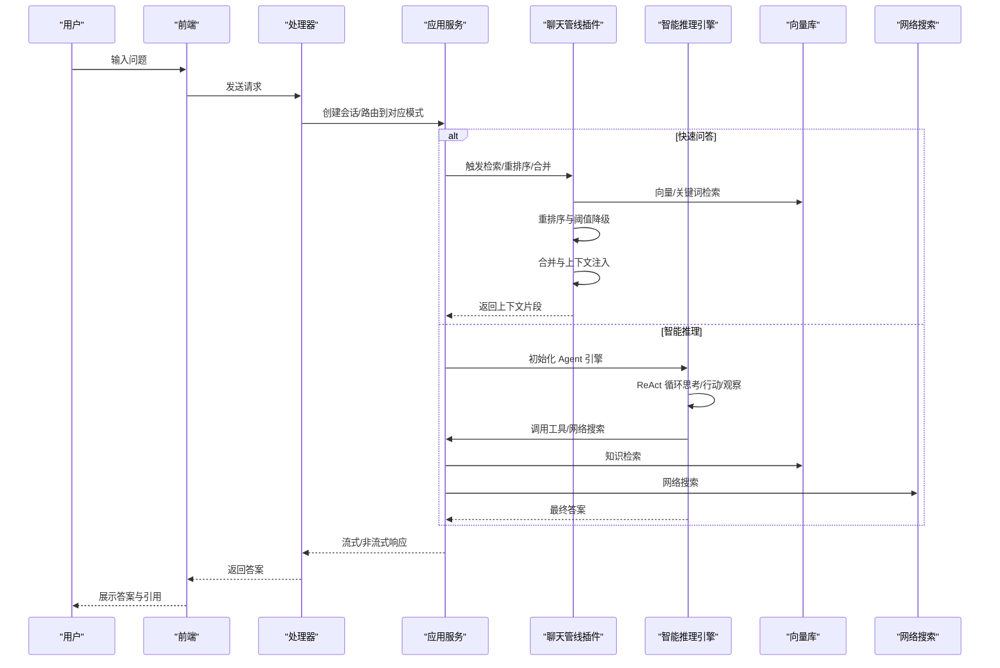
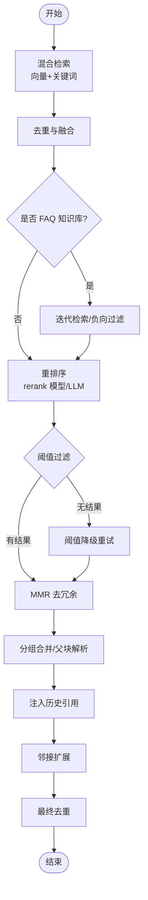
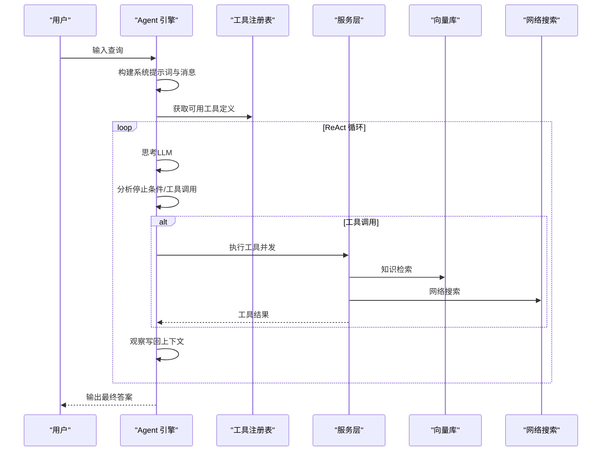
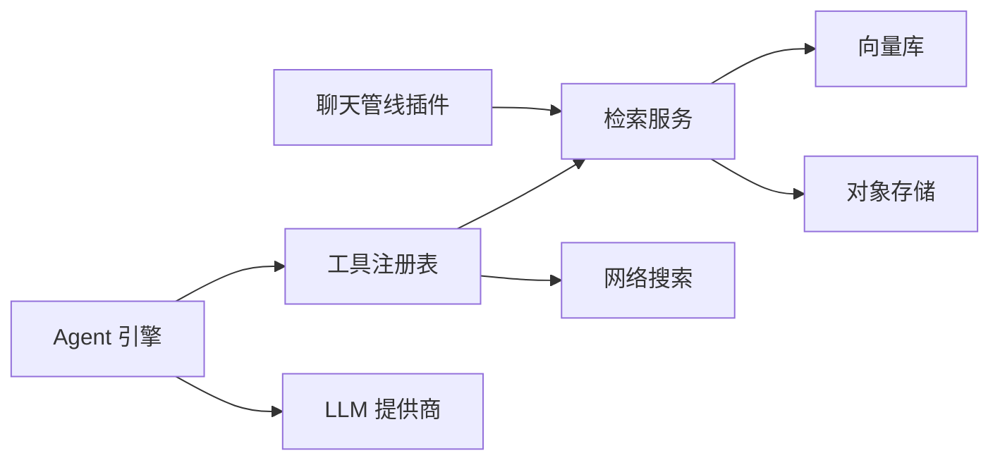

# 智能问答系统

<cite>
**本文引用的文件**
- [README.md](file://README.md)
- [chat_pipeline/rerank.go](file://internal/application/service/chat_pipeline/rerank.go)
- [chat_pipeline/merge.go](file://internal/application/service/chat_pipeline/merge.go)
- [agent/engine.go](file://internal/agent/engine.go)
- [agent/tools/knowledge_search.go](file://internal/agent/tools/knowledge_search.go)
- [application/service/knowledgebase_search.go](file://internal/application/service/knowledgebase_search.go)
- [application/service/knowledgebase_search_faq.go](file://internal/application/service/knowledgebase_search_faq.go)
- [application/service/custom_agent.go](file://internal/application/service/custom_agent.go)
- [config/prompt_templates/agent_system_prompt.yaml](file://config/prompt_templates/agent_system_prompt.yaml)
- [config/prompt_templates/generate_questions.yaml](file://config/prompt_templates/generate_questions.yaml)
- [frontend/src/views/chat/index.vue](file://frontend/src/views/chat/index.vue)
- [frontend/src/views/creatChat/creatChat.vue](file://frontend/src/views/creatChat/creatChat.vue)
- [frontend/src/api/chat/index.ts](file://frontend/src/api/chat/index.ts)
- [internal/infrastructure/web_search/registry.go](file://internal/infrastructure/web_search/registry.go)
- [internal/handler/web_search_provider.go](file://internal/handler/web_search_provider.go)
- [internal/application/service/web_search.go](file://internal/application/service/web_search.go)
</cite>

## 目录
1. [简介](#简介)
2. [项目结构](#项目结构)
3. [核心组件](#核心组件)
4. [架构总览](#架构总览)
5. [详细组件分析](#详细组件分析)
6. [依赖关系分析](#依赖关系分析)
7. [性能考虑](#性能考虑)
8. [故障排查指南](#故障排查指南)
9. [结论](#结论)
10. [附录](#附录)

## 简介
WeKnora 是一个企业级文档理解与语义检索驱动的智能问答框架，支持两种问答模式：
- 快速问答（Quick Q&A）：基于 RAG 的检索增强生成，快速返回相关片段并生成答案，适合日常知识查询。
- 智能推理（Intelligent Reasoning）：基于 ReAct Agent 引擎的多步推理，自主编排知识检索、MCP 工具调用与网络搜索，逐步反思与合成最终结论，适合多源融合与复杂任务。

系统具备模块化设计，可替换 LLM、向量库与存储后端，并支持本地与私有云部署，确保数据主权。同时提供知识助手、浏览器扩展、IM 渠道集成等能力，覆盖从数据导入到对话交付的全链路场景。

## 项目结构
仓库采用分层与领域驱动的组织方式：
- cmd：服务入口（桌面应用与后端服务）
- internal：核心业务逻辑（应用层、领域层、基础设施层）
- frontend：前端应用（Vue3 + TypeScript）
- config：配置模板（提示词、预设）
- docs：产品文档与 API 文档
- docker/docker-compose：容器化与编排
- scripts：构建与运维脚本

图表来源
- [README.md:164-169](file://README.md#L164-L169)
- [frontend/src/api/chat/index.ts:1-39](file://frontend/src/api/chat/index.ts#L1-L39)

章节来源
- [README.md:164-169](file://README.md#L164-L169)
- [README.md:333-349](file://README.md#L333-L349)

## 核心组件
- 快速问答（RAG 管线）
  - 检索阶段：混合检索（向量 + 关键词），去重与融合
  - 重排序阶段：基于 rerank 模型或 LLM 的二次排序，阈值降级与 MMR 去冗余
  - 合并与上下文注入：父子块解析、历史引用注入、邻接扩展与最终去重
- 智能推理（ReAct Agent）
  - ReAct 循环：思考 → 分析 → 行动（工具调用/网络搜索）→ 观察
  - 工具系统：内置工具、MCP 工具、网络搜索；并发工具调用与图像自动描述
  - 上下文管理：令牌预算估计、消息截断与记忆整合
- 检索策略与优化
  - 多源融合：向量、关键词、FAQ、图谱（可选）、Wiki、网络搜索
  - FAQ 特化：迭代检索与负向问题过滤
  - 重排序与多样性：阈值降级、FAQ 加权、MMR
- 建议问题与会话管理
  - 建议问题：AI 生成与 Wiki 回退，按桶轮询保证多样性
  - 会话标题生成、消息加载与流式输出

章节来源
- [README.md:47-48](file://README.md#L47-L48)
- [README.md:170-211](file://README.md#L170-L211)

## 架构总览
下图展示了从用户输入到最终答案的端到端流程，涵盖快速问答与智能推理两条主线：

图表来源
- [frontend/src/api/chat/index.ts:17-34](file://frontend/src/api/chat/index.ts#L17-L34)
- [internal/agent/engine.go:158-298](file://internal/agent/engine.go#L158-L298)
- [internal/application/service/chat_pipeline/rerank.go:36-206](file://internal/application/service/chat_pipeline/rerank.go#L36-L206)
- [internal/application/service/chat_pipeline/merge.go:33-96](file://internal/application/service/chat_pipeline/merge.go#L33-L96)

## 详细组件分析

### 快速问答（RAG 管线）
- 检索与融合
  - 混合检索：向量相似度与关键词匹配并行执行，随后进行去重与融合
  - FAQ 特化：对 FAQ 知识库采用迭代检索与负向问题过滤，提升召回质量
- 重排序与阈值降级
  - 支持 rerank 模型或 LLM 重排序，若无结果则自动降低阈值重试
  - FAQ 结果单独处理并可加权
  - 使用 MMR 控制多样性，避免高度相似片段堆叠
- 合并与上下文注入
  - 基于知识库与块类型分组，合并重叠范围
  - 父子块解析（如子文本块解析为父文本块），增强上下文
  - 注入历史引用，短上下文通过邻接块扩展，最终去重

图表来源
- [internal/application/service/knowledgebase_search.go:128-159](file://internal/application/service/knowledgebase_search.go#L128-L159)
- [internal/application/service/knowledgebase_search_faq.go:50-105](file://internal/application/service/knowledgebase_search_faq.go#L50-L105)
- [internal/application/service/chat_pipeline/rerank.go:108-206](file://internal/application/service/chat_pipeline/rerank.go#L108-L206)
- [internal/application/service/chat_pipeline/merge.go:149-208](file://internal/application/service/chat_pipeline/merge.go#L149-L208)

章节来源
- [internal/application/service/knowledgebase_search.go:128-159](file://internal/application/service/knowledgebase_search.go#L128-L159)
- [internal/application/service/knowledgebase_search_faq.go:50-105](file://internal/application/service/knowledgebase_search_faq.go#L50-L105)
- [internal/application/service/chat_pipeline/rerank.go:108-206](file://internal/application/service/chat_pipeline/rerank.go#L108-L206)
- [internal/application/service/chat_pipeline/merge.go:149-208](file://internal/application/service/chat_pipeline/merge.go#L149-L208)

### 智能推理（ReAct Agent）
- ReAct 循环
  - 思考：基于系统提示词与上下文生成下一步行动
  - 分析：判断是否自然停止、是否调用 final_answer 工具
  - 行动：并发执行工具调用（知识检索、网络搜索、MCP 工具）
  - 观察：将工具结果写回上下文，准备下一轮
- 工具系统
  - 知识检索工具：支持多查询、多 KB 作用域、阈值与 TopK 参数、LLM/模型重排序、MMR 去冗余
  - 并发工具调用：使用 errgroup 并行执行多个工具，加速复杂任务
  - 图像自动描述：对 MCP 工具返回的图片进行 VLM 描述，补充文本上下文
- 上下文管理
  - 令牌预算估计：结合上次用量与增量估算，动态截断消息
  - 记忆整合：可选的记忆整理器用于长对话摘要
  - 空内容兜底：连续空内容检测与重试策略

图表来源
- [internal/agent/engine.go:341-405](file://internal/agent/engine.go#L341-L405)
- [internal/agent/engine.go:422-603](file://internal/agent/engine.go#L422-L603)
- [internal/agent/tools/knowledge_search.go:161-429](file://internal/agent/tools/knowledge_search.go#L161-L429)

章节来源
- [internal/agent/engine.go:341-405](file://internal/agent/engine.go#L341-L405)
- [internal/agent/engine.go:422-603](file://internal/agent/engine.go#L422-L603)
- [internal/agent/tools/knowledge_search.go:161-429](file://internal/agent/tools/knowledge_search.go#L161-L429)

### 检索策略与响应优化
- 重排序与阈值降级
  - 若重排序后无结果且阈值较高，自动以 0.7 折扣再次尝试
  - FAQ 结果可按系数加权，优先级高于普通块
- MMR 去冗余
  - 基于 Jaccard 相似度最大化相关性、最小化冗余
- 父子块解析与图像信息聚合
  - 小文本块解析为父文本块，获得更完整上下文
  - 图像 OCR 与 Caption 合并到检索片段，提升图文检索效果
- 历史引用与邻接扩展
  - 将近期相关检索结果作为上下文注入，减少重复展示
  - 对短上下文片段向前后扩展，提高可读性

章节来源
- [internal/application/service/chat_pipeline/rerank.go:113-130](file://internal/application/service/chat_pipeline/rerank.go#L113-L130)
- [internal/application/service/chat_pipeline/rerank.go:154-181](file://internal/application/service/chat_pipeline/rerank.go#L154-L181)
- [internal/application/service/chat_pipeline/merge.go:210-371](file://internal/application/service/chat_pipeline/merge.go#L210-L371)
- [internal/application/service/chat_pipeline/merge.go:373-466](file://internal/application/service/chat_pipeline/merge.go#L373-L466)

### 建议问题生成与多轮对话
- 建议问题来源
  - 文档块：AI 生成的问题（question_generation 模板）
  - Wiki 页面：未启用嵌入模型的 Wiki 作为回退来源
  - 桶内随机 + 轮询跨桶选择，保证多样性
- 前端交互
  - 切换 Agent/知识库/文件时防抖请求，避免频繁刷新
  - 点击建议问题直接触发发送

章节来源
- [internal/application/service/custom_agent.go:552-637](file://internal/application/service/custom_agent.go#L552-L637)
- [config/prompt_templates/generate_questions.yaml:1-27](file://config/prompt_templates/generate_questions.yaml#L1-L27)
- [frontend/src/views/chat/index.vue:166-189](file://frontend/src/views/chat/index.vue#L166-L189)
- [frontend/src/views/creatChat/creatChat.vue:145-171](file://frontend/src/views/creatChat/creatChat.vue#L145-L171)

### 网络搜索与工具调用系统
- 网络搜索提供者注册
  - 通过注册表按类型创建提供者实例，支持代理参数合并
- 提供者生命周期
  - 创建/更新/删除/测试连接（支持持久化与临时测试）
- Agent 中的工具调用
  - 知识检索工具：多查询、多 KB 作用域、阈值与 TopK、LLM/模型重排序、MMR
  - 并发工具调用：提升复杂任务执行效率

章节来源
- [internal/infrastructure/web_search/registry.go:1-45](file://internal/infrastructure/web_search/registry.go#L1-L45)
- [internal/handler/web_search_provider.go:76-307](file://internal/handler/web_search_provider.go#L76-L307)
- [internal/application/service/web_search.go:85-118](file://internal/application/service/web_search.go#L85-L118)
- [internal/agent/tools/knowledge_search.go:161-429](file://internal/agent/tools/knowledge_search.go#L161-L429)

## 依赖关系分析
- 组件耦合
  - 聊天管线插件与检索服务解耦，便于独立演进与替换
  - Agent 引擎通过工具注册表与服务层解耦，支持 MCP 工具扩展
- 外部依赖
  - LLM 提供商、向量数据库、对象存储、网络搜索引擎
- 可能的循环依赖
  - 通过接口与事件总线避免循环引用，保持单向数据流

图表来源
- [internal/application/service/chat_pipeline/rerank.go:17-29](file://internal/application/service/chat_pipeline/rerank.go#L17-L29)
- [internal/agent/engine.go:28-46](file://internal/agent/engine.go#L28-L46)
- [internal/agent/tools/knowledge_search.go:124-136](file://internal/agent/tools/knowledge_search.go#L124-L136)

章节来源
- [internal/application/service/chat_pipeline/rerank.go:17-29](file://internal/application/service/chat_pipeline/rerank.go#L17-L29)
- [internal/agent/engine.go:28-46](file://internal/agent/engine.go#L28-L46)
- [internal/agent/tools/knowledge_search.go:124-136](file://internal/agent/tools/knowledge_search.go#L124-L136)

## 性能考虑
- 检索性能
  - 模型键聚合：相同嵌入模型的 KB 目标合并，复用查询向量
  - 并发检索：按模型键分组并行执行，缩短总延迟
  - TopK 与阈值：合理设置 TopK 与阈值，平衡召回与性能
- 重排序与去冗余
  - 阈值降级：在高阈值无结果时自动降级，提升成功率
  - MMR：控制候选多样性，避免重复信息导致的上下文膨胀
- 上下文管理
  - 令牌预算估计：结合上次用量与增量估算，避免超限
  - 截断策略：优先保留最新消息与关键上下文
- 工具调用
  - 并发执行：多工具并行，缩短复杂任务总耗时
  - 图像描述：仅对工具返回的图片进行 VLM 描述，避免不必要的计算

章节来源
- [internal/agent/tools/knowledge_search.go:455-627](file://internal/agent/tools/knowledge_search.go#L455-L627)
- [internal/application/service/chat_pipeline/rerank.go:113-130](file://internal/application/service/chat_pipeline/rerank.go#L113-L130)
- [internal/application/service/chat_pipeline/rerank.go:345-426](file://internal/application/service/chat_pipeline/rerank.go#L345-L426)
- [internal/agent/engine.go:146-156](file://internal/agent/engine.go#L146-L156)

## 故障排查指南
- 重排序无结果
  - 检查 rerank 模型 ID 与阈值配置，必要时启用阈值降级
  - 确认候选片段非空，必要时调整清洗规则
- 重排序模型调用失败
  - 回退到 LLM 重排序路径，检查提示词与最大令牌数
- 工具调用异常
  - 查看工具执行日志与错误码，确认参数校验与类型转换
  - 对并发工具调用，关注 errgroup 的错误传播
- 网络搜索不可用
  - 检查提供者类型与参数，使用测试接口验证连通性
- 建议问题为空
  - 确认知识库中存在 AI 生成问题或 Wiki 页面
  - 检查桶内轮询逻辑与限制数量

章节来源
- [internal/application/service/chat_pipeline/rerank.go:63-71](file://internal/application/service/chat_pipeline/rerank.go#L63-L71)
- [internal/application/service/chat_pipeline/rerank.go:238-245](file://internal/application/service/chat_pipeline/rerank.go#L238-L245)
- [internal/agent/engine.go:362-374](file://internal/agent/engine.go#L362-L374)
- [internal/handler/web_search_provider.go:281-298](file://internal/handler/web_search_provider.go#L281-L298)
- [internal/application/service/custom_agent.go:552-637](file://internal/application/service/custom_agent.go#L552-L637)

## 结论
WeKnora 通过模块化设计与可替换架构，在快速问答与智能推理两大模式间实现了灵活切换与深度优化。RAG 管线在检索、重排序与合并阶段引入多项工程化策略，显著提升了召回质量与上下文一致性；ReAct Agent 则通过严谨的循环控制、工具系统与上下文管理，支撑复杂任务的多源融合与最终答案生成。配合建议问题与网络搜索能力，系统在易用性与实用性之间取得良好平衡，适合企业级知识管理与智能问答场景。

## 附录
- API 示例（前端）
  - 快速问答：POST /api/v1/knowledge-chat/{session_id}
  - 智能推理：POST /api/v1/agent-chat/{session_id}

章节来源
- [frontend/src/api/chat/index.ts:17-34](file://frontend/src/api/chat/index.ts#L17-L34)