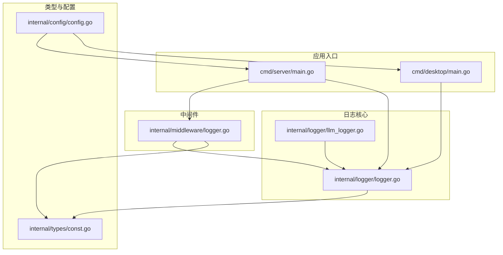
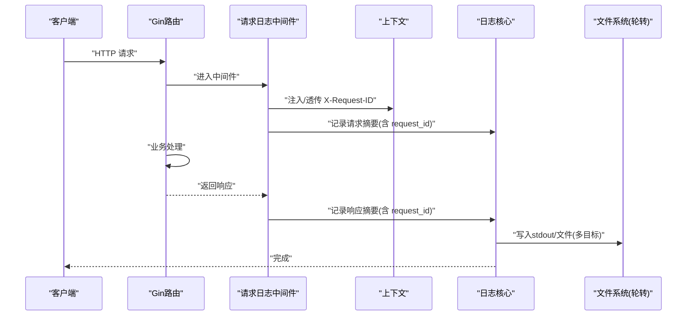
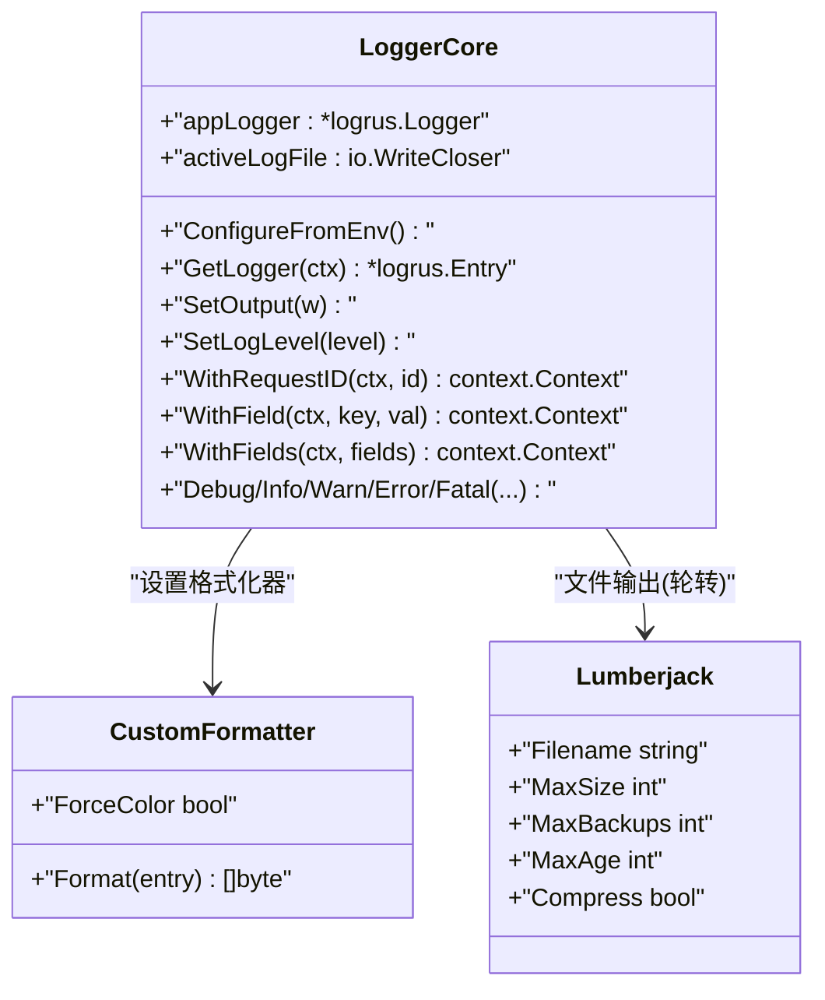
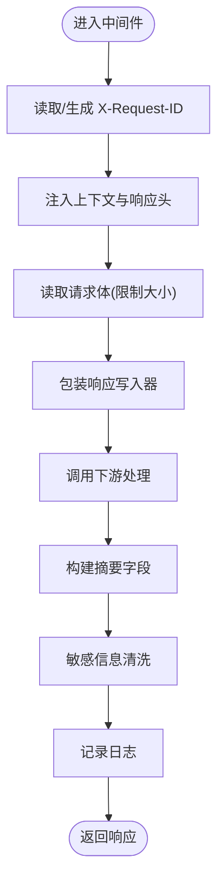
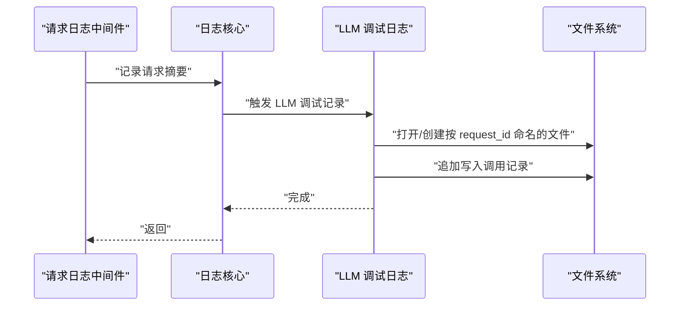
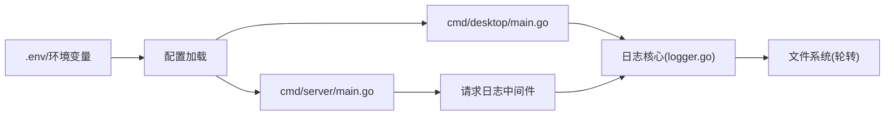

# 日志系统

<cite>
**本文引用的文件**
- [internal/logger/logger.go](file://internal/logger/logger.go)
- [internal/logger/llm_logger.go](file://internal/logger/llm_logger.go)
- [internal/middleware/logger.go](file://internal/middleware/logger.go)
- [cmd/server/main.go](file://cmd/server/main.go)
- [cmd/desktop/main.go](file://cmd/desktop/main.go)
- [internal/types/const.go](file://internal/types/const.go)
- [internal/config/config.go](file://internal/config/config.go)
</cite>

## 目录
1. [简介](#简介)
2. [项目结构](#项目结构)
3. [核心组件](#核心组件)
4. [架构总览](#架构总览)
5. [详细组件分析](#详细组件分析)
6. [依赖关系分析](#依赖关系分析)
7. [性能考量](#性能考量)
8. [故障排查指南](#故障排查指南)
9. [结论](#结论)
10. [附录](#附录)

## 简介
本文件为 WeKnora 的日志系统技术文档，围绕基于 Logrus 的日志架构进行深入说明，涵盖以下主题：
- 结构化日志实现与字段组织
- 日志级别管理与彩色输出格式化
- 环境变量驱动的动态配置（LOG_LEVEL、LOG_PATH）
- 日志上下文管理、请求 ID 跟踪与调用者信息记录
- 日志轮转机制、文件输出与多目标输出策略
- LLM 专用调试日志与按请求聚合
- 最佳实践、性能优化与故障排查

该文档面向开发者与运维工程师，提供从架构到落地使用的完整指导。

## 项目结构
WeKnora 的日志体系主要分布在如下模块：
- 日志核心与格式化：internal/logger/logger.go
- LLM 调试日志与文件轮转：internal/logger/llm_logger.go
- 请求级日志中间件：internal/middleware/logger.go
- 应用入口与环境初始化：cmd/server/main.go、cmd/desktop/main.go
- 上下文键定义：internal/types/const.go
- 配置与环境变量解析：internal/config/config.go

图表来源
- [internal/logger/logger.go:141-184](file://internal/logger/logger.go#L141-L184)
- [internal/logger/llm_logger.go:19-50](file://internal/logger/llm_logger.go#L19-L50)
- [internal/middleware/logger.go:108-138](file://internal/middleware/logger.go#L108-L138)
- [cmd/server/main.go:43-124](file://cmd/server/main.go#L43-L124)
- [cmd/desktop/main.go:148-167](file://cmd/desktop/main.go#L148-L167)
- [internal/types/const.go:6-30](file://internal/types/const.go#L6-L30)
- [internal/config/config.go:342-438](file://internal/config/config.go#L342-L438)

章节来源
- [internal/logger/logger.go:141-184](file://internal/logger/logger.go#L141-L184)
- [internal/logger/llm_logger.go:19-50](file://internal/logger/llm_logger.go#L19-L50)
- [internal/middleware/logger.go:108-138](file://internal/middleware/logger.go#L108-L138)
- [cmd/server/main.go:43-124](file://cmd/server/main.go#L43-L124)
- [cmd/desktop/main.go:148-167](file://cmd/desktop/main.go#L148-L167)
- [internal/types/const.go:6-30](file://internal/types/const.go#L6-L30)
- [internal/config/config.go:342-438](file://internal/config/config.go#L342-L438)

## 核心组件
- 日志核心与格式化器
  - 使用私有 logrus 实例，避免外部改写全局状态导致日志丢失
  - 自定义格式化器支持彩色输出、字段排序、调用者信息与 request_id 优先展示
  - 支持从环境变量动态配置日志级别与输出路径，并自动启用文件轮转
- 请求级日志中间件
  - 自动生成/透传 X-Request-ID，注入上下文并记录请求/响应摘要
  - 敏感字段清洗与内容截断，避免泄露与内存膨胀
- LLM 专用调试日志
  - 条件开启，按 LOG_PATH 推导目录或默认 llm_debug，定期清理旧文件
  - 按 request_id 聚合写入独立文件，便于端到端追踪
- 上下文与键
  - 统一的 ContextKey，包含 LoggerContextKey、RequestIDContextKey 等
  - CloneContext 保证跨边界传递关键上下文（含 Langfuse Trace）

章节来源
- [internal/logger/logger.go:20-56](file://internal/logger/logger.go#L20-L56)
- [internal/logger/logger.go:54-138](file://internal/logger/logger.go#L54-L138)
- [internal/logger/logger.go:147-184](file://internal/logger/logger.go#L147-L184)
- [internal/logger/llm_logger.go:23-50](file://internal/logger/llm_logger.go#L23-L50)
- [internal/middleware/logger.go:108-236](file://internal/middleware/logger.go#L108-L236)
- [internal/types/const.go:6-30](file://internal/types/const.go#L6-L30)
- [internal/logger/logger.go:388-413](file://internal/logger/logger.go#L388-L413)

## 架构总览
WeKnora 的日志架构采用“中间件收集 + 核心日志 + 可选 LLM 调试”的分层设计：
- 中间件负责请求生命周期内的摘要与敏感信息处理
- 核心日志负责统一格式化、级别控制、输出目标与轮转
- LLM 调试日志独立于主日志，按需启用并按请求聚合

图表来源
- [internal/middleware/logger.go:108-236](file://internal/middleware/logger.go#L108-L236)
- [internal/logger/logger.go:147-184](file://internal/logger/logger.go#L147-L184)
- [internal/logger/logger.go:276-290](file://internal/logger/logger.go#L276-L290)

## 详细组件分析

### 日志核心与格式化器
- 私有实例与锁保护
  - 使用 appLogger 私有实例，配合互斥锁，避免并发配置冲突
- 环境变量配置
  - LOG_LEVEL：支持 debug/info/warn/error/fatal，默认 debug
  - LOG_PATH：日志文件路径，为空时回退至 macOS 应用日志目录
  - ConfigureFromEnv：在 main() 后可重新应用环境变量变更
- 彩色输出与字段格式
  - 按级别着色，时间戳、request_id、其余字段排序输出
  - request_id 优先，error 字段高亮
- 调用者信息
  - 自动注入 caller 字段（文件:行[函数]），便于定位
- 多目标输出
  - 默认 stdout；当 LOG_PATH 有效时，使用 MultiWriter 同时输出到文件
- 文件轮转
  - 使用 lumberjack，单文件最大 50MB，保留 3 份，最大 28 天，压缩

图表来源
- [internal/logger/logger.go:20-56](file://internal/logger/logger.go#L20-L56)
- [internal/logger/logger.go:54-138](file://internal/logger/logger.go#L54-L138)
- [internal/logger/logger.go:147-184](file://internal/logger/logger.go#L147-L184)
- [internal/logger/logger.go:276-290](file://internal/logger/logger.go#L276-L290)

章节来源
- [internal/logger/logger.go:20-56](file://internal/logger/logger.go#L20-L56)
- [internal/logger/logger.go:54-138](file://internal/logger/logger.go#L54-L138)
- [internal/logger/logger.go:147-184](file://internal/logger/logger.go#L147-L184)
- [internal/logger/logger.go:276-290](file://internal/logger/logger.go#L276-L290)

### 请求级日志中间件
- 请求 ID 管理
  - 从请求头读取或生成 UUID，设置响应头并注入上下文
  - 使用安全清洗函数，避免敏感信息泄露
- 请求/响应摘要
  - 限制 body 记录大小，非文本类型跳过
  - SSE 流式响应特殊处理，避免内存膨胀
- 日志字段
  - request_id、method、path、status_code、size、latency、client_ip
  - 可选 request_body、response_body（经清洗）

图表来源
- [internal/middleware/logger.go:108-236](file://internal/middleware/logger.go#L108-L236)

章节来源
- [internal/middleware/logger.go:108-236](file://internal/middleware/logger.go#L108-L236)

### LLM 专用调试日志
- 启用条件
  - LLM_DEBUG_LOG 环境变量为 true/1 或指定目录时启用
  - 默认目录：LOG_PATH 所在目录下的 llm_debug，或 macOS 应用日志目录下的 llm_debug
- 文件聚合
  - 按 request_id 命名文件，相同 request_id 的调用追加写入
  - 单次调用格式化为带分隔与时间戳的块
- 清理策略
  - 启动时异步清理超过 7 天的历史文件

图表来源
- [internal/logger/llm_logger.go:23-50](file://internal/logger/llm_logger.go#L23-L50)
- [internal/logger/llm_logger.go:88-111](file://internal/logger/llm_logger.go#L88-L111)
- [internal/logger/llm_logger.go:113-152](file://internal/logger/llm_logger.go#L113-L152)

章节来源
- [internal/logger/llm_logger.go:23-50](file://internal/logger/llm_logger.go#L23-L50)
- [internal/logger/llm_logger.go:88-111](file://internal/logger/llm_logger.go#L88-L111)
- [internal/logger/llm_logger.go:113-152](file://internal/logger/llm_logger.go#L113-L152)

### 上下文与键
- 统一 ContextKey 定义，包含 LoggerContextKey、RequestIDContextKey、LangfuseTraceContextKey 等
- CloneContext 保证关键上下文在克隆时被保留，便于跨边界传递

章节来源
- [internal/types/const.go:6-30](file://internal/types/const.go#L6-L30)
- [internal/logger/logger.go:388-413](file://internal/logger/logger.go#L388-L413)

## 依赖关系分析
- 入口与环境
  - cmd/server/main.go 与 cmd/desktop/main.go 在启动时加载 .env 并调用 ConfigureFromEnv，使 LOG_LEVEL、LOG_PATH 生效
- 中间件与日志核心
  - 请求日志中间件依赖日志核心获取 Entry，并通过 WithField 注入 request_id
- 配置与环境变量
  - 配置加载支持环境变量替换，但日志核心通过独立逻辑解析 LOG_LEVEL、LOG_PATH

图表来源
- [cmd/server/main.go:43-124](file://cmd/server/main.go#L43-L124)
- [cmd/desktop/main.go:148-167](file://cmd/desktop/main.go#L148-L167)
- [internal/middleware/logger.go:108-236](file://internal/middleware/logger.go#L108-L236)
- [internal/logger/logger.go:147-184](file://internal/logger/logger.go#L147-L184)

章节来源
- [cmd/server/main.go:43-124](file://cmd/server/main.go#L43-L124)
- [cmd/desktop/main.go:148-167](file://cmd/desktop/main.go#L148-L167)
- [internal/middleware/logger.go:108-236](file://internal/middleware/logger.go#L108-L236)
- [internal/logger/logger.go:147-184](file://internal/logger/logger.go#L147-L184)

## 性能考量
- 中间件读取请求体与响应体时的内存限制，避免 SSE 等流式响应导致内存无限增长
- 日志字段排序与字符串拼接在格式化器中进行，建议减少不必要的字段注入
- 文件轮转参数（单文件大小、备份数、保留天数）可根据磁盘与 IO 压力调整
- 非终端环境自动禁用 ANSI 颜色，避免日志聚合工具解析异常

[本节为通用性能建议，无需特定文件引用]

## 故障排查指南
- 环境变量未生效
  - 确认在加载 .env 之后调用 ConfigureFromEnv
  - 检查 LOG_LEVEL 值是否为 debug/info/warn/error/fatal
- 日志未落盘
  - 检查 LOG_PATH 是否可写，目录是否存在
  - 确认 openLogFile 成功，lumberjack 初始化正常
- 请求 ID 未出现
  - 确认中间件已注册且未被提前中断
  - 检查 WithField 注入是否成功
- LLM 调试日志未生成
  - 检查 LLM_DEBUG_LOG 是否为 true/1 或指定目录
  - 确认 llm_debug 目录存在且可写
- 颜色异常
  - 非终端（容器/CI）会自动禁用颜色，属预期行为

章节来源
- [internal/logger/logger.go:147-184](file://internal/logger/logger.go#L147-L184)
- [internal/logger/logger.go:276-290](file://internal/logger/logger.go#L276-L290)
- [internal/middleware/logger.go:108-236](file://internal/middleware/logger.go#L108-L236)
- [internal/logger/llm_logger.go:23-50](file://internal/logger/llm_logger.go#L23-L50)

## 结论
WeKnora 的日志系统以 Logrus 为核心，结合中间件与专用 LLM 调试日志，实现了：
- 结构化、可读性强的输出格式
- 动态环境变量配置与文件轮转
- 请求级上下文与调用者信息
- 多目标输出与可选 LLM 调试聚合
该体系兼顾开发可观测性与生产稳定性，适合在复杂分布式场景中使用。

[本节为总结，无需特定文件引用]

## 附录

### 环境变量与默认行为
- LOG_LEVEL：日志级别，支持 debug/info/warn/error/fatal，默认 debug
- LOG_PATH：日志文件路径；为空时在 macOS 下回退到应用日志目录
- LLM_DEBUG_LOG：启用 LLM 调试日志，true/1 或指定目录；默认 llm_debug

章节来源
- [internal/logger/logger.go:226-245](file://internal/logger/logger.go#L226-L245)
- [internal/logger/logger.go:247-252](file://internal/logger/logger.go#L247-L252)
- [internal/logger/llm_logger.go:23-50](file://internal/logger/llm_logger.go#L23-L50)

### 关键 API 与使用要点
- ConfigureFromEnv：在 main() 后重新应用 LOG_LEVEL/LOG_PATH
- GetLogger(ctx)：从上下文中获取带 request_id 的 Entry
- WithRequestID/WithField/WithFields：便捷注入上下文与字段
- Logger 中间件：自动记录请求摘要并清洗敏感信息
- LLMDebugLog：按 request_id 写入专用文件，便于端到端调试

章节来源
- [internal/logger/logger.go:147-192](file://internal/logger/logger.go#L147-L192)
- [internal/logger/logger.go:309-324](file://internal/logger/logger.go#L309-L324)
- [internal/middleware/logger.go:108-236](file://internal/middleware/logger.go#L108-L236)
- [internal/logger/llm_logger.go:88-111](file://internal/logger/llm_logger.go#L88-L111)